#### 20180731 Park ranger Ismael Galvez in El Triunfo Biosphere Reserve in Mexico for World Ranger Day (© Chico Sanchez/Aurora Photos)(Bing United Kingdom)

#### 20180730 Children play under a parachute in Kolkata, India, for International Day of Friendship (© Rupak De Chowdhuri/Reuters)(Bing United Kingdom)

#### 20180729 A Bengal tiger called ‘Krishna' or ‘T19’ in Ranthambore National Park, India (© Andy Rouse/Minden Pictures)(Bing United Kingdom)

#### 20180729 People on a swing ride at a carnival (© Peter Burian/Aurora Photos)(Bing United States)

#### 20180729 ｢隅田川花火｣東京, 中央区 (© ZhangXun/Getty Images)(Bing Japan)

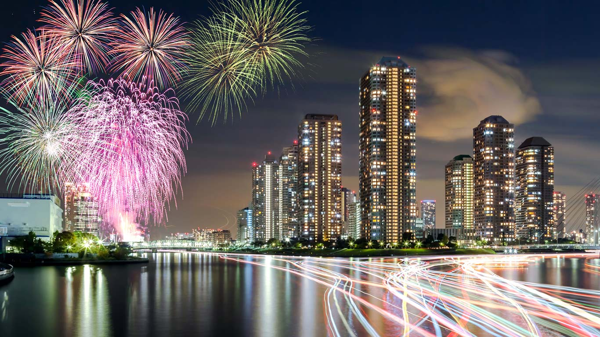

#### 20180728 American flamingo chicks at the Ría Lagartos Biosphere Reserve, Yucatan Peninsula, Mexico (© Claudio Contreras/Minden Pictures)(Bing United Kingdom)

#### 20180727 Composite image of the 31 January 2018 lunar eclipse seen from Tokyo, Japan (© Kazuhiro Nogi/Getty Images)(Bing United Kingdom)

#### 20180727 Ein Halsbandsittich vor seiner Nisthöhle an einer Platane, Mannheim, Baden-Württemberg, Deutschland (© Kerstin Hinze/Minden Pictures)(Bing Deutschland)

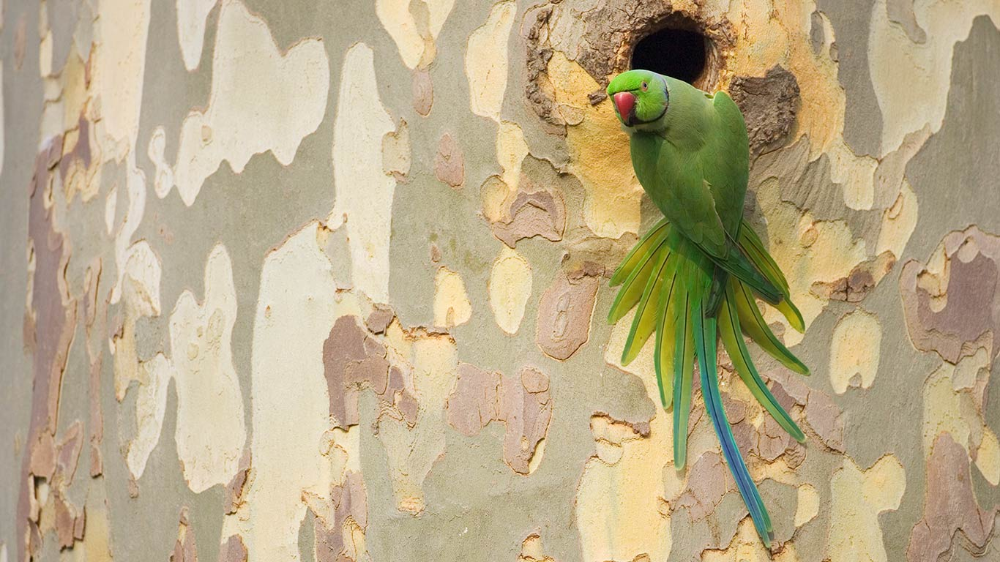

#### 20180726 Middle Falls at Letchworth State Park, New York, USA (© Posnov/Moment/Getty Images)(Bing United Kingdom)

#### 20180725 'Rocky Shore' watercolour by artist Winslow Homer, Bermuda, 1900. From the collection of the Museum of Fine Arts, Boston, USA (© Alamy)(Bing United Kingdom)

#### 20180725 Emerald Lake with the peaks of the President Range in Yoho National Park, B.C. (© David Noton/Minden Pictures)(Bing Canada)

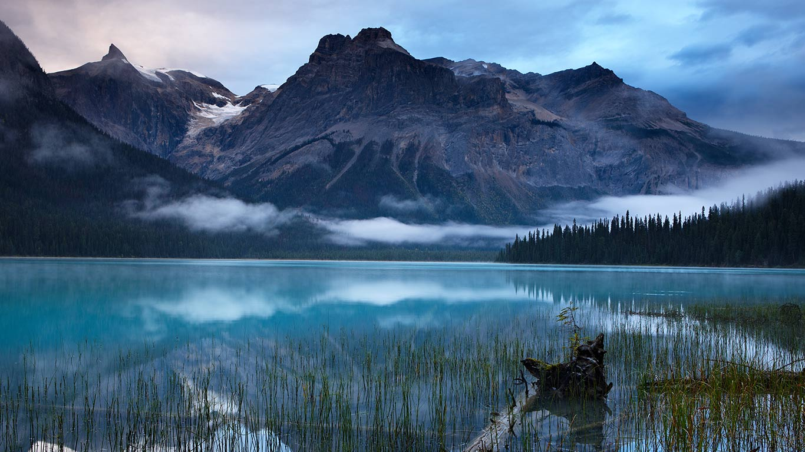

#### 20180724 Beach huts in Southwold, Suffolk (© James Barrett/Alamy)(Bing United Kingdom)

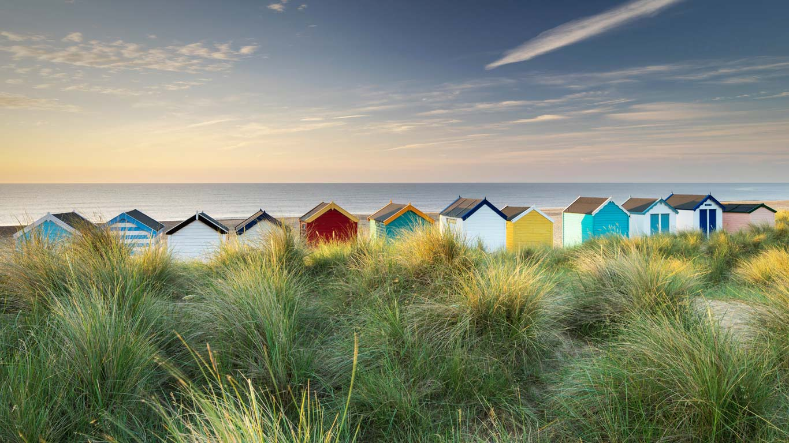

#### 20180723 Hanging lamps at the Mori Building Digital Art Museum in Tokyo (© Behrouz Mehri/Getty Images)(Bing United Kingdom)

#### 20180723 ｢霧に覆われるクリチバ｣ブラジル, パラナ州 (© Quandt Photography/Getty Images)(Bing Japan)

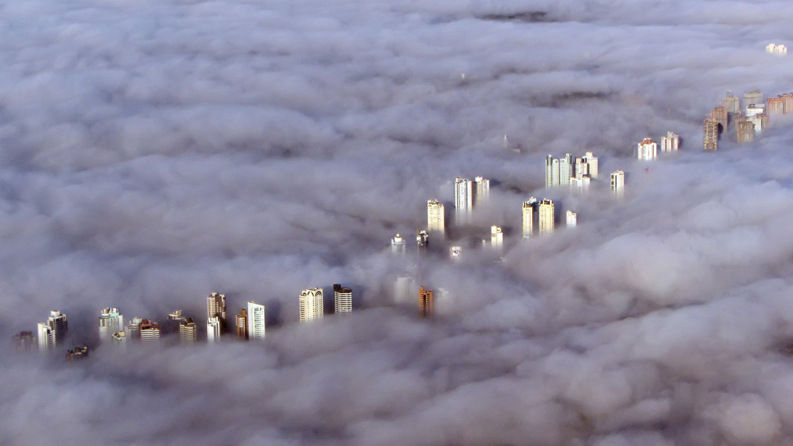

#### 20180722 Candles floating in the Ganges, Varanasi, India (© Mint Images/Aurora Photos)(Bing United Kingdom)

#### 20180721 Comet moth in Ranomafana National Park, Madagascar (© Robin Hoskyns/Minden Pictures)(Bing United Kingdom)

#### 20180720 Der Hof der Elemente im Kunsthof Dresden, Sachsen, Deutschland (© Heinz-Joachim Jockschat/Huber Images/eStock Photo)(Bing Deutschland)

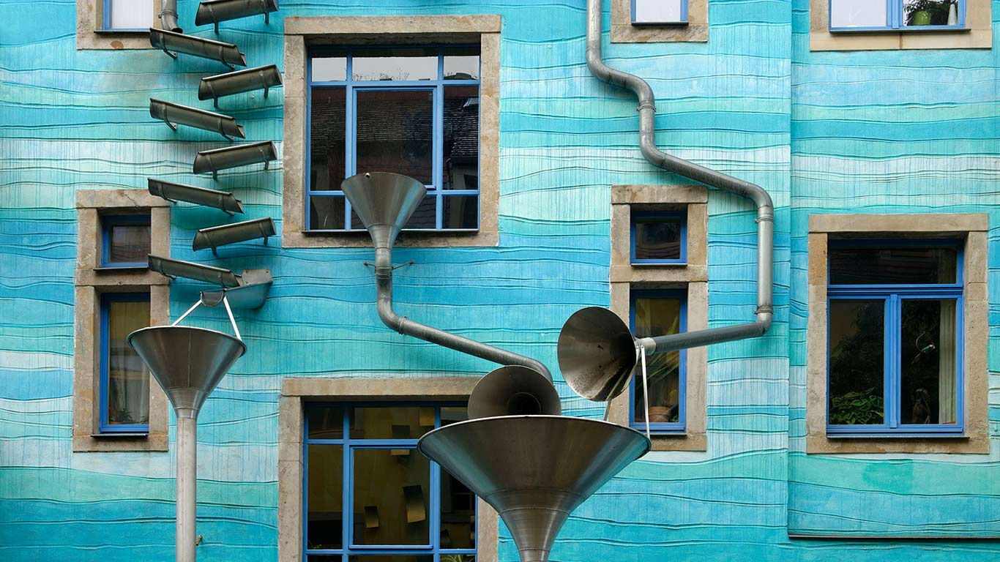

#### 20180720 Composite of photographs from the Apollo 15 mission, 1971 (© NASA)(Bing United Kingdom)

#### 20180719 Rugged peaks and braided rivers in the Peel Watershed, Yukon (© Paul Nicklen/Getty Images)(Bing Canada)

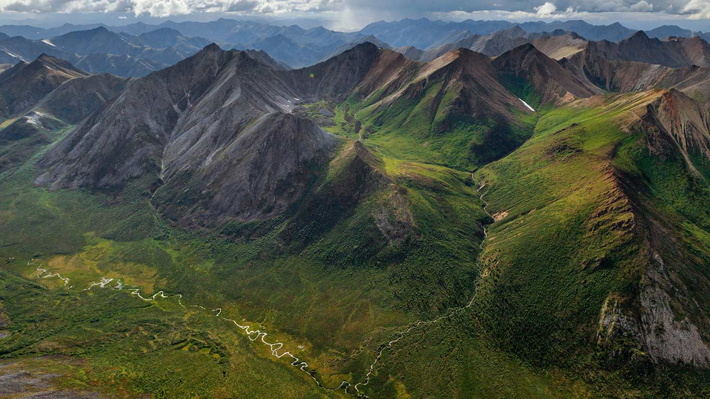

#### 20180719 Costumed attendees at the 2014 San Diego Comic-Con International (© Sandy Huffaker/Reuters)(Bing United Kingdom)

#### 20180718 ｢パンパスギツネ｣南米, パンパ (© Global_Pics/Getty Images)(Bing Japan)

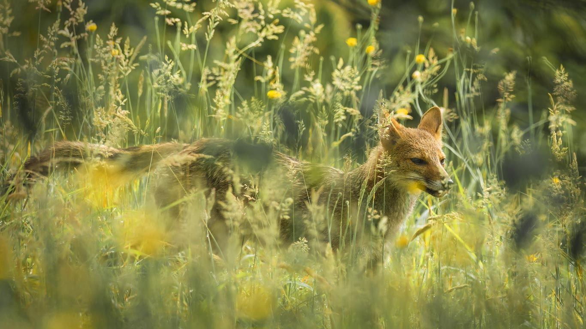

#### 20180718 Nelson Mandela monument by artist Marco Cianfanelli near Howick, South Africa (© Andy Trevaskis/Alamy Stock Photo)(Bing United Kingdom)

#### 20180717 Les Bleus célébrant leur titre de Champions du monde au stade Loujniki, Moscou, Russie (© Matthias Hangst/Getty Images)(Bing France)

#### 20180717 Stink bug eggs on a leaf in Madagascar (© Paul Bertner/Minden Pictures)(Bing United Kingdom)

#### 20180716 Une foule en liesse après la Victoire des Bleus face à la Belgique en demi-finale de la Coupe du monde, Champs-Élysées, France (© Charles Platiau/REUTERS)(Bing France)

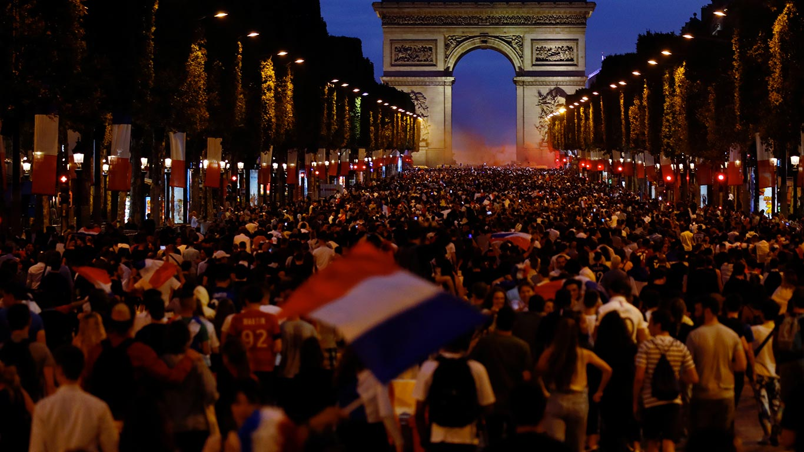

#### 20180716 People in the 'Urban Light' sculpture by Chris Burden at LACMA in Los Angeles, California, USA (© Victor Decolongon/Getty Images)(Bing United Kingdom)

#### 20180716 一群男孩儿在日落时分的沙滩上踢足球， 巴西福塔雷萨 (© National Geographic/Offset/Shutterstock)(Bing China)

#### 20180715 Fish-eye view of Luzhniki Stadium in Moscow, Russia, during a 2018 World Cup match (© Simon Hofmann - FIFA/FIFA via Getty Images)(Bing United States)

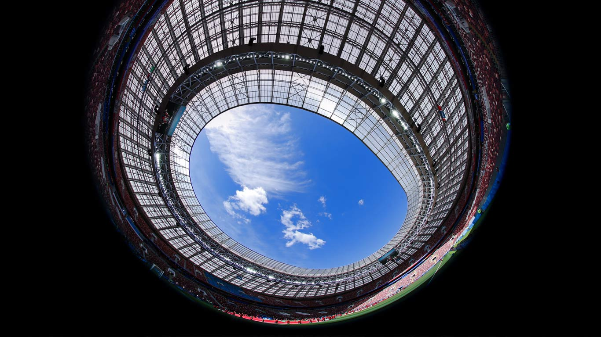

#### 20180715 Fanions de drapeaux de la France décorant des immeubles à l’occasion du 14 juillet, Dieulefit, Auvergne-Rhône-Alpes, France (© StockCube/Shutterstock)(Bing France)

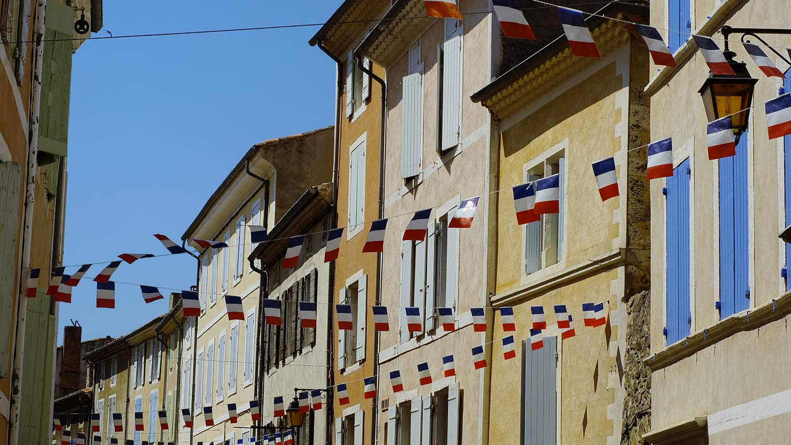

#### 20180715 Macro photograph of a migrant hawker dragonfly (© Petar Sabol Sharpeye/REX/Shutterstock)(Bing United Kingdom)

#### 20180714 ｢ソスペルのバルコニー｣フランス, プロヴァンス＝アルプ＝コート・ダジュール (© Rolf E. Staerk/Shutterstock)(Bing Japan)

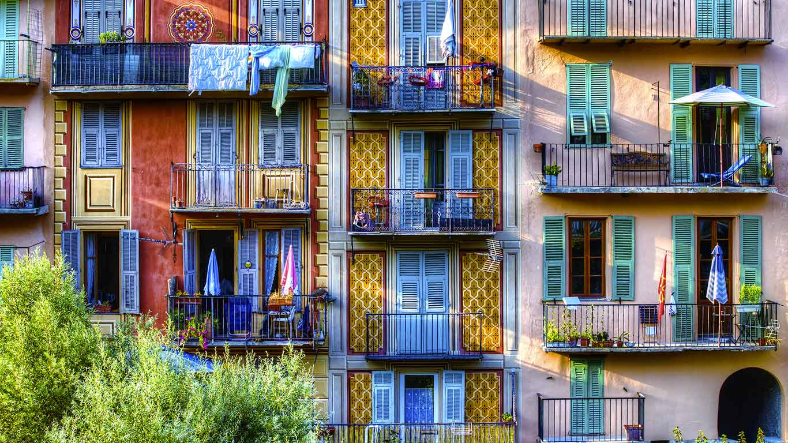

#### 20180714 Blue shark near Cork, Ireland (© Cultura/REX/Shutterstock)(Bing United Kingdom)

#### 20180713 View of the Rock of Gibraltar (© Panther Media GmbH/Alamy)(Bing United Kingdom)

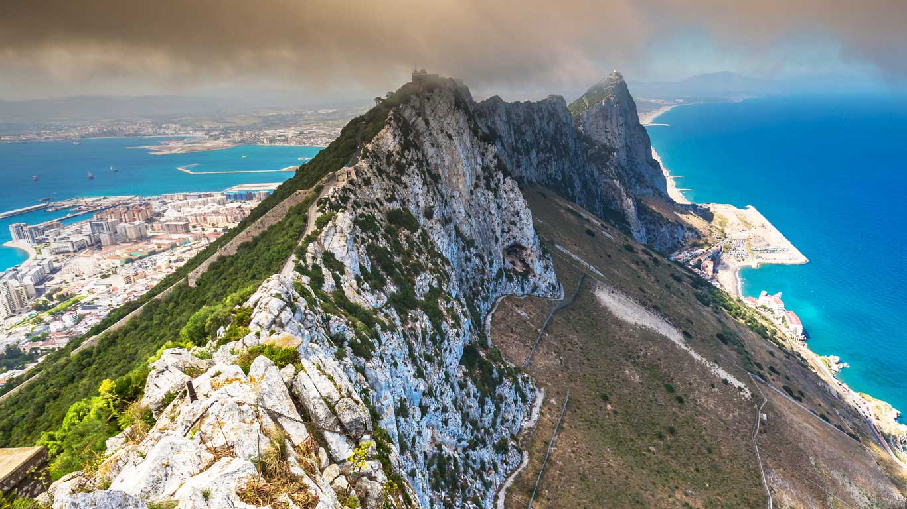

#### 20180713 ｢夏のヒマラヤ山脈｣インド, ラダック (© Ivan Kmit/Alamy Stock Photo)(Bing Japan)

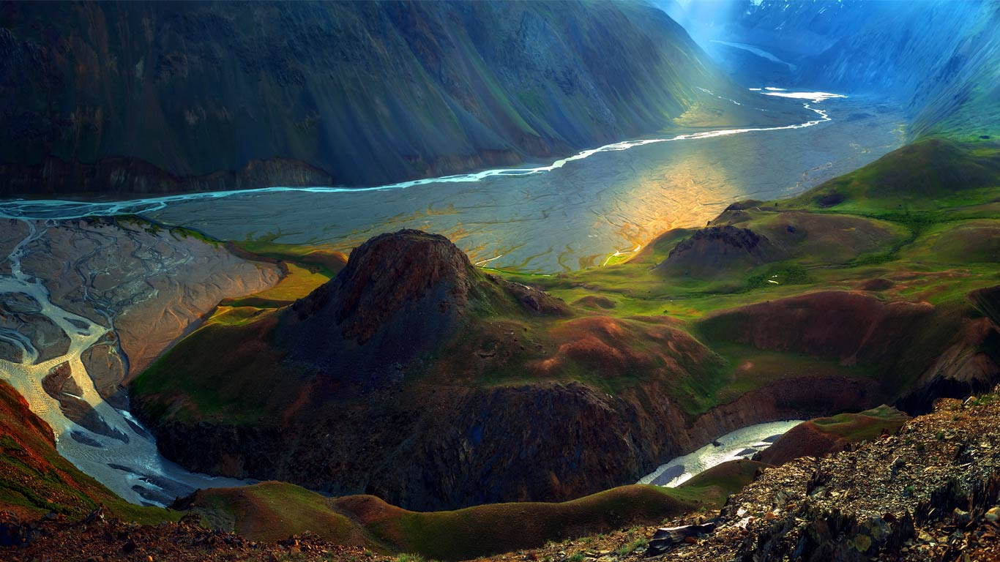

#### 20180712 【今日中国航海节】纪念郑和下西洋 (© SMETEK/SCIENCE PHOTO LIBRARY)(Bing China)

#### 20180712 The Royal Canadian Mounted Police Musical Ride at the Calgary Stampede Rodeo in Calgary (© REUTERS/Todd Korol)(Bing Canada)

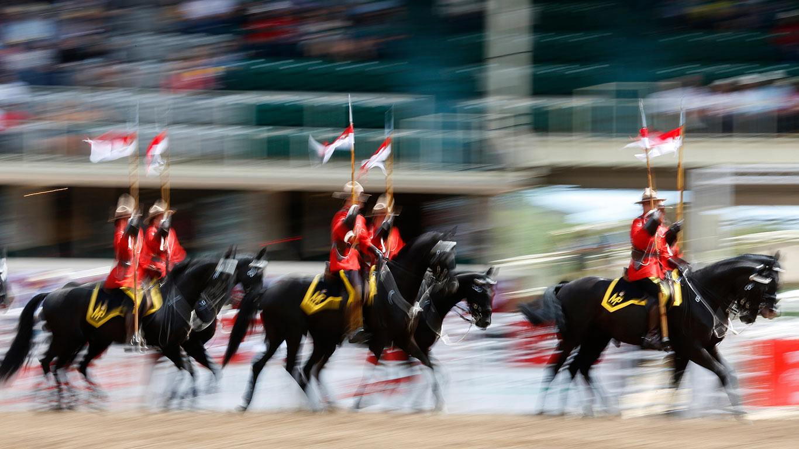

#### 20180712 Blooming field of lavender at Sénanque Abbey, Gordes, Vaucluse, Provence-Alpes-Côte d'Azur, France (© Carlos Sanchez Pereyra/plainpicture)(Bing United Kingdom)

#### 20180711 An Atlantic puffin inspects a nesting burrow on Skomer Island, Wales (© Danny Green/Minden Pictures)(Bing United Kingdom)

#### 20180711 Vertäute Boote auf dem Rurstausee im Nationalpark Eifel, Nordrhein-Westfalen, Deutschland (© Hans Blossey/Getty Images)(Bing Deutschland)

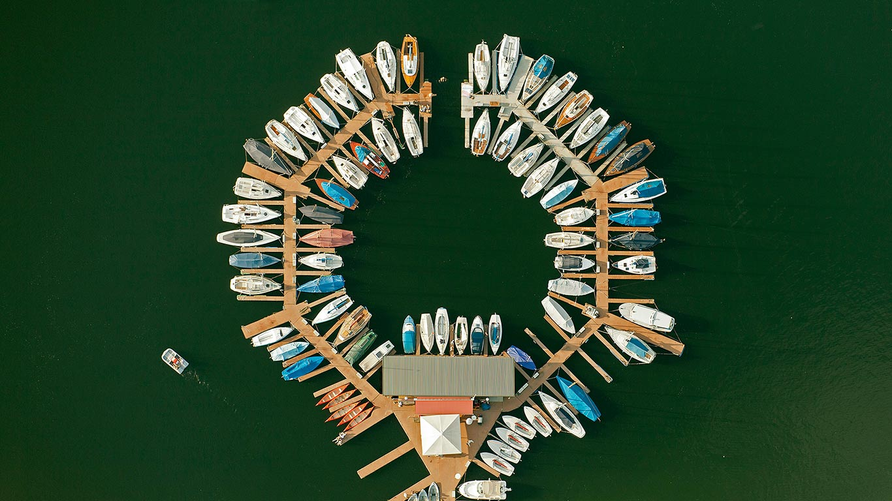

#### 20180711 View of Big Ben and the Palace of Westminster through a pedestrian tunnel, London, England (© Stefan Kunert/Westend61/Offset)(Bing United States)

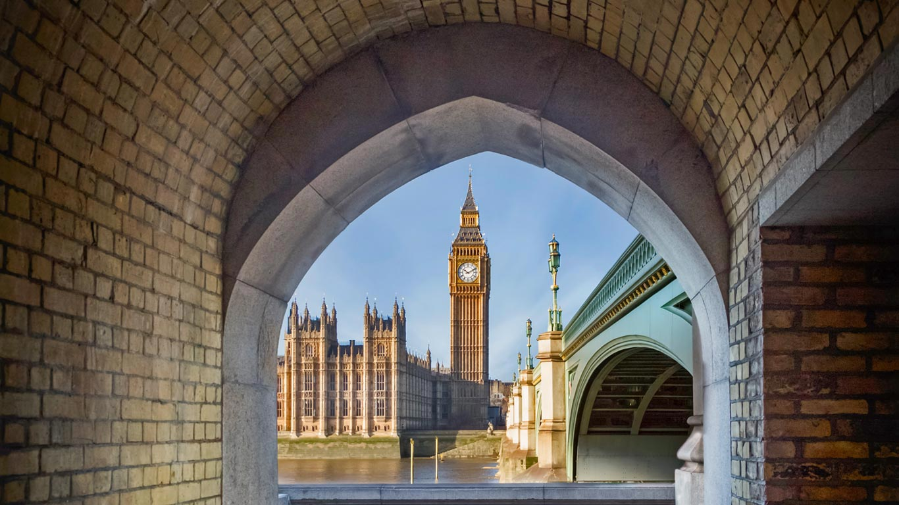

#### 20180710 View of Fremont Peak in the Bridger Wilderness of Bridger-Teton National Forest, Wyoming, USA (© Don Paulson/Danita Delimont)(Bing United Kingdom)

#### 20180709 The pygmy three-toed sloth swimming near Isla Escudo de Veraguas, Panama (© Suzi Eszterhas/Minden Pictures)(Bing United Kingdom)

#### 20180709 Gaucho festival in San Antonio de Areco, Buenos Aires Province, Argentina (© Eliseo Miciu)(Bing United States)

#### 20180708 ｢七夕飾り｣宮城, 仙台 (© nosonjai/Shutterstock)(Bing Japan)

#### 20180708 Cyclists ride along tree-lined roads during the Tour de France in 2016 (© Michael Steele/Getty Images Sport)(Bing United Kingdom)

#### 20180708 Flamenco dance performance, Andalusia, Spain (© Michelle Chaplow/Alamy)(Bing United States)

#### 20180707 The Palace of Westminster illuminated in rainbow colours for Pride in London in 2017 (© Oversnap/Getty Images)(Bing United Kingdom)

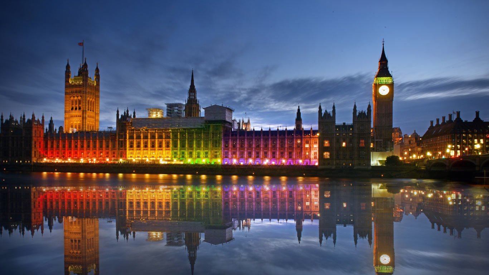

#### 20180706 Giant panda cubs, China (© Mitsuaki Iwago/Minden Pictures)(Bing United Kingdom)

#### 20180705 Student nurses at an anatomy class on the roof of St James' Hospital, Balham, London, in 1958 (© Reg Speller/Fox Photos/Hulton Archive/Getty Images)(Bing United Kingdom)

#### 20180704 Fourth of July fireworks in Morton, Minnesota (© Joel Sartore/National Geographic/Offset)(Bing United States)

#### 20180704 Buttermere in the Lake District (© Robert Harding/Markus Lange/plainpicture)(Bing United Kingdom)

#### 20180703 Green sea turtle at dusk, Mayotte, Indian Ocean (© Gabriel Barathieu/Biosphoto/Minden Pictures)(Bing United Kingdom)

#### 20180703 Sandhill Crane during summer around Thessalon, Ont. (© Tom Lynn/Aurora Photos)(Bing Canada)

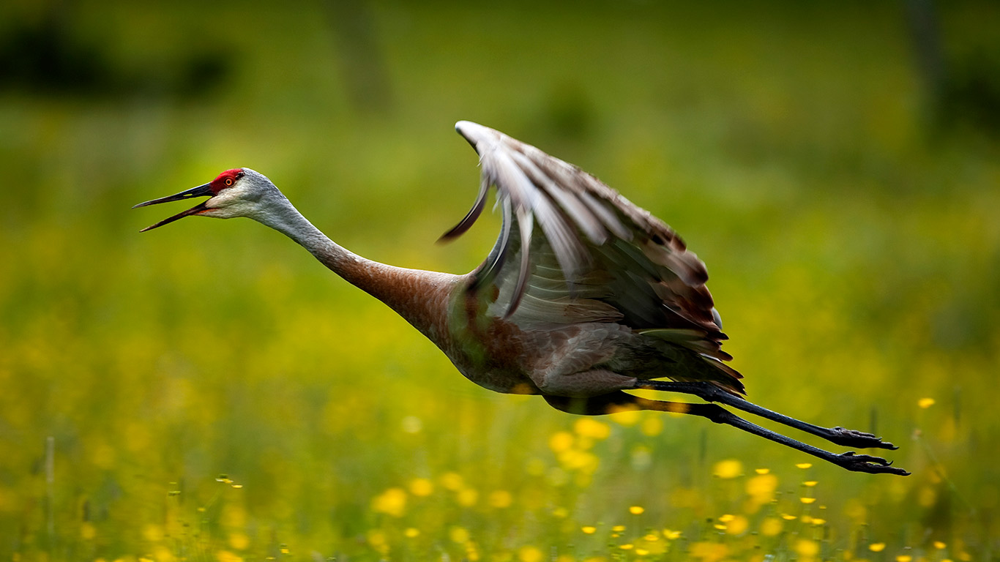

#### 20180703 The monument to the 155th Pennsylvania Infantry at Gettysburg, Pennsylvania (© Tetra Images/Getty Images)(Bing United States)

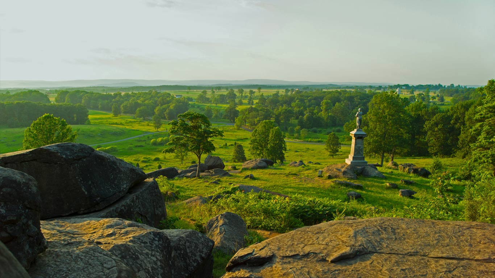

#### 20180702 Spectators wearing hats at Wimbledon in 2017 (© Oli Scarff/Getty Images)(Bing United Kingdom)

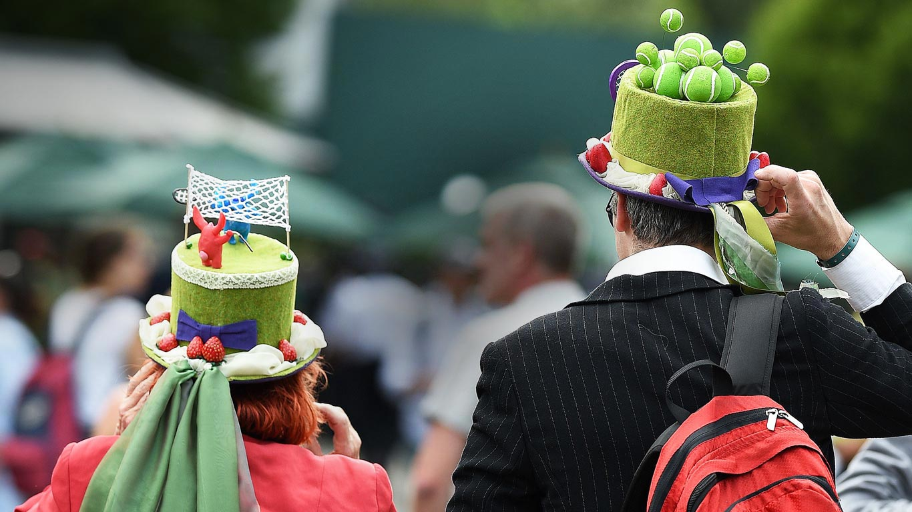

#### 20180702 Sonnenuntergang in der Nähe von Hetzles, Fränkische Schweiz, Bayern, Deutschland (© Rüdiger Hess/geo-select FotoArt)(Bing Deutschland)

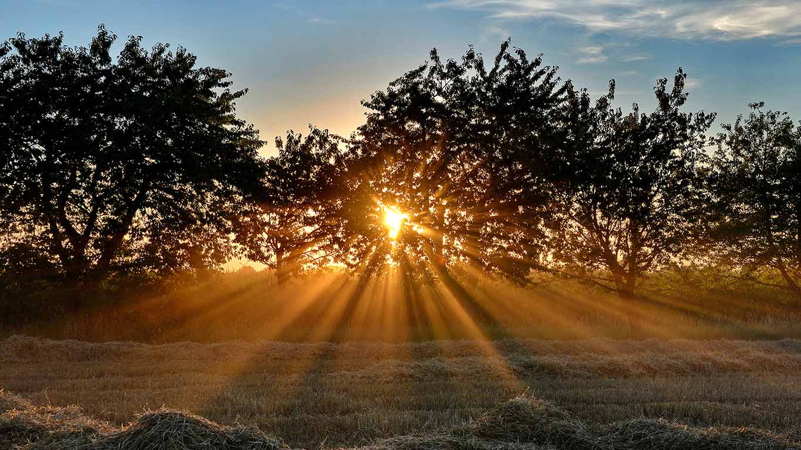

#### 20180702 【今日香港回归纪念日/建党节】庆祝香港回归21周年，中国（© Billy H.C. Kwok/Stringer/Getty Images）(Bing China)

#### 20180702 The Eta Aquarids meteor shower over Devils Tower in Wyoming (© Jason Hatfield/Tandem Stills + Motion)(Bing United States)

#### 20180701 Fireworks over downtown Toronto on Canada Day (© Katrin Ray Shumakov/Getty Images)(Bing Canada)

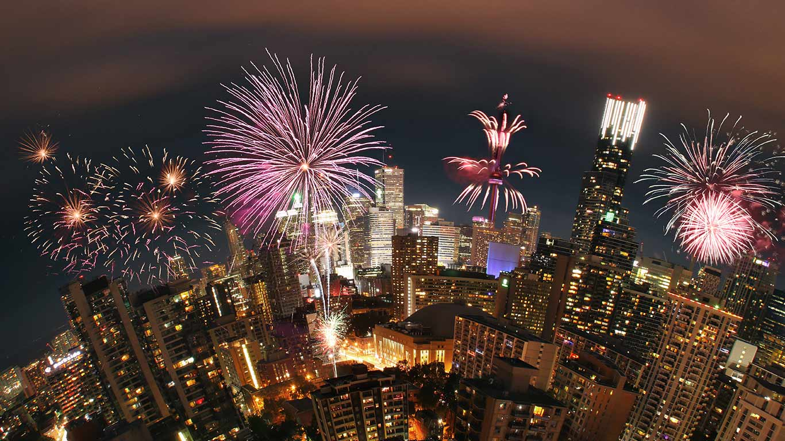

#### 20180701 The Seattle Great Wheel in Seattle, Washington, USA (© Pete Saloutos/Image Source/Offset)(Bing United Kingdom)

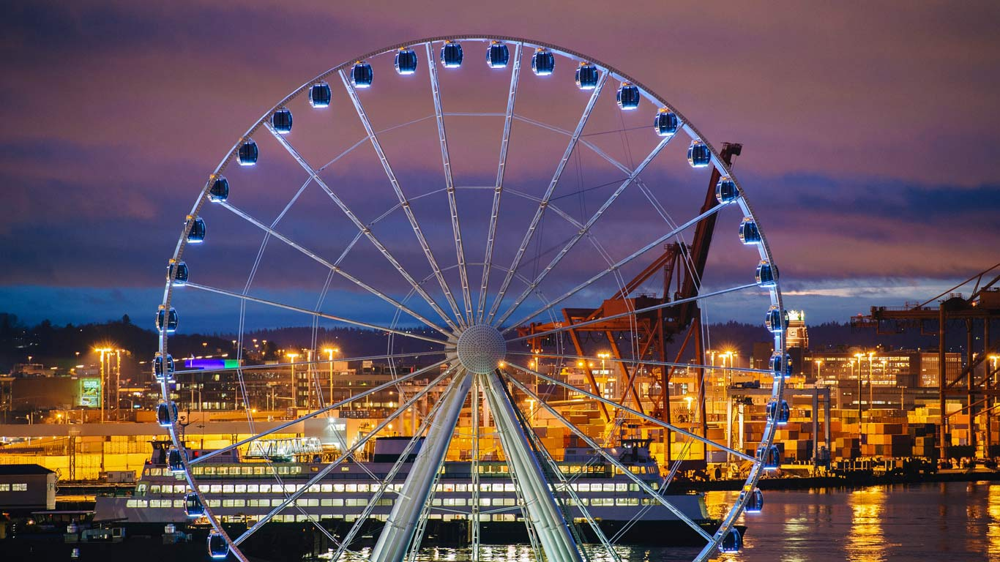

#### 20180701 ｢茅の輪｣京都, 平安神宮 (© Panther Media GmbH/Alamy Stock Photo)(Bing Japan)

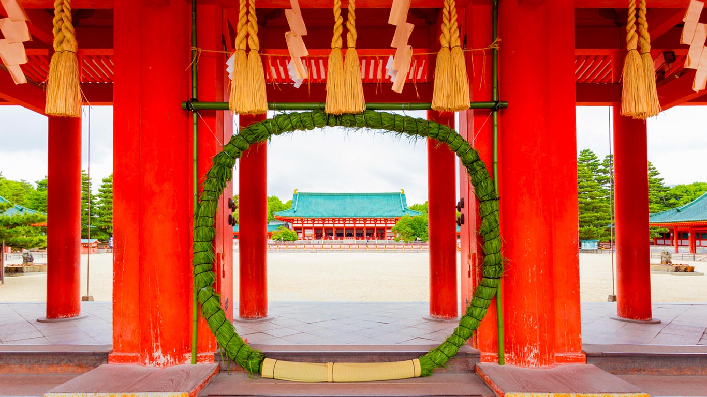

