#### 20180831 Close-up of a lawn bowling game (© Graham Turner/Alamy)(Bing United Kingdom)

#### 20180830 Frankenstein Castle in Darmstadt, Germany, on writer Mary Shelley's birthday (© Boris Stroujko/Alamy)(Bing United Kingdom)

#### 20180829 Blue wildebeests on the move for their annual migration in Maasai Mara, Kenya (© Theo Allofs/Minden Pictures)(Bing United Kingdom)

#### 20180829 Kitesurfer, Schleswig-Holstein, Deutschland (© plainpicture/Werner Bartsch)(Bing Deutschland)

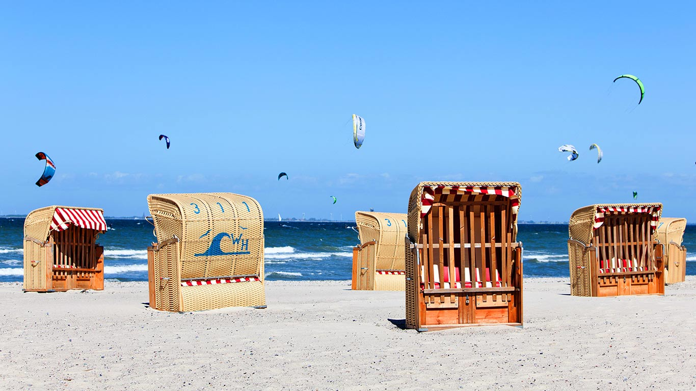

#### 20180828 Night-time view of Greenwich Park and Canary Wharf, London (© stockinasia/Getty Images)(Bing United Kingdom)

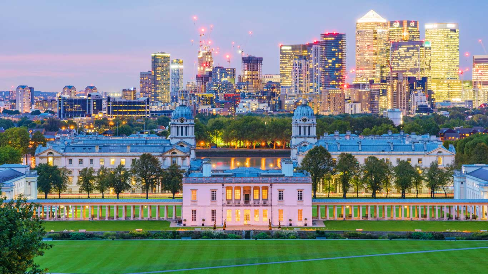

#### 20180827 The Unisphere outside the grounds of the US Open Tennis Championships in Flushing Meadows–Corona Park, New York City, USA (© Carlo Allegri/Reuters)(Bing United Kingdom)

#### 20180826 【今日中元节】桂林中元节万盏河灯漂放活动，中国广西 （© VCG/Getty Images）(Bing China)

#### 20180826 Barataria Trail, part of Jean Lafitte National Historical Park, Louisiana, USA (© Karine Aigner/Tandem Stills + Motion)(Bing United Kingdom)

#### 20180825 On the John Muir Trail near Mammoth Lakes, California, USA (© Brad Goldpaint/Getty Images)(Bing United Kingdom)

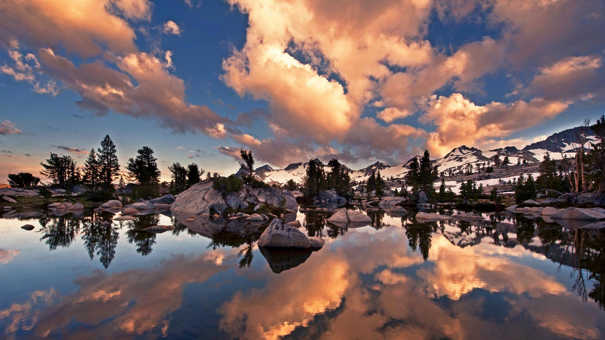

#### 20180825 Un groupe de rock sur scène pendant l’édition 2017 du Festival Rock en Seine, Domaine de Saint-Cloud (© NurPhoto/Getty Images)(Bing France)

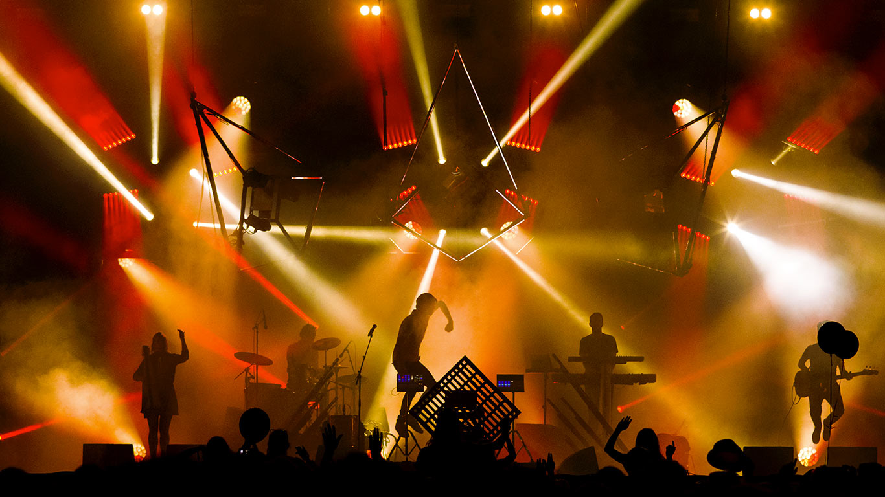

#### 20180824 ｢ホタルの乱舞｣静岡, 松崎町 (© Tommy Tsutsui/Gettyimages)(Bing Japan)

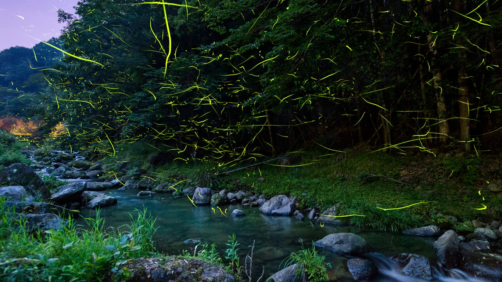

#### 20180824 Wild swift fox (vulpes velox) family in the Canadian Prairies (© John E Marriott/Getty Images)(Bing Canada)

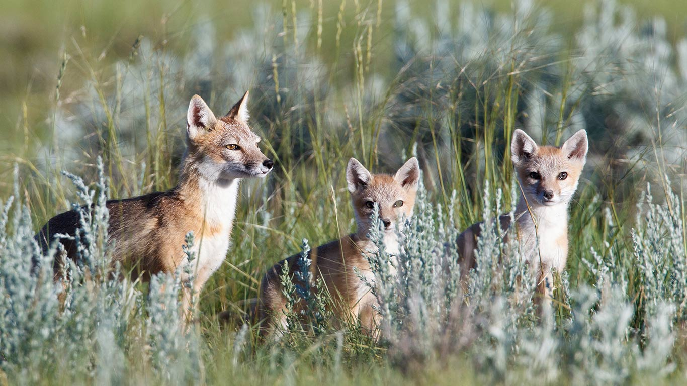

#### 20180824 The Gateway Arch in St. Louis became a national park on Feb 22, 2018 (© STLJB/Shutterstock)(Bing United States)

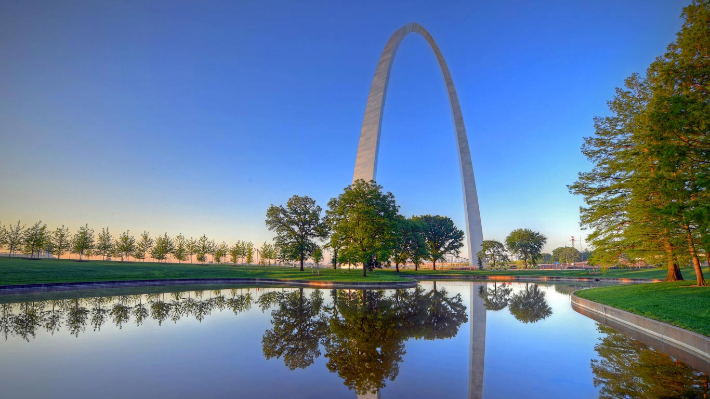

#### 20180824 Menton, Alpes-Maritimes, France (© Timo Christ/Alamy)(Bing United Kingdom)

#### 20180823 Stand-up paddleboarders riding the bore tide in Turnagain Arm, Cook Inlet, Alaska, USA (© Scott Dickerson/Tandem Motion + Stills)(Bing United Kingdom)

#### 20180822 Maned wolf in Piaui, Brazil (© Sean Crane/Minden Pictures)(Bing United Kingdom)

#### 20180822 Ein Labyrinth mit Herz im Maisfeld, Herten, Ruhrgebiet, Nordrhein-Westfalen, Deutschland (© imageBROKER/Alamy Stock Photo)(Bing Deutschland)

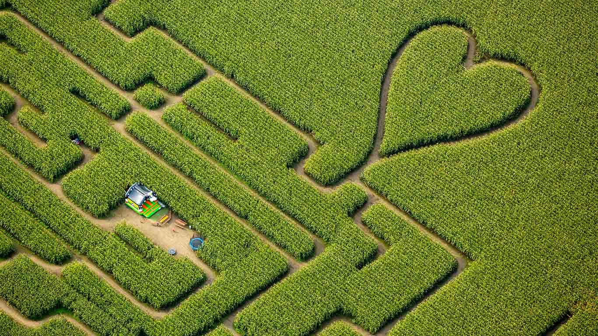

#### 20180821 The Giant Wheel ride at the Canadian National Exhibition (CNE), Toronto (© James Hackland/Alamy)(Bing Canada)

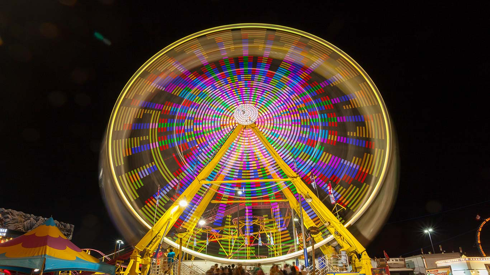

#### 20180821 Santa Monica Pier in California, USA (© Chris Fabregas)(Bing United Kingdom)

#### 20180820 A pine marten in the Cairngorms National Park, Scotland (© SCOTLAND: The Big Picture/Minden Pictures)(Bing United Kingdom)

#### 20180820 Young trees grow amid trees burned in the 1988 fire in Yellowstone National Park, Wyoming (© Austin Cronnelly/Tandem Stills + Motion)(Bing United States)

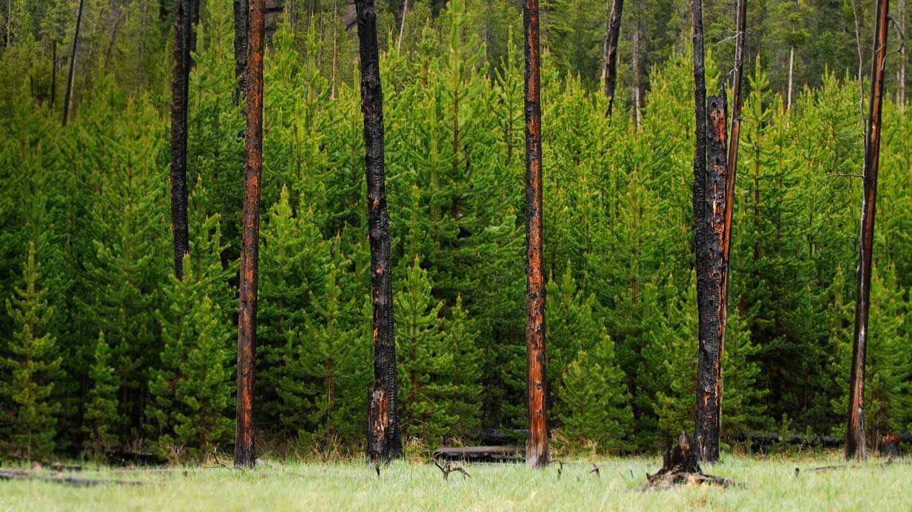

#### 20180819 For Aviation Day, a new perspective on San Francisco International Airport, USA (© Michael H/Getty Images)(Bing United Kingdom)

#### 20180818 【今日七夕】红色的心形烟火，中国澳门（© coolbiere photograph/Getty Images）(Bing China)

#### 20180818 Beehive boxes in the Pembina Valley Region, Manitoba, Canada, for Honey Bee Day (© Ken Gillespie Photography/Alamy)(Bing United Kingdom)

#### 20180817 Every 17 Aug, the village of Porto Venere celebrates the festival of its patron saint (© Peter Sampson/Alamy)(Bing United Kingdom)

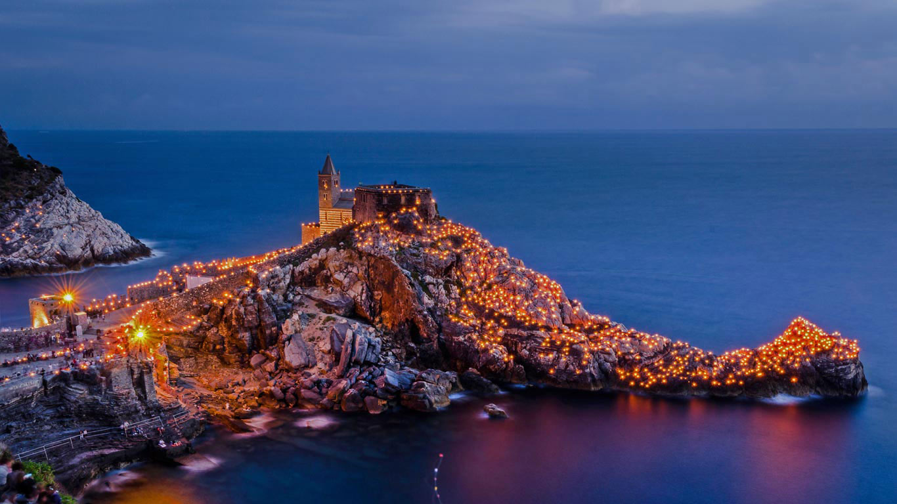

#### 20180817 Altschlossfelsen, Pfälzerwald, Rheinland-Pfalz, Deutschland (© Ingo Arndt/Minden Pictures)(Bing Deutschland)

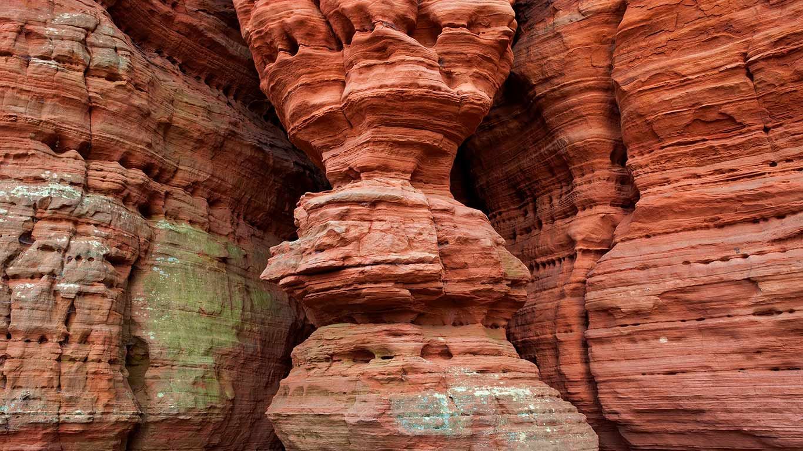

#### 20180816 Dessin d’une jeune femme dans un maillot de bain vintage, Dunkerque, France (© Holger Leue/Getty Images)(Bing France)

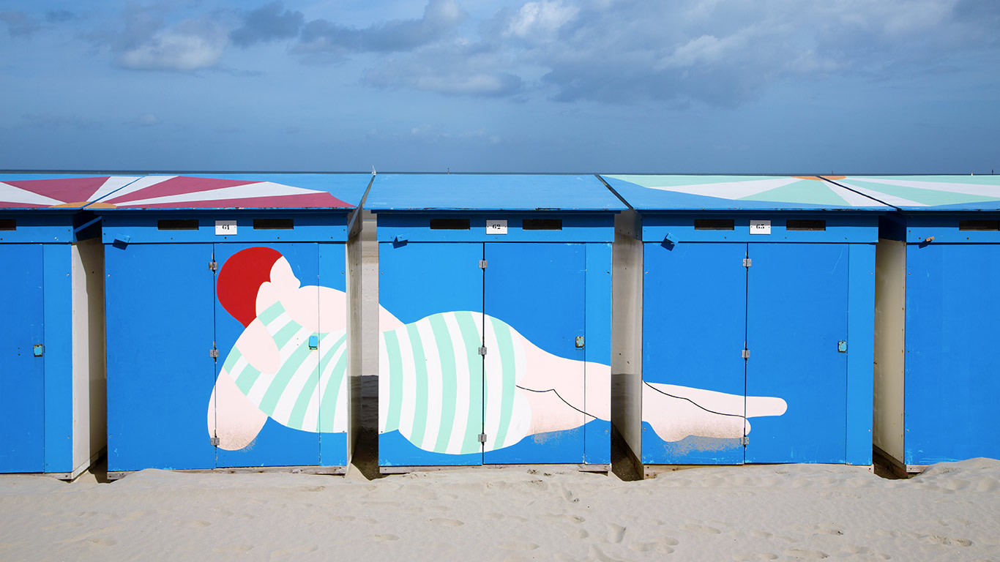

#### 20180816 On Rollercoaster Day, we're at Skyline Park in Bavaria, Germany (© Karl-Josef Hildenbrand/Getty Images)(Bing United Kingdom)

#### 20180815 Eurasian otter chillaxin' in Shetland, Scotland (© Scotland: The Big Picture/Minden Picture)(Bing United Kingdom)

#### 20180814 Mural painting ‘Fresque des Québécois,’ in Place-Royale, Quebec City (© GFC Collection/Alamy Stock Photo)(Bing Canada)

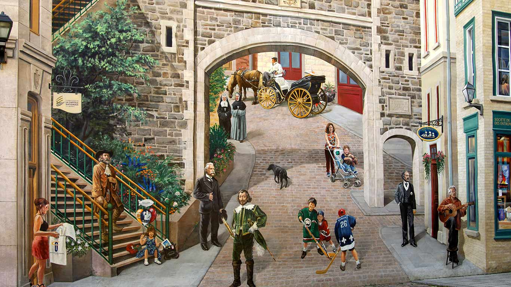

#### 20180814 Close-up view of an endangered Grévy's zebra (© Edwin Giesbers/Getty Images)(Bing United Kingdom)

#### 20180813 The Perseids over Sinemorets, Bulgaria (© jk78/Getty Images)(Bing United Kingdom)

#### 20180812 At Kruger National Park, South Africa, for World Elephant Day (© Yva Momatiuk and John Eastcott/Minden Pictures)(Bing United Kingdom)

#### 20180812 Vue aérienne d’une plage à Lacanau, pendant la competition Caraïbos Lacanau Pro, Gironde, France (© Bellurget Jean Louis/Getty Images)(Bing France)

#### 20180811 Following the Yoshida Trail on Mount Fuji, Japan, for Mountain Day (© Max_Xie/Getty Images)(Bing United Kingdom)

#### 20180810 Behind the scenes at the Smithsonian, which was founded Aug 10, 1846 (© Mark Kauffman/Getty Images)(Bing United States)

#### 20180810 Inside a hot air balloon envelope during inflation at the Bristol International Balloon Fiesta (© Simon Balson/Alamy)(Bing United Kingdom)

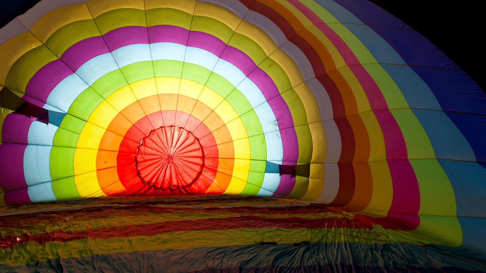

#### 20180809 Clouds around Huayna Picchu in Peru (© Enrique Castro-Mendivil/Reuters)(Bing United Kingdom)

#### 20180809 Teilnehmer der Friedenstafel auf dem Rathausplatz in Augsburg, Bayern, während des Augsburger Hohen Friedensfestes am 8. August 2014 (© ANGELIKA WARMUTH/DPA/Getty Images)(Bing Deutschland)

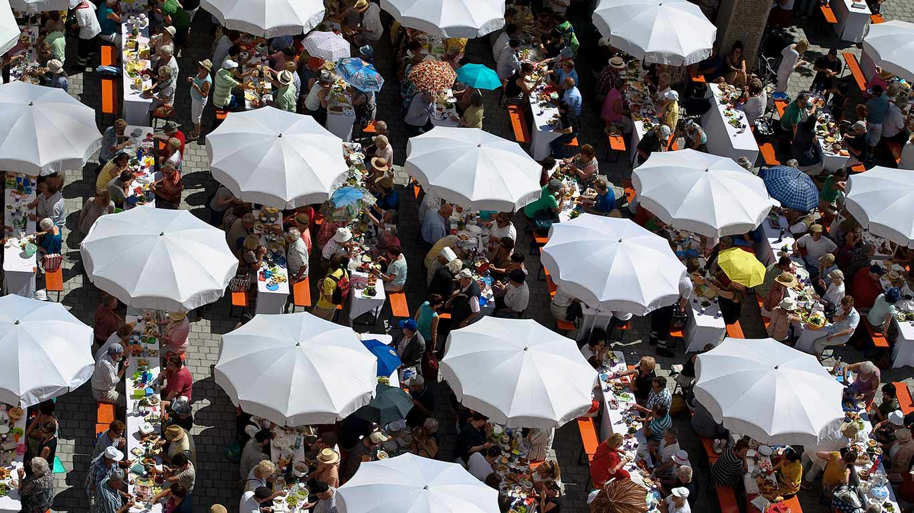

#### 20180808 ｢朝顔｣ (© chichimikan/Getty Images)(Bing Japan)

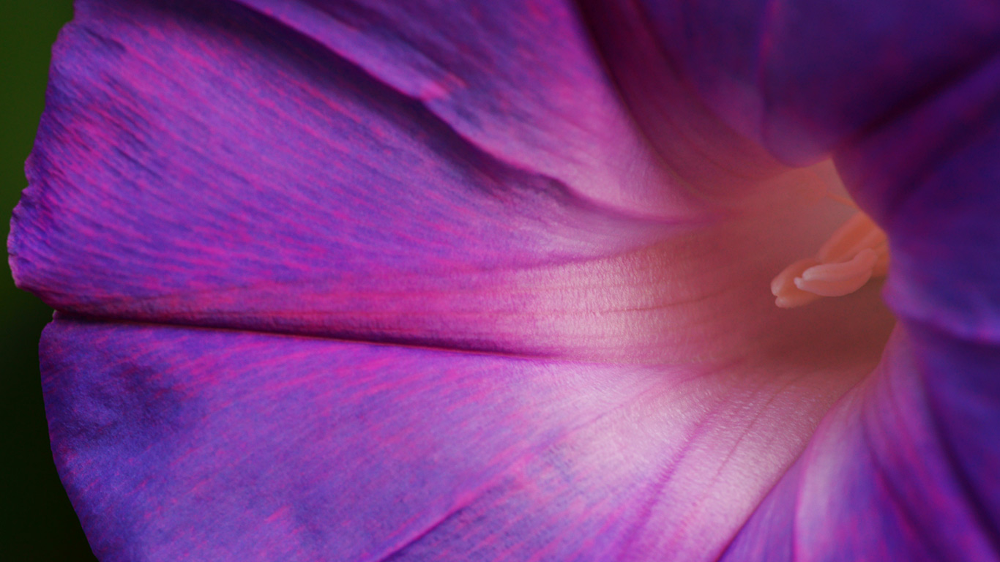

#### 20180808 A Scottish wildcat in Cairngorms National Park, Scotland (© Pete Cairns/Minden Pictures)(Bing United Kingdom)

#### 20180807 Marshall Point Lighthouse in Port Clyde, Maine, USA (© S. Greg Panosian/Getty Images)(Bing United Kingdom)

#### 20180807 ｢広島平和記念公園の折り鶴｣広島, 広島市 (© Damien Douxchamps/Gettyimages)(Bing Japan)

#### 20180806 View of Port Antonio in honour of Jamaica Independence Day (© Masterfile)(Bing United Kingdom)

#### 20180805 'LOVE' by Robert Indiana in Philadelphia's LOVE Park, USA (© Franz Marc Frei/Getty Images)(Bing United Kingdom)

#### 20180804 Fireworks above Edinburgh Castle during the city's festival season (© Kevin Carr/Getty Images)(Bing United Kingdom)

#### 20180803 Burnt forest with fireweed in Banff National Park, Banff, Alta. (© ImagineGolf/Getty Images)(Bing Canada)

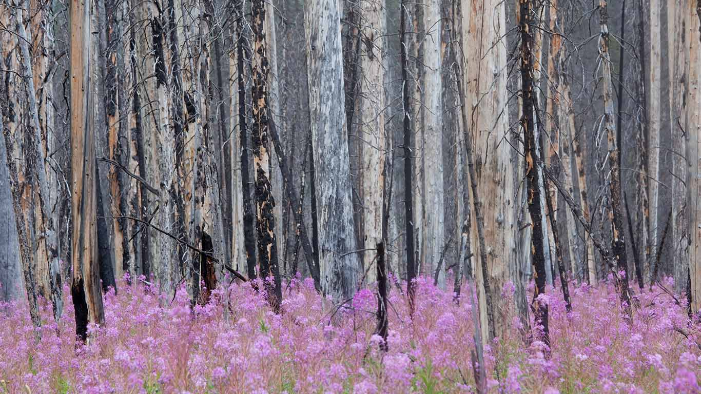

#### 20180803 Finnich Glen in Stirlingshire, Scotland (© Damian Shields/Offset)(Bing United Kingdom)

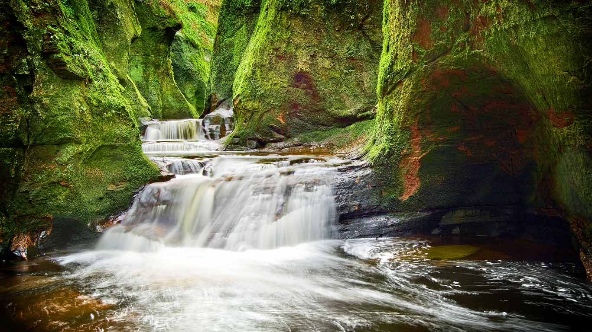

#### 20180803 Bikers cruise South Dakota's Badlands. The Sturgis Motorcycle Rally opens Aug 3. (© David Zimmerman/Masterfile)(Bing United States)

#### 20180802 A float from the Aomori Nebuta festival parade in Aomori, Japan (© Akkharat Jarusilawong/Shutterstock)(Bing United Kingdom)

#### 20180801 Sunset over Winskill Stones in the Yorkshire Dales National Park (© John Finney Photography/Getty Images)(Bing United Kingdom)

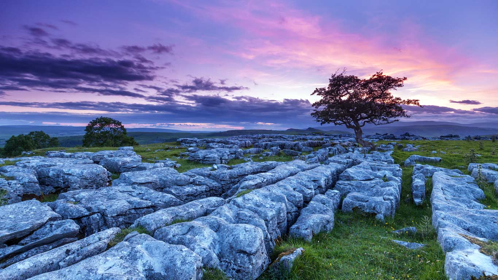

#### 20180801 The Charles Kuonen Suspension Bridge near Randa, Switzerland  (© Menno Boermans/Aurora Photos)(Bing United States)

#### 20180801 Display of fireworks at the Montreal Fireworks Festival (© McPhoto/Burch/Alamy)(Bing Canada)

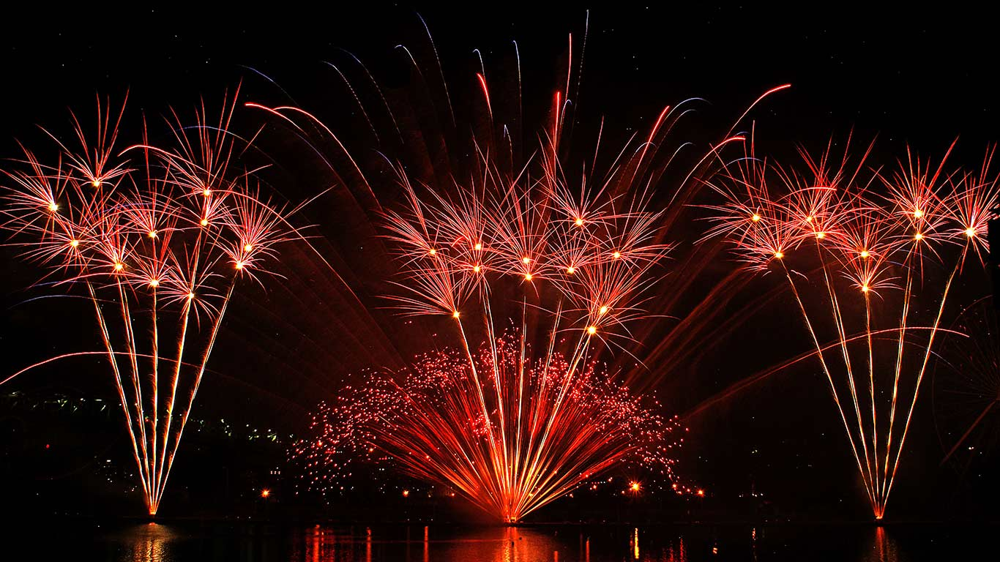

#### 20180801 Leuchtfeuer Rotes Kliff bei Kampen, Sylt, Schleswig-Holstein, Deutschland (© Kerstin Bittner/Westend61/Shutterstock/Offset)(Bing Deutschland)

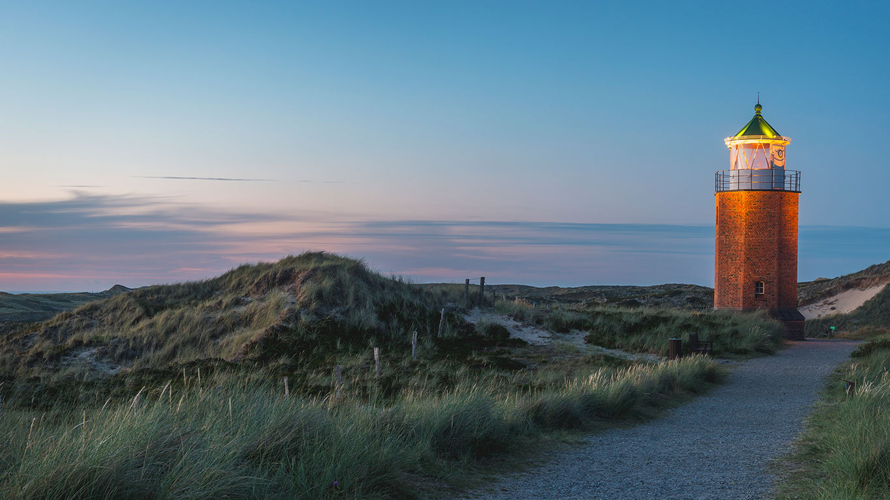

