#### 20180930 The Long Walk and Galway Harbour in Galway, Ireland. The city's oyster festival is happening now (© ClaudineVM/Getty Images)(Bing United Kingdom)

#### 20180929 Southern right whales off the coast of South Africa. The Hermanus Whale Festival starts today. (© oversnap/E+/Getty Images)(Bing United States)

#### 20180929 Pneuma by artist Floria Sigismondi at Nathan Phillips Square, Toronto (© Torontonian/Alamy Stock Photo)(Bing Canada)

#### 20180929 Golden Bridge near Da Nang, Vietnam (© REUTERS/Kham TPX)(Bing United Kingdom)

#### 20180929 ｢びわこ花噴水｣滋賀, 琵琶湖 (© Nobuaki Sumida/amana images/Getty Images)(Bing Japan)

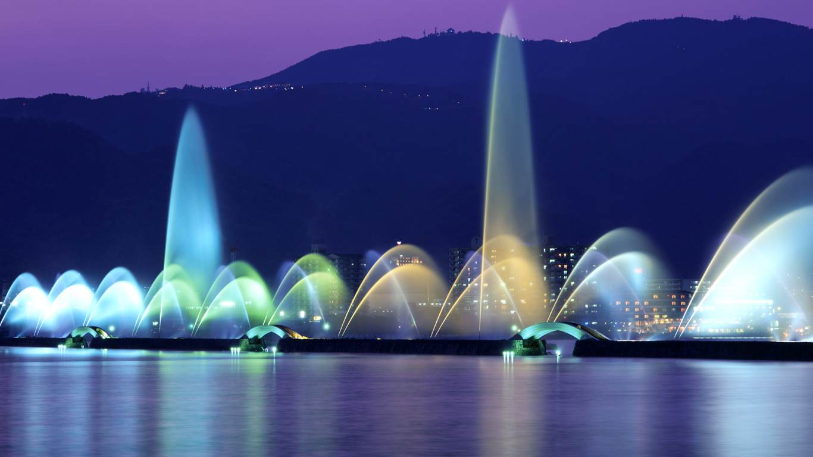

#### 20180928 The Albatros course at Le Golf National in France, host of the 2018 Ryder Cup (© David Cannon/Getty Images)(Bing United Kingdom)

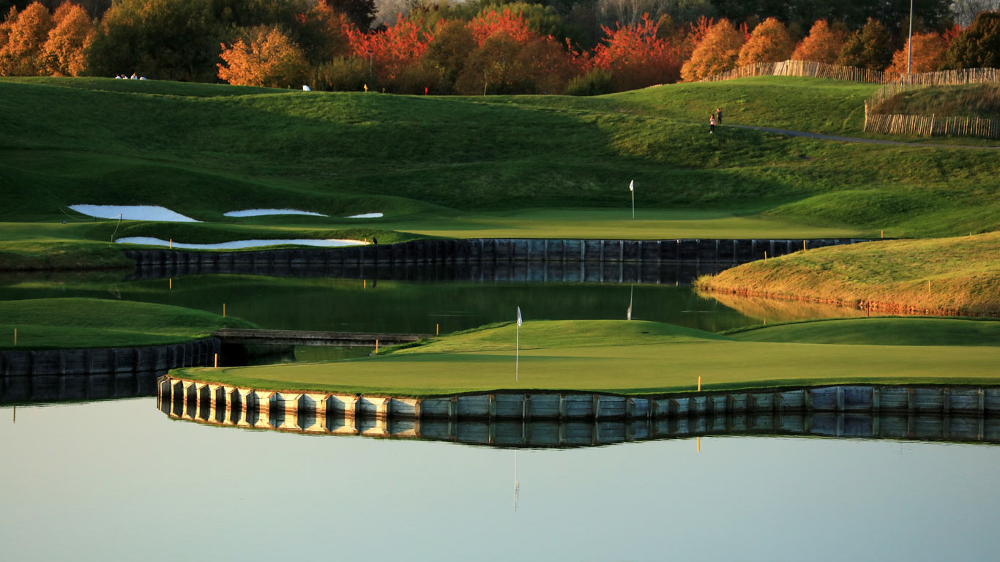

#### 20180927 For World Maritime Day, a ship docked at night in the Port of Cape Town, South Africa (© Zero Creatives/Science Photo Library)(Bing United Kingdom)

#### 20180926 Loch na Cuilce and Loch Coruisk with Black Cuillin in the background, Isle of Skye, Scotland (© Swen_Stroop/Getty Images)(Bing United Kingdom)

#### 20180925 Un petit hérisson roulé en boule pour l’arrive de l’automne, Oberbruck, France  (© Bruno Mathieu/Minden Pictures)(Bing France)

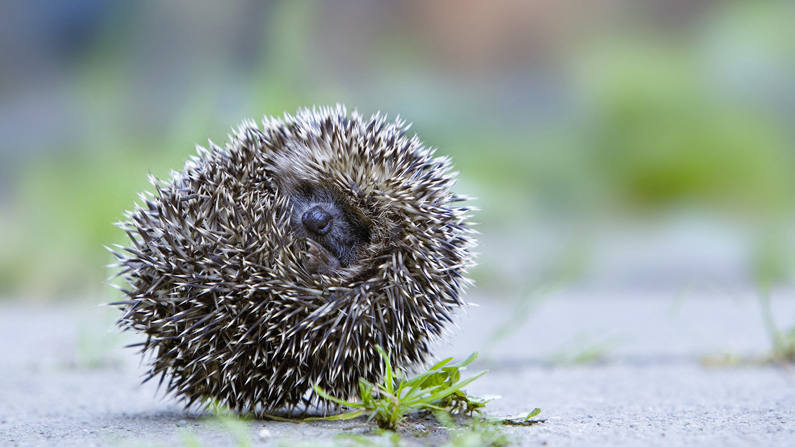

#### 20180925 ｢ススキと満月｣滋賀県, 大津市 (© MIXA/Alamy)(Bing Japan)

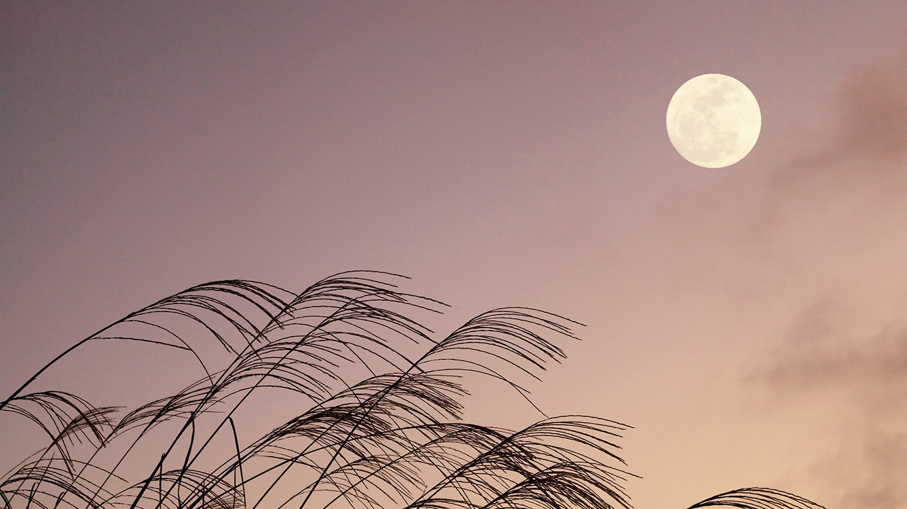

#### 20180925 Giant sequoia trees in Sequoia National Park, California, USA. The park turns 128 today. (© Yva Momatiuk and John Eastcott/Minden Pictures)(Bing United Kingdom)

#### 20180924 The Qinhuai River in Nanjing, China, during Mid-Autumn Festival, which begins today (© zyxeos30/Getty Images)(Bing United Kingdom)

#### 20180924 Hängeseilbrücke Geierlay, Saar-Hunsrück-Steig, Hunsrück, Rheinland-Pfalz, Deutschland (© Bernados/Westend61/plainpicture)(Bing Deutschland)

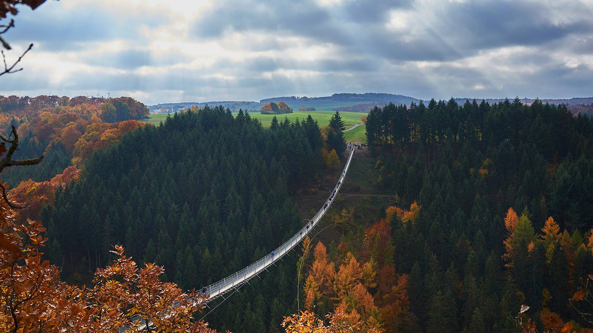

#### 20180923 Shenandoah National Park in the Blue Ridge Mountains of Virginia, USA (© Rachid Dahnoun/Tandem Stills + Motion)(Bing United Kingdom)

#### 20180922 A marching band is reflected in the bell of a horn during Oktoberfest in Munich, Germany (© Joerg Koch/Getty Images)(Bing United Kingdom)

#### 20180921 The Imagine Peace Tower near Reykjavik, Iceland, for the International Day of Peace (© Arctic Images/Alamy)(Bing United Kingdom)

#### 20180920 The Blackpool Tower Ballroom, Lancashire (© Dosfotos/Getty Images)(Bing United Kingdom)

#### 20180919 The Black Pearl driftwood ship on New Brighton beach, Wallasey, Merseyside, for Talk Like a Pirate Day (© Phil Noble/Reuters)(Bing United Kingdom)

#### 20180918 A view of the Statue of Liberty from Ellis Island, New York City (© jmeyersforeman/Alamy)(Bing United States)

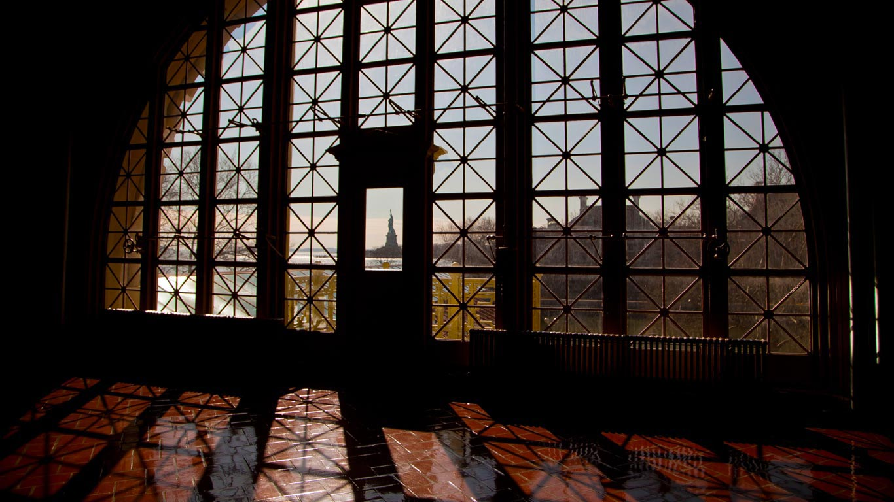

#### 20180918 Ludwigshöhle, Fränkische Schweiz, Bayern, Deutschland (© Rüdiger Hess/geo-select FotoArt)(Bing Deutschland)

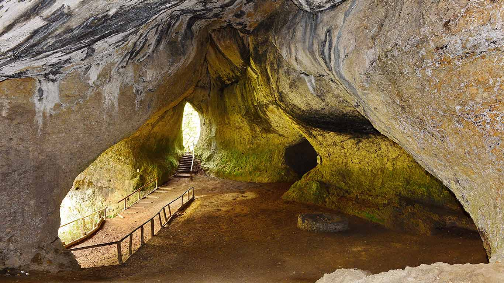

#### 20180918 A red knot foraging on the Shetland Islands, Scotland (© Andrew Parkinson/Minden Pictures)(Bing United Kingdom)

#### 20180917 The River Medina on the Isle of Wight (© Aurora Photos/Shutterstock/Offset)(Bing United Kingdom)

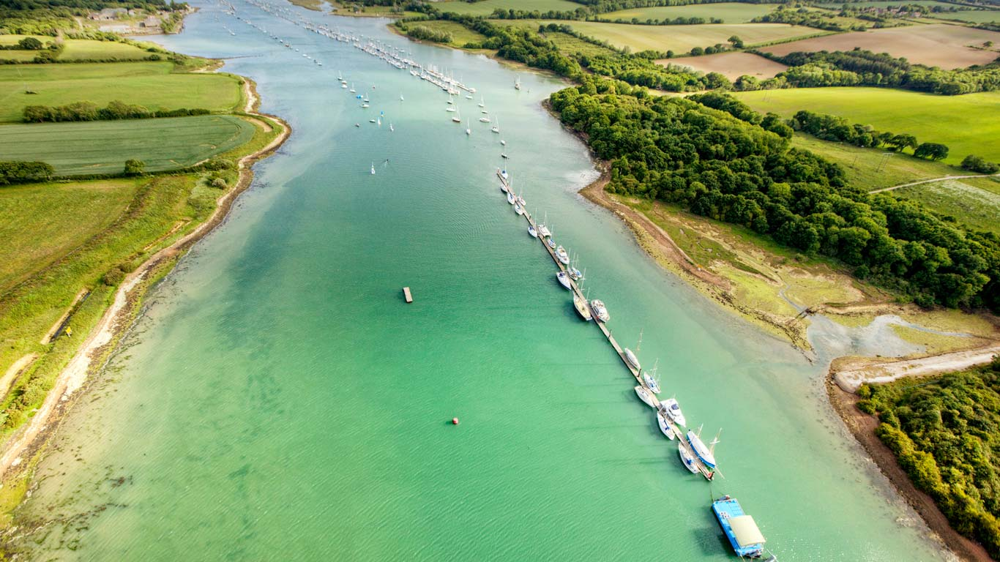

#### 20180917 Château de Chantilly, Oise, France (© PEC Photo/Getty Images)(Bing France)

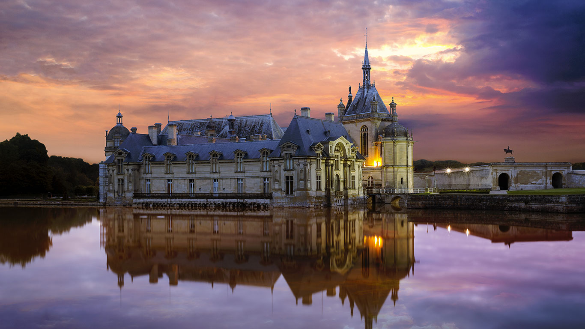

#### 20180917 Aerial photography over the Cariboo region of British Columbia (© Chris Harris/All Canada/Offset)(Bing Canada)

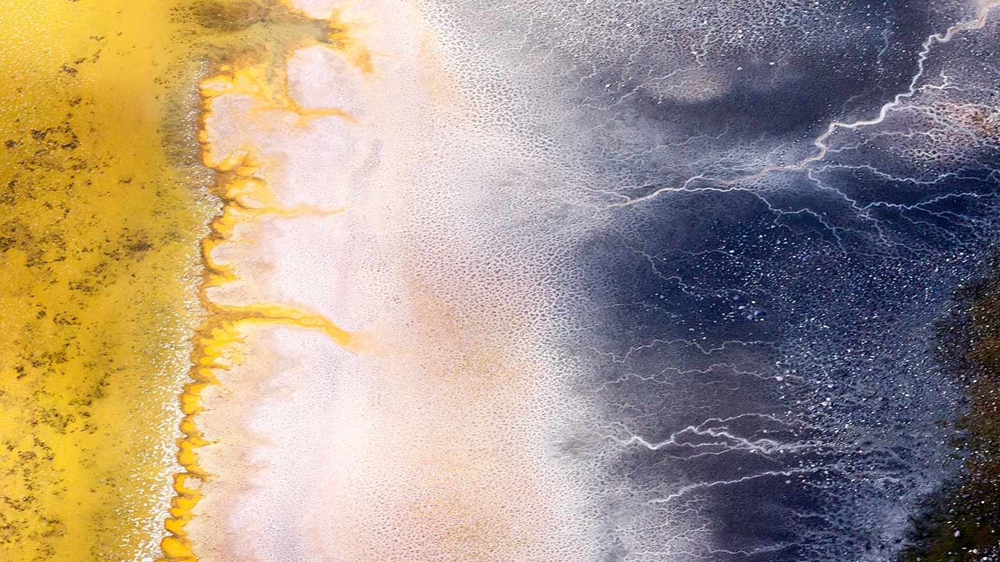

#### 20180916 Gabriel Dawe's 'Plexus no. 36' at a Latino art exhibition in Denver. Hispanic Heritage Month begins today. (© Joe Amon/The Denver Post via Getty Images)(Bing United States)

#### 20180916 For Mexico's Independence Day, the 'Monument to the Revolution' in Mexico City (© Reinier Snijders/Getty Images)(Bing United Kingdom)

#### 20180915 'The Eclipse' in the Chapel of St Cornelius on Governors Island, Brooklyn, New York, USA (© Timothy Schenck/Jacob Hashimoto Studio)(Bing United Kingdom)

#### 20180915 ｢鳥海山とコスモス｣秋田, 由利本荘市 (© Yukari Ochiai/Getty Images)(Bing Japan)

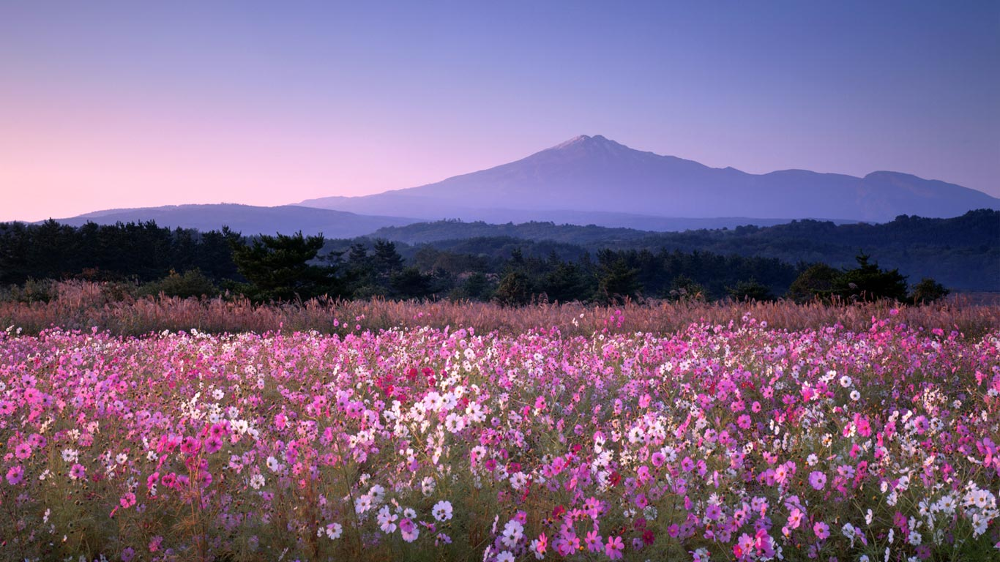

#### 20180914 Northern rockhopper penguin on Gough Island in the South Atlantic (© Tui De Roy/Minden Pictures)(Bing United Kingdom)

#### 20180913 Deux jeunes renardeaux assis sur une botte de foin, Vosges, France (© Fabrice Cahez/Minden Pictures)(Bing France)

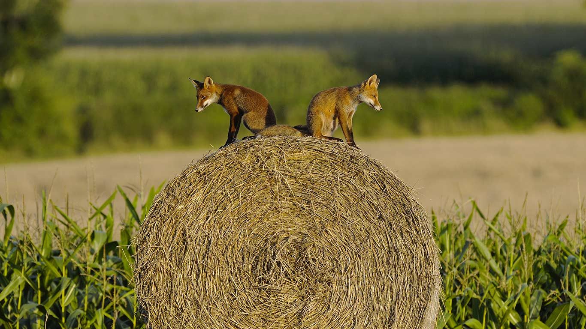

#### 20180913 Missenden Abbey in Great Missenden, Buckinghamshire (© Avico Ltd/Alamy)(Bing United Kingdom)

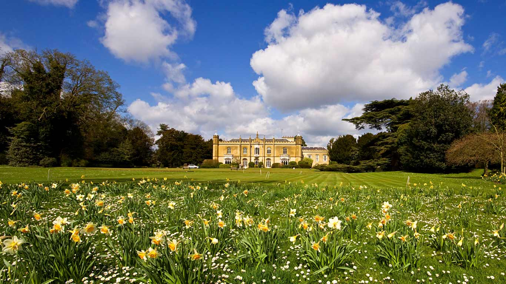

#### 20180912 Inside the Oculus at the World Trade Center in Lower Manhattan (© Shannon Stapleton/Reuters)(Bing United States)

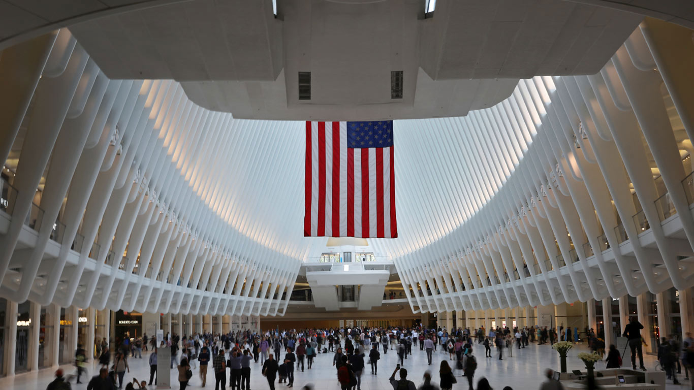

#### 20180912 Kindergarten-Zaun aus Buntstiften, Düsseldorf, Nordrhein-Westfalen, Deutschland (© visual2020vision/Westend61/plainpicture)(Bing Deutschland)

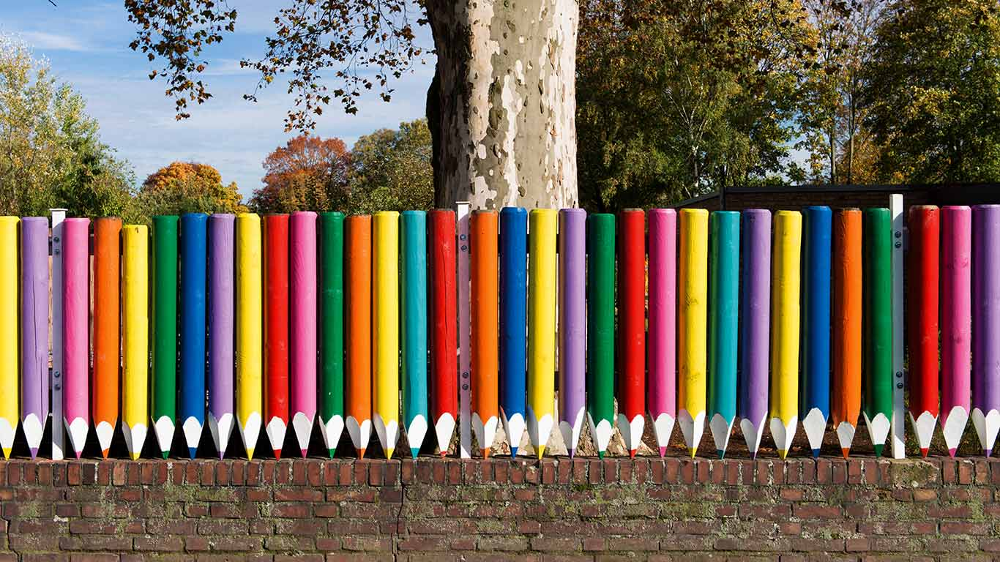

#### 20180912 Black-browed albatrosses return to the Falkland Islands (© Cultura RM/Alamy)(Bing United Kingdom)

#### 20180911 Toronto's Royal Ontario Museum. The Toronto International Film Festival is happening now (© Ken Straiton/Aurora Photos)(Bing United Kingdom)

#### 20180911 Glacier Skywalk on the Ice Fields Parkway, Jasper, Alta. (© Peter Unger/Getty Images)(Bing Canada)

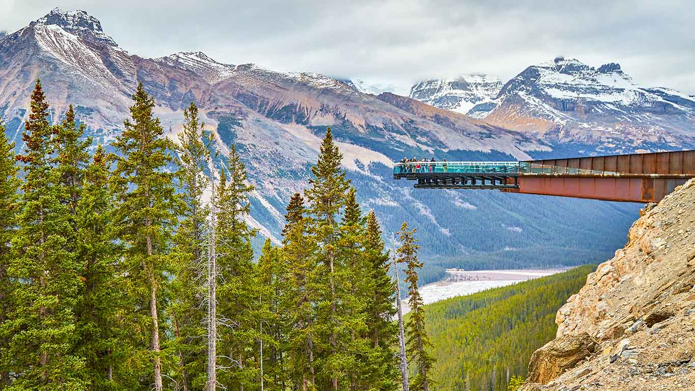

#### 20180910 Honeycomb (© Heidi and Hans-Juergen Koch/Minden Pictures)(Bing United Kingdom)

#### 20180909 Trinity College Library in Dublin, Ireland (© Nigel Hicks/Robert Harding/Aurora Photos)(Bing United States)

#### 20180909 Traditional chrysanthemum of Japan (© I love Photo and Apple/Getty images)(Bing United Kingdom)

#### 20180908 Aerial view of the Royal Albert Hall in South Kensington, London (© Jason Hawkes/Getty Images)(Bing United Kingdom)

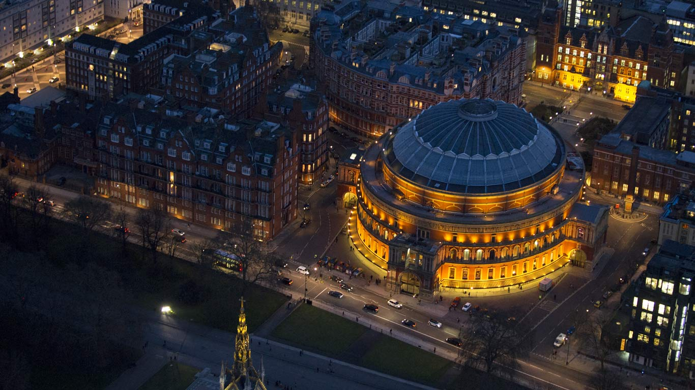

#### 20180907 Brazilian pines in the Atlantic Forest for Brazil's Independence Day (© Ralph Clevenger/Getty Images)(Bing United Kingdom)

#### 20180906 Vineyards in Burgundy, France (© Hans Strand/plainpicture)(Bing United Kingdom)

#### 20180905 Sockeye salmon spawn in the Adams River in British Columbia, Canada (© Yva Momatiuk and John Eastcott/Minden Pictures)(Bing United Kingdom)

#### 20180904 Hay bales in Tuscany, Italy (© Chris Ryan/plainpicture)(Bing United Kingdom)

#### 20180904 Happy Labor Day. Construction workers rest above 1930s Manhattan. (© Bettmann/Getty Images)(Bing United States)

#### 20180903 Yellow pencils at the Musgrave Pencil Co. facility in Shelbyville, Tennessee, USA (© Luke Sharrett/Getty Images)(Bing United Kingdom)

#### 20180903 Aerial view of the Gaspe Peninsula, Forillon National Park, Que. (© Russ Heinl/Getty Images)(Bing Canada)

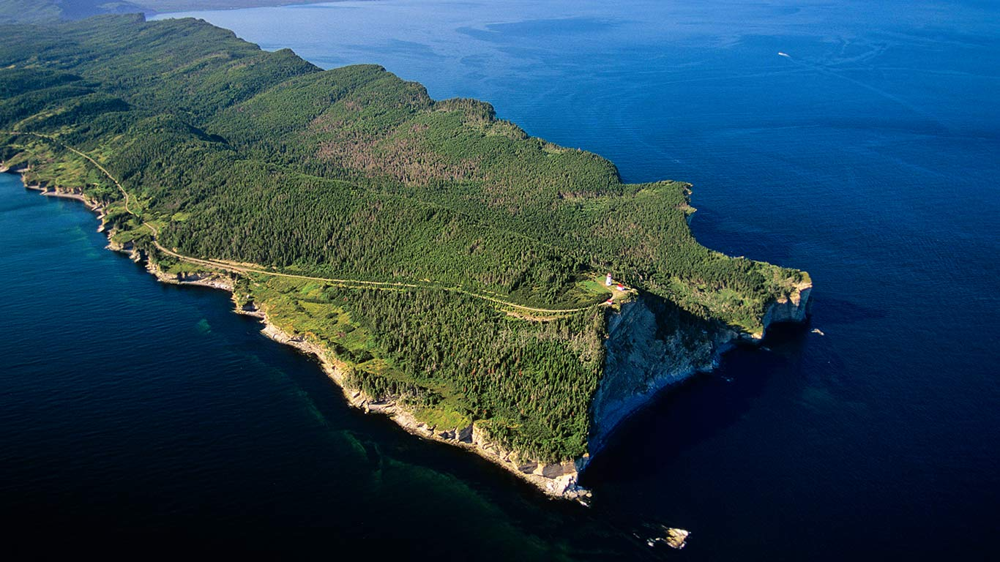

#### 20180902 Boaters in historical dress row down the Grand Canal during the Regata Storica in Venice, Italy (© Alessandro Bianchi/Reuters)(Bing United Kingdom)

#### 20180901 Dancers at the Braemar Gathering in Scotland. The festival begins today (© Jeff J Mitchell/Getty Images)(Bing United Kingdom)

#### 20180901 Berliner Funkturm mit blauer Illumination (© imageBROKER/REX/Shutterstock)(Bing Deutschland)

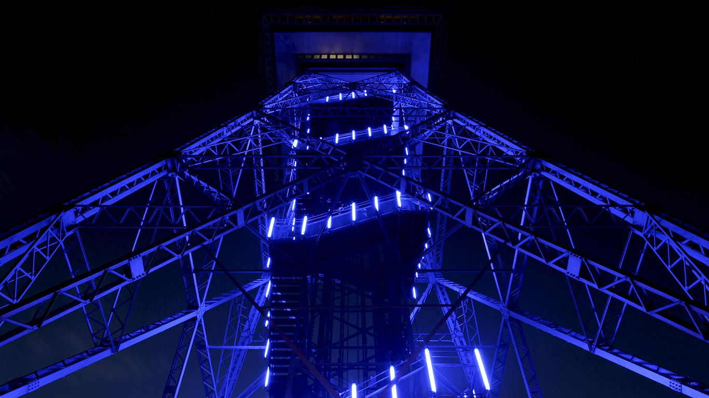

