#### 20181031 Cinema of lost souls (© Getty | Shutterstock)(Bing United Kingdom)

#### 20181030 Whitby Abbey illuminated with coloured floodlights in North Yorkshire (© Andrew Barker/Alamy)(Bing United Kingdom)

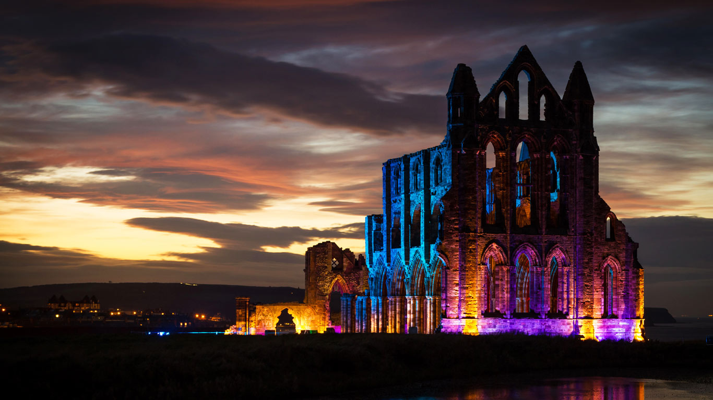

#### 20181029 Astronomische Uhr des Ulmer Rathauses, Ulm, Baden-Württemberg, Deutschland. Zum Ende der Sommerzeit (© TPH/allOver images/Alamy Stock Photo)(Bing Deutschland)

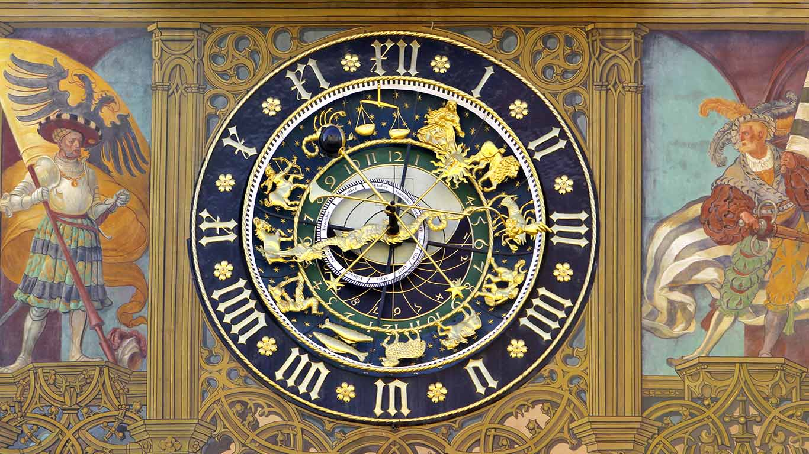

#### 20181029 A pumpkin patch in Columbia County, Pennsylvania, USA (© Beck Photography/Aurora Photos)(Bing United Kingdom)

#### 20181029 Vue sur Paris depuis la Grande horloge du Musée d’Orsay, Paris, France (© BRUCE BECK/Alamy Stock Photo)(Bing France)

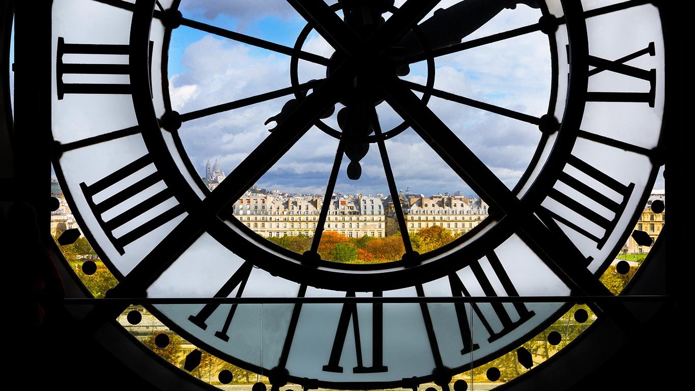

#### 20181028 A statue in the Gardens of Versailles in France (© Lindsay Daniels/Tandem Stills + Motion)(Bing United Kingdom)

#### 20181027 Common pipistrelle bat for Bat Appreciation Month (© Mario Cea Sanchez/Minden Pictures)(Bing United Kingdom)

#### 20181026 Tombstone, Arizona, on the anniversary of the gunfight at the O.K. Corral (© Nik Wheeler/Alamy)(Bing United States)

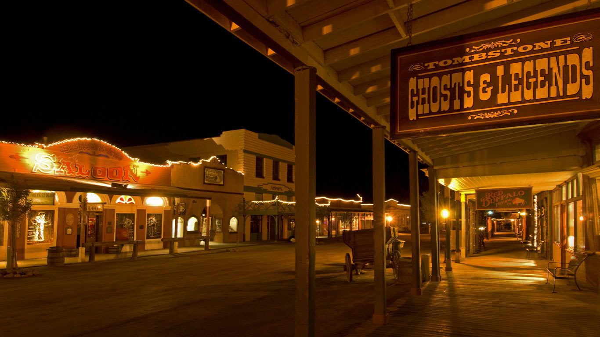

#### 20181026 Sunset on Cape Breton Island, Nova Scotia, Canada (© Mike Grandmaison/Alamy Stock Photo)(Bing United Kingdom)

#### 20181025 Château Gaillard, a 12th-century fortress in the Seine Valley, France (© Francis Cormon/age fotostock)(Bing United Kingdom)

#### 20181025 Stadtbibliothek am Mailänder Platz, Stuttgart, Baden-Württemberg, Deutschland. Zum Tag der Bibliotheken (© imageBROKER/REX/Shutterstock)(Bing Deutschland)

#### 20181024 ｢嵐山公園の竹林と紅葉｣京都, 嵐山 (© Chad Ehlers/Stock Connection/Aurora Photo)(Bing Japan)

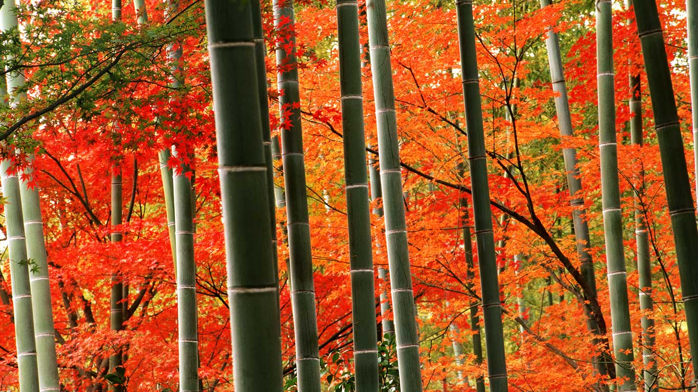

#### 20181024 Dove art installation above the Piazza del Duomo in Amalfi, Italy (© LatitudeStock – TTL/Getty Images)(Bing United Kingdom)

#### 20181023 Tsusiat Falls at night, spilling onto the beach along the West Coast Trail, B.C. (© Ethan Welty/Aurora Photos)(Bing Canada)

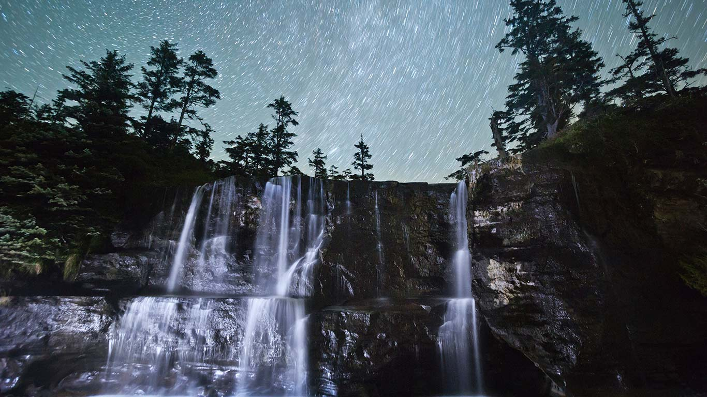

#### 20181023 Rainbow lorikeet group in umbrella tree, Atherton Tableland, Queensland (© Konrad Wothe/Minden Pictures)(Bing Australia)

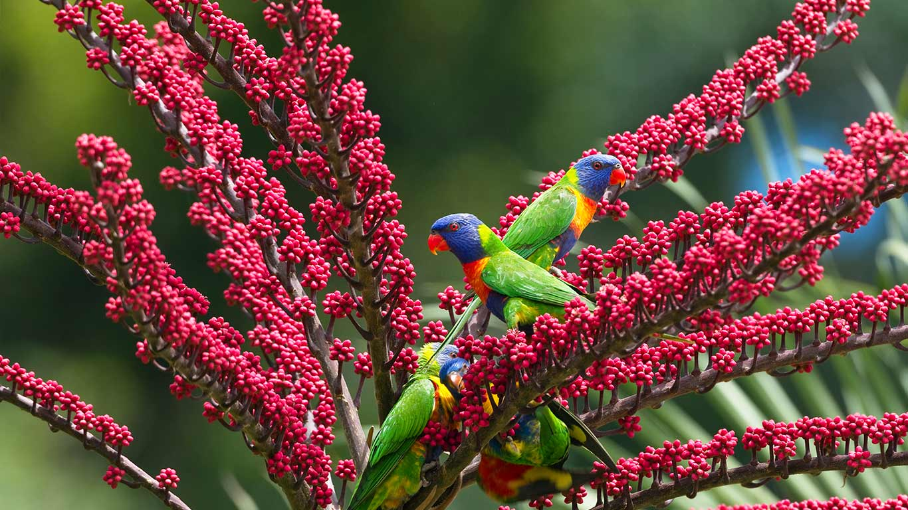

#### 20181023 Liquid nitrogen for National Chemistry Week, which runs October 21-27 (© Sunny/Getty Images)(Bing United States)

#### 20181023 A greenfinch flying at dawn in Monmouthshire, Wales (© Phil Savoie/Minden Pictures)(Bing United Kingdom)

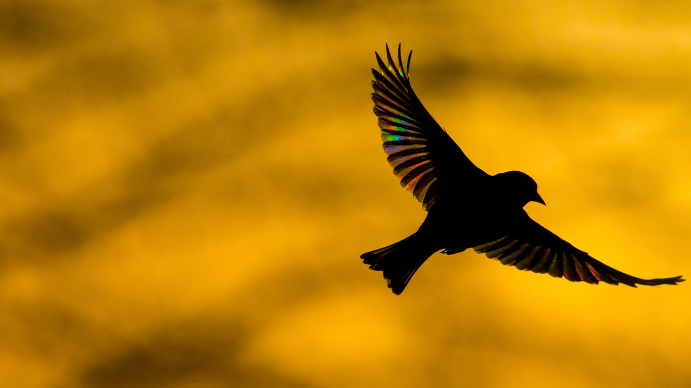

#### 20181022 A common wombat at Point Lesueur on Maria Island in Tasmania, Australia (© Posnov/Getty Images)(Bing United Kingdom)

#### 20181021 Apple tree on Salt Spring Island in British Columbia, Canada (© Radius Images/Offset)(Bing United Kingdom)

#### 20181020 Valletta, Malta, one of the European Capitals of Culture for 2018 (© Adrian Malanca/Getty Images)(Bing United Kingdom)

#### 20181020 Sydney Olympic Park Games Memories (© Nigel Killeen/Moment Mobile/Getty Images)(Bing Australia)

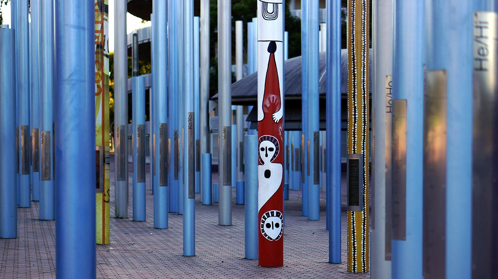

#### 20181019 Portland, Maine, USA (© CFW Photography/Getty Images)(Bing United Kingdom)

#### 20181019 Morning mist and autumn colours in Grandes-Piles, Que. (© Eric Baccega/Minden Pictures)(Bing Canada)

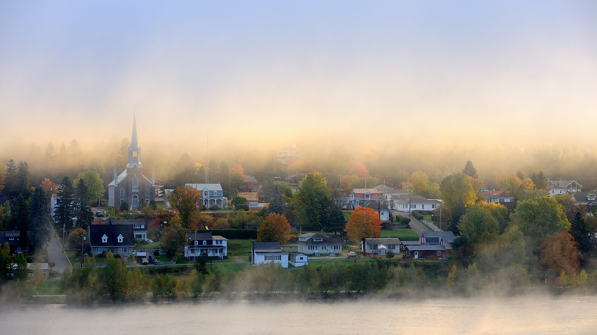

#### 20181018 【今日重阳节】复兴公园里跳探戈的人们，中国上海 (© GARDEL Bertrand/hemis.fr/Getty Images)(Bing China)

#### 20181018 Icebergs in Mendenhall Lake near Juneau, Alaska (© John Hyde/age fotostock)(Bing United States)

#### 20181018 Die Ausstellung „Der Berg ruft“ im Gasometer Oberhausen, Nordrhein-Westfalen, Deutschland (© Jochen Tack/Alamy Stock Photo)(Bing Deutschland)

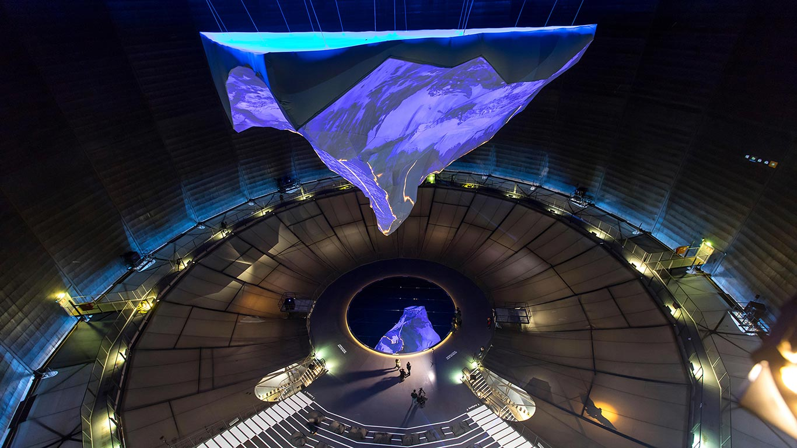

#### 20181018 Studio Festi performs during Festival Internacional Cervantino in Guanajuato, Mexico (© Hector Vivas/Getty Images)(Bing United Kingdom)

#### 20181017 Tilbury Fort, Essex, on the north bank of the River Thames (© pxl.store/Shutterstock)(Bing United Kingdom)

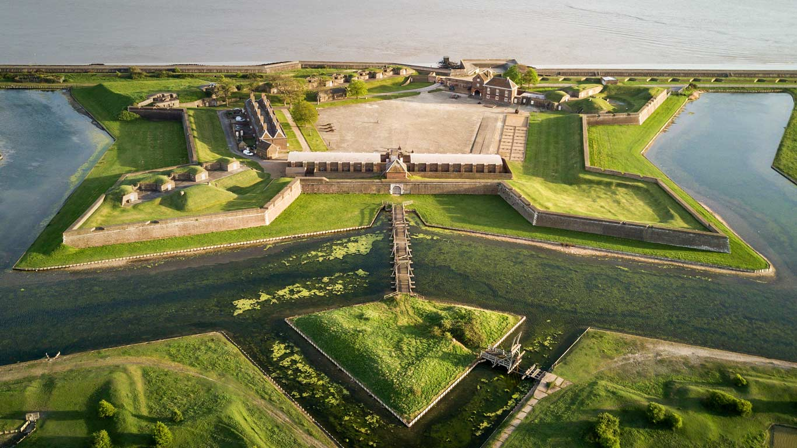

#### 20181017 Baguettes dans une boulangerie en Dordogne, France, à l'occasion de la Journée du Pain (© age fotostock)(Bing France)

#### 20181017 Dinosaur tracks from the Jurassic Period found near Tuba City, Arizona, in the Navajo Nation (© wanderluster/Getty Images)(Bing United States)

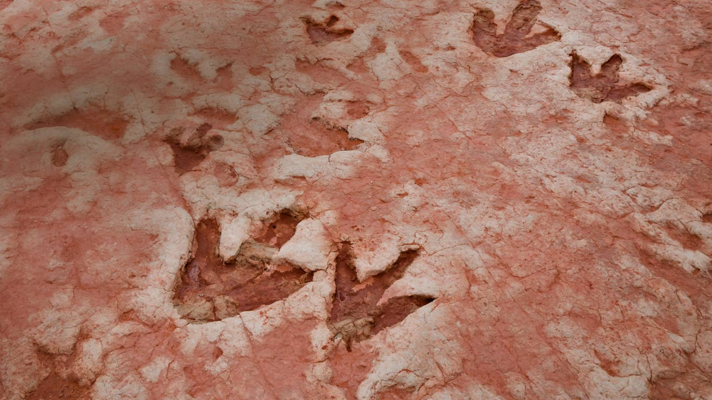

#### 20181016 An oxpecker sits on an African buffalo in Maasai Mara National Reserve, Kenya (© Susan Portnoy/Offset)(Bing United Kingdom)

#### 20181015 Dawn redwoods in a lake at Zimaling Park, Zhongshan, China (© Yaorusheng/Getty Images)(Bing United Kingdom)

#### 20181015 ｢京福嵐山本線｣京都, 右京区 (© Shuji Koto/SIME/eStock Photo)(Bing Japan)

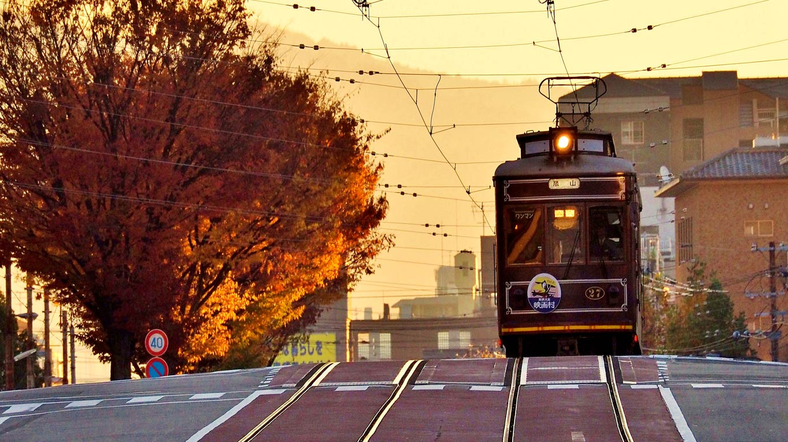

#### 20181014 The Bode Museum during the Festival of Lights in Berlin, Germany (© fhm/Getty Images)(Bing United Kingdom)

#### 20181013 '0 Degrees' laser art by Peter Fink and Anne Bean, in Greenwich, London (© Norah Saudan/Getty Images)(Bing United Kingdom)

#### 20181013 Vue sur la Basilique du Sacré Coeur à l’occasion des Vendanges de Montmartre, Paris (© narvikk/Getty Images)(Bing France)

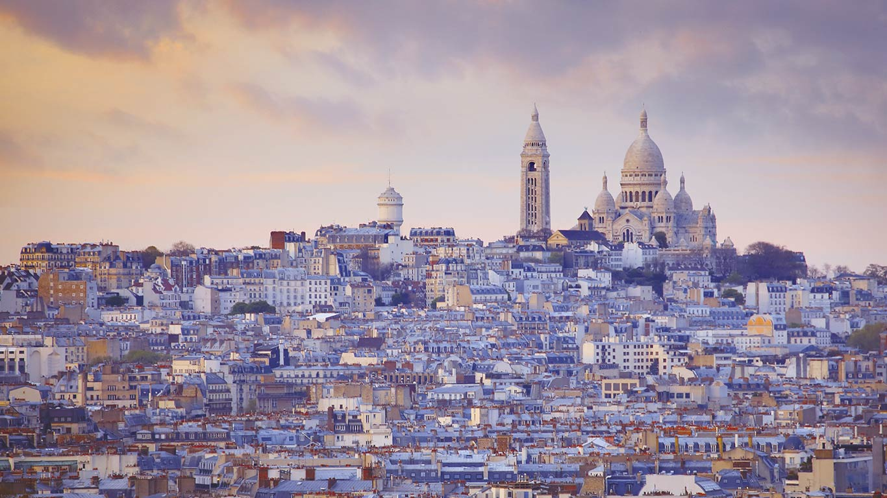

#### 20181012 Replica of Lascaux cave paintings at the International Centre for Cave Art in Montignac, France (© Caroline Blumberg/Epa/Shutterstock)(Bing United Kingdom)

#### 20181011 Schoolgirls in Fort Kochi, Kerala, India (© imageBROKER/Alamy)(Bing United Kingdom)

#### 20181011 „Eiserner Steg“ und Skyline von Frankfurt, Hessen, Deutschland. Anlässlich der Eröffnung der Frankfurter Buchmesse (© Martin Moxter/imageBROKER/age fotostock)(Bing Deutschland)

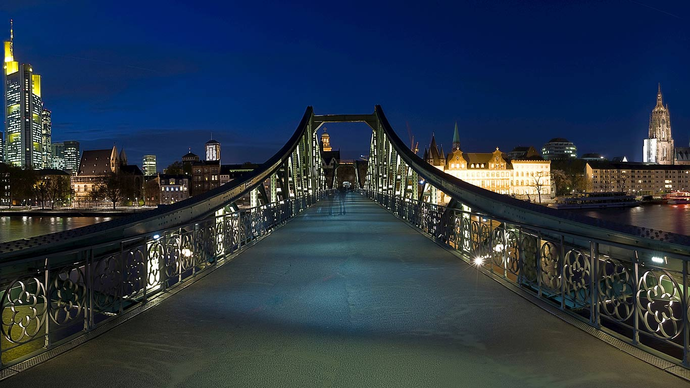

#### 20181010 Hubble Space Telescope’s view of Saturn (© NASA)(Bing United Kingdom)

#### 20181009 For Leif Erikson Day, a Norse building at L'Anse aux Meadows National Historic Site in Newfoundland, Canada (© Yves Marcoux/Getty Images)(Bing United States)

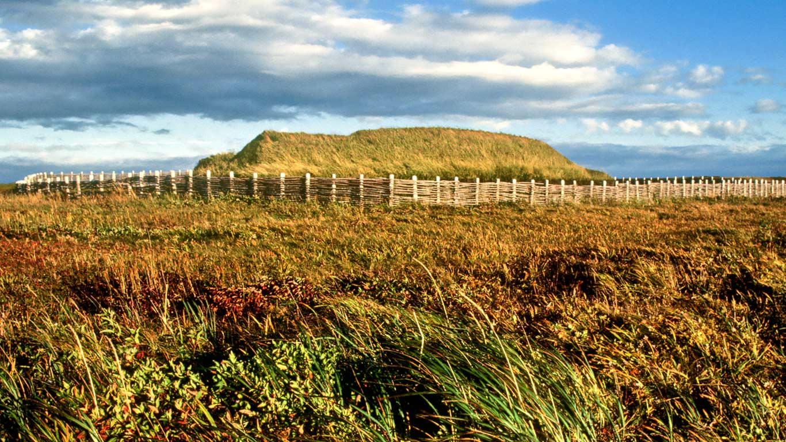

#### 20181009 Larch trees at Loch Tulla in the Highlands of Scotland (© Fortunato Gatto/SIME/eStock Photo)(Bing United Kingdom)

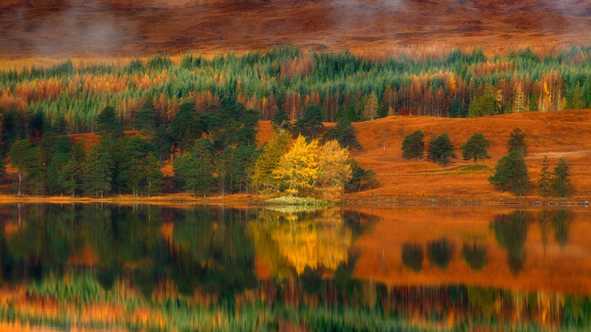

#### 20181008 Albuquerque International Balloon Fiesta runs until 14 October (© Blaine Harrington III/Alamy)(Bing United Kingdom)

#### 20181008 Bohemian Waxwing (Bombycilla garrulus) feeding on crabapples, Sudbury, Ontario, Canada (© Don Johnston/Getty Images)(Bing Canada)

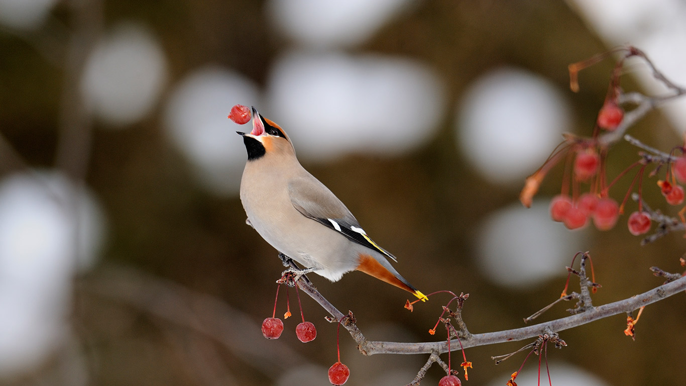

#### 20181008 Milky Way over Murray River (© Ben Goode/Tandem Stills + Motion)(Bing Australia)

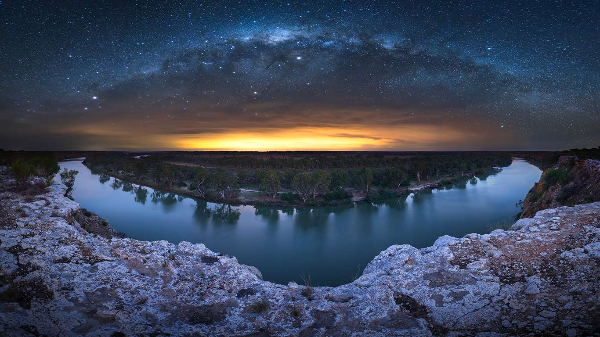

#### 20181007 Un acrobate s’apprêtant à faire un saut au dessus des voies ferrées de la ligne de Petite Ceinture de Paris lors de l’édition 2015 de la Nuit Blanche (© THOMAS SAMSON/Stringer/AFP)(Bing France)

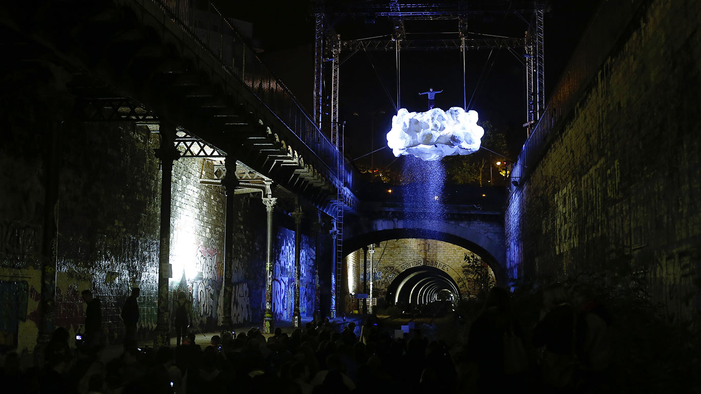

#### 20181007 Performers at the 26th Human Tower Competition in Tarragona, Spain (© Xinhua/Pau Barrena/Getty Images)(Bing United Kingdom)

#### 20181006 Lavender and sunflower fields under a stormy sky in Provence, France (© beboy/Shutterstock)(Bing United Kingdom)

#### 20181005 For World Smile Day, a common octopus (© blickwinkel/Alamy)(Bing United Kingdom)

#### 20181004 Close-up of a storm on Jupiter from the Juno spacecraft (© NASA/JPL-Caltech/SwRI/MSSS/Gerald Eichstadt/Sean Doran)(Bing United Kingdom)

#### 20181004 Illuminiertes Reichstagsgebäude in Berlin. Zum Tag der Deutschen Einheit (© Sean Gallup/Getty Images)(Bing Deutschland)

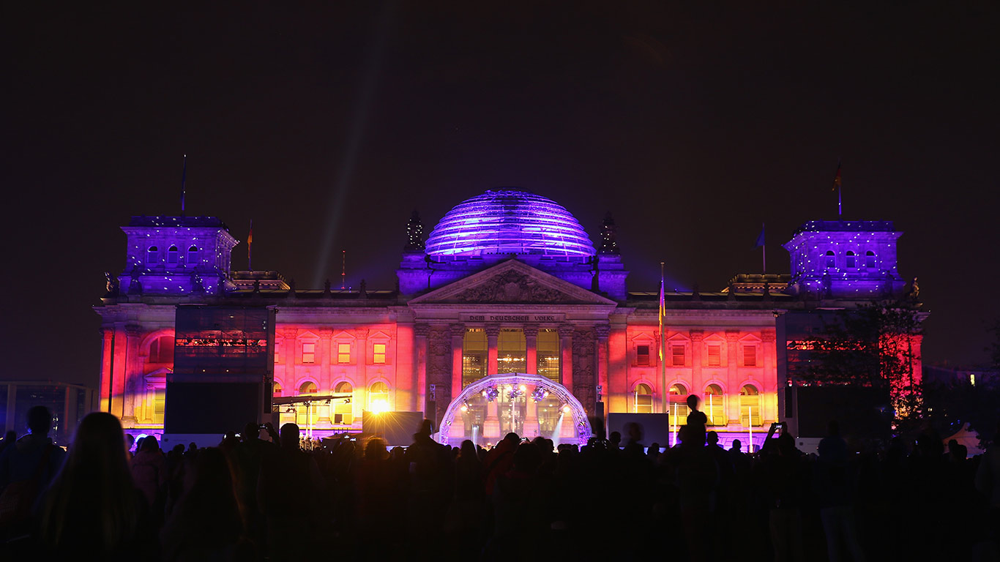

#### 20181003 Feuilles d’oxalis dans une forêt en Haute-Loire, France (© Philippe Bousseaud/Minden Pictures)(Bing France)

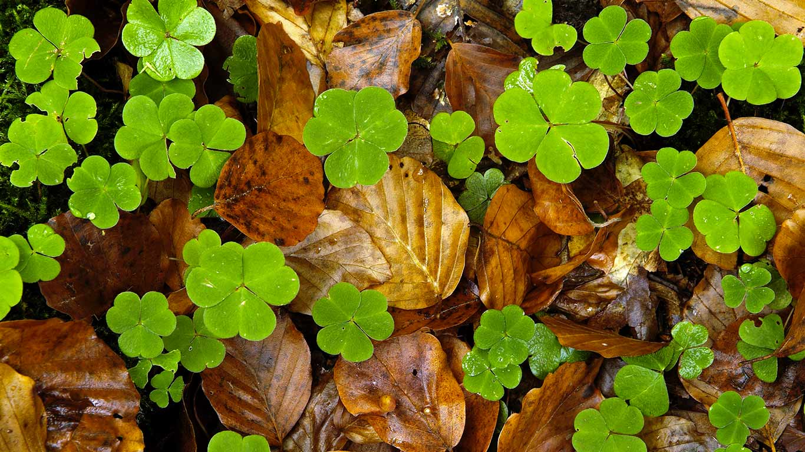

#### 20181003 Monarch butterflies in Michoacán, Mexico (© Alejandro Prieto/Minden Pictures)(Bing United Kingdom)

#### 20181002 【今日国庆节】放国旗风筝的人，中国上海 (© Qilai Shen/Bloomberg via Getty Images)(Bing China)

#### 20181002 Ouzel Lake in North Cascades National Park, Washington state, USA (© Ethan Welty)(Bing United Kingdom)

#### 20181001 Pink Mulla Mulla on a stony plain, Cravens Peak Station, Australia (© Auscape/UIG/Getty Images)(Bing Australia)

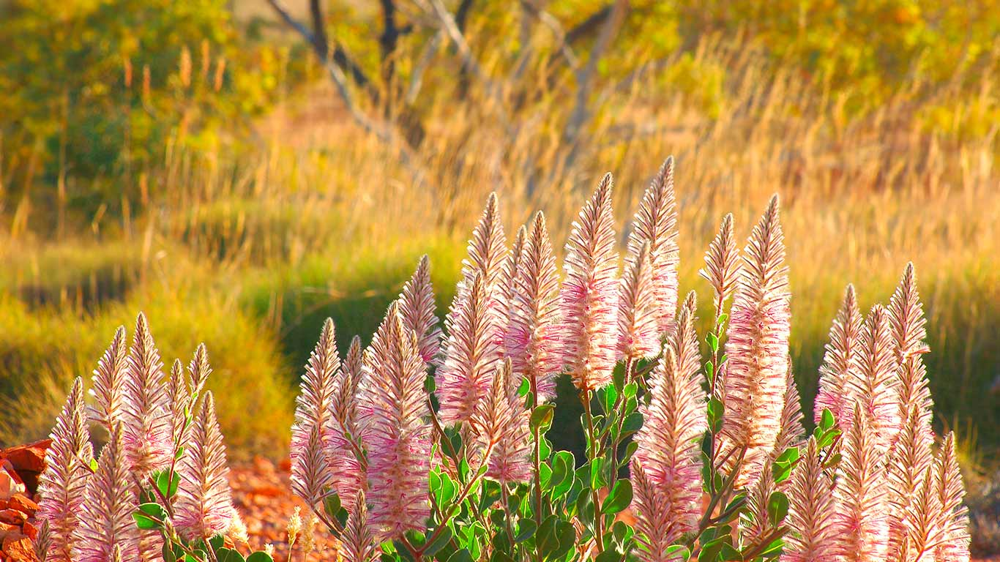

#### 20181001 Contrails from a 2007 Atlantis shuttle liftoff at the Kennedy Space Center in Florida (© TIM SLOAN/AFP/Getty Images)(Bing United States)

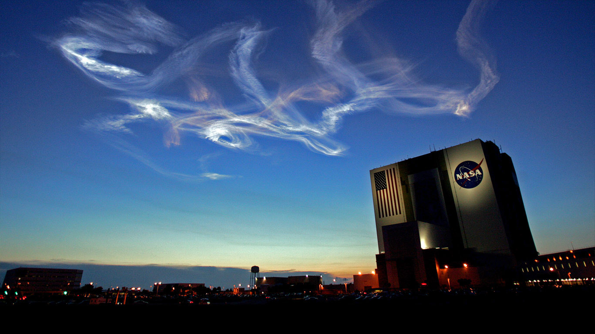

#### 20181001 The Gustav Klimt exhibit at the new digital art centre Atelier des Lumières in Paris, France (© Thierry Chesnot/Getty Images)(Bing United Kingdom)

