#### 20181130 Tartan fabric on a loom in Edinburgh, Scotland (© AA World Travel Library/Alamy)(Bing United Kingdom)

#### 20181130 Kilchurn Castle in Scotland for St. Andrew's Day (© Jon Arnold/Danita Delimont)(Bing United States)

#### 20181129 The Frankfurt Christmas Market in Germany is open now (© Patrice von Collani/Westend61/Offset)(Bing United Kingdom)

#### 20181128 Lighting of the tree at Rockefeller Center in New York City (© Thorney Lieberman/Getty Images)(Bing United States)

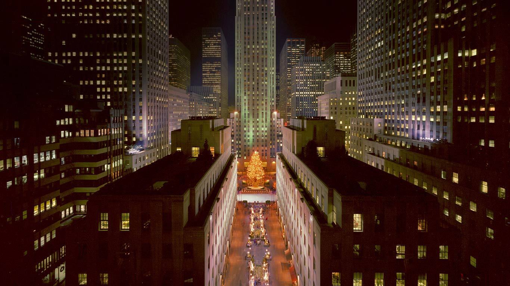

#### 20181128 Otway Fly Treetop walkways, Australia (© David Wall/Alamy Stock Photo)(Bing Australia)

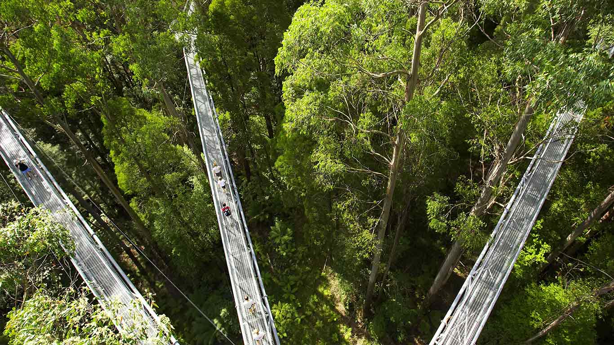

#### 20181128 A heart-shaped opening in a canopy of Scots pines to celebrate National Tree Week (© Mark Hamblin/2020VISION/Minden Pictures)(Bing United Kingdom)

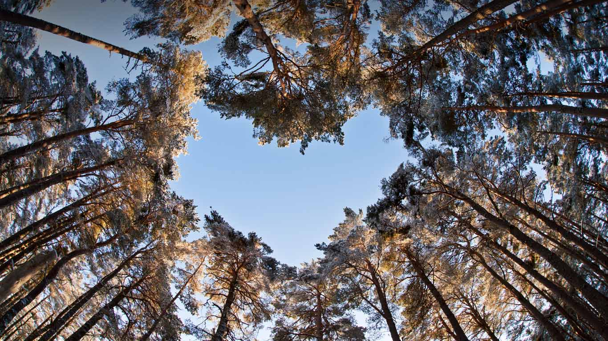

#### 20181127 Nebelumhüllte Wolkenkratzer in Frankfurt am Main, Hessen, Deutschland (© Boris Jordan Photography/Moment/Getty Images)(Bing Deutschland)

#### 20181127 An Arctic fox in Dovrefjell, Norway (© Andy Trowbridge/Minden Pictures)(Bing United Kingdom)

#### 20181126 Branche de mimosa, Massif du Tanneron, Var, France (© MOIRENC Camille/hemis.fr/Getty Images)(Bing France)

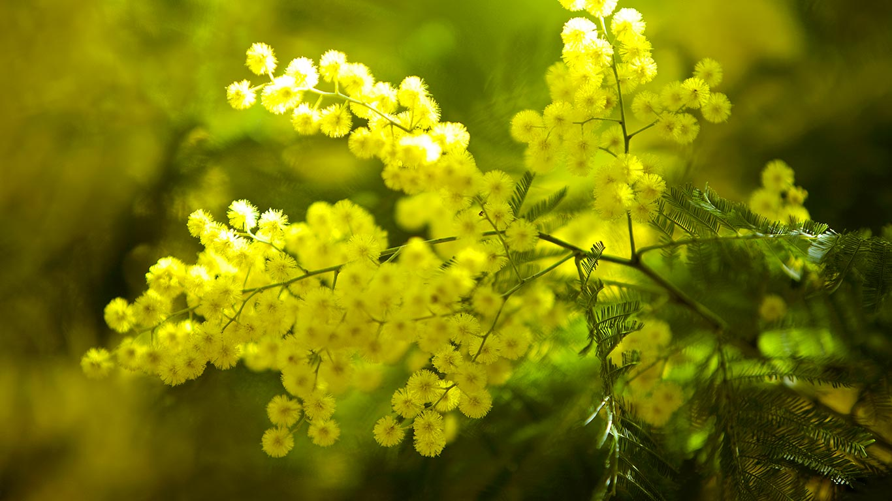

#### 20181126 A bull kelp forest in a strong current at Hussar Point, Browning Pass, B.C. (© Mauricio Handler/Getty Images)(Bing Canada)

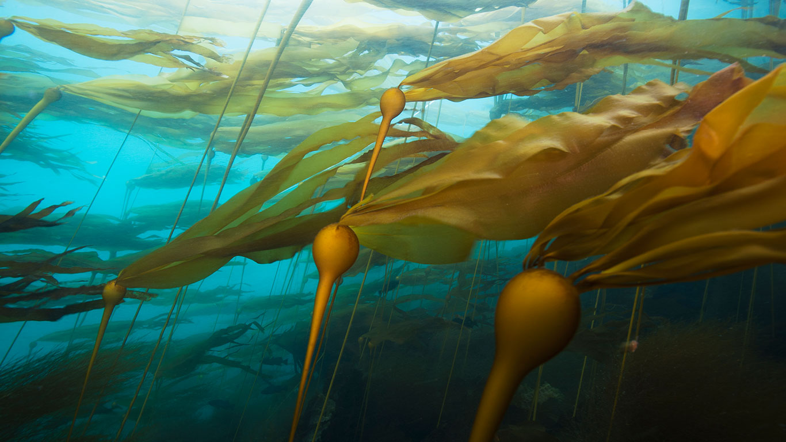

#### 20181126 The Alice in Wonderland sculpture in Central Park, New York City, USA (© Diego Grandi/Shutterstock)(Bing United Kingdom)

#### 20181125 Ice rink at Nathan Phillips Square, Toronto (© Oleksiy Maksymenko/Getty Images)(Bing Canada)

#### 20181125 The Northern Lights over a rowing boat in Norstead Viking replica village in Newfoundland, Canada (© Adam Woodworth/Aurora Photos)(Bing United Kingdom)

#### 20181124 A Darwin's finch on a giant tortoise for the anniversary of On the Origin of Species (© Tui De Roy/Minden Pictures)(Bing United Kingdom)

#### 20181123 Varenna on the shore of Lake Como, Italy (© Andrea Comi/Getty Images)(Bing United Kingdom)

#### 20181123 For Black Friday, shoppers reflected in ornaments (© Don Emmert/Getty Images)(Bing United States)

#### 20181122 Tom Turkey, the oldest float in the Macy's Thanksgiving Day Parade, in New York City (© Shannon Stapleton/Reuters)(Bing United States)

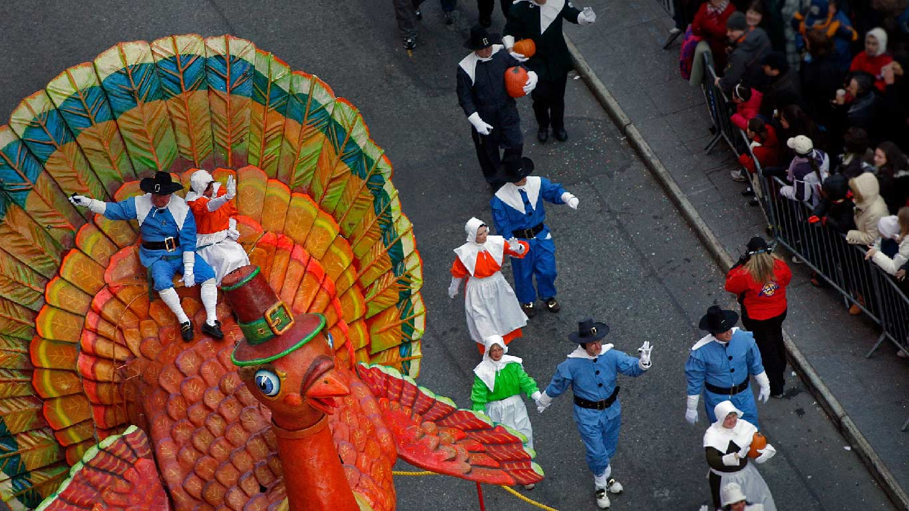

#### 20181122 Eibsee lake in Bavaria, Germany (© plainpicture/BY)(Bing United Kingdom)

#### 20181121 Wild ponies at Hay Bluff, Black Mountains, Brecon Beacons National Park, Wales (© Justin Foulkes/SIME/eStock Photo)(Bing United Kingdom)

#### 20181121 Amateur Night at the Apollo Theater in Harlem, New York City (© Lucas Vallecillos/Alamy)(Bing United States)

#### 20181120 Nénuphars flottant à la surface de l’eau, France (© Michel Loup/Minden Pictures)(Bing France)

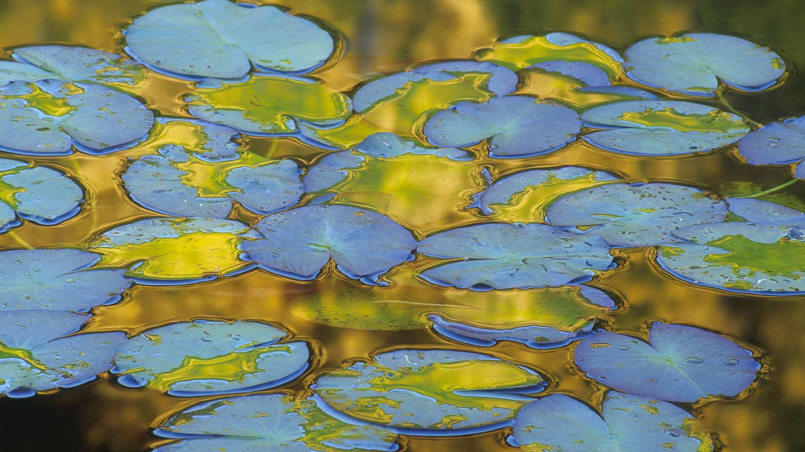

#### 20181120 Chilean flamingos in Torres del Paine National Park, Chile (© Ben Hall/Minden Pictures)(Bing United Kingdom)

#### 20181119 Virgin River in Zion National Park, Utah, USA, on the park's 99th birthday (© Justinreznick/Getty Images)(Bing United Kingdom)

#### 20181118 The Georgia Aquarium in Atlanta, Georgia, USA (© novikat/Getty Images)(Bing United Kingdom)

#### 20181117 A sleeping Kermode bear in British Columbia, Canada (© John E Marriott/SuperStock)(Bing United Kingdom)

#### 20181117 „A-Teppich“ des Bildhauers Fritz Kühn, Eingangsportal der Berliner Stadtbibliothek. Zum Bundesweiten Vorlesetag (© Zoonar GmbH/Alamy Stock Photo/Alamy)(Bing Deutschland)

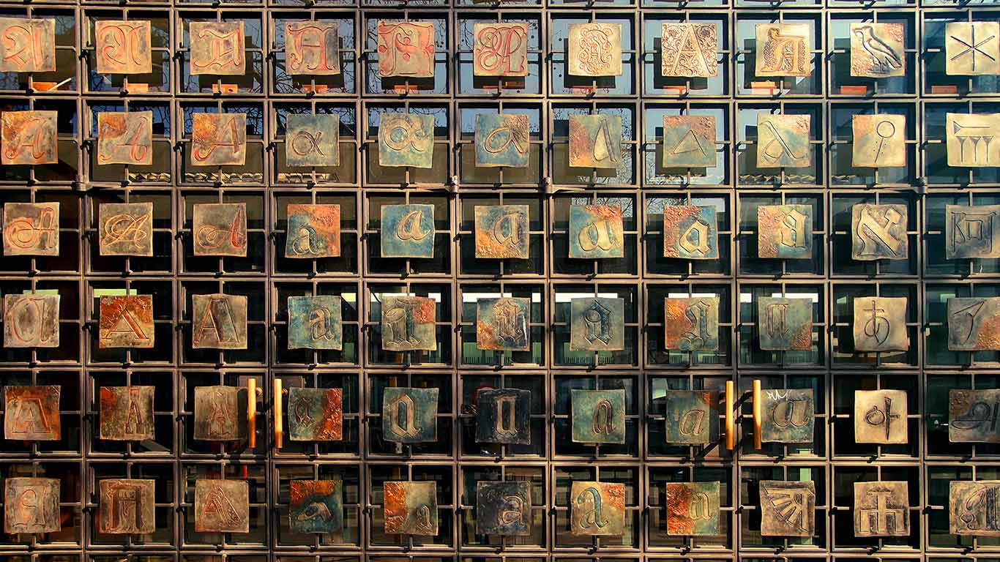

#### 20181116 Red-legged Pademelon joey, Queensland, Australia (© David Watts/Visuals Unlimited, Inc.)(Bing Australia)

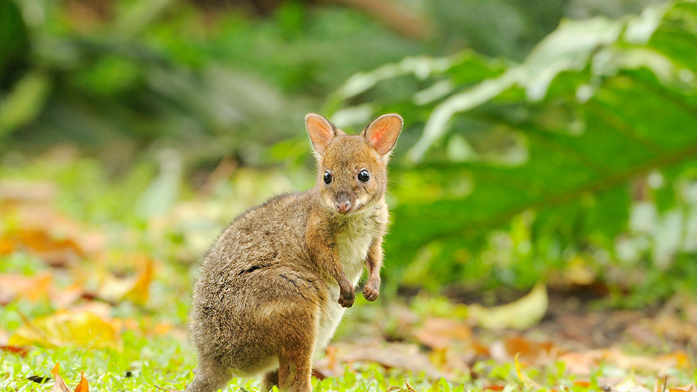

#### 20181116 Ancient rock art in Chiribiquete National Natural Park, Colombia (© Steve Winter/Getty Images)(Bing United Kingdom)

#### 20181115 Mandarin ducks perched on a branch (© Thomas Langley/Alamy)(Bing United Kingdom)

#### 20181115 Lewis and Clark National and State Historical Parks in Oregon on the anniversary of Lewis and Clark reaching the Pacific (© Morey Milbradt/Alamy)(Bing United States)

#### 20181114 ｢酉の市の縁起熊手｣東京, 浅草 (© Tomohiro Ohsumi/Bloomberg/Getty Images)(Bing Japan)

#### 20181114 At the Musée d'Orsay in Paris for Monet's birthday (© VCG Wilson/Corbis via Getty Images)(Bing United Kingdom)

#### 20181113 A tundra swan on the Mississippi River in Monticello, Minnesota, USA (© National Geographic Image Collection/Alamy)(Bing United Kingdom)

#### 20181112 Bleuets dans un couché de soleil à l’occasion du centième anniversaire de l’Armistice qui a marqué la fin de la Première Guerre Mondiale 1914-1918 (© sindlera/iStock/Getty Images Plus)(Bing France)

#### 20181112 Stone structure in Hamersley Gorge, Karijini National Park, Australia (© Frank Krahmer/Corbis Documentary/Getty Images)(Bing United Kingdom)

#### 20181112 The DC War Memorial, honoring residents of Washington, DC, who fought in World War I (© Sean Pavone/Alamy)(Bing United States)

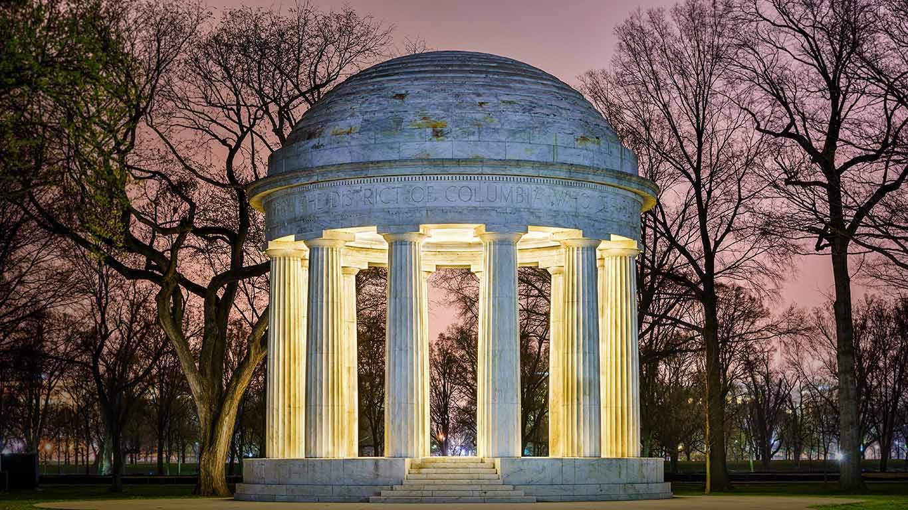

#### 20181111 Part of Blood Swept Lands and Seas of Red, an art installation at the Imperial War Museum North in Manchester (© Christopher Furlong/Getty Images)(Bing United Kingdom)

#### 20181111 Poppies sit by names on a memorial wall during Remembrance Day in Kingston, Ont. (© Lars Hagberg/Alamy Stock Photo)(Bing Canada)

#### 20181110 Badlands National Park in South Dakota, USA, turns 40 (© Tetra Images/Getty Images)(Bing United Kingdom)

#### 20181109 Cup fungus in Corcovado National Park, Costa Rica (© Alex Hyde/Minden Pictures)(Bing United Kingdom)

#### 20181108 【今日立冬】江苏兴化市老街 (© ViewStock/Getty Images)(Bing China)

#### 20181108 Manatees in Blue Spring State Park, Florida, USA (© Paul Nicklen/Getty Images)(Bing United Kingdom)

#### 20181107 Students light oil lamps to celebrate Diwali in Guwahati, India (© Anuwar Hazarika/Reuters)(Bing United Kingdom)

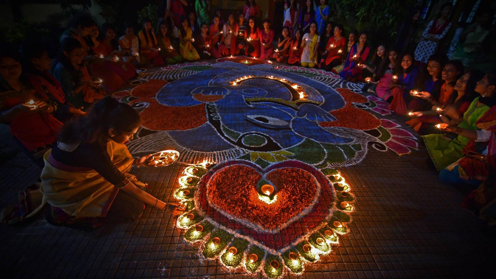

#### 20181106 École Paul Valery à Sète, dans l’Hérault, décorée d’un dessin de Julien “Seth” Malland (© Yann Guichaoua-Photos/Getty Images)(Bing France)

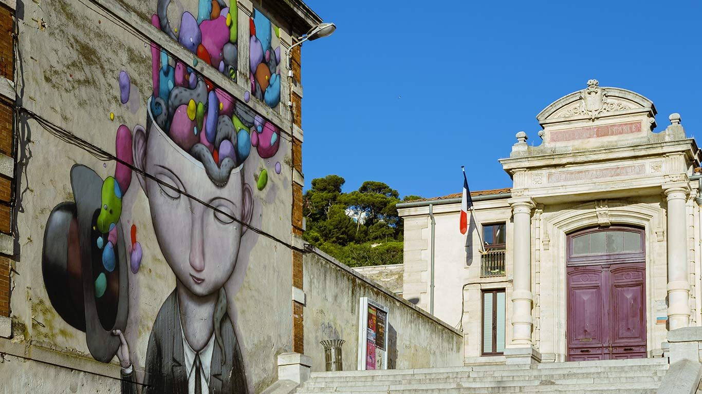

#### 20181106 Melbourne Cup Day at Flemington Racecourse on November 1, 2016 (© Quinn Rooney/Getty Images)(Bing Australia)

#### 20181106 Detail of the Lincoln Memorial, Washington, DC (© Walter Bibikow/Danita Delimont)(Bing United States)

#### 20181106 Neuschwanstein Castle in southern Bavaria, Germany (© Boris Jordan Photography/Getty Images)(Bing United Kingdom)

#### 20181105 A firework display in Lancashire, on Guy Fawkes Night (© Angus Matheson/Alamy)(Bing United Kingdom)

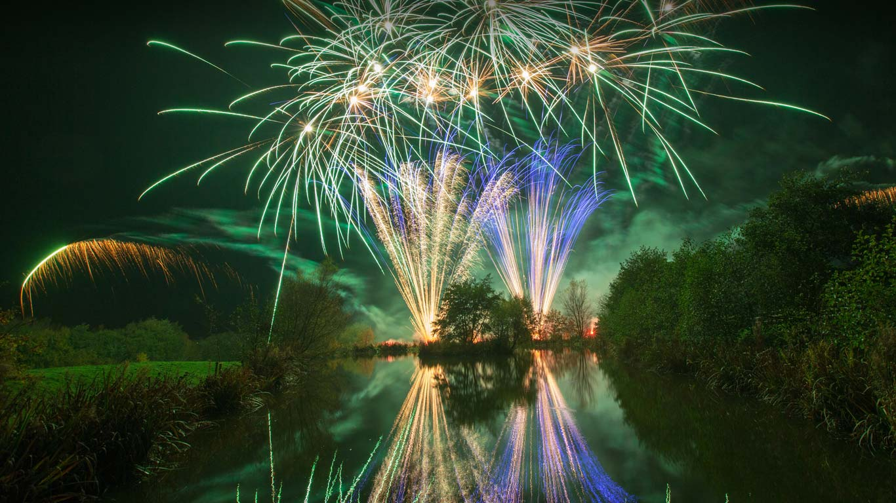

#### 20181104 Runners on the Verrazano-Narrows Bridge between Staten Island and Brooklyn, USA (© David Madison/Getty Images)(Bing United Kingdom)

#### 20181103 American bison in Antelope Island State Park, Utah, USA (© Conor Barry/Aurora Photos)(Bing United Kingdom)

#### 20181102 Sylvensteinspeicher und Faller-Klamm-Brücke im Morgennebel, Lenggries, Bayern, Deutschland (© Robert Harding/Alamy)(Bing Deutschland)

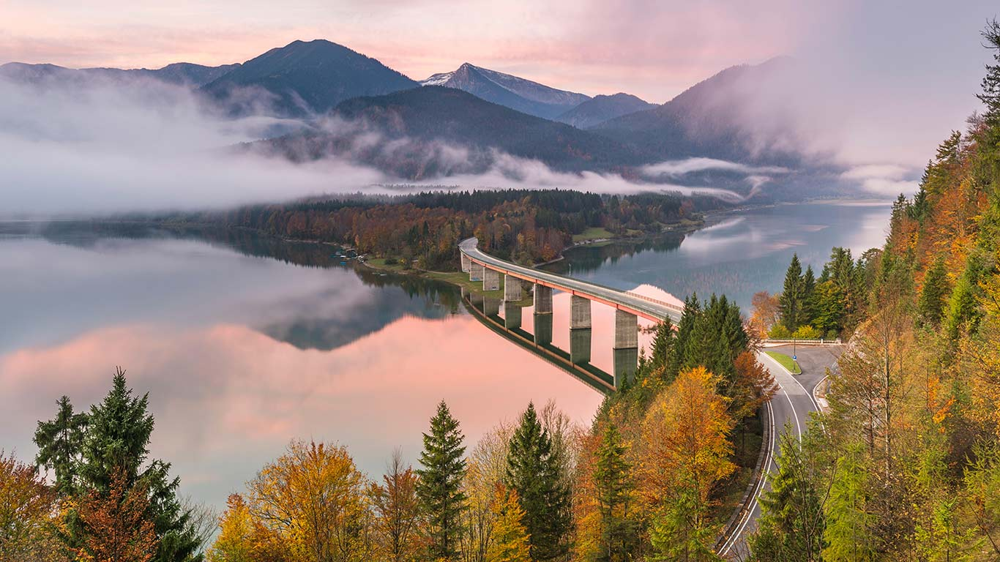

#### 20181102 ｢アカギツネの子ども｣ドイツ, ラウジッツ (© Kevin Prönnecke/imageBROKER/Alamy Stock Photo)(Bing Japan)

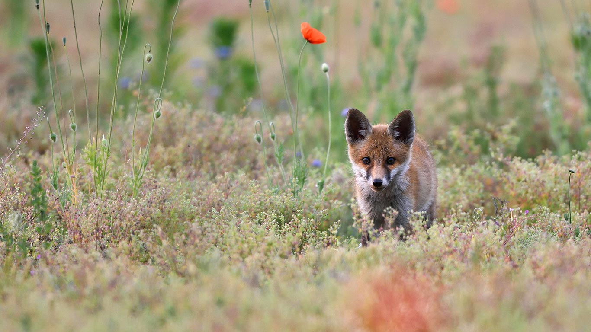

#### 20181102 大山，日本神奈川县 (© Katsuhiro Yamanashi/Getty Images)(Bing China)

#### 20181102 Dancing at the Gallup Inter-Tribal Indian Ceremonial in New Mexico (© Chuck Place/Alamy)(Bing United States)

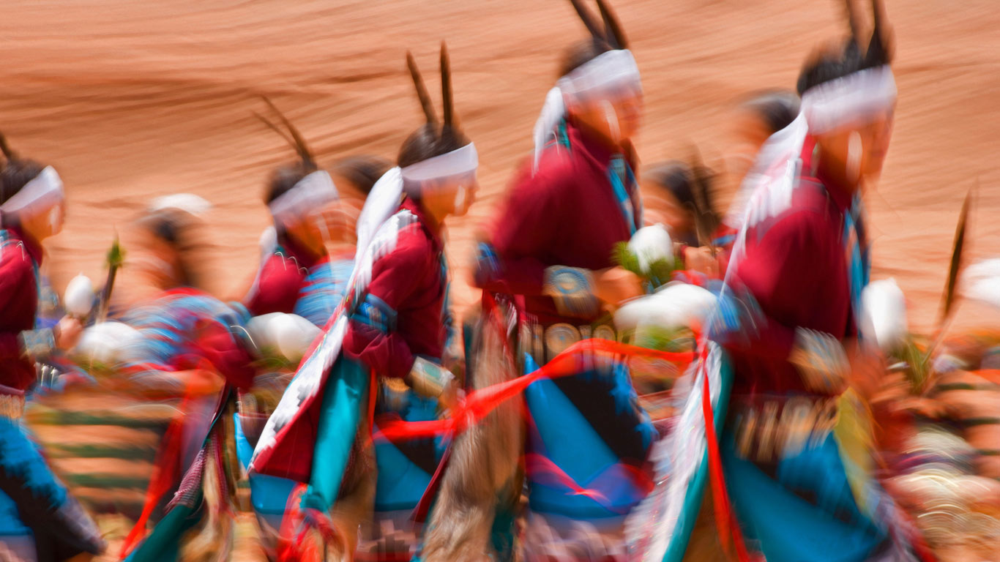

#### 20181102 Calaca figures to celebrate the Day of the Dead (© PvE/Alamy)(Bing United Kingdom)

#### 20181101 Autumn foliage colours reflect on rapids in Rivière-du-Nord, Quebec (© Gilles Delisle/Jaynes Gallery/DanitaDelimont.com)(Bing Canada)

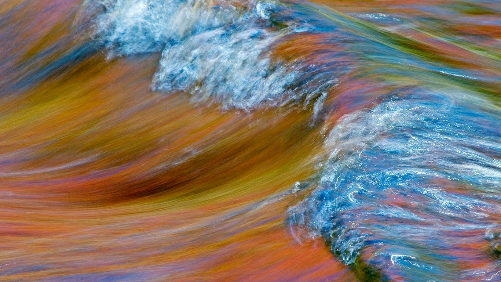

#### 20181101 ｢小さなジャック・オ・ランタン｣ (© Alina Demidenko/Getty Images)(Bing Japan)

#### 20181101 A maize maze in Petaluma, California, USA (© Gallery Stock)(Bing United Kingdom)

