#### 20181231 Fireworks in London for the new year (© Anadolu Agency/Getty Images)(Bing United Kingdom)

#### 20181230 A sea slug in the waters off Bali (© Media Drum World/Alamy)(Bing United Kingdom)

#### 20181229 The Aurora Borealis over Lofoten, Norway (© arnaudbertrande/Getty Images)(Bing United Kingdom)

#### 20181228 A bald eagle in Wyoming’s Grand Teton National Park (© Kathleen Reeder Wildlife Photography/Getty Images)(Bing United States)

#### 20181228 A macro shot of a frozen soap bubble on snow, Montreal (© Marianna Armata/Getty Images)(Bing Canada)

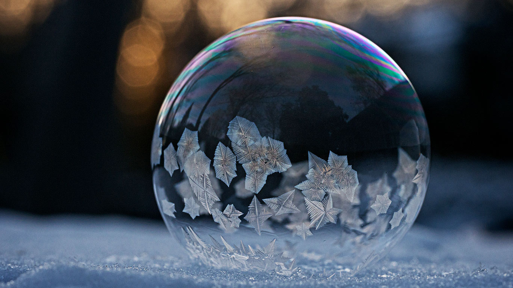

#### 20181228 A Eurasian oystercatcher among a flock of roosting knots in Snettisham, Norfolk (© Paul Sawer/Minden Pictures)(Bing United Kingdom)

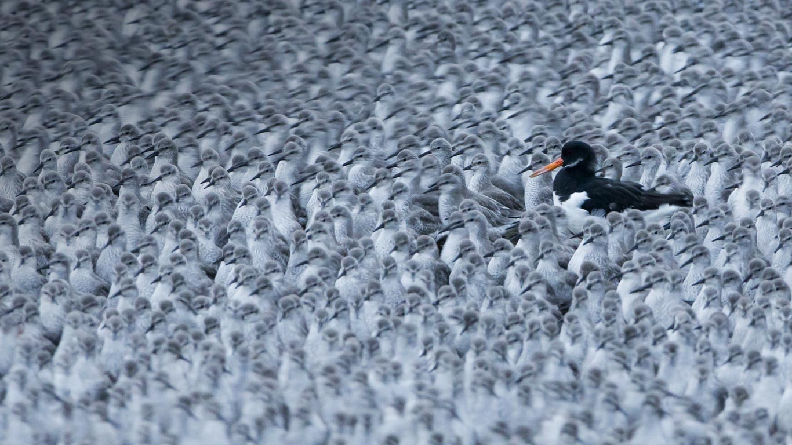

#### 20181227 ｢上野東照宮拝殿の扉｣東京, 上野 (© robertharding/Alamy Stock Photo)(Bing Japan)

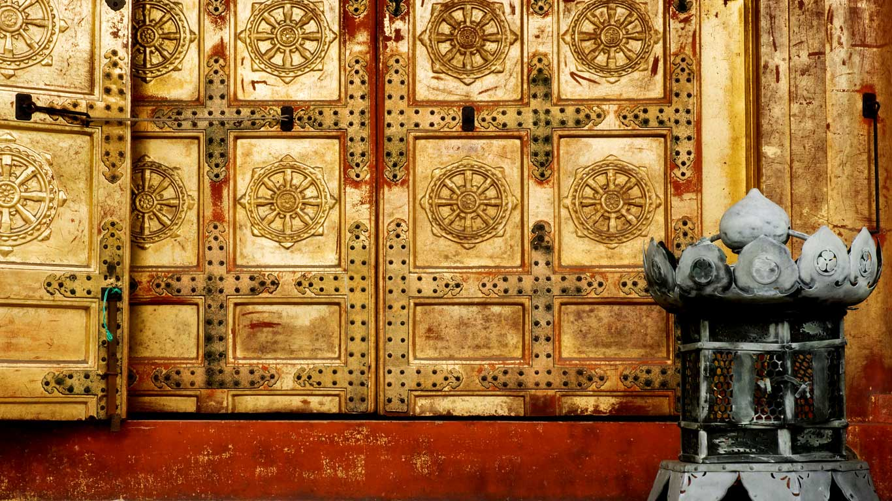

#### 20181227 Festlich illuminierte Pfarrkirche St. Sebastian in Ramsau bei Berchtesgaden, Bayern, Deutschland (© Hans Fürmann/age footstock)(Bing Deutschland)

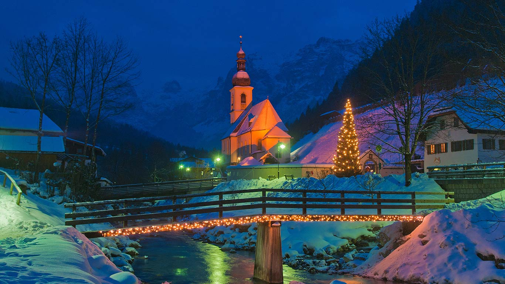

#### 20181227 Les miroirs d’eau de la Promenade du Paillon, Nice (© bellena/Shutterstock)(Bing France)

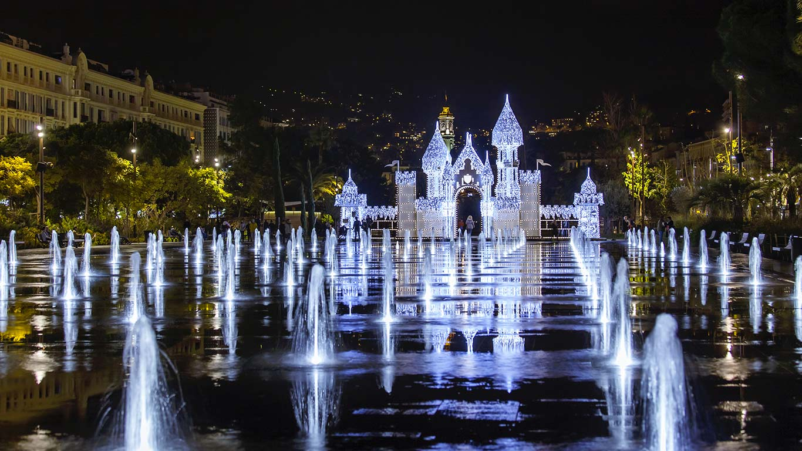

#### 20181227 Bethesda Fountain in New York City, USA (© Mitchell Funk/Getty Images)(Bing United Kingdom)

#### 20181226 Oxford Circus crossing, London (© Matt Cheetham/Getty Images)(Bing United Kingdom)

#### 20181226 Abracadabra races during the 2015 Sydney to Hobart in Sydney, Australia (© Cameron Spencer/Getty Images Sport)(Bing Australia)

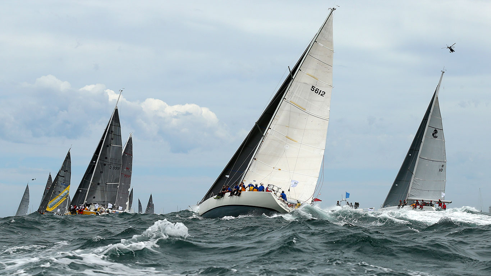

#### 20181225 A wintry scene for Christmas (© Nimia)(Bing United Kingdom)

#### 20181225 ｢けやき坂のイルミネーションと東京タワー｣東京, 六本木 (© ZhangXun/Getty Images)(Bing Japan)

#### 20181225 Kapelle in der Nähe von Schloss Elmau, Bayern, Deutschland (© footageclips/Shutterstock)(Bing Deutschland)

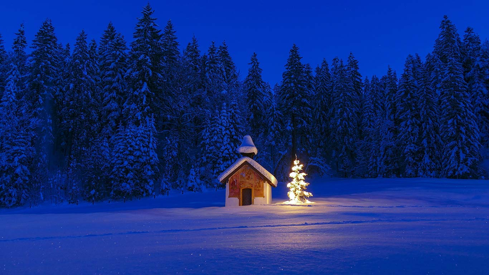

#### 20181224 Salzburg, Austria, for the 200th anniversary of the Christmas carol Silent Night (© MacEaton/Alamy)(Bing United Kingdom)

#### 20181223 Ravennaschlucht Christmas market in the Höllental, Germany (© Daniel Schoenen/Aurora Photos)(Bing United Kingdom)

#### 20181222 Château de Lourmarin sous la neige, Vaucluse, France (© MOIRENC Camille/age fotostock)(Bing France)

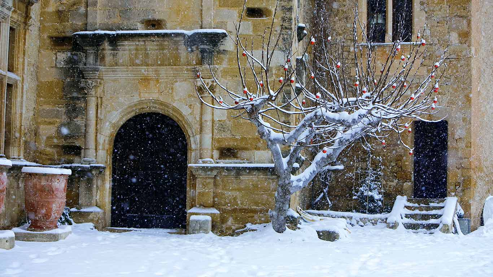

#### 20181222 Moonrise over Yellowstone National Park, USA (© Tom Murphy/Getty Images)(Bing United Kingdom)

#### 20181221 Christmas decorations at the Allen Lambert Galleria in Brookfield Place, Toronto (© Rubens Alarcon/Alamy)(Bing Canada)

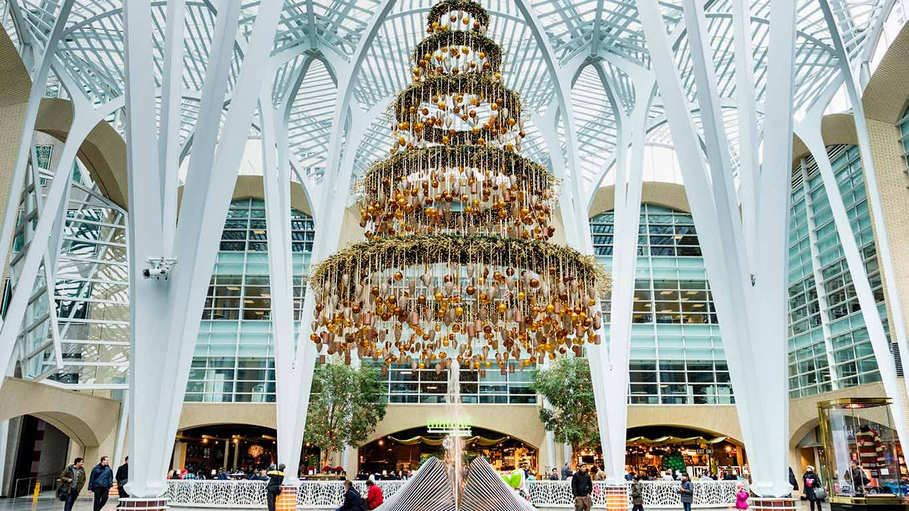

#### 20181221 For the solstice, Santa Fe's Farolito Walk (© Julien McRoberts/Danita Delimont)(Bing United Kingdom)

#### 20181220 Night-time view of market stalls in Winchester, Hampshire (© mreco/Adobe)(Bing United Kingdom)

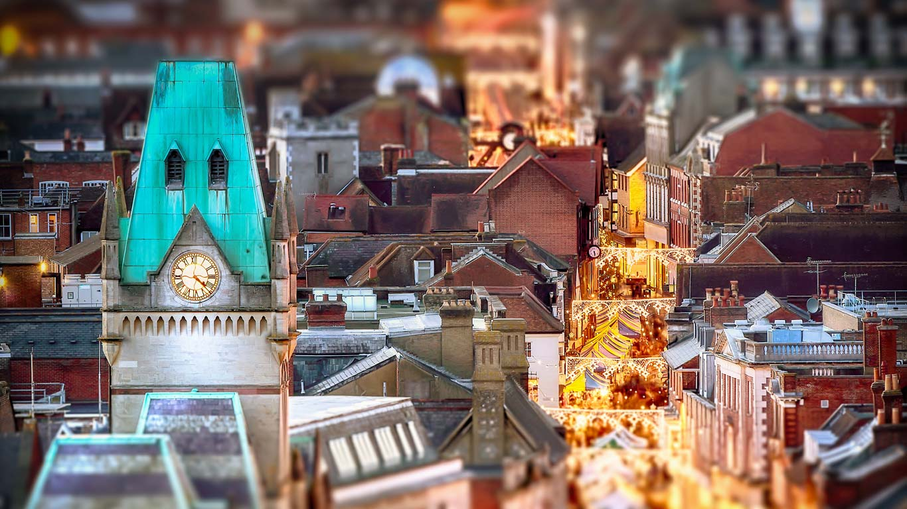

#### 20181219 Charles Bridge in Prague, Czech Republic (© borchee/E+/Getty Images)(Bing United Kingdom)

#### 20181218 For the anniversary of the premiere of The Nutcracker, a scene of the Moscow Ballet performing the popular dance (© Tytus Zmijewski/Epa/Shutterstock)(Bing United Kingdom)

#### 20181218 Hinterzarten im Südschwarzwald, Baden-Württemberg, Deutschland (© Spiegelhalter/Huber Images/eStock Photo)(Bing Deutschland)

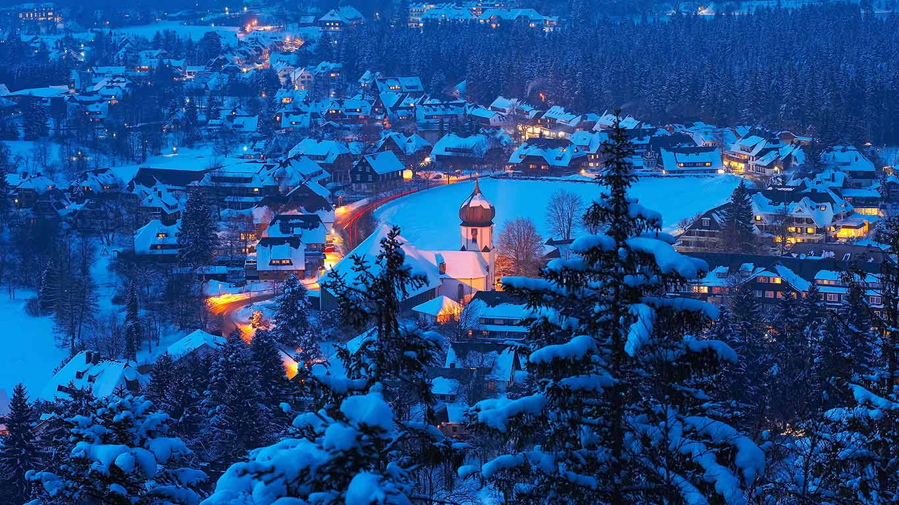

#### 20181218 Lac du Mont-Cenis gelé, Val-Cenis, Savoie, France (© Luca Biolcati/PLM Collection/Offset)(Bing France)

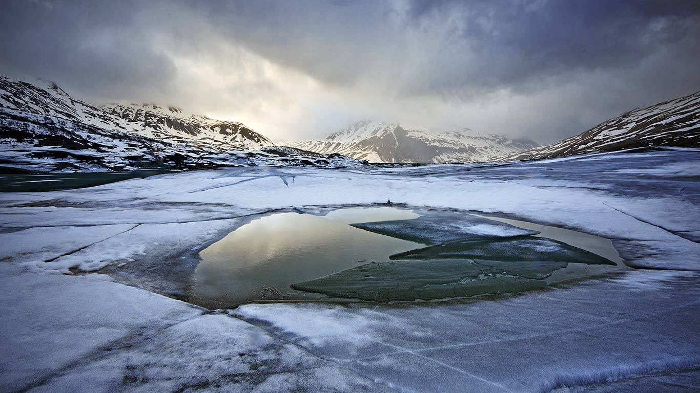

#### 20181217 Wilbur Wright gliding down Big Kill Devil Hill in Kitty Hawk, North Carolina (© Library of Congress)(Bing United States)

#### 20181217 Long exposure of traffic on a motorway in Osoyoos, British Columbia, Canada (© Bun Lee/Media Drum World/Aurora Photos)(Bing United Kingdom)

#### 20181216 Festive decorations on a canal in Murano, Italy (© John Warburton-Lee/DanitaDelimont.com)(Bing United Kingdom)

#### 20181215 The Stoneman Bridge on the Merced River in Yosemite National Park, USA (© Ron_Thomas/E+/Getty Images)(Bing United Kingdom)

#### 20181215 Saltwater clams in Cocos (Keeling) Islands, Australia, Indian Ocean (© Lynn Gail/Robert Harding/Aurora Photos)(Bing Australia)

#### 20181214 Nabana no Sato gardens at Nagashima Spa Land in Kuwana, Japan (© Julian Krakowiak/Alamy)(Bing United Kingdom)

#### 20181214 A female northern cardinal (© Matthew Studebaker/Minden Pictures)(Bing United States)

#### 20181213 Reykjavik on the second night of the Yule Lads (© Arctic-Images/Corbis Documentary/Getty Images)(Bing United Kingdom)

#### 20181212 Poinsettia flower buds (© Wild Wonders of Europe/Radisics/Minden Pictures)(Bing United Kingdom)

#### 20181211 Mount Kilimanjaro from Chyulu Hills National Park in Kenya for Mountain Day (© Lucas Vallecillos/Alamy Stock Photo)(Bing United Kingdom)

#### 20181211 Weihnachtsmarkt am Abend, Goslar, Niedersachsen, Deutschland (© Westend61/Getty Images)(Bing Deutschland)

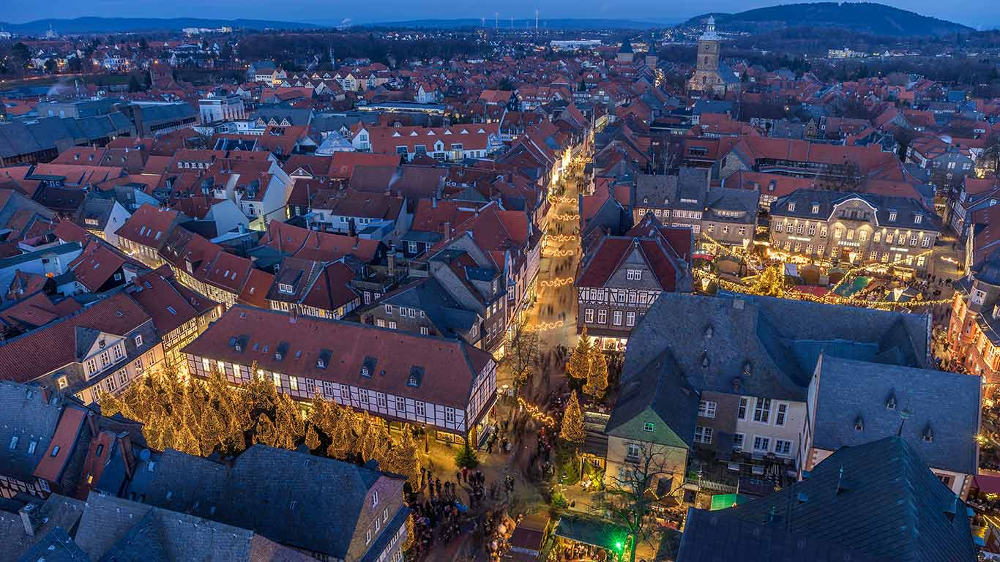

#### 20181210 A Christmas Island red crab during its migration (© Ingo Arndt/Minden Pictures)(Bing United Kingdom)

#### 20181209 Un cygne tuberculé plongeant pour se nourrir dans une rivière en Bourgogne, France (© Cyril Ruoso/Minden Pictures)(Bing France)

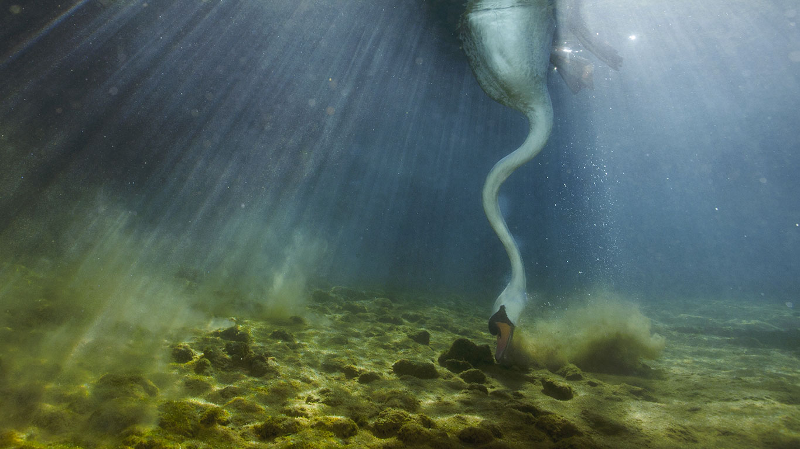

#### 20181209 Snow covering the Painted Hills of John Day Fossil Beds National Monument in Oregon, USA (© Floris van Breugel/Minden Pictures)(Bing United Kingdom)

#### 20181208 【今日大雪】被大雪覆盖的合掌屋，日本白川乡 (© Toyofumi Mori/Getty Images)(Bing China)

#### 20181208 Two Jack Lake in Banff National Park, Alberta, Canada (© Aurora Photos/Offset by Shutterstock)(Bing United Kingdom)

#### 20181207 Toronto Christmas market at the Distillery District, Toronto (© Paul Porter/Getty Images)(Bing Canada)

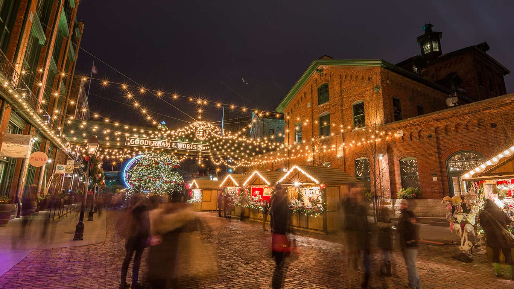

#### 20181207 Christmas lights on Regent Street in London’s West End (© Taka Wu/Alamy)(Bing United Kingdom)

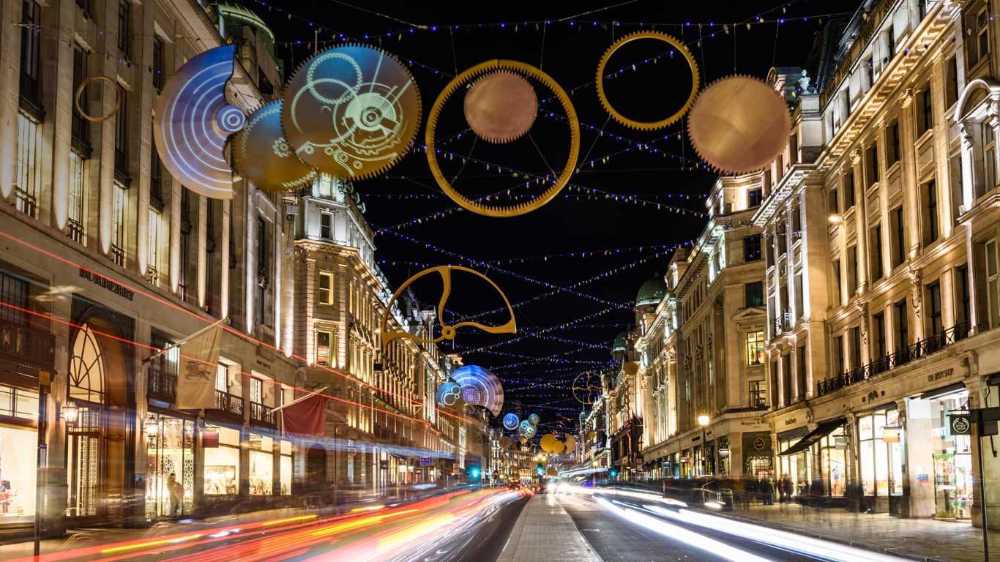

#### 20181207 The USS Arizona Memorial at Pearl Harbor, Honolulu, Hawaii (© AB Forces News Collection/Alamy Stock Photo)(Bing United States)

#### 20181207 ｢プーバー・ビーチの漁師たち｣インド, ケーララ州 (© Cultura RM Exclusive/Philip Lee Harvey/Getty Images)(Bing Japan)

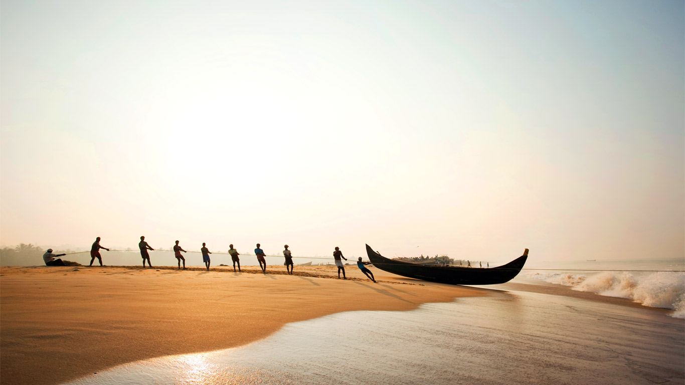

#### 20181207 Brighton Bathing Boxes at Brighton Beach, Melbourne, Australia (© Adobe Stock)(Bing Australia)

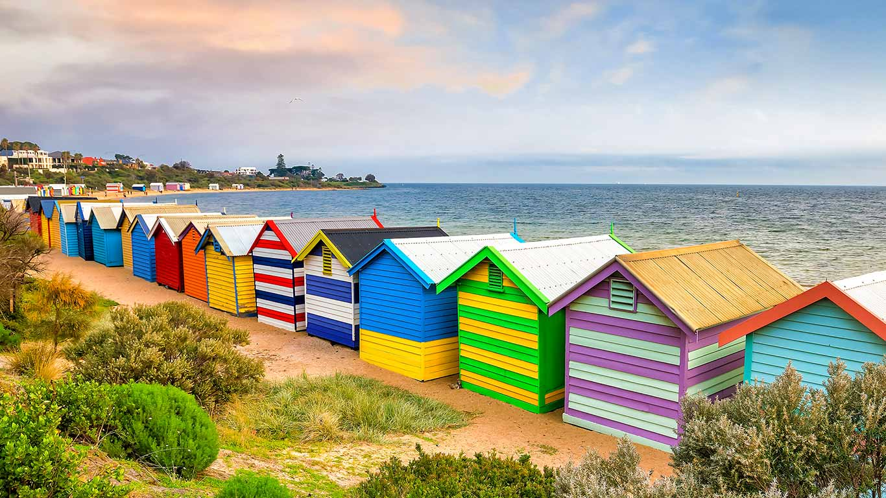

#### 20181206 An eagle-owl in Helsinki for Finland's Independence Day (© Markus Varesvuo/Minden Pictures)(Bing United Kingdom)

#### 20181205 Looking out to Godrevy Lighthouse in St Ives Bay, Cornwall (© David Chapman/Alamy)(Bing United Kingdom)

#### 20181205 The US Capitol with flags at half-staff as former President George H.W. Bush lies in state at the Capitol rotunda, Washington, DC, on Dec 3, 2018 (© Al Drago/Bloomberg via Getty Images)(Bing United States)

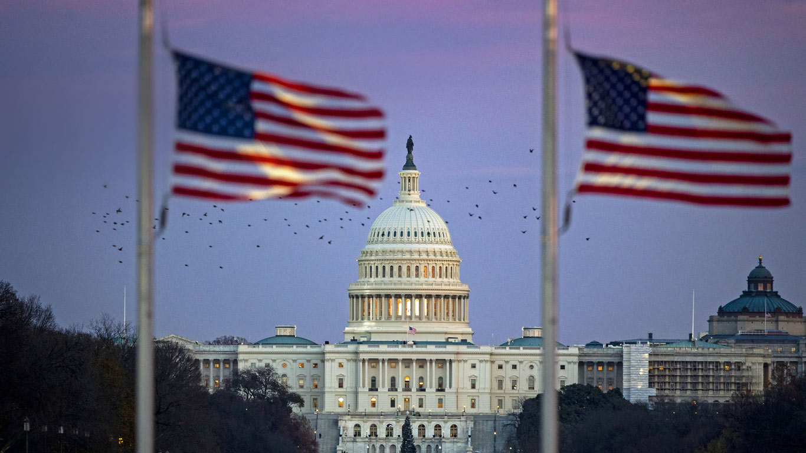

#### 20181205 An outdoor curling tournament in Naseby, New Zealand. The Curling World Cup begins today. (© David Wall/Danita Delimont)(Bing Canada)

#### 20181204 Pfarrkirche St. Georg, Ruhpolding, Bayern, Deutschland (© Rüdiger Hess/geo-select FotoArt)(Bing Deutschland)

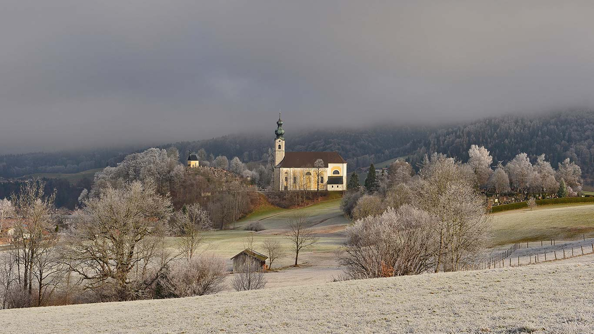

#### 20181204 Sphinx Observatory in Switzerland (© Jan Greune/Alamy)(Bing United Kingdom)

#### 20181203 A page of Alan Turing's notebook to kick off Computer Science Education Week (© Spencer Platt/Getty Images News)(Bing United Kingdom)

#### 20181202 Surfers at Bronte Beach, Australia (© Irenaeus Herok/Gallery Stock)(Bing Australia)

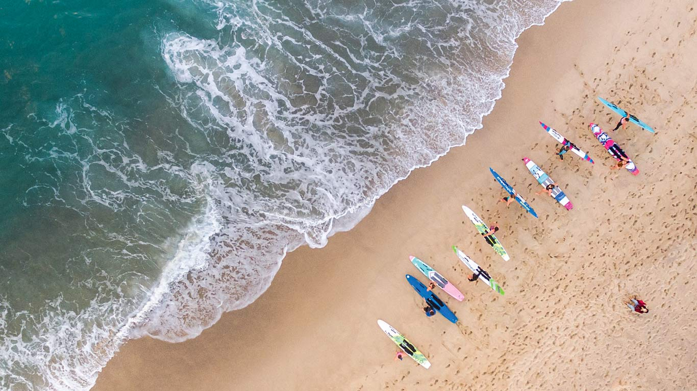

#### 20181202 Un calendrier de l’Avent composé de petites chaussettes tricotées (© Zoonar GmbH/Alamy Stock Photo)(Bing France)

#### 20181202 Old Nuuk in Nuuk, Greenland (© nevereverro/Getty Images)(Bing United Kingdom)

#### 20181201 A view of our southernmost continent for Antarctica Day (© Jan Vermeer/Minden Pictures)(Bing United Kingdom)

