#### 20190131 Eurasian lynx in the Bohemian-Moravian Highlands of the Czech Republic (© sduben/Getty Images Plus)(Bing United Kingdom)

#### 20190130 Landmark Center clock tower and Winter Carnival Ice Palace in Saint Paul, Minnesota, USA (© Joe Mamer Photography/Alamy)(Bing United Kingdom)

#### 20190129 An old farm in the Shetland Islands, Scotland (© Michael Runkel/Getty Images)(Bing United Kingdom)

#### 20190128 A European goldfinch perched among rosehips in snow (© Ernie Janes/Nature Picture Library/Offset)(Bing United Kingdom)

#### 20190127 Performers at the International Festival of the Masquerade Games in Pernik, Bulgaria (© djumandji/Getty Images Plus)(Bing United Kingdom)

#### 20190127 Memorial to the Murdered Jews of Europe in Berlin, Germany (© McPHOTO/age fotostock)(Bing United States)

#### 20190126 Sunset at Counts Point in West MacDonnell Ranges, Northern Territory, Australia (© Posnov/Moment/Getty Images)(Bing Australia)

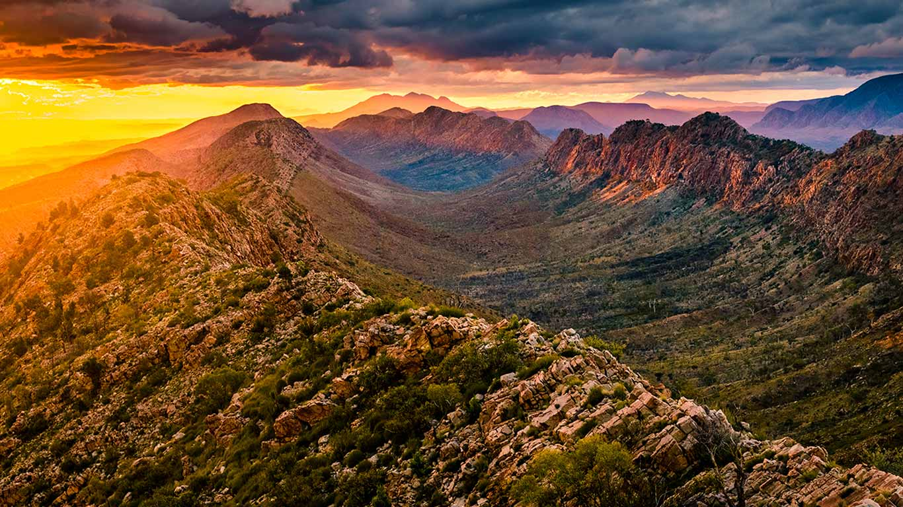

#### 20190126 Rajgad Fort near Pune, India (© Rohit Gowaikar/Getty Images)(Bing United Kingdom)

#### 20190125 Full moon rising over Dunnottar Castle near Stonehaven on the north-east coast of Scotland (© Angus Clyne/Moment/Getty Images)(Bing United Kingdom)

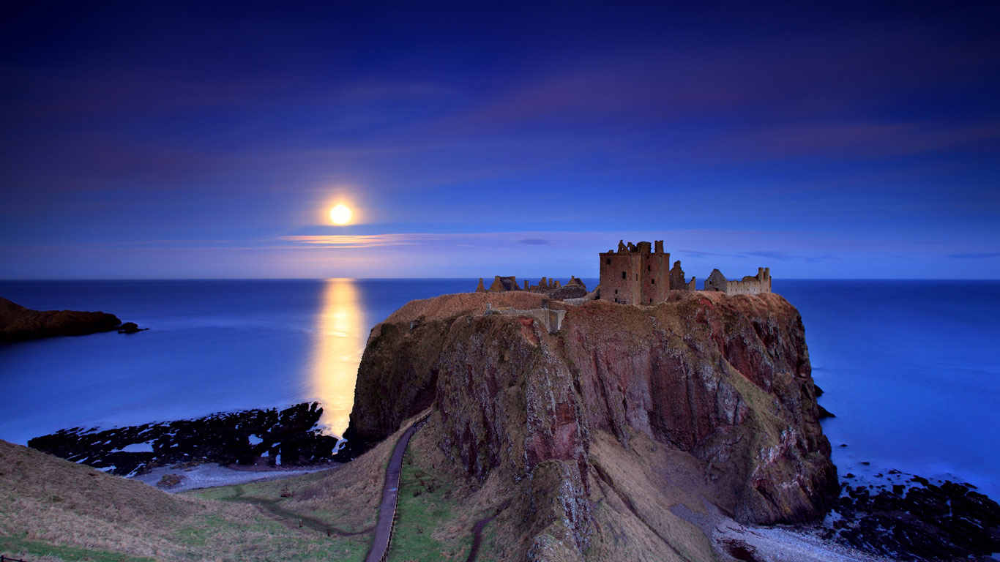

#### 20190125 Old hockey skates hanging on a blue wooden wall (© SergeKa/Getty Images)(Bing Canada)

#### 20190124 Park City, Utah, for the Sundance Film Festival, which begins today (© Patrick Brandenburg/Tandem Stills + Motion)(Bing United Kingdom)

#### 20190124 Bodegas Ysios in Laguardia, Rioja Alavesa, Spanien (© Mike Randolph/Masterfile)(Bing Deutschland)

#### 20190123 Aerial shot of mangroves at King Sound, Western Australia (© Ingo Oeland/Alamy Stock Photo)(Bing Australia)

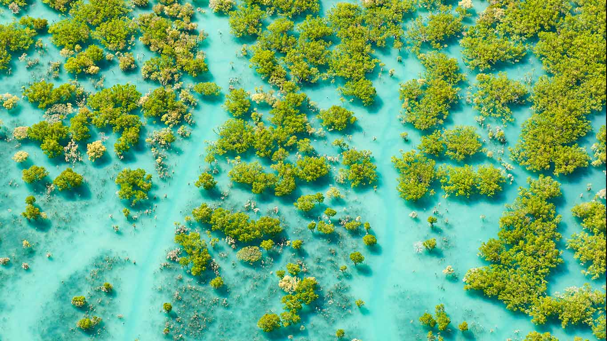

#### 20190123 Lake Dobson in Mount Field National Park of Tasmania, Australia (© Tom Mackie/plainpicture)(Bing United Kingdom)

#### 20190123 Passerelle des Deux Rives (Brücke der zwei Ufer) über den Rhein zwischen Straßburg und Kehl. Zum Deutsch-Französischen Tag (© MattLphotography/Shutterstock)(Bing Deutschland)

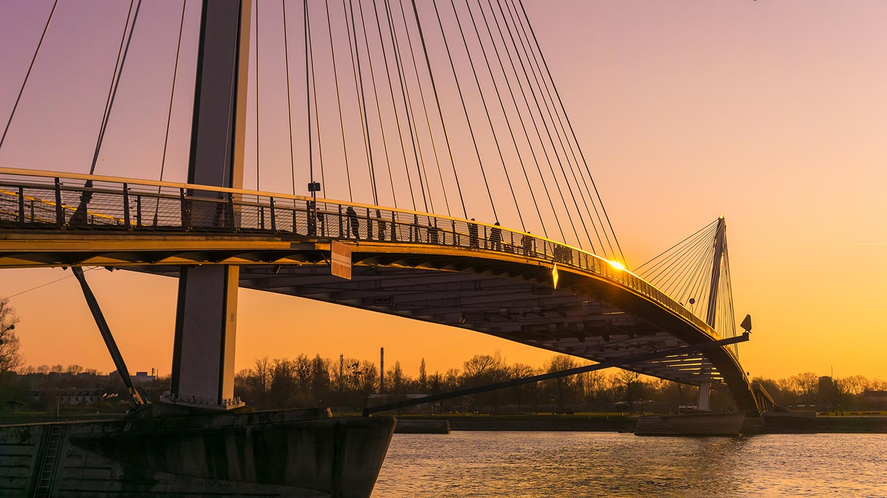

#### 20190123 A wall of nails inside the Toronto City Hall (© Lycia Walter/Shutterstock)(Bing Canada)

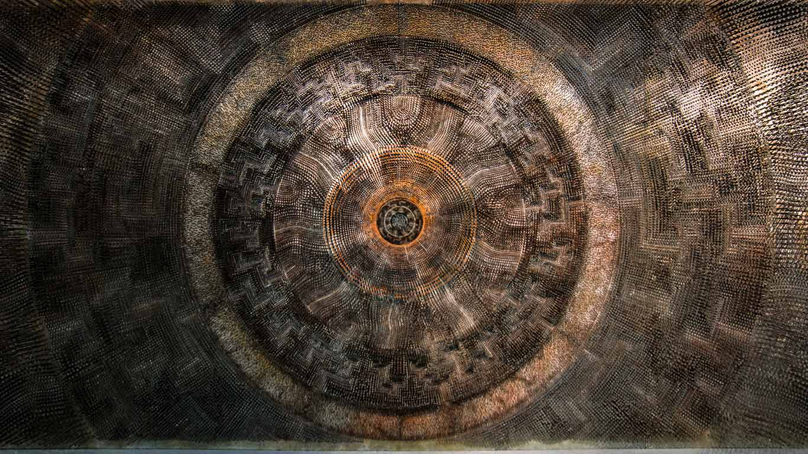

#### 20190123 On Pie Day, an apple tree in winter (© Chris Stein/Getty Images)(Bing United States)

#### 20190122 Eine Känguru-Mutter umarmt ihr Junges. Zum Weltknuddeltag  (© Belle Ciezak/Shutterstock)(Bing Deutschland)

#### 20190122 Ysios Winery in La Rioja, Spain (© Mike Randolph/Masterfile)(Bing United Kingdom)

#### 20190121 A ladybird hibernates in Tewin, Hertfordshire (© James Pearce/Alamy)(Bing United Kingdom)

#### 20190121 Martin Luther King, Jr. Memorial in Washington, DC (© Chip Somodevilla/Getty Images News/License granted by Intellectual Properties Management, Atlanta, Georgia, as exclusive licensor of the King Estate)(Bing United States)

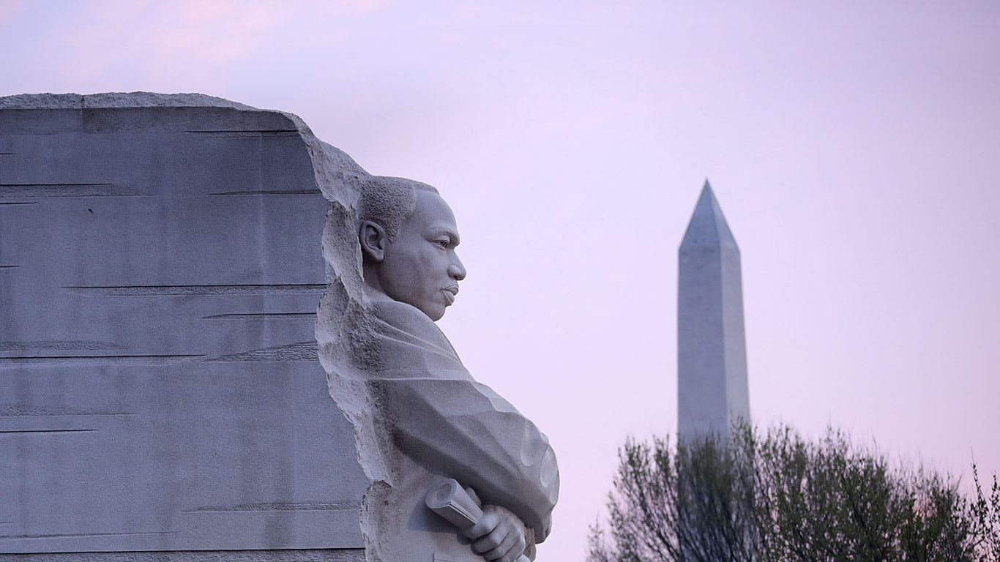

#### 20190121 ｢ハルツ狭軌鉄道｣ドイツ, ハルツ国立公園 (© Patrice von Collani/Westend61/Offset)(Bing Japan)

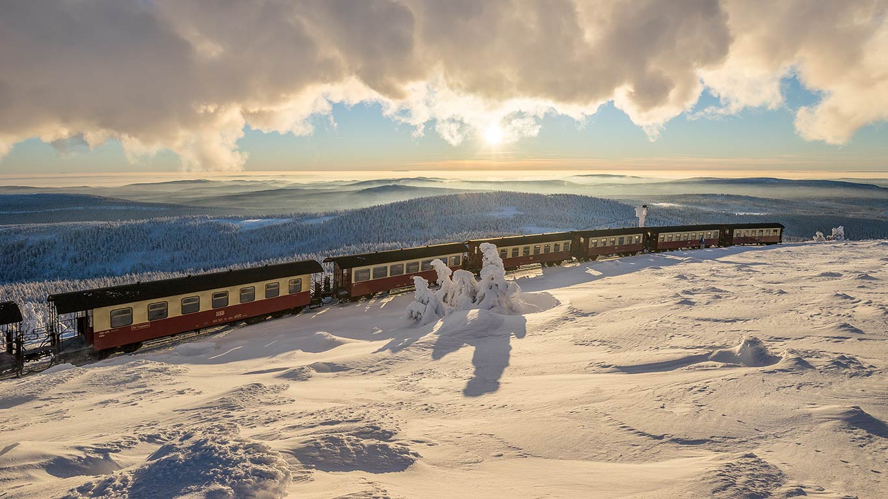

#### 20190120 Montagne Sainte Victoire, Provence-Alpes-Côte d’Azur, France (© travelview/iStock)(Bing France)

#### 20190120 Emperor penguins in the Ross Sea, Antarctica (© Paul Nicklen/Getty Images)(Bing United Kingdom)

#### 20190119 Ocean Drive in Miami, Florida, USA (© Guido Cozzi/Offset/Shutterstock)(Bing United Kingdom)

#### 20190118 Latona Fountain in the Gardens of Versailles for the 100th anniversary of the Paris Peace Conference (© Arnaud Chicurel/SuperStock)(Bing United Kingdom)

#### 20190117 In Somerset for Old Twelvey Night (© Guy Edwardes/Minden Pictures)(Bing United Kingdom)

#### 20190117 View of Lake O’Hara in Yoho National Park, British Columbia (© Marko Radovanovic/Aurora Photos)(Bing Canada)

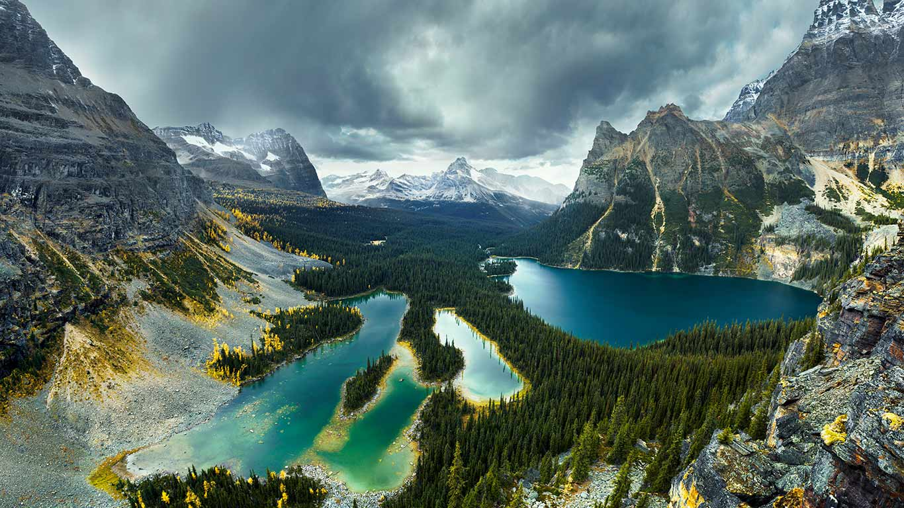

#### 20190116 Climbing Athabasca Glacier in Jasper National Park, Alberta, Canada, as the Aurora Borealis glows (© Paul Zizka/Aurora Photos)(Bing United Kingdom)

#### 20190115 ｢成人式の振り袖｣石川県, 金沢市 (© Linda Davidson/The Washington Post via Getty Images)(Bing Japan)

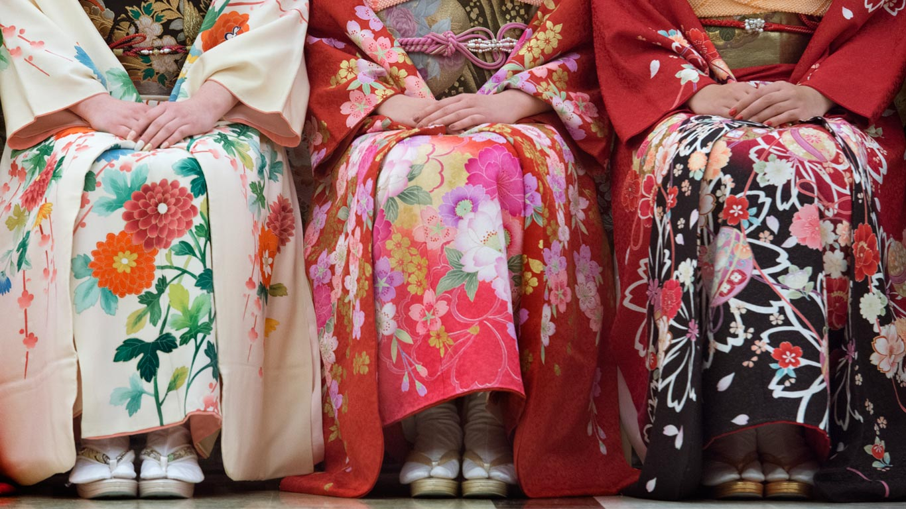

#### 20190115 The distinctive roof of the British Museum and the surrounding area (© Vladimir Zakharov/Getty Images)(Bing United Kingdom)

#### 20190115 Des alpinistes en pleine ascension sur l’Aiguille du Midi, Massif du Mont-Blanc, Chamonix (© Alxcrs/Shutterstock)(Bing France)

#### 20190114 Dusk aerial view of Rod Laver Arena at the Australian Open tennis tournament (© Brett Price/age footstock)(Bing Australia)

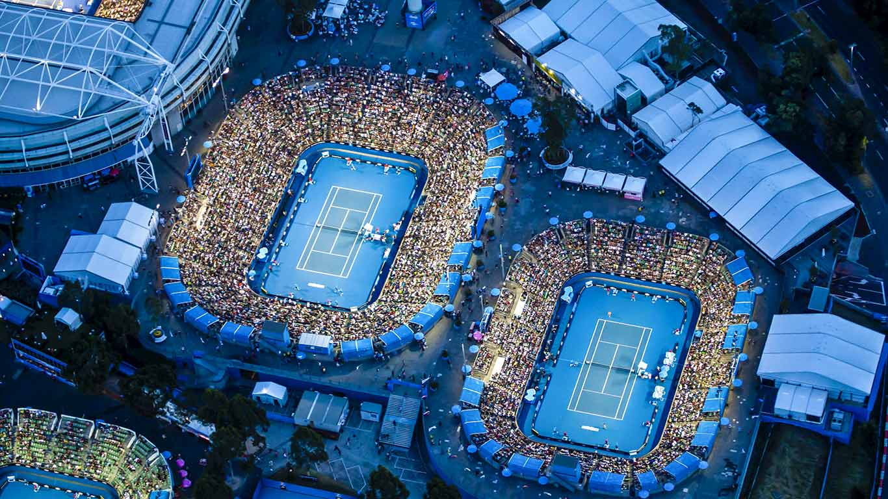

#### 20190114 La Digue, an island in the Seychelles (© Oleksandr Dibrova/Adobe Stock)(Bing United Kingdom)

#### 20190113 A satellite image of the Pingualuit asteroid impact crater in Quebec (© USGS/NASA Landsat data/Orbital Horizon/Gallo Images/Getty images)(Bing Canada)

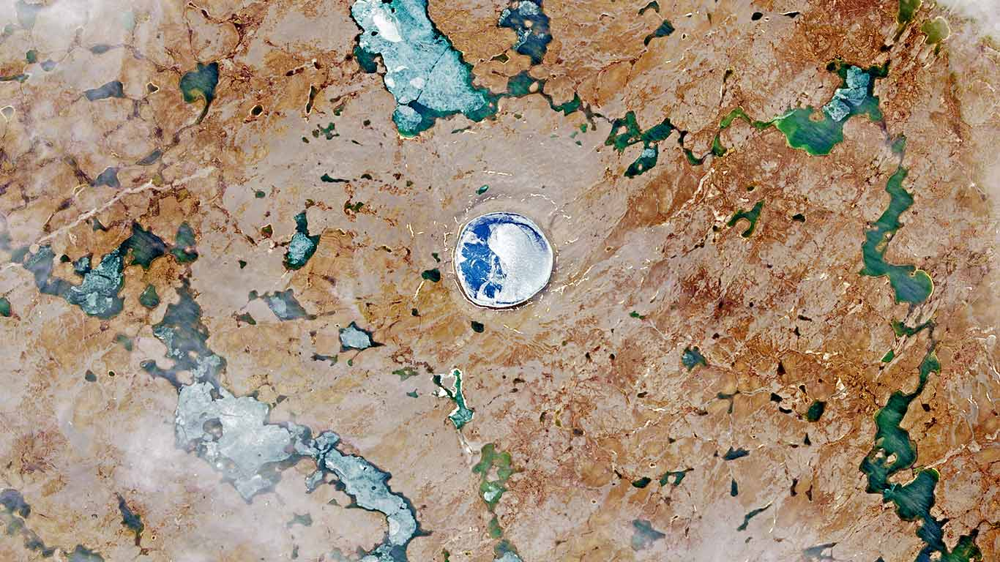

#### 20190113 The village of Aguerd Oudad and the larger town of Tafraout in Morocco (© Doug Pearson Photography/plainpicture)(Bing United Kingdom)

#### 20190113 A rider hunts with an eagle in the Altai Mountains of Mongolia (© Timothy Allen/Getty Images)(Bing United States)

#### 20190112 Siberian Snowkiting Cup in Novosibirsk, Russia (© Kirill Kukhmar/Getty Images)(Bing United Kingdom)

#### 20190111 Bamburgh Castle and sand dunes after snowfall in Northumberland (© Ross Hoddinott/Minden Pictures)(Bing United Kingdom)

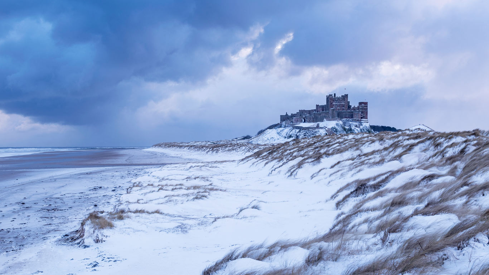

#### 20190110 Ice fishing village near L'Anse-Saint-Jean, Quebec, Canada (© Hemis/Alamy)(Bing United Kingdom)

#### 20190110 Milchstraße über den verschneiten Weiden der Wallgauer Alm mit Blick auf das Karwendelgebirge, Bayern, Deutschland (© mauritius images GmbH/Alamy Stock Photo)(Bing Deutschland)

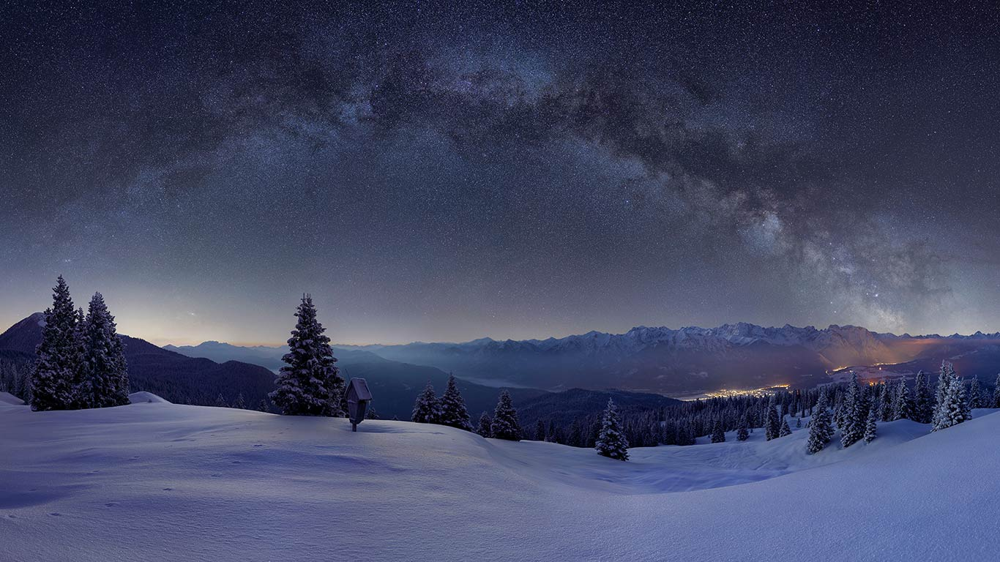

#### 20190110 Contemporary ballet 'Tree of Codes' comes to Sydney Festival 2018 (© Richard Milnes/Shutterstock)(Bing Australia)

#### 20190109 Mua Caves in the Ninh Bình province of Vietnam (© Cavan Images/Offset)(Bing United Kingdom)

#### 20190108 Snowy owl (© Jérémie LeBlond-Fontaine/Getty Images)(Bing United Kingdom)

#### 20190108 Mount Rainier National Park in Washington state (© Stephen Matera/Tandem Stills + Motion)(Bing United States)

#### 20190107 Oast house roofs with wind vanes decorated with agricultural scenes on a farm in Kent (© Steve Taylor ARPS/Alamy)(Bing United Kingdom)

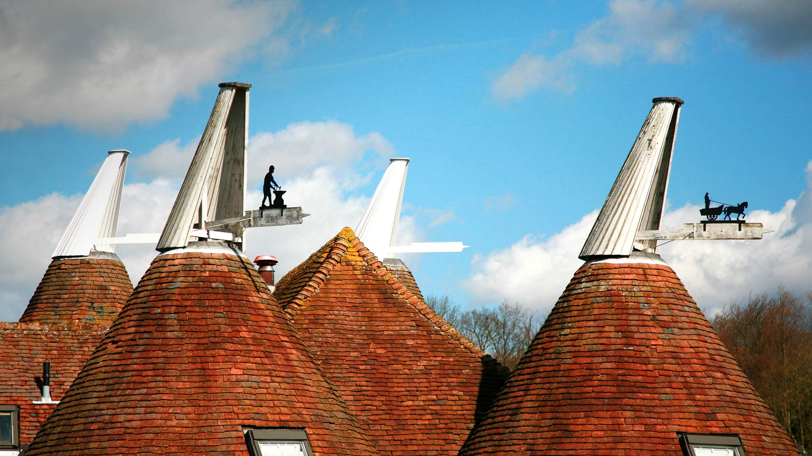

#### 20190106 The Harbin Ice and Snow Festival in China (© Gavin Hellier/Getty Images)(Bing United Kingdom)

#### 20190105 Marc Chagall's ceiling inside the Palais Garnier on the anniversary of its opening (© Stephane Gautier/agefotostock)(Bing United Kingdom)

#### 20190105 Brèche de Roland, Cirque de Gavarnie inscrit au patrimoine mondial de l’UNESCO, Pyrénées, France (© Hemis/Alamy Stock Photo)(Bing France)

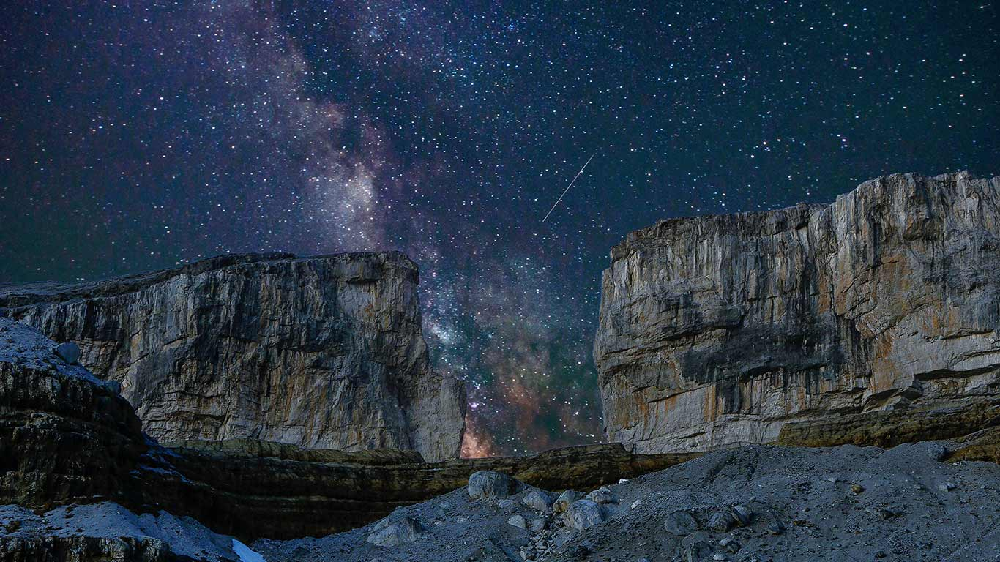

#### 20190104 ｢雪の中のウリ坊兄弟｣ベルギー (© Philippe Moes/Minden Pictures)(Bing Japan)

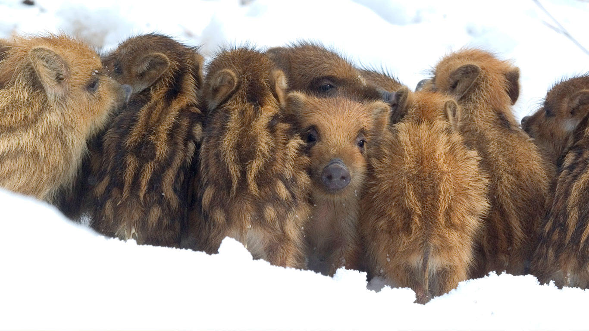

#### 20190104 For World Braille Day, a tactile map of Landshut, Germany (© Zoonar GmbH/Alamy)(Bing United Kingdom)

#### 20190103 Wintertime at Tenby Harbour in Pembrokeshire, Wales (© CW Images/Alamy)(Bing United Kingdom)

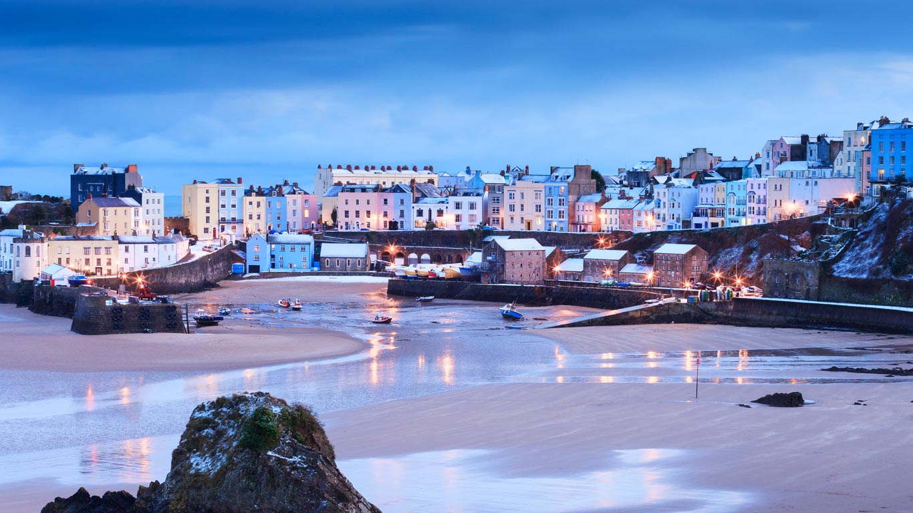

#### 20190103 ｢餅花｣ (© SHOSEI/AFLO/age fotostock)(Bing Japan)

#### 20190103 Australian sea lion (Neophoca cinerea) lying on a bed of sea grass in Carnac Island, Western Australia (© Tony Wu/Minden Pictures)(Bing Australia)

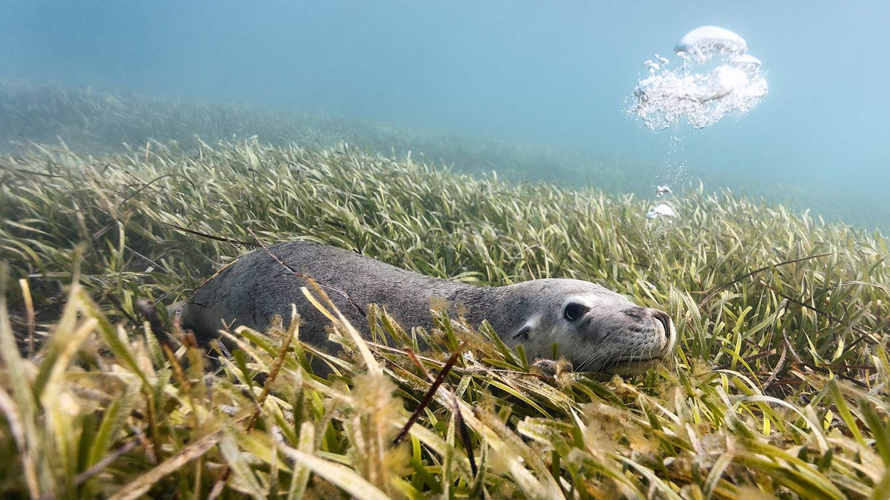

#### 20190102 For Science Fiction Day, inventor Nikola Tesla and his ‘magnifying transmitter’ (© Nikola Tesla Museum/Science Photo Library)(Bing United Kingdom)

#### 20190102 【今日元旦】  (© The Art Archive/SuperStock)(Bing China)

#### 20190101 At the top of Mount Fuji in Japan. Happy New Year! (© Nopasorn Kowathanakul/Getty Images)(Bing United Kingdom)

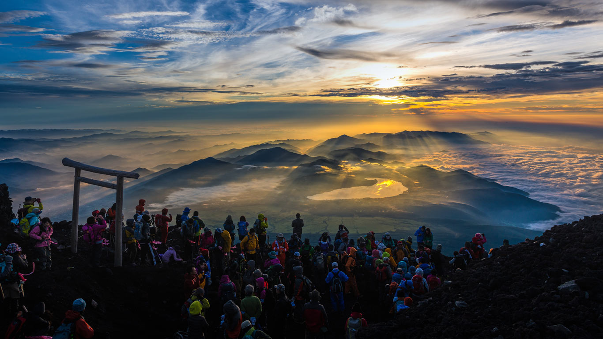

