#### 20190228 A walkway through a mountain peak in Chamonix, France (© Jakub Połomski/Offset)(Bing United Kingdom)

#### 20190227 Sandhill cranes taking flight over the Platte River near Kearney, Nebraska, USA (© Diana Robinson Photography/Getty Images)(Bing United Kingdom)

#### 20190226 ｢北野天満宮の梅｣京都, 上京区 (© Akira Kaede/Getty Images)(Bing Japan)

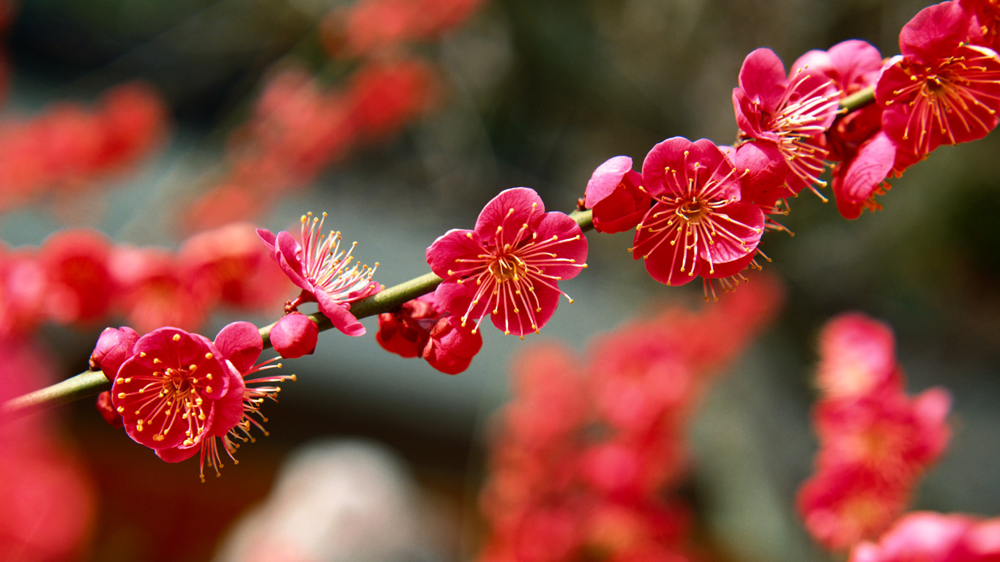

#### 20190225 The city of Bath, Somerset (© Rob Cousins/Getty Images)(Bing United Kingdom)

#### 20190223 Stitched panorama of the Lincoln Memorial with a view toward the Washington Monument, Washington, DC (© Sam Kittner/Getty Images)(Bing United States)

#### 20190223 A sharp-tailed grouse (tympanuchus phasianellus) perched on a buffalo berry shrub in Elbow, Sask. (© Nick Saunders/Getty Images)(Bing Canada)

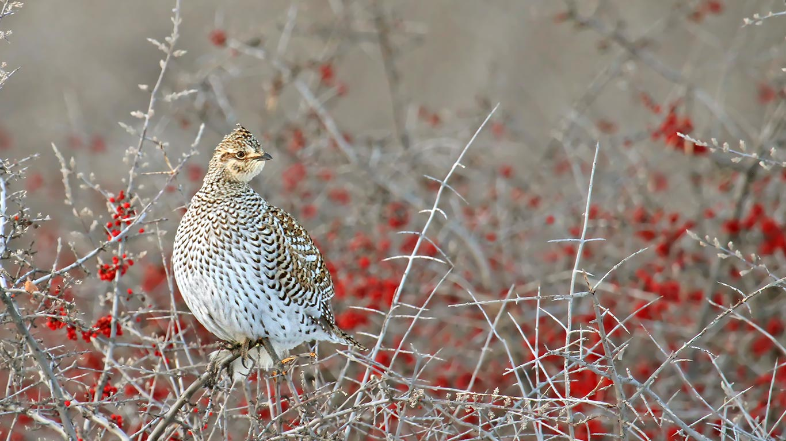

#### 20190223 A musical note in the garden of Anne Hathaway's Cottage, Stratford-upon-Avon (© Christopher Furlong/Getty Images)(Bing United Kingdom)

#### 20190222 【今日元宵】 (© F.Lukasseck/Masterfile)(Bing China)

#### 20190222 Pingxi Sky Lantern Festival in Taipei, Taiwan (© Jui-Chi Chan/Alamy)(Bing United Kingdom)

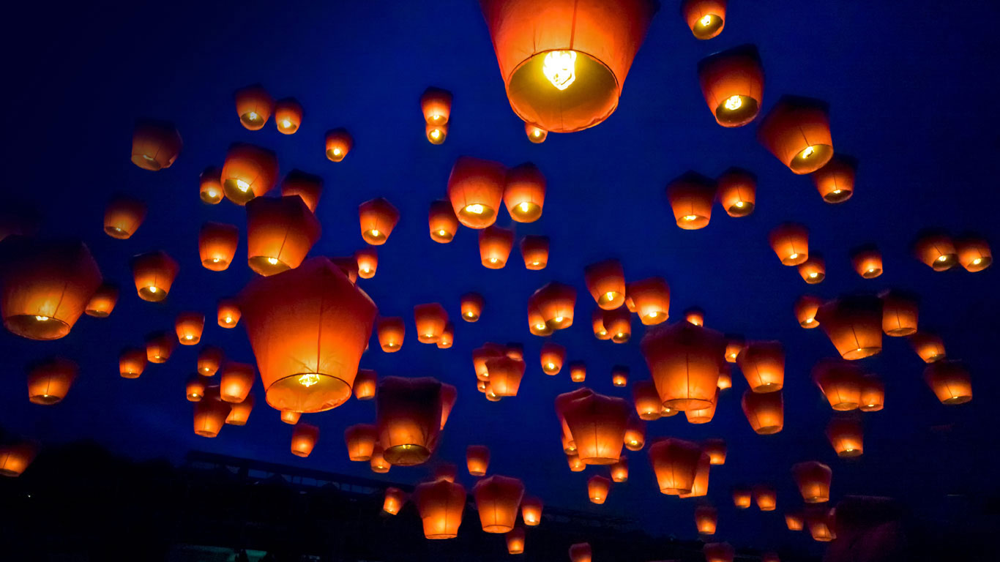

#### 20190221 Schlossplatz in Stuttgart, Baden-Württemberg, Deutschland (© Werner Dieterich/Getty Images)(Bing Deutschland)

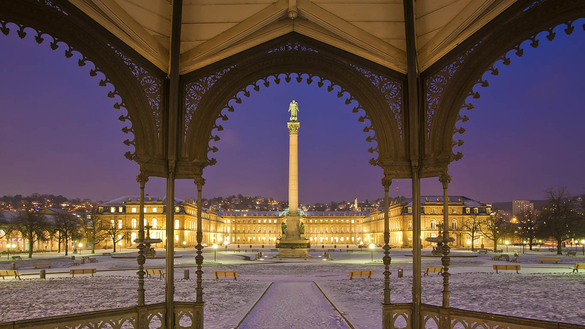

#### 20190221 Oak (quercus sp) trees in winter, Nova Scotia (© Scott Leslie/Minden Pictures)(Bing Canada)

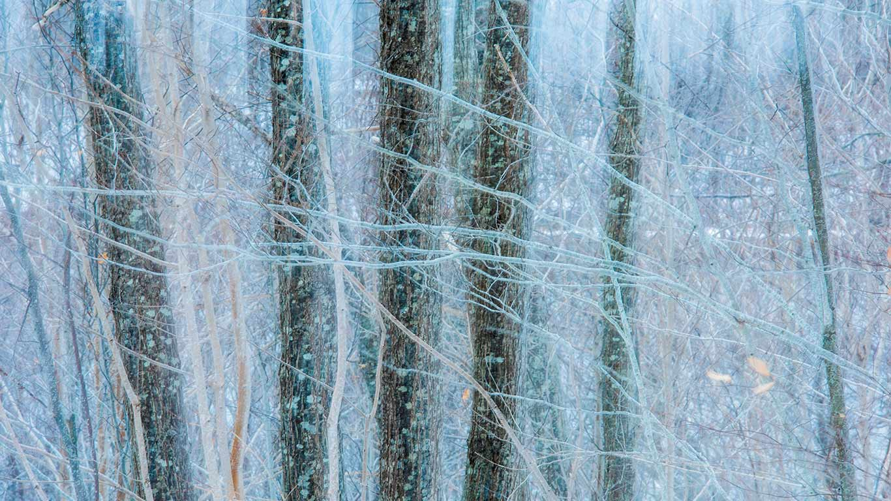

#### 20190221 Black-crested titmouse in Texas Hill Country (© Rolf Nussbaumer/Minden Pictures)(Bing United States)

#### 20190220 An aerial view of Alum Bay on the Isle of Wight (© Matt Cooper/Gallery Stock)(Bing United Kingdom)

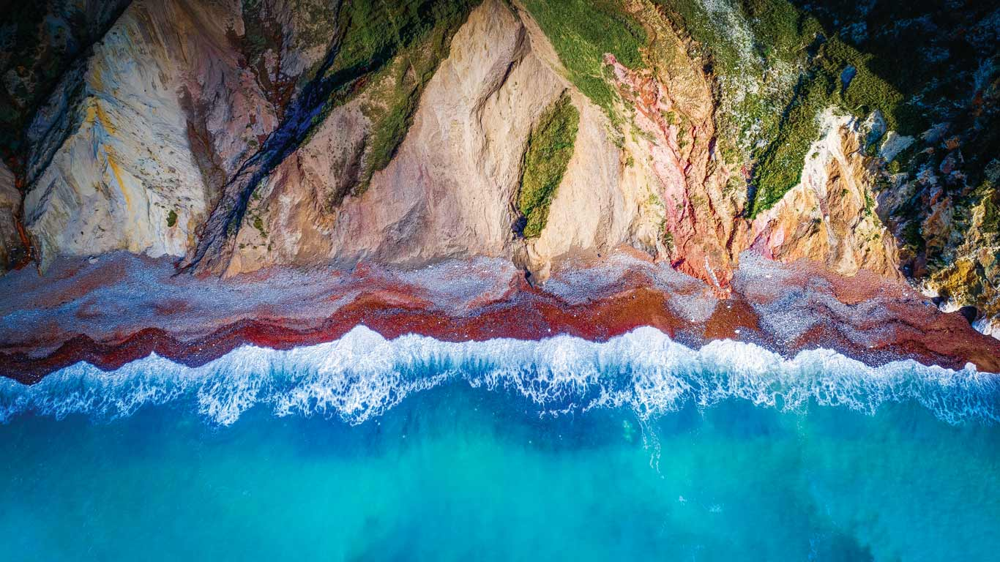

#### 20190220 鸟瞰尾矿池，澳大利亚 (© Amazing Aerial/Offset)(Bing China)

#### 20190219 Grey wolf with flock of ravens in Finland (© Lassi Rautiainen/Minden Pictures)(Bing United Kingdom)

#### 20190218 Sculpture de Niki de Saint Phalle parmi les palmiers, Negresco, Nice (© Joey Kotfica/Getty Images)(Bing France)

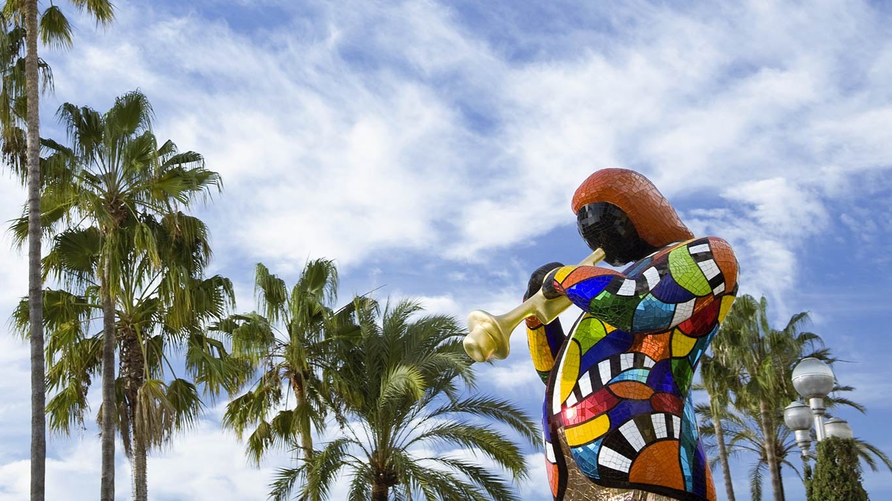

#### 20190217 Original lyrics of Waltzing Matilda - music by Christina Rutherford Macpherson, words by Banjo Paterson (© GL Archive/Alamy Stock Photo)(Bing Australia)

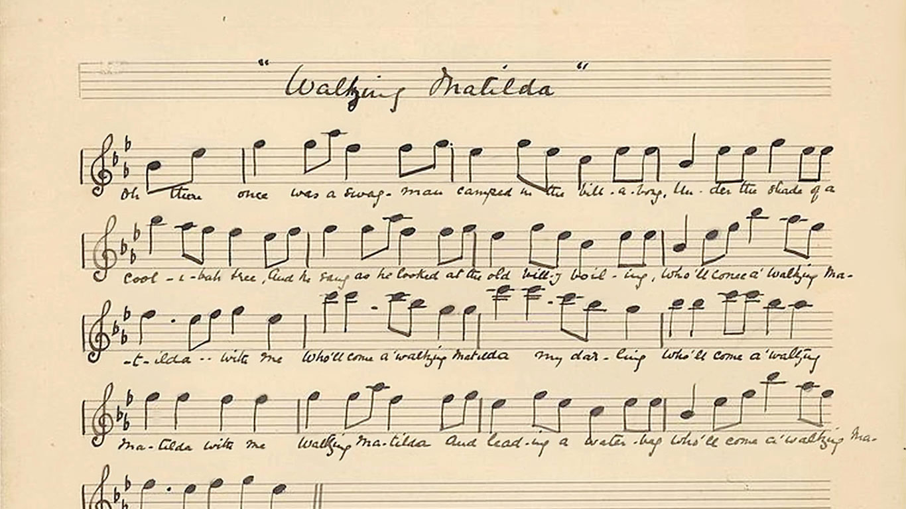

#### 20190217 Ground pangolin at Gorongosa National Park, Mozambique (© Jen Guyton/Minden Pictures)(Bing United Kingdom)

#### 20190215 Yunishigawa Kamakura Festival in Tochigi Prefecture, Japan (© Em7/Shutterstock)(Bing United Kingdom)

#### 20190214 Grey crowned cranes forming a heart shape (© Ibrahim Suha Derbent/Getty Images)(Bing United Kingdom)

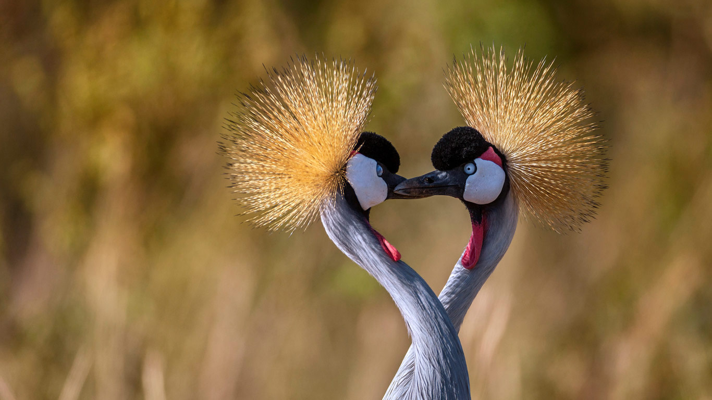

#### 20190213 Honeycomb weathering in Koolama Bay, Western Australia (© Ralph Lee Hopkins/Shutterstock/Offset)(Bing United Kingdom)

#### 20190212 Ice sculptures during Winterlude Festival, Ottawa (© Keren Su/China Span/Alamy Stock Photo)(Bing Canada)

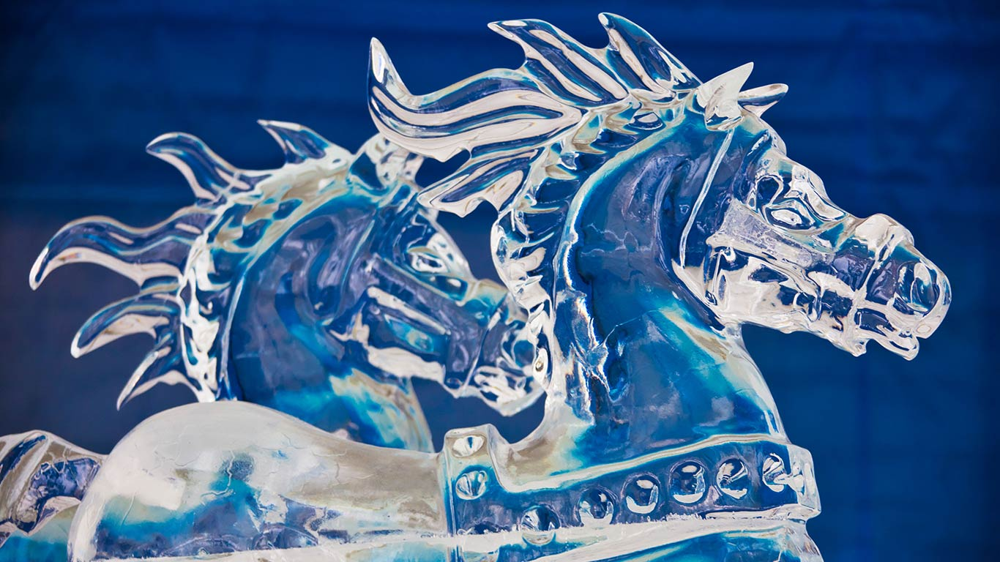

#### 20190212 International UFO Museum and Research Center, Roswell, New Mexico (© Walter Bibikow/Danita Delimont)(Bing United States)

#### 20190212 Loisach river with Heimgarten mountain in the background, Bavaria, Germany (© Christian Back/Huber Images/eStock Photo)(Bing United Kingdom)

#### 20190211 Illuminated icicles in Chichibu, Japan (© JTB Photo/UIG/age fotostock)(Bing United Kingdom)

#### 20190210 For the Grammy Awards, a scanning electron micrograph of a needle on a record (© Susumu Nishinaga/Science Photo Library)(Bing United Kingdom)

#### 20190209 Almond orchards in bloom, Sacramento Valley, California, USA (© Anthony Dunn/Alamy)(Bing United Kingdom)

#### 20190208 Firefall at Horsetail Fall, Yosemite National Park, California, USA (© Nimia)(Bing United Kingdom)

#### 20190208 Schloss Lichtenstein, Landkreis Reutlingen, Baden-Württemberg, Deutschland (© Carsten Schlipf/Shutterstock)(Bing Deutschland)

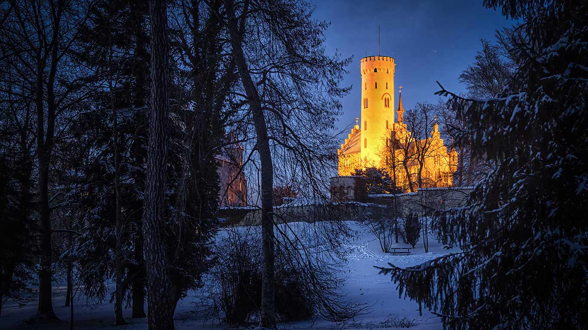

#### 20190207 Study time at the State Library of Victoria (© EQRoy/Shutterstock)(Bing Australia)

#### 20190207 Meditation domes at the Beatles Ashram in Rishikesh, India (© Sasha Bezzubov/Gallery Stock)(Bing United Kingdom)

#### 20190206 【今日春节】  (© Peter Adams/Photolibrary/Getty Images)(Bing China)

#### 20190206 For Waitangi Day, the Pancake Rocks on New Zealand’s South Island (© Michael Reusse/Westend61/Offset)(Bing United Kingdom)

#### 20190205 【今日除夕】 (© Robert Chang/iStock/Getty Images)(Bing China)

#### 20190205 ｢梅とメジロ｣神奈川, 横浜  (© e185rpm/Adobe stock)(Bing Japan)

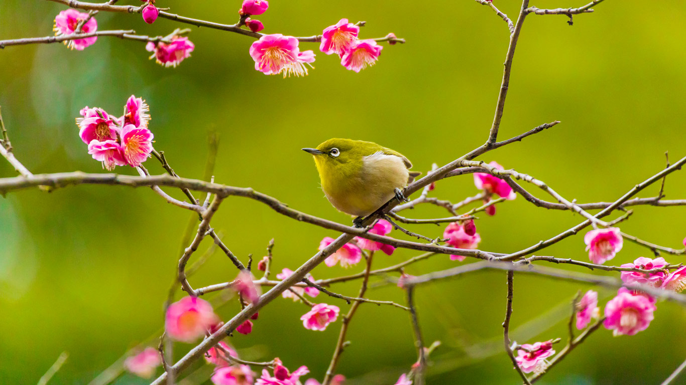

#### 20190205 Lanterns at Datang Furong Garden, Tang Paradise in Xi'an, China (© VCG/Getty Images)(Bing United Kingdom)

#### 20190204 ｢かごいっぱいの大豆｣ (©  William Brady/age fotostock/Alamy Stock Photo)(Bing Japan)

#### 20190204 Sculpture at the National Civil Rights Museum in Memphis, Tennessee (© Gino Santa Maria/Shutterstock)(Bing United States)

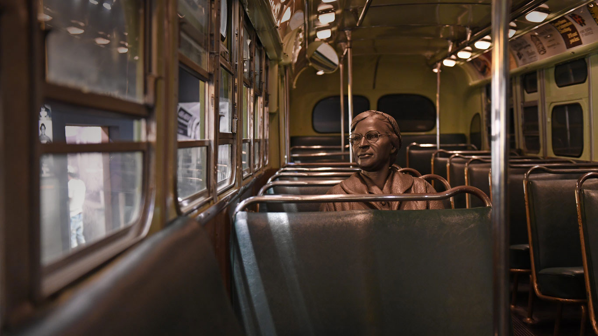

#### 20190204 Aerial view of central Oxford (© Alexey Fedorenko/Shutterstock)(Bing United Kingdom)

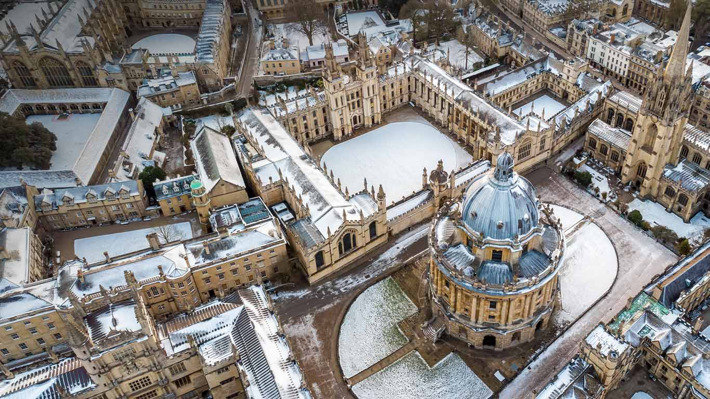

#### 20190203 La petite église de Mont-Saint-Michel de Brasparts dans le brouillard, Finistère, Bretagne (© MathieuRivrin/Moment/Getty Images)(Bing France)

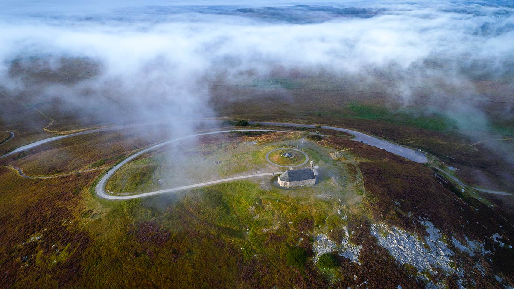

#### 20190203 Red-crowned crane in Hokkaido, Japan (© Regis Cavignaux/Getty Images)(Bing United Kingdom)

#### 20190202 Boathouse on Lake Minnewanka in Banff National Park, Alberta, Canada (© Wayne Simpson/All Canada Photos/Superstock)(Bing United Kingdom)

#### 20190202 Hoary marmot in Denali National Park, Alaska (© Perry de Graaf/Minden Pictures)(Bing United States)

#### 20190201 The ball is taken from a line-out during a Six Nations rugby match (© Glyn Kirk/AFP/Getty Images)(Bing United Kingdom)

#### 20190201 For Black History Month, Step Afrika! dancers rehearse (© The Washington Post/Getty Images)(Bing United States)

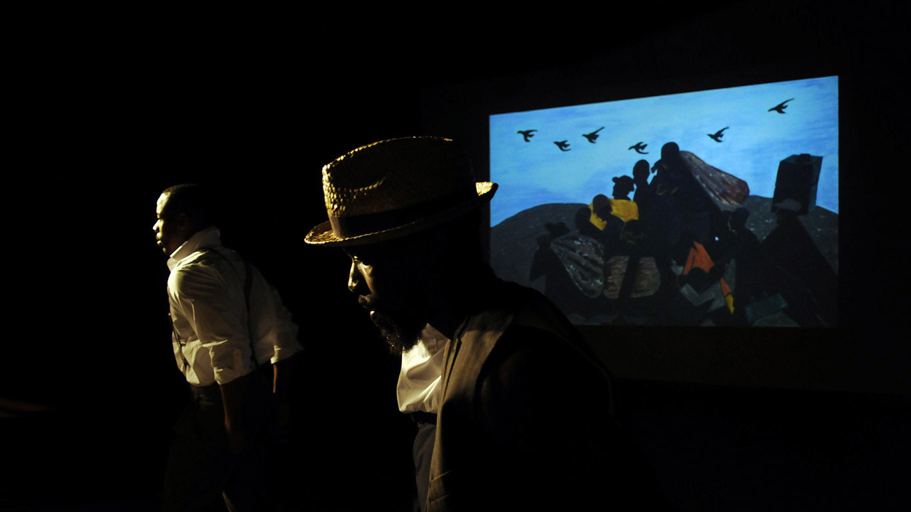

#### 20190201 Sunrise over the Matilda Bay boathouse in the Swan River, Perth (© Sara Winter/Alamy)(Bing Australia)

