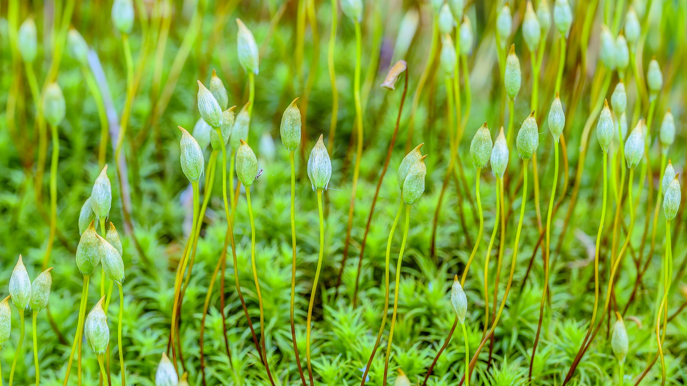
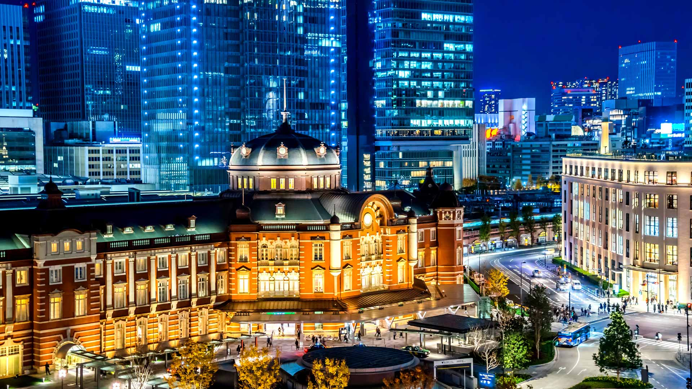
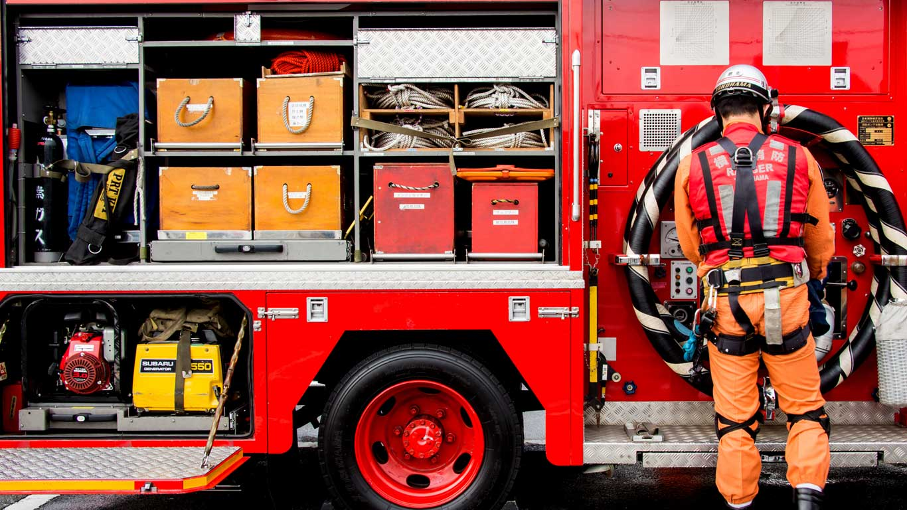
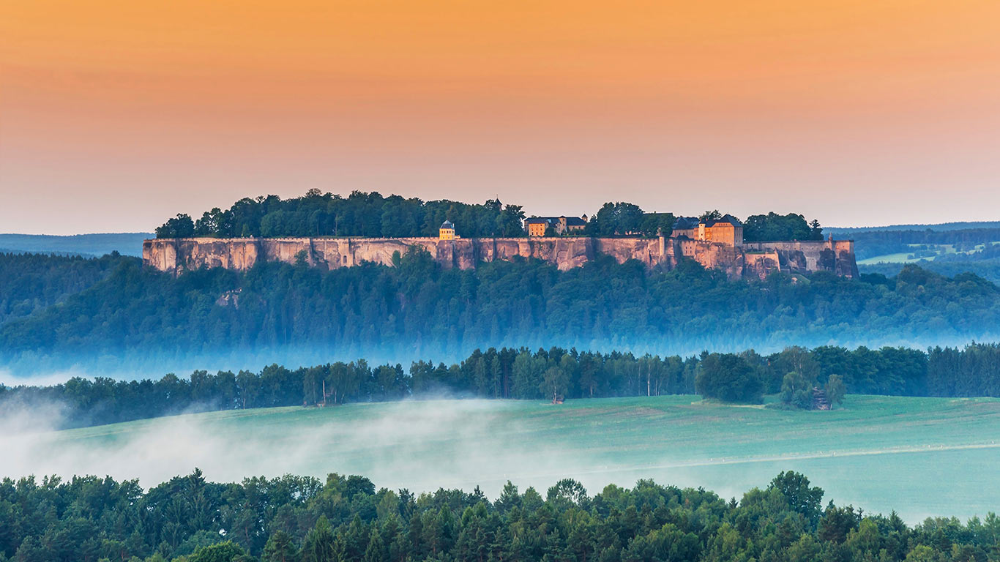
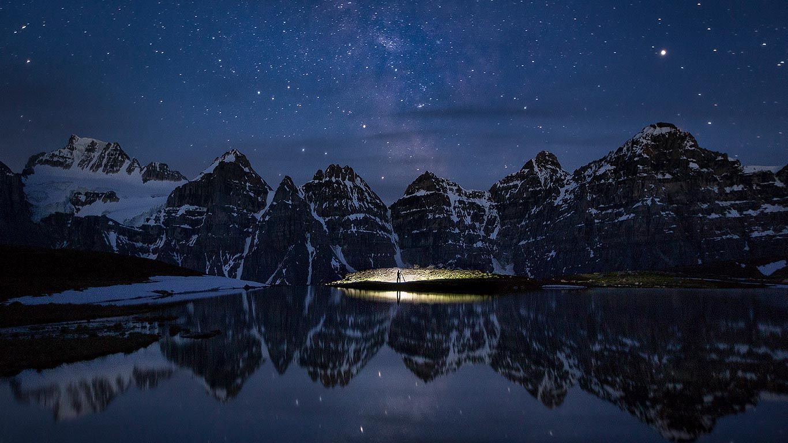
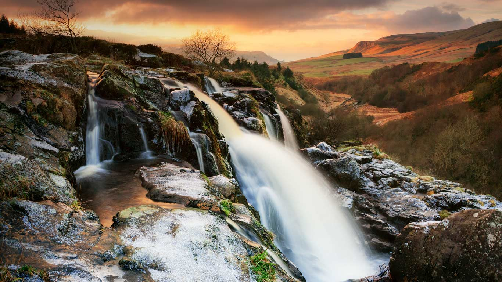
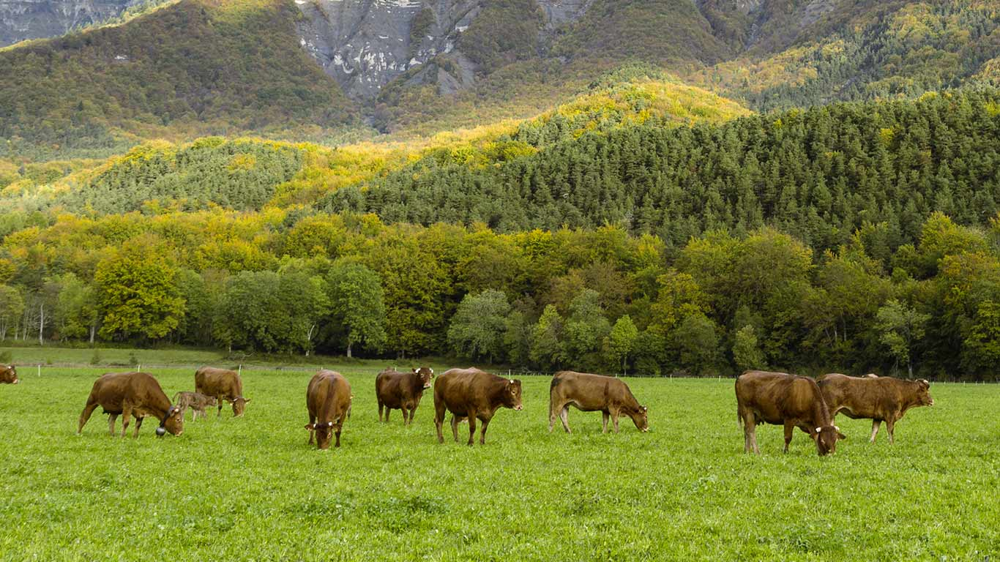
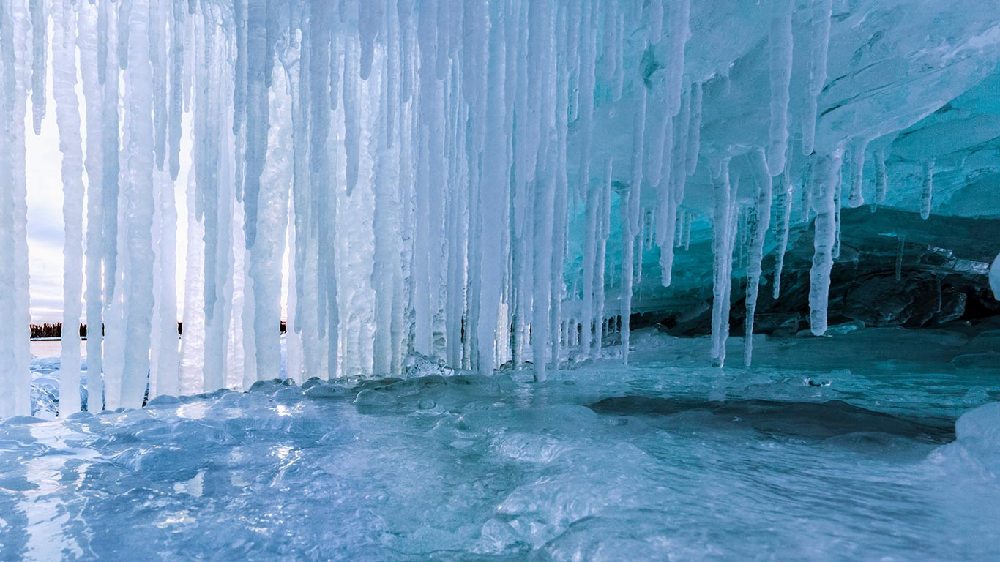
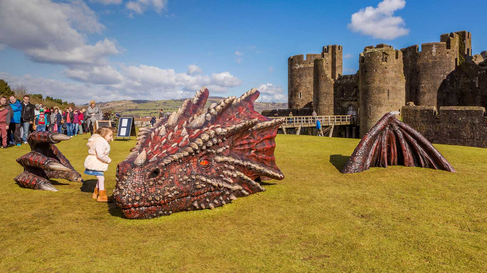

#### 20190331 U-Bahnhof Candidplatz in München, Bayern, Deutschland (© Grafissimo/Getty Images)(Bing Deutschland)

#### 20190331 New York City’s Empire State Building is seen lit up before Earth Hour in 2011 (© Eric Thayer/Reuters)(Bing United Kingdom)

#### 20190330 Auroville, India (© Vikram Ramakrishnan/Shutterstock)(Bing United Kingdom)

#### 20190330 Night scenery with full noon, Mount Assiniboine Provincial Park, B.C. (© Aurora Photos/Offset/Shutterstock)(Bing Canada)

#### 20190329 Polytrics et leurs sporogones, Haute chaîne du Jura  (© Jean-Philippe Delobelle/Getty Images)(Bing France)

#### 20190329 Sap-collecting buckets in Brome-Missisquoi, Quebec, Canada (© Roderick Chen/SuperStock)(Bing United States)

#### 20190329 A rufous-tailed hummingbird in Costa Rica (© Juan Carlos Vindas/Getty Images)(Bing United Kingdom)

#### 20190328 The Llangattock Escarpment in the Brecon Beacons National Park, Powys, Wales (© Interfoto/DanitaDelimont.com)(Bing United Kingdom)

#### 20190327 Cherry blossoms over the Meguro River, Tokyo, Japan (© taketan/Getty Images)(Bing United Kingdom)

#### 20190327 ｢東京駅丸の内駅舎｣東京, 千代田区 (© voyata/Getty Images)(Bing Japan)

#### 20190326 Sea otters in Prince William Sound, Alaska, 30 years after the Exxon Valdez oil spill (© Patrick Endres/plainpicture)(Bing United States)

#### 20190326 Athens, Greece, for Greek Independence Day (© junnyphoto/Getty Images)(Bing United Kingdom)

#### 20190325 Shoreline near Tofino on Vancouver Island, British Columbia, Canada (© Robert Postma/plainpicture)(Bing United Kingdom)

#### 20190324 【今日春分】  (© Raymond Shi/EyeEm/Getty Images)(Bing China)

#### 20190324 From Nasa’s Terra satellite, an image of fallstreak holes in clouds over the southern United States (© NASA)(Bing United Kingdom)

#### 20190323 Water wheel in the Tashkurgan Grassland, Tashkurgan Tajik Autonomous County, Xinjiang, China (© Ratnakorn Piyasirisorost/Getty Images)(Bing United Kingdom)

#### 20190322 A baobab grove near Bandia Wildlife Reserve in Senegal (© Frans Lanting/plainpicture)(Bing United Kingdom)

#### 20190321 Galah (Eolophus roseicapilla) flock flying in Western Australia (© Yva Momatiuk and John Eastcott/Minden Pictures)(Bing Australia)

#### 20190321 Crocus flowers (© Lorianne Ende/Getty Images)(Bing United Kingdom)

#### 20190320 ｢眠るスピリット・ベア｣カナダ, ブリティッシュコロンビア州 (© John E Marriott/SuperStock)(Bing Japan)

#### 20190320 Fireworks at the Plaza del Ayuntamiento for Las Fallas festival in Valencia, Spain (© Helena G.H/Shutterstock)(Bing United Kingdom)

#### 20190319 Light from sunrise through a sea cave on the Isle of Skye, Scotland (© Luca Benini/PLM Collection/Offset)(Bing United Kingdom)

#### 20190318 Department of the Taoiseach lit up for the St Patrick's Festival in Dublin, Ireland (© David Soanes Photography/Getty Images)(Bing United Kingdom)

#### 20190318 'Infinite Variety: Three Centuries of Red and White Quilts' at the American Folk Art Museum in New York City in 2011, for National Quilting Day (© Shannon Stapleton/Reuters)(Bing United States)

#### 20190318 Frontenac Castle in Old Quebec City (© mervas/Shutterstock)(Bing Canada)

#### 20190317 Fingal Head with a rock fisherman on the headland (© Auscape/UIG via Getty Images)(Bing Australia)

#### 20190317 Chital deer in misty grassland at dawn, Kanha National Park, India (© Pete Oxford/Minden Pictures)(Bing United Kingdom)

#### 20190316 Parapluies colorés dans la rue de la Citadelle à Béziers, France (© Nicole Matthews/Westend61)(Bing France)

#### 20190316 At the Arch of Septimius Severus in the Roman Forum for the Ides of March (© Pietro Canali/eStock Photo)(Bing United Kingdom)

#### 20190315 Der „Märchendom“ in den Saalfelder Feengrotten, Thüringen, Deutschland (© mit4711/iStock/Getty Images Plus)(Bing Deutschland)

#### 20190315 Circular agricultural fields in Morgan County, Colorado, USA (© Jim Wark/Getty Images)(Bing United Kingdom)

#### 20190314 A view of Uranus taken from spacecraft Voyager 2 in 1986 (© NASA)(Bing United Kingdom)

#### 20190314 ｢ドブソン湖｣オーストラリア, タスマニア (© Tom Mackie/plainpicture)(Bing Japan)

#### 20190313 Channels of the Rio Tinto in Spain (© Oscar Diez Martinez/Minden Pictures)(Bing United Kingdom)

#### 20190313 ｢希望のあかり｣福島, いわき市 (© Toru Hanai/Reuters)(Bing Japan)

#### 20190312 Canberra’s National Carillon at dawn (© Peter Ptschelinzew/Lonely Planet Images/Getty Images)(Bing Australia)

#### 20190312 Wildflowers in bloom at Lost Dutchman State Park in Arizona, USA (© Tim Fitzharris/Minden Pictures)(Bing United Kingdom)

#### 20190311 ｢チェファル｣イタリア, シチリア島 (© Tuul & Bruno Morandi/4Corners)(Bing Japan)

#### 20190311 Royal Highland Fusiliers playing the bagpipes on top of the Sydney Opera House (© James D Morgan/Shutterstock)(Bing United Kingdom)

#### 20190310 Grapes on the vine in Mendoza, Argentina, for the National Grape Harvest Festival (© javarman3/iStock/Getty Images Plus)(Bing United Kingdom)

#### 20190309 Policewomen from the United Nations Stabilisation Mission in Haiti attend a ceremony to mark International Women's Day in 2016 (© Hector Retamal/AFP/Getty Images)(Bing United Kingdom)

#### 20190309 Grapes on the vine in Mendoza, Argentina, for the National Grape Harvest Festival (© javarman3/iStock/Getty Images Plus)(Bing Australia)

#### 20190308 ｢出初式の消防車｣神奈川 (© Aduldej Sukaram/Alamy Stock Photot)(Bing Japan)

#### 20190308 Policewomen from the United Nations Stabilisation Mission in Haiti attend a ceremony to mark International Women's Day in 2016 (© Hector Retamal/AFP/Getty Images)(Bing United Kingdom)

#### 20190308 Hong Kong-Zhuhai-Macau Bridge, China (© Evocation Images/Shutterstock)(Bing United Kingdom)

#### 20190308 Wildflowers in bloom at Lost Dutchman State Park in Arizona (© Tim Fitzharris/Minden Pictures)(Bing United States)

#### 20190307 Polar bear in Hudson Bay, Canada (© Ralph A. Clevenger/Tandem Stills + Motion)(Bing United Kingdom)

#### 20190307 Close-up view of a Komondor (© Mike Segar/Reuters)(Bing United Kingdom)

#### 20190307 Festung Königstein oberhalb des Ortes Königstein, Sächsische Schweiz, Sachsen, Deutschland (© Gunter Kirsch/Alamy Stock Photo)(Bing Deutschland)

#### 20190306 Members of the Wild Red Flame Mardi Gras Indians in New Orleans, Louisiana (© Chris Graythen/Getty Images)(Bing United States)

#### 20190306 Cefalù on the Tyrrhenian coast of Sicily, Italy (© Tuul & Bruno Morandi/eStock Photo)(Bing United Kingdom)

#### 20190305 Winter at the Isis Temple in Grand Canyon National Park, Arizona, USA (© Adam Schallau/Offset)(Bing United Kingdom)

#### 20190305 A red maple leaf in Mont-Saint-Bruno Conservation Park, Quebec, Canada (© Gilles Delisle/Jaynes Gallery/DanitaDelimont.com)(Bing United Kingdom)

#### 20190305 Minnestimma Lake, Banff, Alta. (© Paul Zizka/Aurora Photos)(Bing Canada)

#### 20190305 Elephant herd in Damaraland District, Namibia (© Michael Poliza/Getty Images)(Bing United States)

#### 20190304 ｢雛のつるし飾り｣ (© yoshi0511/Shutterstock)(Bing Japan)

#### 20190304 Loup of Fintry waterfall on the River Endrick, Scotland (© Damian Shields/Offset)(Bing United Kingdom)

#### 20190304 Leopard snoozing in a tree in Namibia (© M. Watsonantheo/SuperStock)(Bing Australia)

#### 20190303 A plastic bag hovers underneath a breaking wave at the beach (© lindsay_imagery/iStock/Getty Images Plus)(Bing Australia)

#### 20190303 A fin whale in the waters off the Azores (© Luis Quinta/Minden Pictures)(Bing United Kingdom)

#### 20190303 Cumulus clouds over the Caribbean (© F. M. Kearney/plainpicture)(Bing United Kingdom)

#### 20190302 Vinicunca Mountain in the Cusco Region of Peru (© sorincolac/Getty Images)(Bing United Kingdom)

#### 20190302 Des vaches devant le Mont Aiguille, Parc Naturel Régional du Vercors, Isère, France (© Jakub Połomski/Offset)(Bing France)

#### 20190302 Statues of Phillis Wheatley and Abigail Adams in the Boston Women’s Memorial of Massachusetts (© Education Images/UIG via Getty Images)(Bing United States)

#### 20190302 Old Town of Tallinn, Estonia (© Kavalenkava Volha/Alamy)(Bing United Kingdom)

#### 20190302 Warmes Licht der aufgehenden Morgensonne auf mit Frost bedeckten Bäumen auf einem Feld bei Jacobsdorf, Brandenburg, Deutschland (© picture alliance/Getty Images)(Bing Deutschland)

#### 20190301 Icicles on Lake Superior, Thunder Bay, Ont. (© Susan Dykstra/Design Pics/Getty Images)(Bing Canada)

#### 20190301 A red dragon sculpture at Caerphilly Castle for St David's Day (© Sebastian Wasek/SIME/eStock Photo)(Bing United Kingdom)

