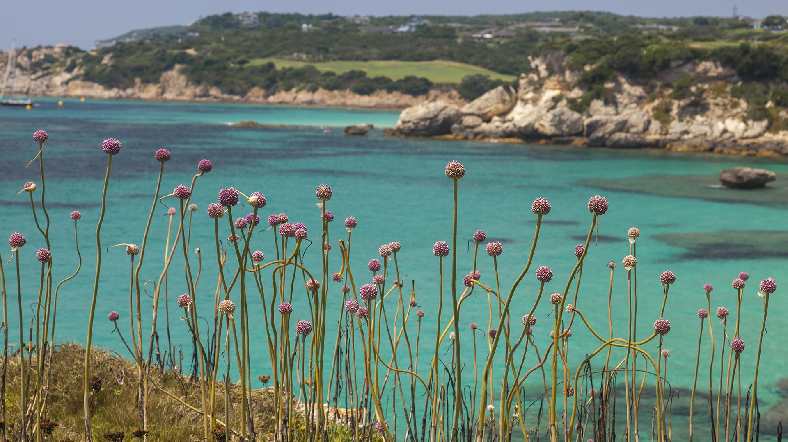
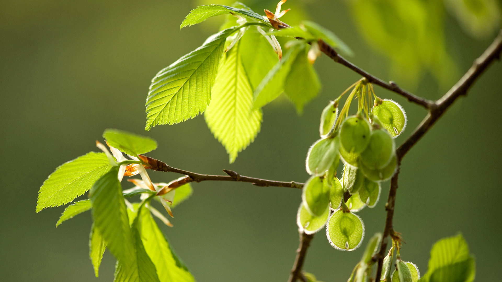
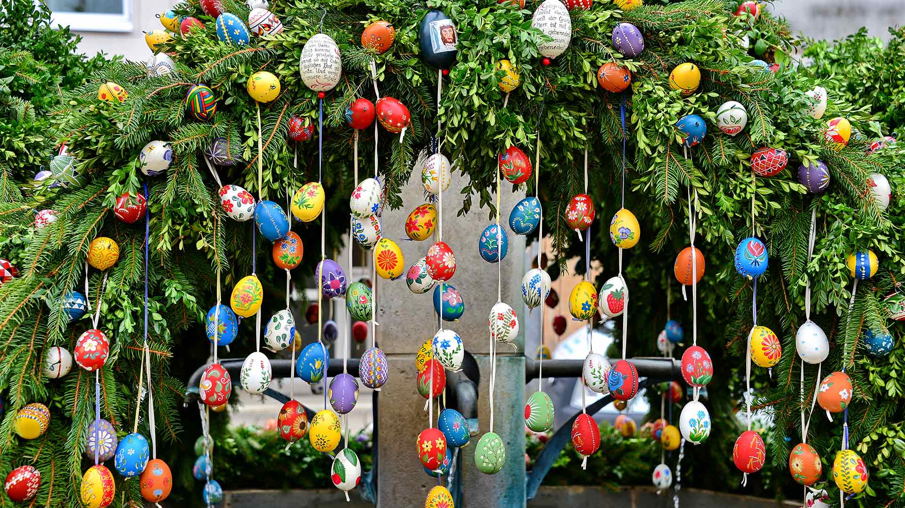
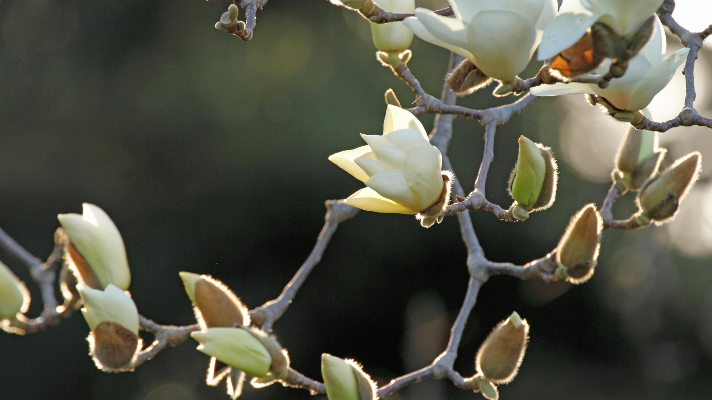
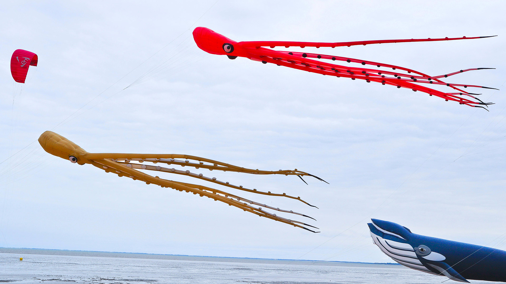
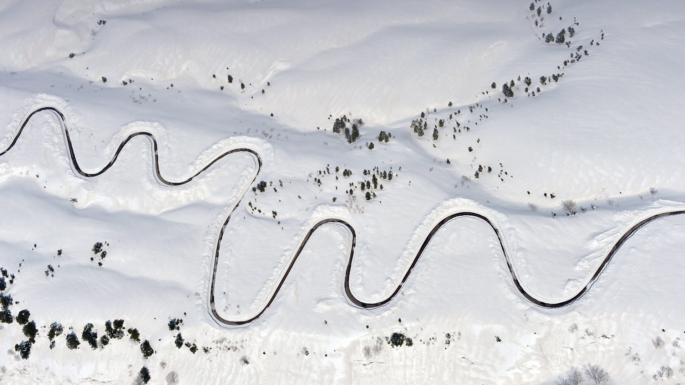
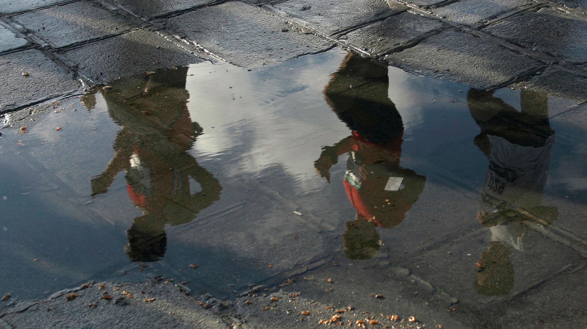
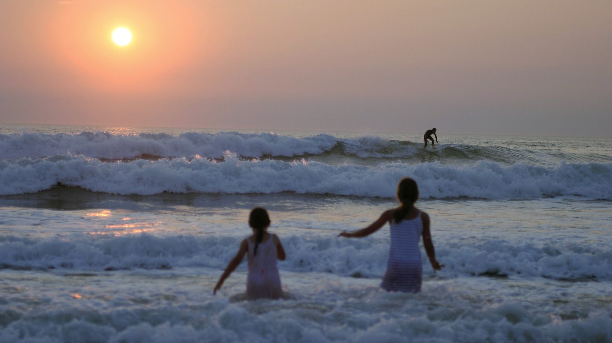
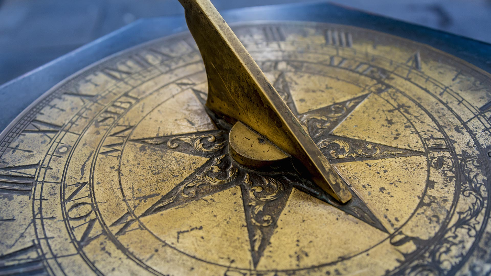

#### 20190430 Wisteria blooms at Kawachi Fuji Gardens in Kitakyushu, Japan (© Wibowo Rusli/Alamy)(Bing United Kingdom)

#### 20190430 ｢I-35W ミシシッピ川橋のレインボー・ライトアップ｣米国ミネソタ州, ミネアポリス (© Riddhish Chakraborty/Getty Images)(Bing Japan)

#### 20190429 Prairie and pinnacles near Castle Trail in Badlands National Park, South Dakota, USA (© Danita Delimont/Getty Images)(Bing United Kingdom)

#### 20190429 ｢デザート・エレファント｣ナミビア, ダマラランド (© Michael Poliza/Getty Images)(Bing Japan)

#### 20190429 Coast redwoods in Henry Cowell Redwoods State Park, California (© Gallery Stock)(Bing United States)

#### 20190428 Petites fleurs roses le long d’une crique, Bonifacio, Corse, France (© Roberto Moiola/Getty Images)(Bing France)

#### 20190428 Dawn in the vineyards near Margaret River, Australia (© Nick Rains/Corbis NX/Getty Images)(Bing Australia)

#### 20190428 Mexican giant cardon cactus (© Ed Reardon/Alamy)(Bing United Kingdom)

#### 20190427 ｢コウテイペンギンの隊列｣南極, スノー・ヒル島 (© David Tipling Photo Library/Alamy)(Bing Japan)

#### 20190427 Ruff male displaying on Varanger Peninsula in Norway (© Winfried Wisniewski/Minden Pictures)(Bing United Kingdom)

#### 20190427 Zweige und Früchte der Flatterulme (Ulmus laevis). Zum Tag des Baumes (© blickwinkel/Alamy Stock Photo)(Bing Deutschland)

#### 20190427 View of modern buildings at sunset in downtown Toronto (© Jon Bilous/Shutterstock)(Bing Canada)

#### 20190426 Ice cave at sunset in Vatnajökull, Iceland (© Johnathan Ampersand Esper/Aurora Photos)(Bing United Kingdom)

#### 20190426 At Casa Batlló for Sant Jordi’s Day in Barcelona, Spain (© Jon Arnold Images Ltd/Alamy)(Bing United States)

#### 20190426 Australian National War Memorial, Canberra (© craighind/iStock Editorial/Getty Images Plus)(Bing Australia)

#### 20190425 The Quinault Rainforest in Olympic National Park, Washington State, USA (© Jason Savage/Tandem Stills + Motion)(Bing United Kingdom)

#### 20190424 ｢バブルリングを吐くイルカ｣バハマ, バハマ・バンクス (© Hiroya Minakuchi/Minden Pictures)(Bing Japan)

#### 20190424 Painted relief of St George and the Dragon at Lincoln Cathedral (© Michael Foley/Alamy)(Bing United Kingdom)

#### 20190424 Osterbrunnen, Ebermannstadt, Bayern, Deutschland (© Rüdiger Hess/geo-select FotoArt)(Bing Deutschland)

#### 20190423 Laysan albatross chick on Midway Atoll, Northwestern Hawaiian Islands (© Jaymi Heimbuch/Minden Pictures)(Bing United Kingdom)

#### 20190422 ｢白木蓮｣ (© Aflo Co., Ltd/Alamy Stock Photo)(Bing Japan)

#### 20190422 Des cerfs volants poulpes au Festival International du cerf-volant et du vent, Chatelaillon-Plage, France (© vicar/Alamy Stock Photo)(Bing France)

#### 20190422 A rabbit in the grass for Easter (© wisan224/Getty Images Plus)(Bing United Kingdom)

#### 20190421 The Cove of Spires in Kenai Fjords National Park near Seward, Alaska, USA (© Grant Ordelheide/Tandem Stills + Motion)(Bing United Kingdom)

#### 20190421 Chipmunk storing food in his cheeks (© mlorenzphotography/Getty Images)(Bing Canada)

#### 20190421 Autumn colours in New England, New South Wales (© ILYA GENKIN/Alamy Stock Photo)(Bing Australia)

#### 20190420 Paepalanthus flowers at sunset, Chapada dos Veadeiros National Park, Brazil (© Marcio Cabral/Getty Images)(Bing United Kingdom)

#### 20190419 Tŵr Mawr lighthouse on Llanddwyn Island in Anglesey, North Wales (© Jon Arnold/DanitaDelimont.com)(Bing United Kingdom)

#### 20190419 ｢コンクリート製の恐竜｣米国アリゾナ州 (© Gary Warnimont/Alamy)(Bing Japan)

#### 20190418 Yayoi Kusama's 'With All My Love for The Tulips, I Pray Forever (2011)' (© Timothy A. Clary/Getty Images)(Bing United States)

#### 20190418 The Esplanade Riel Bridge in downtown Winnipeg (© Design Pics Inc/Alamy Stock Photo)(Bing Canada)

#### 20190418 Hope Valley in the Peak District (© Daniel_Kay/Getty Images Plus)(Bing United Kingdom)

#### 20190418 石楠花丛中的雄狍 (© wonderful-Earth.net/Alamy Stock Photo)(Bing China)

#### 20190417 Bauhaus Archive Museum of Design in Berlin, Germany (© Juergen Henkelmann Photography/Alamy)(Bing United Kingdom)

#### 20190416 ｢除雪中の立山黒部アルペンルート｣富山 (© The Asahi Shimbun/Getty Images)(Bing Japan)

#### 20190416 Coureurs du marathon de Paris, France (© mediacolor's/Alamy Stock Photo)(Bing France)

#### 20190416 Path to San Juan de Gaztelugatxe, Basque Country, Spain, for the new season of Game of Thrones (© Anton Petrus/Moment/Getty Images)(Bing United Kingdom)

#### 20190415 Dubai Miracle Garden, United Arab Emirates (© Amazing Aerial/Offset)(Bing United Kingdom)

#### 20190414 Vinyl records in Rosmalen, the Netherlands (© DutchScenery/Shutterstock)(Bing United Kingdom)

#### 20190413 For Siblings Day, lion cubs wrestling in Samburu National Reserve, Kenya (© Mark C. Ross/Getty Images)(Bing United States)

#### 20190413 The Mount Washington Observatory in New Hampshire, USA (© Mike Theiss/Getty Images)(Bing United Kingdom)

#### 20190412 ｢マラーニ運河｣イタリア, ムラーノ (© John Warburton-Lee/DanitaDelimont.com)(Bing Japan)

#### 20190412 Dutch tulip fields in the Duin- en Bollenstreek region for the Amsterdam Tulip Festival (© Frans Sellies/Getty Images)(Bing United Kingdom)

#### 20190412 Alpine eucalypt bark in Tasmania (© Australian Scenics/Getty Images)(Bing Australia)

#### 20190411 Interior of Seattle Public Library’s Central Library  (© Ron Buskirk/Alamy)(Bing United States)

#### 20190411 A spiral staircase in Hamburg, Germany (© Rüdiger Hess/geo-select FotoArt)(Bing United Kingdom)

#### 20190410 Reflection of the Vimy Memorial Bridge in Ottawa (© Saffron Blaze/Getty Images)(Bing Canada)

#### 20190410 ｢蓮の花｣ベトナム (© Tuan Nguyen Minh/500px/Getty Images)(Bing Japan)

#### 20190410 Bioluminescent algae along the shores of the Matsu Islands off the coast of Taiwan (© Wan Ru Chen/Getty Images)(Bing United Kingdom)

#### 20190409 The National Wallace Monument overlooking Stirling in Scotland (© Elena Korchenko/age fotostock)(Bing United Kingdom)

#### 20190409 ｢野生のポニー｣イギリス, ウェールズ (© Justin Foulkes/SIME/eStock Photo)(Bing Japan)

#### 20190409 Pepper, SoftBank Robotics' humanoid robot, on display in Tokyo (© Christopher Jue/EPA/Shutterstock)(Bing United States)

#### 20190409 Deux fillettes en pleine baignade devant un coucher de soleil à Lacanau, France (© van hilversum/Alamy Stock Photo)(Bing France)

#### 20190408 ｢ラ・ディーグ島｣セーシェル (© Oleksandr Dibrova/Adobe Stock)(Bing Japan)

#### 20190408 For International Beaver Day, a beaver swimming in Grand Teton National Park, Wyoming, USA (© Charlie Hamilton James/Getty Images)(Bing United Kingdom)

#### 20190407 Sunbeams across Tartu County, Estonia (© Sven Zacek/Minden Pictures)(Bing United Kingdom)

#### 20190407 【今日清明】 (© Hanyu Qiu/Shutterstock)(Bing China)

#### 20190407 Blue quandongs and colourful leaves on subtropical rainforest floor, Currumbin Creek Valley (© Auscape/UIG via Getty Images)(Bing Australia)

#### 20190406 Blossoming cherry trees at a tea plantation in Longyan, China (© VCG/Getty Images)(Bing United Kingdom)

#### 20190405 Emerald Lake near Carcross, Yukon Territories (© David Noton Photography/Alamy Stock Photo)(Bing Canada)

#### 20190405 For Earth Month, a symmetrical forest known as a Nelder plot (© Rachid Dahnoun/Tandem Stills + Motion)(Bing United Kingdom)

#### 20190405 ｢ナポレオンの帽子｣モロッコ, タフロウト (© Doug Pearson Photography/plainpicture)(Bing Japan)

#### 20190404 ｢バース｣イギリス, サマセット (© Rob Cousins/Getty Images)(Bing Japan)

#### 20190404 Antike Sonnenuhr aus Kupfer (© Gary S Chapman/Getty Images)(Bing Deutschland)

#### 20190403 Statue of Hans Christian Andersen in New York City’s Central Park (© Stuart Forster/Shutterstock)(Bing United States)

#### 20190403 Milky Way over the Bisti/De-Na-Zin Wilderness in New Mexico, USA (© Cory Marshall/Tandem Stills + Motion)(Bing United Kingdom)

#### 20190402 Books by Hans Christian Andersen (© radiokafka/Adobe Stock)(Bing United Kingdom)

#### 20190402 View of Paris, France, with the Eiffel Tower, taken from Notre-Dame Cathedral (© Funny Solution Studio/Shutterstock)(Bing United States)

#### 20190401 Horloge de l’église Saint-Paul-Saint-Louis, Quartier du Marais, Paris, France (© DUCEPT Pascal/hemis.fr/Getty Images)(Bing France)

#### 20190401 Bear cubs playing by a lake (© Sergey Ivanov/Getty)(Bing United Kingdom)

#### 20190401 Cow with calf in a rural field for Mother’s Day (© Juice Images/Offset)(Bing United Kingdom)

