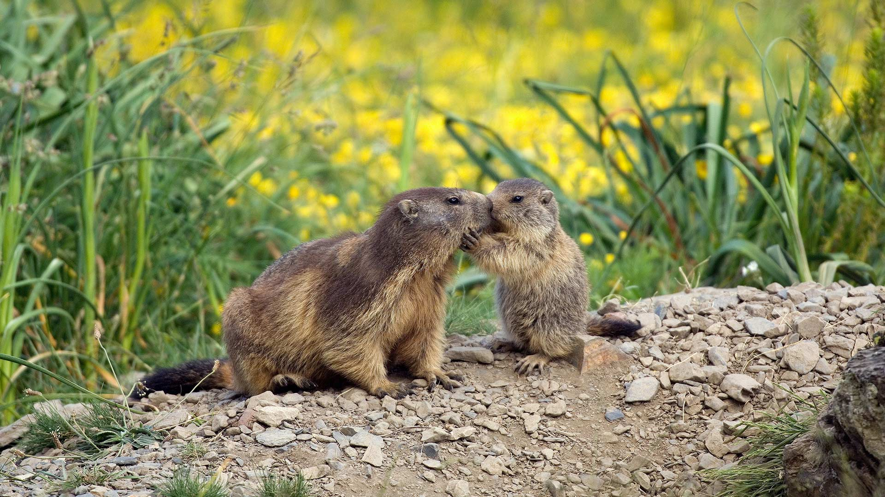
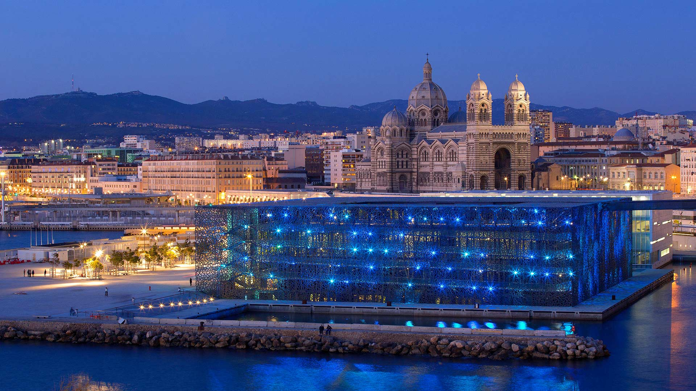
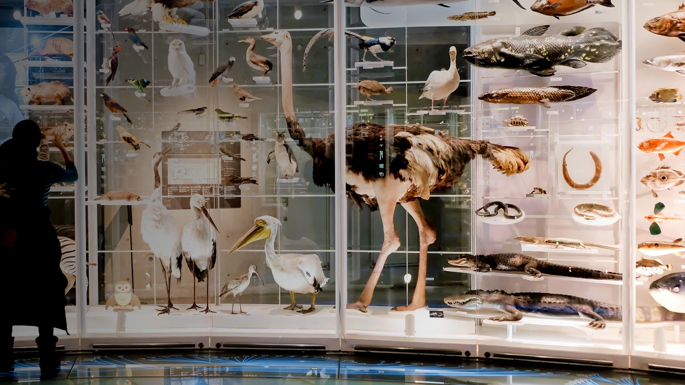
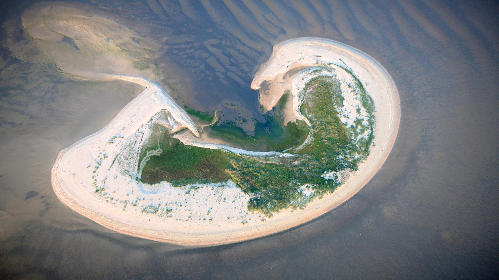
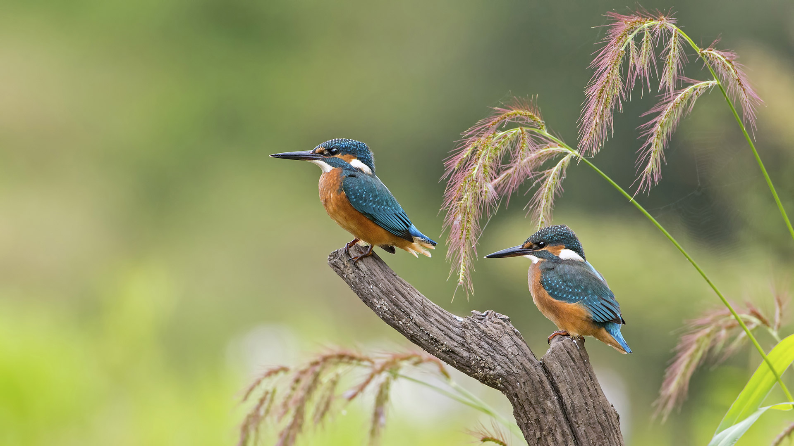
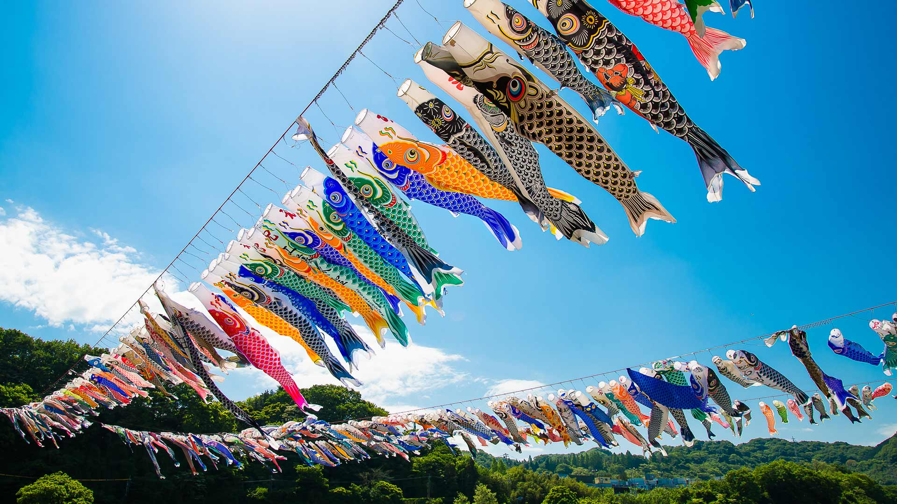
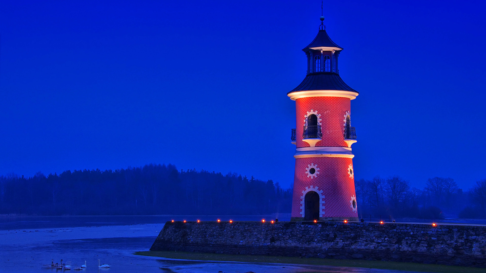

#### 20190531 Pitting Gales Point, Pembrokeshire Coast National Park, west Wales (© Sebastian Wasek/Getty Images)(Bing United Kingdom)

#### 20190531 ｢オーシャンドライブ｣米国フロリダ州, マイアミビーチ (© Guido Cozzi/Offset/Shutterstock)(Bing Japan)

#### 20190531 Lesmurdie Falls Walking Trail, Perth (© Random Lights Photography/Alamy Stock Photo)(Bing Australia)

#### 20190530 42nd Street with the Chrysler Building during Manhattanhenge in 2018, New York City (© Dennis Fischer Photography/Getty Images)(Bing United States)

#### 20190530 For the Cricket World Cup, a cricket-themed sculpture at Yorkshire Lavender (© Jonathan Hodson/Alamy)(Bing United Kingdom)

#### 20190530 草地上的罂粟和矢车菊，德国北莱茵-威斯特法伦州 (© imageBROKER/Alamy)(Bing China)

#### 20190529 Stravinsky Fountain in Paris, France (© Alessandro Saffo/eStock Photo)(Bing United Kingdom)

#### 20190528 Sydney Opera House light beam projections during Vivid 2017 (© Taras Vyshnya/Alamy Stock Photo)(Bing United Kingdom)

#### 20190528 The Lush Rainforest of Cathedral Grove, Macmillan Provincial Park, B.C. (© Robert Postma/Design Pics/Shutterstock)(Bing Canada)

#### 20190528 Gänsesäger mit Küken, Bayern, Deutschland (© Westend61/Getty Images)(Bing Deutschland)

#### 20190527 Mima mounds at Oregon’s Zumwalt Prairie, USA (© Michael Durham/Minden Pictures)(Bing United Kingdom)

#### 20190527 Visitors at the Vietnam Veterans Memorial in Washington, DC (© Nikki Kahn/Getty Images)(Bing United States)

#### 20190527 Low-lying fog along the coast, Newfoundland and Labrador (© Scott Leslie/Minden Pictures)(Bing Canada)

#### 20190527 Une marmotte et son petit à l’occasion de la fête des Mères en France (© AGB Photo Library/age footstock)(Bing France)

#### 20190526 Mont Saint-Michel for its annual marathon (© Leroy Francis/Getty Images)(Bing United Kingdom)

#### 20190526 Vue du ciel depuis le bâtiment Louise-Weiss, le Parlement européen de Strasbourg, France (© Hemis/Alamy Stock Photo)(Bing France)

#### 20190525 ｢タロンガ動物園のライトアップ｣オーストラリア, シドニー (© Wendell Teodoro/REX/Shutterstock)(Bing Japan)

#### 20190525 Male Cape May warbler in spring (© JZHunt/Getty Images Plus)(Bing United Kingdom)

#### 20190524 Sandcastle on Malvarrosa Beach in Valencia, Spain (© Tony French/Alamy)(Bing United Kingdom)

#### 20190524 ｢アオウミガメ｣ハワイ (© Monica & Michael Sweet/Aurora Photos)(Bing Japan)

#### 20190523 Green sea turtle with sardines near Playa Grandi beach, Curaçao (© yfhishinuma/Getty Images Plus)(Bing United Kingdom)

#### 20190522 'El Problema del Caballo' by Claudia Fontes in Venice, Italy (© Marco Secchi/Getty Images)(Bing United Kingdom)

#### 20190521 ｢ジャングルの中のパークレンジャー｣メキシコ, エル・トリウンフォ生物圏保護区 (© Chico Sanchez/Aurora Photos)(Bing Japan)

#### 20190521 L’ombre de Rafael Nadal sur la terre battue de Roland-Garros, Bois de Boulogne, Paris, France (© AP Photo/Michel Spingler)(Bing France)

#### 20190521 A garden exhibit at the 2018 RHS Chelsea Flower Show (© Natalia Vestigio Services/Shutterstock)(Bing United Kingdom)

#### 20190520 Sea Cliff Bridge along Australian Pacific Ocean coast (© Nick Fox/Alamy)(Bing Australia)

#### 20190520 A Black Bear (Ursus americanus) cub in a pine tree, Jasper National Park, Alta. (© Donald M. Jones/Minden Pictures)(Bing Canada)

#### 20190520 Island fox on Santa Cruz Island, Channel Islands National Park, California (© Ian Shive/Tandem Motion + Stills)(Bing United States)

#### 20190520 A honey bee (Apis mellifera) covered in pollen in pumpkin, Germany (© Konrad Wothe/Minden Pictures)(Bing United Kingdom)

#### 20190519 Le Mucem, le Musée des Civilisations de l’Europe et de la Méditerranée, pour la Nuit des Musées, Marseille, France (© Hemis/Alamy Stock Photo)(Bing France)

#### 20190519 ｢国立科学博物館｣東京, 台東区 (© WindAwake/Shutterstock)(Bing Japan)

#### 20190519 Ghyakar village, Upper Mustang, Nepal (© Frank Bienewald/Alamy)(Bing United Kingdom)

#### 20190518 The City of Arts and Sciences in Valencia, Spain (© MAIKA 777/Getty Images)(Bing United Kingdom)

#### 20190517 来自人工智能的画作《思念》 (© 微软小冰)(Bing China)

#### 20190517 ｢ケープタウン港｣南アフリカ, ケープタウン (© Zero Creatives/Science Photo Library)(Bing Japan)

#### 20190517 The Copper River Delta in Wrangell-St Elias National Park and Preserve, Alaska, USA (© Frans Lanting/plainpicture)(Bing United Kingdom)

#### 20190517 A carving of artist W.O.J. Nieuwenkamp in the Pura Meduwe Karang temple in Bali, Indonesia (© John Elk III/Getty Images)(Bing United States)

#### 20190516 Abu Simbel temples on the west shore of Lake Nasser, Egypt (© George Steinmetz/Getty Images)(Bing United Kingdom)

#### 20190515 Pine Log State Forest, Florida, USA (© plainpicture/Cavan Images)(Bing United Kingdom)

#### 20190514 Insel Lütje Hörn im Wattenmeer, Nordsee, Niedersachsen, Deutschland (© plainpicture/Peter Hamel)(Bing Deutschland)

#### 20190514 Cannes, France, where the annual film festival begins today (© Manjik Photography/Alamy)(Bing United Kingdom)

#### 20190513 Ottawa Tulip Festival (© imageBROKER/Shutterstock)(Bing Canada)

#### 20190513 Midnight sun at North Cape, Norway (© Ron Bennett/Shutterstock)(Bing United Kingdom)

#### 20190513 A model walks the runway during the Camilla show at Mercedes-Benz Fashion Week, 2018 in Sydney, Australia (© Mark Nolan/Getty Images)(Bing Australia)

#### 20190512 Piping plover and its chick on Jones Beach Island, New York (© Vicki Jauron/Getty Images)(Bing United States)

#### 20190512 An outdoor curling tournament in Naseby, New Zealand (© David Wall/Danita Delimont)(Bing United Kingdom)

#### 20190511 Historic windmills of Zaanse Schans near Amsterdam, Netherlands (© Matt Cooper/Gallery Stock)(Bing United Kingdom)

#### 20190511 ｢チリーフラミンゴの渡り｣チリ, トーレス・デル・パイネ国立公園 (© Ben Hall/Minden Pictures)(Bing Japan)

#### 20190510 Steamtown National Historic Site in Scranton, Pennsylvania (© Walter Bibikow/Danita Delimont)(Bing United States)

#### 20190510 A carpet of bluebells in beech woodland, Hertfordshire (© Dan Tucker/Alamy)(Bing United Kingdom)

#### 20190509 Zebras in Serengeti National Park, Tanzania (© pchoui/Getty Images)(Bing United Kingdom)

#### 20190508 A fox in the grass (© Frederic Desmette/Minden Pictures)(Bing United Kingdom)

#### 20190508 Australian salt lakes from above (© Philippe Bourseiller/The Image Bank/Getty Images)(Bing Australia)

#### 20190507 St Mary Falls in Glacier National Park, Montana, USA (© Pung/Shutterstock)(Bing United Kingdom)

#### 20190507 ｢銀河とみずがめ座η流星群｣米国ワイオミング州, デビルスタワー (© Jason Hatfield/Tandem Stills + Motion)(Bing Japan)

#### 20190507 Junge Eisvögel, Sachsen-Anhalt, Deutschland (© Thomas Hinsche/Minden Pictures)(Bing Deutschland)

#### 20190506 Fireweed in North Cascades National Park in Washington state (© Danita Delimont/Getty Images)(Bing United States)

#### 20190506 ｢泳げ鯉のぼり相模川｣神奈川, 相模原市 (©  Leo Hartadi/500px/Getty Images)(Bing Japan)

#### 20190506 Hummingbird near blooming aloe vera in Laguna Beach, California, USA (© Aurora Photos/Offset)(Bing United Kingdom)

#### 20190505 ｢スゲの草むら｣米国ミネソタ州, ムース・レイク (© Jim Brandenburg/Minden Pictures)(Bing Japan)

#### 20190505 San Miguel de Allende, Mexico (© ferrantraite/Getty Images)(Bing United Kingdom)

#### 20190504 The Skellig Islands, Skellig Michael and Little Skellig, in Ireland (© Design Pics/DanitaDelimont.com)(Bing United Kingdom)

#### 20190504 Une manifestation pour la liberté de la presse à Paris après les attentats sur Charlie Hebdo du 11 Janvier 2015 (© Fredrik von Erichsen/picture alliance via Getty Images)(Bing France)

#### 20190504 ｢国会議事堂｣東京, 永田町 (© Michael H/Photodisc/GettyImages)(Bing Japan)

#### 20190503 The installation 'Waldplastik' during Blue Night in Nuremberg, Germany (© Daniel Karmann/Shutterstock)(Bing United Kingdom)

#### 20190502 【今日劳动节】 (© Katvic/Shutterstock)(Bing China)

#### 20190502 The Glenfinnan Viaduct in Scotland, made famous by the Hogwarts Express in Harry Potter (© Jon Arnold/DanitaDelimont.com)(Bing United Kingdom)

#### 20190501 Leuchtturm in Moritzburg, Sachsen, Deutschland (© LianeM/Alamy Stock Photo)(Bing Deutschland)

#### 20190501 ｢LOVE｣米国ペンシルベニア州, フィラデルフィア (© Franz Marc Frei/Getty 7)(Bing Japan)

#### 20190501 Louis Armstrong performs with bandmates in Vienna, Austria, on 22 February 1959 (© Franz Hubmann/Getty Images)(Bing United Kingdom)

#### 20190501 Newborn brown-throated sloth with mother, Sloth Sanctuary of Costa Rica (© Suzi Eszterhas/Minden Pictures)(Bing United Kingdom)

