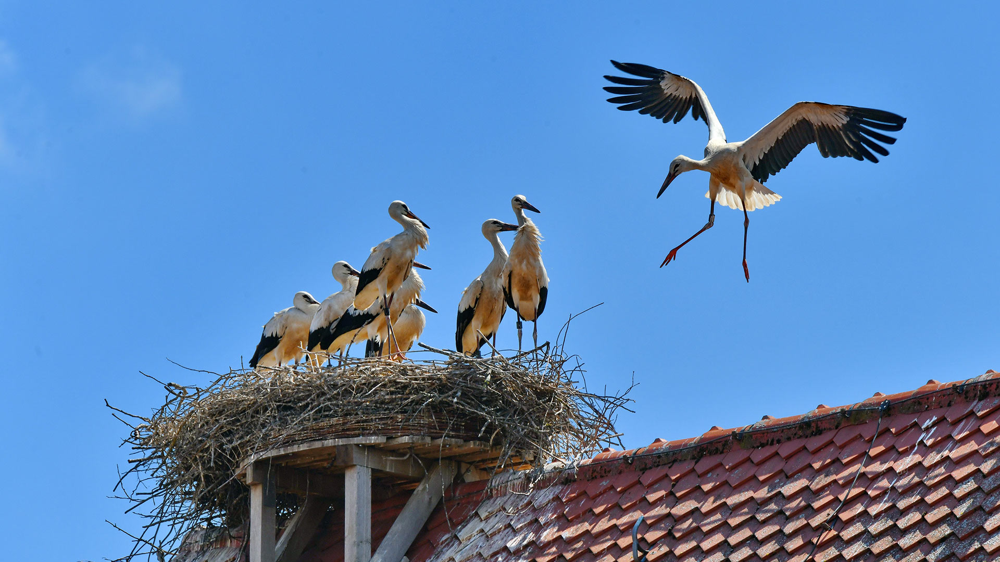
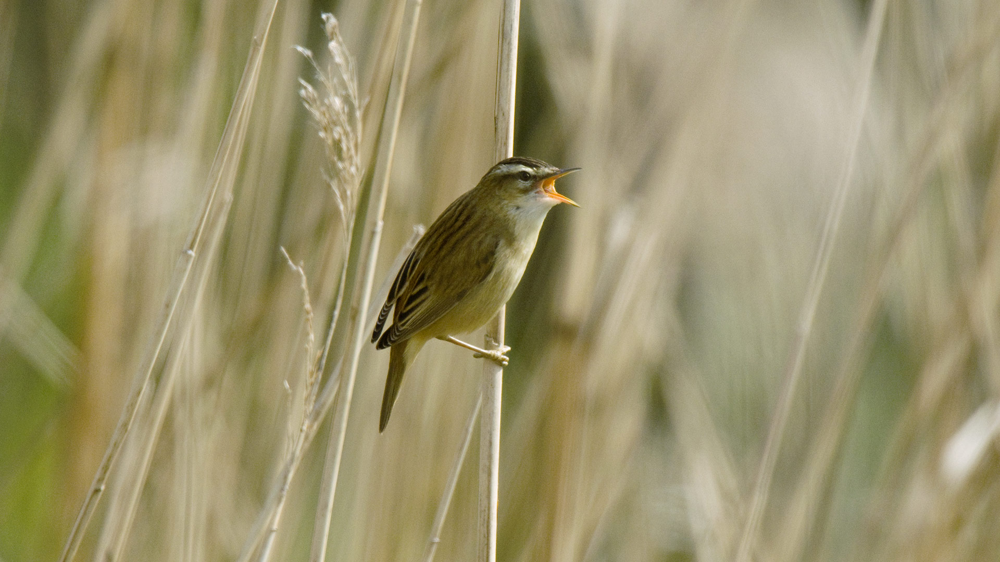
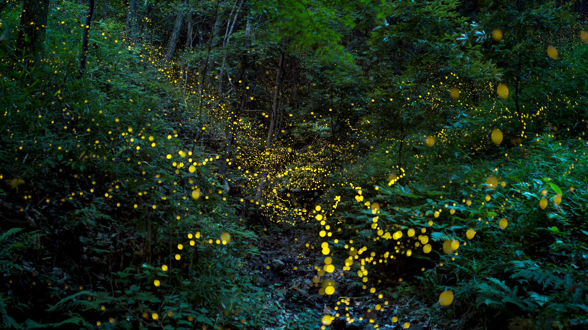
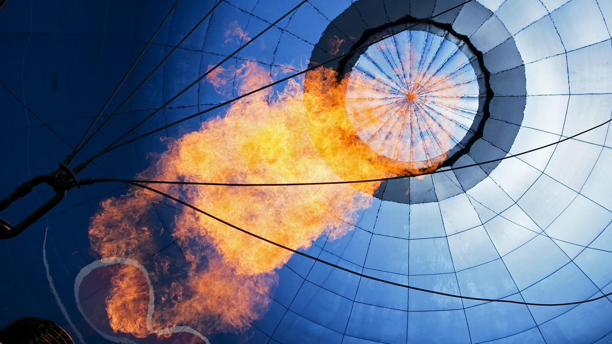

#### 20190630 San Francisco City Hall lit with rainbow lights for Pride (© Wonwoo Lee/Getty Images)(Bing United States)

#### 20190630 Close-up of chairlift during sunrise in Mt Hotham, Victoria (© VMJones/iStock/Getty Images Plus)(Bing Australia)

#### 20190630 Peggys Point Lighthouse at dusk, Peggy\'s Cove, Nova Scotia, Canada (© Darwin Wiggett/Offset)(Bing United Kingdom)

#### 20190630 Drapeau arc-en-ciel flottant près de la Tour Eiffel lors de la Marche des fiertés de Paris (© Aflo Co. Ltd./Alamy Stock Photo)(Bing France)

#### 20190630 ｢ビートルズ・アシュラム｣インド, リシュケシュ (© Sasha Bezzubov/Gallery Stock)(Bing Japan)

#### 20190629 Burrowing owlet posing in Cape Coral, Florida, USA (© mlorenzphotography/Getty Images)(Bing United Kingdom)

#### 20190628 Montreux and Lake Geneva in Switzerland (© Westend61/Getty Images)(Bing United Kingdom)

#### 20190627 Living root bridge in India (© dhritipurna/Shutterstock)(Bing United Kingdom)

#### 20190626 Glastonbury Tor and St Michael\'s Tower for the start of the Glastonbury Festival (© Spraggon Photography/Getty Images Plus)(Bing United Kingdom)

#### 20190625 Sutherland Falls and Lake Quill in New Zealand (© Michael Rathmayr/plainpicture)(Bing United Kingdom)

#### 20190625 Weißstörche im Aischgrund bei Gerhardshofen, Bayern, Deutschland (© Rüdiger Hess/geo-select FotoArt)(Bing Deutschland)

#### 20190624 Fireflies surround an Indian almond tree in Camarines Sur, Luzon, Philippines (© Jurgen Freund/Minden Pictures)(Bing United Kingdom)

#### 20190624 Fleur de Lis on a railing at Golden Square Mile, Montreal (© Keith Levit/Alamy Stock Photo)(Bing Canada)

#### 20190624 ｢アラン・チューリングのノート｣ (© Spencer Platt/Getty Images News)(Bing Japan)

#### 20190623 Gnomesville in the Shire of Dardanup, Australia (© Amanda Hughes/Alamy)(Bing United Kingdom)

#### 20190622 Phragmite des joncs en train de chanter à l’occasion de la fête de la musique, Baie de Somme, France (© Gerard Soury/Oxford Scientific/Getty Images Plus)(Bing France)

#### 20190622 Aerial view of the Amazon River basin near Manaus, Brazil (© Art Wolfe/Danita Delimont)(Bing United Kingdom)

#### 20190622 从上布法罗荒野地区的惠特克顶小道向东看，阿肯色州奥沙克国家森林 (© Jens Lambert Photography/Getty Images Plus)(Bing China)

#### 20190622 ｢クリスマスアカガニ｣オーストラリア, クリスマス島 (© Ingo Arndt/Minden Pictures)(Bing Japan)

#### 20190621 ｢チャールス・クオーネン吊り橋｣スイス, ヴァリス州 (© Menno Boermans/Aurora Photos)(Bing Japan)

#### 20190621 The Sun Voyager sculpture by Jón Gunnar Árnason in Reykjavik, Iceland (© Martin Child/Getty Images Plus)(Bing United Kingdom)

#### 20190621 一种常见茅膏菜（圆叶茅膏菜）的粘性叶片，法国孚日省 (© Christophe Sidamon-Pesson/Minden Pictures)(Bing China)

#### 20190620 A white tiger at the Moscow Zoo, Russia (© andamanec/Shutterstock)(Bing Australia)

#### 20190620 Sunset over the Great Sandhills, Sask. (© Robert Postma/plainpicture)(Bing Canada)

#### 20190620 Bald eagles in Anchorage, Alaska (© Ron Niebrugge/Alamy)(Bing United States)

#### 20190620 Advancetown Lake on the Gold Coast, Queensland, Australia (© AzmanL/E+/Getty Images)(Bing United Kingdom)

#### 20190619 Aerial view of the cherry laurel maze in Glendurgan Garden, Cornwall (© Richard Cooke/Alamy)(Bing United Kingdom)

#### 20190618 Roman snails, also called edible snails (© Heidi and Hans-Juergen Koch/Minden Pictures)(Bing United Kingdom)

#### 20190617 The Crystal Bridges Museum of American Art in Bentonville, Arkansas, USA (© Eddie Brady/Getty Images)(Bing United Kingdom)

#### 20190616 Sphinx Observatory in Switzerland (© Jan Greune/Alamy)(Bing Australia)

#### 20190616 Male African lion and cub in Kgalagadi Transfrontier Park in southern Africa (© Richard Du Toit/Minden Pictures)(Bing United Kingdom)

#### 20190615 大叶绣球花上的一对日本树蛙，日本滋贺 (© Mitsuhiko Imamori/Minden)(Bing China)

#### 20190615 Aerial view of surfers in Cornwall for International Surfing Day (© Matt Cooper/Gallery Stock)(Bing United Kingdom)

#### 20190615 ｢レーニア山｣米国ワシントン州 (© Stephen Matera/Tandem Stills + Motion)(Bing Japan)

#### 20190614 塞尚山，法国普罗旺斯艾克斯 (© travelview/iStock)(Bing China)

#### 20190614 Prothonotary Warbler (protonotaria citrea) in Ontario (© Bill Coster/Minden Pictures)(Bing Canada)

#### 20190614 Chimney Rock State Park in North Carolina (© Seb Coursol/Getty Images)(Bing United States)

#### 20190614 Street art from the 2013 Pasadena Chalk Festival, California, USA (© WENN US/Alamy)(Bing United Kingdom)

#### 20190613 ｢パンケーキ・ロックス｣ニュージーランド南島, パパロア国立公園 (© Michael Reusse/Westend61/Offset)(Bing Japan)

#### 20190613 The Great Elephant from Machines of the Isle of Nantes, France (© Dutourdumonde Photography/Shutterstock)(Bing United Kingdom)

#### 20190612 Rio Grande and Sierra del Carmen mountains in Big Bend National Park, Texas, USA (© Grant Ordelheide/Tandem Stills + Motion)(Bing United Kingdom)

#### 20190612 富士山与丛生福禄考花田，日本山梨县 (© Srinil/shutterstock)(Bing China)

#### 20190611 ｢天文時計｣チェコ, オロモウツ (© scubabartek/iStock/Getty Images Plus)(Bing Japan)

#### 20190611 Cracking Art installation at Le Mans Cathedral in 2015, Le Mans, France (© Michel GILE/Gamma-Rapho via Getty Images)(Bing United Kingdom)

#### 20190610 Ponta da Piedade rock formations off the coast of the Algarve, Portugal (© David Santiago Garcia/Offset)(Bing United Kingdom)

#### 20190610 ｢森の中のホタル｣岡山県 (© tdub303/Gettyimages)(Bing Japan)

#### 20190609 Crown Fountain, by Catalan artist Jaume Plensa, in Millennium Park, Chicago, Illinois, USA (© imageBROKER/Alamy)(Bing United Kingdom)

#### 20190608 【今日端午节】 (© Xinhua/Alamy Stock Photo)(Bing China)

#### 20190608 Biorock growing coral off the Gili Islands, Indonesia (© fenkieandreas/Getty Images Plus)(Bing United Kingdom)

#### 20190608 Heißluftballon, der mit einem Brenner aufgeheizt wird, Bad Wiessee, Bayern, Deutschland (© Christian Heinrich/Getty Images)(Bing Deutschland)

#### 20190607 France players in a huddle prior to their semi-final match against Spain at the Fifa U-20 Women\'s World Cup (© Alex Grimm/Fifa via Getty Images)(Bing United Kingdom)

#### 20190607 Fan vaulted ceiling of the foyer of the State Theatre, Sydney (© domonabike/Alamy Stock Photo)(Bing Australia)

#### 20190607 ｢セナンク修道院のラベンダー畑｣フランス, プロヴァンス＝アルプ＝コート・ダジュール地域圏 (© Carlos Sanchez Pereyra/plainpicture)(Bing Japan)

#### 20190607 A glazed doughnut with sprinkles (© viafilms/Getty Images)(Bing United States)

#### 20190606 Remains of the Mulberry harbour from the D-Day invasion at Arromanches, Normandy, France (© Javier Gil/Alamy)(Bing United Kingdom)

#### 20190606 ｢海上の積雲｣カリブ海地域 (© F. M. Kearney/plainpicture)(Bing Japan)

#### 20190605 The tree canopy in the Tambopata National Reserve of the Peruvian Amazon (© Patrick Brandenburg/Tandem Stills + Motion)(Bing United Kingdom)

#### 20190604 Date palm groves near Zagora, Morocco (© Frans Lemmens/Getty Images)(Bing United Kingdom)

#### 20190603 ｢タリン旧市街｣エストニア (© Kavalenkava Volha/Alamy)(Bing Japan)

#### 20190603 It’s our birthday too, yeah! Harbour seal pup lying on the beach, Heligoland, Germany (© Fotofeeling/Westend61/Offset)(Bing United Kingdom)

#### 20190602 The Bass Rock in Scotland’s Firth of Forth (© Richard Shucksmith/Minden Pictures)(Bing United Kingdom)

#### 20190601 ｢シェトランド諸島の古い農場｣イギリス, スコットランド (© Michael Runkel/Getty Images)(Bing Japan)

#### 20190601 The High Trestle Trail Bridge in Iowa, USA (© Kelly van Dellen/Getty Images Plus)(Bing United Kingdom)

