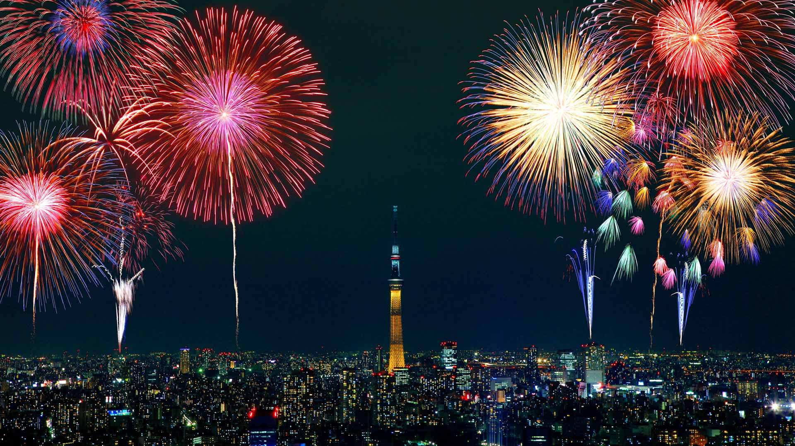
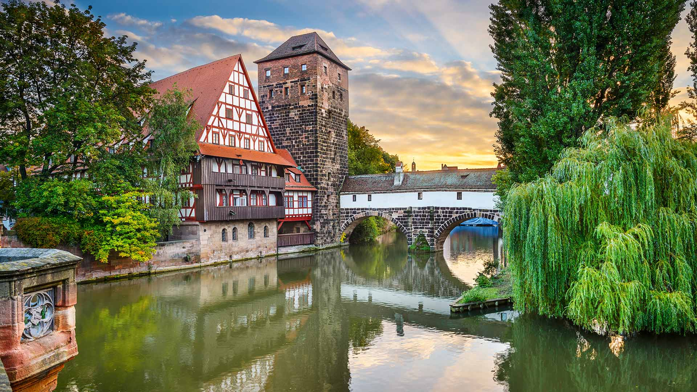
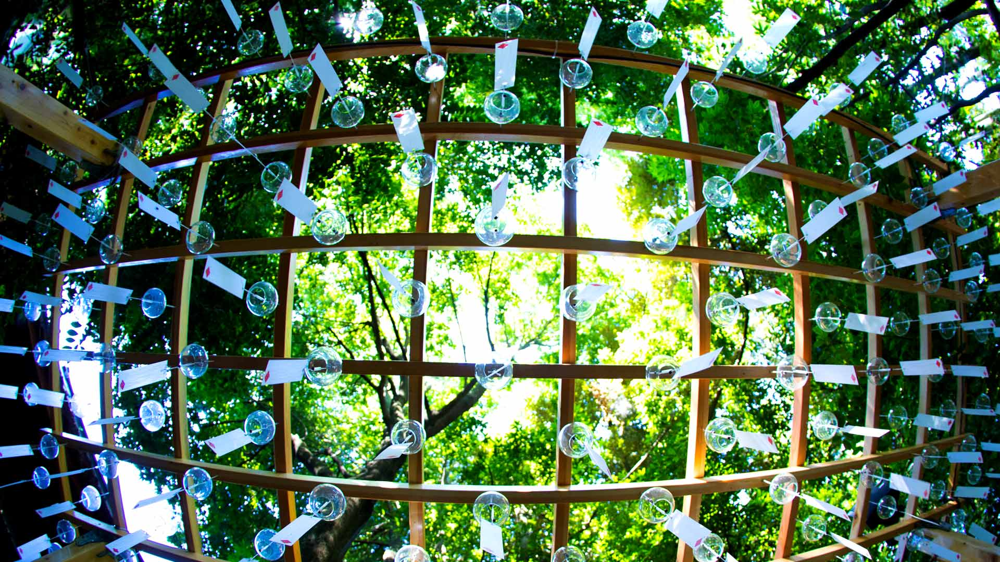
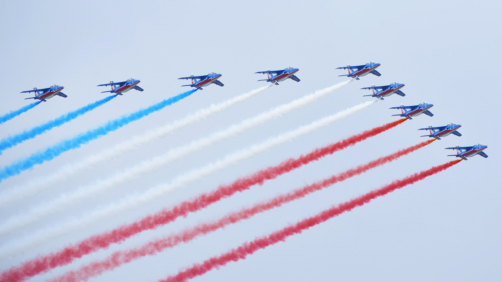
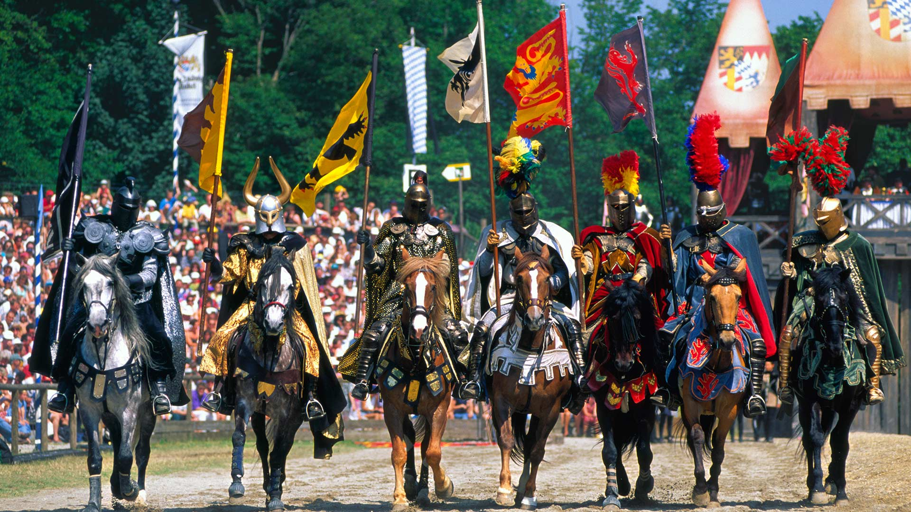
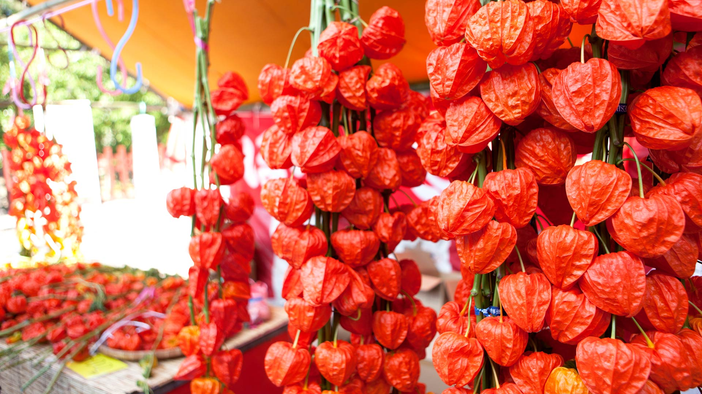
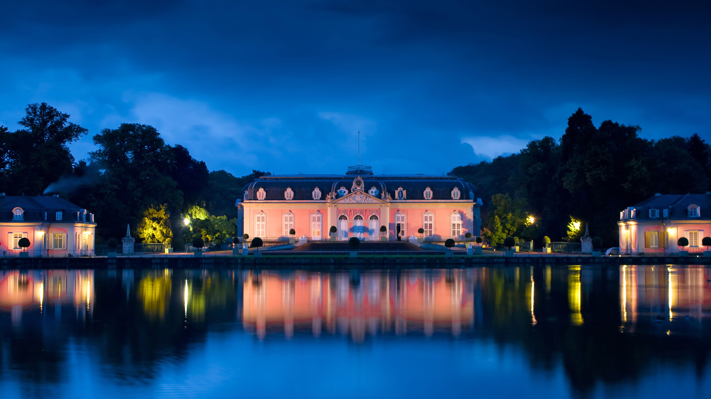
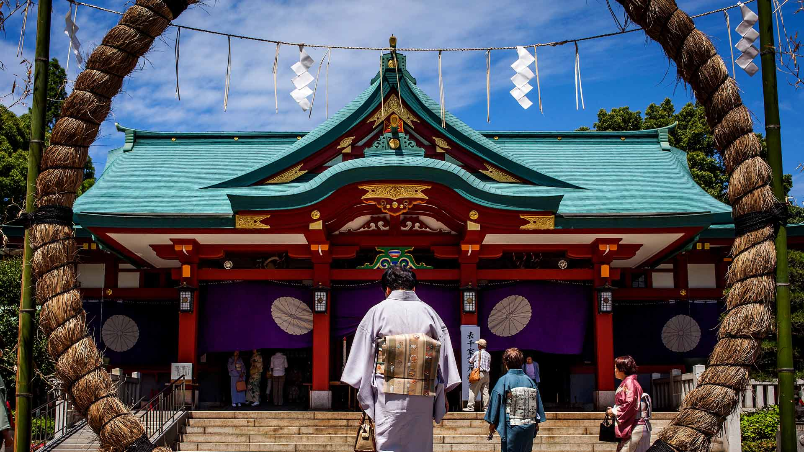

#### 20190731 A treetop walkway in the Bavarian Forest National Park, Neuschönau, Germany (© imageBROKER/Alamy)(Bing United Kingdom)

#### 20190730 Giant tortoises on Alcedo Volcano in the Galápagos Islands (© Tui De Roy/Minden Pictures)(Bing United Kingdom)

#### 20190729 Trillium Lake in Mount Hood National Forest, Oregon (© Frank Krahmer/Getty Images)(Bing United States)

#### 20190729 Puffins among sea campion on Skomer Island, Pembrokeshire, Wales (© Ross Hoddinott/Minden Pictures)(Bing United Kingdom)

#### 20190728 ｢隅田川花火大会｣東京, 墨田区 (© Aflo Relax/Masterfile)(Bing Japan)

#### 20190728 Carhenge, created by Jim Reinders, in Nebraska, USA (© Charlie Summers/Minden Pictures)(Bing United Kingdom)

#### 20190728 Giant karri tree at the entrance to a cave in Margaret River area, Western Australia (© Posnov/Getty Images)(Bing Australia)

#### 20190728 Aerial view of Elk Falls suspension bridge on Vancouver Island (© Ink Drop/Alamy Stock Photo)(Bing Canada)

#### 20190728 Ein Teilnehmer schwenkt die Regenbogen-Flagge auf dem 40. Christopher Street Day vor der Siegessäule am 28. Juli 2018 in Berlin, Deutschland (© Carsten Koall/Getty Images News)(Bing Deutschland)

#### 20190727 The shoreline of Cahuita National Park, in Costa Rica (© Greg Basco/Minden Pictures)(Bing United Kingdom)

#### 20190727 Weinstadel und Wasserturm am Ufer der Pegnitz, Nürnberg, Bayern, Deutschland (© SeanPavonePhoto/Getty Images)(Bing Deutschland)

#### 20190726 Alphorn musicians perform during the International Alphorn Festival in Nendaz, Switzerland (© Fabrice Coffrini/Getty Images)(Bing United Kingdom)

#### 20190725 Jane\'s Carousel in Brooklyn, New York, USA (© Grzegorz Gill/Shutterstock)(Bing United Kingdom)

#### 20190725 The Cathedral on a stormy morning, Mount Buffalo, Australia (© Ilya Genkin/Alamy)(Bing Australia)

#### 20190724 Meerkats in the Kalahari Desert in Botswana (© Aluma Images/Getty Images)(Bing United Kingdom)

#### 20190723 The Skywalk on the Rock of Gibraltar (© Stephen Ball/Alamy)(Bing United Kingdom)

#### 20190723 ｢風鈴祭り｣埼玉, 川越 (© motion.imaging/Shutterstock)(Bing Japan)

#### 20190722 Hummingbird hawk-moth feeding on flower, Sardinia, Italy (© patriziomartorana/iStock/Getty Images Plus)(Bing United Kingdom)

#### 20190721 Saint Pierre panorama at sunrise, Saint Pierre and Miquelon (© Henryk Sadura/Getty Images)(Bing Canada)

#### 20190721 Buckingham Palace and Victoria Memorial for Queen Victoria\'s bicentennial year (© CTC Creative/Offset)(Bing United Kingdom)

#### 20190720 Artist Luke Jerram\'s installation \'Museum of the Moon\' at Liverpool Cathedral (© Christopher Furlong/Getty Images)(Bing United Kingdom)

#### 20190719 Garden of the Gods Park in Colorado Springs, Colorado, USA (© lightphoto/iStock/Getty Images)(Bing United Kingdom)

#### 20190719 ｢ベイト・ボール｣ポルトガル, アゾレス諸島 (© Jordi Chias/Minden Pictures)(Bing Japan)

#### 20190718 Narrenmuehle（愚人磨坊风车），德国Dülken (© dpa picture alliance/Alamy)(Bing China)

#### 20190718 Leatherback sea turtles in Trinidad and Tobago (© Shane P. White/Minden Pictures)(Bing United Kingdom)

#### 20190717 A flock of sheep in the Gobi Desert (© Patrick Baz/Getty Images)(Bing United Kingdom)

#### 20190717 Cradle Mountain-Lake St Clair National Park, Tasmania, Australia (© Rob Blakers/Getty Images)(Bing Australia)

#### 20190716 The Ernest Hemingway Home and Museum in Key West, Florida, USA (© Werner Bertsch/eStock Photo)(Bing United Kingdom)

#### 20190715 Mount Fuji and twin rocks (Ushitukiiwa) in Matsuzaki, Japan (© Tommy Tsutsui/Getty Images)(Bing United Kingdom)

#### 20190715 La Patrouille de France lors du défilé du 14 juillet 2014 sur les Champs-Élysées (© Xinhua/Alamy Stock Photo)(Bing France)

#### 20190714 Action from the 1950 British Grand Prix at Silverstone (© Klemantaski Collection/Hulton Archive/Getty Images)(Bing United Kingdom)

#### 20190713 Sailors begin their journey from Chicago to Mackinac Island, Michigan, USA, during the Race to Mackinac (© Karen I. Hirsch/Alamy)(Bing United Kingdom)

#### 20190713 Ritter auf ihren Pferden während des Ritterturniers in Kaltenberg, Bayern, Deutschland (© Pat Behnke/Alamy Stock Photo)(Bing Deutschland)

#### 20190712 Waterperry Gardens in Oxfordshire (© Lauren Hibbit/Danita Delimont)(Bing United Kingdom)

#### 20190712 The cypress tunnel at Point Reyes National Seashore in California (© Rachid Dahnoun/Tandem Stills + Motion)(Bing United States)

#### 20190711 Artificial light from Earth (© NASA)(Bing United Kingdom)

#### 20190711 ｢ほおずき市｣東京, 浅草寺 (© Nobuyuki Yoshikawa/Aflo)(Bing Japan)

#### 20190710 ｢スカイライン・パークのジェットコースター｣ドイツ, バイエルン州 (© Karl-Josef Hildenbrand/Getty Images)(Bing Japan)

#### 20190710 Visitors on El Caminito del Rey in the province of Málaga, Spain (© Ken Welsh/Alamy)(Bing United Kingdom)

#### 20190709 Schloss Benrath, Düsseldorf, Nordrhein-Westfalen, Deutschland (© New Horizons/Alamy Stock Photo)(Bing Deutschland)

#### 20190709 Jaguar in the Pantanal wetlands, Brazil (© Andy Rouse/Minden Pictures)(Bing United Kingdom)

#### 20190709 ｢港珠澳大橋｣中国, 香港 (© Evocation Images/Shutterstock)(Bing Japan)

#### 20190708 ｢七夕飾り｣宮城, 仙台 (© Radu Razvan/Shutterstock)(Bing Japan)

#### 20190708 Blue walls of Chefchaouen, Morocco (© Tatsuya Ohinata/Getty Images)(Bing United Kingdom)

#### 20190707 Caribou in Kobuk Valley National Park, Alaska (© Staffan Widstrand/Minden Pictures)(Bing United States)

#### 20190707 巴拉涅卡尔维湾的城堡和要塞，法国科西嘉岛 (© Siephoto/Masterfile)(Bing China)

#### 20190707 Peloton during the 2018 Tour de France in Valence, France (© Justin Setterfield/Getty Images)(Bing United Kingdom)

#### 20190706 ｢ミナミセミクジラの尾びれ｣南アフリカ, ヘルマナス沖 (© oversnap/E+/Getty Images)(Bing Japan)

#### 20190706 Rainbow-coloured balloons at the Pride in London parade (© darko m/Shutterstock)(Bing United Kingdom)

#### 20190706 Close-up of a trumpet player\'s hands at Festival International de Jazz de Montréal (© Marc Bruxelle/Alamy Stock Photo)(Bing Canada)

#### 20190705 Spectators at the annual Calgary Stampede (© Pete Ryan/Getty Images)(Bing Canada)

#### 20190705 Peel Castle on St Patrick’s Isle, Isle of Man (© Massimo Ripani/SIME/eStock Photo)(Bing United Kingdom)

#### 20190704 July 4th fireworks over Lake Union, Seattle (© Onest Mistic/Getty Images)(Bing United States)

#### 20190704 Weidende Schafherde bei Ennabeuren, Heroldstatt, Schwäbische Alb, Baden-Württemberg, Deutschland (© Arnulf Hettrich/Getty Images)(Bing Deutschland)

#### 20190704 Salcombe harbour on the south coast of Devon (© Devon and Cornwall Photography/Getty Images)(Bing United Kingdom)

#### 20190704 Flock of sheep in the mountains, during winter (© cta88/iStock/Getty Images Plus)(Bing Australia)

#### 20190703 The Transfăgărășan in Transylvania, Romania (© Calin Stan/Shutterstock)(Bing United Kingdom)

#### 20190702 【香港回归22周年】 (© ViewStock/Getty Images)(Bing China)

#### 20190702 Solar eclipse sequence from 21 August 2017 (© Lindsay Daniels/Tandem Stills + Motion)(Bing United Kingdom)

#### 20190701 An aerial shot of a tennis match for the opening day of the 2019 Wimbledon Championships (© Kolbz/E+/Getty Images)(Bing United Kingdom)

#### 20190701 金拟花鮨鱼群游过珊瑚，印度洋马约特岛 (© Gabriel Barathieu/Minden Pictures)(Bing China)

#### 20190701 The Peace Tower on Parliament Hill, Ottawa (© Dennis Macdonald/Getty Images)(Bing Canada)

#### 20190701 ｢日枝神社の茅の輪｣東京, 永田町 (© Visual & Written/Superstock)(Bing Japan)

#### 20190701 For Canada Day, canoeists in Burnaby, British Columbia, Canada (© Christopher Kimmel/Aurora Photos)(Bing United States)

