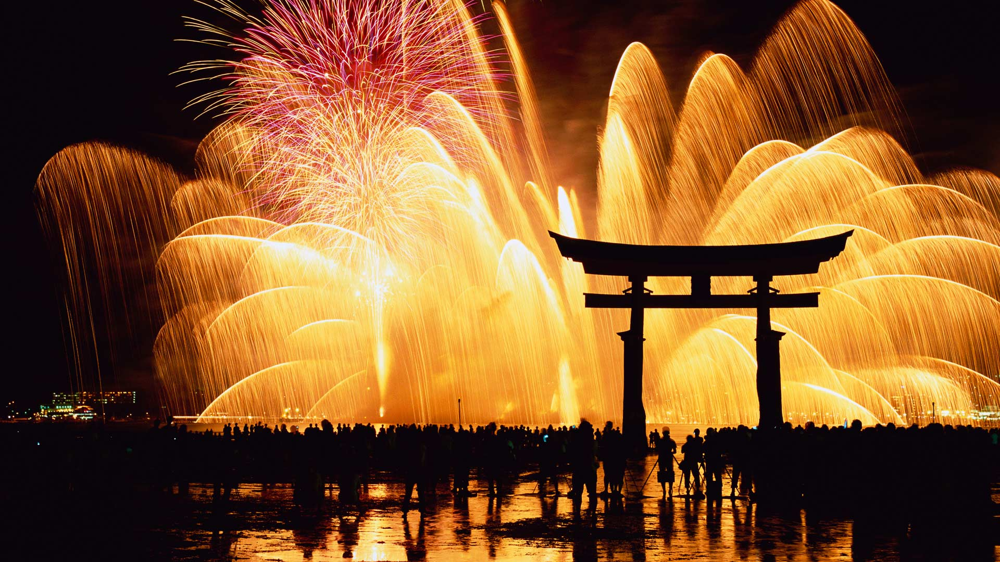
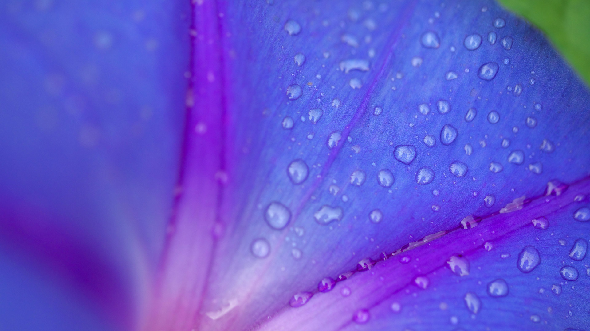
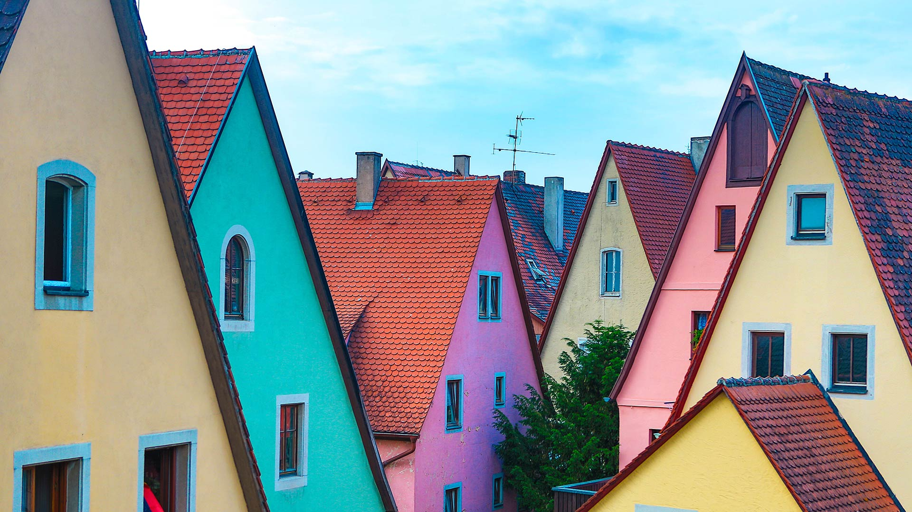
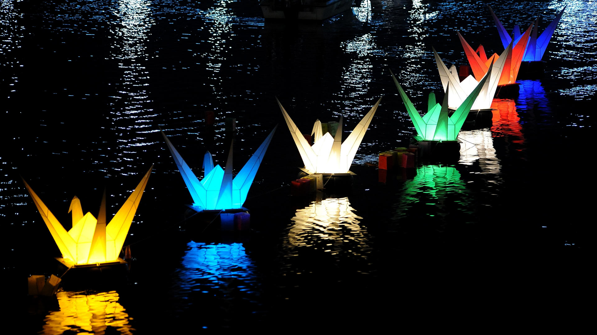

#### 20190831 Slacklining between giant boulders in Bishop, California, USA (© Evgeny Vasenev/Aurora Photos)(Bing United Kingdom)

#### 20190830 Schliersee, Bayern, Deutschland (© Rüdiger Hess/geo-select FotoArt)(Bing Deutschland)

#### 20190830 Hardee County Fair in Wauchula, Florida (© Oscar G. Davila/Getty Images)(Bing United States)

#### 20190830 Blackpool Pier and Tower illuminations, England (© Premium/UIG/Getty Images)(Bing United Kingdom)

#### 20190829 Blurred view of ride at the Canadian National Exhibition, Toronto (© Tetra Images LLC/Alamy Stock Photo)(Bing Canada)

#### 20190829 Porthmeor beach in St Ives, Cornwall, England (© Robert Harding World Imagery/Offset)(Bing United Kingdom)

#### 20190828 The Gardens of the Palazzo Corsini al Prato, Florence, Italy (© Will Perrett/Alamy)(Bing United Kingdom)

#### 20190827 Gharial野生动物保护区中的两只玫瑰环鹦鹉，印度中央邦 (© Pete Oxford/Minden Pictures)(Bing China)

#### 20190827 Anak Krakatoa volcano erupting off the coast of Sumatra, Indonesia (© Martin Rietze/Alamy)(Bing United Kingdom)

#### 20190826 Royal Albert Hall during the annual BBC Proms festival in London (© Oli Scarff/Getty Images)(Bing United Kingdom)

#### 20190825 Winnats Pass in the Peak District of Derbyshire, England (© Christopher Drabble/Alamy)(Bing United Kingdom)

#### 20190825 ｢宮島水中花火大会｣広島, 嚴島 (© Robert Essel NYC/Getty Images)(Bing Japan)

#### 20190825 Satellite image of the Burning Man festival in Black Rock City, Nevada (© DigitalGlobe/ScapeWare3d/Getty Images)(Bing United States)

#### 20190824 ｢朝顔｣ (© Aflo Co. Ltd./Alamy Stock Photo)(Bing Japan)

#### 20190824 Brown bears in Katmai National Park, Alaska, USA (© imageBROKER/SuperStock)(Bing United Kingdom)

#### 20190823 Farmland in the Palouse, Washington, USA  (© Art Wolfe/Getty Images)(Bing United Kingdom)

#### 20190822 Soft Coral (Ellisella sp) in the Great Barrier Reef, Australia (© Gary Bell/Oceanwide/Minden Pictures)(Bing Australia)

#### 20190822 The Dubai Fountain in Burj Lake taken from the Burj Khalifa in Dubai (© Eli Asenova/Getty Images)(Bing United Kingdom)

#### 20190821 Wildebeest herd crossing the Mara River between Kenya and Tanzania (© zhengvision/Getty Images)(Bing United Kingdom)

#### 20190820 Cave interior at Magdalen Islands, Que. (© Virginie Fréchette/Getty Images)(Bing Canada)

#### 20190820 Muje-Oulu Lake in eastern Finland (© Topi Ylä-Mononen/plainpicture)(Bing United Kingdom)

#### 20190819 Replica of the Wright Flyer undergoing aerodynamic tests at NASA\'s Langley Research Center, Virginia (© Chuck Thomas/Science Photo Library)(Bing United States)

#### 20190819 The interior of the historic Mortlock Library, in the State Library of South Australia, Adelaide (© Ray Warren Creative/Alamy Stock Photo)(Bing Australia)

#### 20190819 Lake Feringasee, near Unterföhring, Munich, Germany (© Westend61/Getty Images)(Bing United Kingdom)

#### 20190818 Tidal pools of Leça da Palmeira, Portugal (© Fernando Guerra/age fotostock)(Bing United Kingdom)

#### 20190817 Bees drinking nectar (© Angela Parker/Offset)(Bing United Kingdom)

#### 20190816 Yukon River viewed from the Midnight Dome, Dawson City, Yukon, Canada (© Robert Postma/Getty Images)(Bing United Kingdom)

#### 20190815 Fishing huts in Smögen, Sweden (© Martin Wahlborg/Getty Images Plus)(Bing United Kingdom)

#### 20190814 Male and female Ecuadorian horned anoles in Mindo, Ecuador, South America (© James Christensen/Minden Pictures)(Bing United Kingdom)

#### 20190813 Mars Express image of the icy cap at Mars’ south pole (© ESA/DLR/FU Berlin/Bill Dunford)(Bing United Kingdom)

#### 20190812 Bunte Häuserfassaden in Rothenburg ob der Tauber, Bayern, Deutschland (© Prisma by Dukas Presseagentur GmbH/Alamy Stock Photo)(Bing Deutschland)

#### 20190812 ｢エベレスト・ベースキャンプ｣ネパール, エベレスト (© David Noyes/Danita Delimont)(Bing Japan)

#### 20190812 Elephants in the Amboseli National Park, Kenya (© Adam Bannister/Offset)(Bing United Kingdom)

#### 20190811 A thunderstorm rolls across Theodore Roosevelt National Park in North Dakota, USA (© Judith Zimmerman/Danita Delimont)(Bing United Kingdom)

#### 20190811 Thousands of runners take part in the annual City2Surf road race on August 12, 2018 (© PETER PARKS/AFP/Getty Images)(Bing Australia)

#### 20190810 Seville, Spain’s Guadalquivir River and Triana Bridge (© Zu Sanchez Photography/Getty Images)(Bing United Kingdom)

#### 20190810 Abstract motion blur of aspen trees in Kluane National Park, Yukon (© Don Paulson/Jaynes Gallery/Danita Delimont)(Bing Canada)

#### 20190809 ｢ヨーロッパオオヤマネコ｣チェコ, ボヘミア＝モラヴィア高地 (© sduben/Getty Images Plus)(Bing Japan)

#### 20190809 The Supertree Grove in Singapore\'s Gardens by the Bay (© John Warburton-Lee/Danita Delimont)(Bing United Kingdom)

#### 20190808 【今日七夕】 (© Martin Hale/Minden Pictures)(Bing China)

#### 20190808 Male leopard in Linyanti Wildlife Reserve, Botswana (© Karine Aigner/Tandem Stills + Motion)(Bing United Kingdom)

#### 20190807 Cape Neddick Light in York, Maine (© Haizhan Zheng/Getty Images)(Bing United States)

#### 20190807 ｢折り鶴の灯篭｣広島, 元安川 (© David Mareuil/Anadolu Agency/Getty Images)(Bing Japan)

#### 20190807 View of the Milky Way from the Great Ocean Road, Victoria, Australia (© idizimage/iStock/Getty Images Plus)(Bing United Kingdom)

#### 20190806 White storks at Los Barruecos Natural Monument, Caceres, Spain (© Wild Wonders of Europe/Widstrand/Minden Pictures)(Bing United Kingdom)

#### 20190805 Deckchairs on Hastings Pier, East Sussex, England (© ams images/Alamy)(Bing United Kingdom)

#### 20190805 ｢スタージス・モーターサイクル・ラリー｣米国サウスダコタ州, バッドランズ国立公園 (© David Zimmerman/Masterfile)(Bing Japan)

#### 20190805 Kayaker exploring sandstone sea caves in Apostle Islands National Lakeshore near Bayfield, Wisconsin (© Chuck Haney/Danita Delimont)(Bing United States)

#### 20190804 Swift fox pups in Grasslands National Park near Val Marie in Saskatchewan, Canada (© John E Marriott/age fotostock)(Bing United Kingdom)

#### 20190804 Vancouver’s first permanently rainbow coloured crosswalk in downtown Vancouver (© Maxvis/Getty Images)(Bing Canada)

#### 20190804 ｢ミツバチの巣｣ドイツ, ヴュルツブルク (© Heidi and Hans-Juergen Koch/Minden Pictures)(Bing Japan)

#### 20190803 Eurasian Eagle-Owl (Bubo bubo) in wildflower meadow, Rhineland-Palatinate, Germany (© Rosl Roessner/Minden Pictures)(Bing United Kingdom)

#### 20190803 A humpback whale off the coast of Maui in Hawaii (© Design Pics/Danita Delimont)(Bing United States)

#### 20190802 Aerial view of the Washington Monument in Washington, DC (© NASA Photo/Alamy)(Bing United States)

#### 20190802 Reflections on Crummock Water in the Lake District, Cumbria, England (© Damian Harrison/Alamy)(Bing United Kingdom)

#### 20190801 The Dew Stone, part of the Stanza Stones trail, in Yorkshire (© Rebecca Cole/Alamy)(Bing United Kingdom)

#### 20190801 Hawaii Volcanoes National Park, Hawaii (© Grant Ordelheide/Tandem Stills + Motion)(Bing United States)

