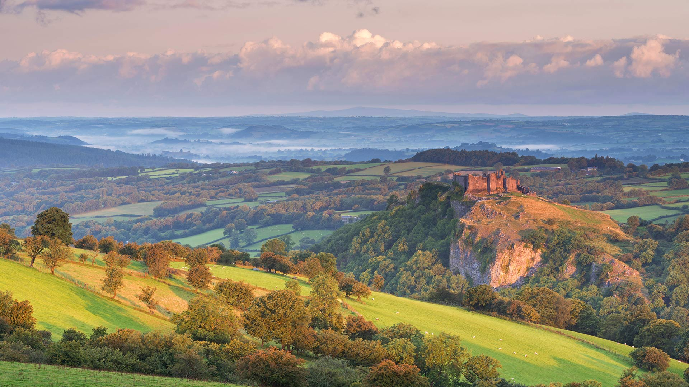
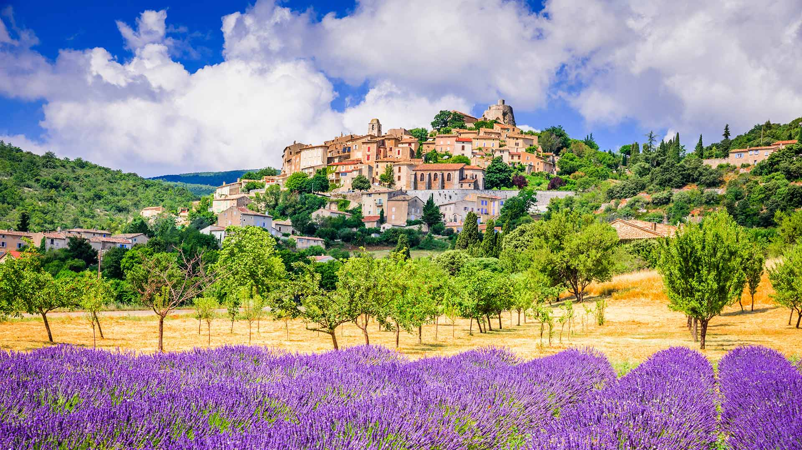
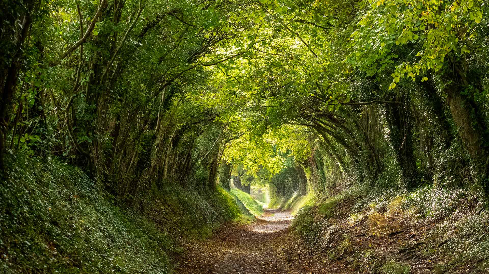
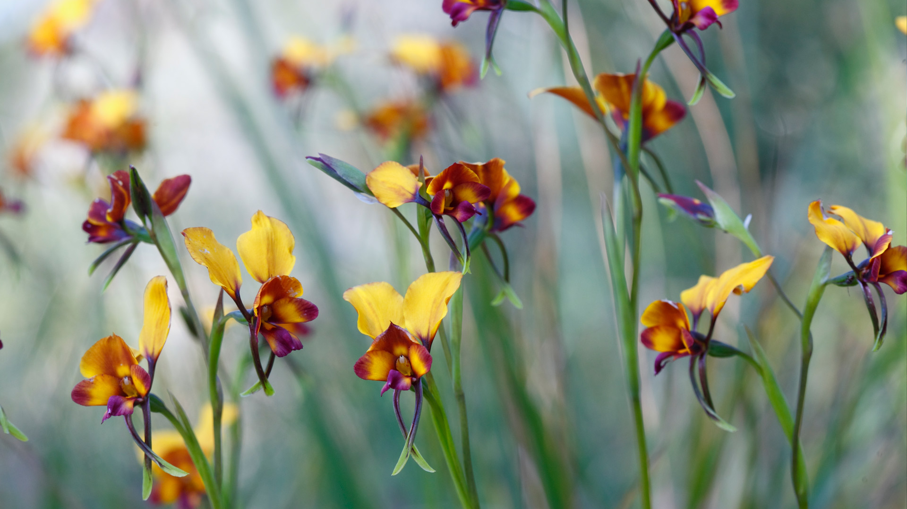

#### 20200531 Grey wolf with begging pup, Montana, USA (© Tim Fitzharris/Minden Pictures)(Bing United Kingdom)

#### 20200530 Santa Cruz River, Patagonia, Argentina (© Coolbiere Photograph/Getty Images)(Bing United Kingdom)

#### 20200529 Aerial view of Marley Beach, Bermuda (© Paul Zizka/plainpicture)(Bing United Kingdom)

#### 20200528 Carreg Cennen castle in the Brecon Beacons, Camarthenshire (© Adam Burton/Alamy Stock Photo)(Bing United Kingdom)

#### 20200527 Greenan Maze in County Wicklow, Ireland (© Peter Krocka/Shutterstock)(Bing United Kingdom)

#### 20200526 郁金香田鸟瞰图，德国萨克森-安哈尔特 (© Anke Scheibe/Westend61/offset by shutterstock)(Bing China)

#### 20200526 Village de Simiane-la-Rotonde et champ de lavande, en Provence (© SandyS/emicristea/Getty Images)(Bing France)

#### 20200526 Halnaker tree tunnel near Chichester, West Sussex (© Lois GoBe/Shutterstock)(Bing United Kingdom)

#### 20200525 Spring peeper (Hyla crucifer) perched on a black-eyed Susan in a flower garden in Ontario (© Don Johnston/Alamy Stock Photo)(Bing Canada)

#### 20200525 Pansy orchid (diuris magnifica) flowers in Kings Park, Perth (© Christian Ziegler/Minden Pictures)(Bing Australia)

#### 20200525 The long plumes of a three-flowered avens as it goes to seed (© Sunshine Haven Photo/Shutterstock)(Bing United Kingdom)

#### 20200525 The Freedom Wall at the World War II Memorial in Washington, DC (© John Roush II/Getty Images)(Bing United States)

#### 20200524 Aerial view of Everglades National Park, Florida, USA (© Tetra Images/Getty Images)(Bing United Kingdom)

#### 20200523 A male yellow-bellied slider (© Marko Markovic Photography/Shutterstock)(Bing United Kingdom)

#### 20200522 Reichenbach Falls, Bernese Oberland, Switzerland (© Chris Milne/Alamy)(Bing United Kingdom)

#### 20200521 Strolling the Biltmore, a painting by Jeff Hanson (© Jeff Hanson Art)(Bing United Kingdom)

#### 20200521 Vineyard in the Adelaide Hills region, Australia (© Ben Goode/iStock/Getty Images Plus)(Bing Australia)

#### 20200520 Moss-covered trees and ferns in a rainforest along Nile Creek, near Campbell River, B.C. (© Robert Postma/Plainpicture)(Bing Canada)

#### 20200520 Fields of lavender and sunflowers with beehives in Provence, France (© leoks/Shutterstock)(Bing United Kingdom)

#### 20200519 Roaring Fork in Great Smoky Mountains National Park, Tennessee (© Paul Hassell/Tandem Stills + Motion)(Bing United States)

#### 20200519 Formentor lighthouse at the tip of Cap de Formentor, Mallorca, Spain (© Lasse Eklöf/DEEPOL by plainpicture)(Bing United Kingdom)

#### 20200519 卡齐兰加国家公园的亚洲象群，印度阿萨姆邦 (© Parameswaran Pillai Karunakaran/Minden Pictures)(Bing China)

#### 20200518 National Museum of Qatar in Doha, Qatar (© Hasan Zaidi/Shutterstock)(Bing United Kingdom)

#### 20200518 Nachbau einer Leibniz-Rechenmaschine im Arithmeum, Bonn, Nordrhein-Westfalen, Deutschland (© WALTER BIBIKOW/DanitaDelimont.com)(Bing Deutschland)

#### 20200517 Fishing village of Henningsvær with Henningsvær Idrettslag Stadion, Nordland, Norway (© Viktor Posnov/Alamy)(Bing United Kingdom)

#### 20200517 南奥索峰的Lac d\'Ayous小屋，法国 (© Eneko Aldaz/Offset by Shutterstock)(Bing China)

#### 20200516 ‘Maple Leaf’ tulips In a garden in Ottawa (© Bao Le Dinh Quoc/Alamy Stock Photo)(Bing Canada)

#### 20200516 Bronze sculpture of child and his grandfather caring for plants and flowers, Cordoba, Spain (© David M G/Alamy)(Bing United Kingdom)

#### 20200516 US Air Force Thunderbirds perform over Hampton, Virginia (© gmeland/Shutterstock)(Bing United States)

#### 20200515 Grand Canyon and Colorado River from Toroweap Overlook, Arizona, USA  (© Matteo Colombo Travel Photo/Shutterstock)(Bing United Kingdom)

#### 20200514 Rice fields in the Sidemen Valley and Mount Agung, Bali, Indonesia (© Jon Arnold/Danita Delimont)(Bing United Kingdom)

#### 20200513 La Brenne的海鸥，法国 (© SandyS/Alamy)(Bing China)

#### 20200513 High angle view of Nant-y-Moch dam and reservoir, near Aberystwyth (© Jake Gardener/EyeEm/Getty Images)(Bing United Kingdom)

#### 20200513 Moose snacking on water lilies in Millinocket, Maine (© Scott Suriano/Getty Images)(Bing United States)

#### 20200512 Installation „Totems“ auf der Halde Haniel, Bottrop, Ruhrgebiet, Nordrhein-Westfalen, Deutschland (© Raimund Linke/Masterfile)(Bing Deutschland)

#### 20200512 Painted and leaded glass window panel at the Florence Nightingale Museum, London (© David Gee/Alamy)(Bing United Kingdom)

#### 20200512 Photo d\'une rue de Nantes, ornée de banderoles en hommage aux soignants fabriquées par les habitants, prise le 27 avril 2020 (© LOIC VENANCE/AFP via Getty Images)(Bing France)

#### 20200511 Roe deer (Capreolus capreolus) in meadow with poppies (© Arterra Picture Library/Alamy)(Bing United Kingdom)

#### 20200511 The Old Patriarch Tree of Grand Teton National Park, Wyoming (© George Sanker/Minden Pictures)(Bing United States)

#### 20200511 Carlton Gardens fountain and autumn trees catching the sunlight in front of the Royal Exhibition Building, Melbourne (© CBCK-Christine/iStock/Getty Images Plus)(Bing Australia)

#### 20200510 Burchell\'s zebra mother and foal in Rietvlei Nature Reserve, South Africa (© Richard Du Toit/Minden Pictures)(Bing United States)

#### 20200510 ｢カナダヅルの群れ｣米国ネブラスカ州, プラット川 (© Diana Robinson Photography/Getty Images)(Bing Japan)

#### 20200510 Pemaquid Point Light in Maine\'s Damariscotta region, USA (© Tom Whitney/Adobe Stock)(Bing United Kingdom)

#### 20200509 Barn owl sitting on a branch (© blickwinkel/Alamy)(Bing United Kingdom)

#### 20200508 Phare du Cap Fréhel sur la Côte d’Émeraude, Bretagne, France (© Stefan Hefele/mauritius images GmbH/Alamy Stock Photo)(Bing France)

#### 20200508 Crowds on the Champs-Élysées on 8 May 1945, Paris, France (© AFP via Getty Images)(Bing United Kingdom)

#### 20200507 Bluebonnets growing alongside an old road in the Texas Hill Country (© Inge Johnsson/Alamy)(Bing United States)

#### 20200507 Golden eagle flying over a field, Glenfeshie (© Blickwinkel/Alamy Stock Photo)(Bing United Kingdom)

#### 20200506 Inca fortress of Sacsayhuamán near Cusco, Peru (© Susanne Kremer/eStock Photo)(Bing United Kingdom)

#### 20200506 ｢大歩危峡のこいのぼり｣徳島県, 三好市 (© Photo by The Asahi Shimbun via Getty Images)(Bing Japan)

#### 20200505 An old lighthouse under the starry sky in Rose Blanche, Nfld. (© Adam Woodworth/Cavan)(Bing Canada)

#### 20200505 Male king eider ducks swimming in Troms og Finnmark, Norway (© Pal Hermansen/Minden Pictures)(Bing United Kingdom)

#### 20200504 Salar de Uyuni, Bolivia (© Ignacio Palacios/Getty Images)(Bing United Kingdom)

#### 20200504 ｢国会議事堂｣東京, 永田町 (© Sean Pavone/Alamy Stock Photo)(Bing Japan)

#### 20200503 An Australian koala perched in a gum tree overlooking the scenery (© juuce/Getty Images)(Bing Australia)

#### 20200503 Snowy owl at Long Island, New York, USA (© Vicki Jauron/Getty Images)(Bing United Kingdom)

#### 20200502 Ruins of a kasbah in Kalaat M\'Gouna, Morocco (© Leonid Andronov/Getty Images)(Bing United Kingdom)

#### 20200502 ｢富士山と茶畑｣静岡 (© Hiroshi Ichikawa/Shutterstock)(Bing Japan)

#### 20200502 Vue aérienne des marais de Bourges, France (© agustavop/iStock/Getty Images)(Bing France)

#### 20200501 Purple Saxifrage (Saxifraga oppositifolia) in bloom Bathurst Island, Nunavut (© Gerrtt Vyn/Minden Pictures)(Bing Canada)

#### 20200501 Sunrise at Llyn Padarn at Llanberis, Snowdonia National Park (© Helen Hotson/Alamy Stock Photo)(Bing United Kingdom)

#### 20200501 Rhododendrons and azaleas blooming around the Moon Bridge, Kubota Garden, Seattle, Washington (© Mary Liz Austin/Alamy)(Bing United States)

#### 20200501 Altdahn Castle near Dahn, Dahner Felsenland (Dahn Rockland), Palatinate Forest, Rhineland-Palatinate, Germany (© Reinhard Schmid/Huber/eStock Photo)(Bing Australia)

