#### 20200630 Frozen tarn, Cradle Mountain, Tasmania (© TED MEAD/Getty Images)(Bing Australia)

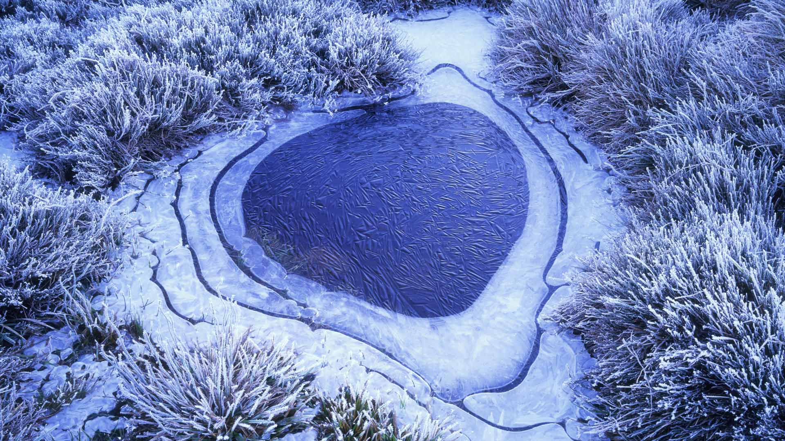

#### 20200630 ｢日の出ラベンダー園｣北海道, 上富良野町 (© DoctorEgg/Getty Images)(Bing Japan)

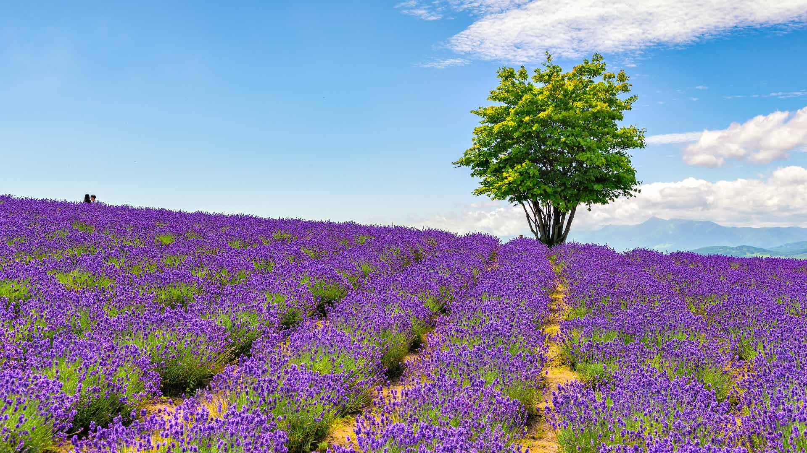

#### 20200630 The Bojo River in Cebu, Philippines (© Amazing Aerial Agency/Offset by Shutterstock)(Bing United Kingdom)

#### 20200630 Lever de soleil au-dessus des aiguilles de Bavella, Corse, France (© Infografick/iStock/Getty Images Plus)(Bing France)

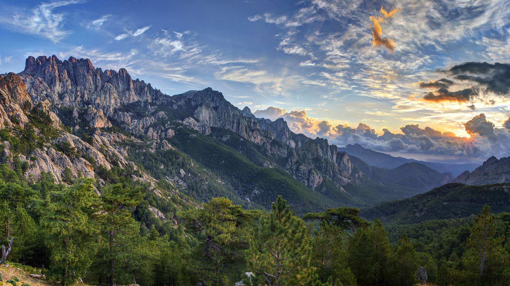

#### 20200629 The Empire State Building lit up in honor of Pride Week in 2014, New York City (© C. Taylor Crothers/Offset by Shutterstock)(Bing United States)

#### 20200629 Außenansicht der Behörde für Stadtentwicklung und Umwelt, Hamburg, Deutschland (© Liz Eve/Arcaid Images/Alamy Stock Photo)(Bing Deutschland)

#### 20200629 雾中的卡斯特诺城堡，法国佩里戈尔 (© Infografick/iStock/Getty Images Plus)(Bing China)

#### 20200629 Goats in an argan tree near Essaouira, Morocco (© Nizz/Shutterstock)(Bing United Kingdom)

#### 20200628 Cheetah cubs climbing acacia trees in Ngorongoro Conservation Area, Tanzania (© Paul Souders/Getty Images)(Bing United Kingdom)

#### 20200627 The Sanctuary of Madonna della Corona, near Verona, Italy (© Volodymyr Kalyniuk/Alamy)(Bing United Kingdom)

#### 20200626 【今日端午】 (© su_pei/iStock/Getty Images Plus)(Bing China)

#### 20200626 Grandidier\'s baobab forest near Morondava, Madagascar (© Thomas Marent/Minden Pictures)(Bing United Kingdom)

#### 20200625 Midsummer light captured at a lake near the city of Örebro, Sweden (© Anders Jorulf/Getty Images)(Bing United States)

#### 20200625 German Navy tall ship Gorch Fock in waters close to Reykjavík, Iceland (© DEEPOL by plainpicture/Henn Photography)(Bing United Kingdom)

#### 20200624 Path through Puzzlewood, Forest of Dean, Gloucestershire (© GuyBerresfordPhotography/iStock/Getty Images Plus)(Bing United Kingdom)

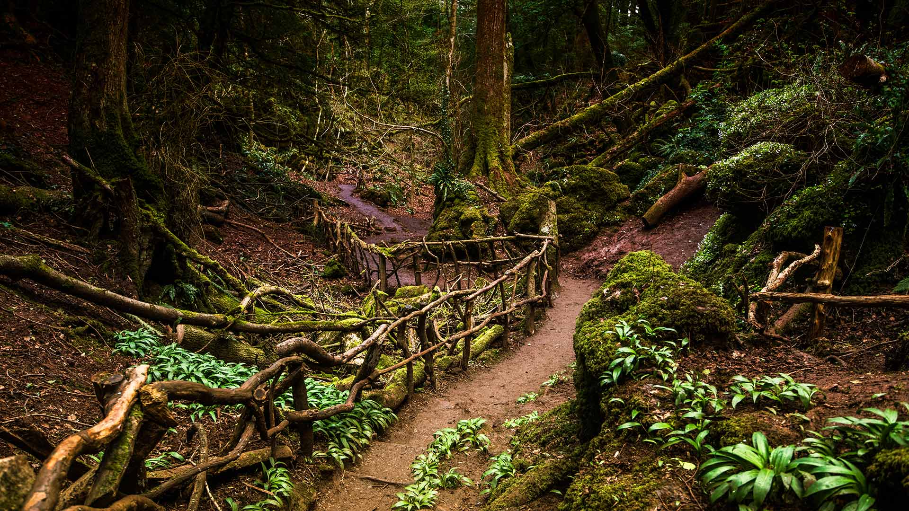

#### 20200623 Pyramid Lake in Jasper National Park, Alta. (© Peter Adams Photography Ltd/Alamy Stock Photo)(Bing Canada)

#### 20200623 Luftaufnahme der Insel Föhr, Schleswig-Holstein, Deutschland (© Holger Weitzel/imageBROKER/Alamy Stock Photo)(Bing Deutschland)

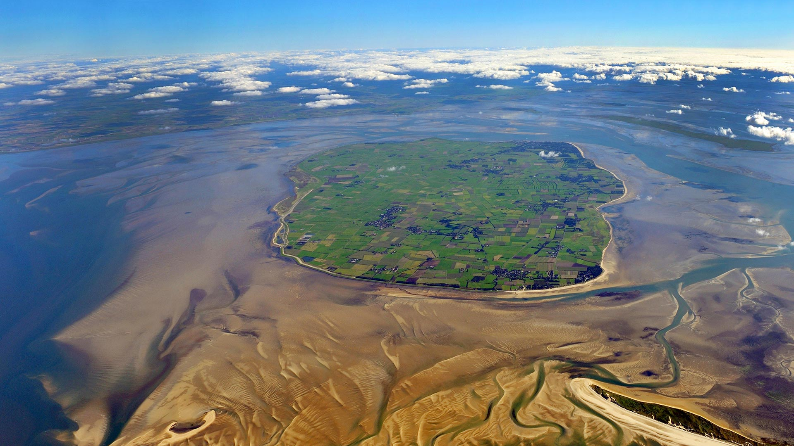

#### 20200623 Bull Point in Devon (© Robert Harding World Imagery/Offset by Shutterstock)(Bing United Kingdom)

#### 20200622 Male southern double-collared sunbird on rocket pincushion flower, Kirstenbosch Garden, Cape Town, South Africa (© Martin Willis/Minden Pictures)(Bing United Kingdom)

#### 20200622 Cattleman’s hut at Dinner Plain, Victoria (© Viewhillphoto/iStock/Getty Images Plus)(Bing Australia)

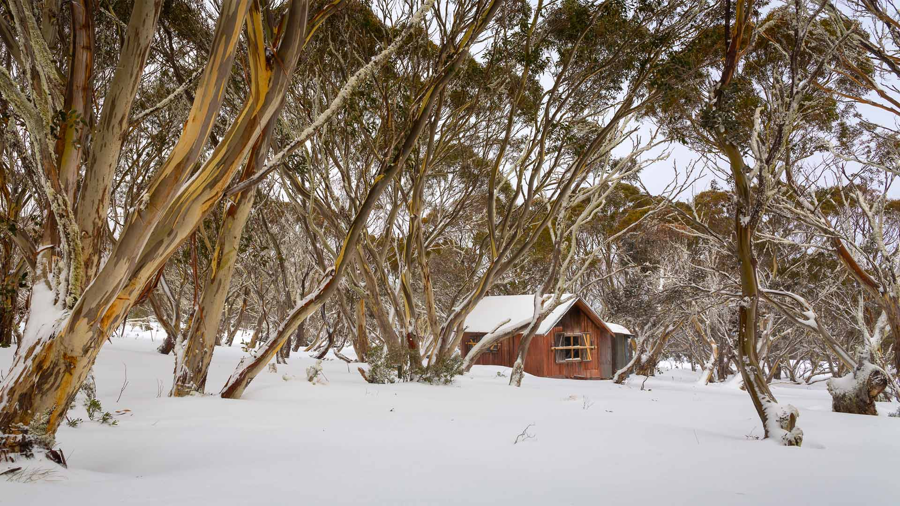

#### 20200621 正在捕猎的丛林猫，印度 (© Lila/Alamy)(Bing China)

#### 20200621 A bearded emperor tamarin monkey carrying a baby (© Chris White/iStock/Getty Images Plus)(Bing United Kingdom)

#### 20200620 Dawn breaks over the ancient Sarsen Stones at Avebury, Wiltshire, at Summer Solstice (© Terry Mathews/Alamy Stock Photo)(Bing United Kingdom)

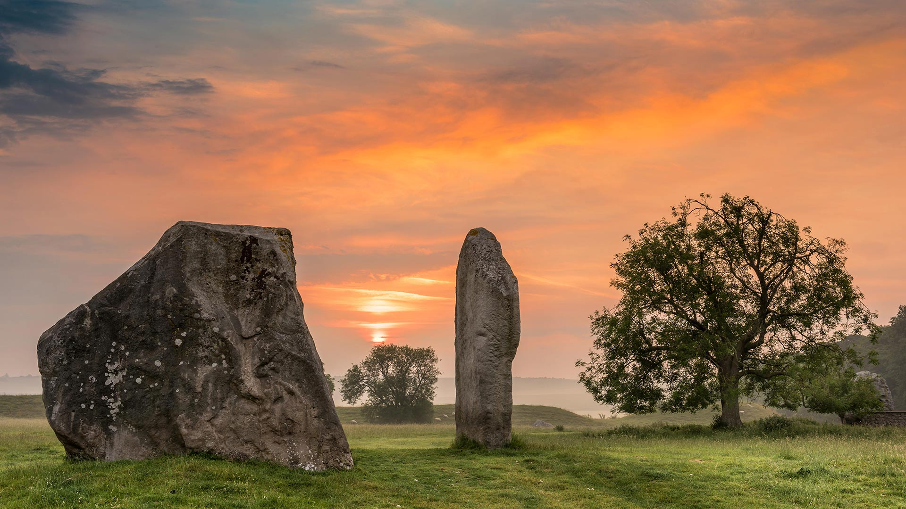

#### 20200620 Artist Saype\'s \'Beyond Walls\' installation in the Parc de la Grange, Geneva, Switzerland (© Valentin Flauraud/Shutterstock)(Bing United States)

#### 20200619 Santa Elena Canyon under the Milky Way in Big Bend National Park, Texas, USA (© Stanley Ford/Shutterstock)(Bing United Kingdom)

#### 20200619 The Texas African American History Memorial on the State Capitol grounds in Austin, Texas (© Moab Republic/Shutterstock)(Bing United States)

#### 20200619 Photographie de Charles de Gaulle au mémorial éponyme de Colombey les Deux Églises (© Alexandre MARCHI/Gamma-Rapho via Getty Images)(Bing France)

#### 20200618 Jabiru storks in the Pantanal of Brazil (© Juan-Carlos Munoz/Minden Pictures)(Bing United Kingdom)

#### 20200618 A snow-covered rocky cliff at Echo Point lookout, Katoomba, New South Wales  (© Andrew Merry/Getty Images)(Bing Australia)

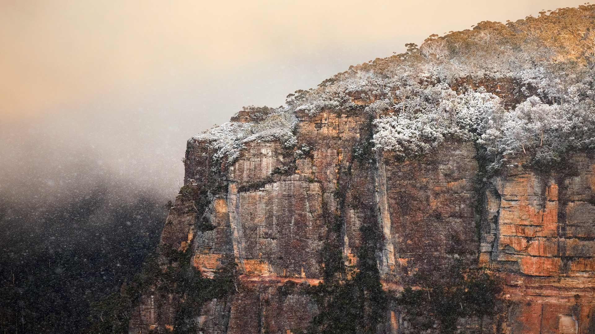

#### 20200617 Beaver Falls on Havasu Creek in the Grand Canyon, Arizona, USA (© Edwin Verin/Alamy)(Bing United Kingdom)

#### 20200616 St Stephen\'s Green in Dublin, Ireland (© L_E/Shutterstock)(Bing United Kingdom)

#### 20200616 Wendeltreppe im Leuchtturm Flügge auf der Insel Fehmarn, Schleswig-Holstein, Deutschland (© Raimund Linke/Masterfile)(Bing Deutschland)

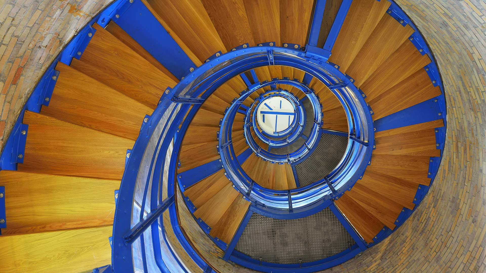

#### 20200615 Surfer walking between palm trees in Medewi, Bali, Indonesia (© helivideo/GettyImages)(Bing United Kingdom)

#### 20200615 Oliviers et coquelicots dans le parc naturel régional du Luberon (© Hemis/Alamy)(Bing France)

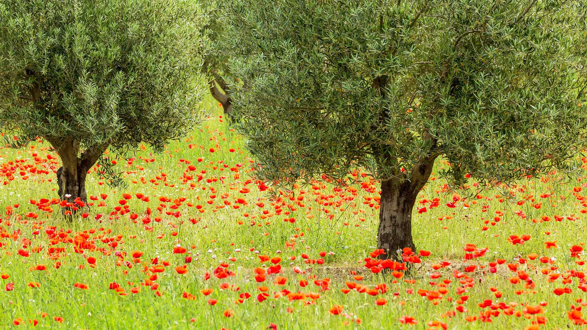

#### 20200615 Melaleuca trees in a stream after cyclonic rainfall, Western Australia (© Ted Mead/Getty Images)(Bing Australia)

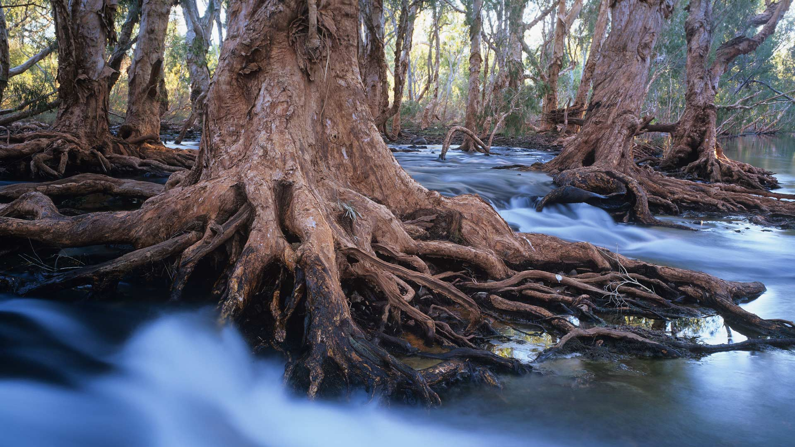

#### 20200614 US Flag Plaza at Liberty State Park in Jersey City, New Jersey (© Antonino Bartuccio/eStock Photo)(Bing United States)

#### 20200614 Baron Lake in the Sawtooth Wilderness in Idaho, USA (© Patrick Brandenburg/Tandem Stills + Motion)(Bing United Kingdom)

#### 20200613 The Dourbie Gorge in Grands Causses Natural Regional Park, Occitanie, France (© Hemis/Alamy)(Bing United Kingdom)

#### 20200612 Portree before sunset, Isle of Skye (© zhuzhu/iStock/Getty Images Plus)(Bing United Kingdom)

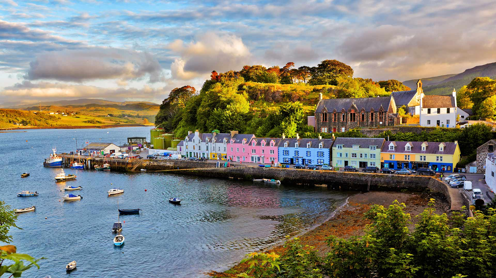

#### 20200612 ｢明月院｣神奈川, 鎌倉 (© Aflo Relax/Masterfile)(Bing Japan)

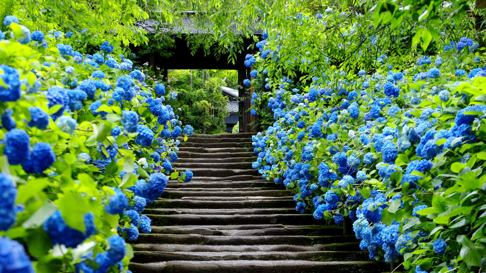

#### 20200611 Griboyedov Canal and the Church of the Savior on Spilled Blood in Saint Petersburg, Russia (© Tomas Sereda/Getty Images)(Bing United Kingdom)

#### 20200610 Millennium Bridge and St Paul\'s Cathedral, London (© Scott Baldock/Getty Images)(Bing United Kingdom)

#### 20200609 Sunrise at the chalk pinnacles of Old Harry Rocks, near Studland, Dorset (© Graham Hunt/Alamy Stock Photo)(Bing United Kingdom)

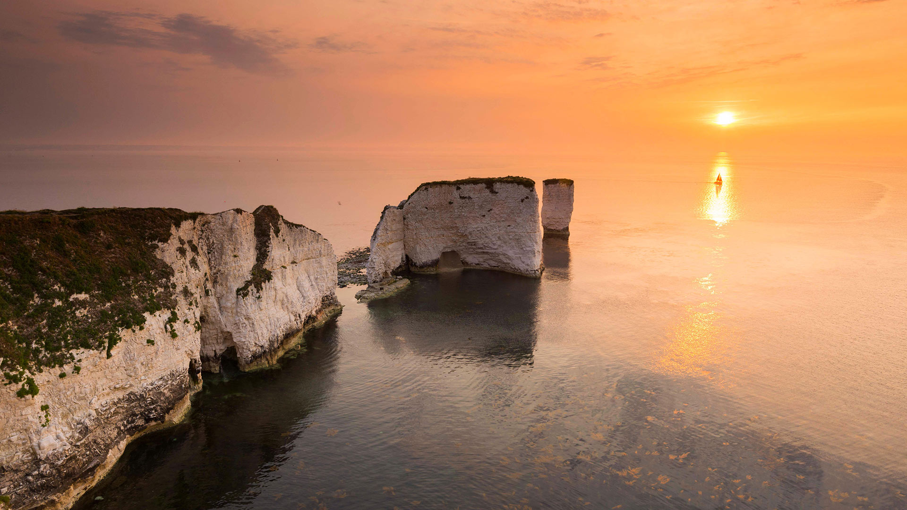

#### 20200608 Pfahlbaumuseum in Unteruhldingen, Baden-Württemberg, Deutschland (© Reinhard Schmid/Huber/eStock Photo)(Bing Deutschland)

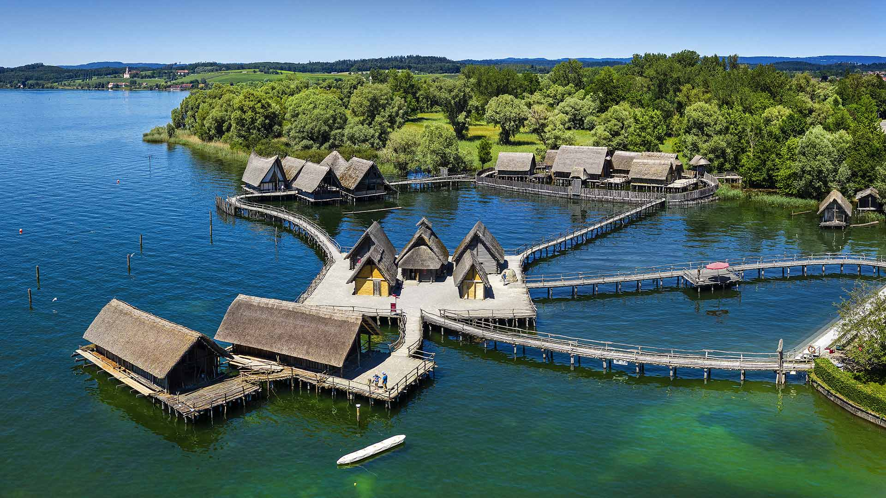

#### 20200608 Galápagos sea lion off the shore of Fernandina Island, Galápagos Islands, Ecuador (© Tui De Roy/Minden Pictures)(Bing United Kingdom)

#### 20200607 Hermitage of La Pertusa, Lleida province, Spain (© bbsferrari/Getty Images)(Bing United Kingdom)

#### 20200606 Walter\'s Wiggles trail in Zion National Park, Utah, USA (© Dennis Frates/Alamy)(Bing United Kingdom)

#### 20200606 Opal Range surrounded by fog, Kananaskis Country, Alberta (© Tim Fitzharris/Minden Pictures)(Bing Canada)

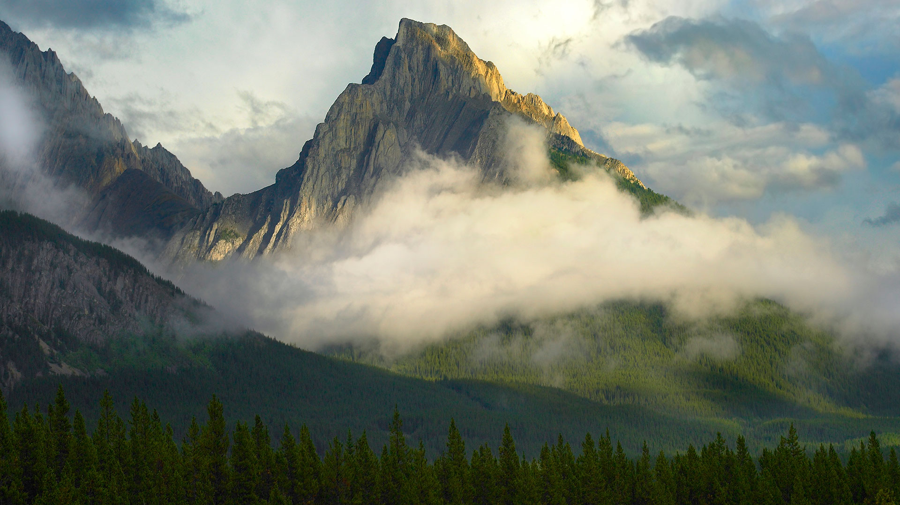

#### 20200605 Synchronous fireflies illuminate the forests of Great Smoky Mountains National Park, Tennessee, USA (© Floris van Breugel/Minden Pictures)(Bing United Kingdom)

#### 20200605 Luftaufnahme des Olympiabergs im Olympiapark in München, Bayern, Deutschland (© Michael Malorny/Westend61/offset by shutterstock)(Bing Deutschland)

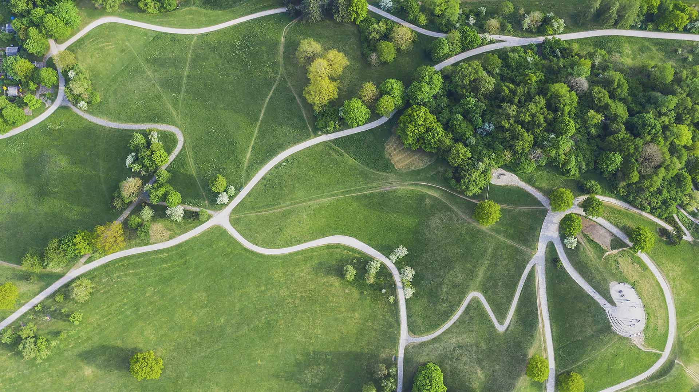

#### 20200605 ｢森の中のホタル｣岡山, 岡山市 (© Trevor Williams/Getty Images.)(Bing Japan)

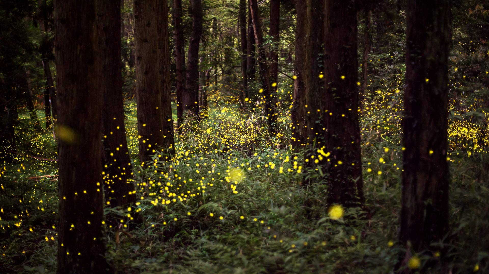

#### 20200604 Pont Fawr and Tu Hwnt I’r Bont in Llanrwst (© Pajor Pawel/Shutterstock)(Bing United Kingdom)

#### 20200604 Beautiful sunset in Blue Mountains National Park, Australia (© Leelakajonkij/Getty Images)(Bing Australia)

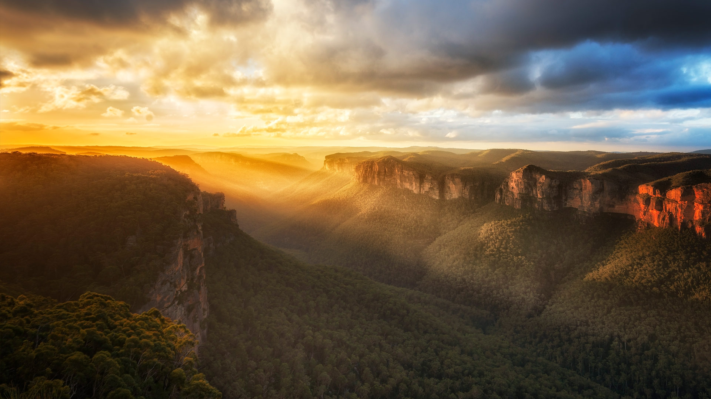

#### 20200603 Two mountain bike riders in Canyonlands National Park, Utah, USA (© Grant Ordelheide/Tandem Stills + Motion)(Bing United Kingdom)

#### 20200603 View of a waterfall at Mystic Beach in Juan de Fuca Provincial Park, B.C. during dusk  (© DEEPOL/Plainpicture)(Bing Canada)

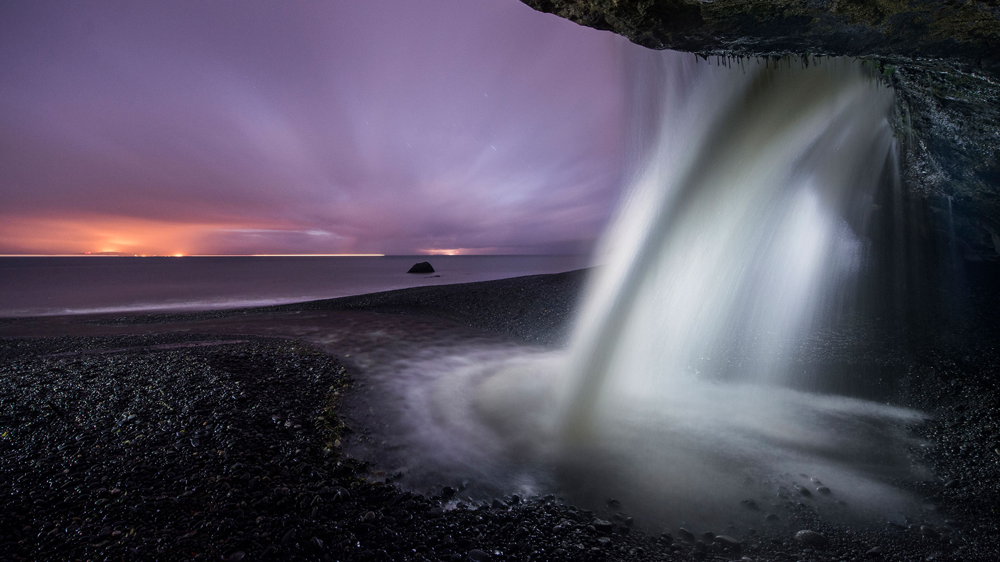

#### 20200602 Sunwapta Falls in Jasper National Park, Canada (© Schroptschop/Getty Images)(Bing United Kingdom)

#### 20200601 Great Barrier Reef, Queensland, Australia (© AWL Images/Danita Delimont)(Bing United Kingdom)

#### 20200601 Renardeaux roux, France (© Karl Van Ginderdeuren/Minden)(Bing France)

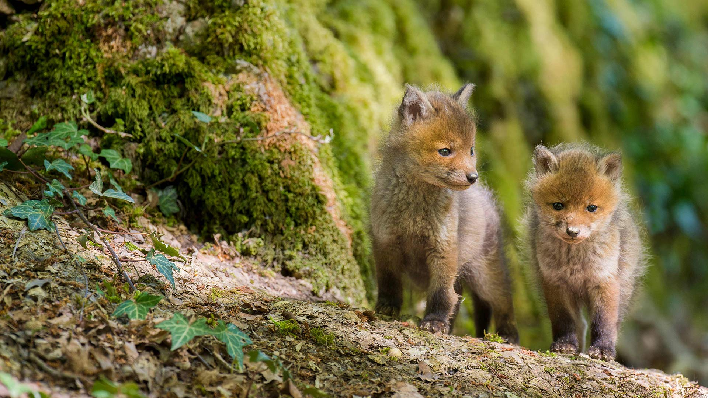

