#### 20200731 Sand Harbor, Lake Tahoe Nevada State Park, Nevada (© Mariusz Blach/Getty Images Plus)(Bing United States)

#### 20200731 A pathway through the dense woodland forest at Golden Ears Provincial Park, B.C. (© SibsUK/Shutterstock)(Bing Canada)

#### 20200731 Hot air balloons over Clifton Suspension Bridge at sunrise, Bristol (© Rich Jones Photography/Getty Images)(Bing United Kingdom)

#### 20200730 Hamerkop standing on a hippo, Mana Pools National Park, Zimbabwe (© David Fettes/Getty Images)(Bing United Kingdom)

#### 20200729 Kalsoy Island, part of the Faroe Islands (© Swen Stroop/Getty Images Plus)(Bing United Kingdom)

#### 20200729 Vue aérienne de bungalows sur l’île de Bora-Bora, Polynésie française (© Amazing Aerial Agency/Offset by Shutterstock)(Bing France)

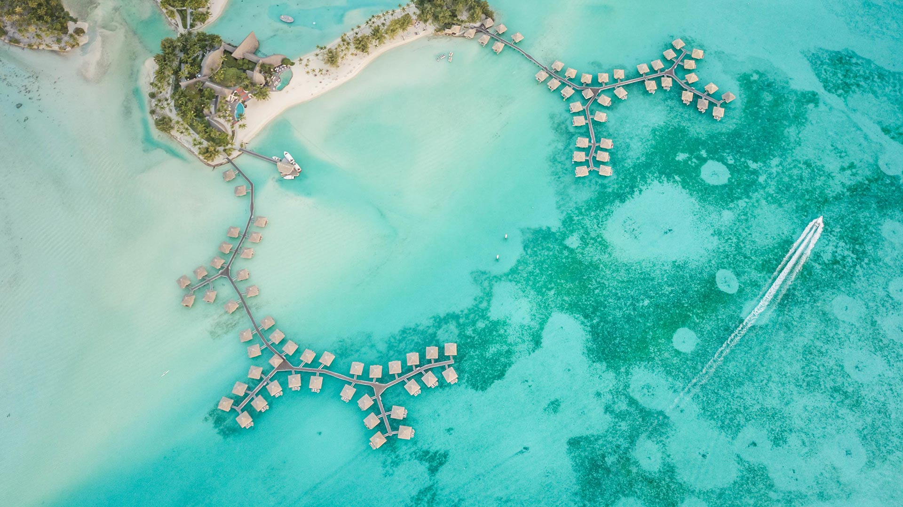

#### 20200728 Northern gannet (Morus bassanus) in flight, Troupe Head RSPB Reserve, Aberdeenshire (© Dave Pressland/Minden Pictures)(Bing United Kingdom)

#### 20200728 Natur-Informationszentrum Bergwelt Karwendel mit der Bergstation der Karwendelbahn und der Westlichen Karwendelspitze, Mittenwald, Bayern (© Reinhard Schmid/Huber/eStock Photo)(Bing Deutschland)

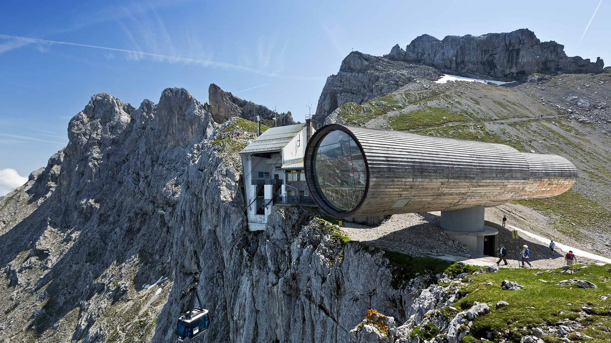

#### 20200727 云下的麦田，西班牙巴利亚多利德 (© Carlos Javier García Prieto/EyeEm/Getty Images)(Bing China)

#### 20200727 A numbat (Myrmecobius fasciatus) in Australia (© FRANS LANTING, MINT IMAGES/SCIENCE PHOTO LIBRARY)(Bing Australia)

#### 20200727 Vue panoramique de la cascade de Gavarnie dans les Pyrénées françaises (© Bartek Naprawa/Getty Images)(Bing France)

#### 20200727 The Allen Lambert Galleria in Brookfield Place, Toronto (© AWL Images/DanitaDelimont)(Bing Canada)

#### 20200727 Tamul waterfall in San Luis Potosí, Mexico (© Robert Harding World Imagery/Offset by Shutterstock)(Bing United Kingdom)

#### 20200726 Glacial turquoise water of Kicking Horse River, Yoho National Park, B.C. (© Oleg Charykov/Getty Imgaes)(Bing Canada)

#### 20200726 Hamelin Pool Marine Nature Reserve, Shark Bay, Australia (© Abstract Aerial Art/Getty Images)(Bing United Kingdom)

#### 20200726 Frank Gehry\'s BP Pedestrian Bridge connecting Millennium Park and Maggie Daley Park in Chicago (© Devon Neff/Shutterstock)(Bing United States)

#### 20200725 Disko Bay, Ilulissat, Greenland (© Kertu/Shutterstock)(Bing United Kingdom)

#### 20200724 Elephants at Kapama Private Game Reserve in South Africa (© Simon Eeman/Getty Images)(Bing United States)

#### 20200724 The Giant\'s Causeway, Bushmills, County Antrim (© Chiara Salvadori/Getty Images)(Bing United Kingdom)

#### 20200723 Sinwellturm der Kaiserburg, Nürnberg, Bayern (© Rüdiger Hess/geo-select FotoArt)(Bing Deutschland)

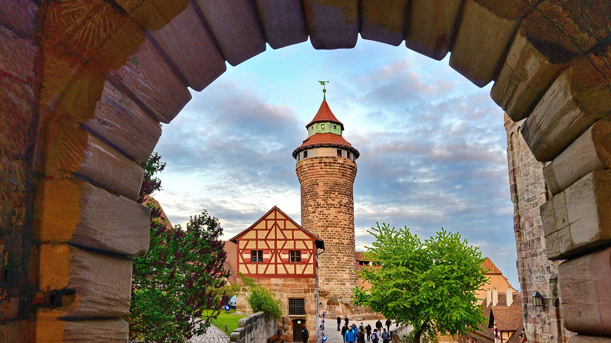

#### 20200723 Wooden doors and a stone path at the base of Fort Lovrijenac in Kolorina Bay, Dubrovnik (© Barbara Vallance/Getty Images)(Bing United Kingdom)

#### 20200723 Cradle Mountain, Tasmania, on a very cold morning (© Steve Daggar Photography/Getty Images)(Bing Australia)

#### 20200722 Blue wildebeest herd migrating at sunset, Maasai Mara Game Reserve, Kenya (© Denis-Huot/Minden Pictures)(Bing United Kingdom)

#### 20200721 Dinant and the River Meuse in Namur, Belgium (© Kadagan/Shutterstock)(Bing United Kingdom)

#### 20200720 The Earth rises over Mare Smythii on the Moon (© Image Science and Analysis Laboratory, NASA-Johnson Space Center)(Bing United Kingdom)

#### 20200719 「登別地獄谷」北海道, 登別 (© Sean Pavone/Shutterstock)(Bing Japan)

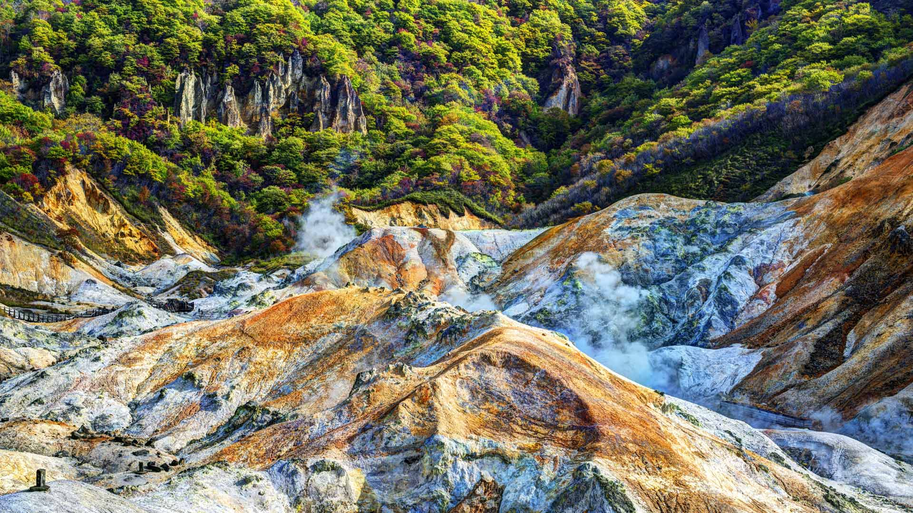

#### 20200719 The Grand Canal and Basilica di Santa Maria della Salute in Venice, Italy (© Jim Richardson/Offset by Shutterstock)(Bing United Kingdom)

#### 20200718 Nine-spotted moth in Switzerland (© Thomas Marent/Minden Pictures)(Bing United Kingdom)

#### 20200717 Hot air balloon with a smile (© Leonsbox/Getty Images Plus)(Bing United Kingdom)

#### 20200716 North Pacific humpback whale breaching in Alaska, USA (© Tony Wu/Minden Pictures)(Bing United Kingdom)

#### 20200715 The flooded crypt at Winchester Cathedral, Hampshire (© Oliver Hoffmann/Alamy)(Bing United Kingdom)

#### 20200714 ｢風鈴祭り」 (© chikaphotograph/Getty Images)(Bing Japan)

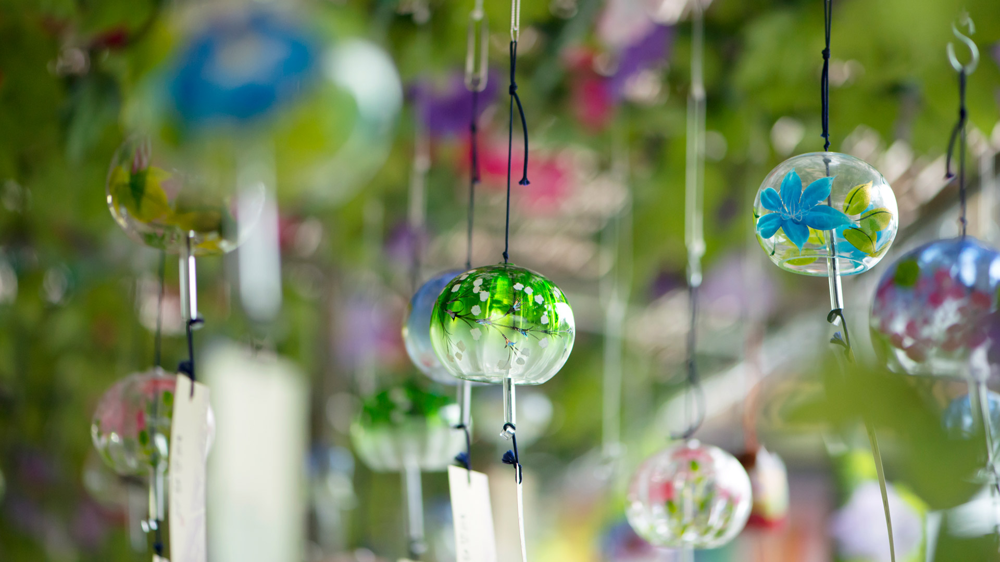

#### 20200714 The Panthéon in Paris, France (© manjik/Shutterstock)(Bing United Kingdom)

#### 20200714 Donau bei Geisingen, Baden-Württemberg (© plainpicture/Jochen Knobloch)(Bing Deutschland)

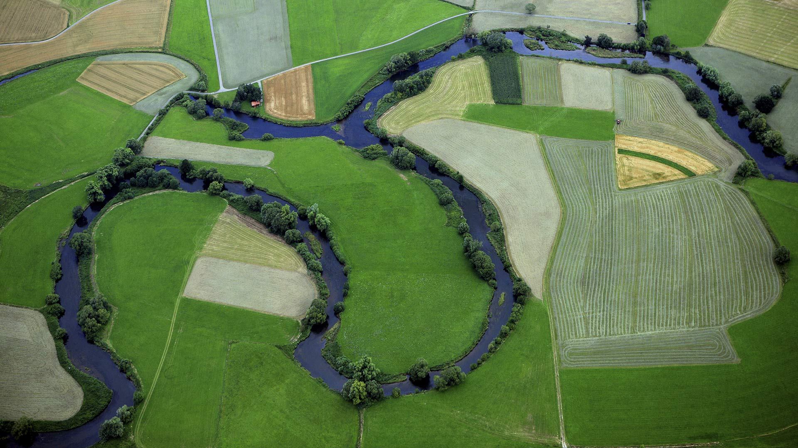

#### 20200713 Boats in Tollesbury Marina, Essex (© Geoffrey Robinson/Alamy Stock Photo)(Bing United Kingdom)

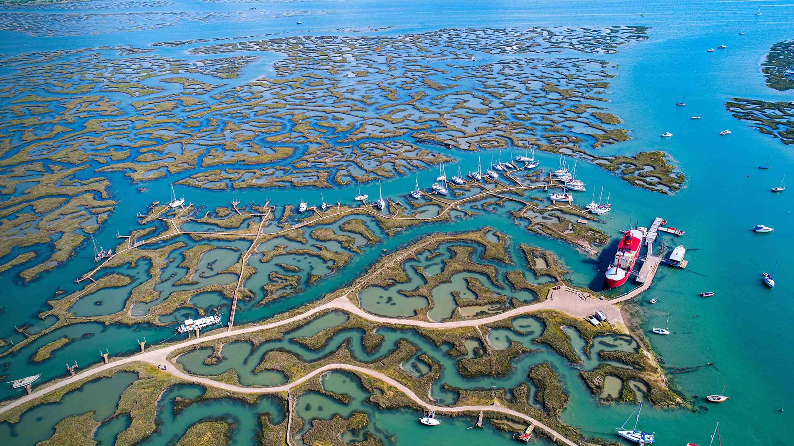

#### 20200713 The Hoh Rainforest in Olympic National Park, Washington state (© Jorge Romano/Offset by Shutterstock)(Bing United States)

#### 20200713 Milky Way over the Southern Ocean, Australia (© John White Photos/Getty Images)(Bing Australia)

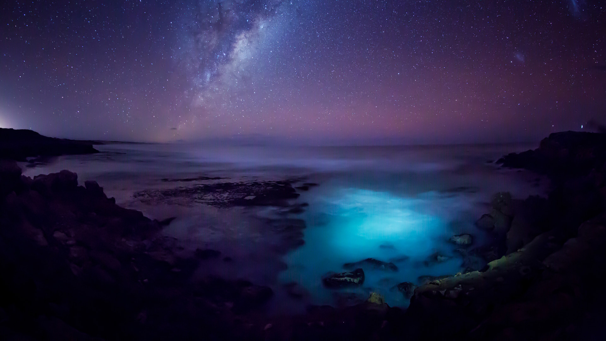

#### 20200713 Adult female Grizzly Bear (Ursus arctos horribilis) and cub feeding on sedges in Great Bear Rainforest, B.C. (© Jack Chapman/Minden Pictures)(Bing Canada)

#### 20200712 Water ripples on the surface of Ežezers Lake in the Latgale region, Latvia (© Eaglewood Films/Nimia)(Bing United Kingdom)

#### 20200711 Bàu Cá Cái mangrove forest in Quảng Ngãi Province, Vietnam (© Robert Harding World Imagery/Offset)(Bing United Kingdom)

#### 20200710 Soleil du soir sur le village perché de Speloncato en Corse (© joningall/iStock/Getty Images Plus)(Bing France)

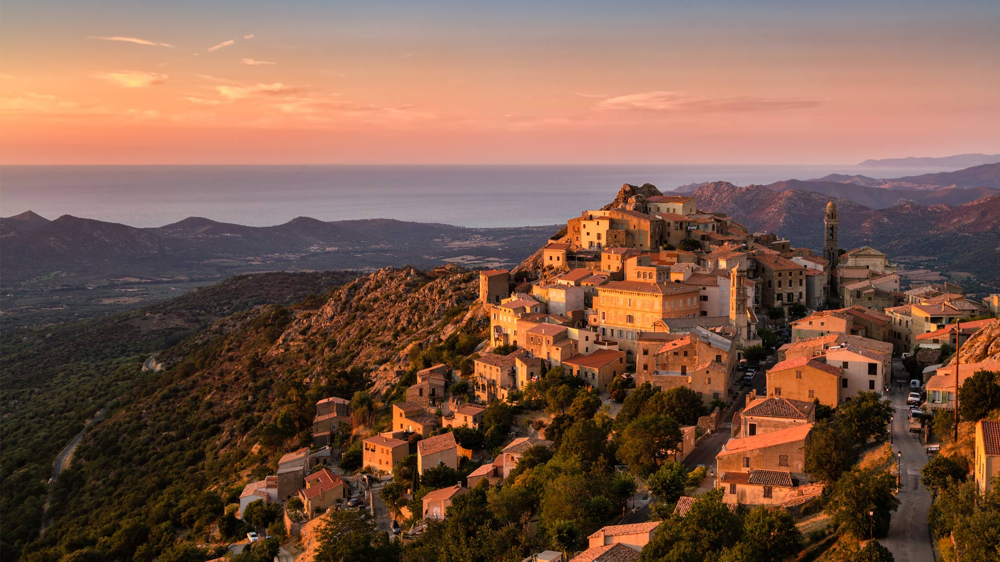

#### 20200710 The bell tower in Lake Reschen in South Tyrol, Italy (© Scacciamosche/Getty Images)(Bing United Kingdom)

#### 20200709 ｢青い朝顔｣ (© Elena Rostunova/Sutterstock)(Bing Japan)

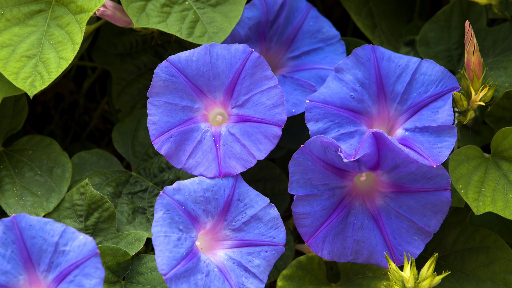

#### 20200709 American Basin in southern Colorado\'s San Juan Mountains (© Blaine Harrington III/Alamy)(Bing United States)

#### 20200709 Aber Falls in Snowdonia National Park, Gwynedd (© ValeryEgorov/iStock/Getty Images Plus)(Bing United Kingdom)

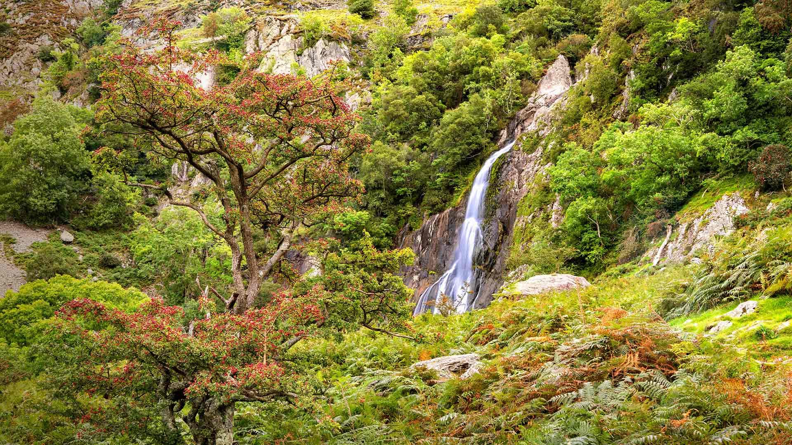

#### 20200708 Grey seal pup resting on a beach in Blakeney National Nature Reserve, Norfolk (© Kevin Sawford/Getty Images)(Bing United Kingdom)

#### 20200707 Kleiner Fuchs bei der Nektaraufnahme auf einem Sonnenhut, Niedersachsen (© Duncan Usher/Minden Pictures)(Bing Deutschland)

#### 20200707 Enhanced-colour composite of the Caloris Basin, Mercury (© Nasa/Johns Hopkins University Applied Physics Laboratory/Carnegie Institution of Washington)(Bing United Kingdom)

#### 20200706 Tolbachik volcanic complex on the Kamchatka Peninsula, Russia (© Egor Vlasov/Shutterstock)(Bing United Kingdom)

#### 20200705 Piscine naturelle au nord-est de Saint Barthélemy, mer des Caraïbes, Antilles françaises (© dbimages/Alamy banque d’images)(Bing France)

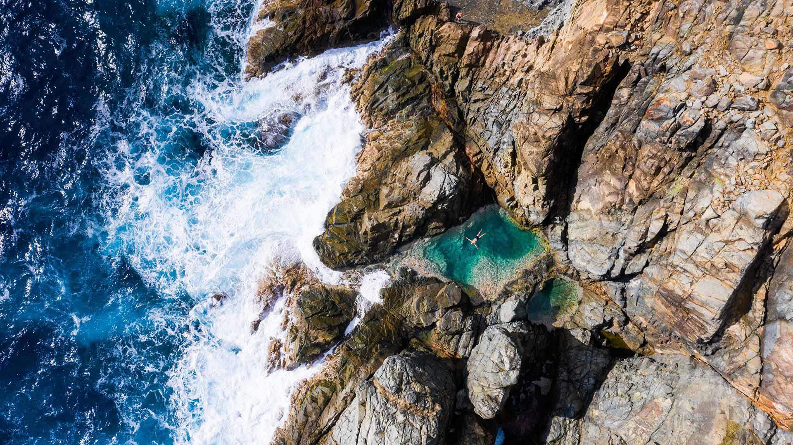

#### 20200705 Great Point Light on Nantucket Island, Massachusetts, USA (© Cate Brown/Cavan Images)(Bing United Kingdom)

#### 20200704 Wildflowers in Kettle River Recreation Area, British Columbia, Canada (© Debra Brash/plainpicture)(Bing United Kingdom)

#### 20200704 Boreal forest at Trans-Taiga Road region in Northern Quebec (© Posnov/Getty Images)(Bing Canada)

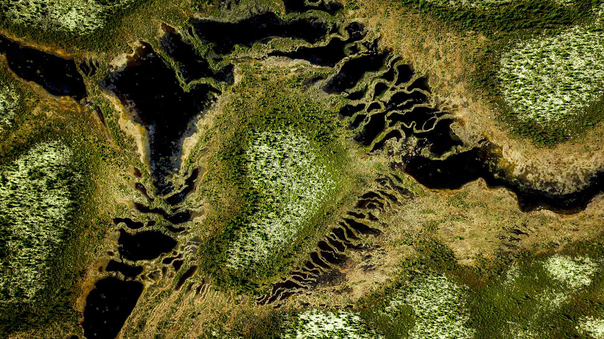

#### 20200704 Independence Day fireworks over the National Mall, Washington, DC (© Jon Bilous/Shutterstock)(Bing United States)

#### 20200703 Dove Lake, Hobart, Tasmania (© www.JamesPhotography.com.au/Getty Images)(Bing Australia)

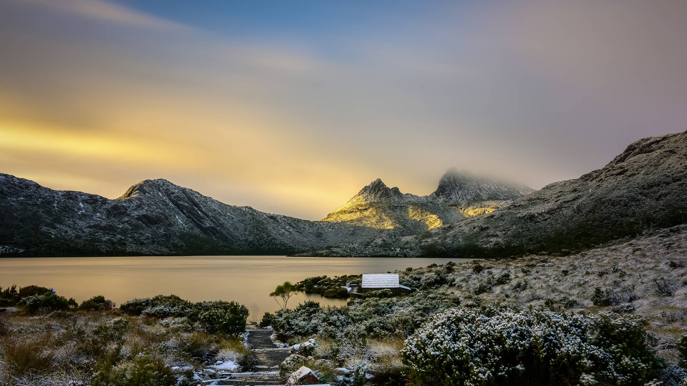

#### 20200703 Cape foxes in the Kalahari Desert in South Africa (© NSP-RF/Alamy)(Bing United Kingdom)

#### 20200702 Aerial view of the theatre at the ancient city of Hierapolis, near Pamukkale, Turkey (© Amazing Aerial Agency/Offset by Shutterstock)(Bing United Kingdom)

#### 20200701 Parliament Building in Ottawa at sunset (© Serega/Getty Images)(Bing Canada)

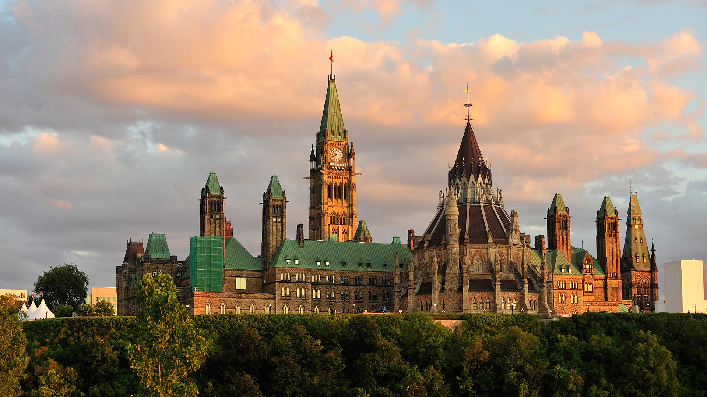

#### 20200701 Moraine Lake in Banff National Park, Alberta, Canada (© Schroptschop/Getty Images)(Bing United Kingdom)

