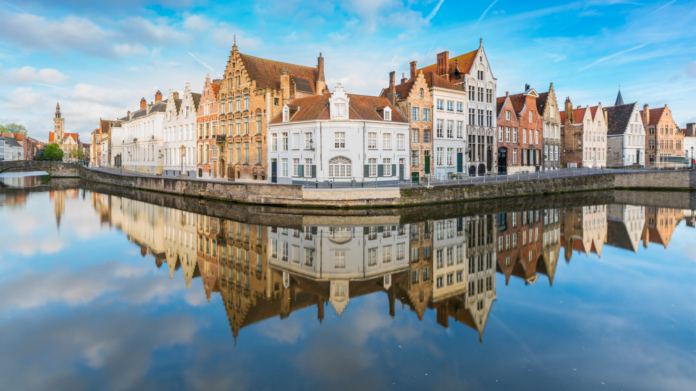
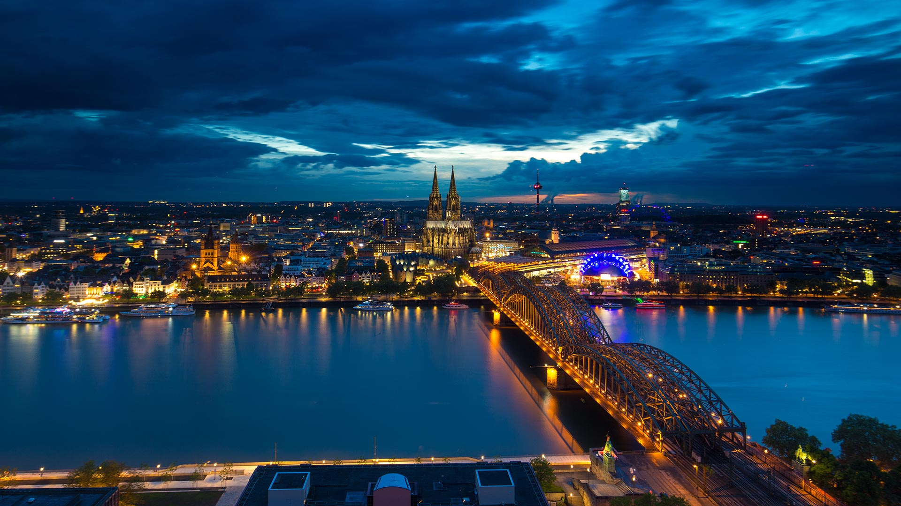
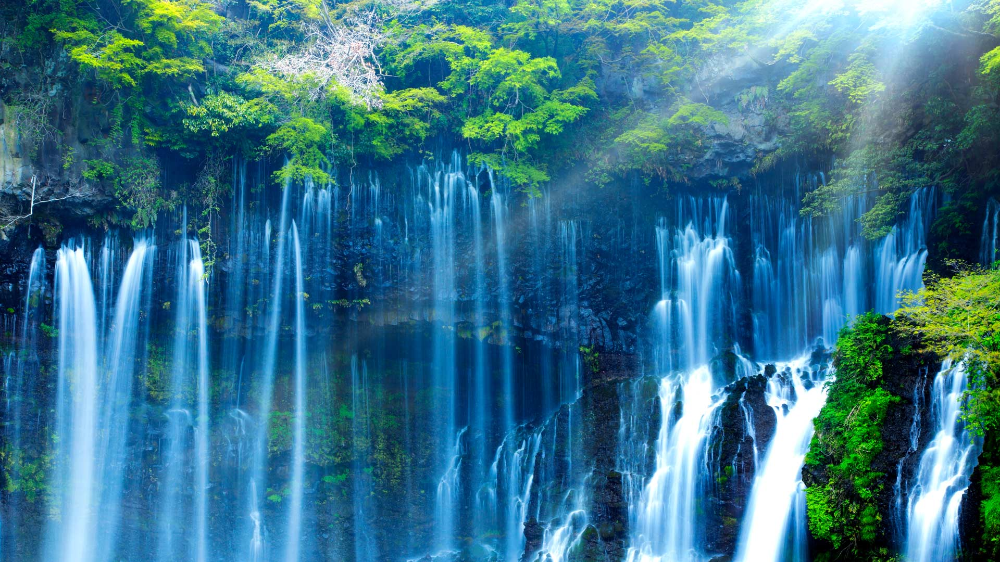
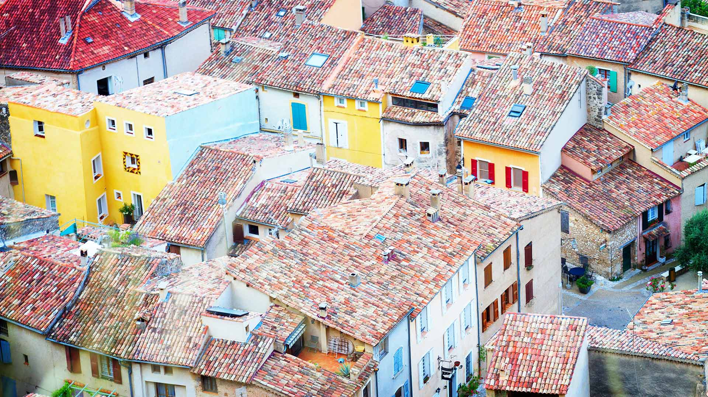
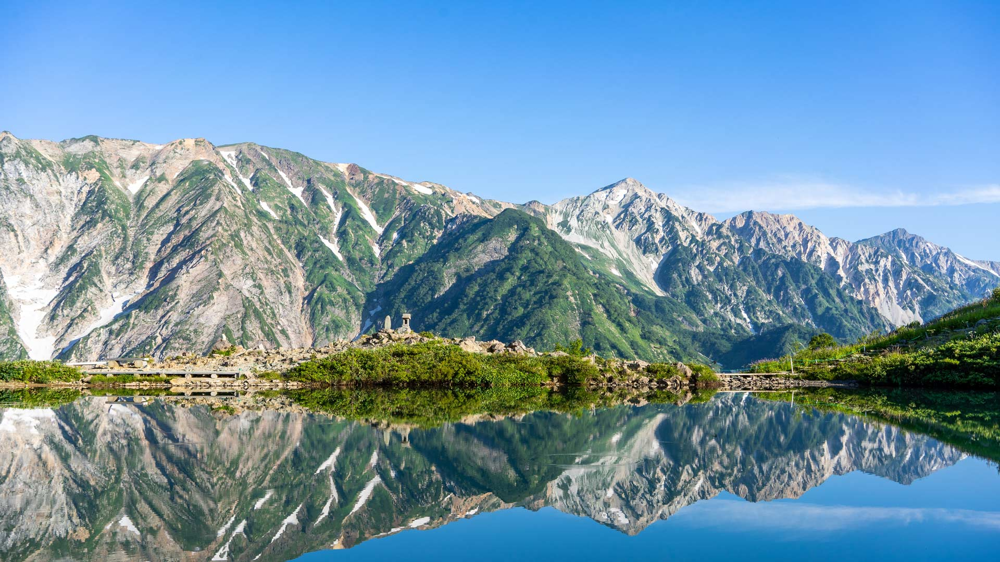
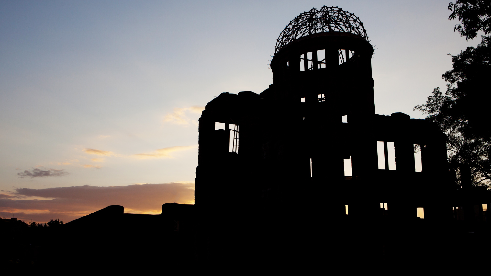
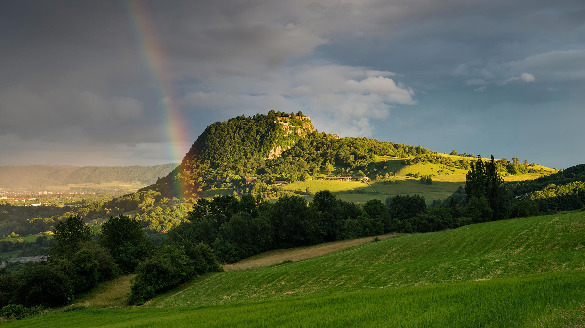
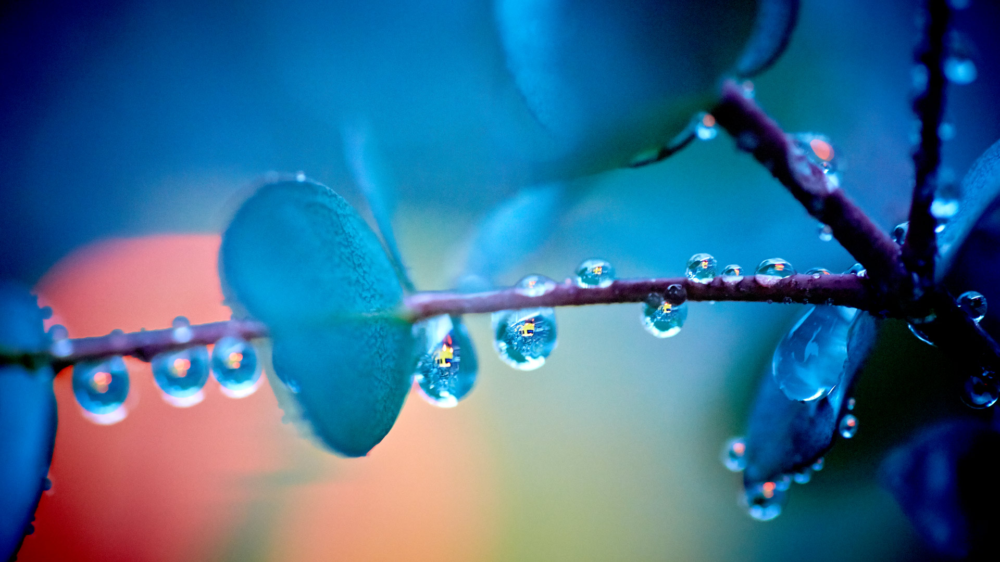

#### 20200831 Squirreltail Barley (Hordeum jubatum) field in Kluane National Park, Yukon (© Helge Schulz/Minden Pictures)(Bing Canada)

#### 20200831 Bâtiments se reflétant sur les canaux de Bruges, Belgique (© francesco vaninetti/robertharding)(Bing France)

#### 20200831 Sunlight piercing a forest in Garajonay National Park, La Gomera, Spain (© Martin Siepmann/Westend61/Offset by Shutterstock)(Bing United Kingdom)

#### 20200830 Hay bales in a field in Jutland, Denmark (© Nick Brundle Photography/Getty Images)(Bing United Kingdom)

#### 20200830 鸟瞰桑吉奈尔群岛，法国科西嘉 (© sam74100/Getty Images Plus)(Bing China)

#### 20200829 Bicycle sculptures at the Col d\'Aubisque, Hautes Pyrenees, France (© Fco. Javier Sobrino/age fotostock)(Bing United Kingdom)

#### 20200828 Château d\'If in Marseille, France (© Boris Stroujko/Shutterstock)(Bing United Kingdom)

#### 20200828 Nächtliche Ansicht der Stadt Köln, Nordrhein-Westfalen (© Tandem Stills + Motion)(Bing Deutschland)

#### 20200827 Sailing stone at Racetrack Playa in Death Valley National Park, California, USA (© Patrick Walsh/Getty Images)(Bing United Kingdom)

#### 20200826 ｢ジャイアントセコイア｣米国カリフォルニア州, キングズ・キャニオン国立公園 (© lucky-photographer/Getty Images)(Bing Japan)

#### 20200826 【今日七夕】Love locker on a red stripe hanging in a temple in Chengdu, China © Philippe LEJEANVRE/Getty Images(Bing China)

#### 20200826 Spotted Lake in the Okanagan region of British Columbia, Canada (© Galyna Andrushko/Shutterstock)(Bing United Kingdom)

#### 20200825 Zion National Park, Utah, USA (© pabradyphoto/Getty Images)(Bing United Kingdom)

#### 20200825 The Tasman Sea from Punakaiki on South Island, New Zealand (© Maurizio Rellini/Sime/eStock Photo)(Bing United States)

#### 20200825 Mt Wellington observation deck with views of Hobart city, Tasmania (© Tommy Atthi/Getty Images)(Bing Australia)

#### 20200825 Sunset at Bowen Island, B.C. (© Jason Wilde/Tandem Stills + Motion)(Bing Canada)

#### 20200824 The Caño Cristales river in the Serranía de la Macarena mountains of Colombia (© Jorge Iván Vásquez Cuartas/Getty Images)(Bing United Kingdom)

#### 20200823 Stars reflecting in Totensee, a mountain lake at Grimsel Pass, Kanton Bern, Switzerland (© magodevita/Getty Images)(Bing United Kingdom)

#### 20200822 Urquhart Castle and Loch Ness in the Scottish Highlands (© AWL Images/Danita Delimont)(Bing United Kingdom)

#### 20200822 ｢白糸の滝｣静岡, 富士宮市 (© SHOSEI/Aflo)(Bing Japan)

#### 20200822 巴伐利亚州Schrecksee湖的全景图，德国 (© wingmar/E+/Getty Images)(Bing China)

#### 20200822 Les toits de Moustiers-Sainte-Marie, Alpes-de-Haute-Provence, France (© Neirfy/Shutterstock)(Bing France)

#### 20200821 South Stack Lighthouse and coastal wildflowers at sunset, Anglesey (© Alan Novelli/Alamy Stock Photo)(Bing United Kingdom)

#### 20200821 Multicolored lobster buoys, Acadia National Park, Maine (© Cheri Alguire/Shutterstock)(Bing United States)

#### 20200820 A winding road by a glacial river in the Highlands of Iceland (© Kevin Krautgartner/Offset by Shutterstock)(Bing United Kingdom)

#### 20200819 A group of curious Emperor penguins in Antarctica (© Mint Images Limited/Alamy)(Bing United Kingdom)

#### 20200818 Tennessee Woman Suffrage Monument in Centennial Park, Nashville, Tennessee (© jejim120/Alamy)(Bing United States)

#### 20200818 Summerside waterfront in P.E.I. (© Vadim.Petrov/Shutterstock)(Bing Canada)

#### 20200818 Panoramic view of Lulworth Cove at sunset, Dorset (© Adrian Baker/Shutterstock)(Bing United Kingdom)

#### 20200818 Enlighten Canberra Festival 2012 at Questacon - National Science and Technology Centre, ACT (© Photoholgic/shutterstock)(Bing Australia)

#### 20200817 Borobudur in Central Java, Indonesia (© Oleh Slobodeniuk/Getty Images)(Bing United Kingdom)

#### 20200816 An adult burrowing owl emerges from its burrow at sunset in Davis, California, USA (© Neil Losin/Tandem Stills + Motion)(Bing United Kingdom)

#### 20200815 Young humpback whale giving its mother a hug off the coast of Tonga (© Biosphoto/Alamy)(Bing United Kingdom)

#### 20200815 Caves and coastal features at low tide on the Bay of Fundy, near St. Martins, New Brunswick, Canada (© Jamie Roach/Shutterstock)(Bing United States)

#### 20200814 Monument Valley Navajo Tribal Park, between Arizona and Utah, USA (© AWL Images/Danita Delimont)(Bing United Kingdom)

#### 20200813 浦那的黄胸织布鸟鸟巢，马哈拉施特拉邦 (© Samyak Kaninde/Alamy Stock Photo)(Bing China)

#### 20200813 Matera, Italy (© Marco Ilari/Getty Images)(Bing United States)

#### 20200813 Cavern in Pictured Rocks National Lakeshore on Lake Superior, Michigan, USA (© Kenneth Keifer/Getty Images)(Bing United Kingdom)

#### 20200813 Window arch at Loch Ard Gorge at dawn, Port Campbell National Park, Victoria (© David Noton/Minden Pictures)(Bing Australia)

#### 20200812 Fossil of a Tyrannosaurus rex skeleton (© Corbin17/Alamy)(Bing United Kingdom)

#### 20200811 ｢白馬三山と八方池｣長野, 白馬村 (© sayaka kishimoto/Getty Images)(Bing Japan)

#### 20200811 Bioluminescent sea fireflies along the shore of Okayama, Japan (© tdub_video/Getty Images)(Bing United Kingdom)

#### 20200810 Lion cubs hiding in tall grass in the Kalahari Desert, Botswana (© Jami Tarris/Getty Images)(Bing United Kingdom)

#### 20200809 Little owl (Athene noctua) perched on sunflower, Cádiz, Andalusia, Spain (© Andres M. Dominguez/Minden Pictures)(Bing United Kingdom)

#### 20200809 鸟瞰戈梅拉岛上管风琴形状的玄武岩，西班牙加那利群岛 (© Martin Siepmann/Image BROKER/Offset by Shutterstock)(Bing China)

#### 20200809 Lassen Peak in Lassen Volcanic National Park, California (© Engel Ching/Shutterstock)(Bing United States)

#### 20200808 Infinity Bridge in Stockton-on-Tees (© Robert Smith/Alamy)(Bing United Kingdom)

#### 20200807 通往海滩的木板路，德国叙尔特岛 (© Kerstin Bittner/Westend61/Offset by Shutterstock)(Bing China)

#### 20200807 Cribyn viewed from Pen y Fan, Brecon Beacons National Park, Powys (© Adam Burton/Alamy Stock Photo)(Bing United Kingdom)

#### 20200807 ｢夕暮れの原爆ドーム｣広島, 広島市 (© clumpner/Getty Images)(Bing Japan)

#### 20200806 Former lifeguard station on the island of Rügen, Mecklenburg-Western Pomerania, Germany (© DR pics/Shutterstock)(Bing United Kingdom)

#### 20200805 Oyster farm offshore from Notojima Island, Ishikawa Prefecture, Japan (© divedog/Shutterstock)(Bing United Kingdom)

#### 20200804 White-tailed doe and fawn in Wisconsin, USA (© Karel Bock/Shutterstock)(Bing United Kingdom)

#### 20200804 Blick auf den Hohentwiel im Hegau mit Regenbogen, Baden-Württemberg (© Westend61 GmbH/Alamy Stock Photo)(Bing Deutschland)

#### 20200803 Lightning storm in the Tortolita Mountain foothills, north of Tucson, Arizona, in the Sonoran Desert (© Jack Dykinga/Minden Pictures)(Bing United States)

#### 20200803 Aerial view of blue and white parasols on the coast of Rhodes, Greece (© Amazing Aerial Agency/Offset by Shutterstock)(Bing United Kingdom)

#### 20200802 ｢雨上がりのユーカリの木｣広島 (© AFROG DESIGN UNIT/Getty Images)(Bing Japan)

#### 20200802 Isola Bella, Lake Maggiore, Piedmont, Italy (© Massimo Ripani/eStock Photo)(Bing United Kingdom)

#### 20200802 Hollow Tree on Maits Rest Rainforest Walk, Great Otway National Park, Victoria (© Jamie Lamb - elusive-images.co.uk/Getty Images)(Bing Australia)

#### 20200801 Clusters of dark purple grapes hanging on a vine in Penticton, B.C. (© Design Pics/Offset)(Bing Canada)

#### 20200801 A lava flow hits water to create an explosion as a tourist boat passes, Hawaii Volcanoes National Park, USA  (© Patrick Kelley/Getty Images)(Bing United Kingdom)

