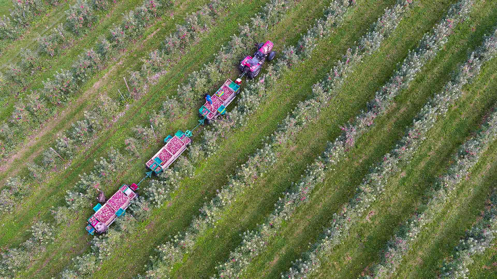
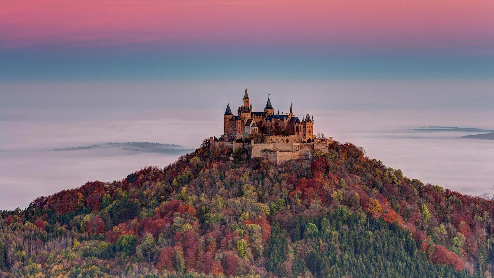
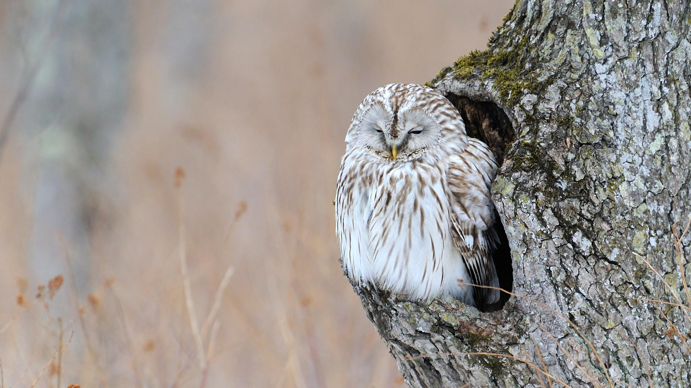
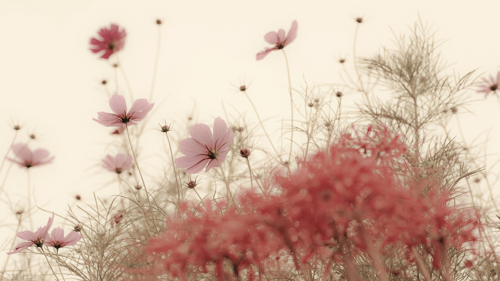
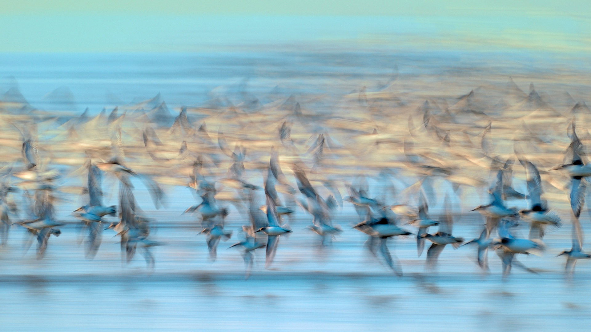
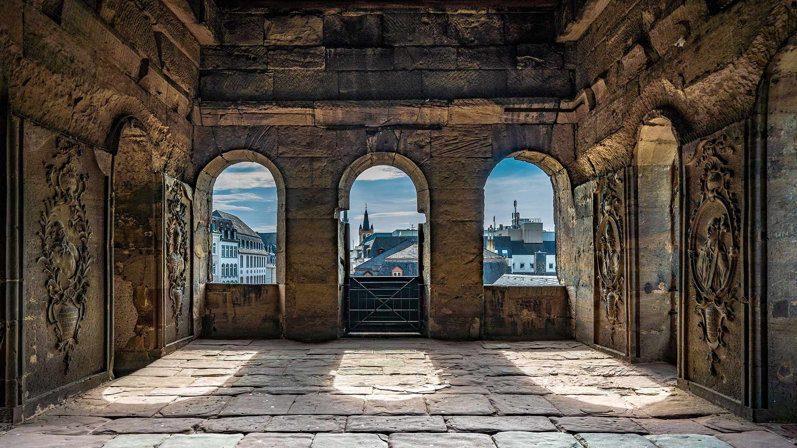
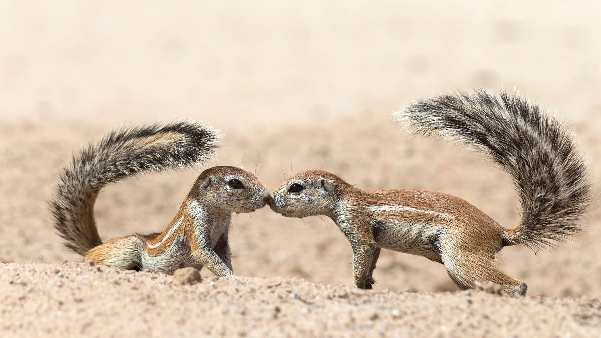
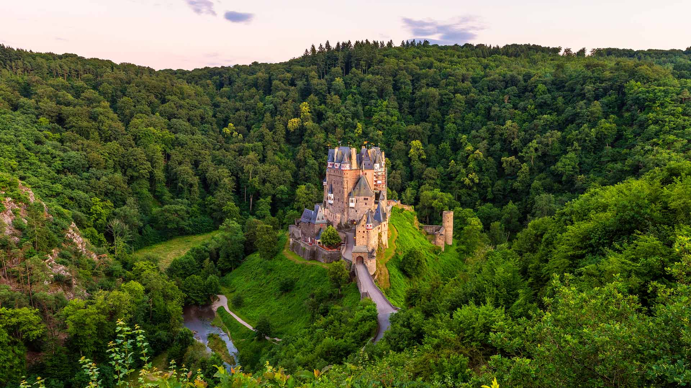

#### 20200930 A saturniid moth in Mole National Park in Larabanga, Ghana (© Robert Thompson/Minden Pictures)(Bing United Kingdom)

#### 20200929 Steeply terraced vineyards of the Lavaux region on the shores of Lake Geneva, Switzerland (© Yves Marcoux/plainpicture)(Bing United Kingdom)

#### 20200929 Apfelernte bei Kippenhausen, Immenstaad am Bodensee, Baden-Württemberg (© Felix Kästle/picture alliance via Getty Images)(Bing Deutschland)

#### 20200928 Blue shark near the Azores in the North Atlantic Ocean (© Nuno Sa/Minden Pictures)(Bing United Kingdom)

#### 20200927 Fraser River east of Vancouver, British Columbia, Canada (© LeonU/Getty Images)(Bing United Kingdom)

#### 20200926 Watkins Glen State Park\'s Rainbow Falls, upstate New York, USA (© Kenneth Keifer/Alamy)(Bing United Kingdom)

#### 20200926 洛阿雷城堡，西班牙韦斯卡 (© Sebastian Wasek/Alamy)(Bing China)

#### 20200925 Tigh Mor and Loch Achray surrounded by fog, Perthshire (© Fortunato Gatto/Sime/eStock Photo)(Bing United Kingdom)

#### 20200925 Ceiling and cove of the Great Hall at the Library of Congress in Washington, DC (© Susan Candelario/Alamy)(Bing United States)

#### 20200925 Webster\'s Falls in autumn, Hamilton, Ont. (© Saffron Blaze/Getty Images)(Bing Canada)

#### 20200925 Catspaw (Anigozanthos humilis) flowers, Yilliminning Rock Reserve, Western Australia (© Krystyna Szulecka/Minden Pictures)(Bing Australia)

#### 20200924 Decorated cows for the Almabtrieb, Tannheimer Tal, a valley in Tyrol, Austria (© Hans Lippert/Alamy)(Bing United Kingdom)

#### 20200923 Red tulips at Floriade flower and entertainment festival, Canberra (© Jenny Dettrick/Getty Images)(Bing Australia)

#### 20200923 Blick vom Zeller Horn auf die Burg Hohenzollern, Baden-Württemberg (© imageBROKER/Alamy Stock Photo)(Bing Deutschland)

#### 20200923 Golden ginkgo leaves at Xuanwu Lake Park in Nanjing, Jiangsu Province, China (© SIPA Asia/ZUMA Wire/Alamy)(Bing United Kingdom)

#### 20200922 ｢エゾフクロウ｣北海道 (© Philip Friskorn/Minden Pictures)(Bing Japan)

#### 20200922 Hobbiton, near Matamata, North Island, New Zealand (© 500px Asia/Getty Images)(Bing United Kingdom)

#### 20200921 The Ship of Tolerance, an international art installation in Zug, Switzerland (© Linda Kennard/Alamy)(Bing United Kingdom)

#### 20200920 Sea otter mother and newborn pup in Monterey Bay, California, USA (© Suzi Eszterhas/Minden Pictures)(Bing United Kingdom)

#### 20200919 Sailboats in Warnemünde, Germany (© Rico Ködder/Getty Images)(Bing United States)

#### 20200919 Beaver dam in the Sawtooth National Forest, Idaho, USA (© Charles Knowles/Alamy)(Bing United Kingdom)

#### 20200918 波尔多葡萄园，法国 (© agefotostock/Alamy)(Bing China)

#### 20200918 Icelandic sheep ready for réttir (© Pieter Tytgat/Getty Images)(Bing United Kingdom)

#### 20200917 The US Constitution and the Declaration of Independence on display in the National Archives, Washington, DC (© Carol M. Highsmith/Buyenlarge/Getty Images)(Bing United States)

#### 20200917 Aerial view of vineyards in La Geria, Lanzarote, Canary Islands, Spain (© Orbon Alija/Getty Images)(Bing United Kingdom)

#### 20200917 Cranberry harvest seen from a drone, Vancouver (© Grant Faint/Getty Images)(Bing Canada)

#### 20200916 The Mayflower II replica of the original Mayflower (© Jim Curran/Adobe Stock)(Bing United Kingdom)

#### 20200916 Guanajuato, Mexico (© AI NISHINO/Alamy)(Bing United States)

#### 20200915 Ruby-throated hummingbird feeding on yellow bells, Texas, USA (© Rolf Nussbaumer/Danita Delimont)(Bing United Kingdom)

#### 20200915 \'Out of Many, One,\' an artwork by Jorge Rodríguez-Gerada on the National Mall in Washington, DC (© Keith Lane/Tribune News Service via Getty Images)(Bing United States)

#### 20200915 ｢秋のコスモス｣長崎 (© Kumiko Goto/Getty Images)(Bing Japan)

#### 20200915 Nuée de bécasseaux variables, Vendées, France (© Serge Deboffle/Minden Photo Stock)(Bing France)

#### 20200914 Im Innern der Porta Nigra, Trier, Rheinland-Pfalz (© Stockinasia/Alamy Stock Photo)(Bing Deutschland)

#### 20200914 Lifeguard shack at sunset on The Entrance beach, Central Coast, New South Wales, Australia (© Yury Prokopenko/Getty Images)(Bing United Kingdom)

#### 20200913 Sand dunes and Sangre de Cristo Mountains, Great Sand Dunes National Park and Preserve, Colorado, USA (© Tim Fitzharris/Minden Pictures)(Bing United Kingdom)

#### 20200912 Rocamadour, Lot, France (© Rrrainbow/Getty Images)(Bing United Kingdom)

#### 20200911 Toronto skyline at sunset (© diegograndi/Getty Images)(Bing Canada)

#### 20200911 One World Trade Center and lower Manhattan, seen from the Empty Sky memorial in Jersey City, New Jersey (© Maurizio Rellini/Offset by Shutterstock)(Bing United States)

#### 20200911 Purple and pink heather on heathland near Studland, Dorset (© allou/iStock/Getty Images Plus)(Bing United Kingdom)

#### 20200910 Huay Mae Khamin waterfall in Khuean Srinagarindra National Park, Thailand (© ImpaKPro/Getty Images)(Bing United Kingdom)

#### 20200910 Franklin-Gordon Wild Rivers National Park, Tasmania (© Heeb Photos/eStock Photo)(Bing Australia)

#### 20200909 A bearded reedling in Elmley National Nature Reserve in Kent (© Mark Bridger/Offset by Shutterstock)(Bing United Kingdom)

#### 20200908 Valletta, Malta (© Deejpilot/GettyImages)(Bing United Kingdom)

#### 20200907 A worker painting the Hammering Man, a sculpture by Jonathan Borofsky, in Frankfurt, Germany (© Arne Dedert/Alamy)(Bing United States)

#### 20200907 Mann Island buildings, Canning Dock, Liverpool (© Borislav Zlatkov/EyeEm/Getty Images)(Bing United Kingdom)

#### 20200906 Reedy Island in Moneyboque Bay, Long Island, New York, USA (© Claudia Uripos/eStock Photo)(Bing United Kingdom)

#### 20200906 Écureuils terrestres se saluant, dans le parc transfrontalier de Kgalagadi, Cap-Nord, Afrique du Sud (© Ann and Steve Toon/Minden Pictures)(Bing France)

#### 20200905 Smith Rock State Park, Oregon, USA (© Manuela Durson/Getty Images)(Bing United Kingdom)

#### 20200904 Mount Pico on Pico Island, the Azores (© Atmo-Sphere/Getty Images)(Bing United Kingdom)

#### 20200904 ｢爆睡コアラ｣オーストラリア (© Anton Rogozin/Getty Images)(Bing Japan)

#### 20200903 Lujiazui Financial District, Shanghai, China (© Jackal Pan/Getty Images)(Bing United Kingdom)

#### 20200902 Misty peak of Glamaig, Red Hills, Isle of Skye (© fotoVoyager/Getty Images)(Bing United Kingdom)

#### 20200901 Adult Cedar Waxwing (Bombycilla cedrorum) perched on a flowering Nootka Lupin (Lupinus nootkatensis), Great Bear Rainforest, B.C. (© Jack Chapman/Minden Pictures)(Bing Canada)

#### 20200901 Wildflowers in the southern region of Flinders Ranges National Park, South Australia (© Southern Lightscapes-Australia/Getty Images)(Bing Australia)

#### 20200901 Burg Eltz, Rheinland-Pfalz (© Allard Schager/Alamy Stock Photo)(Bing Deutschland)

#### 20200901 Pencils on display at Faber-Castell in Stein, Bavaria, Germany (© Rüdiger Hess/geo-select FotoArt)(Bing United Kingdom)

