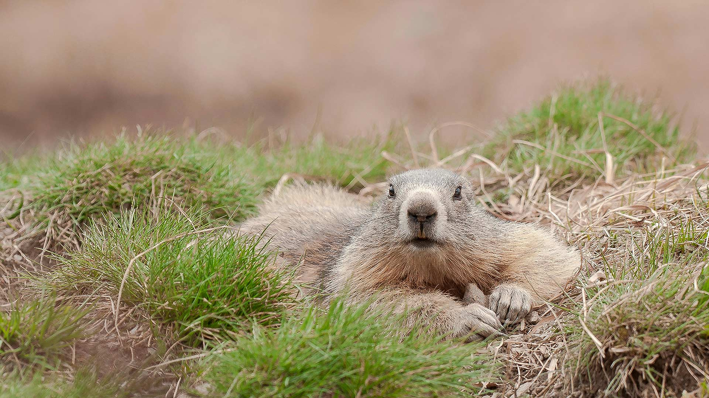
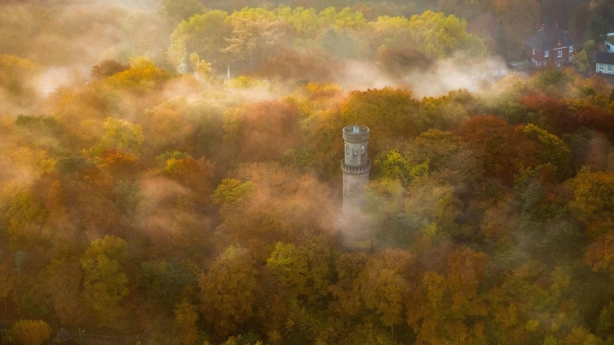
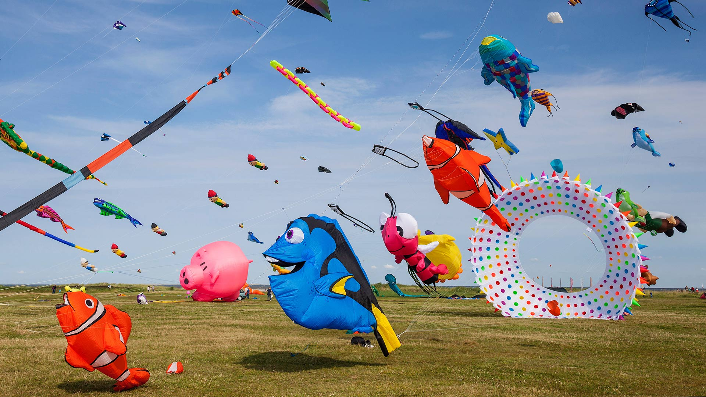
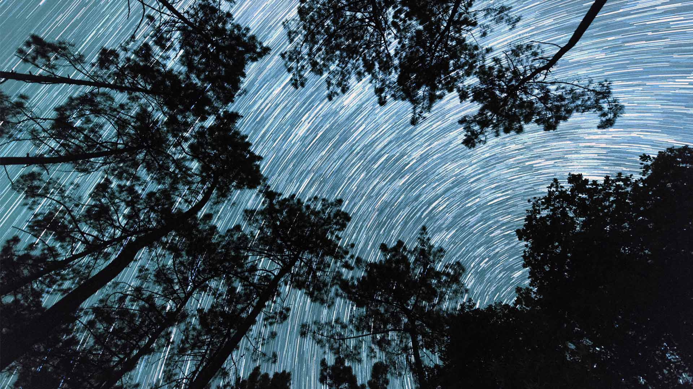
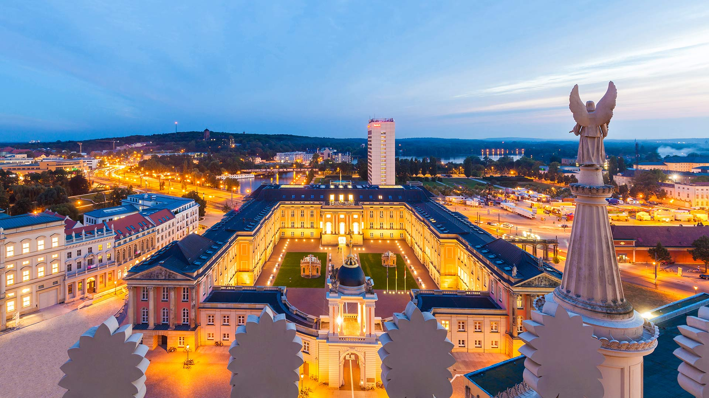
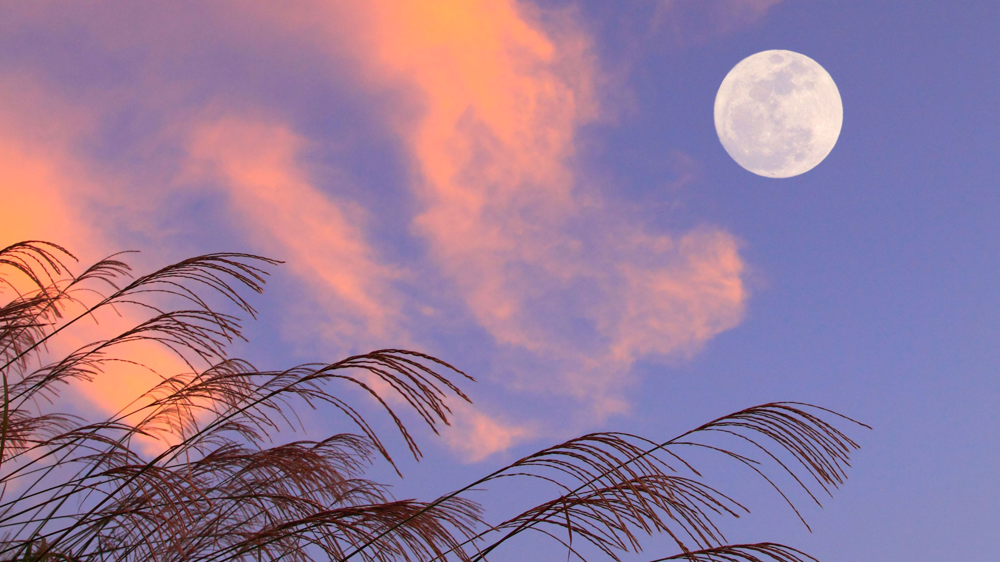
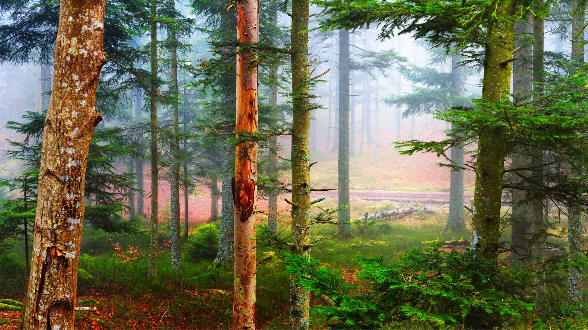

#### 20201031 Dark Hedges in County Antrim  (© VanderWolf Images/Shutterstock)(Bing United Kingdom)

#### 20201030 Northern Saw-whet Owl (Aegolius acadicus) perching in a wild rose bush in British Columbia (© Tim Fitzharris/Minden Pictures)(Bing Canada)

#### 20201030 Blakiston\'s fish owl in Hokkaido, Japan (© Martin Bailey/Offset by Shutterstock)(Bing United Kingdom)

#### 20201029 Mazezilla corn maze at Klingel\'s Farm in Pennsylvania, USA (© Alex Potemkin/Getty Images)(Bing United Kingdom)

#### 20201028 ｢トリニティ・カレッジ図書館｣アイルランド, ダブリン (© Carl Bruemmer/age fotostock)(Bing Japan)

#### 20201028 Grotesques of native Ecuadorian seabirds on the Basílica del Voto Nacional in Quito, Ecuador (© Henri Leduc/Getty Images)(Bing United Kingdom)

#### 20201027 Aerial of pink salt lake in Lochiel, South Australia (© Amazing Aerial Agency/offset by shutterstock)(Bing Australia)

#### 20201027 A pumpkin patch in British Columbia, Canada (© James Chen/Shutterstock)(Bing United Kingdom)

#### 20201026 Corfe Castle, Dorset (© Ross Hoddinott/Minden Pictures)(Bing United Kingdom)

#### 20201025 Grizzly bear cub relaxing, Lake Clark National Park, Alaska, USA (© Erlend Krumsvik/Getty Images)(Bing United Kingdom)

#### 20201024 United Nations headquarters, New York, USA (© Sean Pavone/Alamy)(Bing United Kingdom)

#### 20201024 Marmotte des Alpes, Hautes-Alpes, France (© nataistock/iStock/Getty Images Plus)(Bing France)

#### 20201023 Old general store of Bents, Saskatchewan, Canada (© ImagineGolf/Getty Images)(Bing United Kingdom)

#### 20201022 Starlings flock over Lauwersmeer National Park, Netherlands (© Frans Lemmens/Alamy)(Bing United Kingdom)

#### 20201021 Chameleon walking on a plant, Indonesia (© SnapRapid/Offset by Shutterstock)(Bing United Kingdom)

#### 20201020 Hazel dormouse (Muscardinus avellanarius) hibernating (© Avalon/Photoshot License/Alamy Stock Photo)(Bing United Kingdom)

#### 20201020 Helenenturm, Witten, Nordrhein-Westfalen (© Hans Blossey/age fotostock)(Bing Deutschland)

#### 20201020 Bare trees and autumn ferns in Beaver Lake Nature Center, New York (© Chris Murray/Alamy)(Bing United States)

#### 20201019 Aerial view of jet skis in the ocean, Australia (© Nearmap/Getty Images)(Bing Australia)

#### 20201019 The Mati Si (Horse\'s Hoof Temple) and grottoes of Mati Si Scenic Area, Gansu province, China (© Ana Flašker/Alamy)(Bing United Kingdom)

#### 20201018 View of the harbour in Sitka, Alaska, USA (© Blaine Harrington III/Alamy)(Bing United Kingdom)

#### 20201018 The Famous Five monument sculpted by Barbara Paterson, Calgary (© Michael Wheatley/Age Fotostock)(Bing Canada)

#### 20201017 View of Pisgah National Forest near Brevard, North Carolina, USA (© Adam Jones/Danita Delimont)(Bing United Kingdom)

#### 20201016 View of a tractor and trailers of cabbage in a field in Sankt Pölten, Austria (© Stephan Zirwes/Getty Images)(Bing United States)

#### 20201016 Snowy Norway spruce forest at sunset, Thuringia, Germany (© Frank Sommariva/ImageBROKER/Offset by Shutterstock)(Bing United Kingdom)

#### 20201015 ｢嵯峨野観光鉄道｣京都, 嵐山 (© jiGGoTravel/Alamy Stock Photo)(Bing Japan)

#### 20201015 Ochre sea star on kelp off the coast of California, USA (© Ralph Pace/Minden Pictures)(Bing United Kingdom)

#### 20201014 Dragonfly fossil, about 150 million years old, in Solnhofen, Bavaria, Germany (© Ingo Arndt/Minden Pictures)(Bing United Kingdom)

#### 20201013 Cuillères en bois contentes d’elles  (© nataistock/iStock/Getty Images Plus)(Bing France)

#### 20201013 Poenari Castle on Mount Cetatea, Făgăraș Mountains, Romania (© porojnicu/Getty Images)(Bing United Kingdom)

#### 20201013 Bunte Drachen in Schillig, Wangerland, Niedersachsen (© MAURITIUS/Mauritius/SuperStock)(Bing Deutschland)

#### 20201012 Red fox in the Netherlands (© Wim Weenink/Minden Pictures)(Bing United Kingdom)

#### 20201012 Autumn in Killarney Provincial Park, Ont. (© Jeffery D. Walters/Getty Images)(Bing Canada)

#### 20201012 Haida totem poles on Haida Gwaii in British Columbia, Canada (© Michio Hoshino/Minden Pictures)(Bing United States)

#### 20201011 Geghard Monastery, Armenia (© traumlichtfabrik/Getty Images)(Bing United Kingdom)

#### 20201011 Trainée d’étoiles depuis les racines d’un bosquet de pins en Dordogne (© Eric Nathan/Alamy Stock Photo)(Bing France)

#### 20201010 Aerial view of American flamingos flying over Los Roques Archipelago National Park, Venezuela (© Cristian Lourenco/Getty Images)(Bing United Kingdom)

#### 20201009 View towards the Church of Saint-Cirq-Lapopie, Lot Valley, south-west France (© Reinhard Schmid/Huber/eStock Photo)(Bing United Kingdom)

#### 20201009 Roaring Fork in Great Smoky Mountains National Park, Tennessee (© Bernie Kasper/Getty Images)(Bing United States)

#### 20201009 Honey Bee on Pea flower, Muogamarra Nature Reserve, NSW (© RugliG/iStock/Getty Images Plus)(Bing Australia)

#### 20201008 Blanket octopus in Palm Beach, Florida, USA (© Steven Kovacs/Minden Pictures)(Bing United Kingdom)

#### 20201007 Autumn mist above Restormel Castle in Cornwall (© Robert Harding/Alamy)(Bing United Kingdom)

#### 20201007 Cape Barren Goose (Cereopsis novaehollandiae) standing in a flowering meadow, Tasmania (© blickwinkel/Alamy Stock Photo)(Bing Australia)

#### 20201006 Montage of images of Jupiter and its volcanic moon Io (© Nasa/Johns Hopkins University Applied Physics Laboratory/Southwest Research Institute/Goddard Space Flight Center)(Bing United Kingdom)

#### 20201005 Emperor penguin adults and chicks at the Snow Hill Island rookery, Antarctica (© Martin Ruegner/Getty Images)(Bing United Kingdom)

#### 20201004 Aerial photograph over Whitehall and St James\'s Park, London (© Howard Kingsnorth/Getty Images)(Bing United Kingdom)

#### 20201004 Blick von der Nikolaikirche auf das Stadtschloss mit dem Fortunaportal, Potsdam, Brandenburg (© Westend61/Cavan Images)(Bing Deutschland)

#### 20201003 Oyster mushrooms in Belgium (© Philippe Clement/Minden Pictures)(Bing United Kingdom)

#### 20201003 Brown bear in the Brooks River, Katmai National Park and Preserve, Alaska (© littleting/Pradthana Jarusriboonchai/Getty Images)(Bing United States)

#### 20201002 Yuncheng Salt Lake in Yuncheng, Shanxi Province, China (© Xinhua/Alamy)(Bing United Kingdom)

#### 20201002 Misty forest in fall colours, Yukon (© Ignacio Palacios/Getty Images)(Bing Canada)

#### 20201002 The Owens River and the Sierra Nevada near Bishop, California (© Interfoto/Danita Delimont)(Bing United States)

#### 20201002 ｢満月｣ (© Aflo Co., Ltd/Alamy Stock Photo)(Bing Japan)

#### 20201001 Lantern display celebrating the Mid-Autumn Festival in Singapore (© Khin/Getty Images)(Bing United Kingdom)

#### 20201001 L’automne dans une forêt de pins, Les Vosges, France (© alekseystemmer/iStock/Getty Images Plus)(Bing France)

