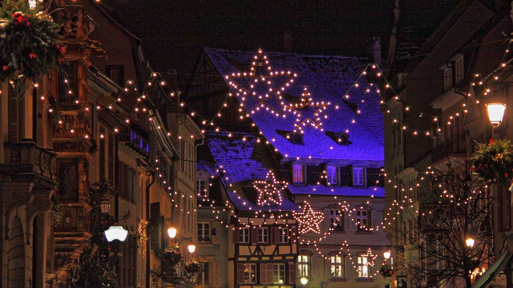
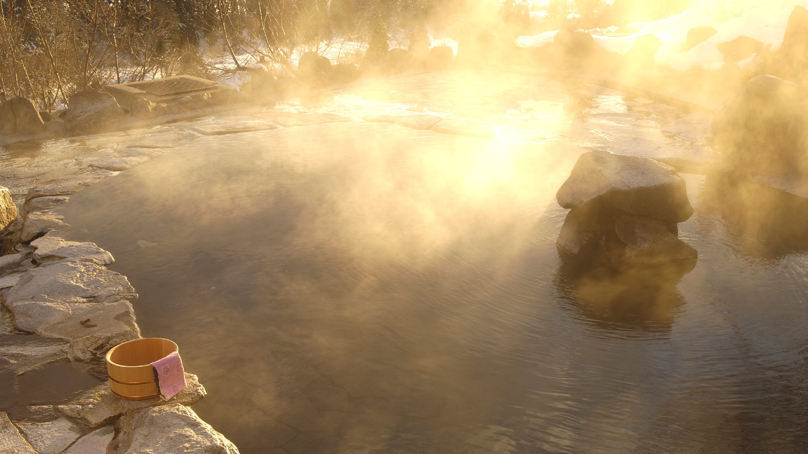
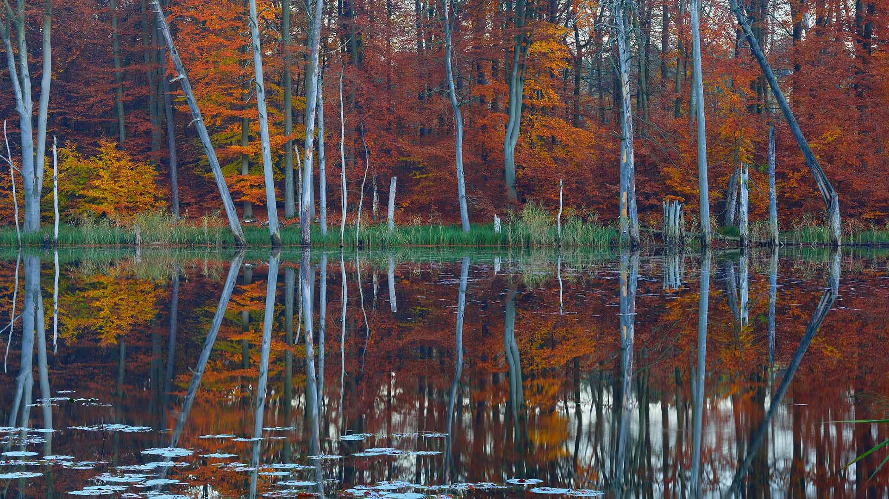
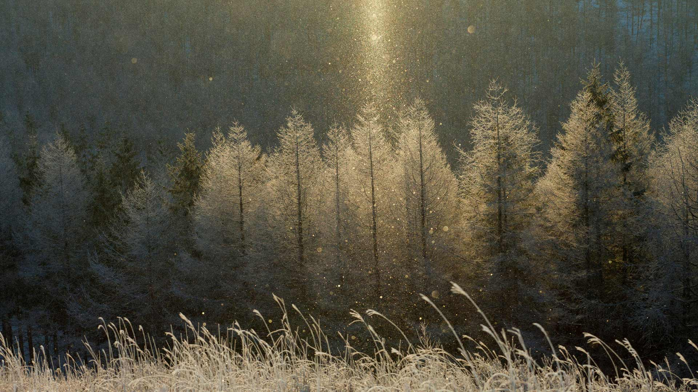
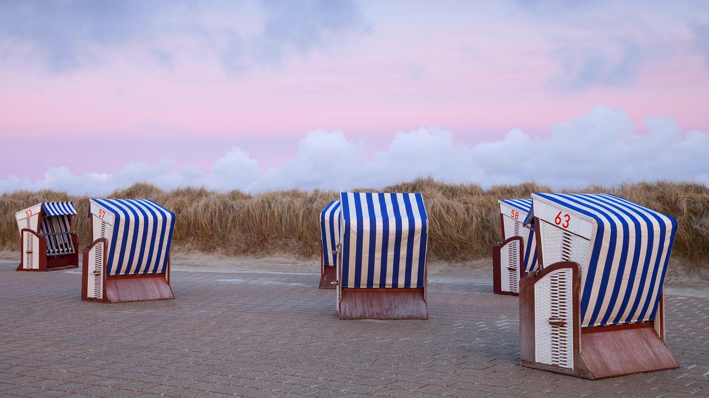
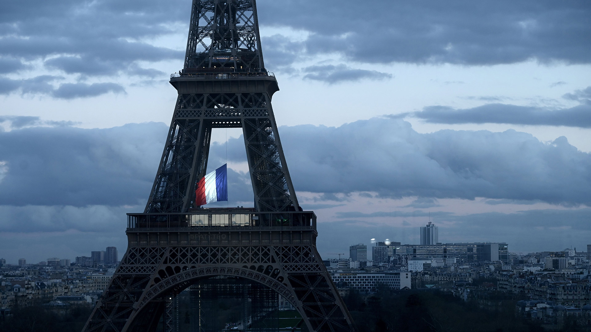
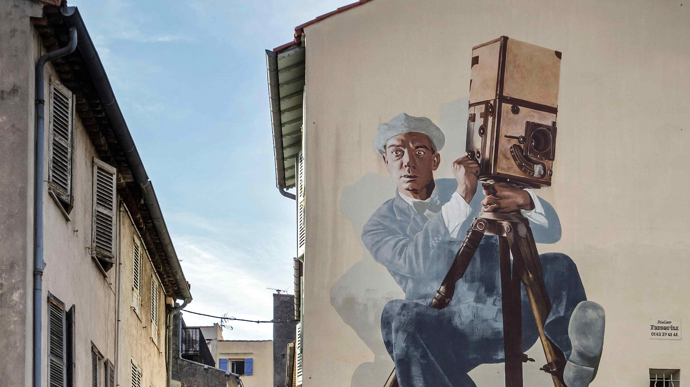
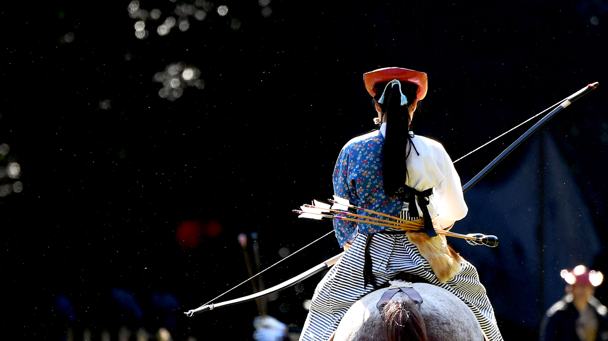
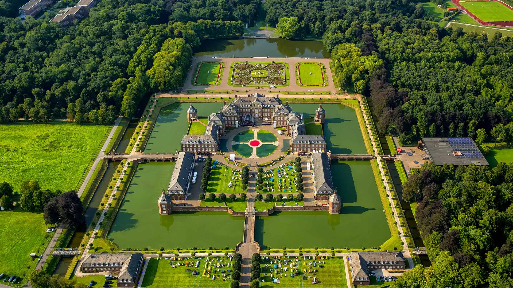

#### 20201130 View of the coastline at dusk, Saint Andrews, Fife (© Graham Hutchison/500px/Getty Images)(Bing United Kingdom)

#### 20201129 Guirlandes illuminant les rues de Strasbourg (© Marco Desscouleurs/Adobe Photo Stock)(Bing France)

#### 20201129 Mount Taranaki, Egmont National Park, North Island, New Zealand (© Francesco Vaninetti/plainpicture)(Bing United Kingdom)

#### 20201128 Partly snow-covered slope in Val Cervara, an old-growth beech forest, Abruzzo, Italy (© Bruno D\'Amicis/Minden Pictures)(Bing United States)

#### 20201128 Leafless trees in the mist at sunrise, Surrey (© plainpicture/Design Pics/Charles Bowman)(Bing United Kingdom)

#### 20201128 Tête de Gorgias (gauche) and Roche Grande (second plan), près d’Entraunes, Alpes-Maritimes, France (© aerial-photos.com/Alamy Stock Photo)(Bing France)

#### 20201127 ｢妙高高原温泉郷｣新潟, 妙高市 (© KAZUMASA KOIWAI/amanaimagesRF/Getty Images)(Bing Japan)

#### 20201127 Kalbarri National Park, Western Australia (© AWL Images/Offset by Shutterstock)(Bing United Kingdom)

#### 20201127 Kayaking in Glacier National Park, Montana (© Makayla Crist/Cavan)(Bing United States)

#### 20201126 A Siberian chipmunk on Mount Taisetsu, Hokkaido, Japan (© Ida Toshiaki/Minden Pictures)(Bing United States)

#### 20201126 A Siberian chipmunk, Hokkaido, Japan (© plainpicture/Score. by Aflo/Takao Onozato/Aflo)(Bing United Kingdom)

#### 20201125 Rotbuchen und Kiefern spiegeln sich im Schweingartensee bei Carpin, Mecklenburg-Vorpommern (© Sandra Bartocha/Minden Pictures)(Bing Deutschland)

#### 20201125 Eilean Donan Castle, western Highlands (© CBW/Alamy)(Bing United Kingdom)

#### 20201125 A grove of American elm trees at Central Park\'s Mall, New York City (© AWL Images/Danita Delimont)(Bing United States)

#### 20201124 Huge waves crashing on rocks along Asilomar State Beach, California, USA (© Sheila Haddad/Danita Delimont)(Bing United Kingdom)

#### 20201123 ｢霧ヶ峰のサンピラー｣長野, 八ヶ岳中信高原国定公園 (© Aflo Co. Ltd./Alamy Stock Photo)(Bing Japan)

#### 20201123 Old Town of Bern, Switzerland (© Simon Zenger/Alamy)(Bing United Kingdom)

#### 20201122 Common cranes in the Drömling wetland in Germany (© Mike Friedrichs/Getty Images)(Bing United Kingdom)

#### 20201121 Wetlands in the Kitikmeot region of Nunavut (© Robert Simmon/NASA)(Bing Canada)

#### 20201121 Autumn leaves frozen in ice, Price Lake, Julian Price Memorial Park, Blue Ridge Parkway, North Carolina (© Richard Bernabe/Offset by Shutterstock)(Bing United States)

#### 20201121 Inunnguaq silhouetted against the Northern Lights in Barren Lands, Northwest Territories, Canada (© Mark Duffy/Alamy Stock Photo)(Bing United Kingdom)

#### 20201120 Aerial view of the Aiguille du Midi in the Mont Blanc massif, France (© Amazing Aerial Agency/Offset by Shutterstock)(Bing United Kingdom)

#### 20201120 Structure décorative de pages de livres pliées, Angles-sur-l\'Anglin, Vienne (© Ed Buziak/Alamy Banque d\'Images)(Bing France)

#### 20201119 Chestnut-mandibled toucan in nest cavity, Costa Rica (© Greg Basco/Minden Pictures)(Bing United Kingdom)

#### 20201118 Interior view of the Steven F. Udvar-Hazy Center, Smithsonian National Air and Space Museum in Chantilly, Virginia (© Rebecca Wyatt/Offset by Shutterstock)(Bing United States)

#### 20201118 Strandkörbe im Abendrot am Nordstrand der Insel Borkum, Niedersachsen (© DEEPOL by plainpicture/Wilfried Wirth)(Bing Deutschland)

#### 20201118 混交林，菲森，巴伐利亚，德国 (© Erich Kuchling/DEEPOL by plainpicture)(Bing China)

#### 20201118 Derwent Island on Derwentwater in the Lake District National Park, Cumbria (© Chris Warren/Stock Photo)(Bing United Kingdom)

#### 20201117 Andy Goldsworthy\'s Wood Line installation along Lovers\' Lane in the Presidio of San Francisco, California, USA (© Chris LaBasco/Alamy)(Bing United Kingdom)

#### 20201117 日本北海道 (© Hiroshi Yokoyama/eStock Photo)(Bing China)

#### 20201116 The interior of the Abu Simbel Great Temple in Egypt (© George Steinmetz/Getty Images)(Bing United Kingdom)

#### 20201115 Lupins on the shores of Lake Tekapo in New Zealand (© Stanislav Kachyna/Shutterstock)(Bing United Kingdom)

#### 20201114 Le drapeau français flottant au centre de la Tour Eiffel, le 11 mars 2020, lors d’une cérémonie pour la première Journée nationale d’hommage aux victimes du terrorisme (© PHILIPPE LOPEZ/POOL/AFP via Getty Images)(Bing France)

#### 20201114 Oil lamps being arranged on rangoli during Diwali (© Subir Basak/Getty Images)(Bing United Kingdom)

#### 20201113 Ravens in a snowstorm near Kuhmo, Finland (© Frans Lemmens/Alamy)(Bing United Kingdom)

#### 20201112 Connery Pond and Whiteface Mountain in New York state (© Henk Meijer/Alamy)(Bing United States)

#### 20201112 Cambron Covered Bridge in Green Mountain Park, Alabama, USA (© Jens Lambert/Shutterstock)(Bing United Kingdom)

#### 20201111 A British Tommy figure at the war memorial in Selkirk (© Rob Gray/Alamy Live News)(Bing United Kingdom)

#### 20201111 Poppies projected on the Sydney Opera House sails to mark Remembrance Day (© James D. Morgan/Getty Images)(Bing Australia)

#### 20201111 The tomb of the unknown soldier at the National War Memorial in Ottawa (© Norman Pogson/Alamy Stock Photo)(Bing Canada)

#### 20201111 The Korean War Veterans Memorial, Washington, DC (© Ian G Dagnall/Alamy)(Bing United States)

#### 20201111 Fresque representant Buster Keaton, le cameraman, Cannes (© Arterra Picture Library/Alamy Stock Photo)(Bing France)

#### 20201110 Badlands National Park, South Dakota, USA (© Dennis Frates/Alamy)(Bing United Kingdom)

#### 20201109 An entry from the Castaways Sculpture Awards, 2012 (© Universal Images Group/Superstock)(Bing Australia)

#### 20201109 The hills of Barolo vineyards in Piedmont, Italy (© Marco Arduino/eStock Photo)(Bing United Kingdom)

#### 20201108 St Michael\'s Church on Burrow Mump, Burrowbridge, Somerset  (© DEEPOL by plainpicture/Adam Burton)(Bing United Kingdom)

#### 20201107 Chestnuts inside their husks (© Kai Keisuke/Shutterstock)(Bing Australia)

#### 20201107 Bison in Grand Teton National Park, Wyoming, USA (© Brian Evans/Getty Images)(Bing United Kingdom)

#### 20201106 West Indian manatees in Crystal River National Wildlife Refuge, Florida, USA (© Norbert Probst/Getty Images)(Bing United Kingdom)

#### 20201105 Houses of Parliament on a cloudy evening in London (© chbaum/Shutterstock)(Bing United Kingdom)

#### 20201104 ｢演武の準備をする流鏑馬の騎手｣東京, 明治神宮 (© Matt McClain/The Washington Post via Getty Images)(Bing Japan)

#### 20201104 Wild reindeer swimming across the Kobuk River in Alaska, USA (© Michio Hoshino/Minden Pictures)(Bing United Kingdom)

#### 20201103 Schloss Nordkirchen, Münsterland, Nordrhein-Westfalen (© Hans Blossey/Alamy Stock Photo)(Bing Deutschland)

#### 20201103 Loch Leum na Luirginn and Loch Cleat seen from the Quiraing, Isle of Skye (© Sebastian Wasek/Sime/eStock Photo)(Bing United Kingdom)

#### 20201103 The United States Capitol Building in Washington, DC (© f11photo/Getty Images)(Bing United States)

#### 20201102 Albarracín, Spain (© Domingo Leiva/Getty Images)(Bing United Kingdom)

#### 20201101 Polar bears in Torngat Mountains National Park, Canada (© Cavan Images/Offset by Shutterstock)(Bing United Kingdom)

#### 20201101 Sky Rock petroglyphs in the Volcanic Tablelands near Bishop, California (© JTBaskinphoto/Getty Images)(Bing United States)

#### 20201101 Maple leaf under water; Grenville-sur-la-Rouge, Quebec (© Steeve Marcoux/Plainpicture/Design Pics)(Bing Canada)

#### 20201101 ｢ジャック・オー・ランタンのカカシ｣ (© Chris Aschenbrener/Alamy Stock Photo)(Bing Japan)

#### 20201101 River running through Cheran Gorges, Alps, Savoie, France (© Jean-Philippe Delobelle/Minden)(Bing Australia)

