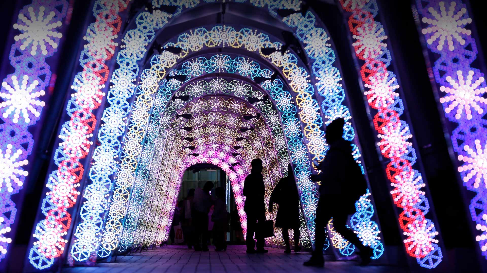
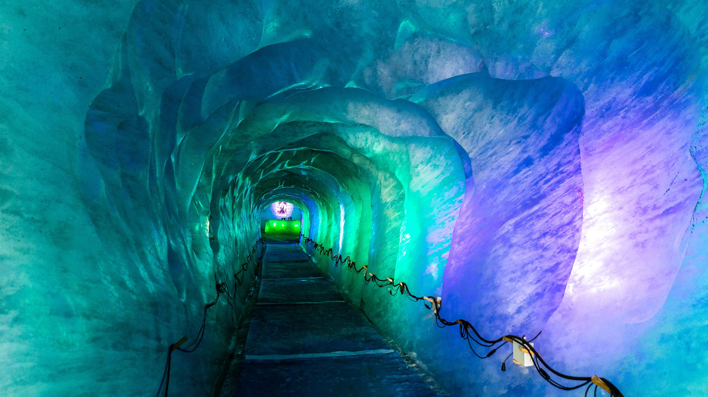
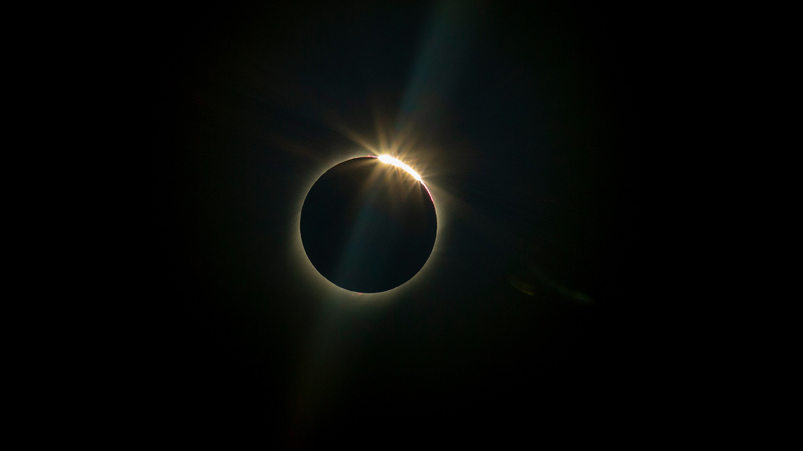
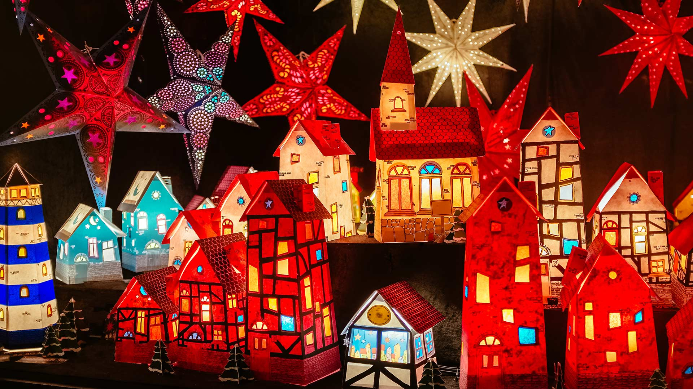
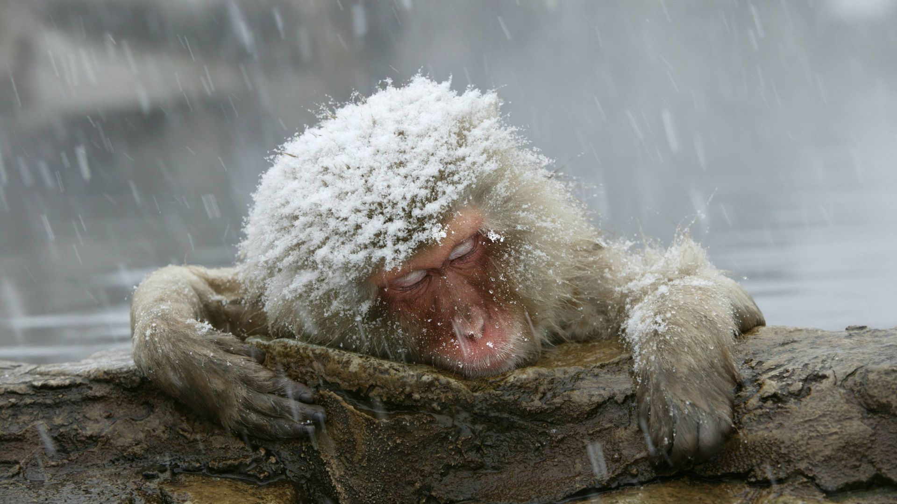
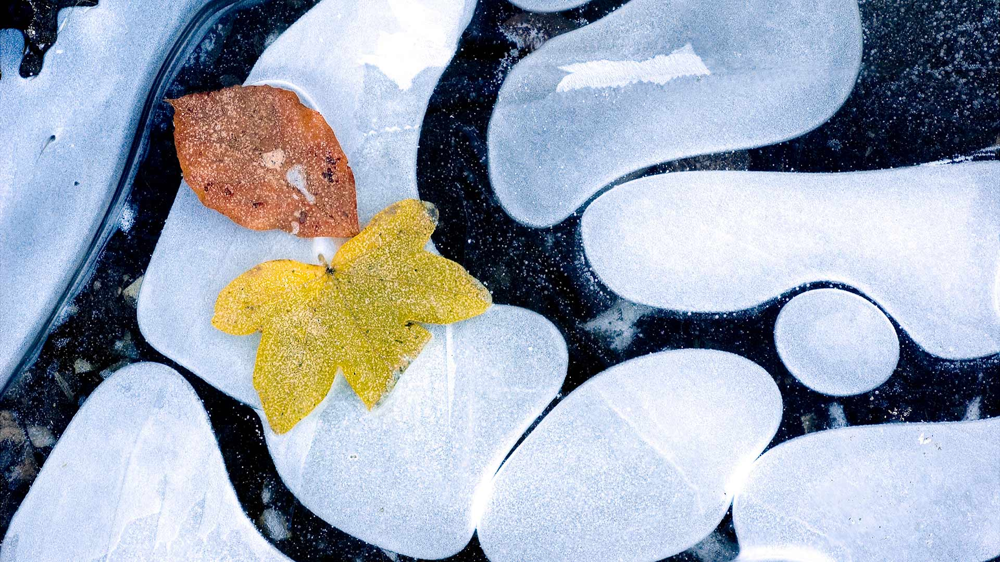

#### 20201231 Fireworks during a New Year\'s Eve celebration in Zaragoza, Spain (© Martina Badini/Shutterstock)(Bing United Kingdom)

#### 20201230 Winter in Bryce Canyon National Park, Utah, USA (© Don Paulson/Danita Delimont)(Bing United Kingdom)

#### 20201230 Mit Tannen und Fichten bewaldete Hügel bei Meschede, Sauerland, Nordrhein-Westfalen (© imageBROKER/Alamy Stock Photo)(Bing Deutschland)

#### 20201230 Green turtle swimming over a coral reef, Lady Elliot Island, Queensland (© seanscott/Getty Images)(Bing Australia)

#### 20201229 Old Town of Lucerne, Switzerland (© Xantana/Getty Images)(Bing United Kingdom)

#### 20201228 Snow boarder in Whistler, B.C. (© John Crux/Alamy Stock Photo)(Bing Canada)

#### 20201228 比利牛斯山脉中的高山湖Ibón de Plan，西班牙韦斯卡 (© Getty Images)(Bing China)

#### 20201228 Canada lynx in Montana, USA (© Alan and Sandy Carey/Minden Pictures)(Bing United Kingdom)

#### 20201227 Nabana no Sato garden at night in Kuwana, Japan (© Zoonar GmbH/Alamy)(Bing United Kingdom)

#### 20201226 雪中的蓝山雀和大山雀，法国北孚日地区自然公园 (© Michel Rauch/Minden Pictures)(Bing China)

#### 20201226 Saint-Denis Street and Chateau Frontenac in Quebec City (© Yves Marcoux/First Light/Alamy Stock Photo)(Bing Canada)

#### 20201226 Families play on the snow-covered slopes at Barnett Demesne Park, Belfast (© Stephen Barnes/Alamy)(Bing United Kingdom)

#### 20201225 Santa\'s giant sleigh and post box, Ilulissat, Greenland (© Walter Bibikow/Jon Arnold Images Ltd/Alamy)(Bing United Kingdom)

#### 20201225 Kapelle Maria Rast bei Krün in Bayern mit dem Wettersteingebirge im Hintergrund (© Reinhard Schmid/Huber/eStock Photo)(Bing Deutschland)

#### 20201225 Australian Christmas sandman with decorations on Bondi Beach, NSW (© fogaas/iStock/Getty Images Plus)(Bing Australia)

#### 20201224 ｢東京ドームのイルミネーション｣東京, 文京区 (© REUTERS/Yuya Shino)(Bing Japan)

#### 20201224 Northern lights and wild reindeer on the tundra in Norway (© Anton Petrus/Getty Images)(Bing United Kingdom)

#### 20201223 Banded pipefish near Moalboal, Philippines (© Jenna Szerlag/Alamy)(Bing United Kingdom)

#### 20201222 Grotte de la Mer de Glace, Chamonix, France (© z_m photo/Adobe Stock)(Bing France)

#### 20201222 Christmas lights on Cape Neddick Light in York, Maine, USA (© Walter Bibikow/Alamy)(Bing United Kingdom)

#### 20201221 Castlerigg Stone Circle near Keswick, Lake District, Cumbria (© Alan Copson/plainpicture)(Bing United Kingdom)

#### 20201220 Mountain goat kid in western Montana, USA (© Donald M. Jones/Minden Pictures)(Bing United Kingdom)

#### 20201219 Morning frost on trees in Mount Siguniang National Park, Sichuan Province, China (© Robert Harding World Imagery/Offset by Shutterstock)(Bing United Kingdom)

#### 20201218 Hedgehog in snowy winter weather, sat on green moss (© Coatsey/Alamy Stock Photo)(Bing United Kingdom)

#### 20201217 Pine cones, Netherlands (© Marcel ter Bekke/Getty Images)(Bing United States)

#### 20201217 雾气环绕的森林，喀拉拉邦慕那尔市，印度 (© Ahammed Riswan/EyeEm/Getty Images)(Bing China)

#### 20201217 Bastei Bridge above the Elbe river in Saxon Switzerland National Park, Germany (© Reinhard Schmid/eStock Photo)(Bing United Kingdom)

#### 20201217 The English National Ballet\'s 2016 production of \'The Nutcracker\' at the London Coliseum in London, England (© Robbie Jack/Corbis via Getty Images)(Bing Canada)

#### 20201216 Ludwig van Beethoven sculptures and monument at the Münsterplatz, Bonn, Germany (© dpa/Alamy Live News)(Bing United Kingdom)

#### 20201215 Cecil Brewer spiral staircase at Heal\'s furniture store, Tottenham Court Road, London (© Matt Cooper/Gallery Stock)(Bing United Kingdom)

#### 20201215 Close-up of Christmas tree decorations in Martin Place, Sydney, New South Wales (© Karin de Mamiel/iStock/Getty Images Plus)(Bing Australia)

#### 20201215 Le soleil caché par la lune lors de l’éclipse totale de La Higuera, Chili, le 2 juillet 2019 (© AP Photo/Esteban Felix)(Bing France)

#### 20201215 Leuchtende Papierhäuschen and Weihnachtssterne auf einem Weihnachtsmarkt in Hannover, Niedersachsen (© Elena Eliachevitch/Getty Images)(Bing Deutschland)

#### 20201214 Pine grosbeak (© Peter Lilja/Getty Images)(Bing United Kingdom)

#### 20201213 Gornergrat railway station and the Matterhorn in Zermatt, Switzerland (© coolbiere photograph/Getty Images)(Bing United Kingdom)

#### 20201212 Poinsettia leaf close-up (© Charles Floyd/Alamy)(Bing United Kingdom)

#### 20201211 Queen of the Andes plants in the Cordillera Blanca mountains, Peru (© Cyril Ruoso/Minden Pictures)(Bing United Kingdom)

#### 20201210 Valéry Giscard d\'Estaing reçoit Paris Match à l\'Elysée, Août 1979 (©  GAROFALO Jack/Contributor/Getty Images)(Bing France)

#### 20201210 Sleeping Arctic fox (© Menno Schaefer/Getty Images)(Bing United Kingdom)

#### 20201210 冬天的金阁寺，日本京都 (© yoko_ken_chan/Shutterstock)(Bing China)

#### 20201209 The Lowry Theatre and Imperial War Museum North, with reflections at Salford Quays, Greater Manchester (© Michelle McMahon/Getty Images)(Bing United Kingdom)

#### 20201209 View of the Parliament Hill in winter, Ottawa (© Thomas Brissiaud/Shutterstock)(Bing Canada)

#### 20201208 Rocca Calascio in Abruzzo, Italy (© Francesco Russo/eStock Photo)(Bing United Kingdom)

#### 20201208 ｢温泉に入るニホンザル｣ (© M. Watson/ardea.c/age fotostock)(Bing Japan)

#### 20201208 Feuilles d’automne sur de l’eau gelée, France (© Jean-Philippe Delobelle/Minden Pictures)(Bing France)

#### 20201208 Macro shot of NSW Christmas bush (© Michael Leslie/Shutterstock)(Bing Australia)

#### 20201207 View of the Washington Monument and the National World War II Memorial with its Pearl Harbor Dedication, Washington, DC (© Olga Bogatyrenko/Shutterstock)(Bing United States)

#### 20201207 Birdhouses hanging in a tree (© Westend61/Getty Images)(Bing Australia)

#### 20201207 Bombe code-breaking machine, Bletchley Park, Milton Keynes, Buckinghamshire (© Louis Berk/Alamy)(Bing United Kingdom)

#### 20201207 Christmas lights at the Butchart Gardens in British Columbia (© James Wheeler/Getty Images)(Bing Canada)

#### 20201206 Elevated path in Plitvice Lakes National Park, Croatia (© Alessandro Laporta/Offset by Shutterstock)(Bing United Kingdom)

#### 20201205 The village of Benasque, Huesca, Spain (© Miscellaneoustock/Alamy)(Bing United Kingdom)

#### 20201204 African elephants in Addo Elephant National Park in South Africa (© Robert Harding/Alamy)(Bing United Kingdom)

#### 20201203 Christmas market in Braşov, Romania (© Alpineguide/Alamy)(Bing United Kingdom)

#### 20201202 Cove of Spires in Kenai Fjords National Park, Alaska, USA (© Sekar B/Shutterstock)(Bing United Kingdom)

#### 20201201 Nussknacker, Alexanderplatz, Berlin (© dpa picture alliance/Alamy Stock Photo)(Bing Deutschland)

#### 20201201 Mount Goodsir and surroundings in Yoho National Park, B.C. (© Peter Essick/Cavan Images)(Bing Canada)

#### 20201201 Nuestra Señora de la Hoz monastery in the Duratón River gorge, Castile and León, Spain (© Arco Images GmbH/Alamy)(Bing United Kingdom)

#### 20201201 Aerial view of Cronulla rock pool with incoming waves, New South Wales (© ai_yoshi/iStock/Getty Images Plus)(Bing Australia)

#### 20201201 Common terns sharing a small fish (© Ryzhkov Sergey/Shutterstock)(Bing United States)

