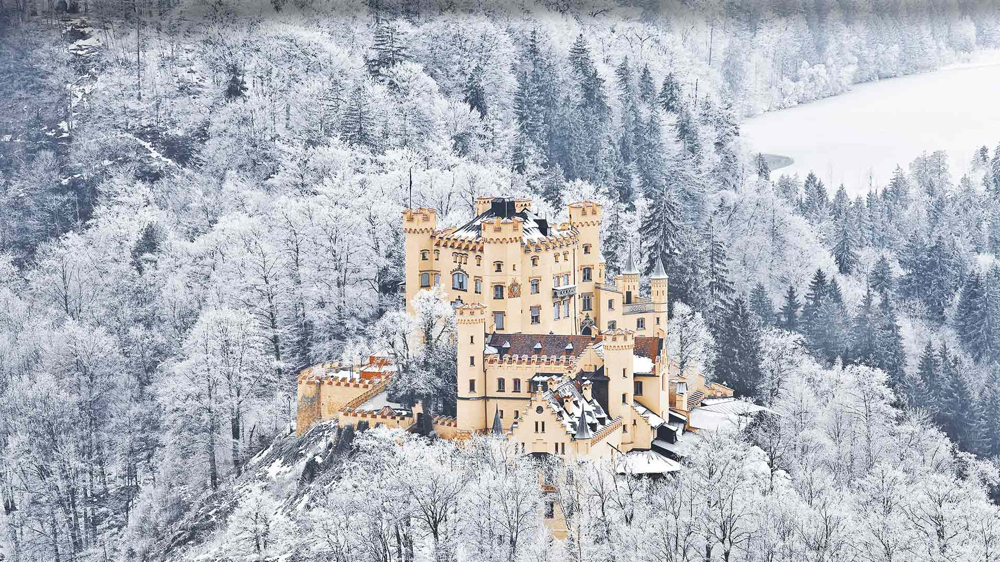
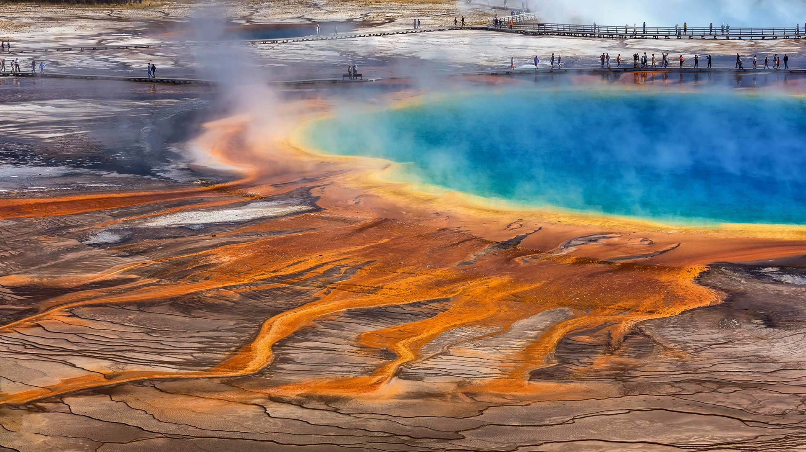
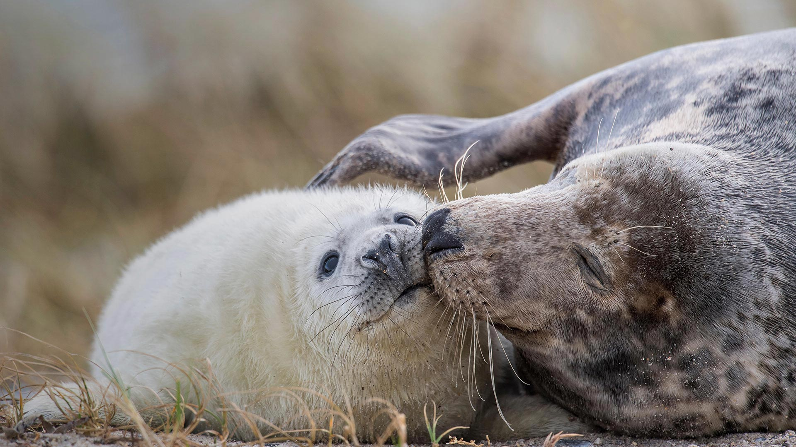
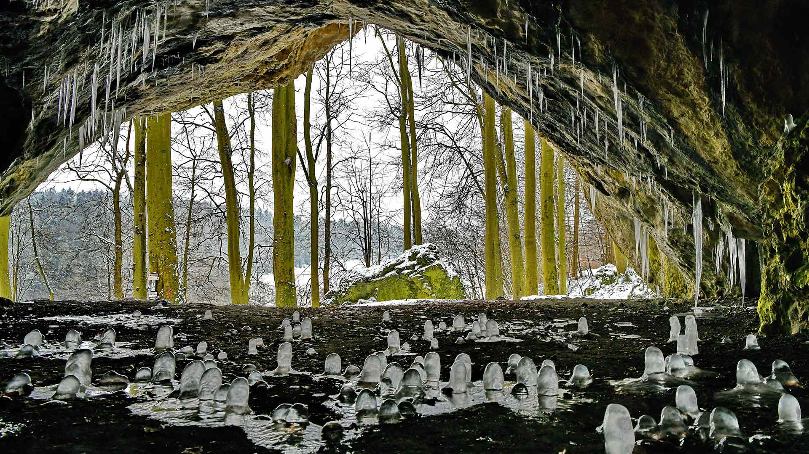
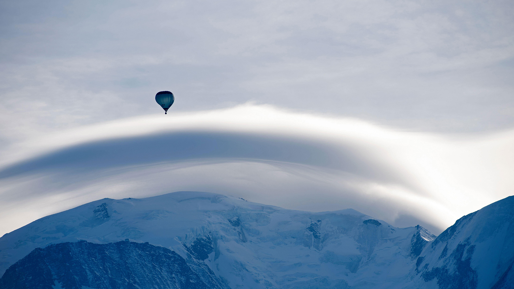
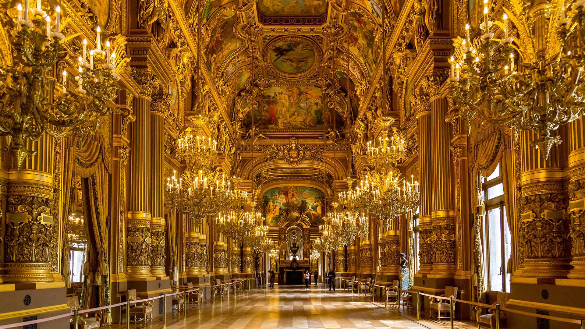
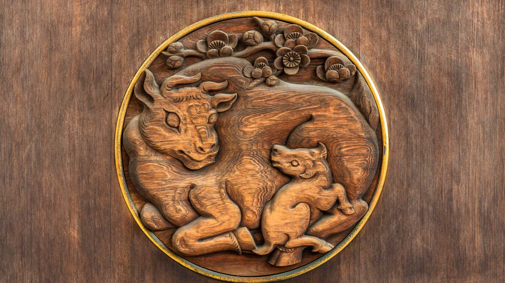
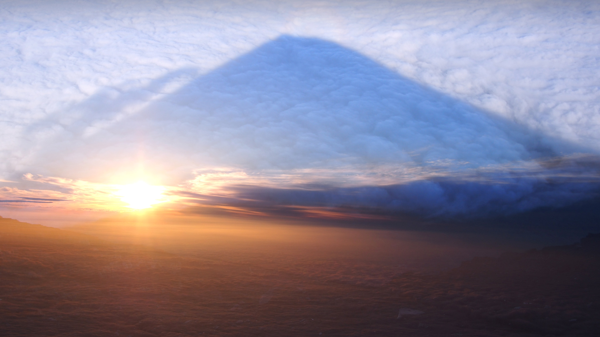

#### 20210131 Mittenwalder Hütte in the Bavarian Alps of Germany (© Sebastian Frölich/Offset by Shutterstock)

#### 20210130 Svalbard Global Seed Vault with a glittering facade designed by artist Dyveke Sanne, Svalbard, Norway (© Pal Hermansen/Minden Pictures)

#### 20210130 Abandoned cottage in the foothills of Brown Willy on Bodmin Moor, the highest point in Cornwall, England (© Helen Hotson/Alamy Stock Photo)

#### 20210129 冬季暴风雪中的欧亚鸲，英格兰峰区国家公园 (© Ben Robson Hull Photography/Getty Images)

#### 20210128 Kermits Pool, Karijini National Park, Western Australia (© Abstract Aerial Art/Getty Images)(Bing Australia)

#### 20210128 北极狼一家，加拿大 (© 4FR/Getty Images)

#### 20210127 西西里岛陶尔米纳，意大利 (© Juergen Schonnop/Getty Images)

#### 20210126 Schloss Hohenschwangau, Schwangau bei Füssen, Bayern (© volkova natalia/Shutterstock)(Bing Deutschland)

#### 20210126 属于大堡礁的一部分的心形礁，澳大利亚昆士兰 (© Peter Adams/Offset by Shutterstock)

#### 20210125 ｢グランド・プリズマティック・スプリング｣米国, ワイオミング州 (© Darrenp/Shutterstock)(Bing Japan)

#### 20210125 Twilight view over Edinburgh as seen from Calton Hill (© Henk Meijer/Alamy Stock Photo)(Bing United Kingdom)

#### 20210125 红石公园教堂岩附近的雷击，新墨西哥州 (© Tim Fitzharris/Minden Pictures)

#### 20210124 库纳族人的手工艺品，巴拿马圣布拉斯群岛 (© Lars Schneider/Tandem Stills + Motion)

#### 20210123 A snowboarder in Pemberton, B.C. (© Jussi Grznar/Tandem Stills + Motion)(Bing Canada)

#### 20210123 波来古市附近的Chu Dang Ya火山，越南嘉来 (© Quang Ngoc Nguyen/Alamy)

#### 20210122 Maman phoque gris et son petit sur une plage d’Heligoland, Schleswig-Holstein, Allemagne (© imageBROKER/Alamy Stock Photo)(Bing France)

#### 20210122 横跨康涅狄格河畔血溪的铁路，新罕布什尔州汉诺威 (© DEEPOL by plainpicture)

#### 20210121 苏格兰高地上的欧亚红松鼠，苏格兰 (© Scotland: The Big Picture/Minden Pictures)

#### 20210120 Randonneurs, Mont Blanc, Chamonix (© agustavop/Getty Images)(Bing France)

#### 20210120 南极丹科岛附近的巴布亚企鹅 (© David Merron/Getty Images)

#### 20210119 被丛林包围着的玛雅古城卡拉克穆尔遗址，墨西哥坎佩切 (© Alfredo Matus/Shutterstock)

#### 20210118 \'I Have a Dream\' inscription at the location of Dr. Martin Luther King Jr.\'s speech on the steps of the Lincoln Memorial in Washington, DC (© Pgiam/Getty Images)(Bing United States)

#### 20210118 菲希特尔贝格山上的气象站和Fichtelberghaus酒店，德国上维森塔尔 (© Cornelia Dorr/eStock Photo)

#### 20210118 Ice-climbing at the Athabasca Glacier in Jasper National Park, Alberta (© Cavan Images/Offset)(Bing Canada)

#### 20210117 巴尼奥斯附近的阿格杨瀑布，厄瓜多尔 (© Laura BC/Getty Images)

#### 20210117 ｢勝尾寺の勝ちダルマ｣大阪府, 箕面市 (© bill rubie/Alamy)(Bing Japan)

#### 20210116 卡克斯劳塔宁阿克蒂克度假酒店的玻璃圆顶冰屋，芬兰萨里山  (© Lingxiao Xie/Getty Images)

#### 20210115 俯瞰着多尔多涅河谷的贝纳克城堡，法国 (© Gareth Kirkland/Alamy)

#### 20210114 High-angle view of man surfing in the sea, New South Wales (© Benjamin Lee/EyeEm/Getty Images)(Bing Australia)

#### 20210114 布莱顿-霍夫被雪覆盖的海滩小屋，英国 (© Tim Jones/Alamy)

#### 20210113 Eiszapfen in der Oswaldhöhle bei Muggendorf, Bayern (© Rüdiger Hess/geo-select FotoArt)(Bing Deutschland)

#### 20210113 爱德阿都·阿瓦罗·安第斯国家保护区内的火烈鸟，玻利维亚 (© Art Wolfe/Danita Delimont)

#### 20210112 Sindhudurg堡，印度马哈拉施特拉邦 (© MovingMaratha/Alamy)

#### 20210112 Frosty morning at Hadrian\'s Wall on Winshields Crags, looking towards Crag Lough in Northumberland (© Nigel Eve/Shutterstock)(Bing United Kingdom)

#### 20210111 Aït Benhaddou, Atlas Mountains, Morocco (© Alex Cimbal/Shutterstock)(Bing United Kingdom)

#### 20210111 Pradollano滑雪站，西班牙内华达山脉国家公园 (© NTCo/iStock/Getty Images Plus)

#### 20210110 四川黄龙风景名胜区，中国 (© primeimages/Getty Images)

#### 20210110 Le Mont Blanc, surmonté d’un nuage lenticulaire et d’une montgolfière, Haute-Savoie (© Henry Ausloos)(Bing France)

#### 20210109 Tre Cime di Lavaredo as seen from the Lavaredo fork, Sexten Dolomites, Italy (© AWL Images/Danita Delimont)(Bing United Kingdom)

#### 20210109 圣卡塔利娜岛附近海藻上的西班牙披肩海蛞蝓，加利福尼亚海峡群岛 (© WaterFrame/Alamy)

#### 20210108 巴黎先贤祠内的傅科摆，法国 (© Adolf/Adobe Stock)

#### 20210107 多佛尔白崖，英国多佛尔 (© LisaValder/Getty Images)

#### 20210106 火山口湖，俄勒冈州 (© Steve Bloom Images/Alamy)

#### 20210106 Vue intérieure de l’Opéra national de Paris Garnier prise le 31 mars 2017, Paris (© Gilmanshin/Shutterstock)(Bing France)

#### 20210106 Arkady Shilkloper plays his three-metre-long alphorn atop the Sydney Opera House as part of the 2013 Sydney Festival (© Mark Metcalfe/Getty Images)(Bing Australia)

#### 20210105 奥梅雷克的红额金刚鹦鹉，玻利维亚科恰班巴 (© Bernard Castelein/Minden Pictures)

#### 20210105 Ice crystals, Japser National Park, Alberta (© Mint Images/Art Wolfe/Getty Images)(Bing Canada)

#### 20210105 Antique ice yachts on the frozen Hudson River near Astor Point in Barrytown, New York, USA (© Mike Segar/REUTERS)(Bing United Kingdom)

#### 20210104 ｢浅草寺の羽子板市｣東京都, 台東区 (© Art Directors & TRIP/Alamy Stock Photo)(Bing Japan)

#### 20210104 Sunset over Nash Point on the Glamorgan Heritage Coast, South Wales in winter. (© AWL Images/DanitaDelimont.com)(Bing United Kingdom)

#### 20210104 冰河湖对面的钻石冰沙滩，冰岛 (© surangaw/Getty Images)

#### 20210103 ｢湯島天神唐門の彫刻｣東京都, 文京区 (© CLEMENT CAZOTTES/Alamy Stock Photo)(Bing Japan)

#### 20210103 Red clouds at sunset over McIntyre Creek in Whitehorse, Yukon (© Robert Postma/plainpicture/Design Pics)(Bing Canada)

#### 20210103 Hohenschwangau Castle, Bavaria, Germany (© Mespilia/Shutterstock)(Bing United States)

#### 20210103 远眺格斯韦因斯泰因村和格斯韦因斯泰因城堡 (© Juergen Sack/Getty Images)

#### 20210102 ｢雲海に映る影富士｣山梨県, 南都留郡鳴沢村 (© 30 characters/Getty Images)(Bing Japan)

#### 20210102 峰牙－己榜国家公园中的韩松洞，越南 (© David A Knight/Shutterstock)

#### 20210101 斯瓦尔巴群岛附近水域的北极熊，挪威 (© Westend61/Getty Images)

