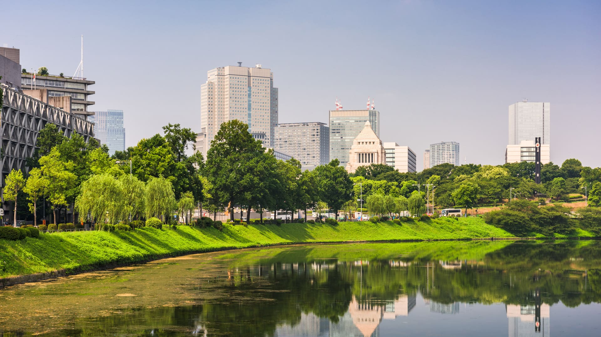
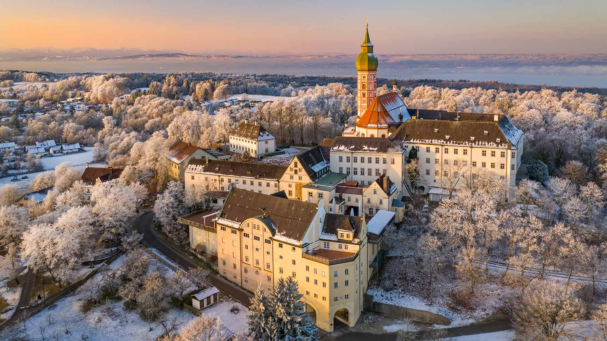
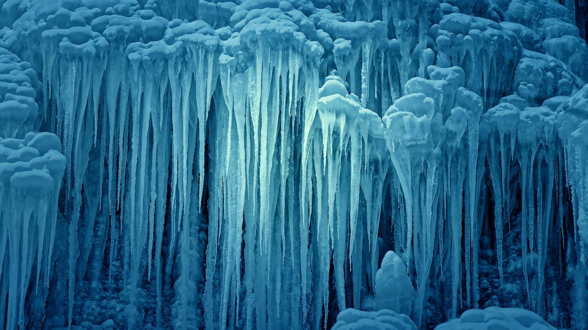
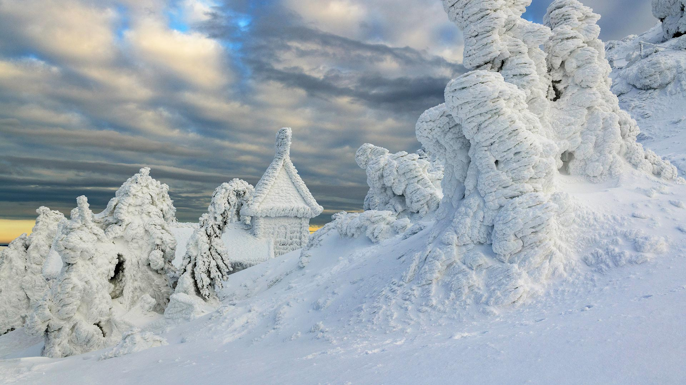
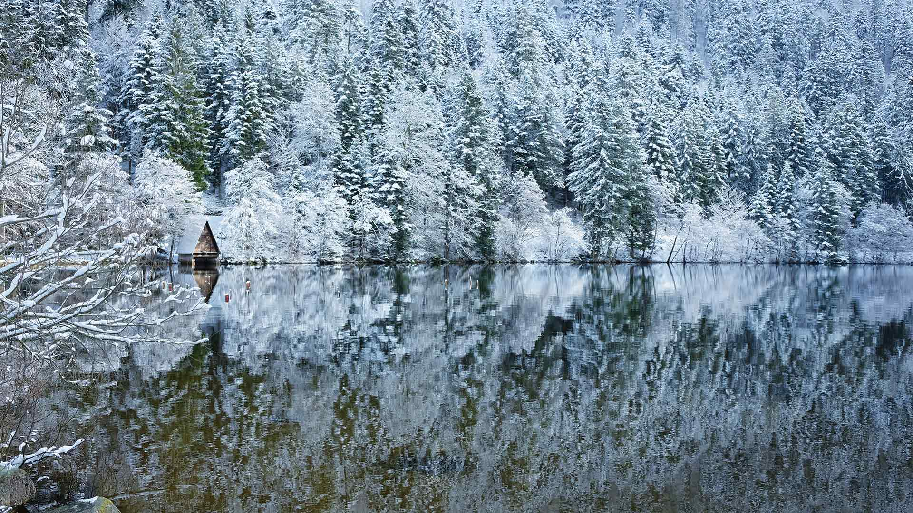
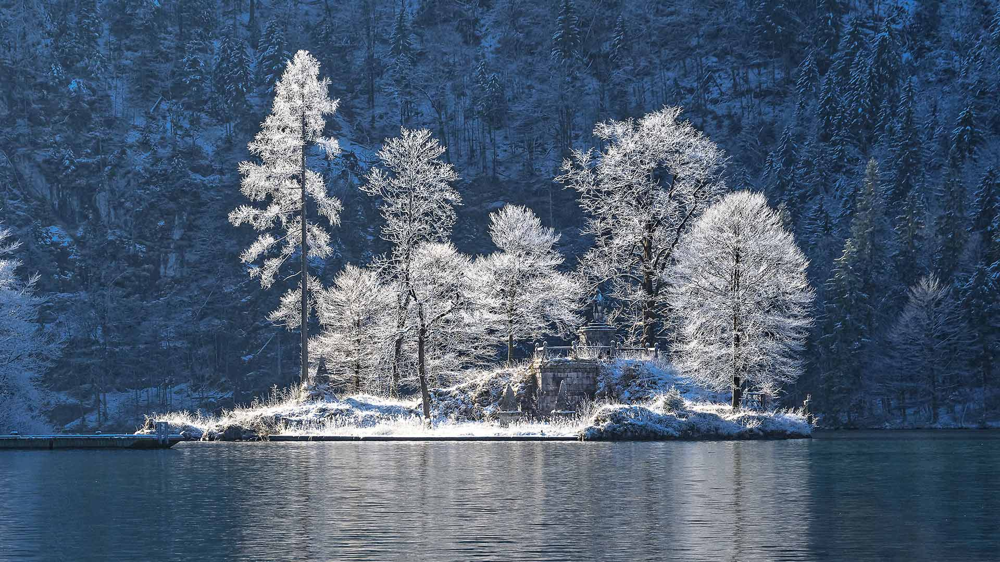
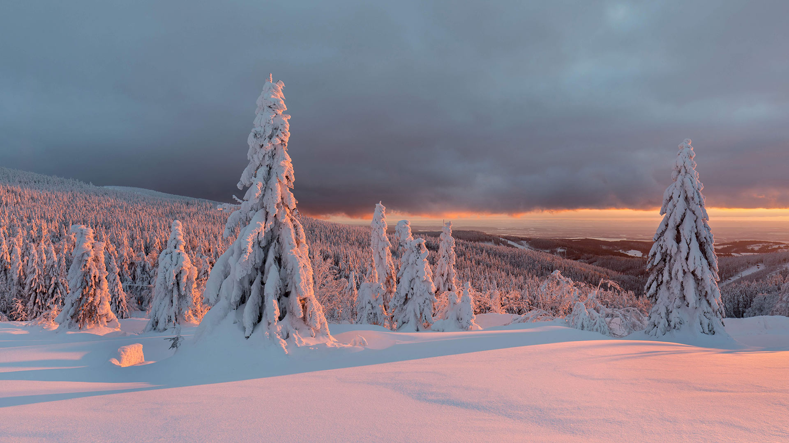
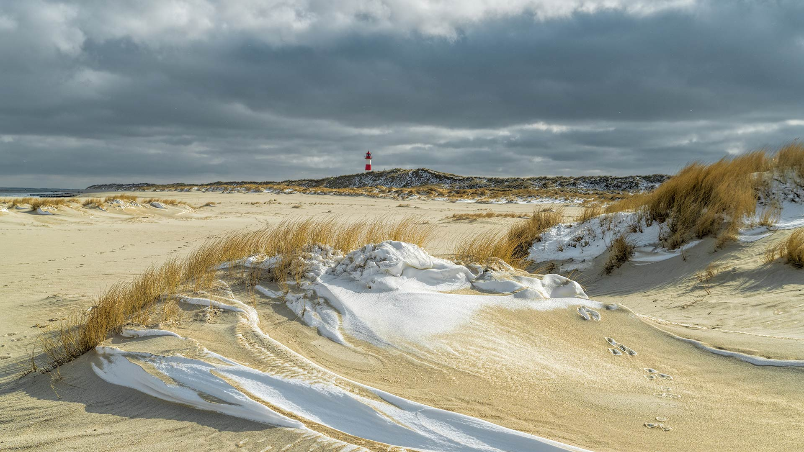
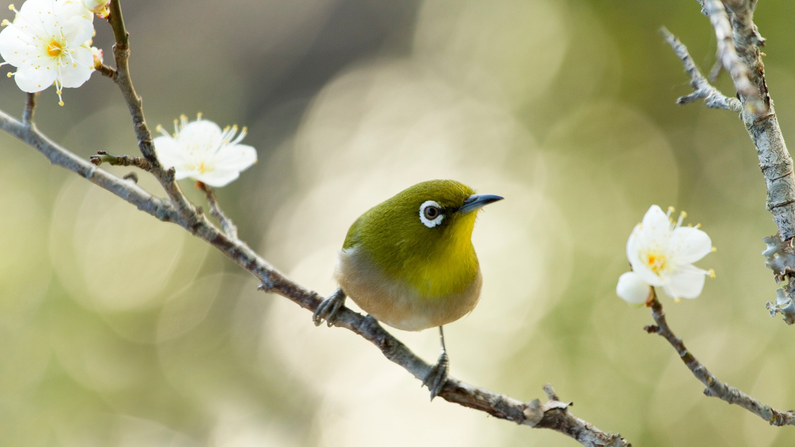
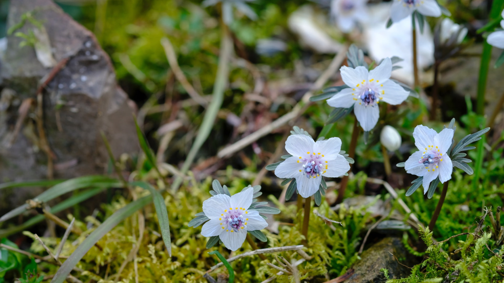

#### 20210228 Turf farmhouses at Skaftafell, Vatnajökull National Park, Iceland (© Jarcosa/Getty Images)

#### 20210227 Twin polar bear cubs asleep in a snow den in Wapusk National Park, Manitoba, Canada (© AF archive/Alamy)

#### 20210227 鸟瞰施内贝格山脉-奥克森峰，德国 (© Felix Meyer/Adobe Stock)

#### 20210226 Red lanterns hanging in Jinli Street, Chengdu, China (© Philippe LEJEANVRE/Getty Images)

#### 20210225 Almond blossoms overlooking Trevi, Umbria, Italy (© Maurizio Rellini/eStock Photo)

#### 20210224 Le Morne Brabant, Mauritius (© Hemis/Alamy)

#### 20210223 ｢皇居外苑｣東京都, 千代田区 (© Sean Pavone/Shutter.com)

#### 20210223 Winterliche Morgenstimmung am Kloster Andechs in Bayern mit Blick auf den Ammersee (© Reinhard Schmid/Huber/eStock Photo)

#### 20210222 莱姆里杰斯的Cobb防波堤，英格兰多塞特 (© Ross Hoddinott/Offset by Shutterstock)

#### 20210222 Cascade du Nideck gelée, Oberhaslach, Alsace (© Philippe Sainte-Laudy Photography/Getty Images)

#### 20210222 'Invisible Man,' a memorial to Ralph Ellison in Riverside Park, New York City (© Randy Duchaine/Alamy)

#### 20210221 Porto, Portugal (© Kanuman/Shutterstock)

#### 20210220 Dalmatian pelicans on ice, Lake Kerkini, Greece (© Guy Edwardes/Minden Pictures)

#### 20210220 Clearing snowstorm, Yosemite National Park, California (© Jeff Lewis/Tandem Stills + Motion)

#### 20210219 Parrotfish off the coast of Negros Oriental province in the Philippines (© Tim Fitzharris/Minden Pictures)

#### 20210218 Rocks in the Verzasca River near the hamlet of Lavertezzo in the Valle Verzasca of Switzerland (© Robert Seitz/Offset by Shutterstock)

#### 20210217 Perito Moreno Glacier in Patagonia's Los Glaciares National Park, Argentina (© Juergen Schonnop/Getty Images)

#### 20210217 ｢三十槌の氷柱｣埼玉県, 秩父市 (©  Mommyphoto/Shutter.com)

#### 20210216 Flowers and an ironwork fence in front of a house in New Orleans, Louisiana (© Lauren Mitchell/Offset by Shutterstock)

#### 20210216 Eingeschneite Arberkapelle am Großen Arber, Niederbayern, Bayern (© Cornelia Dörr/Huber/eStock Photo)

#### 20210215 Le lac de Longemer dans les Vosges, Lorraine, France. (© art4stock/Shutterstock)

#### 20210215 Ski lifts in Whistler, B.C. (© Ben Girardi/Cavan Images)

#### 20210215 安加白令嘉河与诺朗加港，南澳大利亚州 (© plainpicture/AWL/Marco Bottigelli)

#### 20210215 Lincoln Memorial in Washington, DC (© White House Photo/Alamy)

#### 20210214 Ocean waves crashing over a heart-shaped rock island off the coast of Sydney, Australia (© Kristian Bell/Getty Images)

#### 20210213 Porto, Portugal (© Kanuman/Shutterstock)

#### 20210213 Canada Jay (Perisoreus canadensis) in light snowfall, Ontario (© Alan Murphy/Minden Pictures)

#### 20210213 Eastern bluebirds in Charlotte, North Carolina (© Elizabeth W. Kearley/Getty Images)

#### 20210212 Muskox with newborn in the central Arctic coastal plain of Alaska (© Steven Kazlowski/Danita Delimont)

#### 20210212 ｢ジャイアントパンダ｣中国, 四川省 (© Lynn M. Stone/Minden Pictures)

#### 20210212 【新年快乐】 （ © Kilito Chan ）

#### 20210211 【今日除夕】（© DANNY HU）

#### 20210211 Die Insel Christlieger im Königssee, Bayern (© Dariusz Slowik/EyeEm/Getty Images)

#### 20210211 Flowering almond trees in California's Central Valley (© Jeffrey Lewis/Tandem Stills + Motion)

#### 20210210 Nieve penitente ice formations seen on Agua Negra Pass in the Coquimbo Region of the Andes, Chile (© Art Wolfe/Danita Delimont)

#### 20210209 Moon dog photographed at Hug Point Falls on the Oregon coast (© Ben Coffman/Tandem Stills + Motion)

#### 20210208 Scène hivernale dans les montagnes et soleil couchant, France (© Michal Balada/iStock/Getty Images Plus)

#### 20210208 勃朗峰高山冰川上的徒步者，法国夏慕尼 (© agustavop/Getty Images)

#### 20210208 John Lewis hero mural by Sean Schwab in the Sweet Auburn district of Atlanta, Georgia (© Ilene Perlman/Alamy)

#### 20210208 Winter Skyline featuring the Château Frontenac tower, Quebec City (© NicolasMcComber/Getty Images)

#### 20210207 Great gray owls in Montreal, Canada (© rollandgelly/Getty Images)

#### 20210207 Dusk over a marina in Sandy Bay, Hobart, Tasmania (© Jochen Schlenker/Masterfile)

#### 20210206 Mount Sefton in Aoraki/Mount Cook National Park, South Island, New Zealand (© AWL Images/Danita Delimont)

#### 20210205 'The Wave' sandstone formation with pools of water in Vermilion Cliffs National Monument, Arizona (© Dennis Frates/Alamy)

#### 20210204 Northern Vosges Regional Nature Park, France (© Michel Rauch/Minden Pictures)

#### 20210204 Strand der Insel Sylt, Schleswig-Holstein, im Winter (© RelaxFoto.de/iStock/Getty Images Plus)

#### 20210204 Onkaparinga River, Port Noarlunga, South Australia (© plainpicture/AWL/Marco Bottigelli)

#### 20210203 ｢白梅とメジロ｣東京都 (© Takao Onozato/Aflo)

#### 20210203 Colossal limestone statues on Mount Nemrut, Adıyaman, Turkey (© Peerakit JIrachetthakun/Getty Images)

#### 20210202 ｢セツブンソウ｣広島県 (© Tamotsu Ito/Shutterstock.com)

#### 20210202 Marmot with the peak of Grossglockner in the background, Austria (© SeppFriedhuber/Getty Images)

#### 20210201 Panoramic view of the city of Toledo after sunset, Spain (© Frank Fischbach/Alamy)

#### 20210201 Spirit Island during winter season, Maligne Lake, Jasper National Park, Alberta (© Natapong Supalertsophon/Getty Images)

#### 20210201 Smithsonian National Museum of African American History and Culture, Washington, DC (© tse Pui Lung/Alamy)

