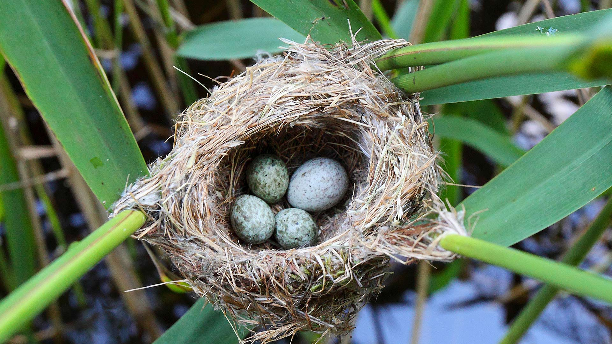
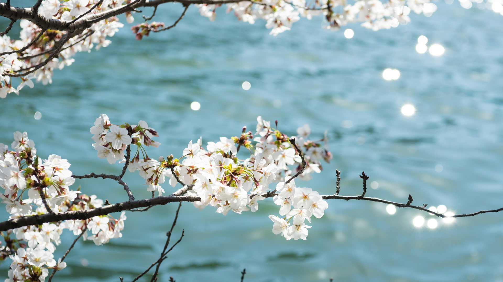
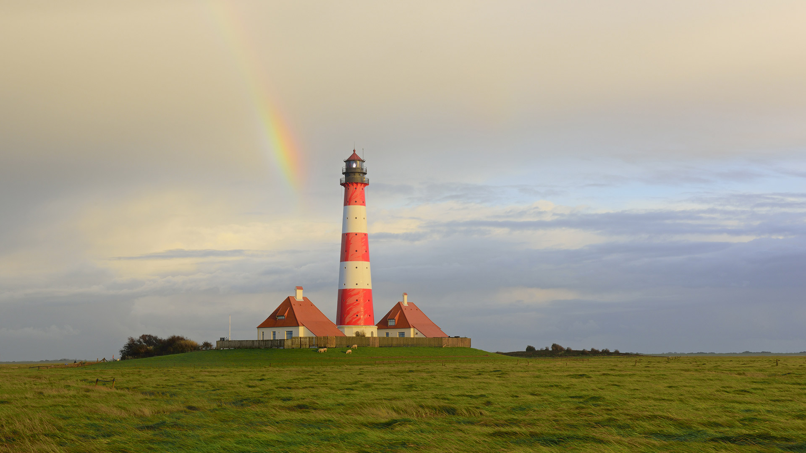
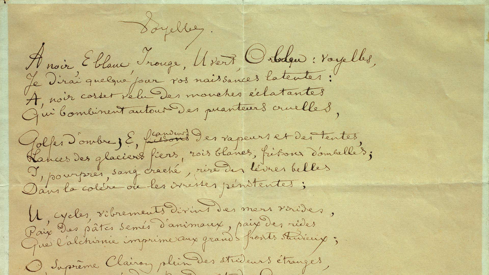
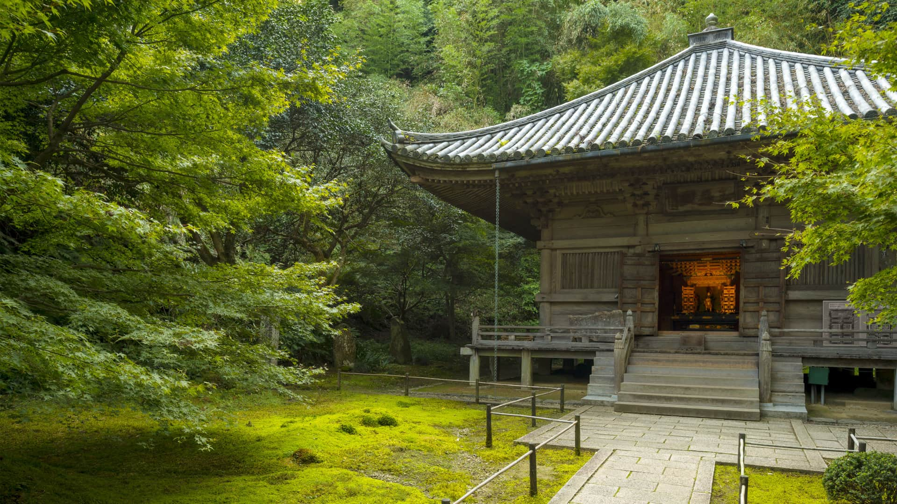
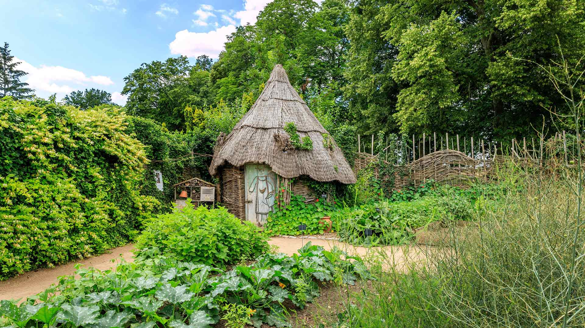
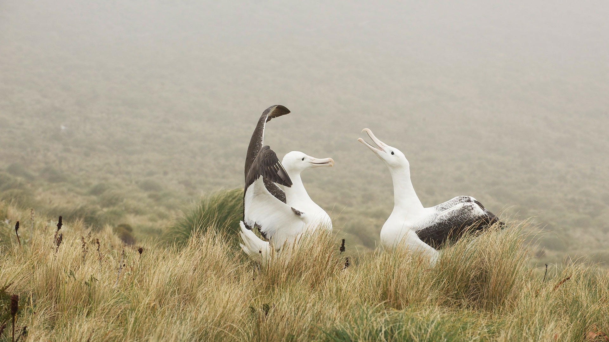

#### 20210331 Raja Ampat, an archipelago in Indonesia (© Amazing Aerial Agency/Offset by Shutterstock)

#### 20210330 Detail of an ostrich fern in spring, Washington state (© Stephen Matera/Tandem Stills + Motion)

#### 20210330 A close-up of bunchberry in Rose Blanche, Newfoundland (© Mike Grandmaison/Jaynes Gallery/DanitaDelimont.com)

#### 20210330 Kuckucksei im Nest eines Teichrohrsängers, Deutschland (© blickwinkel/Alamy Stock Photo)

#### 20210330 La porte d’Aval et l’Aiguille, Étretat, Normandie (© StevanZZ/Alamy Stock Photo)

#### 20210329 Reynisdrangar (basalt rock formations) on Reynisfjara Beach, Iceland (© Cavan Images/Getty Images)

#### 20210328 Lightning striking over 70 Mile Butte and Sleeping Lion Butte, Grasslands National Park, Saskatchewan (© Design Pics/DanitaDelimont.com)

#### 20210328 Un lièvre variable courant sur les Hautes-Terres d’Écosse,  (© SCOTLAND: The Big Picture/Minden Pictures)

#### 20210328 Astronomische Uhr in der Kathedrale von Lyon, Frankreich (© kyolshin/Alamy)

#### 20210328 斯诺登山与兰贝里斯山口，英国史诺多尼亚国家公园 (© Alan Novelli/Alamy)

#### 20210328 The Jefferson Memorial during the National Cherry Blossom Festival in Washington, DC (© Rae Gabrielle/Alamy)

#### 20210327 L’horloge astronomique de la Cathédrale Saint-Pierre de Beauvais (© Catherine Leblanc/Godong/Getty Images)

#### 20210327 ｢川辺の桜｣ 大阪府  (© Bongsub Kim/offset by shutterstock)

#### 20210327 Mountain hare running across snow-covered upland, Scotland (© SCOTLAND: The Big Picture/Minden Pictures)

#### 20210327 Cradle-Mountain-Lake-St.-Clair-Nationalpark, Tasmanien, Australien (© Paparwin Tanupatarachai/Getty Images)

#### 20210326 ｢千鳥ヶ淵の夜桜｣東京都, 千代田区 (© Jon Arnold/Danita Delimont)

#### 20210326 Steinbogenbrücke beim Saut du Brot in der Areuse-Schlucht, Neuenburg, Schweiz (© Andreas Gerth/eStock Photo)

#### 20210326 Cradle Mountain-Lake St. Clair National Park, Tasmania, Australia (© Paparwin Tanupatarachai/Getty Images)

#### 20210326 Spring ice along the shore of Lake Winnipeg, Manitoba, Canada (© Mike Grandmaison/Jaynes Gallery/DanitaDelimont.com)

#### 20210325 Common rhododendrons in Semper Forest Park, Ruegen, Germany (© Sandra Bartocha/Minden Pictures)

#### 20210325 Ancient Roman gold mining site of Las Médulas, León province, Spain (© David Santiago Garcia/Getty Images)

#### 20210325 Eine Blaumeise zwischen Gelben Narzissen, Wales, Vereinigtes Königreich (© Philip Jones/Alamy)

#### 20210324 Humpback whale mother pushes her sleeping calf to the surface, Maui, Hawaii (© Ralph Pace/Minden Pictures)

#### 20210323 Satellite image of the Mania River in Madagascar (© NASA Earth Observatory image by Joshua Stevens, using Landsat data from the US Geological Survey)

#### 20210322 Tuskegee Airmen reading a map (© Bettmann/Getty Images)

#### 20210322 Mount Etna erupting in 2013, Sicily, Italy (© Wead/Alamy Live News)

#### 20210322 汝拉山中的Chateau de Joux堡，法国 (© Ivoha/Alamy)

#### 20210322 Die Zugspitze spiegelt sich im Eibsee, Grainau, Werdenfelser Land, Bayern (© Martin Siepmann/Westend61/offset by shutterstock)

#### 20210321 Bluebell flowers carpet the Hallerbos forest floor, Flanders, Belgium (© Jason Langley/plainpicture)

#### 20210320 Sundial on Parnidis Dune, Curonian Spit, Lithuania (© amoklv/Getty Images)

#### 20210319 Aerial view of the City of Adelaide shipwreck with trees growing on it, Magnetic Island, Queensland, Australia (© Amazing Aerial Agency/Offset by Shutterstock)

#### 20210318 View of Tofino Bay, Vancouver, B.C. (© Ben Kotenberg/Shutterstock)

#### 20210318 Mount Etna erupting in 2013, Sicily, Italy (© Wead/Alamy Live News)

#### 20210317 Inishmore, the largest of the Aran Islands in Galway Bay, Ireland (© Chris Hill/Minden Pictures)

#### 20210316 Giant panda cub at Bifengxia Panda Base, Sichuan, China (© Suzi Eszterhas/Minden Pictures)

#### 20210315 Regenbogen über dem Leuchtturm Westerheversand, Westerhever, Schleswig-Holstein (© Sandra Bartocha/Minden Pictures)

#### 20210314 Screech owl resting in a tree cavity, Massapequa Preserve, Long Island, New York (© Vicki Jauron, Babylon and Beyond Photography/Getty Images)

#### 20210314 Astronomical clock, Lyon, France (© kyolshin/Alamy)

#### 20210313 Manuscrit du poème « Les Voyelles » par Arthur Rimbaud (1854-1891),  Musée Arthur Rimbaud, Charleville-Mezieres (© Photo by: Christophel Fine Art/Universal Images Group via Getty Images)

#### 20210313 Common rhododendrons in Semper Forest Park, Rügen, Germany (© Sandra Bartocha/Minden Pictures)

#### 20210313 Frühlingseis am Ufer des Winnipegsees, Provinz Manitoba, Kanada (© Mike Grandmaison/Jaynes Gallery/Danita Delimont)

#### 20210312 ｢東大寺二月堂｣奈良県, 奈良市 (© Hiroshi Watanabe/Shutterstock)

#### 20210312 倒映在艾布湖上的楚格峰，德国巴伐利亚 (© Martin Siepmann/Westend61/Offset by Shutterstock)

#### 20210312 A balloon flies over the Pyramid of the Sun at sunrise in Teotihuacan, Mexico (© Marco Ugarte/AP Photo)

#### 20210311 ｢円通院の三慧殿｣宮城県, 松島町 (© Mark Schwettmann/Shutterstock)

#### 20210311 Thor's Well at Cape Perpetua on the Oregon coast (© Cavan Images/Offset by Shutterstock)

#### 20210310 Snow and ice along the shoreline of Lake Superior in winter; Thunder Bay, Ontario (© plainpicture/Design Pics/Susan Dykstra)

#### 20210310 被阿尔卑斯山环抱的辛特湖，德国贝希特斯加登 (© Offset by Shutterstock)

#### 20210310 'Step on Board,' the Harriet Tubman Memorial, sculpted by Fern Cunningham, in Boston, Massachusetts (© Anthony Pleva/Alamy)

#### 20210309 Foothills of the Diablo Range in the East Bay region of Northern California (© Jeff Lewis/Tandem Stills + Motion)

#### 20210309 Aerial image of Mount Logan rising above the clouds in Kluane National Park and Reserve, Yukon, Canada (© Robert Postma/plainpicture)

#### 20210308 View of the Notorious RBG mural by the street artist Elle in New York City (© lev radin/Alamy)

#### 20210308 ｢フリーダ・カーロの壁画｣メキシコ, メキシコシティ (© Jessica Sample/Gallery Stock)

#### 20210307 Great blue herons in the Wakodahatchee Wetlands, Delray Beach, Florida (© Marie Hickman/Getty Images)

#### 20210307 Hutte en osier dans le potager du parc floral de la Source, Orléans (© Hervé Lenain/Alamy Stock Photo)

#### 20210306 Blumen in einem Vorgarten in New Orleans, Louisiana, USA (© Lauren Mitchell/Offset by Shutterstock)

#### 20210306 Komodo National Park, Indonesia (© Thrithot/Adobe Stock)

#### 20210305 Mineral-laden water in the Rio Tinto, Minas de Riotinto mining area, Huelva province, Andalusia, Spain (© David Santiago Garcia/Getty Images)

#### 20210304 Aerial image of Mount Logan rising above the clouds in Kluane National Park, Yukon (© plainpicture/Design Pics/Robert Postma)

#### 20210304 Nusa Dua coast with breakwater, Bali, Indonesia (© Dkart/Getty Images)

#### 20210303 Female lions in the forest surrounding Lake Nakuru, Kenya (© Scott Davis/Tandem Stills + Motion)

#### 20210303 「素盞鳴神社雛段飾りのつるし飾り」静岡県 (© Kosei Saito/Getty Images)

#### 20210302 Volcano Llaima with Araucaria trees in the foreground, Conguillío National Park, Chile (© Fotografías Jorge León Cabello/Getty Images)

#### 20210301 A section of a large mosaic of Ida B. Wells displayed at Union Station in Washington, DC, in August 2020 (© Manuel Balce Ceneta/AP Photo)

#### 20210301 Couple d’albatros royal jouant sur l’île Campbell, Nouvelle-Zélande (© Mike Potts/Minden)

#### 20210301 威尔士中部水仙花中的蓝山雀 (© Philip Jones/Alamy)

