#### 20210314 里昂天文钟，法国里昂 (© kyolshin/Alamy)

#### 20210313 Manuscrit du poème « Les Voyelles » par Arthur Rimbaud (1854-1891),  Musée Arthur Rimbaud, Charleville-Mezieres (© Photo by: Christophel Fine Art/Universal Images Group via Getty Images)

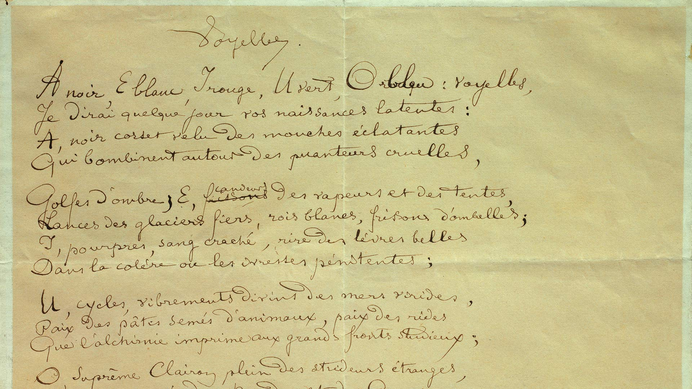

#### 20210313 Common rhododendrons in Semper Forest Park, Rügen, Germany (© Sandra Bartocha/Minden Pictures)

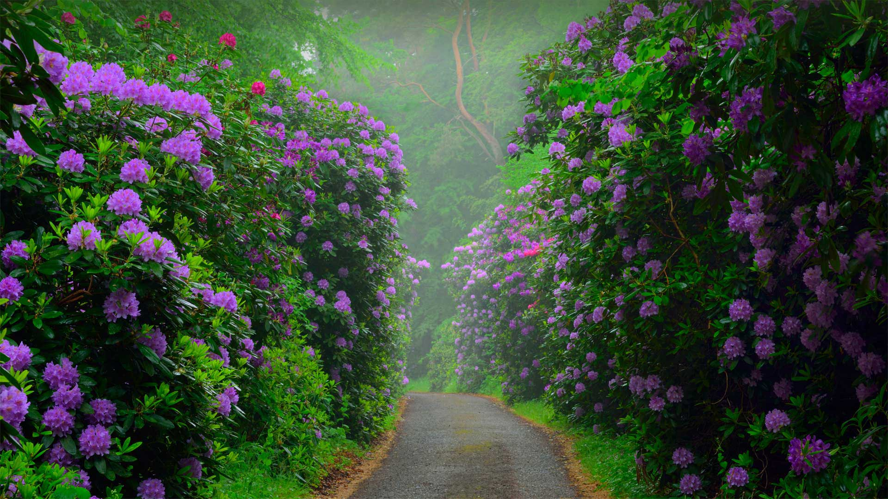

#### 20210313 Frühlingseis am Ufer des Winnipegsees, Provinz Manitoba, Kanada (© Mike Grandmaison/Jaynes Gallery/Danita Delimont)

#### 20210312 ｢東大寺二月堂｣奈良県, 奈良市 (© Hiroshi Watanabe/Shutterstock)

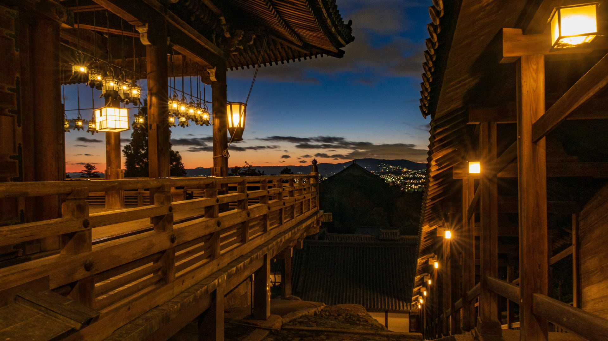

#### 20210312 倒映在艾布湖上的楚格峰，德国巴伐利亚 (© Martin Siepmann/Westend61/Offset by Shutterstock)

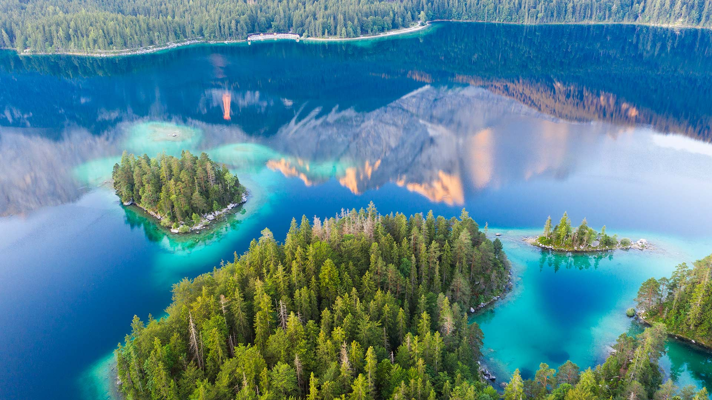

#### 20210312 A balloon flies over the Pyramid of the Sun at sunrise in Teotihuacan, Mexico (© Marco Ugarte/AP Photo)

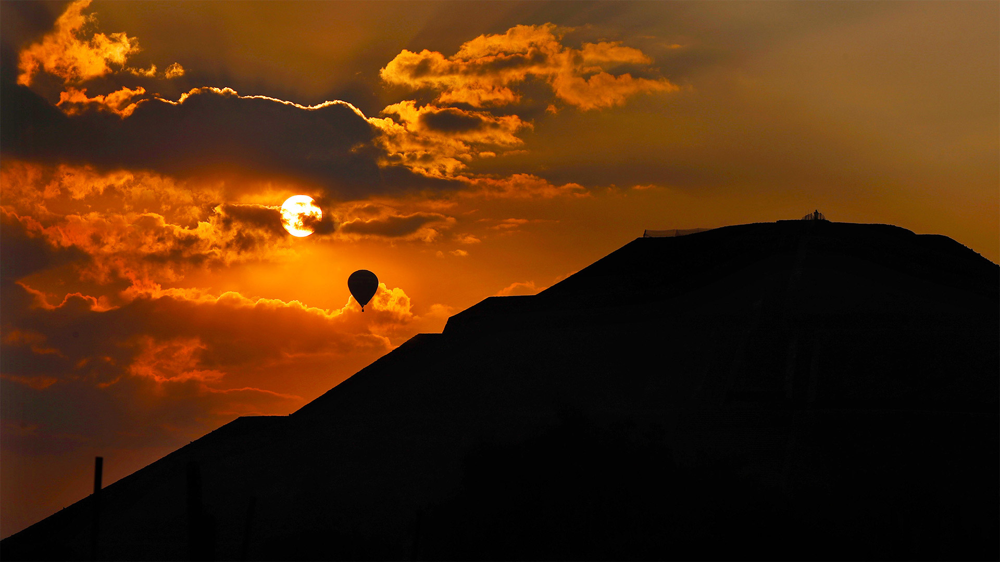

#### 20210311 ｢円通院の三慧殿｣宮城県, 松島町 (© Mark Schwettmann/Shutterstock)

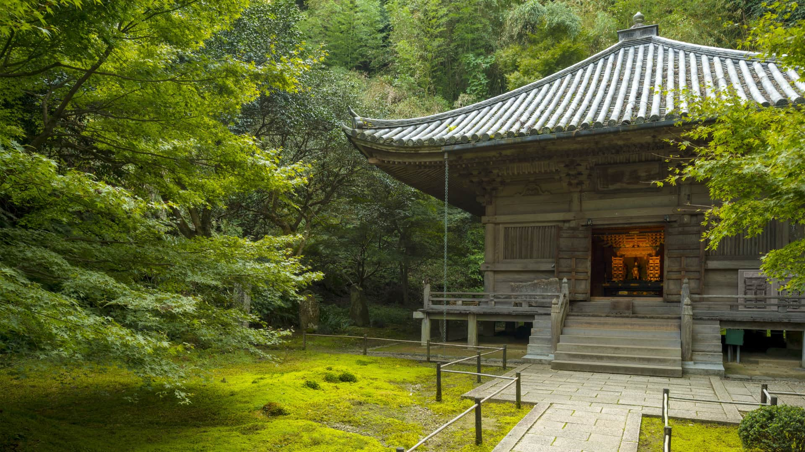

#### 20210311 Thor's Well at Cape Perpetua on the Oregon coast (© Cavan Images/Offset by Shutterstock)

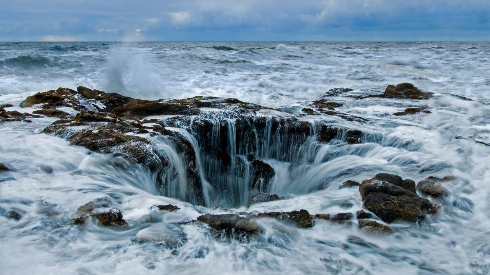

#### 20210310 Snow and ice along the shoreline of Lake Superior in winter; Thunder Bay, Ontario (© plainpicture/Design Pics/Susan Dykstra)

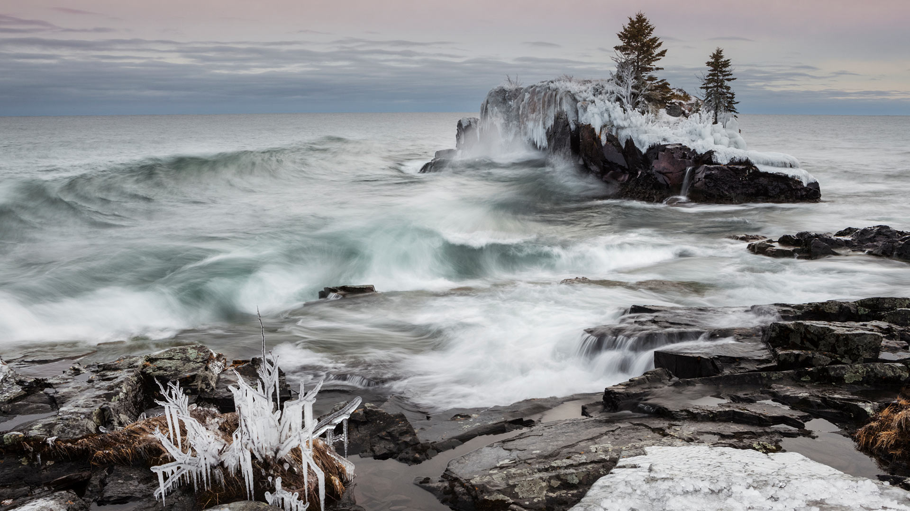

#### 20210310 被阿尔卑斯山环抱的辛特湖，德国贝希特斯加登 (© Offset by Shutterstock)

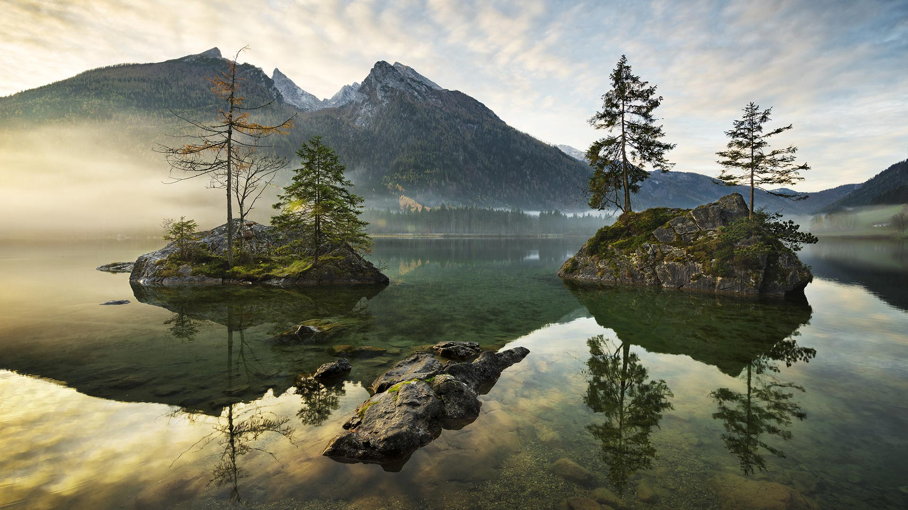

#### 20210310 'Step on Board,' the Harriet Tubman Memorial, sculpted by Fern Cunningham, in Boston, Massachusetts (© Anthony Pleva/Alamy)

#### 20210309 Foothills of the Diablo Range in the East Bay region of Northern California (© Jeff Lewis/Tandem Stills + Motion)

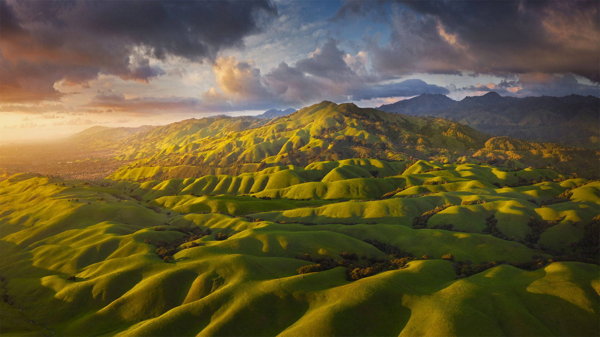

#### 20210308 View of the Notorious RBG mural by the street artist Elle in New York City (© lev radin/Alamy)

#### 20210308 ｢フリーダ・カーロの壁画｣メキシコ, メキシコシティ (© Jessica Sample/Gallery Stock)

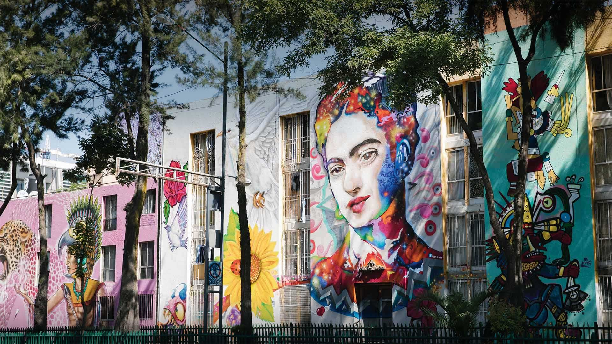

#### 20210307 Great blue herons in the Wakodahatchee Wetlands, Delray Beach, Florida (© Marie Hickman/Getty Images)

#### 20210307 Hutte en osier dans le potager du parc floral de la Source, Orléans (© Hervé Lenain/Alamy Stock Photo)

#### 20210306 Blumen in einem Vorgarten in New Orleans, Louisiana, USA (© Lauren Mitchell/Offset by Shutterstock)

#### 20210306 Komodo National Park, Indonesia (© Thrithot/Adobe Stock)

#### 20210305 Mineral-laden water in the Rio Tinto, Minas de Riotinto mining area, Huelva province, Andalusia, Spain (© David Santiago Garcia/Getty Images)

#### 20210304 Aerial image of Mount Logan rising above the clouds in Kluane National Park, Yukon (© plainpicture/Design Pics/Robert Postma)

#### 20210304 Nusa Dua coast with breakwater, Bali, Indonesia (© Dkart/Getty Images)

#### 20210303 Female lions in the forest surrounding Lake Nakuru, Kenya (© Scott Davis/Tandem Stills + Motion)

#### 20210303 「素盞鳴神社雛段飾りのつるし飾り」静岡県 (© Kosei Saito/Getty Images)

#### 20210302 Volcano Llaima with Araucaria trees in the foreground, Conguillío National Park, Chile (© Fotografías Jorge León Cabello/Getty Images)

#### 20210301 A section of a large mosaic of Ida B. Wells displayed at Union Station in Washington, DC, in August 2020 (© Manuel Balce Ceneta/AP Photo)

#### 20210301 Couple d’albatros royal jouant sur l’île Campbell, Nouvelle-Zélande (© Mike Potts/Minden)

#### 20210301 威尔士中部水仙花中的蓝山雀 (© Philip Jones/Alamy)

