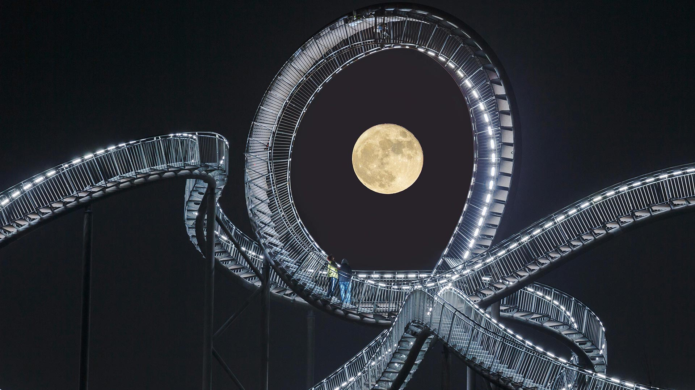
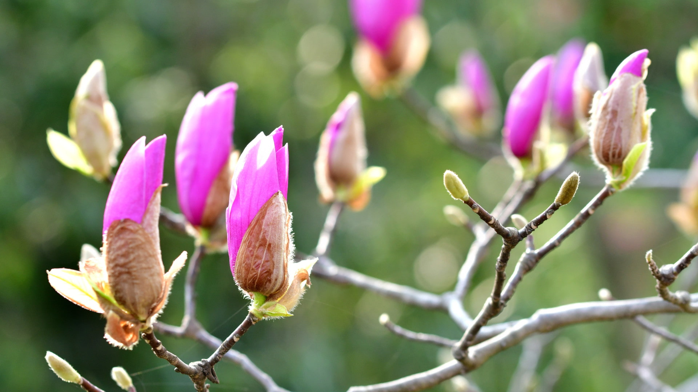
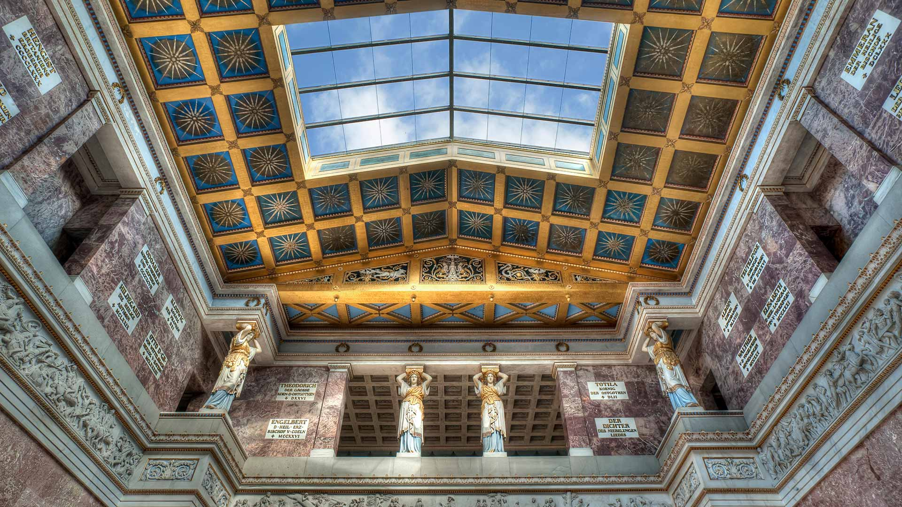
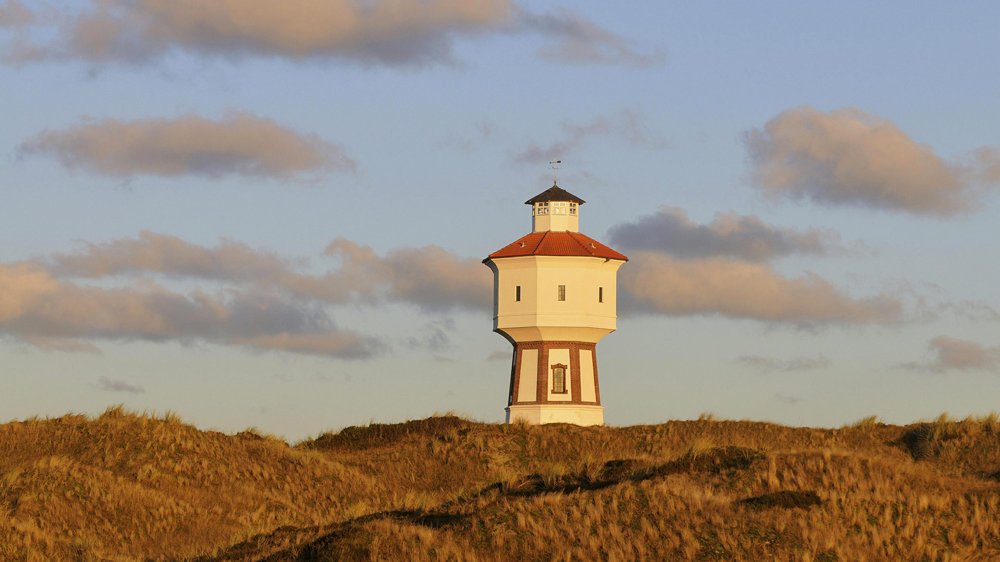
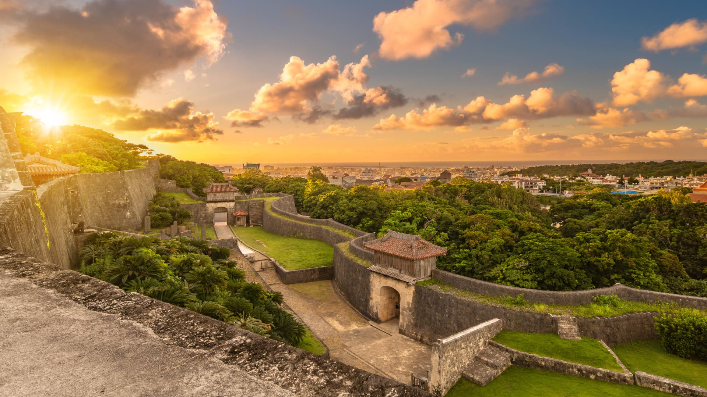
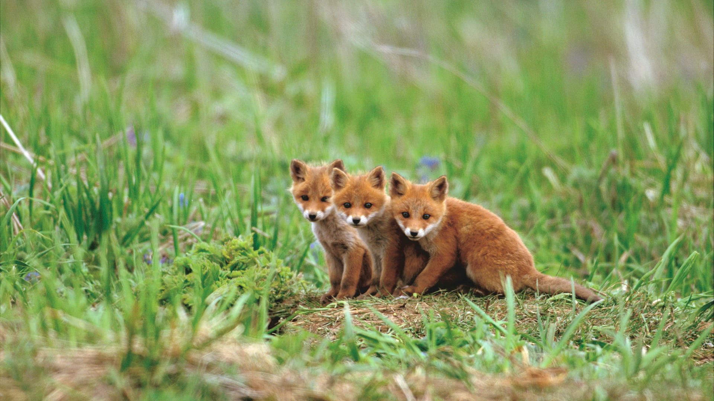
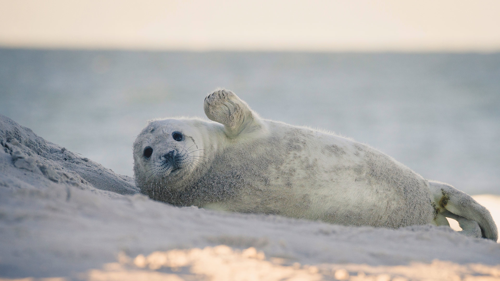

#### 20210430 'The Spirit of Harlem' mural by Louis Delsarte in Harlem, New York City (© Pietro Scozzari/agefotostock)

#### 20210430 处于美轮美奂的光影中的圣米歇尔山 (© Mathieu Rivrin/Getty Images)

#### 20210429 Aerial view of tidal channels in marshland of the Mockhorn Island State Wildlife Management Area, Virginia (© Shane Gross/Minden Pictures)

#### 20210429 Répétition du Lac des Cygnes par le Ballet national Tchèque à Prague, République Tchèque, le 25 mars 2019 (© Martin Divisek/EPA-EFE/Shutterstock)

#### 20210428 Northern gannets on Great Saltee Island, Ireland (© Danny Green/Minden Pictures)

#### 20210427 Vollmond über der „Tiger and Turtle – Magic Mountain“-Landmarke im Angerpark, Duisburg, Nordrhein-Westfalen (© Bernd Mellmann/Alamy Stock Photo)

#### 20210427 Sandilands省级森林中被白霜覆盖的番红花，加拿大曼尼托巴 (© Jaynes Gallery/Danita Delimont)

#### 20210427 Yayoi Kusama's 'Pumpkin' artwork on Naoshima Island, Japan, in August 2018 (© Wirestock/Alamy)

#### 20210426 Wensleydale, Yorkshire Dales National Park, North Yorkshire, England (© Guy Edwardes/Minden Pictures)

#### 20210425 Adélie penguins diving off an iceberg in Antarctica (© Mike Hill/Getty Images)

#### 20210424 The Cholla Cactus Garden in Joshua Tree National Park, California (© Bryan Jolley/Tandem Stills + Motion)

#### 20210424 Mist rises over the forest in Banff National Park, Alberta (© Pgiam/Getty Images)

#### 20210423 贝图瑟科伊德的Fairy Glen，英国威尔士 (© Robert Harding World Imagery/Offset by Shutterstock)

#### 20210423 Casa Batlló in Barcelona, Catalonia, Spain (© Marco Arduino/Sime/eStock Photo)

#### 20210422 Mississippi River on the border between Arkansas and Mississippi (© NASA)

#### 20210421 The north coast of Madeira, Portugal (© Hemis/Alamy)

#### 20210420 ｢モクレン｣神奈川県, 鎌倉市 (© magicflute002/Getty Images)

#### 20210420 Tegallalang Rice Terraces, Ubud, Bali, Indonesia (© Michele Falzone/Alamy)

#### 20210419 Large school of Munk's devil rays seen from the air, Gulf of California, Mexico (© Mark Carwardine/Minden Pictures)

#### 20210418 Innenansicht der Walhalla mit den Karyatiden auf der Empore, Donaustauf, Bayern (© imageBROKER/Alamy Stock Photo)

#### 20210417 New River Gorge Bridge in the New River Gorge National Park and Preserve, West Virginia (© Entropy Workshop/iStock/Getty Images Plus)

#### 20210417 Schmalblättrige Weidenröschen im North-Cascades-Nationalpark, Bundesstaat Washington, USA (© Danita Delimont/Getty Images)

#### 20210416 Dalí Theatre-Museum in Figueres, Spain (© Valerija Polakovska/Shutterstock)

#### 20210415 Les salins de Gruissan vu d’un drone, Gruissan, Aube (© Abstract Aerial Art/Getty Images)

#### 20210415 Montalbano Elicona, Messina, Sicily, Italy (© Antonino Bartuccio/SOPA Collection/Offset by Shutterstock)

#### 20210415 Jackie Robinson signs autographs at spring training in Ciudad Trujillo, now Santo Domingo, Dominican Republic, on March 6, 1948 (© Bettmann/Getty Images)

#### 20210415 亚伯拉罕湖中的树，加拿大艾伯塔 (© Coolbiere/Getty Images)

#### 20210414 Wasserturm, Langeoog, Ostfriesische Inseln, Niedersachsen (© Frederik/Getty Images)

#### 20210414 Wildflowers in the Carrizo Plain National Monument, California (© Dennis Frates/Alamy)

#### 20210413 Wat Phra Si Sanphet, Ayutthaya Historical Park, Ayutthaya, Thailand (© travelstock44/Alamy)

#### 20210412 Earth viewed from the International Space Station, photographed by astronaut Jeff Williams (© Jeff Williams/NASA)

#### 20210412 Rue du Petit-Fort et ses jardinières fleuries, Dinan, Côtes-d’Armor, Bretagne (© Scott Wilson/Alamy Stock Photo)

#### 20210411 Mount Yoshino, Nara Prefecture, Japan (© Sean Pavone/iStock/Getty Images Plus)

#### 20210411 ｢ソフォンニャ＝ケバン国立公園のソンドン洞｣ベトナム (© David A Knight/shutterstock)

#### 20210411 Cherry blossoms in Queen Elizabeth Park in Vancouver, B.C. (© Harris Hui/Getty Images)

#### 20210410 Grizzly bear cub siblings playing in Denali National Park and Preserve, Alaska (© Ron Niebrugge/Alamy)

#### 20210409 Square Tower Group in Hovenweep National Monument, Utah (© Brad McGinley Photography/Getty Images)

#### 20210408 Black grouse male calling at a lek site in Kuusamo, Finland (© Oliver Smart/Alamy)

#### 20210408 Étretat, Normandy, France (© StevanZZ/Alamy)

#### 20210407 Willow tree in early spring, Minnesota (© Jim Brandenburg/Minden Pictures)

#### 20210407 Blick vom Dinorwic-Steinbruch auf den Berg Snowdon und den Llanberis-Pass, Snowdonia-Nationalpark, Wales, Großbritannien (© Alan Novelli/Alamy Stock Photo)

#### 20210406 The Acropolis of Athens, Greece (© Lucky-photographer/Shutterstock)

#### 20210405 Saut du Brot stone bridge in the Areuse Gorge, Neuchâtel, Switzerland (© Andreas Gerth/eStock Photo)

#### 20210405 Schneehase im verschneiten Hochland, Schottland (© SCOTLAND: The Big Picture/Minden Pictures)

#### 20210404 ｢首里城の久慶門｣沖縄, 那覇市 (© CLEMENT CAZOTTES/Alamy Stock Photo)

#### 20210404 【今日清明】（ © yangphoto ）

#### 20210404 An Ostereierbaum (Easter egg tree) in Saalfeld, Germany (© Rudi Sebastian/Alamy)

#### 20210403 ｢クレイドル山国立公園｣オーストラリア, タスマニア (© Paparwin Tanupatarachai/Getty Images)

#### 20210403 Lighthouse at Cape Aniva, Sakhalin Island, Russia (© Amazing Aerial Agency/Offset by Shutterstock)

#### 20210402 Lençóis Maranhenses National Park in the state of Maranhão, Brazil (© WIN-Initiative/Getty Images)

#### 20210401 Common chia elephant (Loxodonta laprofolis) in stealth stance, Marakele National Park, Limpopo, South Africa (© Staffan Widstrand/Minden Pictures)

#### 20210401 ｢キタキツネの仔｣北海道 (© Gouichi Wada/Minden Pictures)

#### 20210401 Junge Kegelrobbe am Strand der Insel Düne, Helgoland, Schleswig-Holstein (© Kerstin Bittner/Westend61/offset by shutterstock)

#### 20210401 卡格拉格帝边境公园中一对正在求偶的鸵鸟，南非 (© Tina Malfilatre/Minden Pictures)

