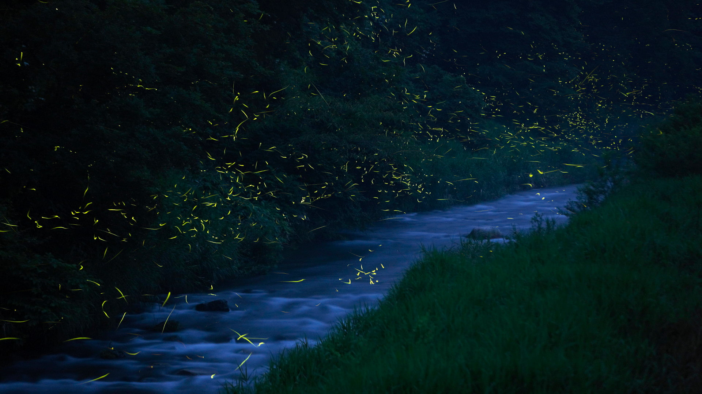
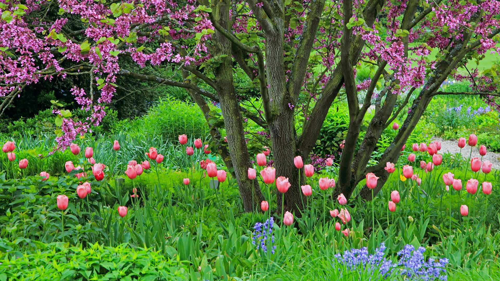
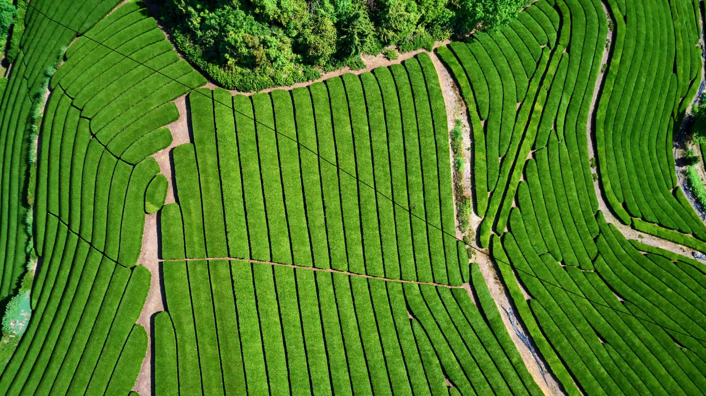
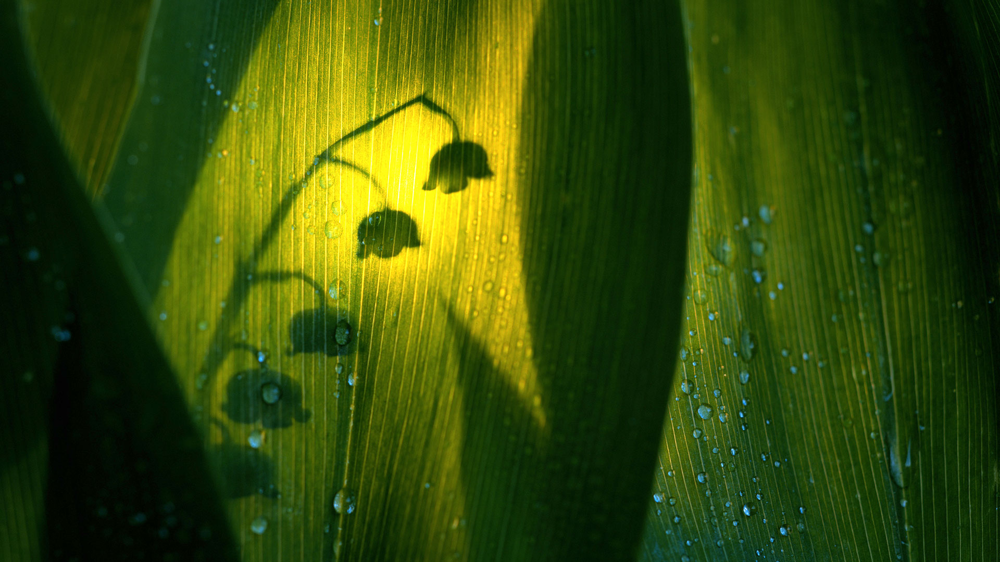

#### 20210531 A pair of adult bald eagles (Haliaeetus leucocephalus) with chick at Yukon River, Yukon (© Mark Newman/Minden Pictures)

#### 20210531 Military Women's Memorial, located at the gateway to Arlington National Cemetery, Virginia (© Brycia James/Getty Images)

#### 20210531 新天鹅堡附近Pöllat峡谷的瀑布，德国巴伐利亚 (© Gary Whitton/Alamy)

#### 20210531 ｢エル・カミニート・デル・レイ｣スペイン, マラガ (© Ken Welsh/Alamy)

#### 20210530 California sea lion in a forest of giant kelp near the Channel Islands of California (© Nature Picture Library/Alamy)

#### 20210530 Maman loutre de mer et son nouveau-né, baie de Monterey, Californie, États-Unis (© Suzi Eszterhas/Minden Pictures)

#### 20210530 ｢ノームズヴィル｣オーストラリア, ウェリントン・ミル (© Amanda Hughes/Alamy)

#### 20210529 Alley and bamboo grove in Wuhou Temple, Chengdu, Sichuan province, China (© Eastimages/Getty Images)

#### 20210529 ｢福万来ホタル乃国｣鳥取県, 日南町 (© Yukihiro Fukuda/NPL/Minden Pictures)

#### 20210528 Robin's nest with a brown-headed cowbird egg (© Edward Kinsman/Science Photo Library)

#### 20210528 Die Skulptur „Den Uendelige Bro“ („Die unendliche Brücke“) in Aarhus, Dänemark. Entworfen von den dänischen Architekten Niels Povlsgaard and Johan Gjødes (© Kosmaj/Shutterstock)

#### 20210527 马哈拉施特拉邦的Varandha Ghat，印度 (© AmitRane1975/iStock/Getty Images Plus)

#### 20210527 'I Can Hear It,' an installation by artist Ivars Drulle on the beach by the villages of Middelkerke and Westende, Belgium (© Arterra Picture Library/Alamy)

#### 20210527 ｢アサバスカ氷河｣カナダ, アルバータ州 (© Paul Zizka/Aurora Photos)

#### 20210526 The total lunar eclipse of April 4, 2015, photographed over Monument Valley, Utah (© Alan Dyer/Alamy)

#### 20210526 Château de Joux, Bourgogne-Franche-Comté, Frankreich (© Ivoha/Alamy Stock Photo)

#### 20210525 Sperm whale off the coast of Roseau, Dominica, in the Caribbean Sea (© Tony Wu/Minden Pictures)

#### 20210525 Geological site of Hopewell Rocks in New Brunswick (© YAY Media AS/Alamy)

#### 20210524 Judasbaum mit Tulpen und Atlantischen Hasenglöckchen, Deutschland (© blickwinkel/Alamy Stock Photo)

#### 20210524 ｢テガララン・ライステラス｣インドネシア, バリ (© Michele Falzone/Alamy Stock Photo)

#### 20210524 The Infinite Bridge in Aarhus, Denmark (© Kosmaj/Shutterstock)

#### 20210523 The renovated Rose Main Reading Room, New York Public Library Main Branch, New York City (© Sascha Kilmer/Getty Images)

#### 20210522 Kubushäuser in Rotterdam, Niederlande (© Don Mennig/Alamy)

#### 20210521 Whooping cranes taking off during spring migration in South Dakota (© Gerrit Vyn/Minden Pictures)

#### 20210521 Hartland Point Lighthouse, Devon, England (© Adam Burton/Alamy Stock Photo)

#### 20210521 The medieval walled town in Tossa de Mar, Catalonia, Spain (© dleiva/Alamy)

#### 20210521 ｢トールの井戸｣米国, オレゴン州 (© Cavan Images/Offset by Shutterstock)

#### 20210520 巴特米尔湖上的落日 ，英格兰湖区 (© Stewart Smith/Alamy)

#### 20210520 A bee dives into a lotus flower at Kenilworth Park and Aquatic Gardens in Washington, DC (© Linda Davidson/The Washington Post via Getty Images)

#### 20210520 Banff National Park, Alberta, Canada (© Pgiam/Getty Images)

#### 20210519 Fallen rhododendron petals line a trail through Pisgah National Forest, North Carolina (© aheflin/Getty Images Plus)

#### 20210518 Centre Pompidou Málaga in Málaga, Spain (© Wim Wiskerke/Alamy)

#### 20210518 西孟加拉邦的双角犀鸟，印度 (© Debapratim Saha/Minden Pictures)

#### 20210517 Drapeau arc-en-ciel dans une rue du Marais, Paris (© MisterStock/Shutterstock)

#### 20210517 Ålesund, Norway (© AWL Images/Offset by Shutterstock)

#### 20210516 Museum für Moderne Kunst, Frankfurt am Main, Hessen (© Dieter Leistner/Gallery Stock)

#### 20210516 Aerial view of El Peñón de Guatapé, Guatapé, Antioquia, Colombia (© Amazing Aerial Agency/Offset by Shutterstock)

#### 20210515 Telescopes and star trails at Paranal Observatory, Atacama Desert, Chile (© Matteo Omied/Alamy)

#### 20210515 Buttermere, Lake District, England (© Stewart Smith/Alamy)

#### 20210515 ｢葵祭の日の下鴨神社｣京都府 (© Buddhika Weerasinghe/Getty Images)

#### 20210514 Amazon rainforest with morning fog near Alta Floresta, Mato Grosso, Brazil (© Pulsar Imagens/Alamy)

#### 20210513 Shikisai no Oka flower gardens in Biei, Japan (© Tanya Jones/Shutterstock)

#### 20210512 A view across the River Shannon in Limerick, County Limerick, Ireland (© Piotr Machowczyk/Shutterstock)

#### 20210511 Grinnell Lake, Glacier National Park, Montana (© Pung/Shutterstock)

#### 20210510 米斯巴赫的郁金香田，德国巴伐利亚州 (© Rüdiger Hess/geo-select FotoArt)

#### 20210510 The Hōkūle'a, a traditional Hawaiian voyaging canoe, departs for a 3-year voyage from Honolulu, Hawaii, on May 17, 2014 (© Reuters/Alamy)

#### 20210510 A pink fringed tulip in Ottawa (© colimachon/Getty Images)

#### 20210510 ｢田んぼの文鳥｣タイ, バンコク (© PanuRuangjan/Getty Images)

#### 20210509 Sea otter mother and newborn pup, Monterey Bay, California (© Suzi Eszterhas/Minden Pictures)

#### 20210509 Le Mont Saint Michel dans une lumière fantastique (© Mathieu Rivrin/Getty Images)

#### 20210508 Black-tailed godwits, Netherlands (© Edward van Altena/Minden Pictures)

#### 20210507 Tamihi Creek near Chilliwack, B.C. (© Jason Wilde/TANDEM Stills + Motion)

#### 20210507 Norcross Brook and wetlands near Moosehead Lake in Piscataquis County, Maine (© Aaron Black-Schmidt/Tandem Stills + Motion)

#### 20210507 Aerial view of El Peñón de Guatapé, Guatapé, Antioquia, Colombia (© Amazing Aerial Agency/Offset by Shutterstock)

#### 20210506 托塞加尔瀑布，印度马哈拉施特拉邦 (© Sonali Kumar/iStock/Getty Images Plus)

#### 20210506 'Now & Forever,' a mural by Tristan Eaton honoring health care workers, May 11, 2020, in New York City (© Timothy A. Clary/AFP via Getty Images)

#### 20210506 ｢上高地｣長野県 (© sadao/Shutterstock)

#### 20210505 The Great Pyramid of Cholula, in Cholula, Puebla, Mexico (© mauritius images GmbH/Alamy)

#### 20210504 Grey seal hitching itself over the beach at Donna Nook, North Lincolnshire, England (© Frederic Desmette/Minden Pictures)

#### 20210503 Poster for Teacher Appreciation Week by 12-year-old Caroline Holt, 7th-grade student at the Bush School, Seattle, Washington (© Caroline Holt/Eugenia Chang)

#### 20210503 鸟瞰博登湖上的迈瑙岛，德国 (© Amazing Aerial Agency/Offset by Shutterstock)

#### 20210502 Burchell's zebra stallions, Rietvlei Nature Reserve, South Africa (© Richard Du Toit/Minden Pictures)

#### 20210501 ｢宇治の茶畑｣京都府, 宇治市 (© Tuul and Bruno Morandi/Alamy Stock Photo)

#### 20210501 Silhouette de muguet  (© Roine Magnusson/Getty Images)

#### 20210501 Cherry blossoms at the Japanese Tea Garden in Golden Gate Park, San Francisco, California (© luisascanio/iStock/Getty Images)

