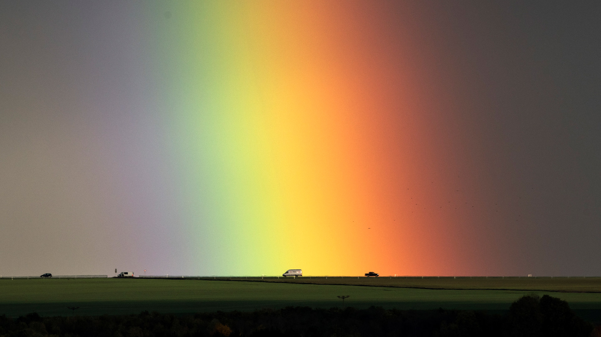
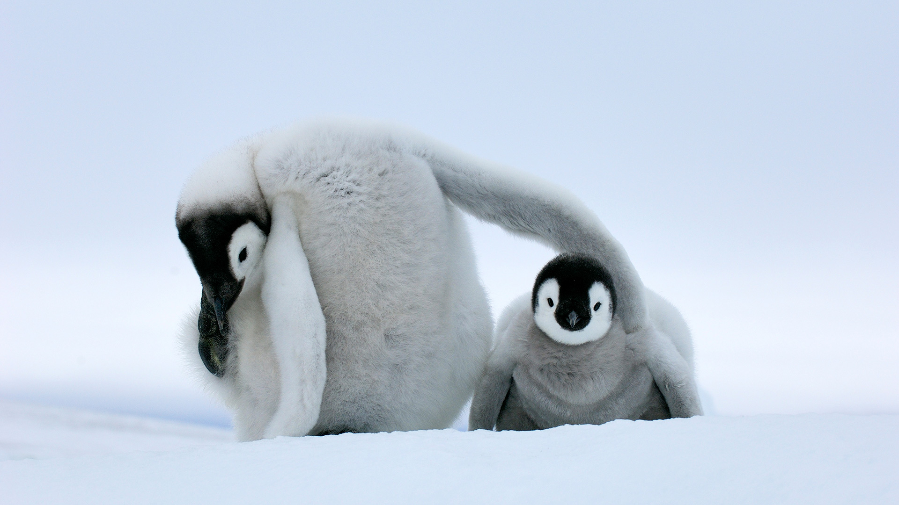
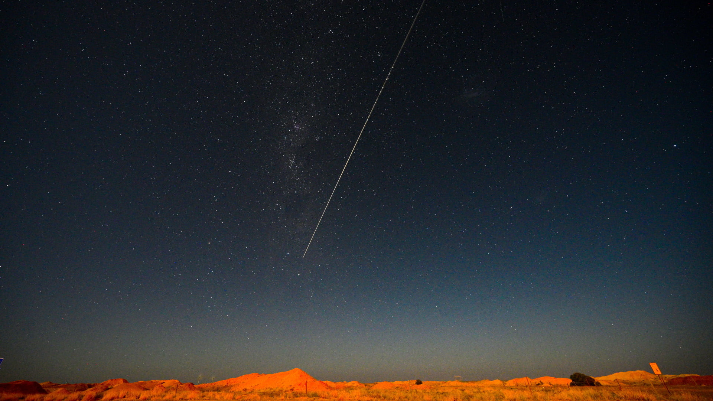
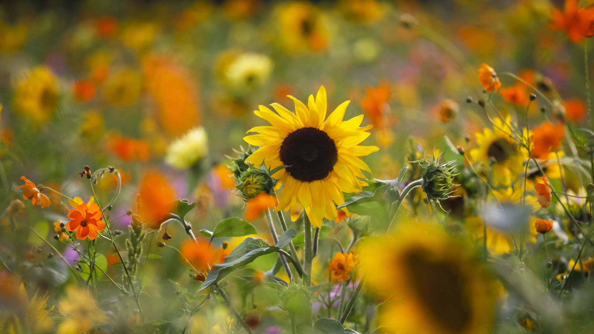
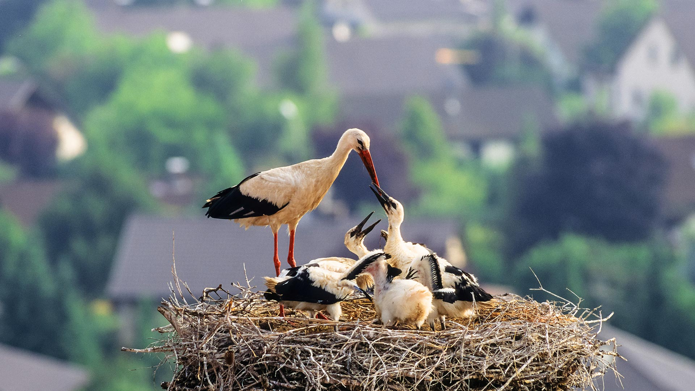
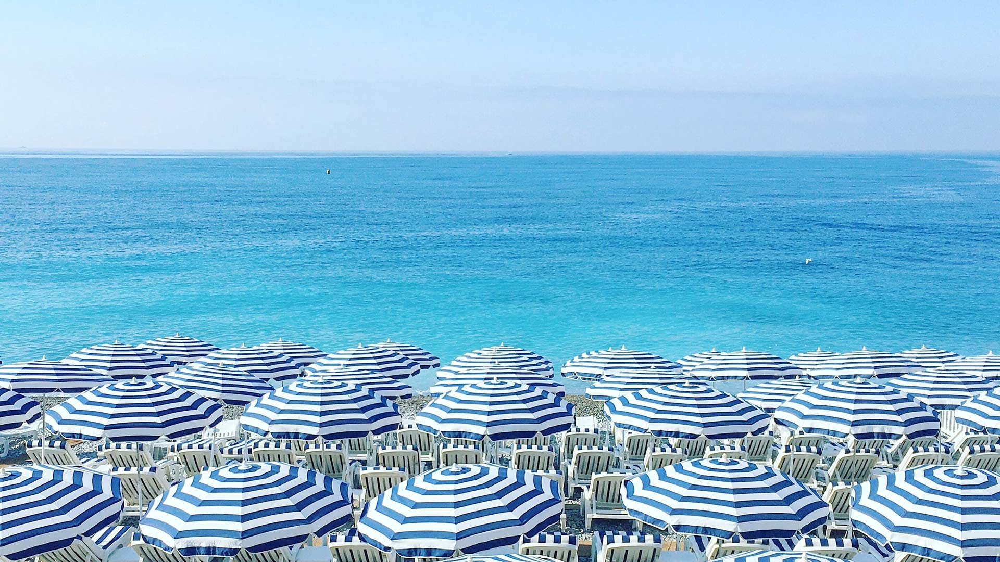
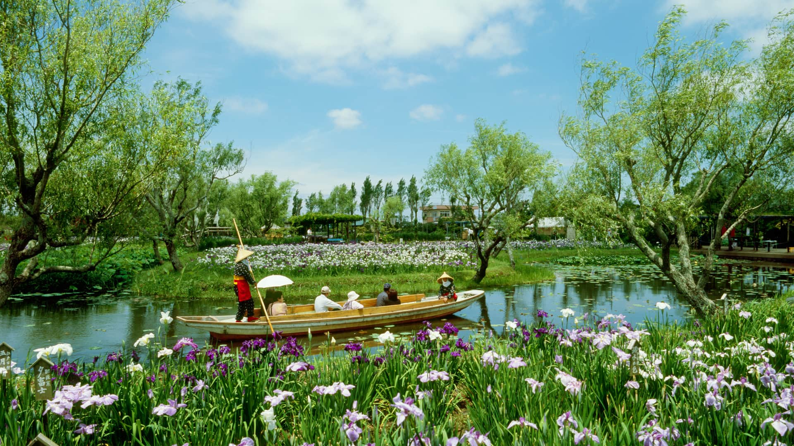

#### 20210630 Manicouagan Crater in Québec, Canada (© Universal History Archive/Universal Images Group via Getty Images)

#### 20210630 薰衣草田，英国牛津 (© Peter Greenway/EyeEm/Getty Images)

#### 20210629 Rocks on Anse Source d'Argent beach, La Digue Island, Seychelles (© Roland Gerth/eStock Photo)

#### 20210628 Regenbogen in der Nähe von Bad Langensalza, Thüringen (© AP Photo/Jens Meyer)

#### 20210628 Kamikōchi, Nagano Prefecture, Japan (© sadao/Shutterstock)

#### 20210628 The Cittadella on the island of Gozo, Malta (© Davide Seddio/Getty Images)

#### 20210627 ｢セムクチャンペイ国立公園｣グアテマラ (© Joel Sharpe/Getty Images)

#### 20210627 Une girafe de Rothschild dans le parc national du lac Nakuru, Kenya (© Theo Allofs/Minden Pictures)

#### 20210627 Rainbow balloons for Pride Day (© lazyllama/Shutterstock)

#### 20210627 Portuairk, Ardnamurchan peninsula, Scottish Highlands (© Cavan Images/Offset by Shutterstock)

#### 20210627 Lincoln Center for the Performing Arts lit in Pride colors on June 18, 2020 in New York City (© Alexi Rosenfeld/Getty Images)

#### 20210627 Büro- und Gewerbegebäude, Kö-Bogen nach Entwürfen von Architekt Daniel Libeskind, Düsseldorf, Nordrhein-Westfalen (© imageBROKER/Alamy Stock Photo)

#### 20210627 大型火烈鸟迁徙到淡水区，印度 (© Amresh Mishra/500px/Getty Images)

#### 20210626 Glass sightseeing platform in Shilinxia Scenic Area, Pinggu District of Beijing, China (© STR/AFP via Getty Images)

#### 20210626 Kamikōchi, Nagano Prefecture, Japan (© sadao/Shutterstock)

#### 20210625 Empress brilliant hummingbird and a bee in Colombia (© Jiri Hrebicek/Alamy)

#### 20210624 Rhododendren im Waldpark Semper bei Lietzow auf Rügen, Mecklenburg-Vorpommern (© Sandra Bartocha/Minden Pictures)

#### 20210624 Caribou in Denali National Park and Preserve, Alaska (© Design Pics/Danita Delimont)

#### 20210623 Fireflies in Nichinan, Tottori, Japan (© north-tail/Getty Images Plus)

#### 20210622 Seljalandsfoss waterfall in the South Region of Iceland (© Tom Mackie/plainpicture)

#### 20210621 The Witness Blanket at the Canadian Museum of Human Rights, Winnipeg (© Aaron Cohen/Carey Newman/Canadian Museum for Human Rights)

#### 20210621 Rothschild's giraffe in Lake Nakuru National Park, Kenya (© Theo Allofs/Minden Pictures)

#### 20210621 Plan rapproché d'un cor d'harmonie (© Bill Oxford/iStock/Getty Images Plus)

#### 20210621 Lavender fields, Oxfordshire, England (© Peter Greenway/EyeEm/Getty Images)

#### 20210620 A father and a calf Ibex looking into the distance in Utah (© Erwin Sparreboom/Shutterstock)

#### 20210620 Greater flamingos, India (© Amresh Mishra/500px/Getty Images)

#### 20210620 Deux petits manchots Empereurs, Antarctique (© Jan Vermeer/Minden Pictures)

#### 20210620 Bald eagle pair with a chick in their nest near the Yukon River, Yukon, Canada (© Mark Newman/Minden Pictures)

#### 20210619 People surfing at Burleigh Heads, Gold Coast, Australia (© Vicki Smith/Getty Images)

#### 20210618 Aerial view of Chapel Bridge over the River Reuss in Lucerne, Switzerland (© Neleman Initiative/Gallery Stock)

#### 20210617 Tamihi Creek, British Columbia, Canada (© Jason Wilde/TANDEM Stills + Motion)

#### 20210617 Bright Eye sea cave on the Nā Pali Coast, Kauai, Hawaii (© jimkruger/Getty Images)

#### 20210616 Green sea turtle diving, Great Barrier Reef, Queensland, Australia (© imageBROKER/Alamy)

#### 20210615 Aerial view of volcanic Lake Pinatubo and mountains, Luzon, Philippines (© Amazing Aerial Agency/Offset by Shutterstock)

#### 20210614 ｢マリーンレイクに浮かぶスピリットアイランド｣カナダ, アルバータ州 （© Jeff Penner/EyeEm/Getty Images）

#### 20210614 The George Washington Bridge displays the American flag in honor of Flag Day, June 14, 2016, Fort Lee, New Jersey (© Robert D. Barnes/Getty Images)

#### 20210614 【端午安康】 （ © 	Shutterstock ）

#### 20210613 ｢はやぶさ 2 から切り離されたカプセル落下の瞬間｣オーストラリア, ウーメラ (© MORGAN SETTE/Getty Images)

#### 20210613 Sommerwiese mit Sonnenblumen, Deutschland (© DEEPOL by plainpicture/Thomas Jäger)

#### 20210613 A black bear cub in a tree (© Richard Wright/DanitaDelimont.com)

#### 20210612 View of the Rio Grande in Big Bend National Park, Texas (© Ian Shive/Tandem Stills + Motion)

#### 20210611 Small loch in Glen Etive, Scotland (© Oliver Hellowell/Minden Pictures)

#### 20210610 ｢アルカション湾のピラ砂丘｣フランス （© aluxum/iStock/Getty Images Plus）

#### 20210610 Eurasian brown bear cub in the taiga forest, Finland (© Jules Cox/Minden Pictures)

#### 20210609 Nossa Senhora da Graça Fort near Elvas, Portugal (© Luis Pina Photography/Shutterstock)

#### 20210609 Annular eclipse over New Mexico, May 20, 2012 (© ssucsy/Getty Images)

#### 20210608 Thousands of jack fish swimming together at Cabo Pulmo National Park, Sea of Cortez, Baja California, Mexico (© Christian Vizl/Tandem Stills + Motion)

#### 20210607 Weißstorch mit Küken im Nest, Deutschland (© Konrad Wothe/Minden Pictures)

#### 20210607 Parasols et chaises longues sur une plage, Côte d’Azur, Nice (© Gen Sadakane/EyeEm/Getty Images)

#### 20210607 Sea stacks on the Isle of Lewis, Outer Hebrides, Scotland (© Cody Duncan/Cavan Images)

#### 20210607 An indigo bunting on a sunflower (© William Krumpelman/Getty Images)

#### 20210606 Mulberry harbour at Arromanches-les-Bains, Normandy, France (© agefotostock/Alamy)

#### 20210605 Black-mandibled toucan in the rainforest canopy of La Selva Biological Station in Costa Rica (© Greg Basco/Minden Pictures)

#### 20210604 ｢兼六園の手向けの松｣金沢市 (© Korkusung/Shutterstock)

#### 20210604 法国西南部阿卡雄湾的皮拉沙丘 (© aluxum/iStock/Getty Images Plus)

#### 20210604 Eastern Island and Spit Island, Midway Atoll (© Ian Shive/Tandem Stills + Motion)

#### 20210603 Cyclists on a wooden suspension bridge over the Soča River in Slovenia (© Amazing Aerial Agency/Offset by Shutterstock)

#### 20210602 ｢水郷佐原あやめパーク｣ 千葉県香取市 (© MIXA/Getty Images)

#### 20210602 Springboks near a waterhole in Etosha National Park, Namibia (© Charlie Summers/Minden Pictures)

#### 20210601 Aerial view of the Grotta della Poesia (Poetry's Cave) near Roca, Lecce, Italy (© Amazing Aerial Agency/Offset by Shutterstock)

