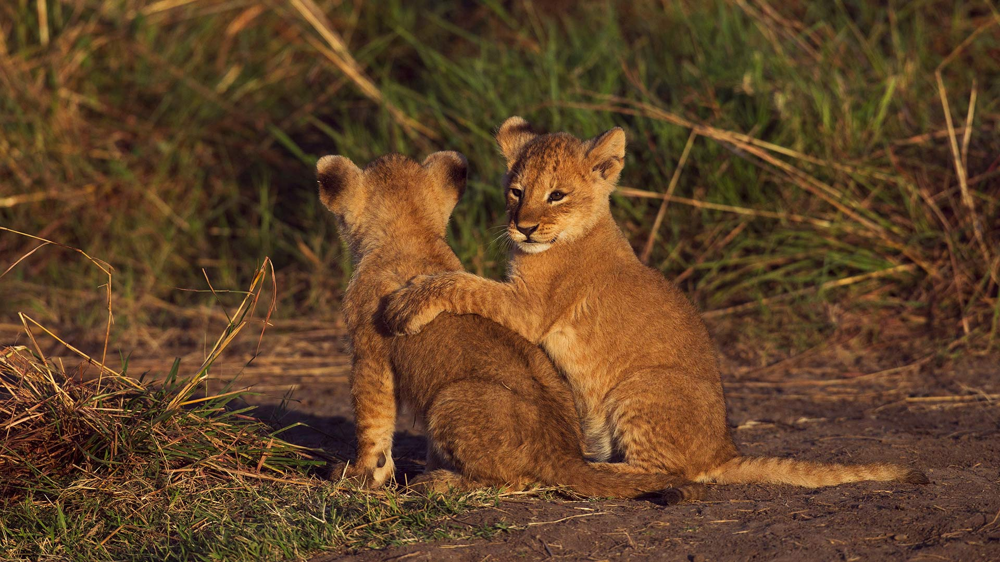
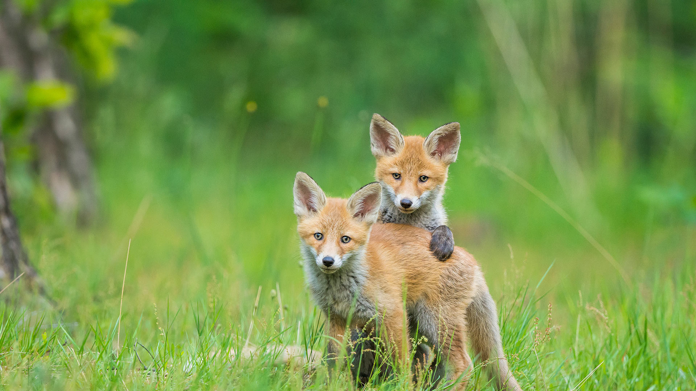
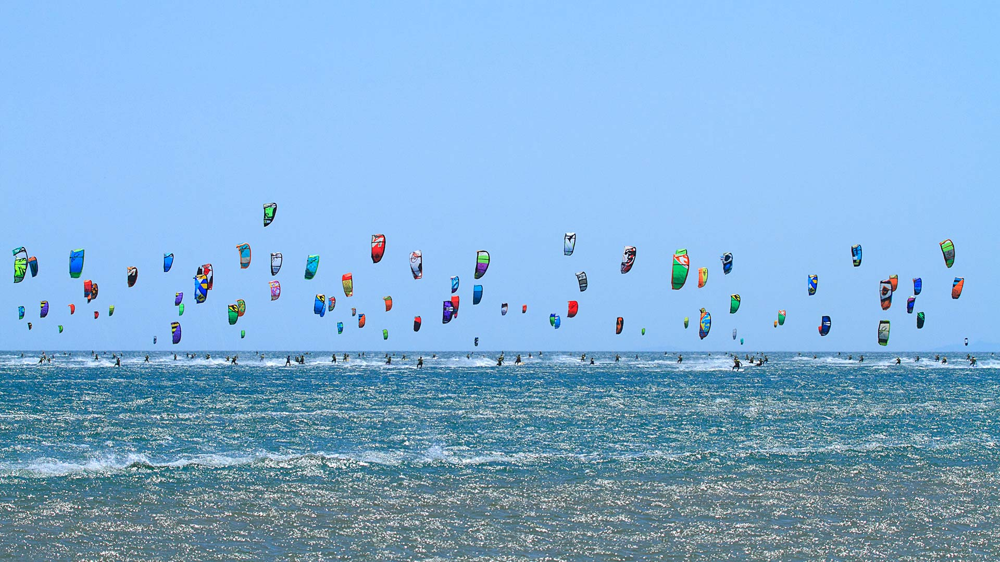
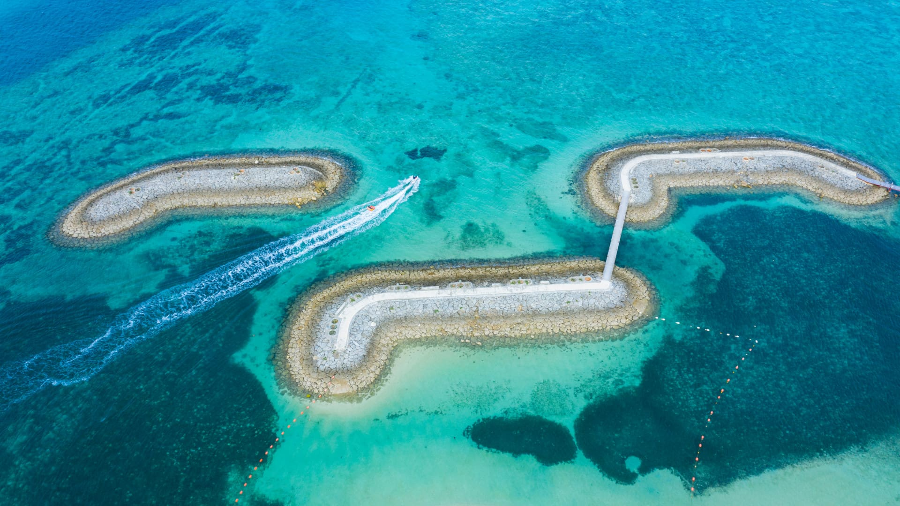
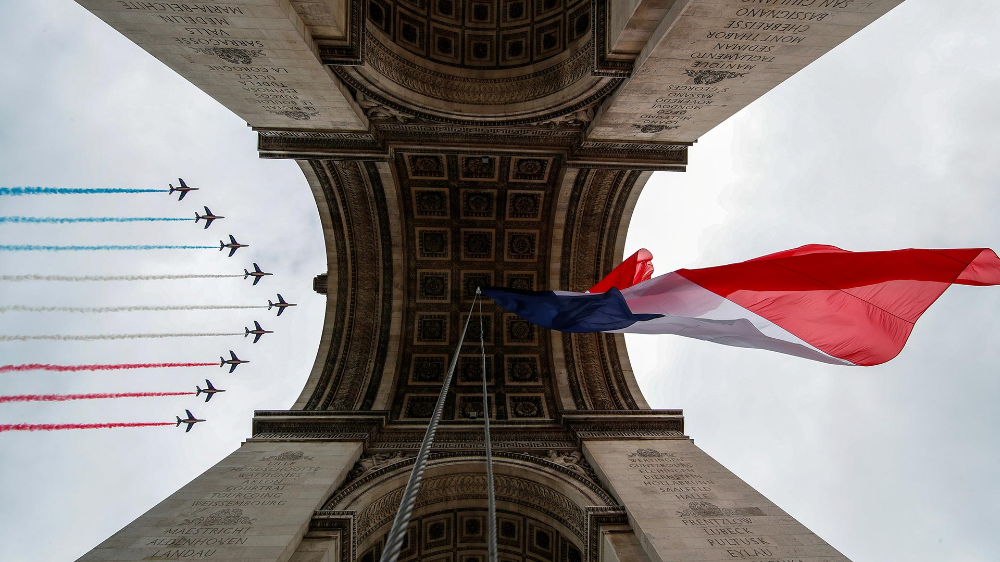
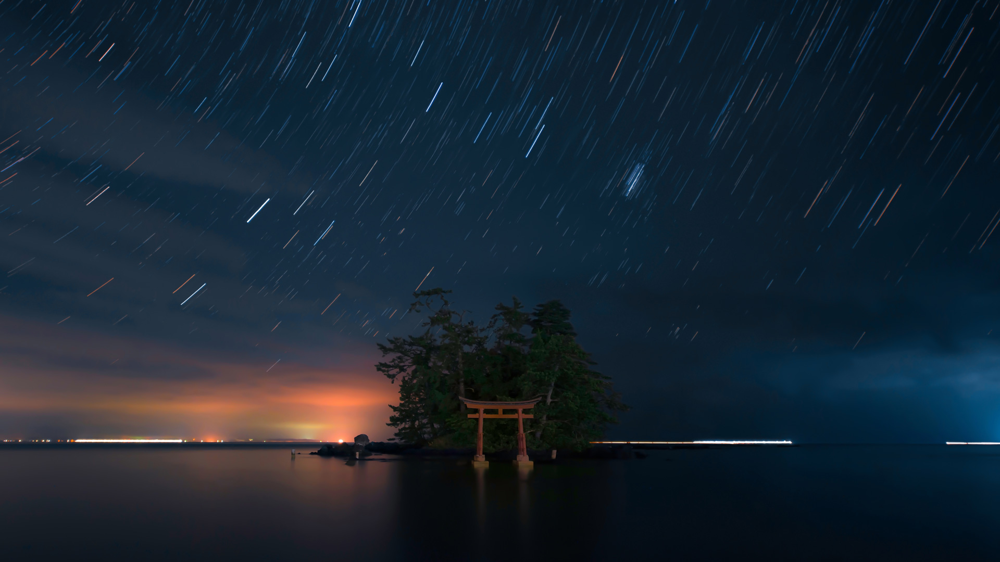
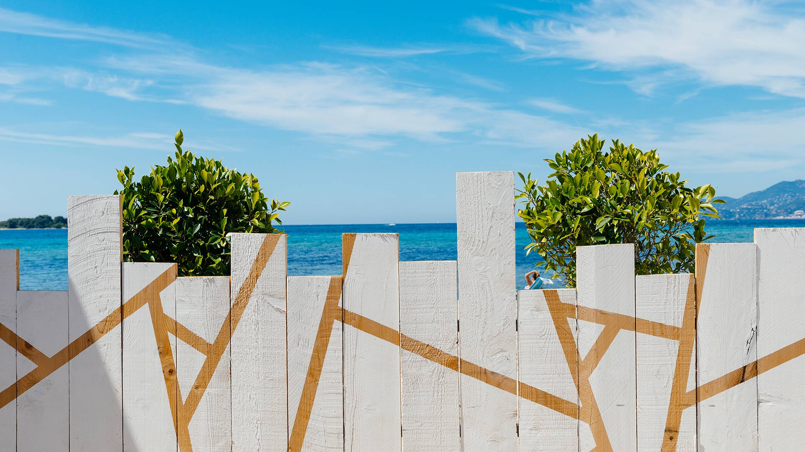

#### 20210731 Northern carmine and European bee-eaters in Mkomazi National Park, Tanzania (© webguzs/Getty Images)

#### 20210730 Otter Cliffs, Acadia National Park, Maine (© dbimages/Alamy)

#### 20210730 Aerial view of Nahanni National Park Reserve, Northwest Territories, Canada (© Robert Postma/Getty Images)

#### 20210730 Deux lionceaux dans la réserve nationale du Masai Mara au Kenya (© Anup Shah/Minden)

#### 20210730 Zwei junge Rotfüchse beim Spielen, Deutschland (© Raimund Linke/Getty Images)

#### 20210729 Zinnowitz pier, Usedom island, Germany (© Frank Günther/Getty Images)

#### 20210729 Tiger camouflaged in tall grass, Assam, India (© Sandesh Kadur/Minden Pictures)

#### 20210728 Die Vermilion Lakes in den Kanadischen Rocky Mountains (© Glowing Earth Photography/Getty Images)

#### 20210728 School of sea goldies with feather stars, Great Barrier Reef, Queensland, Australia (© Gary Bell/Minden Pictures)

#### 20210727 Mont Choisy Beach, Mauritius (© Robert Harding World Imagery/Offset by Shutterstock)

#### 20210727 Rows of different lavender plants in a field in the Cowichan Valley in British Columbia (© plainpicture/Design Pics/Debra Brash)

#### 20210727 Adler Planetarium near Lake Michigan, Chicago, Illinois (© Amazing Aerial Agency/Offset by Shutterstock)

#### 20210726 Mangrove trees, Walakiri Beach, Sumba Island, Indonesia (© Tengguo Wu/Getty Images)

#### 20210725 Course de Kitesurf, Gruissan, Aude, Occitanie (© Philippe Turpin/Delta Images/Offset by Shutterstock)

#### 20210725 皮丘拉湖畔的乌代布尔城市宫殿，印度 (© Chaiyun Damkaew/Getty Images)

#### 20210725 'Field of Light' by artist Bruce Munro at Uluru, Australia (© Sheralee Stoll/Alamy)

#### 20210724 ｢サンマリーナビーチの桟橋｣沖縄 (© kokouu/Getty Images)

#### 20210724 Javan tree frogs sitting together on a stalk in Indonesia (© SnapRapid/Offset by Shutterstock)

#### 20210723 Tokyo Tower in Minato City, Tokyo, Japan (© Yukinori Hasumi/Getty Images)

#### 20210722 The Minokake-Iwa rocks off the coast of the Izu Peninsula, Japan (© Krzysztof Baranowski/Getty Images)

#### 20210722 Karibus im Denali-Nationalpark, Alaska, USA (© Design Pics/Danita Delimont)

#### 20210721 Wachsenburg Castle near Erfurt, Germany (© Radius Images/Offset by Shutterstock)

#### 20210721 山脉中的朱砂湖，加拿大落基山脉 (© Glowing Earth Photography/Getty Images)

#### 20210721 School of sea goldies with feather stars, Great Barrier Reef, Queensland, Australia (© Gary Bell/Minden Pictures)

#### 20210721 Castel del Monte, Apulia, Italy (© Toni Spagone/Alamy)

#### 20210720 Composite image of the moon (© Prathamesh Jaju)

#### 20210719 Colorful alleyway in the medina of Tétouan, Morocco (© Jan Wlodarczyk/eStock Photo)

#### 20210719 Pink salt lake, Gruissan, France (© Abstract Aerial Art/Getty Images)

#### 20210718 Zinnowitz pier on Usedom island in the Baltic Sea, Germany (© Frank Günther/Getty Images)

#### 20210718 Tour de France riders in front of the Louvre Pyramid and Museum in Paris, France, during the 2020 race (© Martin Bureau/AFP via Getty Images)

#### 20210717 A Loepa oberthuri moth (© Robert Thompson/Minden Pictures)

#### 20210717 ｢エバーグレーズ国立公園｣米国, フロリダ州 (© Tetra Images/Getty Images)

#### 20210717 'Field of Light' by artist Bruce Munro at Uluru, Australia (© Sheralee Stoll/Alamy)

#### 20210716 Ausschnitt eines Straußenfarns im Frühjahr, Bundesstaat Washington, USA (© Stephen Matera/Tandem Stills + Motion)

#### 20210716 Mont Choisy Beach, Mauritius (© Robert Harding World Imagery/Offset by Shutterstock)

#### 20210715 Boats float by rice fields on the Ngo Dong River in Ninh Bình province, Vietnam (© Jeremy Woodhouse/Getty Images)

#### 20210714 Blacktip reef sharks off the coast of Tahiti, French Polynesia (© Paul Mckenzie/Minden Pictures)

#### 20210714 La Patrouille de France survolant l’Arc de Triomphe lors des célébrations du 14 juillet 2020 (© REUTERS/Gonzalo Fuentes)

#### 20210714 Pink fringed tulip, Ottawa, Canada (© colimachon/Getty Images)

#### 20210713 Moose crossing a pond below Mount Moran, Grand Teton National Park, Wyoming (© Jim Stamates/Minden Pictures)

#### 20210713 Blaukehlchen in einem Rapsfeld (© Zwilling330/Getty Images)

#### 20210712 Wave crashing on Farolim de Felgueiras, a lighthouse in Porto, Portugal (© Stephan Zirwes/Offset by Shutterstock)

#### 20210711 Spiral aloe (© David Madison/Getty Images)

#### 20210710 Milky Way over the Tagus River in Monfragüe National Park, Spain (© Miguel Angel Muñoz Ruiz/Cavan Images)

#### 20210709 A cowboy tends to horses in a barn at the Calgary Stampede on July 10, 2011 in Calgary (© Mario Tama/Getty Images)

#### 20210708 Ortygia, a small island off the coast of Syracuse, Sicily, Italy (© DaLiu/Shutterstock)

#### 20210708 The Appalachian Trail in Stokes State Forest, New Jersey (© Frank DeBonis/Getty Images)

#### 20210707 ｢恋路海岸の弁天島｣石川県, 能登町 (© Lucia Terui/Getty Images)

#### 20210707 Kazem Dashi rock formation in Lake Urmia, Iran (© Ali/Adobe Stock)

#### 20210706 Tawny frogmouth chick, Australia (© SnapRapid/Offset by Shutterstock)

#### 20210706 Vue sur la Méditerranée au-dessus d’une palissade, Cannes (© Anthony Lanneretonne/Offset by Shutterstock)

#### 20210705 Serra da Malagueta mountains on Santiago Island, Cabo Verde (© Samuel Borges Photography/Shutterstock)

#### 20210704 Fireworks in San Francisco, California (© tampatra/Getty Images)

#### 20210704 阿尔高阿尔卑斯山脉的Schrecksee湖，德国巴伐利亚 (© Andreas Hagspiel/EyeEm/Getty Images)

#### 20210703 Wakatobi National Park, Indonesia (© Fabio Lamanna/Alamy)

#### 20210702 The Roaches, Peak District, England (© George W Johnson/Getty Images)

#### 20210702 A meerkat in Namibia (© Danita Delimont/Offset by Shutterstock)

#### 20210701 Ardnamurchan半岛, 苏格兰高地 (© Cavan Images/Offset by Shutterstock)

#### 20210701 The Parliament of Canada in Ottawa (© anderm/Shutterstock)

#### 20210701 'Passage migratoire' ('Migratory Passage'), an art installation by Giorgia Volpe in Old Québec City, Québec, Canada (© Lucbouch/Getty Images)

#### 20210701 Cittadella auf Gozo, Malta (© Davide Seddio/Getty Images)

#### 20210701 Cherry blossoms, Queen Elizabeth Park, Vancouver, Canada (© Harris Hui/Getty Images)

