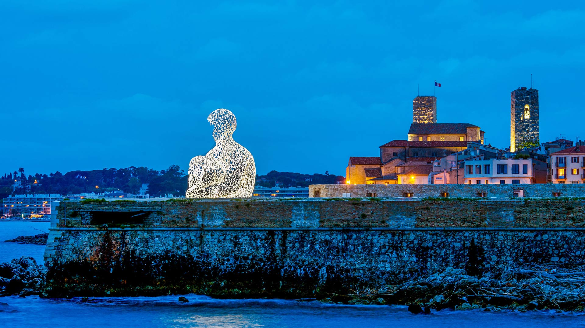
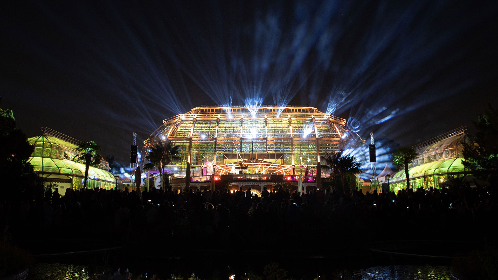
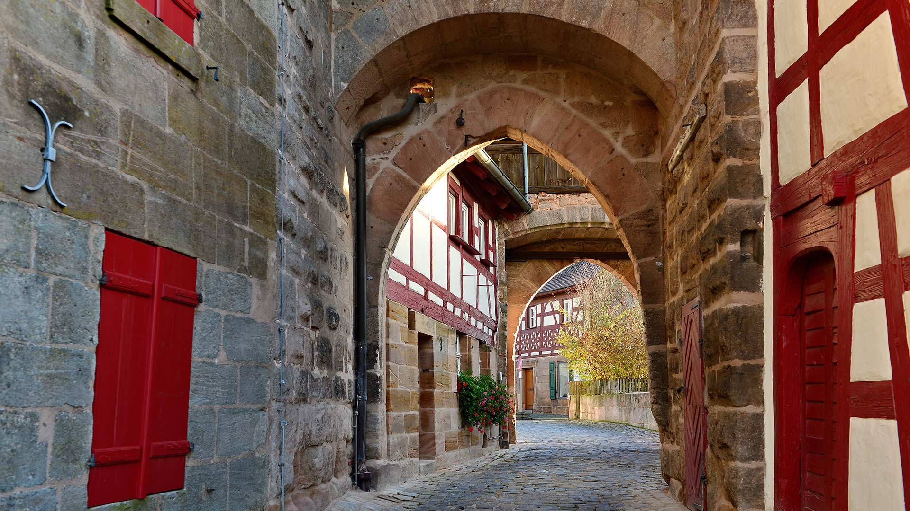
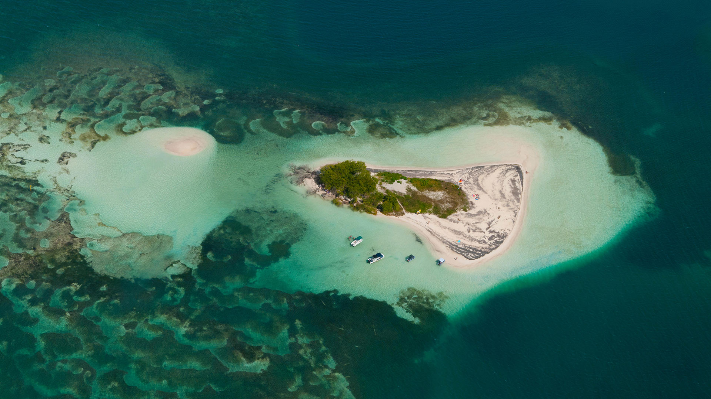
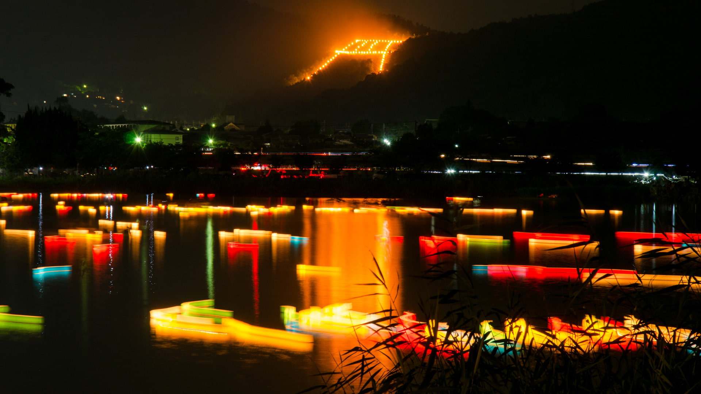
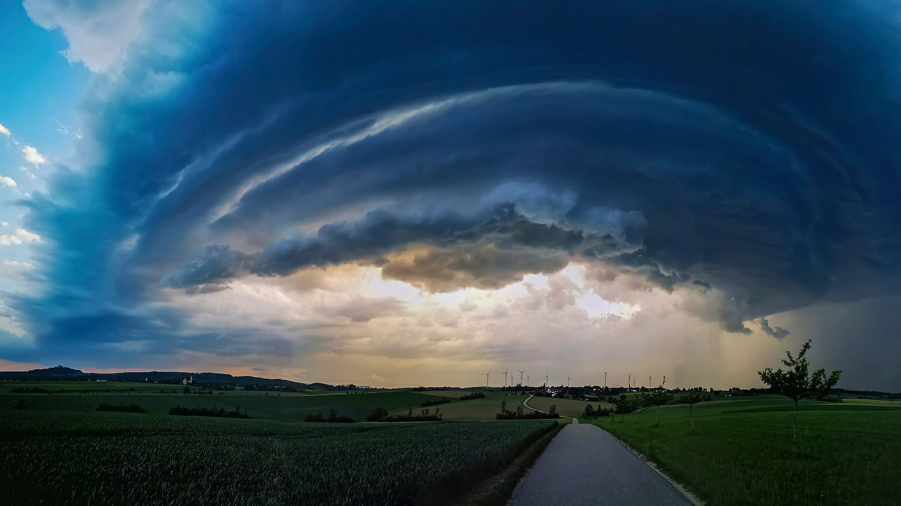
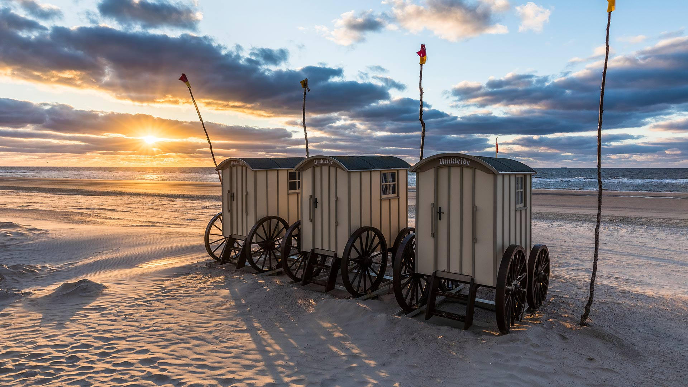
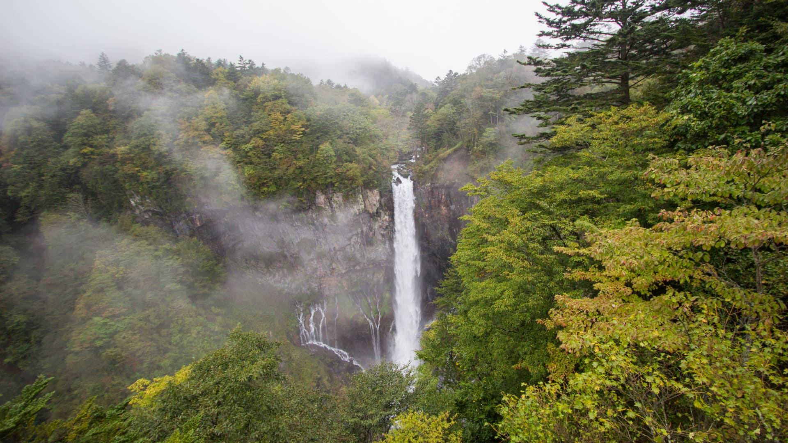
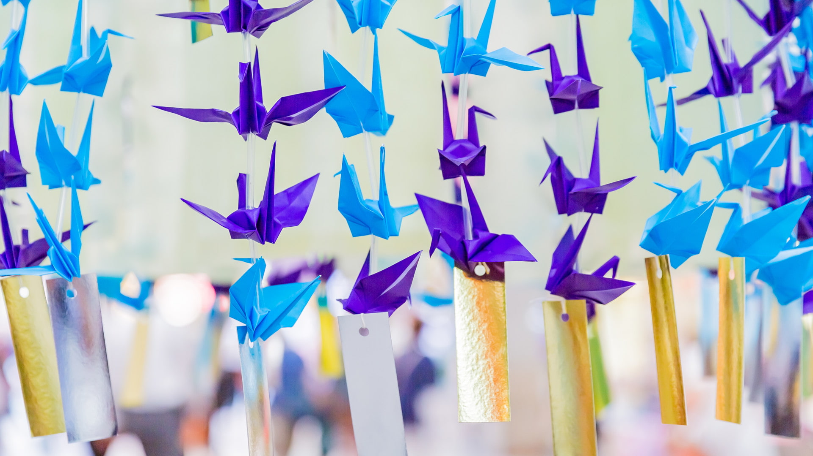

#### 20210831 Sculpture créée par l'artiste Catalan Jaume Plensa intitulée "Nomade", vieille ville d'Antibes, Alpes-Maritimes (© Norbert Scanella/Alamy Stock Photo)

#### 20210831 Đurđevića Tara Bridge in Montenegro (© Hike The World/Shutterstock)

#### 20210830 Crater glow from Mount Mayon in the Philippines (© Per-Andre Hoffmann/Cavan)

#### 20210828 Underground lake in Ruskeala Mountain Park, Karelia, Russia (© Konstantin Trubavin/Offset by Shutterstock)

#### 20210828 Red-billed oxpeckers on an impala in Mpumalanga, South Africa (© Heini Wehrle/Minden Pictures)

#### 20210827 Casa do Penedo (House of the Rock) in Portugal (© Olimpio Fantuz/eStock Photo)

#### 20210827 Lichtshow während der Botanischen Nacht im Botanischen Garten in Berlin (© Hayoung Jeon/EPA-EFE/Rex/Shutterstock)

#### 20210826 A sea swallow feeding on the tentacles of a blue button in Coffs Harbour, New South Wales, Australia (© Gary Bell/Minden Pictures)

#### 20210825 Peekaboo view of Angels Window on the North Rim of the Grand Canyon, Arizona (© Tim Fitzharris/Minden Pictures)

#### 20210825 Scenic shot from Stanley Park overlooking the downtown core, Vancouver (© Basic Elements Photography/Getty Images)

#### 20210824 Old surfboards lined up as a fence near Paia, Maui, Hawaii (© Matt Anderson Photography/Getty Images)

#### 20210824 Cadolzburg, Mittelfranken, Bayern (© Rüdiger Hess/geo-select Fotoart)

#### 20210823 Little blue heron in Cuba (© Sergey Uryadnikov/Alamy)

#### 20210822 The Goldensides trailhead in Tombstone Territorial Park, Yukon (© Ron Erwin/All Canada Photos/Alamy Stock Photo)

#### 20210822 The shoreline of Olympic Coast National Marine Sanctuary, Washington state (© Chris Moore/Tandem Stills + Motion)

#### 20210822 Waterfall in Amboli, Maharashtra, India (© ePhotocorp/iStock/Getty Images Plus)

#### 20210821 Petit Minou Lighthouse in the roadstead of Brest, Finistère, France (© Mathieu Rivrin/Getty Images)

#### 20210820 Tauchgondel an der Seebrücke Zinnowitz, Insel Usedom, Mecklenburg-Vorpommern (© Frank Günther/Getty Images)

#### 20210820 Guadeloupe, Grand Cul-de-sac Marin, Ilets de Carénage, Ilet Blanc (© Thierry GRUN - Aero/Alamy Stock Photo)

#### 20210819 Giant manta ray and a photographer off the Ningaloo Coast, Australia (© Shutterstock Premier)

#### 20210818 The Old Town of Dubrovnik, Croatia (© Jeremy Woodhouse/Getty Images)

#### 20210817 Stairway to Heaven trail in Wawayanda State Park, New Jersey (© Leembe/Getty Images)

#### 20210817 Rub' al Khali desert on the border of Oman and the Emirate of Dubai (© Daniel Schoenen/Offset by Shutterstock)

#### 20210816 Silhouette of Shambhala roller coaster at sunset in PortAventura Park, Salou, Tarragona, Spain (© Joaquim F. P./Getty Images)

#### 20210816 Petit Minou Lighthouse in the roadstead of Brest, Finistère, France (© Mathieu Rivrin/Getty Images)

#### 20210816 ｢五山送り火の鳥居形松明と灯篭流し｣京都 (© Kaoru Hayashi/Getty Images)

#### 20210816 Gewitterzelle über einer Ortschaft in Baden-Württemberg (© Martin Grimm/Minden)

#### 20210815 Strandbad Tiefenbrunnen, a public pool on the shore of Lake Zürich, Switzerland (© Amazing Aerial Agency/Offset by Shutterstock)

#### 20210814 Ubehebe Crater in Death Valley National Park, California (© Albert Knapp/Alamy)

#### 20210813 Pont Valentré bridge, Cahors, France (© Reinhard Schmid/Huber/eStock Photo)

#### 20210813 Horned ghost crab, Grand Anse, Praslin Island, Seychelles (© Ingo Schulz/Offset by Shutterstock)

#### 20210812 African bush elephant herd, Okavango Delta, Botswana (© Juan-Carlos Munoz/Minden Pictures)

#### 20210811 The Perseid meteor shower photographed at the Dinosaur Museum of Erenhot in Inner Mongolia, China (© bjdlzx/Getty Images)

#### 20210810 Umkleidewagen am Strand bei Sonnenuntergang auf der Insel Norderney, Ostfriesland, Niedersachsen (© Frank Lukasseck/Huber/eStock Photo)

#### 20210810 纳汉尼国家公园保护区的鸟瞰图，加拿大西北部 (© Robert Postma/Getty Images)

#### 20210810 Tossa de mar, Catalogne, Espagne (© dleiva/Alamy)

#### 20210810 Aerial View of Boreal Forest in summer, Quebec (© Onfokus/Getty Images)

#### 20210810 The Smithsonian Arts and Industries Building in Washington, DC (© Ron Blunt/Courtesy Smithsonian)

#### 20210809 Māori rock carving by Matahi Whakataka-Brightwell, Lake Taupo, North Island, New Zealand (© Evgueni Zverev/Alamy)

#### 20210808 Elizabeth Quay Bridge in Perth, Australia (© Amazing Aerial Agency/Offset by Shutterstock)

#### 20210808 ｢華厳の滝｣栃木県, 日光市 (© Sawarut Triratanachat/Shutterstock)

#### 20210807 Salt cones on Salar de Uyuni, Bolivia (© John Shaw/Minden Pictures)

#### 20210806 ｢仙台七夕まつり｣宮城県, 仙台市 (© Taku_S/Getty Images)

#### 20210806 Salisbury Crags in Holyrood Park overlooking Edinburgh, Scotland (© Andrew Merry/Getty Images)

#### 20210805 The Sky Pool at Embassy Gardens in London, England (© Xinhua News Agency/Getty Images)

#### 20210805 波白克岛的小尖塔岩石，英格兰多塞特 (© James Osmond/Alamy)

#### 20210804 Clouded leopard (© Dhritiman Mukherjee/Alamy)

#### 20210803 Wachsenburg Castle near Erfurt, Germany (© Radius Images/Offset by Shutterstock)

#### 20210803 蒙特城堡，意大利普利亚大区 (© Toni Spagone/Alamy)

#### 20210802 Mesas, Upper Cathedral Valley, Capitol Reef National Park, Utah (© Tim Fitzharris/Minden Pictures)

#### 20210802 Archipel de Riou vu de la Calanque d'En-Vau, Parc National des Calanques, Bouches-du-Rhône, Provence-Alpes-Cote d'Azur (© Jason Langley/AWL Images/Offset by Shutterstock)

#### 20210801 Barley field in East Lothian, Scotland (© Scott Masterton/plainpicture)

#### 20210801 ｢弘前ねぷたまつり｣青森県, 弘前市 (© David Parker/Alamy Stock Photo)

