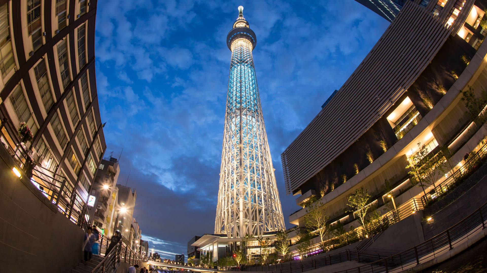
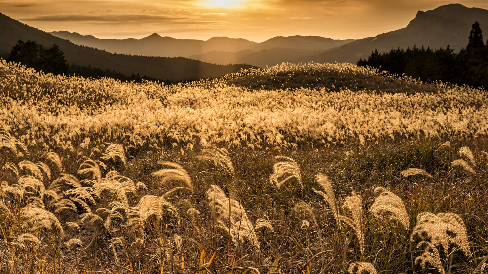
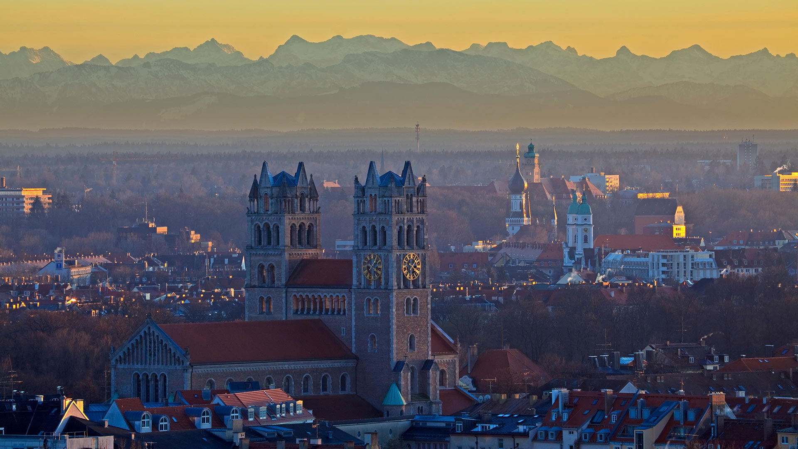
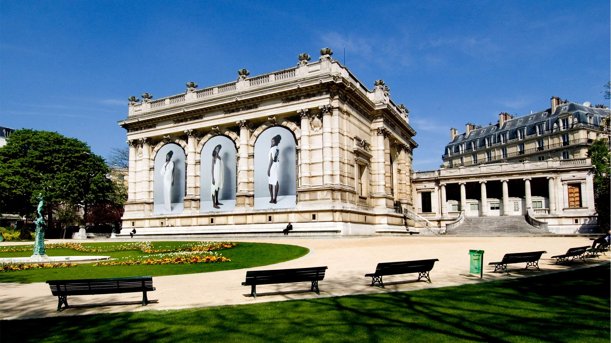
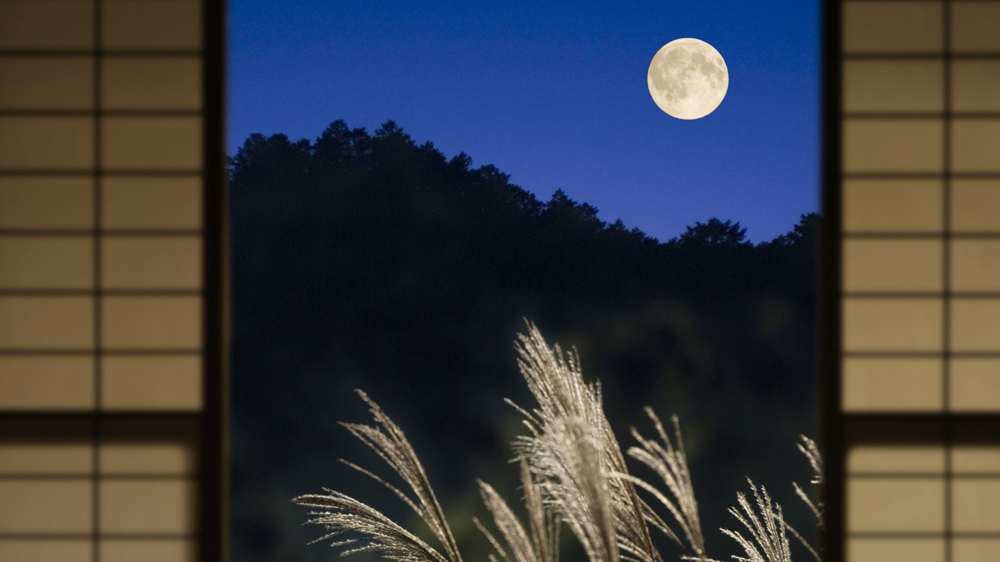
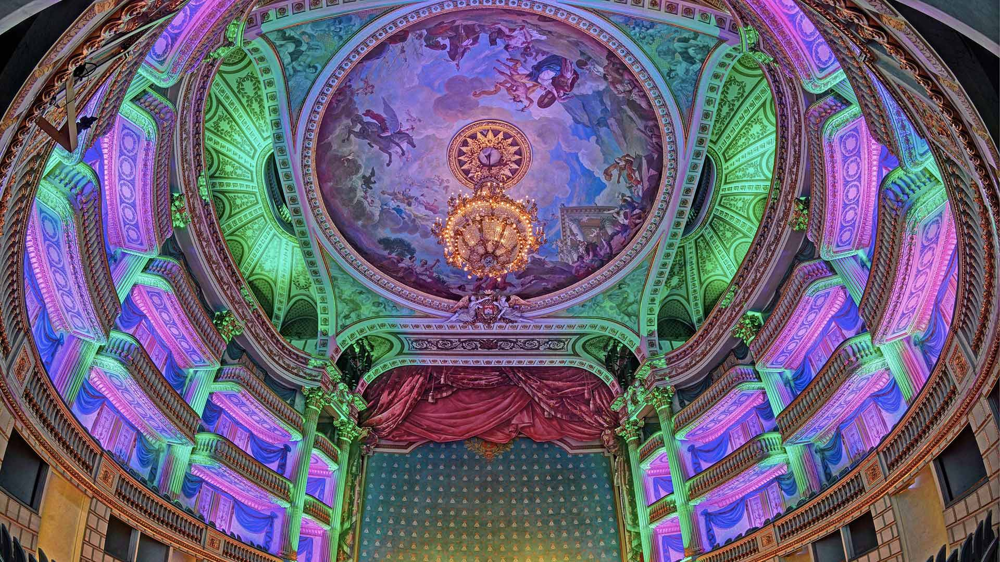
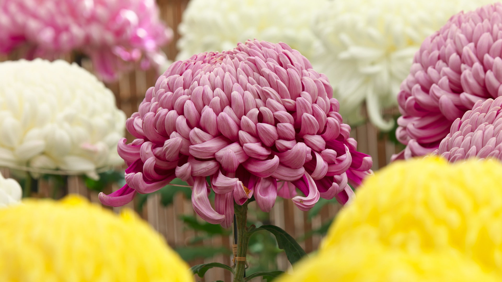
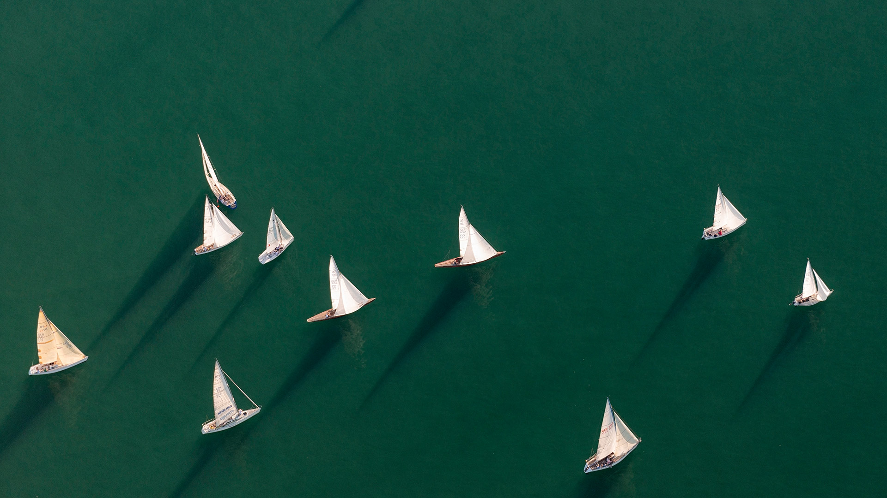
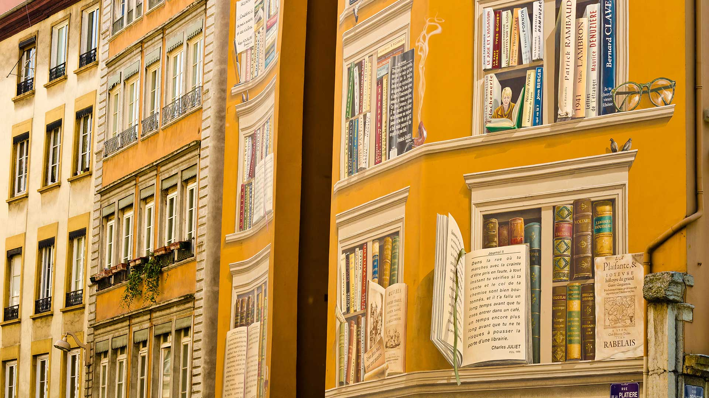

#### 20210930 Container ship in San Pedro, California (© Cameron Venti/Getty Images)

#### 20210929 A wood bison near Behchoko, in the Northwest Territories, Canada (© Don Johnston/agefotostock)

#### 20210929 ｢東京スカイツリー｣東京都, 墨田区 (© Horizon Images/Motion/Alamy Stock Photo)

#### 20210928 布罗兹湿地国家公园，英国诺福克郡 (© Steven Docwra/Getty Images)

#### 20210928 Mount Fuji in Japan (© The Asahi Shimbun/Getty Images)

#### 20210927 ｢曽爾高原の夕焼け｣奈良県 (© Ken1200/Shutterstock)

#### 20210927 Kirche St. Maximilian, München, Bayern (© Rolf Hicker/All Canada Photos/Alamy Stock Photo)

#### 20210927 Palais Galliera, Musée de la mode de la ville de Paris (© Peter Horree/Alamy Stock Photo)

#### 20210926 The Mackenzie River in Canada emptying into the Beaufort Sea (© Norman Kuring, GSFC/NASA/USGS Landsat)

#### 20210925 Escarpment Trail in Porcupine Mountains Wilderness State Park, Michigan (© Pat & Chuck Blackley/Alamy)

#### 20210925 Thorn bug, Pico Bonito National Park, Honduras (© Mac Stone/Tandem Stills + Motion)

#### 20210924 Cusco Cathedral on the Plaza de Armas, Cusco, Peru (© sharptoyou/Shutterstock)

#### 20210923 Neptune (© NASA/JPL)

#### 20210922 Baumkronenpfad im Nationalpark Hainich, Thüringen (© mauritius images GmbH/Alamy Stock Photo)

#### 20210922 Baby white rhinoceros and mother in Hluhluwe–iMfolozi Park, South Africa (© Martin Harvey/Alamy)

#### 20210922 Willow trees, Lake Bret, Bugey, France (© Jean-Philippe Delobelle/Minden Pictures)

#### 20210921 'Rising Moon' lantern to celebrate the Mid-Autumn Festival in Hong Kong's Victoria Park (© Bobby Yip/Reuters)

#### 20210921 ｢月｣京都府 (© Aflo/Aflo Co., Ltd./Alamy Stock Photo)

#### 20210921 【中秋快乐】 （ © shutterstock ）

#### 20210920 Starlings in the wetlands between Denmark and Germany (© Viking/Alamy)

#### 20210919 Roe deer buck, Schleswig-Holstein, Germany (© Helge Schulz/Minden Pictures)

#### 20210919 Le Castella at Capo Rizzuto, Italy (© mRGB/Shutterstock)

#### 20210919 英国康沃尔郡岸边的日落 (© Andrew Turner/Getty Images)

#### 20210918 France, Gironde (33), Bordeaux, zone classée au Patrimoine Mondial par l'UNESCO, le Grand Théâtre (© CHICUREL Arnaud/hemis.fr)

#### 20210918 Red panda at the Chengdu Panda Base in Sichuan province, China (© Biosphoto/Alamy)

#### 20210917 Benagil Cave in the Algarve, Portugal (© Michael Malorny/Offset by Shutterstock)

#### 20210916 Palacio de Bellas Artes, Mexico City, Mexico (© Lukas Bischoff Photograph/Shutterstock)

#### 20210916 阿拉普扎的船屋，印度喀拉拉邦 (© Martin Harvey/The Image Bank/Getty Images)

#### 20210916 Birnbeck Pier, Bristol Channel, Weston-super-Mare, England (© Stephen Davies/Adobe Stock)

#### 20210915 The exterior wall of Maison du Festival in Quartier des Spectacles, Montreal (© Hemis/Alamy Stock Photo)

#### 20210915 Artist Jesus 'CIMI' Alvarado painting his mural 'Fronterizos' on a wall of the El Paso Museum of Art, El Paso, Texas (© Paul Ratje/AFP via Getty Images)

#### 20210914 Aldeyjarfoss waterfall in northern Iceland's interior landscape (© Jim Patterson/Tandem Stills + Motion)

#### 20210913 Tombstone Territorial Park, Yukon, Canada (© Ron Erwin/All Canada Photos/Alamy)

#### 20210913 Rehbock in einem Getreidefeld zwischen den Dörfern Mehlbek und Wacken, Schleswig-Holstein (© Helge Schulz/Minden Pictures)

#### 20210912 Aerial view of the Venice Skatepark in Venice Beach, Los Angeles (© Ingus Kruklitis/Getty Images)

#### 20210912 Birnbeck Pier on the Bristol Channel in Weston-super-Mare, England (© Stephen Davies/Adobe Stock)

#### 20210911 US flag on part of a 9/11 memorial overlooking the New York skyline from Exchange Place, Jersey City, New Jersey (© Gary Hershorn/Getty Images)

#### 20210911 The Toronto skyline viewed from the Toronto Islands (© AWL Images/DanitaDelimont.com)

#### 20210911 Treetop walkway in Hainich National Park, Thuringia, Germany (© mauritius images GmbH/Alamy)

#### 20210911 Asian elephants in West Bengal, India (© Avijan Saha/Minden Pictures)

#### 20210910 River Avon in Bath, England (© Robert Harding World Imagery/Offset by Shutterstock)

#### 20210909 San Juan Islands, Washington (© Stephen Matera/Tandem Stills + Motion)

#### 20210909 Howgill Fells im Yorkshire-Dales-Nationalpark, Cumbria, England (© davidnmoorhouse/iStock/Getty Images Plus)

#### 20210909 ｢菊の花｣東京都, 調布市 (© Juan-Carlos Munoz/Minden Pictures)

#### 20210908 从昂沃峡湾眺望里欧岛，法国马赛 (© Jason Langley/AWL Images/Offset by Shutterstock)

#### 20210908 Livraria Lello, a bookstore in Porto, Portugal (© Nido Huebl/Shutterstock)

#### 20210907 Humpback whales off the coast of Massachusetts (© Eric Kulin/plainpicture)

#### 20210906 Luftaufnahme von Segelbooten, Friedrichshafen, Bodensee, Baden-Württemberg (© Westend61/Getty Images)

#### 20210906 Decorative ceiling of the rotunda in the British Columbia legislative building, Victoria, B.C. (© Roy Langstaff/agefotostock)

#### 20210906 Park service employees inspecting Mount Rushmore National Memorial, South Dakota (© Universal Images Group via Getty Images)

#### 20210906 约克郡谷地国家公园里的山丘，英格兰 (© davidnmoorhouse/iStock/Getty Images Plus)

#### 20210906 Le pont de Đurđevića Tara au Montenegro (© Hike The World/Shutterstock)

#### 20210905 The Regata Storica on the Grand Canal in Venice, Italy (© Alexander Duffner/Alamy)

#### 20210904 Anna's hummingbird (© Dee/Getty Images)

#### 20210903 The 'Alien Egg Hatchery' in the Bisti/De-Na-Zin Wilderness, New Mexico (© Ian Shive/Tandem Stills + Motion)

#### 20210902 Porto Flavia, Sardinia, Italy (© Visualframing/Adobe Stock)

#### 20210901 A porcini mushroom (© vnosokin/Getty Images)

#### 20210901 Fresque "La bibliothèque de la cité" située dans le centre-ville de Lyon  (© Russ Bishop/Alamy Stock Photo)

#### 20210901 Slopes of Signal Hill in St. John's Newfoundland and Labrador (© Terrance Klassen/Alamy Stock Photo)

