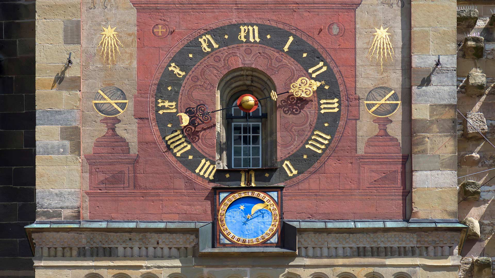
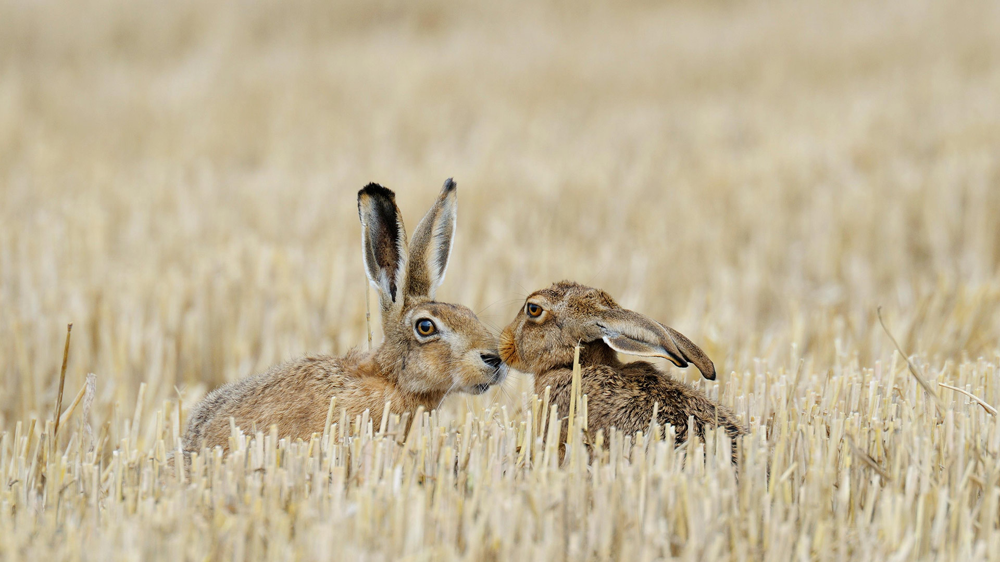
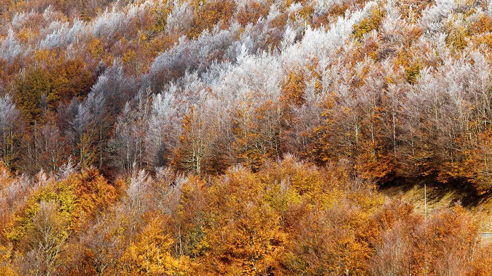
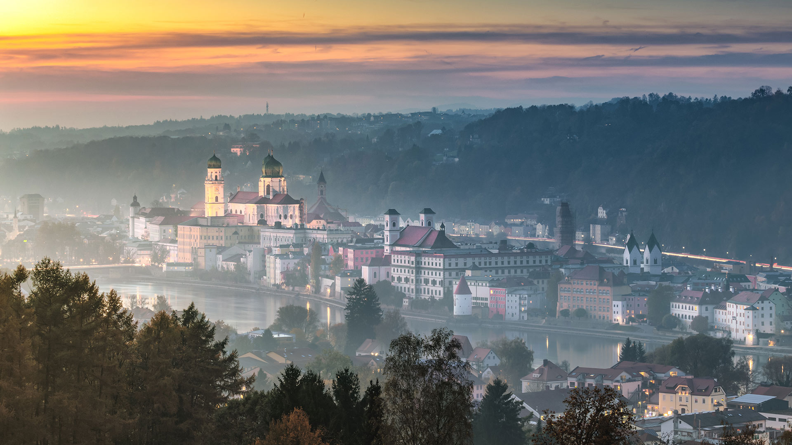
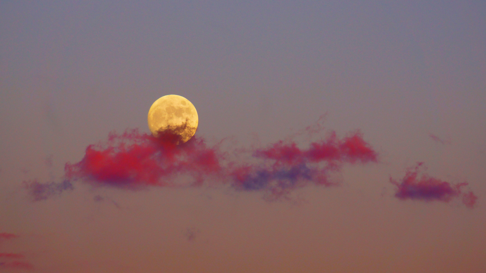
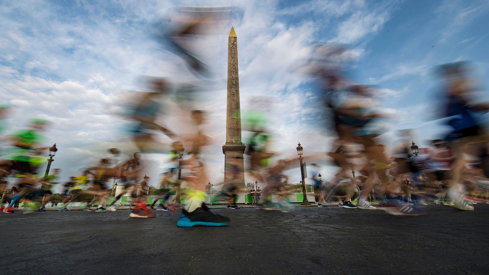
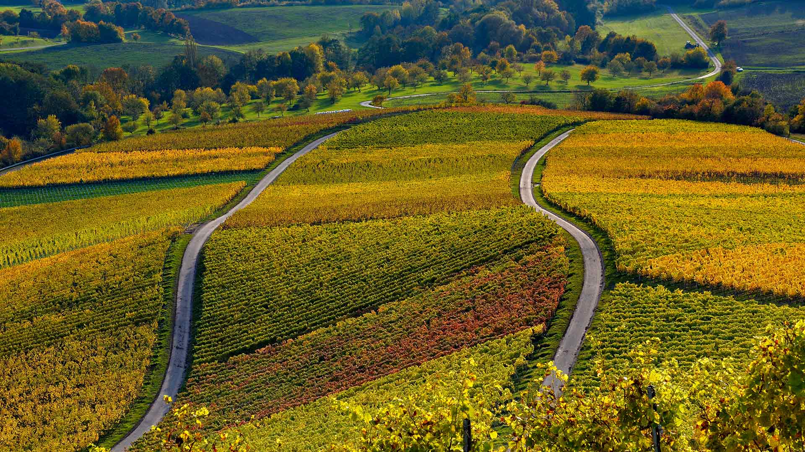
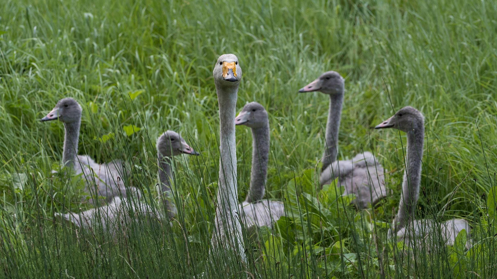
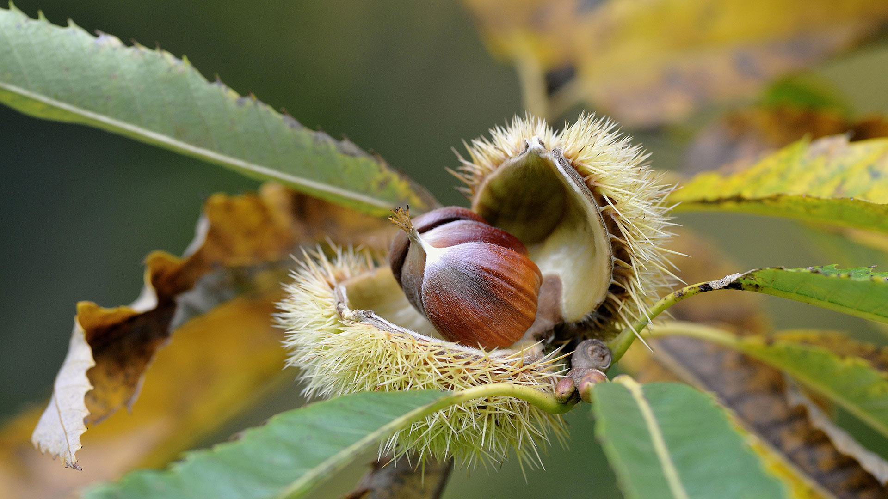

#### 20211031 Grotesques at York Minster, North Yorkshire, England (© John Potter/Alamy)

#### 20211030 Astronomische Uhr am Kirchturm von St. Michael, Schwäbisch Hall, Baden-Württemberg (© imageBROKER/Helmut Meyer zur Capellen/Alamy Stock Photo)

#### 20211029 Ravens in Juneau, Alaska (© Brian Browitt Photo/Adobe Stock)

#### 20211029 Misty pine forest in the Central Highlands of Vietnam (© Thanh Thuy/Moment/Getty Images)

#### 20211028 ｢アーサーの玉座｣イギリス, スコットランド. エディンバラ (© Andrew Merry/Getty Images)

#### 20211028 Necropolis near Dargavs, North Ossetia, Russia (© Yakov Oskanov/Shutterstock)

#### 20211028 Cinnamon fern meadow near St. Mary's River, Nova Scotia (© Irwin Barrett/Design Pics/Alamy)

#### 20211028 The Battery, Signal Hill, St. John's, Newfoundland and Labrador, Canada (© Terrance Klassen/Alamy)

#### 20211027 A pumpkin patch in Newton, Massachusetts (© Frank Debonis/EyeEm/Alamy)

#### 20211027 ｢スノードニア国立公園｣イギリス，ウェールズ (© Sebastian Wasek/Sime/eStock Photo)

#### 20211026 Red fox in the Black Forest of Germany (© Klaus Echle/Minden Pictures)

#### 20211025 Feldhasen auf einem Stoppelfeld, Deutschland (© Michael Breuer/agefotostock/Alamy Stock Photo)

#### 20211025 Dyavolski Most (Devil's Bridge) over the Arda River in Bulgaria (© Petar Mladenov/Alamy)

#### 20211024 Bavljenac Island, Croatia (© Julien Duval/Amazing Aerial Agency)

#### 20211023 Eurasian scops owl in Bohemian Switzerland National Park, Czech Republic (© Milan Zygmunt/Alamy)

#### 20211023 Les Cévennes entre deux saisons (© Yann Guichaoua/Age Fotostock)

#### 20211022 Comet NEOWISE streaks across the sky over Sunwapta Lake in Jasper National Park, Alberta, Canada (© Stocktrek Images, Inc./Alamy)

#### 20211021 Abenddämmerung über der Altstadt von Passau, Bayern (© Sergey Alimov/Moment/Getty Images)

#### 20211021 Plafond voûté du Grand Palais en verre et en acier, Paris (© Roberto Destarac Photo/Shutterstock)

#### 20211021 Bald cypress and Spanish moss in the Atchafalaya Basin, Louisiana (© Chris Moore/Exploring Light Photography/Tandem Stills + Motion)

#### 20211020 Brown-throated three-toed sloth in Manuel Antonio National Park, Costa Rica (© Lukas Kovarik/Shutterstock)

#### 20211019 The Fanal Forest on Madeira Island, Portugal (© Val Thoermer/Alamy)

#### 20211018 ｢夕焼けに映える月｣ (© kanzilyou/iStock/Getty Images Plus)

#### 20211018 Capel Curig in Snowdonia National Park, Wales, United Kingdom (© Sebastian Wasek/Sime/eStock Photo)

#### 20211017 Redwood Memorial Grove in Whakarewarewa Forest, North Island, New Zealand (© Michael Breitung/Huber/eStock Photo)

#### 20211017 Des coureurs passent devant l’Obélisque place de la Concorde pendant le 42ème marathon de Paris en avril 2018 (© Ian Lagsdon/EPA-EFE/Shutterstock)

#### 20211016 Aerial view of the Temple of Hatshepsut near Luxor, Egypt (© Ratnakorn Piyasirisorost/Moment/Getty Images)

#### 20211014 Saguaro 'family' and Milky Way, Saguaro National Park, Arizona (© Christian Foto Az/Shutterstock)

#### 20211013 Farra di Soligo in the Prosecco Hills of Veneto, Italy (© Olimpio Fantuz/Sime/eStock Photo)

#### 20211013 An ichthyosaur fossil of the Jurassic period, Dinosaurland Fossil Museum, Lyme Regis, Dorset, England (© Christopher Jones/Alamy)

#### 20211012 Saint-Malo in Brittany, France (© Mathieu Rivrin/Moment/Getty Images)

#### 20211011 拉莫里斯国家公园中的Wapizagonke湖区，加拿大魁北克 (© Instants/Getty Images)

#### 20211011 Weinberge auf dem Stollberg bei Handthal, Oberschwarzach, Unterfranken, Bayern (© Rüdiger Hess/geo-select FotoArt)

#### 20211011 The Clan House at Totem Bight State Historical Park near Ketchikan, Alaska (© Ron Niebrugge/Alamy)

#### 20211011 Least Chipmunk (Tamias minimus) adult, feeding on berries in Autumn, Jasper National Park, Alta. (© Ignacio Yufera/Minden Pictures)

#### 20211010 Rainbow abalone shell, New Zealand (© Lynda Harper/Minden Pictures)

#### 20211009 Sandhill cranes and mallard ducks, Bosque del Apache National Wildlife Refuge, New Mexico (© Cathy & Gordon Illg/Jaynes Gallery/DanitaDelimont.com)

#### 20211008 ｢サンフアン諸島｣米国, ワシントン州 (© Stephen Matera/Tandem Stills + Motion)

#### 20211008 Common octopus off the coast of France in the Mediterranean Sea (© BIOSPHOTO/Alamy)

#### 20211007 Huay Mae Khamin Waterfall in Khuean Srinagarindra National Park, Thailand (© Casper1774Studio/Getty Images)

#### 20211006 Dallas Divide in southwest Colorado (© Ronda Kimbrow/Shutterstock)

#### 20211006 Fall foliage in Mount Assiniboine Provincial Park, British Columbia (© Mitch Pittman/TANDEM Stills + Motion)

#### 20211006 Boreal forest, Quebec, Canada (© Onfokus/Getty Images)

#### 20211005 Kindergarteners drawing on canvases in Nantong, Jiangsu province, China (© Xu Hui/VCG via Getty Images)

#### 20211005 爱德华王子岛的森林和树冠，加拿大 (© OliverChilds/Getty Images)

#### 20211004 Andromeda galaxy (© NASA/JPL-Caltech)

#### 20211003 Cygne chanteur avec des petits, Finlande (© Jussi Murtosaari/Minden Pictures)

#### 20211003 Reife Früchte einer Edelkastanie, Nordrhein-Westfalen (© Frederik/imageBROKER/Shutterstock)

#### 20211002 The Ivishak River in the North Slope of Alaska (© Don Paulson/Danita Delimont)

#### 20211002 The Roman amphitheater of Itálica, near Seville, Spain (© Amazing Aerial Agency/Offset by Shutterstock)

#### 20211001 【 国庆快乐 】（ © GettyImages ）

#### 20211001 Hyacinth macaws in the Pantanal region of Brazil (© David Pattyn/Minden Pictures)

