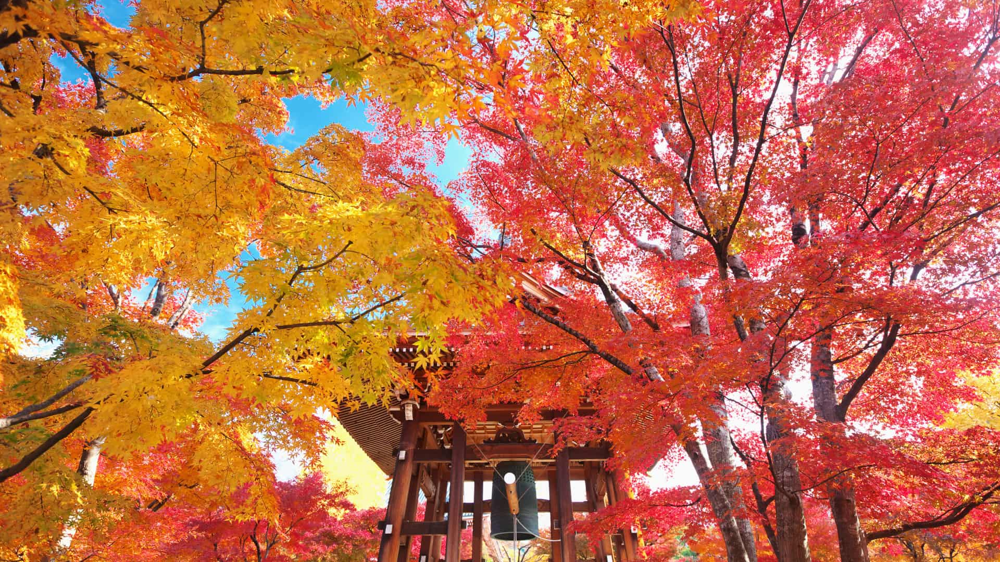
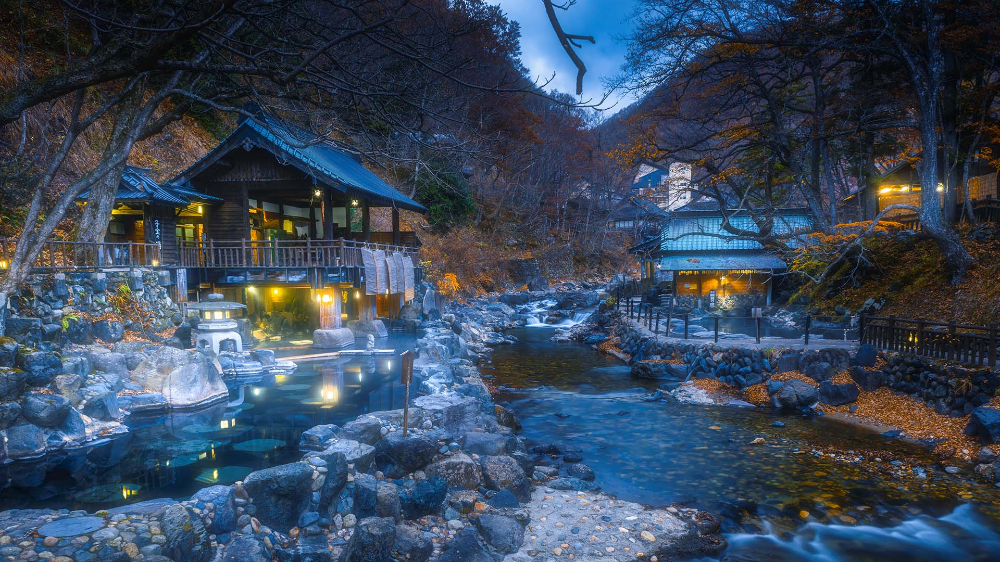
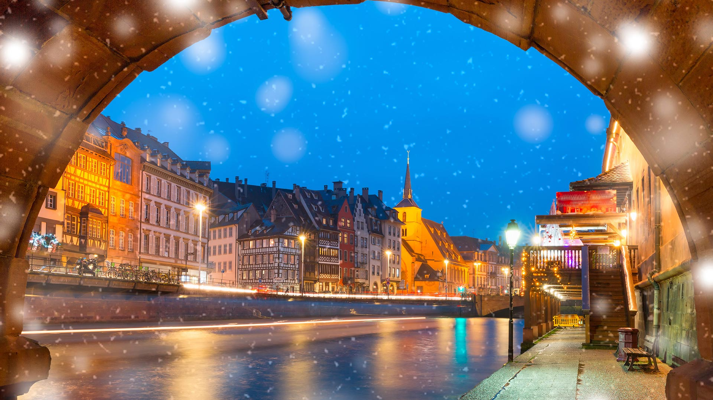
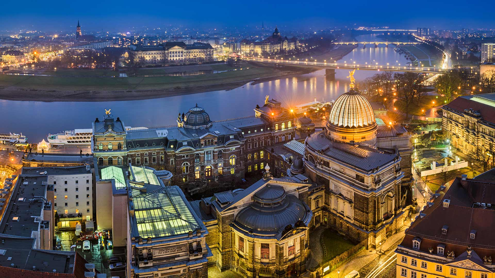
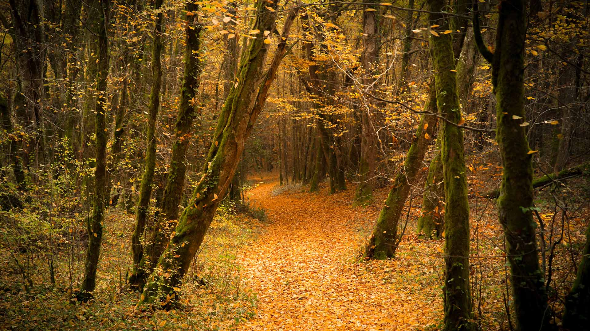
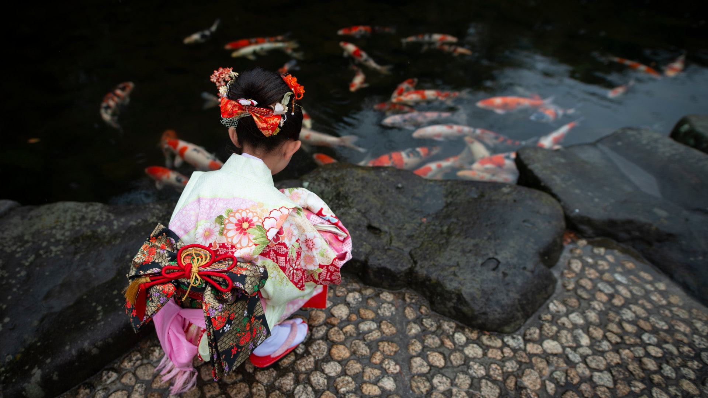
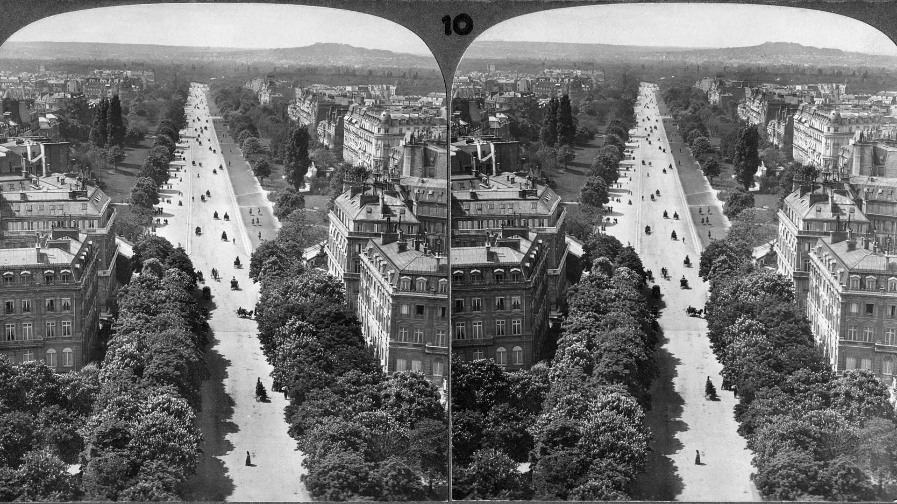
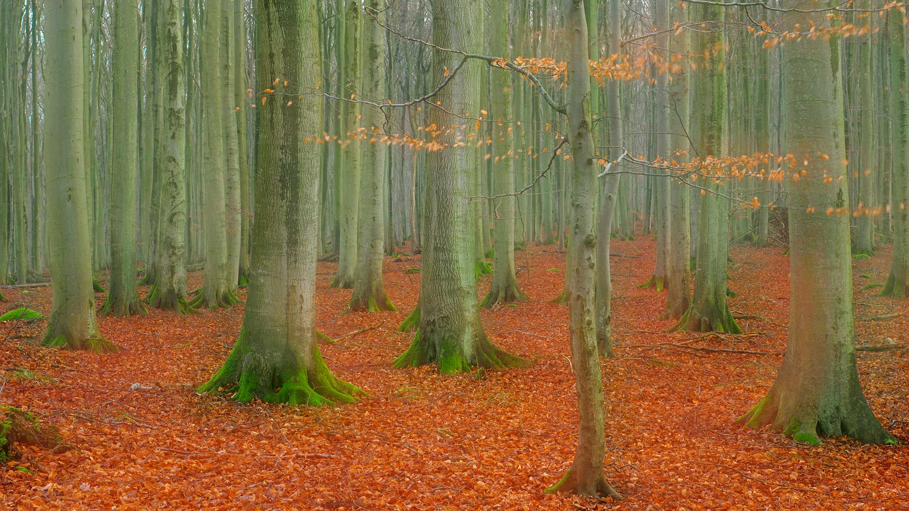

#### 20211130 African bush elephants at Masai Mara National Reserve in Kenya (© Yva Momatiuk and John Eastcott/Minden Pictures)

#### 20211130 紅葉の智積院鐘楼堂, 京都 （© Masataka Ishi/AFLO/4Corners）

#### 20211129 Aerial view of snowy peaks of Vinicunca (aka Rainbow Mountain), Peru (© Jude Newkirk/Amazing Aerial Agency)

#### 20211128 Centennial Bridge towering above Soberanía National Park, Panama (© David Tipling/Universal Images Group via Getty Images)

#### 20211128 古老的水青冈树，英国北安普顿郡 (© Andrew Baskott/Alamy)

#### 20211127 Bohemian waxwing, Canada (© Mircea Costina/Alamy)

#### 20211127 Celebration of the holiday season at Nathan Philips Square, Toronto (© CharlineXia Ontario Canada Collection/Alamy Stock Photo)

#### 20211127 伊兰谷中的Pen y Garreg水坝，威尔士 (© Joe Daniel Price/Moment Open/Getty Images)

#### 20211126 Zuni Olla Maidens at the annual Inter-Tribal Ceremonial in Gallup, New Mexico (© Julien McRoberts/Danita Delimont)

#### 20211126 Regionaler Naturpark Vosges du Nord, Frankreich (© Michel Rauch/Minden Pictures)

#### 20211126 宝川温泉, 群馬 （© Marco Bottigelli/Moment/Getty images）

#### 20211126 Quai et église Saint-Nicolas à Strasbourg pendant la période des fêtes (© KavalenkavaVolha/iStock/Getty Images Plus)

#### 20211126 Aerial view of Penn Station and the New York City skyline at night in the 1950s (© R. Gates -Staff/Getty Images)

#### 20211125 Red squirrels in Cairngorms National Park, Highlands, Scotland (© Scotland: The Big Picture/Minden Pictures)

#### 20211124 Chocolate Hills in Bohol, Philippines (© Danita Delimont/Offset by Shutterstock)

#### 20211123 Cross-section of a fossilized ammonite shell (© Marianna Armata/Getty Images)

#### 20211122 Irohazaka road near Nikkō, Japan (© LightRecords/Shutterstock)

#### 20211122 Blick von der Frauenkirche auf die Altstadt und die Elbe, Dresden, Sachsen (© Michael Abid/Mapics/Adobe Stock)

#### 20211121 Forest near the village of Invergarry, Scotland (© Matt Anderson Photography/Getty Images)

#### 20211121 African bush elephants at Masai Mara National Reserve in Kenya (© Yva Momatiuk and John Eastcott/Minden Pictures)

#### 20211120 'A New Breath' by artist Saype in Moléson-sur-Gruyères, Switzerland (© Valentin Flauraud/Shutterstock)

#### 20211120 阿西尼博因山公园的秋叶，加拿大不列颠哥伦比亚省 (© Mitch Pittman/TANDEM Stills + Motion)

#### 20211119 A Bohemian waxwing in Canada (© Mircea Costina/Alamy)

#### 20211119 Rame Head, Cornwall, England (© Cavan Images/Offset)

#### 20211119 The Subway slot canyon in Zion National Park, Utah (© Stan Moniz/Tandem Stills + Motion)

#### 20211119 Forêt en automne (© Laud Nicolas/EyeEm/Getty Image)

#### 20211118 Bouteilles de vin vides dans une cave dans le Beaujolais pour le Beaujolais Nouveau (© Arco/J Pfeiffer/Age Fotostock)

#### 20211118 Bohemian Switzerland National Park near Tisá, Czech Republic (© Amazing Aerial Agency/Offset)

#### 20211118 潘塔纳尔湿地的风信子金刚鹦鹉，巴西 (© David Pattyn/Minden Pictures)

#### 20211117 A frost covered grass field with trees in autumn colours; Iron Hill, Quebec (© plainpicture/Design Pics/David Chapman)

#### 20211117 Fassadendetail der Residenz in München, Bayern, Deutschland (© Rüdiger Hess/geo-select FotoArt)

#### 20211117 Boardwalk Trail at Corkscrew Swamp Sanctuary in Florida (© Bill Gozansky/Alamy)

#### 20211116 The Jacobite steam train crossing the Glenfinnan Viaduct in Inverness-shire, Scotland (© The Escape of Malee/Shutterstock)

#### 20211115 着物姿の女の子, 日本 （© Hakase_/Getty Images）

#### 20211114 Manatee in Florida (© Paul E Tessier/Cavan Images/Offset by Shutterstock)

#### 20211113 First Cliff Walk on First near Grindelwald, Switzerland (© Hans-Georg Eiben/eStock Photo)

#### 20211112 Aerial view of El Tajo gorge and the Puente Nuevo bridge in Ronda, Málaga, Spain (© Jude Newkirk/Amazing Aerial Agency)

#### 20211111 The Canadian 'Brooding Soldier' memorial commemorating the second battle of Ypres, St. Julien, Belgium (© Richard Lautens/Toronto Star via Getty Images)

#### 20211111 Service members on the amphibious assault ship USS Iwo Jima on New York's Hudson River during Veterans Week, 2016 (© Apple White/Alamy)

#### 20211111 Beavers Bend Resort Park near Broken Bow, Oklahoma (© Inge Johnsson/Alamy)

#### 20211110 Carte stéréo Underwood & Underwood représentant l’avenue du Bois de Boulogne (Avenue Foch) prise depuis l’arc de Triomphe vers le mont Valérien (© JT Vintage/Glasshouse Images/Alamy Stock Photo)

#### 20211110 Nohsngithiang Falls in Meghalaya, India (© Upamanyoo Das/Shutterstock)

#### 20211110 Rotbuchenwald im Nationalpark Jasmund, Rügen, Mecklenburg-Vorpommern (© Sandra Bartocha/NPL/Minden Pictures)

#### 20211110 Cumberland Island National Seashore, Georgia (© Wilsilver77/Getty Images Plus)

#### 20211109 Ancient rock tombs carved into the cliff near Dalyan, Turkey (© Reinhard Schmid/eStock Photo)

#### 20211108 Polar bear investigating a camera, Churchill, Manitoba, Canada (© Matthias Breiter/Minden Pictures)

#### 20211107 Mack Arch Rock at sunrise on the southern Oregon coast (© Dennis Frates/Alamy)

#### 20211106 Female numbat in Brookton, Western Australia (© Martin Willis/Minden Pictures)

#### 20211105 Pont Rouge (Red Bridge) over the Palmer River in Sainte-Agathe-de-Lotbinière, Quebec, Canada (© Jean Surprenant/Getty Images)

#### 20211104 托利莫尔森林公园的弗利桥，英国北爱尔兰 (© Adrian McGlynn/Alamy)

#### 20211104 Lanterns illuminated for the Diwali festival, Mumbai, India (© RAMNIKLAL MODI/Shutterstock)

#### 20211103 Moon jelly and golden jellyfish, Raja Ampat, West Papua, Indonesia (© Alex Mustard/Minden Pictures)

#### 20211101 Marigolds decorate a cemetery in Patzcuaro, Michoacan, Mexico, for a Day of the Dead ceremony (© Daniel Elizalde S/Shutterstock)

#### 20211101 海滩上的三趾鹬，法国布列塔尼大区 (© Fabrice Cahez/Minden Pictures)

#### 20211101 The sculpture 'Kindred Spirits' by Alex Pentek in Bailick Park, Midleton, County Cork, Ireland (© David Creedon/Alamy Live News/Alamy)

#### 20211101 A lone wolf standing tall amid autumn colours near Montebello, Que. (© Thousand Word Images by Dustin Abbott/Getty Images)

