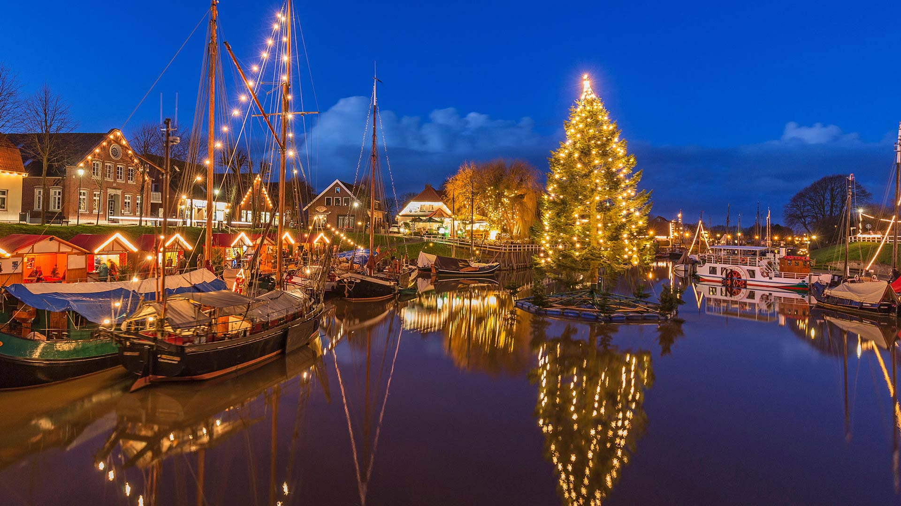
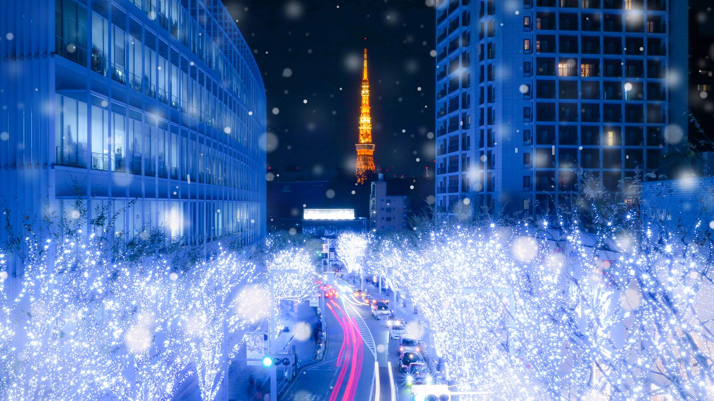
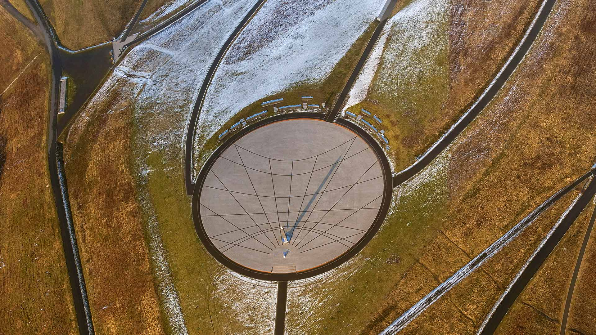
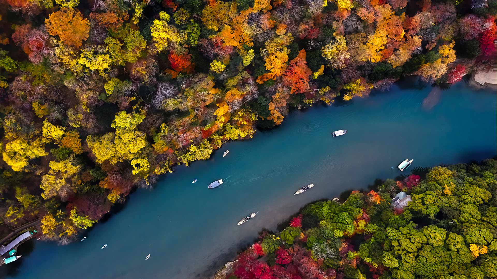

#### 20211231 Bonfire to celebrate New Year's Eve in 2014 in Reykjavik, Iceland (© Ragnar Th Sigurdsson/Alamy)

#### 20211231 Eissegler auf dem Wörthsee, Bayern (© PK-Photos/iStock/Getty Images Plus/Getty Images)

#### 20211230 Petit village de Riquewihr dans le Haut-Rhin en Alsace (© Walter Bibikow/eStock Photo)

#### 20211230 Westerheversand Lighthouse in Westerhever, Germany (© Sandra Bartocha/Minden Pictures)

#### 20211230 知恩院大鐘楼, 京都 東山区 (© Zoonar/olga demchishina/Zoonar GmbH/Alamy Stock Photo)

#### 20211229 Rue du Petit-Champlain at Lower Old Town (Basse-Ville), Quebec City (© Diego Grandi/Shutterstock)

#### 20211229 Mountain goats in the Yukon, Canada (© Mark Newman/Getty Images)

#### 20211228 Kjell Henriksen Observatory in Svalbard, Norway (© Vincent Fournier/Gallery Stock)

#### 20211227 Snow buntings flock during a snowstorm in New York (© Marie Read/Minden Pictures)

#### 20211227 ホッキョクグマの子どもたち, カナダ チャーチル (© Cheryl Ramalho/Getty Images)

#### 20211227 Chardonnerets élégants perchés sur des branches couvertes de neige (© Christophe Sidamon-Pesson/Minden)

#### 20211226 日光下的村落，英格兰东萨塞克斯郡 (© JohnnyPowell/iStock/Getty Images Plus)

#### 20211226 Royal Pavilion Ice Rink in Brighton, England (© Chris Gorman/Getty Images)

#### 20211226 解析機関の設計図, イギリス ロンドン (© Science & Society Picture Library/Getty Images)

#### 20211225 The Rougier de Camarès, Aveyron, France (© Eric Teissedre/Photononstop/Alamy Banque d'Images)

#### 20211225 Trees on the northern slope of Mount Khomyak in the Carpathian Mountains, Ukraine (© panaramka/Getty Images)

#### 20211225 Schwimmender Weihnachtsbaum im Museumshafen Carolinensiel, Niedersachsen (© Manfred Habel/mauritius images GmbH/Alamy Stock Photo)

#### 20211224 Christmas tree at Weissensee, a small lake near Ehrwald in Tyrol, Austria (© nagelestock/Alamy)

#### 20211224 サンタクロース学校, イギリス ロンドン (© Matt Dunham/AP Photo)

#### 20211223 六本木けやき坂のイルミネーション, 東京 (© YUJISTYLE/iStock/Getty Images Plus)

#### 20211223 Two young male polar bears, Churchill, Manitoba, Canada (© Cheryl Ramalho/Getty Images)

#### 20211222 Winter scene illuminated on the Palais de l'Isle in Annecy, Haute Savoie, France (© blickwinkel/Alamy)

#### 20211221 クリスマスのビーチ小屋, イギリス ボーンマス (© Allouphoto/Alamy)

#### 20211221 Sonnenuhr auf der Halde Hoheward, Herten, Nordrhein-Westfalen (© Hans Blossey/imageBROKER/Alamy Stock Photo)

#### 20211220 Sunlight in the forest of Western Siberia, near the city of Raduzhny, Russia (© Leonid Ikan/Shutterstock)

#### 20211220 Linn of Quoich瀑布旁的碗状岩石洞，苏格兰阿伯丁郡 (© AWL Images/Danita Delimont)

#### 20211220 Performers from the Ministry of Fun Santa School in London, England (© Matt Dunham/AP Photo)

#### 20211220 Trees on the northern slope of Mount Khomyak in the Carpathian Mountains, Ukraine (© panaramka/Getty Images)

#### 20211219 Royal Pavilion Ice Rink in Brighton, England (© Chris Gorman/Getty Images)

#### 20211219 Aurora borealis above the Brooks Range in Alaska (© Noppawat Tom Charoensinphon/Getty Images)

#### 20211218 阿尔萨斯的葡萄酒村，法国上莱茵省 (© Walter Bibikow/eStock Photo)

#### 20211218 Iron Hill, Town of Brome Lake, Quebec, Canada (© plainpicture/Design Pics/David Chapman)

#### 20211218 The December full moon seen through holiday lights (© Jesus Merida/Getty Images)

#### 20211217 Christmas-themed beach huts in Bournemouth, England (© Allouphoto/Alamy)

#### 20211217 Indian rhinoceros, Kaziranga National Park, India (© Abhishek Singh/Moment/Getty Images)

#### 20211217 Toronto Christmas Market at the Distillery District (© robertharding/Alamy Stock Photo)

#### 20211217 Winter scene illuminated on the Palais de l'Isle in Annecy, Haute Savoie, France (© blickwinkel/Alamy)

#### 20211216 Star trail photography taken in Yellowknife (© Seong-won Jang/EyeEm/Getty Images)

#### 20211216 韦尼格罗德的圣诞市场，德国萨克森-安哈尔特州 (© Krzysztof Baranowski/Moment/Getty Images)

#### 20211216 Polarfuchs im Dovrefjell-Sunndalsfjella-Nationalpark, Norwegen (© Andy Trowbridge/Minden Pictures)

#### 20211216 The English National Ballet's 2016 production of 'The Nutcracker' at the London Coliseum in London, England (© Robbie Jack/Corbis via Getty Images)

#### 20211216 Merle d’Amérique sur une branche au Canada (© marcophotos/Getty Images)

#### 20211215 The chapel and hermitage of Santa Justa in Cantabria, Spain (© Luis Miguel Martin/Getty Images)

#### 20211214 Le Rougier de Camarès en Aveyron (© Eric Teissedre/Photononstop/Alamy Banque d'Images)

#### 20211214 Château du Haut-Kœnigsbourg (Hohkönigsburg) in den Vogesen, Elsass, Frankreich (© Leonid Andronov/Shutterstock)

#### 20211214 American robin perched on a branch in Canada (© marcophotos/Getty Images)

#### 20211213 ホッキョクギツネ, ノルウェー (© Andy Trowbridge/Minden Pictures)

#### 20211213 Old Town and El Panecillo Hill in Quito, Ecuador (© Karol Kozlowski/plainpicture)

#### 20211212 Wicker fields in Cañamares, Spain (© David Santiago Garcia/Alamy)

#### 20211211 The shadow of Mount Everest over the western Himalayas in Nepal (© Kent Karvey/KH Films, Inc./Tandem Stills + Motion)

#### 20211210 Morgenfrost auf Nadelbäumen im Mount-Siguniang-Nationalpark in der Provinz Sichuan, China (© Robert Harding World Imagery/Offset by Shutterstock)

#### 20211210 Arctic fox in Dovrefjell-Sunndalsfjella National Park, Norway (© Andy Trowbridge/Minden Pictures)

#### 20211210 大堰川の紅葉, 京都 嵐山 (© Anupong Sakoolchai/Moment/Getty Images)

#### 20211209 Glowworms in Blue Mountains National Park, Australia (© Leelakajonkij/Getty Images)

#### 20211208 Petrified Forest National Park, Arizona (© Ian Shive/Tandem Stills + Motion)

#### 20211207 Vancouver Christmas Market, Jack Poole Plaza, Vancouver (© Michael Wheatley/Alamy Stock Photo)

#### 20211207 US Navy sailors on the WWII museum ship USS Bowfin in Honolulu, Hawaii (© US Navy Photo/Alamy)

#### 20211207 American robin perched on a branch in Canada (© marcophotos/Getty Images)

#### 20211206 薄雾中的格拉斯顿伯里托尔，英格兰萨默塞特郡 (© DEEPOL by plainpicture/Adam Burton)

#### 20211206 オークニグスブール城, フランス アルザス地域圏 (© Leonid Andronov/Shutterstock)

#### 20211206 An 1840 design for the Analytical Engine by Charles Babbage (© Science & Society Picture Library/Getty Images)

#### 20211205 The Salzach River in Salzburg, Austria (© MacEaton/Alamy)

#### 20211205 „Schüler“ der Ministry of Fun Santa School in London, England (© Matt Dunham/AP Photo)

#### 20211204 Mother cheetah and her cub in the Masai Mara National Reserve, Kenya (© gudkovandrey/Adobe Stock)

#### 20211204 Eastbourne Pier, East Sussex, England (© Robert Harding World Imagery/Offset by Shutterstock)

#### 20211203 Autumn leaves coated with frost (© sagarmanis/Getty Images)

#### 20211203 Old Town and El Panecillo Hill in Quito, Ecuador (© Karol Kozlowski/plainpicture)

#### 20211202 Dall sheep rams at Polychrome Pass, Denali National Park, Alaska (© Patrick J. Endres/Getty Images)

#### 20211201 Blue icebergs near Cuverville Island, Antarctica (© Mike Hill/Getty Images)

