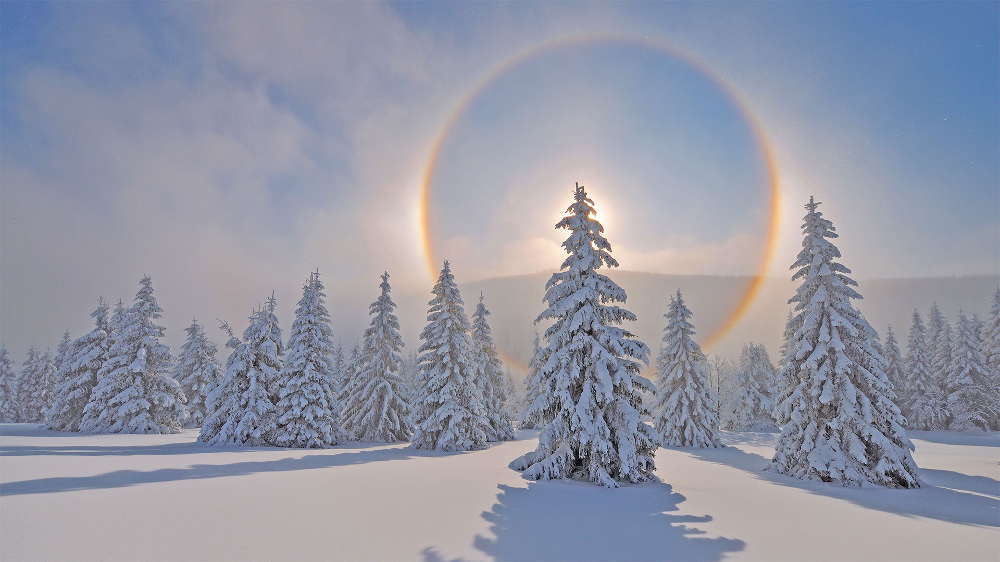
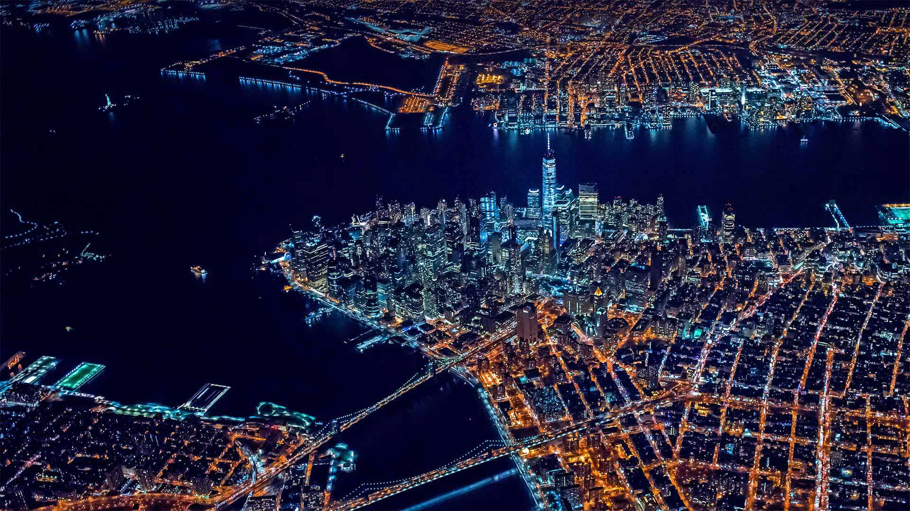
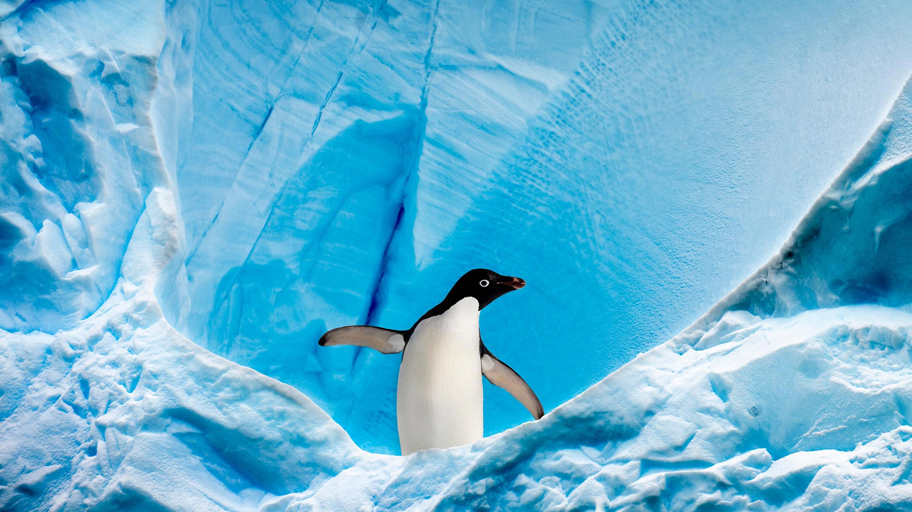
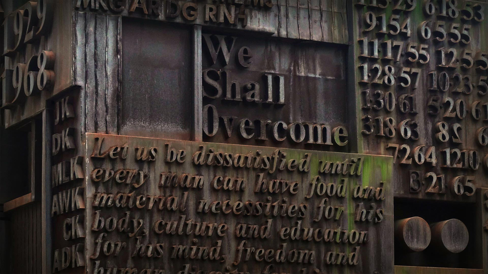
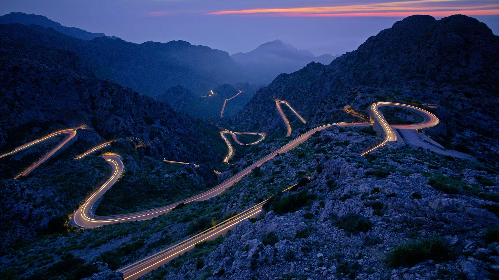
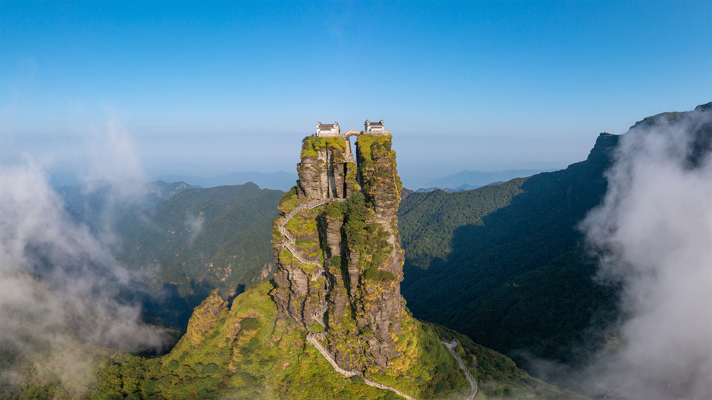
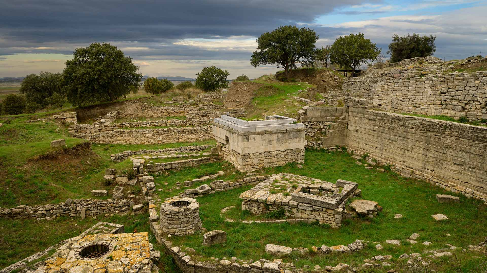
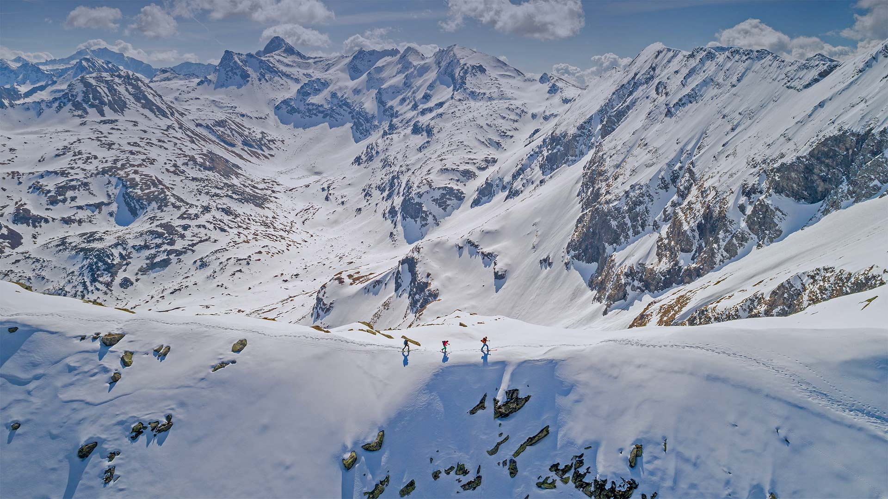
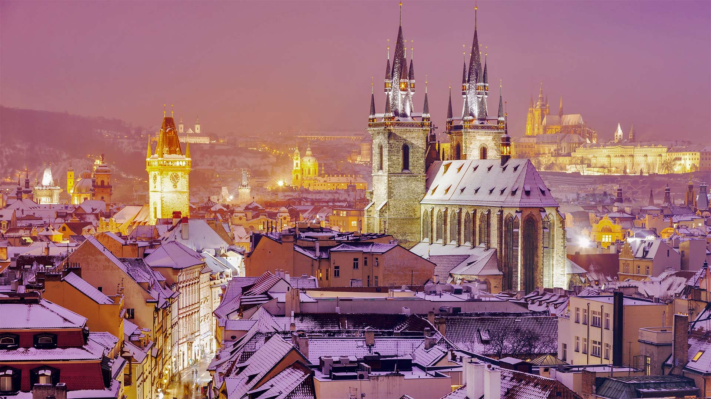
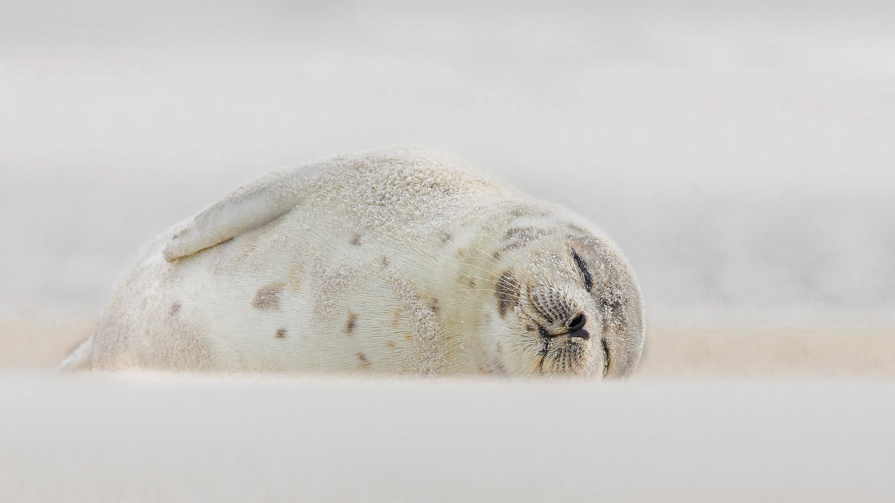

#### 20220131 Workers sorting incense in the Huyện Ứng Hòa district of Hanoi, Vietnam (© Azim Khan Ronnie/Amazing Aerial Agency)

#### 20220131 烟花绽放的除夕夜，中国 (© MediaProduction/E+/Getty Images)

#### 20220131 ベンガルトラ, インド ラジャスタン (© eROMAZe/E+/Getty Images)

#### 20220130 Halo around the sun in the Ore Mountains, Saxony, Germany (© Martin Ruegner/Getty Images)

#### 20220129 Corjuem Fort in Goa, India (© Ingvar Kuznetsov/Shutterstock)

#### 20220129 Symmetrical brain coral on a reef in the Caribbean Sea near Grand Cayman, Cayman Islands (© Alex Mustard/Minden Pictures)

#### 20220129 Le Canal de Berry après une chute de neige, Loir-et-Cher, Centre (© robertharding/Alamy Stock Photo)

#### 20220128 Short-eared owl hunting at dusk in Worlaby Carrs, Lincolnshire, England (© Ben Hall/Minden Pictures)

#### 20220127 Bluespotted ribbontail ray near Perth, Australia (© Jeff Rotman/Minden Pictures)

#### 20220127 キレンジャク (© sandpiper/adobe stock)

#### 20220126 Mehrangarh Fort in Jodhpur, Rajasthan, India (© Jayakumar/Shutterstock)

#### 20220125 Tŵr Mawr lighthouse on Llanddwyn Island, Anglesey, Wales (© Joe Daniel Price/Getty Images)

#### 20220124 Eine Schar Rebhühner kuschelt sich im Schnee zusammen, um sich zu wärmen (© Duncan Usher/Minden Pictures)

#### 20220124 Lower Manhattan in New York City (© New York On Air/Offset/Shutterstock)

#### 20220122 Martinique, Lesser Antilles, Caribbean Sea (© Airpano LLC/Amazing Aerial Agency)

#### 20220121 A family of caribou in a snowy landscape, Northwest Territories (© Geoffrey Reynaud/Getty Images)

#### 20220121 ハミルトン山のリック天文台, 米国 カリフォルニア州 (© Jeffrey Lewis/Tandem Stills + Motion)

#### 20220121 A lion cub and mother in Sabi Sabi Game Reserve, South Africa (© Andrew Coleman/Getty Images)

#### 20220120 Meoto Iwa (Wedded Rocks) off the coast of Futami, Mie Prefecture, Honshu, Japan (© Marco Gaiotti/plainpicture)

#### 20220119 Saint Elias Mountains and Kaskawulsh Glacier in Kluane National Park and Reserve, Yukon, Canada (© Design Pics Inc/Alamy)

#### 20220119 Adélie penguin in Graham Passage, Antarctic Peninsula, Antarctica (© Nick Garbutt/Minden Pictures)

#### 20220118 Areal view of Toronto cityscapes on a winter morning (© Katrin Ray Shumakov/Getty Images)

#### 20220118 博格豪森镇和萨尔察赫河，德国巴伐利亚州 (© Harald Nachtmann/Moment/Getty Images)

#### 20220118 Ashdown Forest, home of Winnie-the-Pooh, England (© Mark Phillips/Alamy)

#### 20220118 Le bassin d’Apollon sous la neige dans le parc du château de Versailles, photographié le 6 février 2018 (© FRANCOIS GUILLOT/AFP via Getty Images)

#### 20220117 Église Notre-Dame-des-Pauvres, Aubrac, Aveyron (© CAVALIER Michel/hemis.fr/Alamy photo stock)

#### 20220117 MLK memorial sculpture by William Tarr outside of Martin Luther King Jr. Educational Campus in New York City (© Randy Duchaine/Alamy)

#### 20220117 莱达尔湖, 英格兰坎布里亚郡湖区 (© Tranquillian1/iStock/Getty Images Plus)

#### 20220115 Sorting chili peppers at a farm in Bogra, Bangladesh (© Amazing Aerial Agency/Offset/Shutterstock)

#### 20220115 To Sua Ocean Trench on the south coast of Upolu Island in Samoa (© Chris McLennan/Alamy)

#### 20220114 The road leading to Sa Calobra on the Spanish Balearic island of Majorca (© Tolo Balaguer/agefotostock)

#### 20220113 Northern lights over a stranded boat in Tasiilaq, Greenland (© Shane P. White/Minden Pictures)

#### 20220112 Kochelsee und der Gipfel des Heimgartens, Bayern, (© Reinhard Schmid/eStock Photo)

#### 20220112 Mount Fanjing in southwest China (© zhuxiaophotography/Shutterstock)

#### 20220111 A porcupine hangs on a willow tree branch, Alaska (© Design Pics/Danita Delimont)

#### 20220110 Skier making a turn in pristine snow in Whistler, B.C. (© stockstudioX/Getty Images)

#### 20220109 Rice laid out to dry in Dhamrai, Dhaka, Bangladesh (© Amazing Aerial Agency/Offset by Shutterstock)

#### 20220108 American bison in Yellowstone National Park, Wyoming (© Steve Gettle/Minden Pictures)

#### 20220108 Vue depuis un traîneau tiré par des chiens au milieux des montagnes, Les Cabannes, Occitanie, France (© Cavan Images/Alamy Stock Photo)

#### 20220107 Nazaré Lighthouse atop Forte de São Miguel Arcanjo, Nazaré, Portugal (© Richard A Lock/Getty Images)

#### 20220106 Heiligtumsmauern und Brunnen von Troja VI in der archäologischen Fundstätte bei Hisarlık, Türkei (© Reimar/Adobe Stock)

#### 20220106 Kochelsee and Heimgarten Mountain in Bavaria, Germany (© Reinhard Schmid/eStock Photo)

#### 20220105 Plate-billed mountain toucan in Bellavista Cloud Forest Reserve, Ecuador (© Tui De Roy/Minden Pictures)

#### 20220105 Black-capped Chickadee (Poecile atricapillus) in snowfall, Nova Scotia (© Scott Leslie/Minden Pictures)

#### 20220104 Borrego Badlands in Anza-Borrego Desert State Park, California (© Tom Hogan/plainpicture)

#### 20220103 ベンガルトラの親子, インド (© Andy Rouse/NPL/Minden Pictures)

#### 20220103 Ski touring in the High Tauern mountain range near Bad Gastein, Austria (© RooM the Agency/Alamy)

#### 20220103 The Lick Observatory on Mount Hamilton, near San Jose, California (© Jeffrey Lewis/Tandem Stills + Motion)

#### 20220102 Skyline of Prague, Czech Republic (© benkrut/Getty Images)

#### 20220102 新年の獅子舞 (© CLEMENT CAZOTTES/Alamy Stock Photo)

#### 20220101 Mehrangarh Fort, Rajasthan, India (© Avigator Fortuner/Shutterstock)

#### 20220101 神磯の鳥居, 茨城 大洗 (© Pigprox/Shutterstock)

#### 20220101 Harp seal sleeping at Jones Beach, Long Island, New York (© Vicki Jauron, Babylon and Beyond Photography/Getty Images)

#### 20220101 Drapeaux de la France et de l’Europe flottant sous l’Arc de Triomphe, Paris (© genekrebs/iStock/Getty Images Plus/Getty Images)

