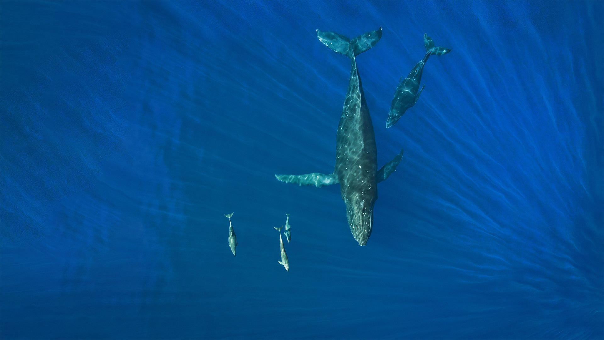

#### 20220228 Weinstadel und Wasserturm am Ufer der Pegnitz, Nürnberg, Bayern (© Reinhard Schmid/Huber/eStock Photo)

#### 20220227 Polar bear mother with cubs in Wapusk National Park, Manitoba, Canada (© Andre Gilden/Minden Pictures)

#### 20220226 Lamplugh Glacier in Glacier Bay National Park, Alaska (© Andrew Peacock/Getty Images)

#### 20220225 Hoarfrost and snow in the Cotswolds, England (© Peter Adams/Getty Images)

#### 20220225 怀特霍斯市的落日余晖，加拿大育空地区 (© Robert Postma/Design Pics)

#### 20220225 Saint-Etienne-de-Tinée, Vallée de la Tinée, Parc national du Mercantour, Alpes Maritimes France, (© CAVALIER Michel/hemis.fr/Alamy Stock Photo)

#### 20220225 'Legacy' mural painted by Josh Sarantitis and Eric Okdeh within the Mural Arts Program in Philadelphia, Pennsylvania (© Vespasian/Alamy)

#### 20220224 Flowing river inside a glacier cave, Vatnajökull, Iceland (© Marco Bottigelli/Getty Images)

#### 20220223 富士山と桜, 山梨 富士河口湖町 (© Sanchai Loongroong/Moment/Getty Images)

#### 20220223 The cypress tunnel at Point Reyes National Seashore in California (© Spondylolithesis/Getty Images)

#### 20220222 母子ライオン, 南アフリカ  (© Andrew Coleman/Getty Images)

#### 20220222 Gorges du Fier gelées par l’hiver, Haute-Savoie  (© Jean-Philippe Delobelle/Biosphoto/Alamy Stock Photo)

#### 20220222 Two Bactrian camels in Kazakhstan for Twosday (© Nurlan Kulcha/Alamy)

#### 20220221 Northern Lights over open water in winter near Whitehorse, Yukon (© plainpicture/Design Pics/John Hyde)

#### 20220221 The Washington Monument seen from the Lincoln Memorial in Washington, DC (© lucky-photographer/Getty Images)

#### 20220220 Humpback whales and dolphins, Hawaii (© drewsulockcreations/Getty Images)

#### 20220219 Polarlicht über Sycamore Gap, Hadrianswall, Northumberland, England, Vereinigtes Königreich (© Guy Edwardes/NPL/Minden Pictures)

#### 20220219 Mount Logan in Kluane National Park and Reserve, Yukon, Canada (© plainpicture/Design Pics/Robert Postma)

#### 20220219 A frozen lake in Banff National Park (© RuslanKaln/Getty Images)

#### 20220219 贝希特斯加登阿尔卑斯山脉全景，德国巴伐利亚州 (© Spotcatch/Westend61/Offset)

#### 20220218 Great tits on a branch during winter in France (© Eric Ferry/Alamy)

#### 20220218 Parc national régional des volcans d'Auvergne, Puy de Dôme (© Hemis/Alamy Stock Photo)

#### 20220217 ムンナルの茶畑, インド ケララ (© SvitlanaBelinska/iStock/Getty Images Plus)

#### 20220217 里士满公园的雄鹿，英国伦敦 (© Ian Schofield Images/Offset/Shutterstock)

#### 20220217 Flamenco dancers outside Palma de Majorca, Spain (© Torleif Svensson/Getty Images)

#### 20220216 Beech woodland in hoarfrost, Cranborne Chase, Dorset, England (© Guy Edwardes/Minden Pictures)

#### 20220215 成都街头的红灯笼，中国四川省（© kiszon pascal/Moment/Getty Images）

#### 20220215 Red lanterns hanging on trees during the Lantern Festival in Chengdu, Sichuan, China (© Philippe Lejeanvre/Getty Images)

#### 20220214 Heart-shaped island with sandy beach, offshore coral reef, Indian Ocean, Maldives (© Willyam Bradberry/Shutterstock)

#### 20220213 Schloss Bellevue, Berlin (© Zoonar GmbH/Alamy Stock Photo)

#### 20220213 小樽雪あかりの路, 北海道 小樽市 (© Pat Law Photography/Moment Unreleased/Getty Images)

#### 20220213 American bison in Yellowstone National Park, Wyoming (© Gerald Corsi/Getty Images)

#### 20220212 Darwin's Arch with Darwin Island in background, Galápagos, Ecuador (© miralex/Getty Images)

#### 20220211 'Go' by Kehinde Wiley, displayed inside Moynihan Train Hall at New York City's Penn Station (© Spencer Platt/Getty Images)

#### 20220211 慕那尔山区的茶园，印度喀拉拉邦 (© SvitlanaBelinska/iStock/Getty Images Plus)

#### 20220211 雪中の白梅 (© sakasyou/iStock/Getty Images Plus)

#### 20220210 The Old City of Bern, Switzerland (© Xantana/Getty Images)

#### 20220209 七姐妹悬崖上的警卫小屋，英国东萨塞克斯郡 (© Paul Daniels/Alamy)

#### 20220209 The Ceremony Hall of Icehotel in Jukkasjarvi, Sweden (© Wolfgang Kaehler/LightRocket via Getty Images)

#### 20220209 Granville Island marina in Vancouver (© Albert Pego/Shutterstock)

#### 20220209 Treetop Walk Saarschleife, Orscholz, Mettlach, Germany (© Hans-Peter Merten/Huber/eStock Photo)

#### 20220208 Rock art near Santa Fe, New Mexico (© Scott Warren/Cavan)

#### 20220208 科西嘉岛上的Speloncato市，法国 (© Jon Ingall/Alamy)

#### 20220207 Rideau Canal Skateway during Winterlude in Ottawa, Canada (© Preappy/Getty Images)

#### 20220207 Gläserner Wald, Regen, Bayerischer Wald, Bayern (© Rüdiger Hess/geo-select FotoArt)

#### 20220206 Eisskulpturen auf dem Winterlude-Festival 2013 in Ottawa, Kanada (© S. Garcia Cournoyer/Alamy)

#### 20220206 Winter in Oymyakon, Russia (© Alexandr Berdicevschi/Getty Images)

#### 20220205 Monarch butterflies in the Monarch Butterfly Biosphere Reserve, Angangueo, Mexico (© Sylvain Cordier/Minden Pictures)

#### 20220205 ユーラシアヒグマ, フィンランド (© Jules Cox/Minden Pictures)

#### 20220204 亚运村夜景，北京 (© ViewStock/Getty Images)

#### 20220204 Speloncato enneigé, Corse (© Jon Ingall/Alamy Stock Photo)

#### 20220204 Big Air Shougang venue in Shijingshan District, Beijing, China (© Gao Zehong/VCG via Getty Images)

#### 20220203 節分の大豆 (© MIXA/Getty Images)

#### 20220203 Corjuem Fort in Goa, India (© Ingvar Kuznetsov/Shutterstock)

#### 20220203 Baumwipfelpfad Saarschleife oberhalb des Aussichtspunktes Cloef bei Orscholz, Mettlach, Saarland (© Hans-Peter Merten/Huber/eStock Photo)

#### 20220202 Alpine marmot in Hohe Tauern National Park, Austria (© Misja Smits/Minden Pictures)

#### 20220201 The 369th Infantry returns to New York City, 1919 (© Science History Images/Alamy)

#### 20220201 寓意幸福和团圆的春节灯笼，中国 (© d3sign/Moment/Getty Images)

