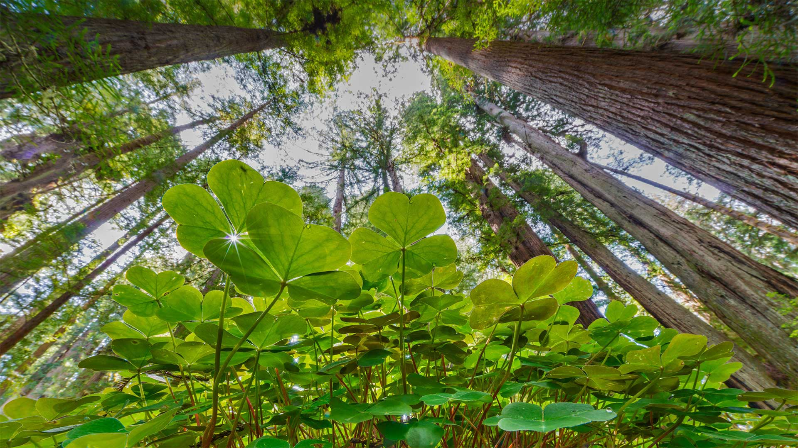
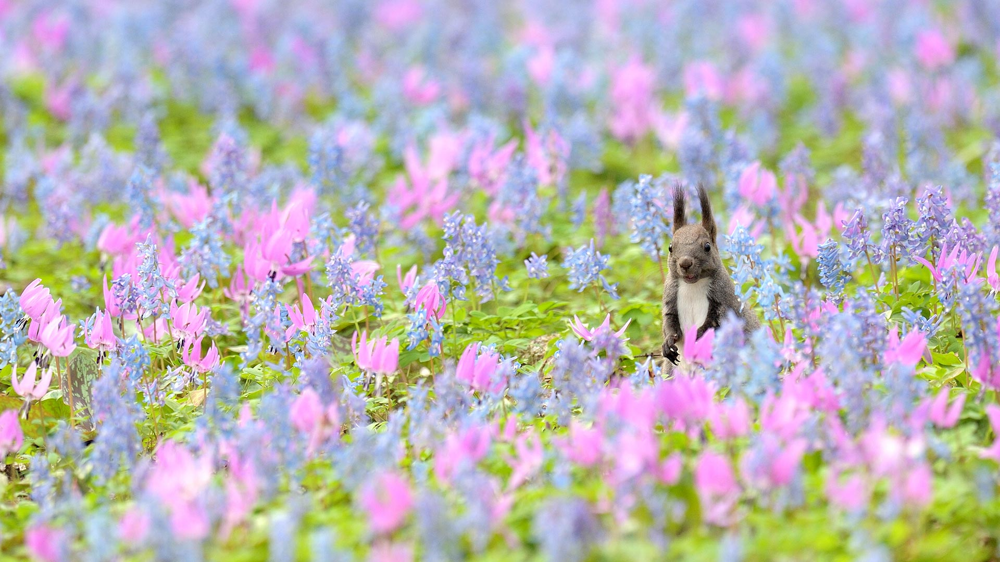
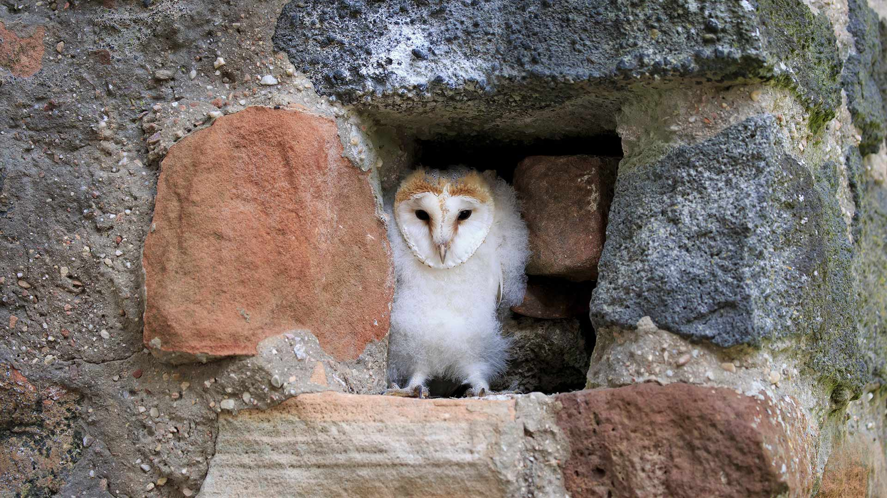
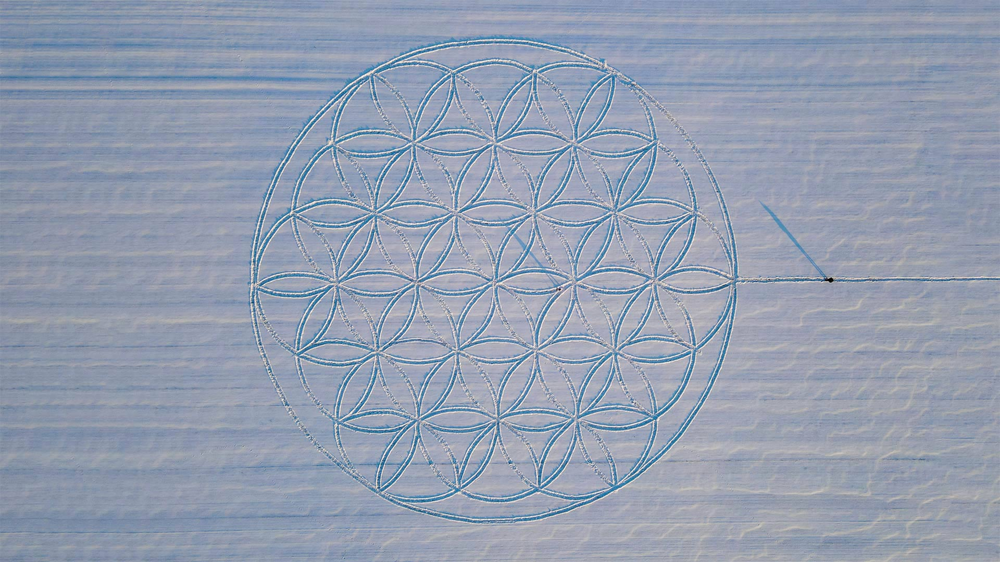

#### 20220331 Eiffel Tower in Paris, France (© Susanne Kremer/eStock Photo)

#### 20220330 Renardeau dans une prairie fleurie en Normandie (© Gerard Lacz/Alamy Stock Photo)

#### 20220330 Belted Galloway cows in Scotland (© JohnFScott/Getty Images)

#### 20220329 MacKenzie Beach, Tofino, British Columbia, Canada (© Robert Postma/Plainpicture/Design Pics)

#### 20220329 Caribbean coast near Parque Nacional Natural Tayrona, Colombia (© Nicholas Hills/Getty Images)

#### 20220328 Wisteria blooms at Kawachi Fuji Garden in Kitakyushu, Japan (© Steve Tan C K Photography/Getty Images)

#### 20220328 Goðafoss waterfall under the northern lights, Iceland (© Anton Petrus/Getty Images)

#### 20220327 Ancient theater of Taormina in Sicily, Italy (© Antonino Bartuccio/eStock Photo)

#### 20220327 Ludwigskirche in der Abenddämmerung, Saarbrücken, Saarland (© Madlen Steiner/Adobe Stock)

#### 20220326 Great tit and yellow crocuses (© Nataba/Getty Images)

#### 20220325 Lauterbrunnen Valley in the Swiss Alps (© Leonid Andronov/Getty Images)

#### 20220324 Gewöhnliche Kuhschelle (Pulsatilla vulgaris) zu Frühlingsbeginn, Oberpfalz, Bayern (© Design Pics/Alamy Stock Photo)

#### 20220324 ブレア島, フランス コート＝ダルモール (© LECLERCQ Olivier/hemis.fr/Alamy)

#### 20220323 Grand Canyon National Park during a thunderstorm, Arizona (© spkeelin/Getty Images)

#### 20220322 Waterfalls in Thousand Springs State Park, Hagerman Valley, Idaho (© knowlesgallery/Getty Images)

#### 20220320 Holy Trinity Church, Stratford-upon-Avon, England (© James Osmond/Getty Images)

#### 20220319 Javan tree frog, Indonesia (© kuritafsheen/Getty Images)

#### 20220319 Red squirrel in a nest of lichen and pine needles, Scottish Highlands (© Neil Anderson/Minden Pictures)

#### 20220319 Façade of the 'Crystal' extension of the Royal Ontario Museum illuminated at night, Toronto (© Allan Baxter/Getty Images)

#### 20220319 Chicagohenge sunset, Chicago, Illinois (© Razvan Sera/Amazing Aerial Agency)

#### 20220319 Bamford Edge, Peak District National Park, Derbyshire, England (© R A Kearton/Moment Open/Getty Images)

#### 20220318 Multicolored powders for sale during Holi (© Nuno Valadas/Getty Images)

#### 20220317 Coastal redwoods and wood sorrel, Prairie Creek Redwoods State Park, California (© Jack Dykinga/Minden Pictures)

#### 20220317 Pasque flower, Upper Palatinate, Bavaria, Germany (© Design Pics/Alamy)

#### 20220316 Giant panda in Wolong National Nature Reserve, Sichuan, China (© Katherine Feng/Minden Pictures)

#### 20220315 The Roman Forum, Rome, Italy (© Peter Zelei Images/Getty Images)

#### 20220314 Lanyon Quoit burial chamber, Cornwall, England (© Guy Edwardes/Minden Pictures)

#### 20220313 エゾリスとカタクリ、エゾエンゴサクの花, 北海道 浦臼神社 (© Akira Sato/500px/Getty Images)

#### 20220313 Junge Schleiereule, Kasselburg, Pelm, Eifel, Rheinland-Pfalz (© Arco/TUNS/Imagebroker/Alamy Stock Photo)

#### 20220312 A European hare jumps through a wetland in the Netherlands (© Jim Brandenburg/Minden Pictures)

#### 20220312 Coucher de soleil sur la Méditerranée près du Bateau Ivre, monument en l’honneur d’Arthur Rimbaud, Parc du Prado, Marseille (© GERARD JULIEN/AFP via Getty Images)

#### 20220312 Hardened maple syrup on a wooden stick sitting on ice, Elmira, Ontario (© Design Pics/Offset/Shutterstock)

#### 20220312 Girl Scouts camping on the shore of Todd Lake in 1960, Deschutes National Forest, Oregon (© CORBIS/Corbis via Getty Images)

#### 20220312 鸟瞰视角下的布雷阿岛，法国阿摩尔滨海省 (© LECLERCQ Olivier/hemis.fr/Alamy)

#### 20220311 Field of sunflowers, Ukraine's national flower (© Oleksandrum/Shutterstock)

#### 20220311 大高森から見た松島, 宮城 東松島市 (© MIXA/Mixa/AGE Fotostock)

#### 20220311 奥卡拉国家森林中的杜松泉，美国佛罗里达州 (© Michael Warren/Getty Images)

#### 20220310 The Ponte Vecchio, a bridge near Bobbio, Italy (© afinocchiaro/Getty Images)

#### 20220309 纳加尔霍雷国家公园的孔雀，印度卡纳塔克邦 (© Vivek BR/Shutterstock)

#### 20220309 Saint-Étienne-de-Tinée, Alpes-Maritimes department, France (© CAVALIER Michel/hemis.fr/Alamy)

#### 20220309 The 'Flower of Life' symbol drawn in the snow by artist Michael Uy, Jacobsdorf, Brandenburg, Germany (© Patrick Pleul/picture alliance via Getty Images)

#### 20220308 The 'Fearless Girl' statue outside the New York Stock Exchange in New York City (© Brendan McDermid/Alamy)

#### 20220307 Bergstation der Seilbahn Zugspitze bei Grainau, Garmisch-Partenkirchen, Bayern (© Robert Jank/Alamy)

#### 20220307 Lake Tekapo with Aoraki/Mount Cook National Park in the background on New Zealand's South Island (© Sophie Dover/Getty Images)

#### 20220306 Great cormorants gliding through a snowstorm in Hesse, Germany (© Wilfried Martin/Getty Images)

#### 20220305 The island of Mont-Saint-Michel in Normandy, France (© DaLiu/Getty Images)

#### 20220304 The National Aquatics Center in Beijing, China (© Han Haidan/China News Service via Getty Images)

#### 20220303 Greater one-horned rhinoceroses in Kaziranga National Park, Assam, India (© Robert Harding World Imagery/Shutterstock)

#### 20220303 ひな人形 (© ziggy_mars/iStock/Getty Images Plus)

#### 20220302 Moonlight and the Milky Way over Mount Rainier in Mount Rainier National Park, Washington (© Brad Goldpaint/Cavan)

#### 20220301 楚格峰山顶的缆车站，德国格赖瑙市 (© Robert Jank/Alamy)

#### 20220301 US Army Nurse Corps personnel, 1944 (© Bettmann/Getty Images)

#### 20220301 A snowy owl pictured in Quebec City (© Marco Pozzi Photographer/Getty Images)

#### 20220301 Lake Tekapo with Aoraki/Mount Cook National Park in the background on New Zealand's South Island (© Sophie Dover/Getty Images)

#### 20220301 Deux impalas dans la réserve nationale du Masai Mara, Kenya (© Fritz Polking/Minden Pictures)

