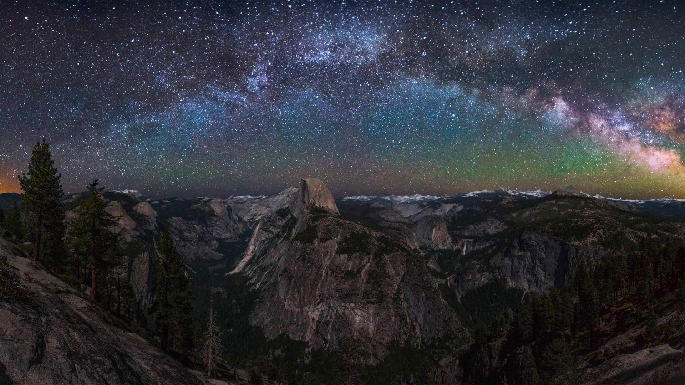
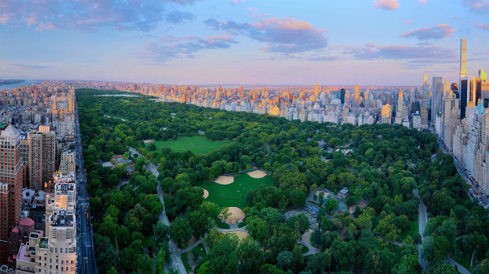
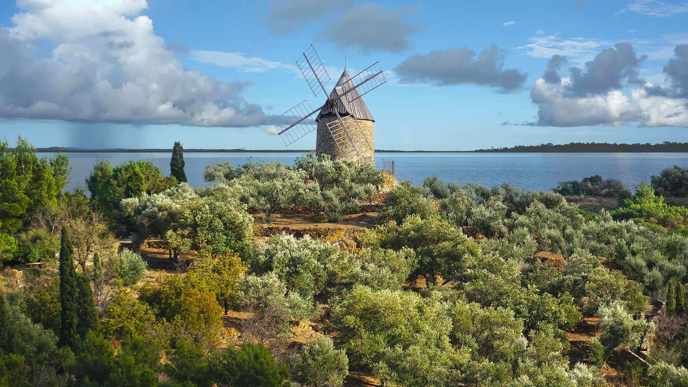
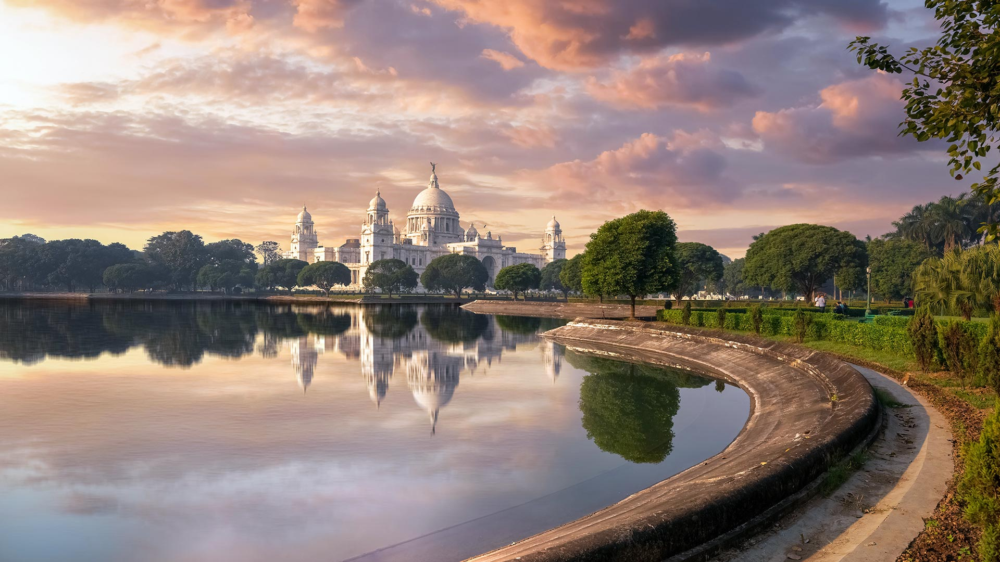
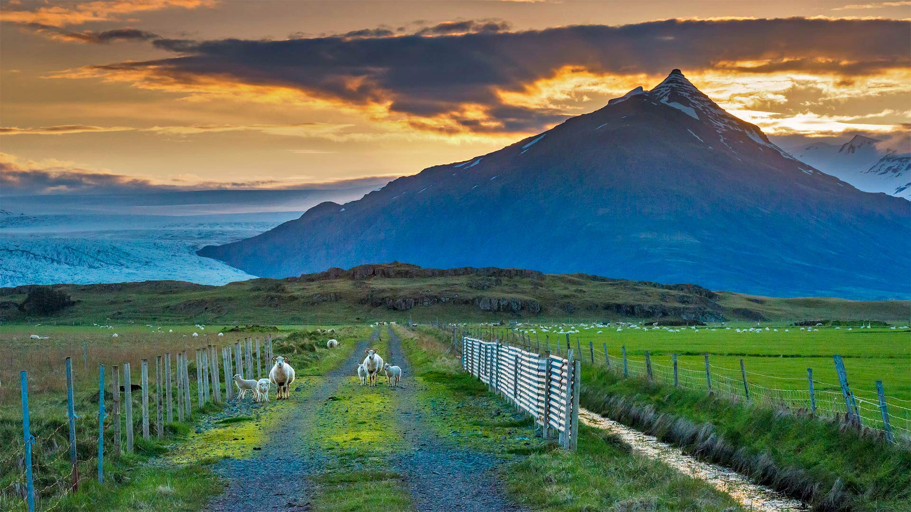
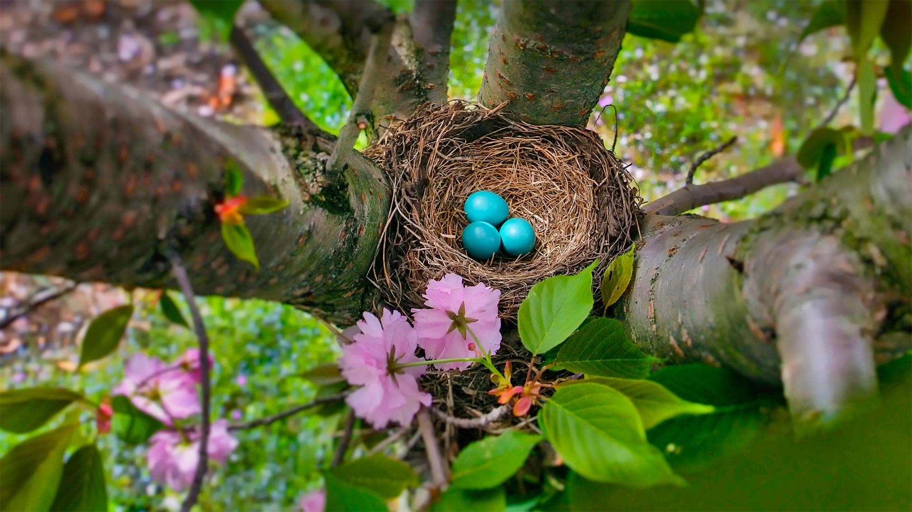
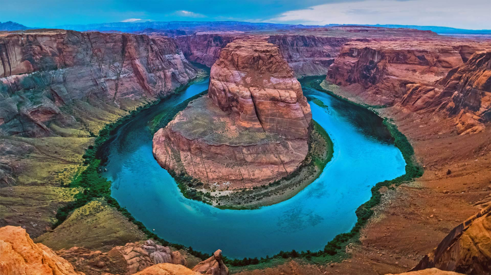
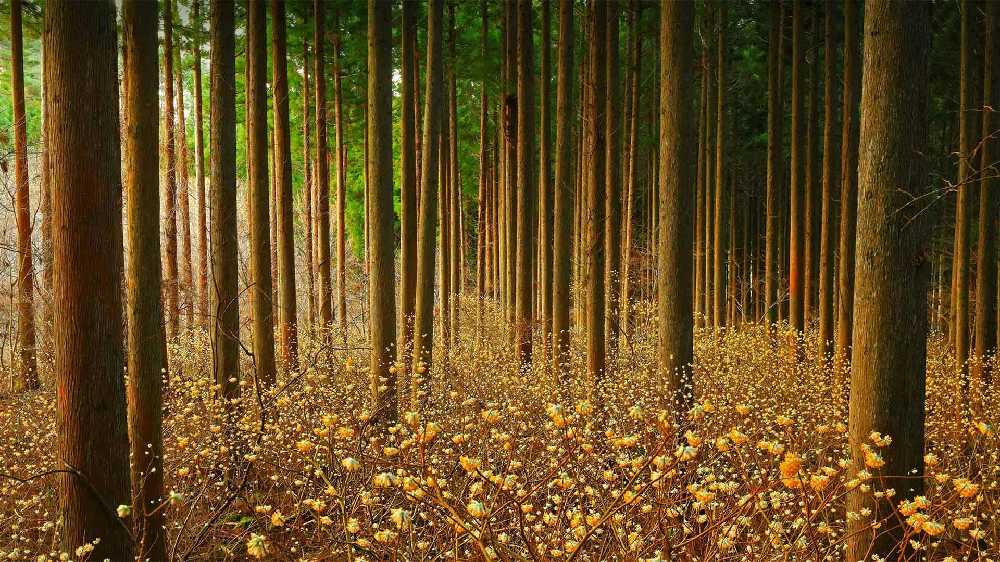
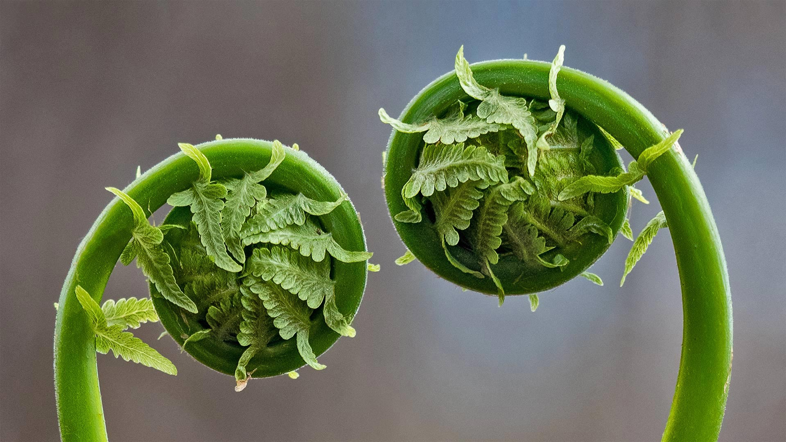
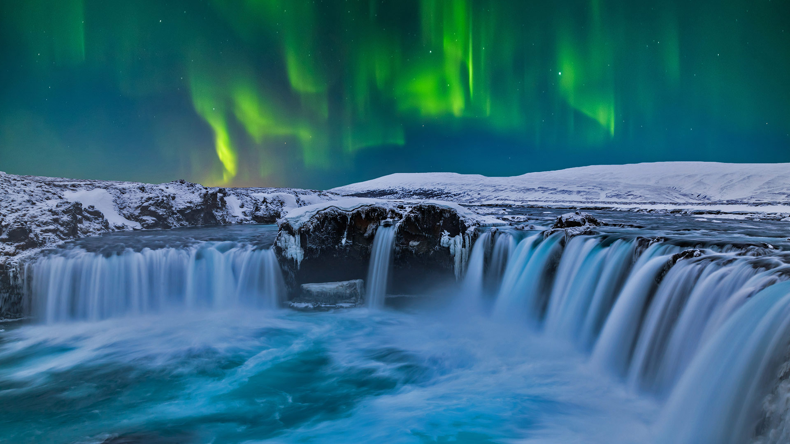

#### 20220430 正在投喂幼鸟的戴胜鸟，德国 (© Slawek Staszczuk/Alamy)

#### 20220430 The North Beach Jazz Mural created by Bay Area artist Bill Weber in San Francisco (© Kosso/Getty Images)

#### 20220429 A young coast redwood sprouting out of an old log in Prairie Creek Redwoods State Park, California (© Hutch Axilrod/Getty Images)

#### 20220428 河内藤園, 福岡県 北九州市 (© Steve Tan C K Photography/Getty Images)

#### 20220428 大脊山，英格兰峰区国家公园 (© John Finney Photography/Moment/Getty Images)

#### 20220428 Fox kits practice their hunting skills, Quebec, Canada (© Vlad Kamenski/Shutterstock)

#### 20220427 Midnight sun in Svalbard, Norway (© Nature Picture Library/Alamy)

#### 20220427 ブロッサム・カイト・フェスティバル, 米国 ワシントンDC (© Blue Tiger/Shutterstock)

#### 20220426 ヨセミテ国立公園の銀河, 米国 カリフォルニア州 (© Cory Marshall/Tandem Stills + Motion)

#### 20220426 Central Park, New York City (© Tony Shi Photography/Getty Images)

#### 20220426 Percé Rock off the Gaspé Peninsula, Quebec (© Design Pics/DanitaDelimont.com)

#### 20220426 Ancien moulin à vent en pierre dans un champ d’olives et la Méditerranée en arrière-plan, France (© Damocean/iStock/Getty Images Plus)

#### 20220426 下莱茵省的胡内城堡，法国阿尔萨斯大区 (© Leonid Andronov/Alamy)

#### 20220425 Three king penguins on the shore of St. Andrew's Bay, South Georgia Island (© Paul Souders/Getty Images)

#### 20220425 Rotbuchen im Hutewald Halloh bei Albertshausen, Bad Wildungen, Hessen (© Christian Bäck/Huber/eStock Photo)

#### 20220424 Milky Way rising above Half Dome in Yosemite National Park, California (© Cory Marshall/Tandem Stills + Motion)

#### 20220424 弘前公園の桜, 青森 (© Martin Bailey/Offset/Shutterstock)

#### 20220424 Rone (Erwan Castex) sur la scène du Printemps de Bourges, le 25 avril 2018 (© Edmond Sadaka Edmond/Sipa/shutterstock)

#### 20220423 维多利亚纪念堂，印度加尔各答 (© Roop_Dey/Shutterstock)

#### 20220423 Tianjin Binhai New Area Library in Tianjin, China (© Imaginechina Limited/Alamy)

#### 20220422 Small lake in Karula National Park, Valgamaa County, Estonia (© Sven Zacek/Minden Pictures)

#### 20220422 Livres anciens à Dijon, Bourgogne (© Jim Engelbrecht/DanitaDelimont.com)

#### 20220421 Sheep graze along a road, Iceland (© Matthew Kuhns/Tandem Stills + Motion)

#### 20220421 Petits caracals (© Marion Vollborn/Minden Pictures)

#### 20220420 Mute swan chicks shelter under mom's tail feathers, Massapequa Preserve, Long Island, New York (© Vicki Jauron/Getty Images)

#### 20220419 Plitvice Lakes National Park, Croatia (© Janne Kahila/Getty Images)

#### 20220419 Irrgarten im Erlebnispark Teichland, Brandenburg (© Naturfoto-Online/Alamy)

#### 20220419 富士山と芝桜, 山梨県 富士河口湖町 (© Ruj Chuchaisangrat/Getty Images)

#### 20220418 Square Tower House in Mesa Verde National Park, Colorado (© lightphoto/Getty Images)

#### 20220417 The blue eggs of an American robin in New Jersey (© Mira/Alamy)

#### 20220416 Aerial view of Grand Prismatic Spring, Yellowstone National Park, Wyoming (© AirPano LLC/Amazing Aerial Agency)

#### 20220416 Small red house on the rocky coast of St. John's, Newfoundland and Labrador (© Jessie Brinkman Evans/Offset)

#### 20220415 达特穆尔国家公园的薄雾，英格兰德文郡 (© AWL Images/Danita Delimont)

#### 20220415 'L'Arc de Triomphe, Wrapped,' an art installation by Christo and Jeanne-Claude on September 24, 2021, in Paris, France (© Bruno de HOGUES/Getty Images)

#### 20220414 Crowsnest Mountain, Alberta (© Brandon van Son/TANDEM Stills + Motion)

#### 20220414 Horseshoe Bend, Arizona (© Michael Dunn/Getty Images)

#### 20220413 Plitvice Lakes National Park, Croatia (© Janne Kahila/Getty Images)

#### 20220413 Mitsumata (aka paperbush) in a forest in Japan (© nattya3714/Getty Images)

#### 20220412 Waning gibbous moon above the Earth's horizon, photographed from the International Space Station (© NASA)

#### 20220411 Blühender Bärlauch in einem Rotbuchenwald im Nationalpark Hainich, Thüringen (© Martin Ruegner/Stone/Getty Images)

#### 20220410 Personnes dans un bureau de vote à Lyon pour le premier tour de la présidentielle, le 23 avril 2017 (© JEFF PACHOUD/AFP via Getty Images)

#### 20220410 Fiddlehead fern fronds in Quebec, Canada (© Marianna Armata/Getty Images)

#### 20220409 Arvada Skatepark, Arvada, Colorado (© Jon Paciaroni/Getty Images)

#### 20220409 Caracal cubs (© Marion Vollborn/Minden Pictures)

#### 20220408 Coast near Ponta Delgada, Madeira, Portugal (© Jan Wlodarczyk/Alamy)

#### 20220408 蓮の花 (© Gang Xiao Fen Ban/EyeEm Premium/Getty Imagesr)

#### 20220407 Old town of Málaga, Spain (© Sean Pavone Photo/Getty Images)

#### 20220406 Ein Wiedehopf füttert sein Junges, Biosphärenreservat Mittelelbe, Sachsen-Anhalt (© imageBROKER/Martin Demmel/Getty Images)

#### 20220406 桜と大阪城, 大阪 (© Prasit Rodphan/Alamy Stock Photo)

#### 20220405 Crested caracara birds courting in Texas (© Alan Murphy/Minden Pictures)

#### 20220405 Le château de Hunebourg dans les Vosges, Bas-Rhin, Alsace (© Leonid Andronov/Alamy Stock Photo)

#### 20220405 Goðafoss waterfall under the northern lights, Iceland (© Anton Petrus/Getty Images)

#### 20220404 The Kjeragbolten boulder on the mountain Kjerag in Rogaland county, Norway (© Angel FAyE/Getty Images)

#### 20220403 Cherry blossoms at Lake Tai at Wuxi, China (© Eric Yang/Getty Images)

#### 20220402 Whangārei Falls near the city of Whangārei, North Island, New Zealand (© Nathan Kavumbura/Getty Images)

#### 20220402 Cherry blossom trees in Vancouver (© KarenMassier/Getty Images)

#### 20220401 哈瓦泰姬陵，印度拉贾斯坦邦，斋浦尔市 (© Mazur Travel/Shutterstock)

#### 20220401 'Greetings from Giza,' an installation by the artist JR, Cairo, Egypt (© Ammar ABD RABBO/Abaca Press/Alamy)

