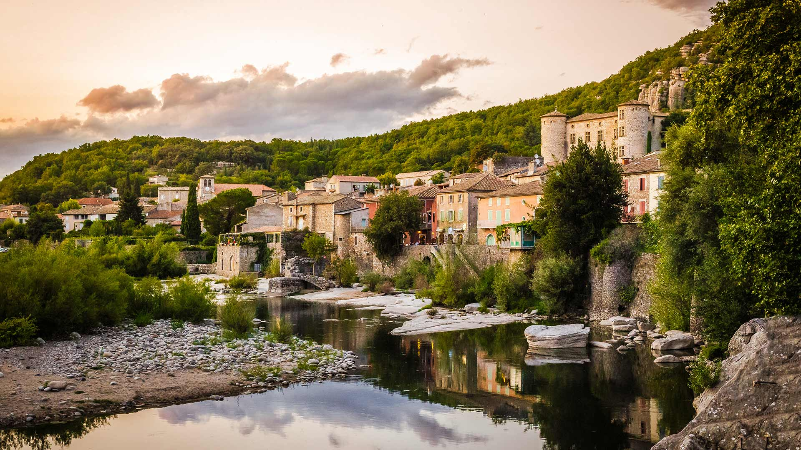
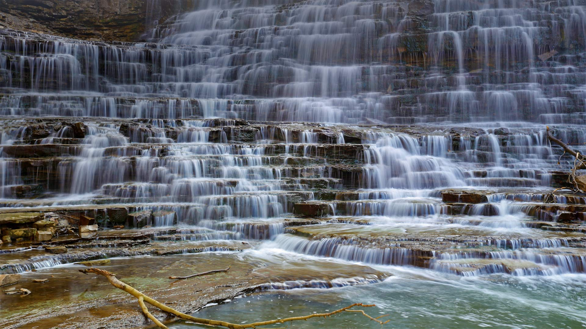
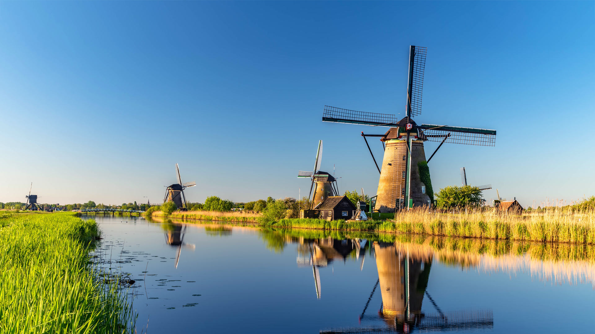
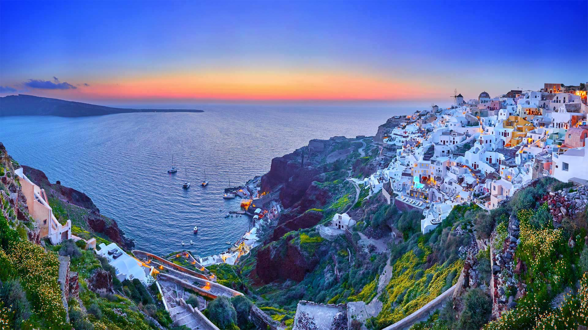
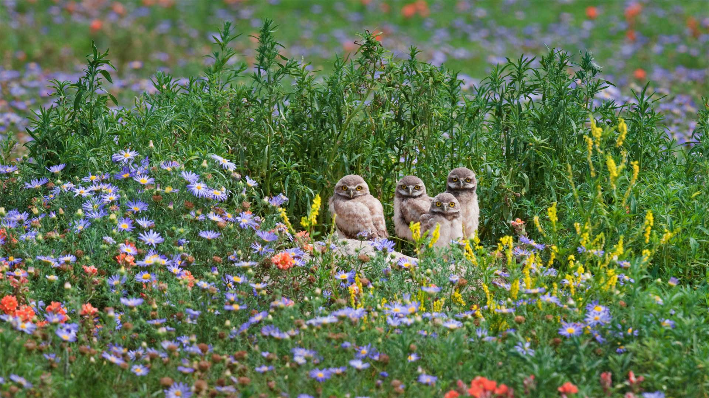
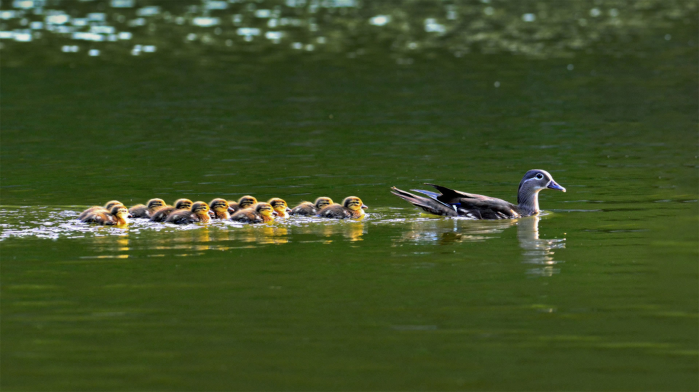
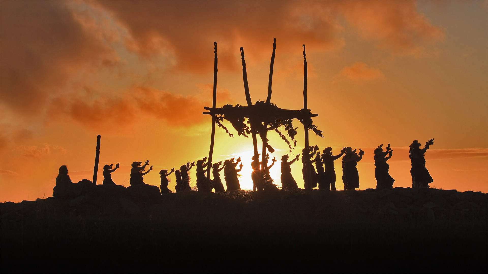

#### 20220531 パムッカレのトラバーチン, トルコ (© bybostanci/Getty Images)

#### 20220531 Scarlet macaw in Costa Rica (© Harry Collins/Getty Images)

#### 20220530 Rainbow Pool and the field of stars in the World War II Memorial with the Lincoln Memorial in the background, Washington, DC (© Sean Pavone/Getty Images)

#### 20220530 L’Ardèche et le village de Vogüé au coucher du soleil (© JeanLucIchard/Shutterstock)

#### 20220530 Lechfall bei Füssen, Bayern (© Sergej Razvod/agefotostock)

#### 20220529 Mount Fryatt und Athabasca Falls, Jasper-Nationalpark, Alberta, Kanada (© Robert Postma/Getty Images)

#### 20220529 Maman Koala et son petit de 8 mois, Queensland, Australie (© Suzi Eszterhas/Minden Pictures)

#### 20220529 Hyalite Creek in the Custer Gallatin National Forest, Montana (© Jared Lloyd/Getty Images)

#### 20220529 Adult female grizzly bear and cub in the Great Bear Rainforest, B.C. (© Jack Chapman/Minden Pictures)

#### 20220528 Bungle Bungle Range in Purnululu National Park, Australia (© Francesco Riccardo Iacomino/Getty Images)

#### 20220527 Golden Gate Bridge and Marin Headlands photographed from Golden Gate Overlook in San Francisco, California (© Jeff Lewis/Tandem Stills + Motion)

#### 20220526 Orangerie des Schweriner Schlosses am Schweriner See, Schwerin, Mecklenburg-Vorpommern (© Gunter Grafenhain/eStock Photo)

#### 20220526 Hanging bridge in the Monteverde Cloud Forest Reserve, Costa Rica (© Dmitriy Burlakov/Getty Images)

#### 20220525 Alhambra in Granada, Andalusia, Spain (© Armand Tamboly/Getty Images)

#### 20220524 Kornati National Park, Croatia (© Anton Petrus/Getty Images)

#### 20220524 Kolli Hills, Tamil Nadu, India (© surangaw/iStock/Getty Images Plus)

#### 20220523 Florida red-bellied turtle in Rainbow Springs, Rainbow Springs State Park, Florida (© Michel Roggo/Minden Pictures)

#### 20220522 A Burchell's zebra and a cattle egret at the Rietvlei Nature Reserve in South Africa (© Richard Du Toit/Minden Pictures)

#### 20220521 Albion Falls, Hamilton, Ontario, Canada (© Alexander Sviridov/Shutterstock)

#### 20220520 Martin-pêcheur en chasse dans une rivière de Lorraine (© Michel Poinsignon/Minden)

#### 20220520 Honey bee flying over crocuses in the Tatra Mountains, Poland (© Mirek Kijewski/Getty Images)

#### 20220519 Glücksburg Castle, Schleswig-Holstein, Germany (© Christian Back/eStock Photo)

#### 20220519 Glass bridge of Zhangjiajie, Hunan, China (© MediaProduction/Getty Images)

#### 20220518 Goldregen (Laburnum) und violetter Zierlauch in voller Blüte, VanDusen Botanical Garden, Vancouver, Kanada (© Greg Vaughn/Alamy)

#### 20220518 Museum at Prairiefire, Overland Park, Kansas (© Bernard P. Friel/Universal Images Group via Getty Images)

#### 20220517 Salt ponds of Maras in Peru's Sacred Valley of the Incas (© Fotofeeling/Westend61 on Offset/Shutterstock)

#### 20220517 Deux chaises sur la croisette, Cannes (© BEAUMONT Frédéric/Alamy)

#### 20220516 Le court Philippe Chatrier au stade Roland-Garros, Paris (© CTK/Alamy Stock Photo)

#### 20220516 Burrowing owl chicks gaze out from among flowers near the Pawnee National Grassland in Colorado (© Roberta Olenick/Alamy)

#### 20220516 Luftbild des Düsseldorfer Stadtteils Oberkassel mit Rheinkniebrücke und Oberkasseler Brücke, Nordrhein-Westfalen (© Hans Blossey/Alamy Stock Photo)

#### 20220515 コンドイ浜, 沖縄 竹富島 (© Matjaz Corel/Alamy Stock  Photo)

#### 20220515 Panoramic view of the Bernina Range with blood moon, Eastern Alps, Engadin, Switzerland (© Bernd Zoller/Shutterstock)

#### 20220514 Windmills, Kinderdijk, Netherlands (© Achim Thomae/Getty Images)

#### 20220513 A close-up of a tulip from the Canadian Tulip Festival in Ottawa (© Sandy Thompson/Alamy Stock Photo)

#### 20220513 Masai giraffe in Maasai Mara, Kenya (© Andy Rouse/Minden Pictures)

#### 20220512 白夜, ノルウェー スヴァールバル諸島 (© Nature Picture Library/Alamy)

#### 20220512 布拉塞河上的雾天黎明，英国湖区国家公园 (© fstopphotography/Getty Images)

#### 20220512 Nurses serving with the American Red Cross in Paris, France, in May 1919 (© Universal History Archive/Universal Images Group via Getty Images)

#### 20220511 The village of Oia on the island of Santorini, Greece (© Zebra-Studio/Shutterstock)

#### 20220510 Schloss Glücksburg im Abendlicht, Glücksburg, Schleswig-Holstein, (© Christian Back/eStock Photo)

#### 20220510 Spring forest, Gros Morne National Park, Newfoundland and Labrador (© Don Johnston EC/Alamy Stock Photo)

#### 20220510 Panther Creek Falls in spring, Gifford Pinchot National Forest, Washington (© Stephen Matera/Tandem Stills + Motion)

#### 20220509 View of Göreme from an observation deck, Göreme National Park, Cappadocia, Turkey (© Anton Petrus/Getty Images)

#### 20220508 Burrowing owl chicks gaze out from among flowers near the Pawnee National Grassland in Colorado (© Roberta Olenick/Alamy)

#### 20220508 Koala mother and 8-month-old joey, Queensland, Australia (© Suzi Eszterhas/Minden Pictures)

#### 20220507 Swedish telescope at La Silla ESO Observatory, Chile (© Alberto Ghizzi Panizza/Getty Images)

#### 20220507 Glasbrücke Zhangjiajie, Provinz Hunan, Volksrepublik China (© MediaProduction/Getty Images)

#### 20220506 A path winding through a forest carpeted with bluebells in Hertfordshire, England (© JayKay57/Getty Images)

#### 20220505 Ancient stone windmill, France (© Damocean/iStock/Getty Images Plus)

#### 20220505 Tree in blue agave field in the tequila-producing region near Atotonilco el Alto, Jalisco, Mexico (© Brian Overcast/Alamy)

#### 20220505 大正浪漫夢通りの鯉のぼり, 埼玉 川越市 (© Toa55/iStock/Getty Images Plusc)

#### 20220504 Wadi Rum, Jordan (© Thomas Coex/AFP via Getty Images)

#### 20220504 托菲诺的麦肯齐海滩，加拿大不列颠哥伦比亚省 (© Robert Postma/Plainpicture/Design Pics)

#### 20220504 セコイアの若芽, 米国 カリフォルニア州 (© Hutch Axilrod/Getty Images)

#### 20220503 Mandarin duck hen with ducklings in South Korea (© VDCM image/Getty Images)

#### 20220502 Travertine terraces of Pamukkale, Turkey (© bybostanci/Getty Images)

#### 20220502 和束の茶畑, 京都 (© Tuul and Bruno Morandi/Alamy Stock)

#### 20220501 盛开的金链花树和紫色葱属植物，加拿大温哥华范度森植物园 (© Greg Vaughn/Alamy)

#### 20220501 ジュニパー・スプリングス, 米国 フロリダ州 (© Michael Warren/Getty Images)

#### 20220501 Dancers on a hula pa'a on the site of a lele (altar) on the island of Molokai, Hawaii (© Alvis Upitis/Getty Images)

#### 20220501 Blühende Kirschbäume an der Binnenalster, Hamburg (© Kerstin Bittner/Westend61/Offset)

