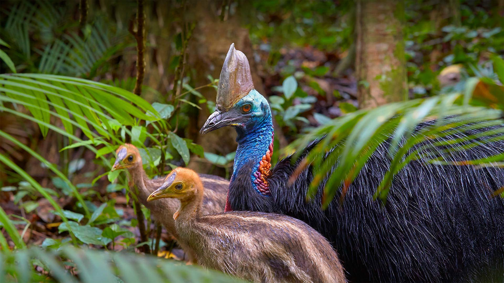
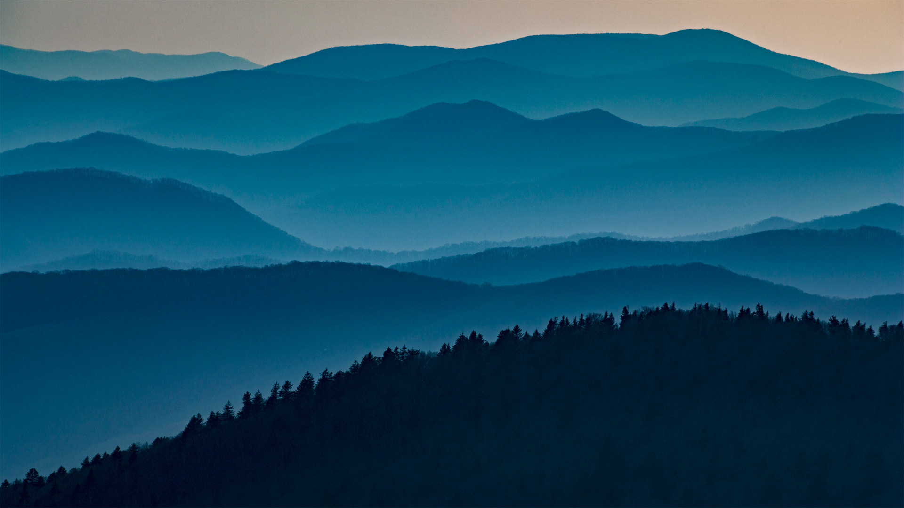
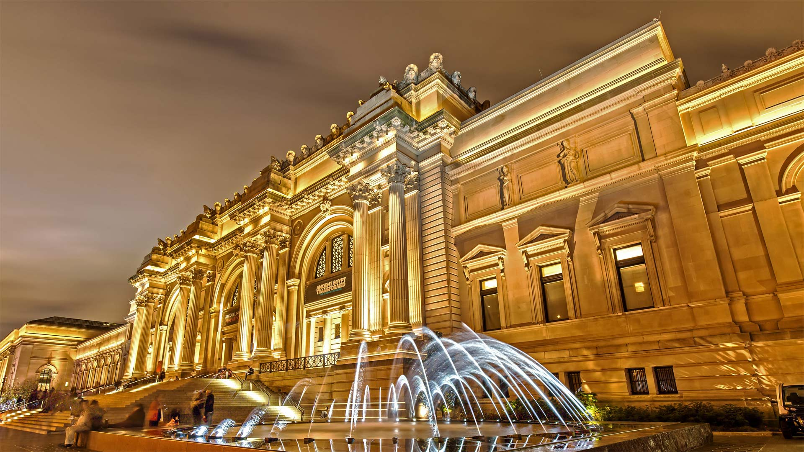
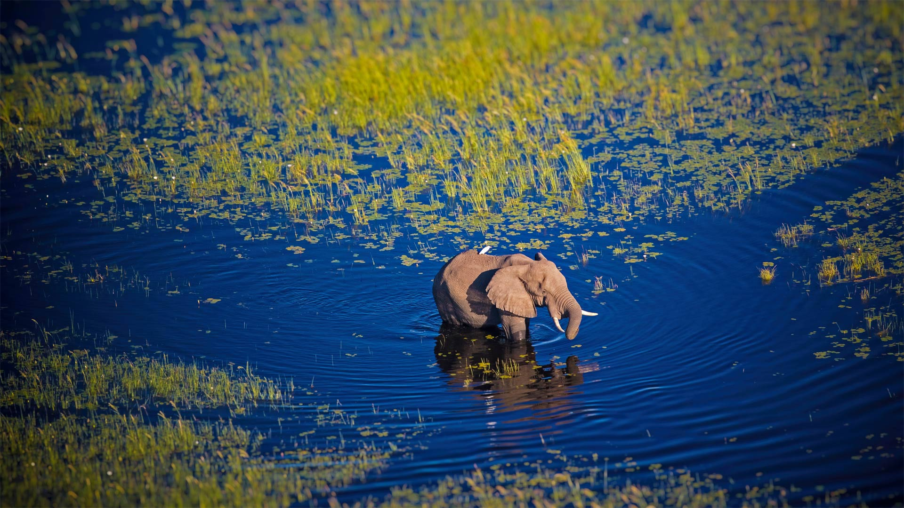

#### 20220630 基伯龙半岛上的海滩，法国布列塔尼地区 (© hardyun/Adobe)

#### 20220630 The Acraman crater, Australia (© USGS/NASA Landsat data/Orbital Horizon/Gallo Images/Getty images)

#### 20220629 Mangrove forest in Phang Nga Bay, Andaman Sea, Thailand (© Ratnakorn Piyasirisorost/Getty Images)

#### 20220627 An old kasbah in the Tafilalet region, Morocco (© José Antonio Moreno/agefotostock)

#### 20220627 Via Krupp, Capri, Italy (© Mikolajn/Getty Images)

#### 20220626 Lavender fields on the Valensole Plateau in Provence, France (© Shutterstock)

#### 20220626 一只正在树上睡觉的考拉 (© Anton Rogozin/Getty Images)

#### 20220625 Rainbow flag (© Matt Jeacock/Getty Images)

#### 20220625 BMW-Welt, München, Bayern (© Stefan Huwiler/agefotostock)

#### 20220625 The Kellys beach boardwalk in Kouchibouguac National Park, New Brunswick (© All Canada Photos/Alamy Stock Photo)

#### 20220625 Brown bear mother and cub in Katmai National Park and Preserve, Alaska (© Suzi Eszterhas/Minden Pictures)

#### 20220624 Scuba diver exploring the underwater cenotes near Puerto Aventuras, Mexico (© Extreme Photographer/Getty Images)

#### 20220623 Stari Most in Mostar, Bosnia and Herzegovina (© Ayhan Altun/Getty Images)

#### 20220622 フタコブラクダ, カザフスタン (© Nurlan Kulcha/Alamy)

#### 20220621 Writing-On-Stone Provincial Park/Áísínai'pi, Alberta (© Philippe Widling/Getty Images)

#### 20220621 Guitare de jazz Aria de style Gibson 355 (© Claude thibault/Alamy)

#### 20220621 View of Glastonbury Tor from Walton Hill, Somerset, England (© Guy Edwardes/Minden Pictures)

#### 20220620 Old World swallowtail butterflies on a flower (© Alberto Ghizzi Panizza/Getty Images)

#### 20220620 Yasuní National Park in Amazonian Ecuador (© Paul Bertner/Minden Pictures)

#### 20220619 Schwan mit Küken, Aischgrund, Franken, Bayern (© Rüdiger Hess/geo-select FotoArt)

#### 20220619 Cavaliers et leurs chevaux au petit matin, Chantilly, France (© Agencja Fotograficzna Caro/Alamy Stock Photo)

#### 20220619 Southern cassowary father with chicks, Kuranda, Queensland, Australia (© Martin Willis/Minden Pictures)

#### 20220618 Surfers catching waves at Palm Beach on the Gold Coast, Queensland, Australia (© Darren Tierney/Getty Images)

#### 20220617 Balsamroot wildflowers bloom below the Teton Mountains in Grand Teton National Park, Wyoming (© Mike Cavaroc/Tandem Stills + Motion)

#### 20220616 Seungseon Bridge at Seonam Temple in Jogyesan Provincial Park, South Korea (© Aaron Choi/Getty Images)

#### 20220616 コンゴウインコ, コスタリカ (© Harry Collins/Getty Images)

#### 20220615 Great Smoky Mountains National Park, Tennessee (© Tony Barber/Getty Images)

#### 20220615 濃溝の滝・亀岩の洞窟, 千葉 君津市 (© Saha Entertainment/Gettyimages)

#### 20220614 The Metropolitan Museum of Art in New York City (© Susanne Pommer/Shutterstock)

#### 20220613 Elephant walking in the Okavango River, Botswana (© Markus Pavlowsky/Getty Images)

#### 20220612 Cliffs of the Sierra Ponce and Rio Grande, Big Bend National Park, Texas (© Tim Fitzharris/Minden Pictures)

#### 20220612 Luftaufnahme von Kleingärten, Kamp-Lintfort, Nordrhein-Westfalen, (© Hans Blossey/Alamy Stock Photo)

#### 20220611 明月院のアジサイ, 神奈川 鎌倉 (© Kantaya/Shutterstock)

#### 20220611 Misool Island, one of the four major islands in the Raja Ampat Islands in West Papua, Indonesia (© Elsy Saldek/Getty Images)

#### 20220611 Action au lever du soleil sur le Circuit des 24h en septembre 2020 au Mans (© Photo by James Moy Photography/Getty Images)

#### 20220610 斑鹿，滕波尔国家公园，印度 (© Ondrej Prosicky/Shutterstock)

#### 20220610 A close-up of the red trillium flower in Algonquin Provincial Park, Ont. (© Jaynes Gallery/Danita Delimont)

#### 20220610 Poppies in bloom, Moravia, Czech Republic (© rusm/Getty Images)

#### 20220609 Sweetheart Abbey, Dumfries and Galloway, Scotland (© Westend61/Getty Images)

#### 20220608 Long-beaked common dolphin pod and diving Cape gannets hunting sardines off the Eastern Cape, South Africa (© Pete Oxford/Minden Pictures)

#### 20220607 Haaga Rhododendron Park, Helsinki, Finland (© Samuli Vainionpää/Getty Images)

#### 20220606 Warnstedter Mühle im Sonnenuntergang, Thale, Harz, Sachsen-Anhalt (© Andreas Vitting/eStock Photo)

#### 20220606 An indigo bunting at the John James Audubon Center at Mill Grove in Audubon, Pennsylvania (© Vicki Jauron/Getty Images)

#### 20220605 Rapa Valley in Sarek National Park, Sweden (© Alena Vishina/Alamy)

#### 20220604 Plage sur la presqu’île de Quiberon, Côte Sauvage, Bretagne (© hardyun/Adobe Stock)

#### 20220604 Banner Peak and Thousand Island Lake, Ansel Adams Wilderness, California (© Michael DeYoung Photography/Tandem Stills + Motion)

#### 20220604 Aerial view of Clayoquot Sound and the Pacific Rim National Park Reserve in British Columbia (© Yuri Choufour/Danita Delimont)

#### 20220603 Cycling across a natural rock arch in the desert near Moab, Utah (© Whit Richardson/Cavan)

#### 20220603 广角镜头下的厦门龙舟池，日落的光洒在传统龙舟上，中国 (© Sen Li/Getty Image)

#### 20220602 みなとみらいの夜景, 神奈川 横浜 (© Mytruestory Photography/Getty Images)

#### 20220602 Buckingham Palace in London, England (© Pajor Pawel/Shutterstock)

#### 20220601 ペリト・モレノ氷河, アルゼンチン (© Juergen Schonnop/Getty Images)

#### 20220601 Coral reef in Marovo Lagoon in the Solomon Islands (© WaterFrame/Alamy)

