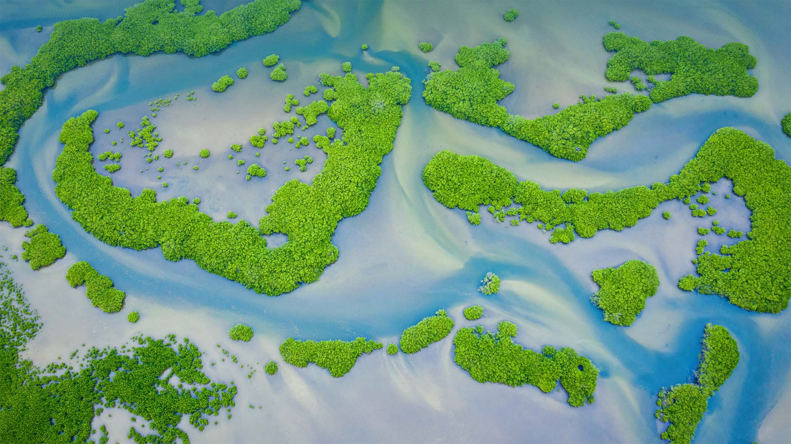
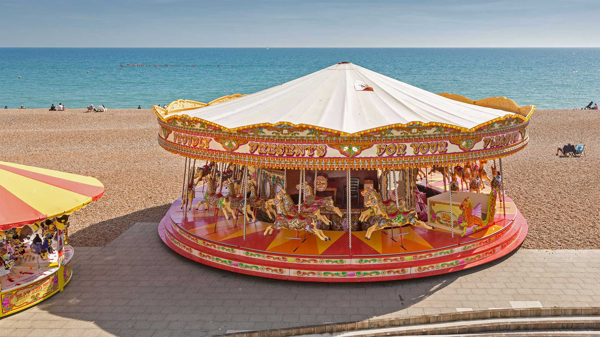
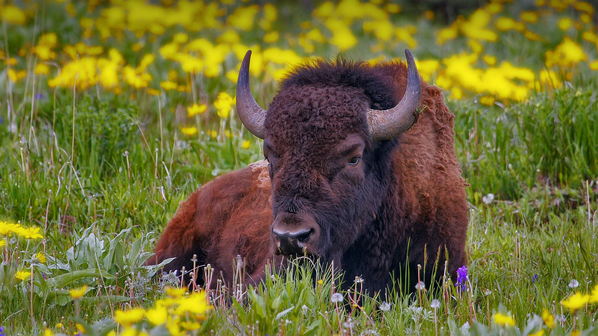
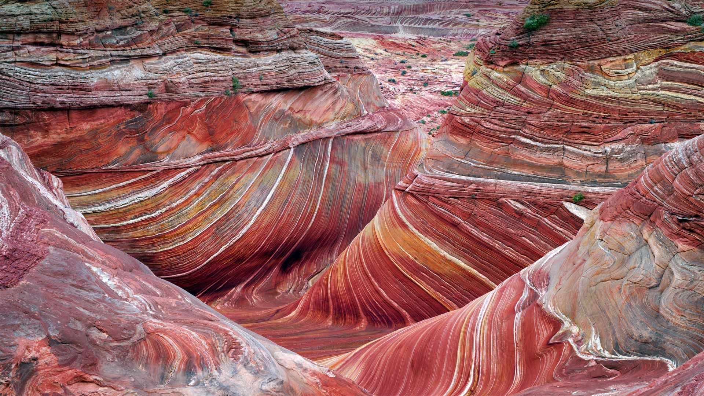
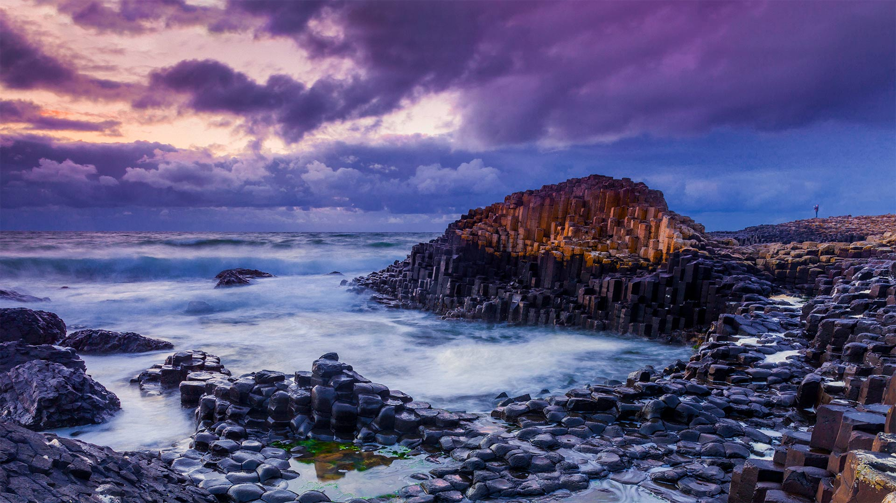
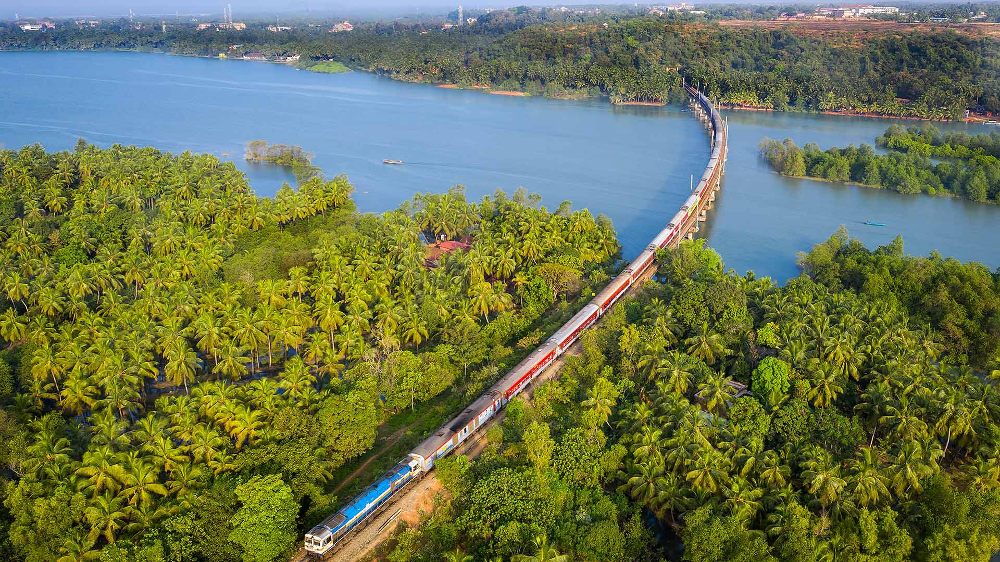

#### 20220731 Noctilucent clouds in Lithuania (© ljphoto7/Getty Images)

#### 20220730 Rainforest hike near Milford Sound/Piopiotahi in New Zealand (© Jim Patterson/Tandem Stills + Motion)

#### 20220729 Tigresses of Telia Lake in Tadoba Andhari Tiger Reserve, India (© Ashish Parmar/Alamy)

#### 20220728 Shot of rocks in water in Tobermory, Ontario (© Reese Lassman/EyeEm/Getty Images)

#### 20220728 Eichen in einem Rapsfeld bei aufziehendem Gewitter, Sachsen-Anhalt (© mauritius images GmbH/Alamy Stock Photo)

#### 20220728 Longs Peak in Rocky Mountain National Park, Colorado (© Andrew R. Slaton/Tandem Stills + Motion)

#### 20220727 Nabataean tomb in Mada'in Saleh (aka Hegra), Saudi Arabia (© Tuul & Bruno Morandi/Getty Images)

#### 20220726 Mangrove forest in the Saloum Delta National Park, Senegal (© mariusz_prusaczyk/Getty Images)

#### 20220725 Golden Gallopers Carousel on the seafront in Brighton, East Sussex, England (© Graham Prentice/Alamy)

#### 20220725 兰贝里斯山口脚下的多尔巴达恩城堡，威尔士 (© Viktoria Rodriguez/Getty Images)

#### 20220724 Amelia Earhart teaching students in Newark, New Jersey (© Bettmann/Getty Images)

#### 20220723 Voiliers au crépuscule devant un phare au large de Roscoff, Finistère, Bretagne (© Cristina Granena/iStock/Getty Images Plus)

#### 20220723 Regenbogenflagge (© Matt Jeacock/Getty Images)

#### 20220723 青の洞窟, 沖縄 宮古島  (© Daisuke Kurashima/Alamy Stock Photo)

#### 20220723 Elephant hawk-moth on foxglove flower (© David Chapman/Alamy)

#### 20220722 Our Lady of the Rocks and Saint George Island in the Bay of Kotor, Perast, Montenegro (© Dmitrii Sakharov/Shutterstock)

#### 20220721 Abbey Gardens in Bury St Edmunds, Suffolk, England (© Charles Martinez/Amazing Aerial Agency)

#### 20220720 Composite photo showing the phases of the moon (© Delpixart/Getty Images)

#### 20220719 Male American bison in Yellowstone National Park, Wyoming (© Donyanedomam/Getty Images)

#### 20220719 Two Jack Lake, Banff National Park, Alberta (© SnapRapid/Offset)

#### 20220719 Allée fleurie à Saint-Paul-de-Vence, Alpes Maritimes, Provence-Alpes-Côte-D’azur (© Susanne Kremer/Huber/eStock Photo)

#### 20220719 基姆湖上的淑女岛，德国巴伐利亚州 (© Malorny/Getty Images)

#### 20220718 Omijima Island in Kita-Nagato Kaigan Quasi-National Park, Japan (© Sean Pavone Photo/Adobe Stock)

#### 20220717 The Wave sandstone formation in Coyote Buttes North, Paria Canyon-Vermilion Cliffs National Monument, Arizona (© Dennis Frates/Alamy)

#### 20220716 Goldfinch on a sunflower in McConnells, South Carolina (© Teresa Kopec/Getty Images)

#### 20220715 The village of Arrone in Umbria, Italy (© Maurizio Rellini/eStock Photo)

#### 20220714 Grimm-Dich-Pfad, Marburg, Hessen (© Gianluca Santoni/eStock Photo)

#### 20220714 明野のひまわり畑, 山梨県 北杜市 (© Takeshi.K/Getty Images)

#### 20220714 Collection de timbres représentant Marianne, symbole de la République française (© Virginie Schleiermacher/Alamy Stock Photo)

#### 20220714 Baby lemon sharks swimming among mangroves near Alice Town, Bimini, Bahamas (© Ken Kiefer 2/Getty Images)

#### 20220713 Basalt columns of Giant's Causeway, Northern Ireland (© Olimpio Fantuz/eStock Photo)

#### 20220712 Bay Marker Lookout, Sydney Olympic Park, Australia (© ai_yoshi/Getty Images)

#### 20220711 Barcelona, Spain (© SW Photography/Getty Images)

#### 20220710 Aerial view of colorful boats in the Mediterranean Sea in Ölüdeniz, Turkey (© den-belitsky/Getty Images)

#### 20220709 シャンバラ・ジェットコースター, スペイン, コスタ・ドラダ (© Joaquim F. P./Getty Images)

#### 20220708 Members of the Calgary Stampede marching band in action, during the Calgary Stampede 2016 (© Artur Widak/NurPhoto/Getty Images)

#### 20220708 Preveli Gorge with river and palm tree forest, Crete, Greece (© borchee/Getty Images)

#### 20220708 Dolomite Mountains at night with the Milky Way, Italy (© Carlos Fernandez/Getty Images)

#### 20220707 湘南ひらつか七夕まつり, 神奈川県 平塚市 (© DigiPub/Getty Images)

#### 20220707 Heceta Head Light, Florence, Oregon (© Tom Schwabel/Tandem Stills + Motion)

#### 20220706 Atlantic puffin pair billing, Shetland Islands, Scotland (© Vince Burton/Minden Pictures)

#### 20220705 Cérémonie de remise des diplômes à l’américaine, Troyes (© Andia/Getty Images)

#### 20220704 Fireworks explode during Independence Day celebrations on July 4, 2021, in Washington, DC (© White House Photo/Alamy)

#### 20220704 一列火车穿过卡纳塔克邦的沙拉瓦蒂桥，印度 (© Amith Nag Photography/Getty Images)

#### 20220704 Mehlinger Heide, Mehlingen, Rheinland-Pfalz (© Boris Jordan Photography/Getty Images)

#### 20220703 七里ヶ浜のサーファー, 神奈川 鎌倉 (© Taro Hama @ e-kamakura/Getty Images)

#### 20220703 Red fox (© Yossi Eshbol/Minden Pictures)

#### 20220703 Iguazú Falls, Foz do Iguaçu, Paraná, Brazil (© Marcio Cabral/Minden Pictures)

#### 20220702 Aerial view of a road separating two lakes in the Scottish Highlands (© Abstract Aerial Art/Getty Images)

#### 20220702 Fannette Island surrounded by Emerald Bay, Lake Tahoe, California (© Rachid Dahnoun/Tandem Stills + Motion)

#### 20220701 'Vejrpigerne' ('The Weather Girls') sculpture on top of the Richshuset building in City Hall Square, Copenhagen, Denmark (© Stig Alenas/Shutterstock)

#### 20220701 The Parliament buildings across the Ottawa River in Ottawa (© AWL Images/Danita Delimont)

#### 20220701 阿圭罗村庄, 韦斯卡, 西班牙 (© Francesco Carovillano/eStock)

