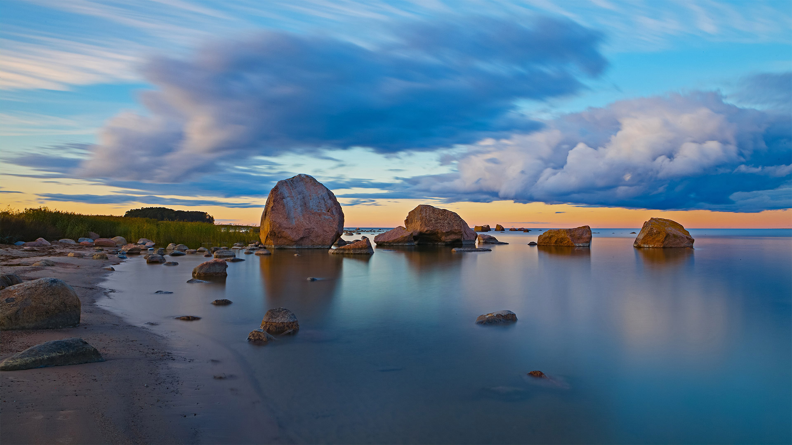
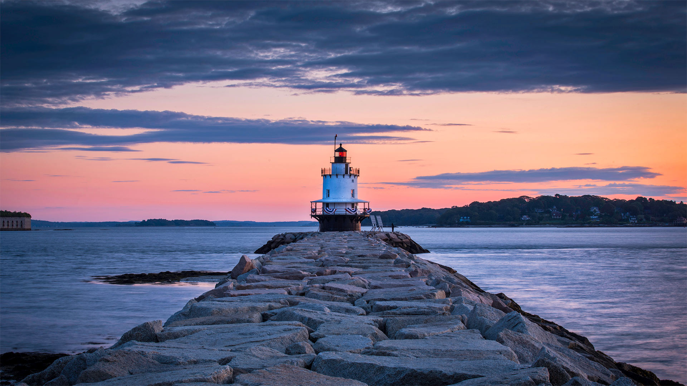
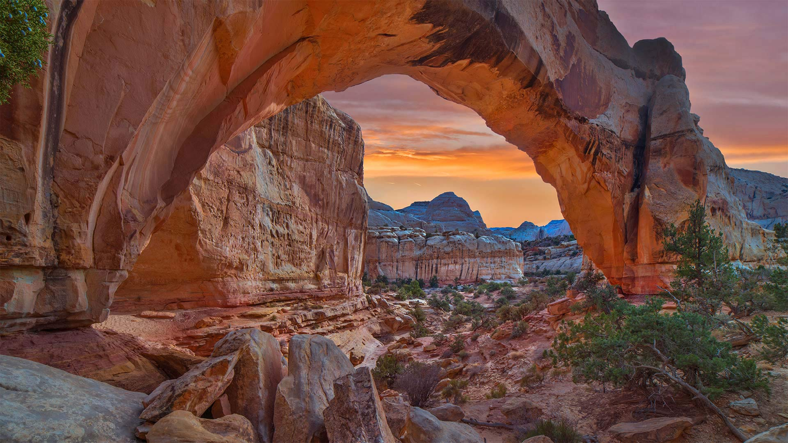

#### 20220831 Wildlife crossing in Wierden, Netherlands (© Frans Lemmens/Alamy)

#### 20220831 Blue linckia sea stars off New Ireland in Papua New Guinea (© Jurgen Freund/Minden Pictures)

#### 20220830 Regional Park of Migliarino, San Rossore, Massaciuccoli, Italy (© Stefano Valeri/Alamy)

#### 20220829 Hausboote auf dem Eilbekkanal, Hamburg (© Kerstin Bittner/Offset)

#### 20220828 Baltic Sea in Estonia (© fotoman-kharkov/Getty Images)

#### 20220828 Bearded reedlings at a wetland in Flevoland, Netherlands (© Gert-Jan IJzerman/Minden Pictures)

#### 20220827 Boundary Trail in Mount St. Helens National Volcanic Monument, Washington (© Don Geyer/Alamy)

#### 20220826 Kiteboarders and windsurfers off the Pelješac Peninsula, Croatia (© helivideo/Getty Images)

#### 20220825 Santa Bárbara Waterfall, Cavalcante, Goiás, Brazil (© Rafael Serathiuk/Getty Images)

#### 20220825 Foule lors d’un concert au festival Rock en Seine le 31 août 2015, Domaine national de Saint-Cloud (© Christian Bertrand/Alamy Stock Photo)

#### 20220825 Penzance in Cornwall, England (© Murray Bosley Photography/Getty Images)

#### 20220825 Skyline von Köln im Sonnenuntergang, Nordrhein-Westfalen (© SnapRapid/Offset/Shutterstock)

#### 20220825 North Cascades National Park, Washington (© Ethan Welty/Tandem Stills + Motion)

#### 20220824 Wheat field in Ukraine (© Yuriy Kulik/Getty Images)

#### 20220824 格洛里亚附近的码头和糖面包山，巴西里约热内卢 (© f11photo/Getty Images)

#### 20220823 Menton, France (© Flavio Foglietta/Getty Images)

#### 20220822 A burrowing owl chick and adult in South Florida (© Carlos Carreno/Getty Images)

#### 20220821 Faro de Playa Lago, Costa da Morte, Muxia, Galicia, Spain (© Carlos Fernandez/Getty Images)

#### 20220820 Beehives in the Muniellos Nature Reserve, Asturias province, Spain (© ABB Photo/Shutterstock)

#### 20220819 The Swing Tower at CNE, Toronto (© Brett Ida/Shutterstock)

#### 20220819 Solar Impulse 2 flying over the pyramids in Giza, Egypt (© Jean Revillard/Solar Impulse2 via Getty Images)

#### 20220819 康沃尔郡的彭赞斯，英国 (© Murray Bosley Photography/Getty Images)

#### 20220819 Lac du Montagnon, Aydius, Haut-Béarn, Pyrénées Atlantiques, Nouvelle Aquitaine (© thieury/Adobe photo stock)

#### 20220818 Källö-Knippla, an island in the archipelago of Gothenburg, Sweden (© Martin Wahlborg/Getty Images)

#### 20220817 Reetdachhäuser bei Hörnum auf Sylt, Schleswig-Holstein (© Francesco Carovillano/eStock Photo)

#### 20220816 A stream of water flows through the Sasquatch Provincial Park, Fraser Valley, B.C. (© Jason Wilde/Tandem Stills + Motion)

#### 20220816 The Great White Roller Coaster at Wildwood, New Jersey (© John Van Decker/Alamy)

#### 20220816 五山送り火, 京都 (© Hideaki Tanaka/AFLO)

#### 20220816 North Cascades National Park, Washington (© Ethan Welty/Tandem Stills + Motion)

#### 20220815 Chittorgarh Fort, India (© Anand Purohit/Getty Images)

#### 20220814 Panther chameleon in Amber Mountain National Park, Madagascar (© Christian Ziegler/Minden Pictures)

#### 20220813 阿斯佩山谷中的蒙塔尼翁湖，法国 (© thieury/Adobe photo stock)

#### 20220813 Boundary Waters Canoe Area Wilderness, Superior National Forest, Minnesota (© Dukas/Universal Images Group via Getty Images)

#### 20220813 Freshwater plants and tetra fish, Aquário Natural, Rio Baía Bonita, Mato Grosso do Sul, Brazil (© Michel Roggo/Minden Pictures)

#### 20220812 Herd of African elephants in Amboseli National Park, Kenya (© Susan Portnoy/Shutterstock)

#### 20220811 Détail de la façade des arènes de Dax, Landes (© Daniele Schneider/Photononstop/Alamy)

#### 20220810 ナクル湖畔の雌ライオン, ケニア (© Scott Davis/Tandem Stills + Motion)

#### 20220810 Mount Tsubakuro near Azumino, Nagano, Japan (© Joshua Hawley/Getty Images)

#### 20220810 Joshua trees in Joshua Tree National Park, California (© Tim Fitzharris/Minden Pictures)

#### 20220809 Cueva de las Manos (Cave of the Hands) in Santa Cruz, Argentina (© Adwo/Alamy)

#### 20220808 Riesen-Lauch (Allium giganteum), Hamburg (© Jasmin Sander/plainpicture)

#### 20220807 杭州西湖的古典中国园林 (© DANNY HU/Getty Images)

#### 20220807 Spring Point Ledge Light in South Portland, Maine (© Haizhan Zheng/Getty Images)

#### 20220807 Dusk falls over Vancouver Island viewed from an islet in Nuchatlitz Provincial Park, British Columbia (© plainpicture/Design Pics/Ron Watts)

#### 20220807 風鈴まつり (© blew_i/gettyimages)

#### 20220806 Salt flats in San Francisco Bay (© Jeffrey Lewis/Tandem Stills + Motion)

#### 20220806 原爆ドームと元安川, 広島 (© Sean Pavone/Alamy Stock Photo)

#### 20220806 Aerial view of the island Pantaleu near Sant Elm, Mallorca, Spain (© Dimitri Weber/Amazing Aerial Agency)

#### 20220805 Edinburgh city skyline at night, Scotland (© Suranga Weeratuna/Alamy)

#### 20220805 Marina da Glória and Sugarloaf Mountain, Rio de Janeiro, Brazil (© f11photo/Getty Images)

#### 20220804 上海浦东森林心形洞穴鸟瞰图，中国 (© Yaorusheng/Getty Images)

#### 20220804 Farmers collecting water lilies in the Satla marshland near Bagdha, Barisal, Bangladesh (© Mustasinur Rahman Alvi/Future Publishing via Getty Images)

#### 20220803 Red-necked grebes in Germany (© Edo van Uchelen/Minden Pictures)

#### 20220803 Boote im Fischereihafen, Boltenhagen, Mecklenburg-Vorpommern (© iStock/Getty Images)

#### 20220802 Fjord with fog, Khutzeymateen Provincial Park (© Westend61 GmbH/Alamy)

#### 20220802 The Hickman Bridge at Capitol Reef National Park, Utah (© Tim Fitzharris/Minden Pictures)

#### 20220801 Le fort national de Saint-Malo à marée haute (© stevanzz/Adobe Photostock)

#### 20220801 An active lava tube, Hawai'i Volcanoes National Park, Hawaii (© Tom Schwabel/Tandem Stills + Motion)

