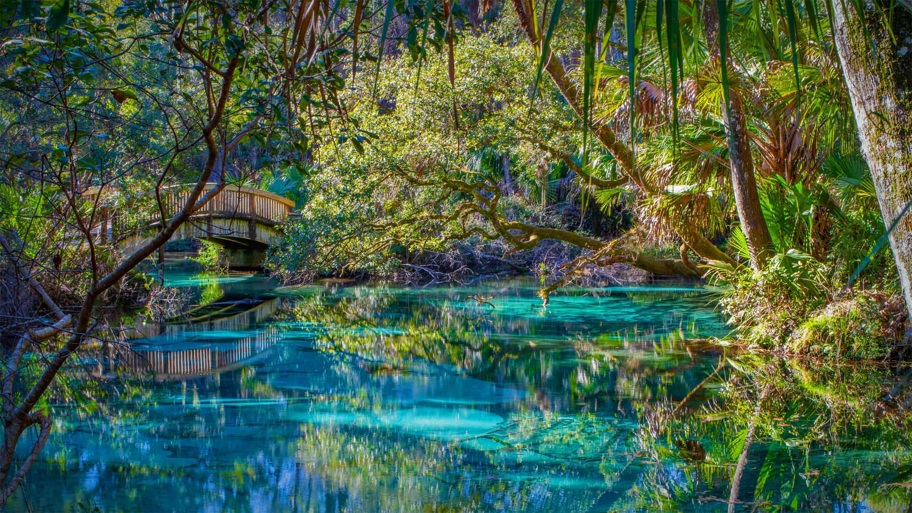
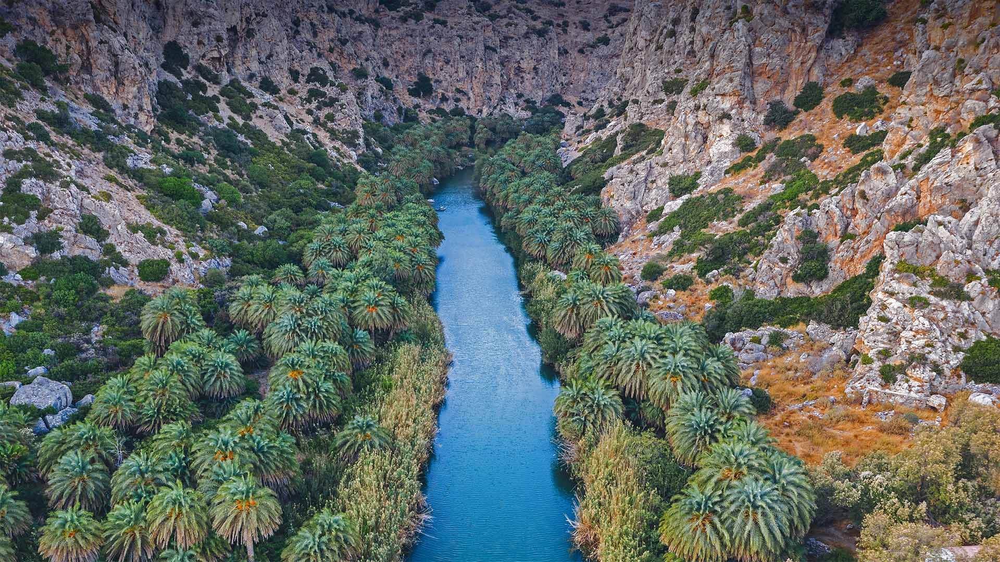
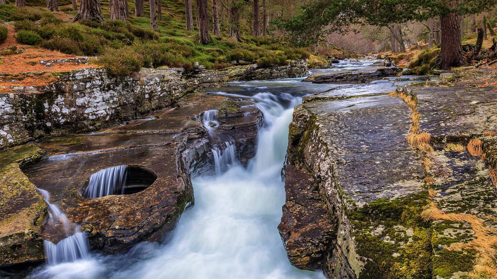
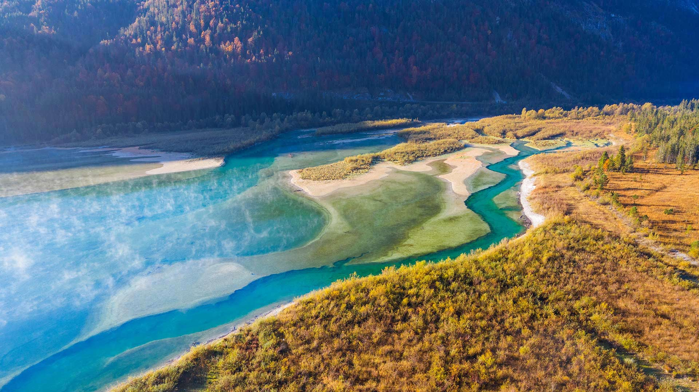
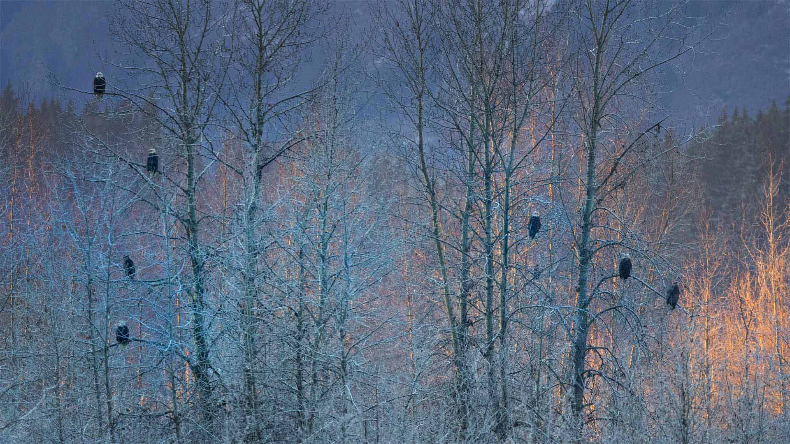
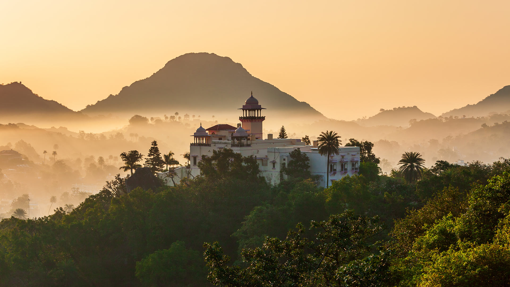
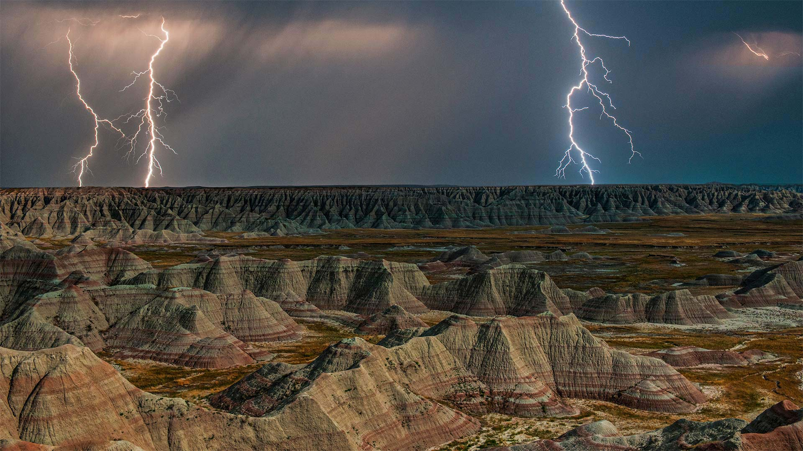
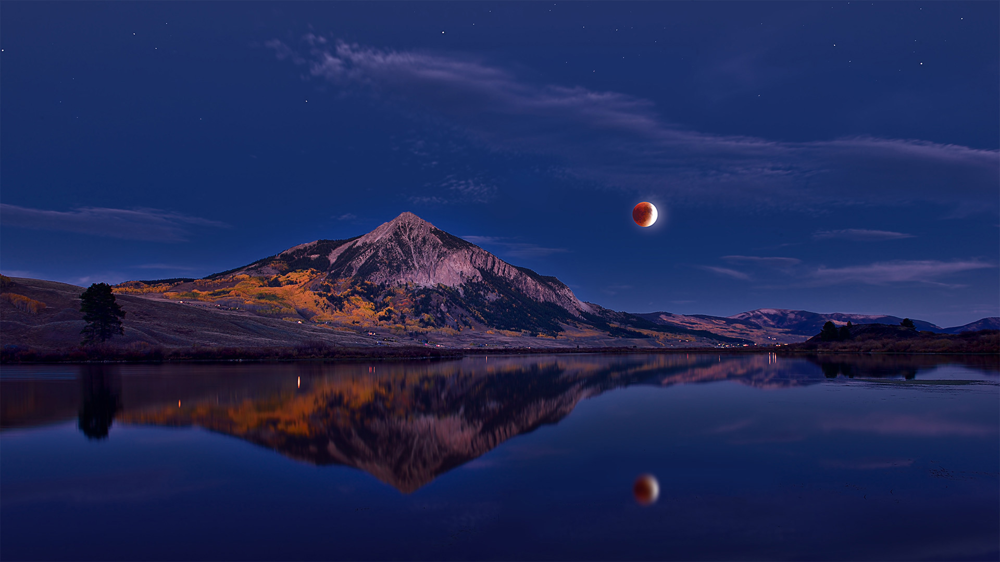
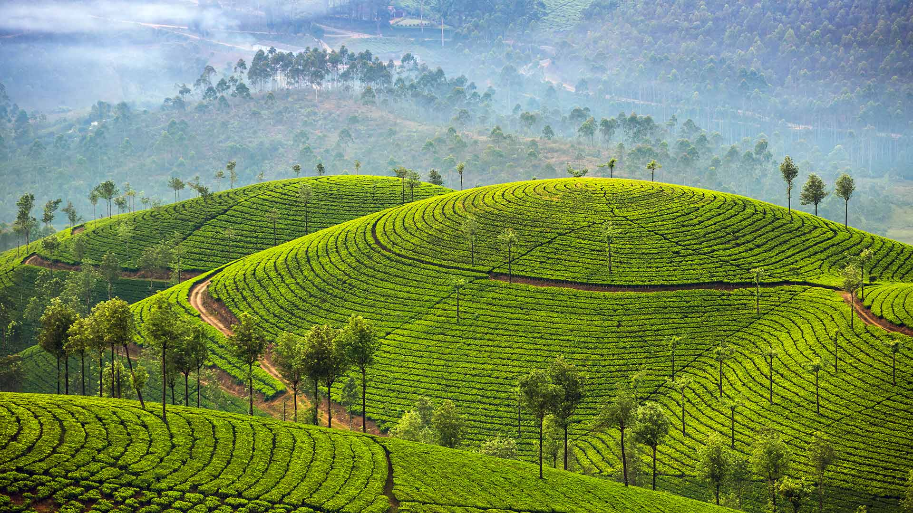

#### 20221130 The Old Town of Rovinj, Croatia (© trabantos/Shutterstock)

#### 20221129 Great blue herons building a nest in Wakodahatchee Wetlands, Delray Beach, Florida (© Imagebroker/Alamy)

#### 20221129 Blick von der Kampenwand auf die Chiemgauer Alpen, Aschau im Chiemgau, Bayern (© Toni Anzenberger/plainpicture)

#### 20221128 Mars (© NASA/Alamy)

#### 20221127 Cecropia leaf atop lobster claw petals, Mexico (© Gerry Ellis/Minden Pictures)

#### 20221126 An olive tree in front of the Temple of Concordia on the island of Sicily, Italy (© Alfio Finocchiaro/Shutterstock)

#### 20221126 People watch the Christmas lights and fireworks at the Nathan Phillips Square in Toronto on November 30, 2013 (© Canadapanda/Shutterstock)

#### 20221125 日出时分的蒂雷纳村庄，法国新阿基坦大区科雷兹省 (© Tim Mannakee/plainpicture)

#### 20221125 Juniper Springs in Ocala National Forest, Florida (© Michael Warren/Getty Images)

#### 20221125 Monks Mound at the Cahokia Mounds UNESCO World Heritage Site near Collinsville, Illinois (© Matthew Gush/Alamy)

#### 20221124 Weihnachtsmarkt an der Frauenkirche, Dresden, Sachsen (© Rüdiger Hess/geo-select FotoArt)

#### 20221124 Vue sur un lac en automne, Tignes, Savoie  (© Yuterick Bell/500px/Getty Images)

#### 20221124 Preveli gorge with river and palm tree forest, South Chania, Crete, Greece (© borchee/Getty Images)

#### 20221124 Cranberry bog (© SHSPhotography/Getty Images)

#### 20221124 坎彭万德山，基姆高地区阿绍，德国巴伐利亚州 (© Toni Anzenberger/plainpicture)

#### 20221123 Sunflower (© Dileep Chandran/Alamy)

#### 20221122 Red fox in Amsterdamse Waterleidingduinen Nature Reserve, Netherlands (© Edwin Giesbers/Minden Pictures)

#### 20221122 兼六園, 金沢 (© Darby Sawchuk/Alamy Stock Photo)

#### 20221121 The Storr, Isle of Skye, Scotland (© Aliaume Chapelle/Tandem Stills + Motion)

#### 20221121 Ahmad Bin Ali Stadium in Doha, Qatar (© Qatar 2022/Supreme Committee via Getty Images)

#### 20221121 伊索拉贝拉岛，意大利马焦雷湖 (© Massimo Ripani/eStock)

#### 20221120 'World in Progress II,' a land art painting by Saype, United Nations Headquarters, New York City (© Valentin Flauraud/Shutterstock)

#### 20221120 船底星云中的宇宙悬崖 (© NASA, ESA, CSA, and STScI)

#### 20221119 Virgin River in Zion National Park, Utah (© Jonathan Ross/Getty Images)

#### 20221118 The gates of the Royal Palace (Dar al-Makhzen) in Fez, Morocco (© Adam Smigielski/Getty Images)

#### 20221117 Bridge on the McKenzie River Trail, Willamette National Forest, Oregon (© Don Paulson/Danita Delimont)

#### 20221117 Vignes en automne, Bourgogne (© javarman3/Getty Images)

#### 20221116 Cliff dwellings in Mesa Verde National Park, Colorado (© Brad McGinley Photography/Getty Images)

#### 20221115 North American river otters swimming in Acadia National Park, Maine (© George Sanker/Minden Pictures)

#### 20221115 Braunbrustigel in Sussex, England, Vereinigtes Königreich (© Jules Cox/Minden Pictures)

#### 20221113 Ruins of the medieval castle of the Knights of St. John above the village of Chorio, Halki Island, Greece (© Massimo Ripani/eStock Photo)

#### 20221113 The Punch Bowl on the River Quoich in the Cairngorms, Aberdeenshire, Scotland (© AWL Images/Danita Delimont)

#### 20221113 伊萨尔河鸟瞰图，德国伦格里斯 (© Martin Siepmann/Offset/Shutterstock)

#### 20221112 Bald eagles near Haines, Alaska (© Marion Vollborn/Minden Pictures)

#### 20221111 The Vietnam Women's Memorial in Washington, DC (© Cvandyke/Shutterstock)

#### 20221111 An aerial picture of the Canadian National Vimy Memorial in Vimy Ridge, France (© Denis Charlet/AFP via Getty Images)

#### 20221111 Wagon dans lequel fut signé l’armistice de 1918, exposé à l’hôtel des Invalides à Paris, de 1921 à 1927 (© Hulton-Deutsch Collection/CORBIS/Corbis via Getty Images)

#### 20221111 阿拉瓦利山脉的阿布山，印度拉贾斯坦邦 (© saiko3p/Shutterstock)

#### 20221110 Peyto Lake, Banff National Park, Alberta, Canada (© Ben Girardi/Cavan Images)

#### 20221110 Rock formations in Badlands National Park during a lightning storm, South Dakota (© DEEPOL by plainpicture)

#### 20221109 Rosen in einem Mauerspalt zum Gedenken an den Jahrestag des Falls der Berliner Mauer, Berlin (© Artur Widak/Shutterstock)

#### 20221109 European hedgehog in Sussex, England (© Jules Cox/Minden Pictures)

#### 20221108 Sky lanterns take flight during the Yi Peng Festival in Chiang Mai, Thailand (© Suttipong Sutiratanachai/Getty Images)

#### 20221107 赤い実をついばむシジュウカラ (© Aflo Co., Ltd./Alamy Stock Photo)

#### 20221107 庐山冬季美景，中国江西省 (© silkwayrain/Getty Images)

#### 20221107 Lunar eclipse above Mount Crested Butte, Colorado (© Mengzhonghua Photography/Getty Images)

#### 20221106 Runners in the 1990 New York City Marathon crossing the Verrazzano-Narrows Bridge (© David Madison/Getty Images)

#### 20221105 Tigh Mor Trossachs on Loch Achray, Scotland (© Fortunato Gatto/eStock Photo)

#### 20221104 班夫国家公园的沛托湖，加拿大艾伯塔省 (© Ben Girardi/Cavan Images)

#### 20221104 Depiction of deities from the Tomb of Tutankhamun at the Egyptian Museum, Cairo, Egypt (© Stefan Lippmann/Universal Images Group via Getty Images)

#### 20221103 矢を放つ流鏑馬の射手, 東京 (© CHARLY TRIBALLEAU/Getty images)

#### 20221102 慕纳尔的茶园，印度喀拉拉邦 (© Mazur Travel/Shutterstock)

#### 20221102 The Hughes H-4 Hercules, aka the Spruce Goose, November 1947, Long Beach Harbor, California (© J R Eyerman/Shutterstock)

#### 20221102 Fort National, Saint-Malo, Brittany, France (© stevanzz/Adobe Photostock)

#### 20221102 Autumn colours in Kluane National Park and Reserve, Yukon (© David Noton Photography/Alamy Stock Photo)

#### 20221102 Seufzerbrücke, Venedig, Italien (© Doug Pearson/Alamy)

#### 20221101 Hohenzollern Castle, Swabian Alps, Baden-Württemberg, Germany (© Cornelia Dorr/eStock Photo)

#### 20221101 Skeleton figures (calacas) dressed up for Día de los Muertos celebrations in Mexico (© Amelia Fuentes Marin/Getty Images)

#### 20221101 Mount Kilimanjaro with Cape buffaloes in foreground, Amboseli Biosphere Reserve, Kenya (© RealityImages/Shutterstock)

