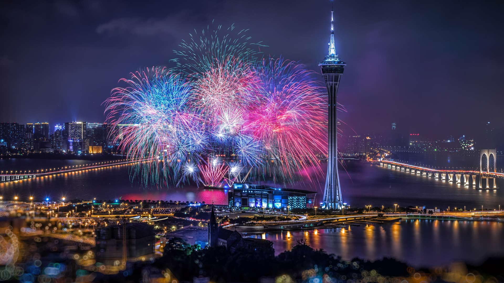
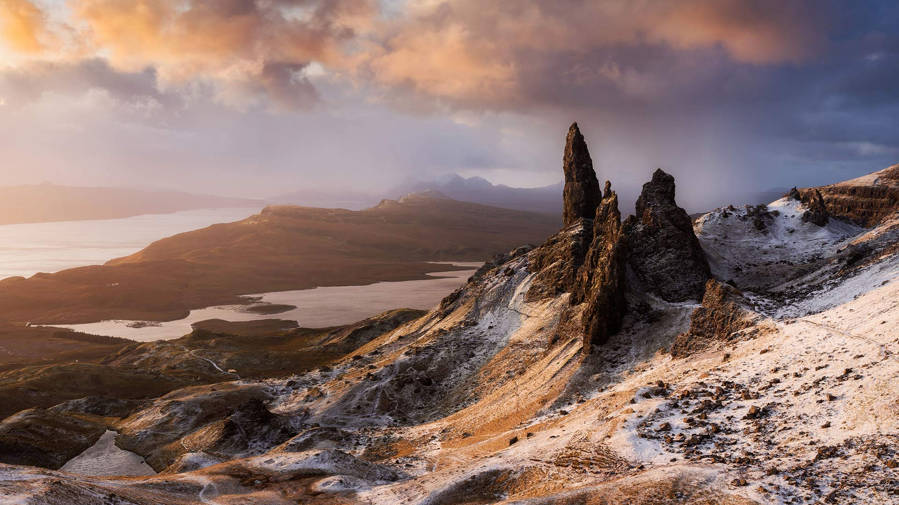
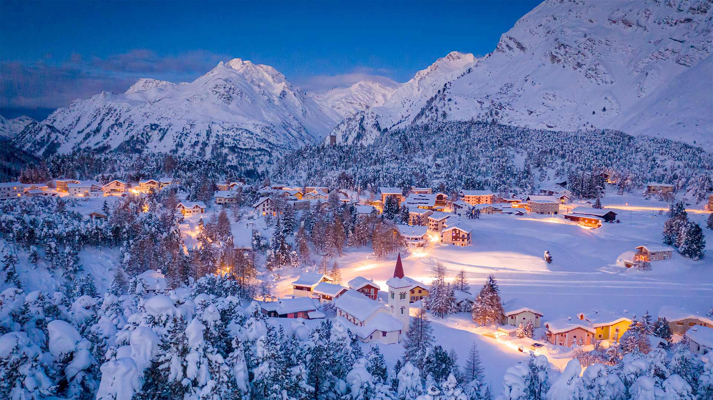
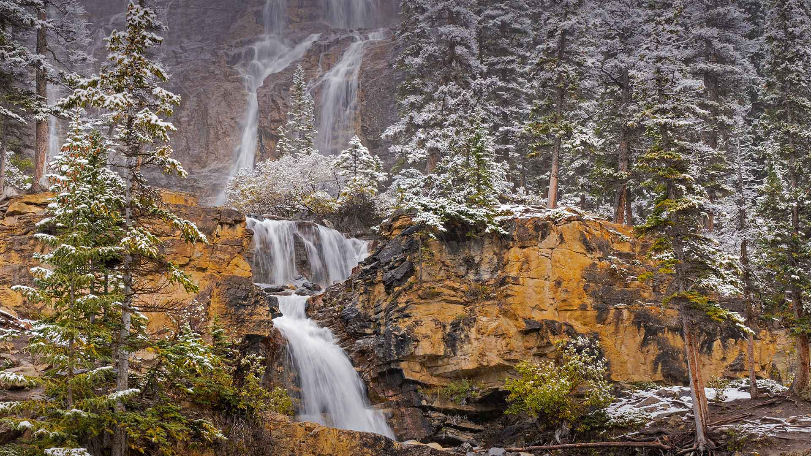
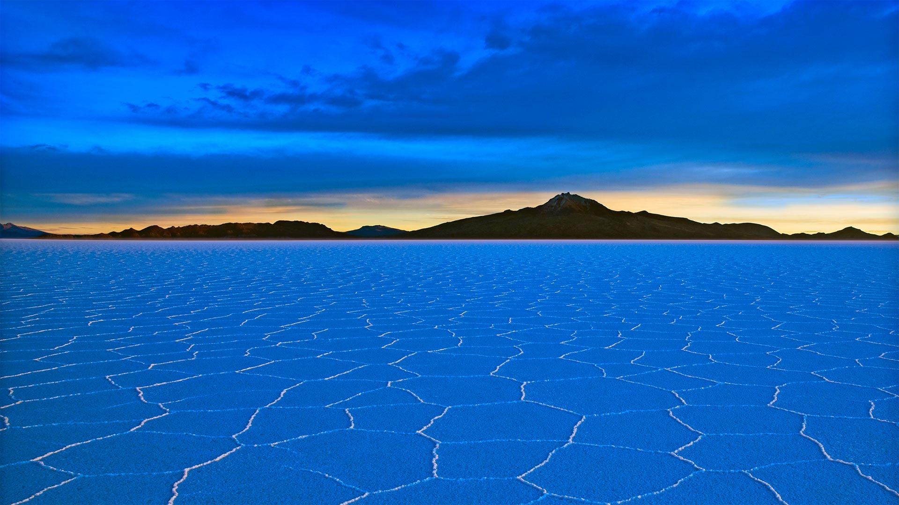

#### 20221231 一起迎接2023年 (© GettyImages)

#### 20221231 New Year's Eve fireworks, Sydney Harbour Bridge, Australia (© Wendell Teodoro/Getty Images)

#### 20221231 東大寺の梵鐘, 奈良 (© Yellow Cat/Shutterstock)

#### 20221230 Rock formations in the White Desert, Egypt (© Anton Petrus/Getty Images)

#### 20221229 斯托尔石山，天空之岛，苏格兰 (© Aliaume Chapelle/Tandem Stills + Motion)

#### 20221229 A pair of silver-studded blue butterflies (© Misja Smits/Minden Pictures)

#### 20221228 Der finnische Skispringer Antti Aalto während seines Sprungs bei der Vierschanzentournee in Oberstdorf am 29. Dezember 2020, Bayern (© Adam Pretty/Getty Images)

#### 20221227 Maloja, Switzerland (© Roberto Moiola/Getty)

#### 20221227 Blue Lagoon, Grindavík, Iceland (© Westend61/Getty Images)

#### 20221226 Beverley Westwood Common, East Yorkshire, England (© Les Gibbon/Alamy)

#### 20221225 黑梳山附近的惠斯勒小镇，加拿大不列颠哥伦比亚省 (© VisualCommunications/Getty Images)

#### 20221225 Miniature holiday scene in Strasbourg, France (© Kavalenkava Volha/Alamy)

#### 20221224 Weihnachtsbaum bei Berchtesgaden mit dem Watzmann im Hintergrund, Bayern (© Günter Gräfenhain/eStock Photo)

#### 20221224 狍子，特伦蒂诺-上阿迪杰大区，意大利 (© Federica Cattaruzzi/eStock)

#### 20221224 Amalga Harbor, Alaska (© Mark Kelley/Tandem Stills + Motion)

#### 20221223 Gentoo penguins in Antarctica (© Nature Picture Library/Alamy)

#### 20221223 湘南の宝石, 神奈川 (© kittikun thienthong/Shutterstock)

#### 20221221 Christmas tree of the Galeries Lafayette in Paris, France (© Geoffroy Van der Hasselt/AFP via Getty Images)

#### 20221221 Sun halo over Lake Antermoia in the Dolomite Mountains of Italy (© Walter Donega/Getty Images)

#### 20221220 Christmas market at Belvedere in Vienna, Austria (© Diyana Dimitrova/Alamy)

#### 20221219 A northern cardinal perched in a common winterberry bush in Marion County, Illinois (© Richard and Susan Day/Danita Delimont)

#### 20221219 Annecy pendant les fêtes (© Sabine Klein/Alamy Stock Photo)

#### 20221218 South Beach in Miami Beach, Florida (© Claudia Uripos/eStock Photo)

#### 20221218 Chute de neige sur La Clusaz, Les Alpes, Janvier 2018 (© Christoph Suarez/Biosphoto/Alamy Photostock)

#### 20221218 Blue Lagoon, Grindavík, Iceland (© Westend61/Getty Images)

#### 20221217 Mountain goats at Glacier National Park in Montana (© Sumio Harada/Minden Pictures)

#### 20221216 杜德萨加尔瀑布，印度果阿 (© Lucky-photographer/Getty Images)

#### 20221216 Holiday lights in the Atlanta Botanical Garden, Georgia (© Natalia Kuzmina/Alamy)

#### 20221215 Gran Paradiso National Park, Italy (© agustavop/Getty Images)

#### 20221215 Borovets, Bulgaria (© Grigor Ivanov/Cavan Images)

#### 20221214 Great horned owls and a gilded flicker on a saguaro cactus in the Sonoran Desert, Arizona (© John Cancalosi/Minden Pictures)

#### 20221214 The 12 Days of Christmas display at Butchart Gardens, Vancouver, B.C. (© Michael Wheatley/Alamy Stock Photo)

#### 20221213 Avoriaz et le Roc d’Enfer en arrière-plan (© Jacques Pierre/Hemis/Almy Stock Photo)

#### 20221213 Hallstatt, Austria (© Jon Arnold Images Ltd/Alamy)

#### 20221212 Poinsettia plants (© Elizabeth Fernandez/Getty Images)

#### 20221211 Winter themed hand painted mail boxes for 'Sea Village' floating home residents, Granville Island, Vancouver (© Michael Wheatley/Alamy Stock Photo)

#### 20221211 Tangle Creek Falls in Jasper National Park, Alberta, Canada (© Jeff Foott/Minden Pictures)

#### 20221211 泰根塞山脉Roßstein山顶的景色，德国巴伐利亚州 (© Christian Bäck/eStock Photo)

#### 20221210 Salar de Uyuni in Bolivia (© Theo Allofs/Minden Pictures)

#### 20221208 多弗勒山-松达尔国家公园的麝牛与她的宝宝，挪威 (© Robert Haasmann/Minden Pictures)

#### 20221208 Muskox mother and calf in Dovre-Sunndalsfjella National Park, Norway (© Robert Haasmann/Minden Pictures)

#### 20221208 Le vieux Lyon et la cathédrale Saint-Jean illuminés pour la fête des lumières (© Jacques Pierre/Hemis/Alamy Stock Photo)

#### 20221208 The Cathedral of Florence, Italy (© Alexander Baert/Amazing Aerial Agency)

#### 20221207 Tangle Creek Falls in Jasper National Park, Alberta, Canada (© Jeff Foott/Minden Pictures)

#### 20221207 青い池, 北海道 (© Haruna/Getty Images)

#### 20221207 Mokoli'I Island in Kaneohe Bay, seen from Kualoa Regional Park, Oahu, Hawaii (© Riddhish Chakraborty/Getty Images)

#### 20221207 Lago Agnel und Lago Serrù im Nationalpark Gran Paradiso, Piemont, Italien (© agustavop/Getty Images)

#### 20221205 Saint Nicholas Day in Verbier, Switzerland (© Denis Balibouse/Reuters)

#### 20221205 A great egret in Everglades National Park, Florida (© Troy Harrison/Getty Images)

#### 20221205 Holzbohlenweg in den Dünen bei Wenningstedt, Sylt, Schleswig-Holstein (© Achim Thomae/Getty Images)

#### 20221205 古瓦哈提的竹子，印度阿萨姆邦 (© Page Bazar/500px/Getty Images)

#### 20221204 Elephants near Mount Kilimanjaro, Amboseli National Park, Kenya (© Diana Robinson Photography/Getty Images)

#### 20221203 Miami Beach, Florida (© Matteo Colombo/Getty Images)

#### 20221202 Tlikakila River Delta in Lake Clark National Park, Alaska (© Dawn Wilson Photography/Getty Images)

#### 20221201 江泽民逝世 (© Luca Flor/Shutterstock)

#### 20221201 Paradise Harbour, Antarctica (© SinghaphanAllB/Getty Images)

