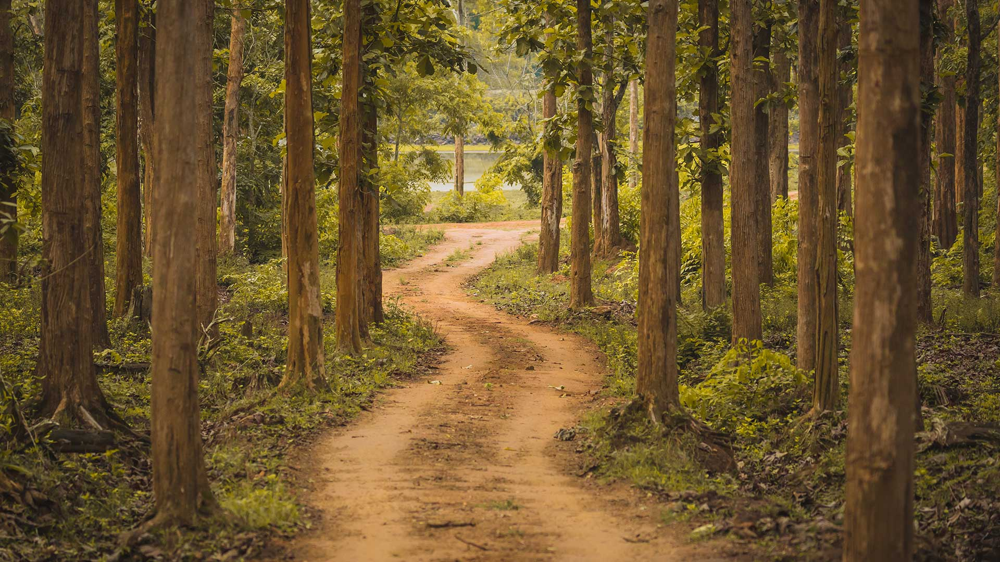
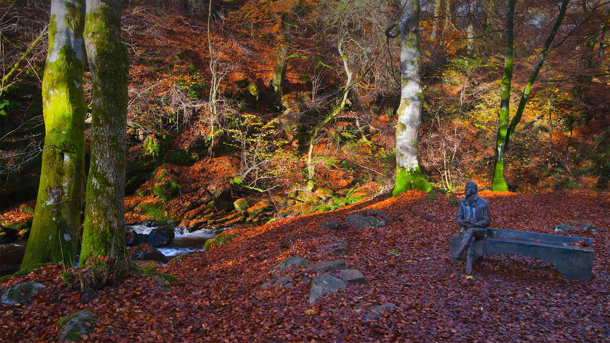
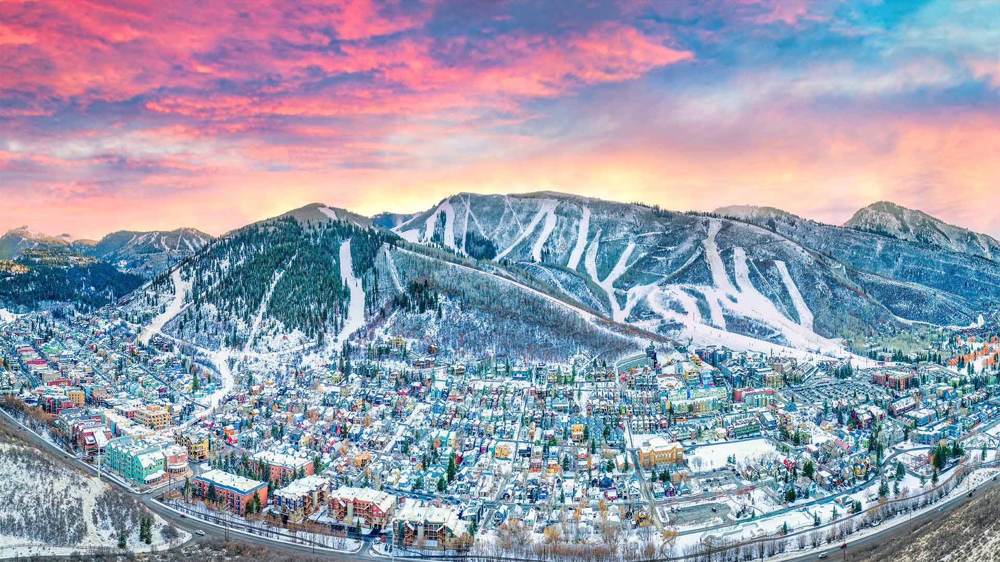
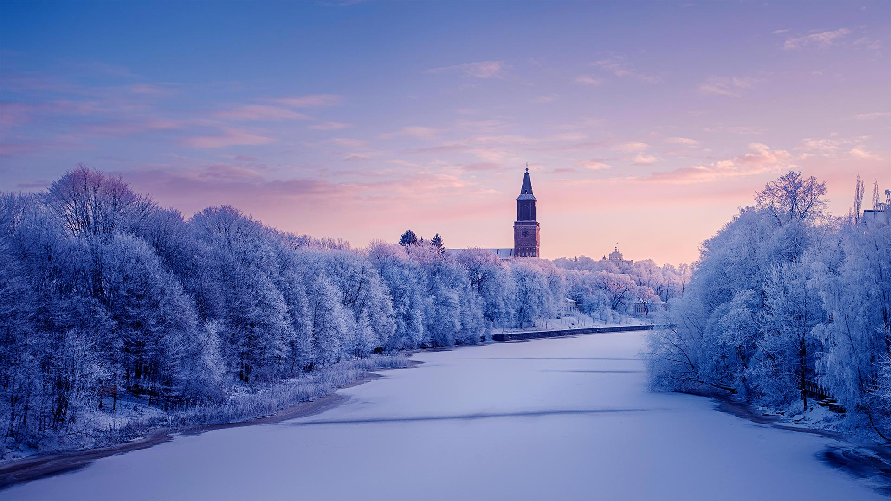
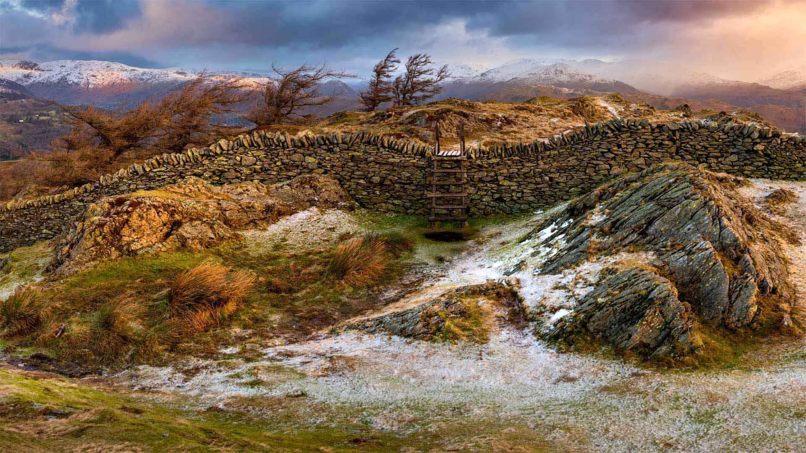

#### 20230131 Burchell's zebras, Rietvlei Nature Reserve, South Africa (© Richard Du Toit/Minden Pictures)

#### 20230131 Samenköpfe der Kanadischen Goldrute im Raureif im Morgenlicht, Wasgau, NP Pfälzerwald, Biosphärenreservat Pfälzerwald-Nordvogesen, Rheinland-Pfalz (©  mauritius images GmbH/Alamy Stock Photo)

#### 20230130 卡纳塔克邦的纳加尔霍雷国家公园，印度 (© Vivek BR/Shutterstock)

#### 20230130 Ice and Snow Sailing European Championships on Lake Balaton in Hungary (© mauritius images GmbH/Alamy Stock Photo)

#### 20230129 Blackbird in Essex, England (© Bill Coster/Alamy)

#### 20230128 Blue-green waters around the Bahamas as seen from the International Space Station (© NASA)

#### 20230127 Red mangrove tree seedlings in Guanahacabibes National Park, Cuba (© Claudio Contreras/Minden Pictures)

#### 20230126 Heaven's Gate Cave in Tianmen Mountain National Park, China (© Shane P. White/Minden Pictures)

#### 20230126 Rainforest trails along Cypress Creek, West Vancouver, BC (© Jason Wilde/TANDEM Stills + Motion)

#### 20230125 Statue of Robert Burns in the Birks of Aberfeldy, Perth and Kinross, Scotland (© Dennis Barnes/Getty Images)

#### 20230124 Colle Santa Lucia in the Dolomites, Italy (© mauritius images GmbH/Alamy)

#### 20230123 Moai statues on Easter Island, Chile (© Karine Aigner/Tandem Stills + Motion)

#### 20230122 Mountain hare in Derbyshire, England (© Ben Hall/Minden Pictures)

#### 20230122 春节的桃花和红灯笼 (© David Ng+EyeEm/Getty Images)

#### 20230121 Waschbär (Procyon Lotor) zwei Babys klettern auf den Baum (© Tim Fitzharris/Minden)

#### 20230121 Kangaroo mother and baby (© Belle Ciezak/Shutterstock)

#### 20230121 除夕夜的中国新年灯笼 (© Toa55/Getty Images)

#### 20230120 King penguins in the Falkland Islands (© Elmar Weiss/Getty Images)

#### 20230120 雪に覆われた清水寺, 京都 (© Paitoon Pornsuksomboon/Shutterstock)

#### 20230119 Park City, Utah (© Kruck20/Getty Images)

#### 20230118 White Sands National Park, New Mexico (© Andrea Harrell/Tandem Stills + Motion)

#### 20230117 Muniellos Nature Reserve in Asturias, Spain (© Andres M. Dominguez/Minden Pictures)

#### 20230116 Inscription Wall at the Martin Luther King Jr. Memorial in Washington, DC (© Ken Howard/Alamy)

#### 20230116 麦切纳山和结冰的亚伯拉罕湖，加拿大艾伯塔省 (© Tom Mackie/plainpicture)

#### 20230116 Parapente Rhone-Alpes, France (© plainpicture/Sabine Bungert)

#### 20230116 Bergpalais, Schloss Pillnitz, Dresden, Sachsen (© Rüdiger Hess/geo-select FotoArt)

#### 20230115 Aura River in Turku, Finland (© Jarmo Piironen/Alamy)

#### 20230114 Domestic donkey feeding on cherry twigs (© Juniors Bildarchiv GmbH/Alamy)

#### 20230114 Station de ski de Megeve (Megève) en Haute-Savoie dans les Alpes françaises (© Samuel Borges Photography/Shutterstock)

#### 20230113 Giant kelp in the Channel Islands National Marine Sanctuary, California (© Brandon Cole Images/Shutterstock)

#### 20230112 Rumelihisarı on the Bosporus Strait at Istanbul, Türkiye (© Drone in Wonderland/Amazing Aerial Agency)

#### 20230111 'Umschreibung,' a sculpture by artist Olafur Eliasson in Munich, Germany (© Manfred Bail/Alamy)

#### 20230111 戈德雷维灯塔，英国康沃尔郡 (© Paul Nash/Shutterstock)

#### 20230110 Le musée Hergé à Louvain la Neuve, Belgique (© Ruaridh Stewart/ZUMAPRESS.com/Alamy Stock Photo)

#### 20230110 Hummock ice on Lake Peipus in Estonia (© Sven Zacek/Minden Pictures)

#### 20230109 Teufelsbrücke im Bergpark Wilhelmshöhe, UNESCO-Welterbestätte, Kassel, Hessen (© Wilfried Martin/Alamy)

#### 20230109 Bison in Wind Cave National Park, South Dakota (© Charlie Summers/Minden Pictures)

#### 20230108 Breckenridge, Colorado (© Sean Pavone/Shutterstock)

#### 20230107 Wool and mohair yarn (© Jurate Buiviene/Alamy)

#### 20230106 Stoat (Mustela erminea), Upper Bavaria, Germany (© Konrad Wothe/Minden Pictures)

#### 20230106 Black Fell, Lake District, England (© Daniel Kay/Shutterstock)

#### 20230105 Harbin International Ice and Snow Sculpture Festival, Harbin, China (© STR/AFP via Getty Images)

#### 20230104 Earth as seen from the International Space Station (© JSC/NASA)

#### 20230103 Sandhill cranes, Bosque del Apache National Wildlife Refuge, New Mexico (© Jay Goodrich/Tandem Stills + Motion)

#### 20230102 Hohenzollern Castle, Germany (© Sahara Prince/Shutterstock)

#### 20230101 Nam Van Lake, Macau, China (© Mendowong Photography/Getty Images)

#### 20230101 Polar bear in Svalbard, Norway (© Dennis Stogsdill/Getty Images)

#### 20230101 Le Grand-Bornand, Massif des Aravis, Haute-Savoie (© Lansard Gilles/Hémis.fr/Alamy Photo Stock)

#### 20230101 富士山と日の出 (© Carlos Lorenzo/Shutterstock)

