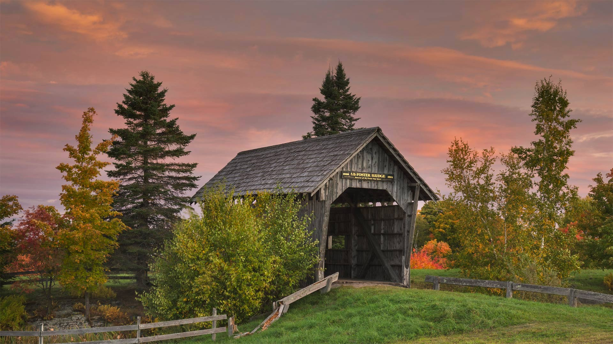
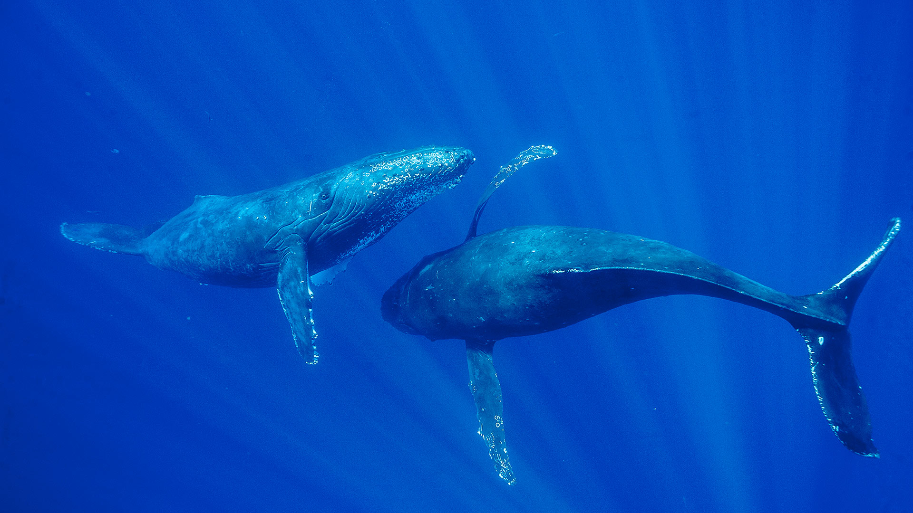
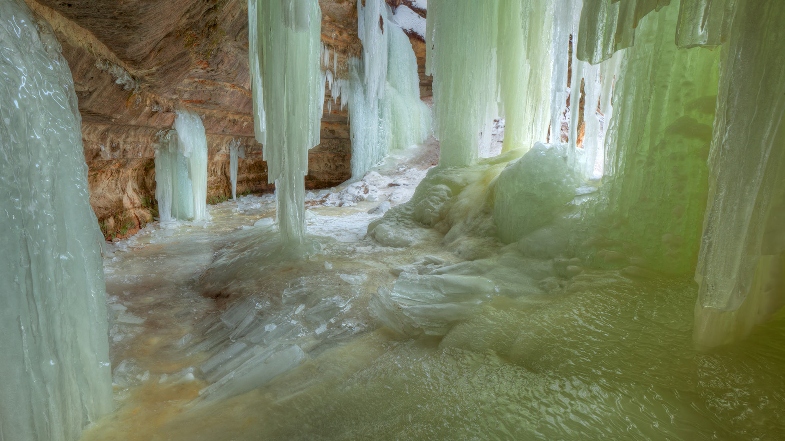
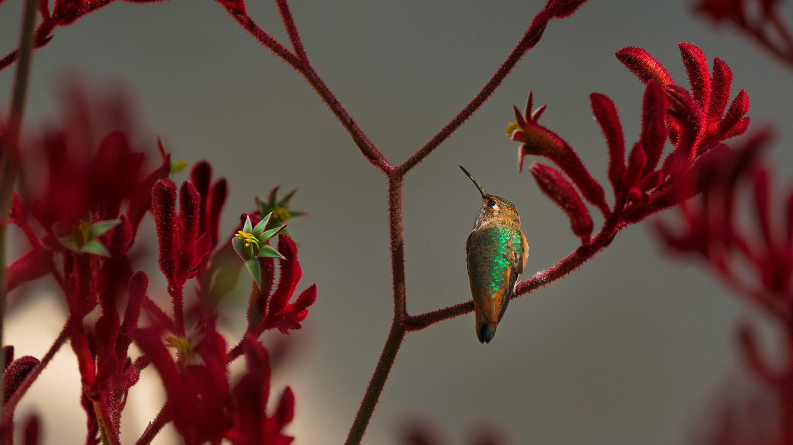
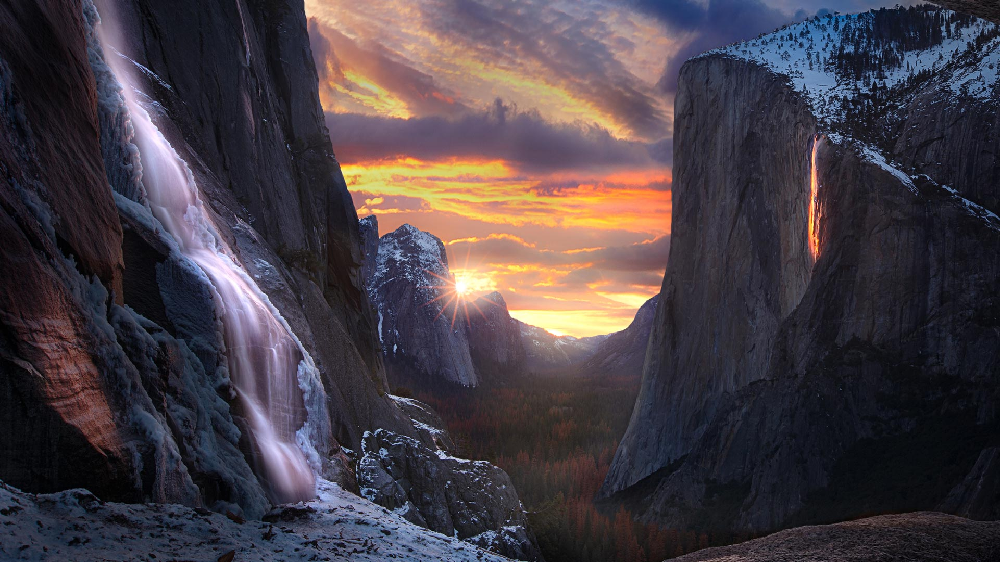
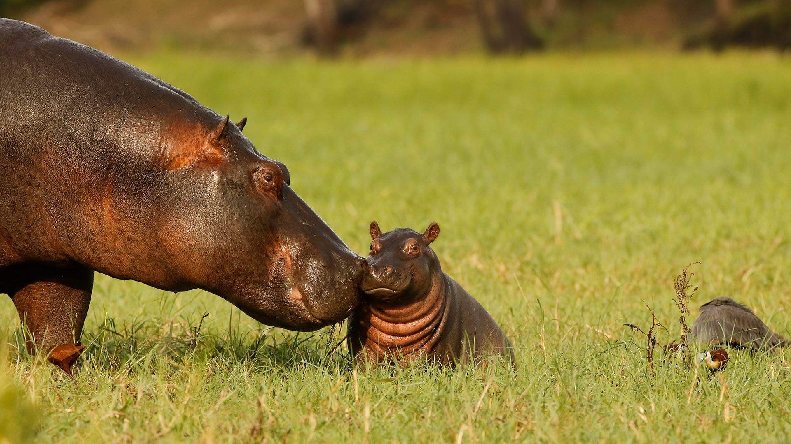
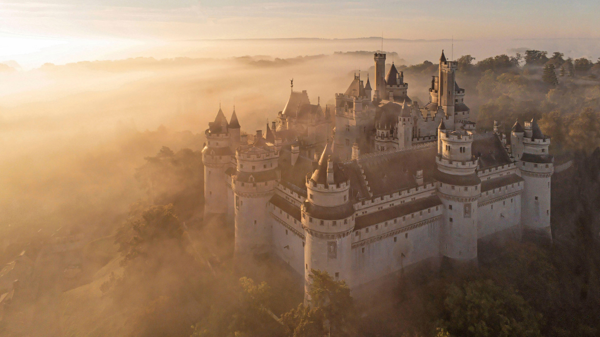

#### 20230228 Atrani, Amalfi Coast, Italy (© Amazing Aerial/Shutterstock)

#### 20230227 Polar bears asleep in Canada (© David Pike/Minden Pictures)

#### 20230226 Reproductions fresques de la Grotte de Chauvet, Ardèche, France (© Abaca Press/Alamy Stock Photo)

#### 20230226 Suspension bridge in Tambopata National Reserve, Amazon Basin, Peru (© Pere Rubi/Getty Images)

#### 20230225 Hoodoos at Bryce Canyon National Park, Utah (© Piriya Photography/Getty Images)

#### 20230224 Mandarin duck, Richmond Park, London, England (© Oscar Dewhurst/Minden Pictures)

#### 20230223 水面に映る紅富士, 山梨 (© Nyoman Sundra/Getty Images)

#### 20230223 Paris, France (© somchaij/Shutterstock)

#### 20230223 克罗索尔山谷，斯诺多尼亚国家公园，英国威尔士 (© Matthew Williams Ellis/Plainpicture)

#### 20230222 パリ, フランス (© somchaij/Shutterstock)

#### 20230222 菲希特尔山脉上的和平钟，萨克森州，德国 (© Jan Drahokoupil/Getty Images)

#### 20230222 Freedom Sunday rally, Soldier Field, Chicago, Illinois, July 10, 1966 (© Bettmann/Getty Images)

#### 20230222 Foster Covered Bridge in Cabot, Vermont (© Alan Majchrowicz/Getty Images)

#### 20230221 French Quarter, New Orleans, Louisiana (© f11photo/Getty Images)

#### 20230220 カナダヅル, 米国 ニューメキシコ州 (© Jay Goodrich/Tandem Stills + Motion)

#### 20230220 Washington Monument and Capitol Building on the National Mall, Washington, DC (© AevanStock/Shutterstock)

#### 20230220 Itaimbezinho峡谷，巴西 (© NidoHuebl/Getty Images)

#### 20230220 Guggenheim Museum Bilbao, Bilbao, Spain (© Jeremy Horner/Getty Images)

#### 20230220 Voie lactée au-dessus de Zabriskie Point, Vallée de la Mort, Californie (© Matt Anderson Photography/Getty Images)

#### 20230219 Humpback whales, Maui, Hawaii (© Flip Nicklin/Minden Pictures)

#### 20230218 Eben Ice Caves, Upper Peninsula, Michigan (© Dean Pennala/Shutterstock)

#### 20230217 Les toits de Paris sous la neige (© Brasil2/iStock/Getty Images Plus)

#### 20230217 Allen's hummingbird perched on a red kangaroo paw plant (© GypsyPictureShow/Shutterstock)

#### 20230216 'Firefall' on Horsetail Fall, Yosemite National Park, California (© Jeff Lewis/Tandem Stills + Motion)

#### 20230216 Industriekletterer besteigen den Berlinale-Bären im Kino Zoo-Palast, Berlin (© Britta Pedersen/dpa/Alamy Live News)

#### 20230215 Hippopotamus mother and baby, Chobe National Park, Botswana (© jacobeukman/Getty Images)

#### 20230214 Igloo at Otaru Snow Light Path Festival, Hokkaido, Japan (© T Photography/Shutterstock)

#### 20230213 Achaches lookout, El Valle de la Luna, Chile (© Ignacio Palacios/Getty Images)

#### 20230212 Blue-footed booby, Galápagos Islands, Ecuador (© Tui De Roy/Minden Pictures)

#### 20230211 Temple chinois Fête du Citron de 2015, Menton, Cote d'Azur, France (© Peter Seyfferth/imageBROKER/Shutterstock)

#### 20230211 The Milky Way over Zabriskie Point, Death Valley, California (© Matt Anderson Photography/Getty Images)

#### 20230210 Ancient theater of Epidaurus in Argolis province, Greece (© George Pachantouris/Getty Images)

#### 20230209 Lower Antelope Canyon near Page, Arizona (© AZCat/Getty Images)

#### 20230208 Ureddplassen, a rest area on the Helgelandskysten scenic route, Norway (© Eyesite/Alamy)

#### 20230208 艾琳多南堡，苏格兰高地 (© VisualCommunications/Getty Images)

#### 20230207 Ski hors-piste, Courchevel, France (© Andrew Lloyd/Alamy Stock Photo)

#### 20230206 Fiordland National Park in South Island, New Zealand (© WitR/Adobe Stock)

#### 20230205 毛茸茸又可爱的山兔 (© Ben Hall/Minden Pictures)

#### 20230205 Monarch butterflies at Pismo Beach, California (© Mimi Ditchie/Getty Images)

#### 20230204 Rosa Parks sits in the front of a bus in Montgomery, Alabama, Dec 21, 1956 (© Bettmann Archive/Getty Images)

#### 20230204 初春の梅に飛来したメジロ (© tahirsphotography/Shutterstock)

#### 20230204 Village of Labro, Rieti Province, Italy (© Marco Ilari/Shutterstock)

#### 20230204 永福樱花园，福建省龙岩市, 中国 (© SEN LI/Getty Images)

#### 20230204 Feldbergturm im Schwarzwald, Baden-Württemberg (© Hemis/Alamy)

#### 20230203 枡いっぱいの節分の福豆 (© Nishihama/Shutterstock)

#### 20230203 Château Frontenac, Quebec City, Canada (© Romiana Lee/Shutterstock)

#### 20230202 Alpine marmots in Hohe Tauern National Park, Austria (© Michaela Walch/Alamy)

#### 20230201 ジャスパー国立公園, カナダ アルバータ州 (© Jeff Foott/Minden Pictures)

#### 20230201 皮埃尔丰城堡，皮卡第大区，法国 (© Hemis/Alamy)

#### 20230201 'Testament: The Little Rock Nine Monument,' Little Rock, Arkansas (© Rex Lisman/Getty Images)

