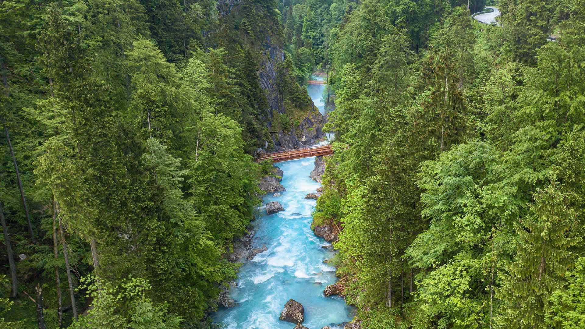
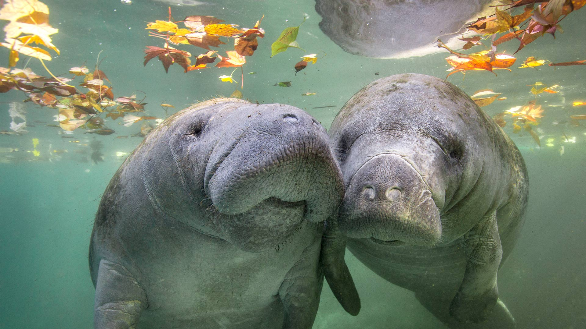
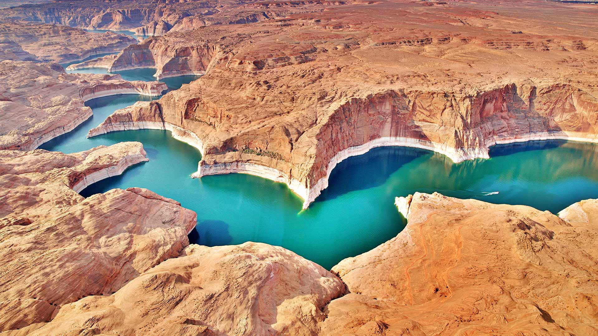
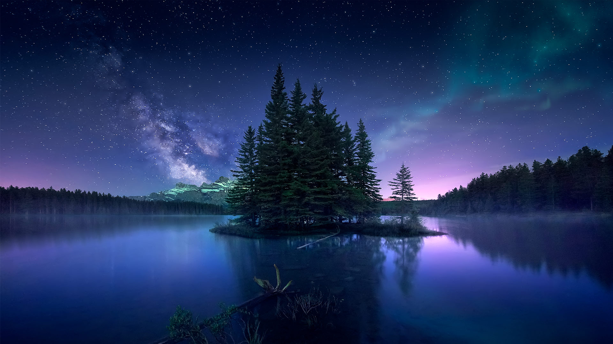
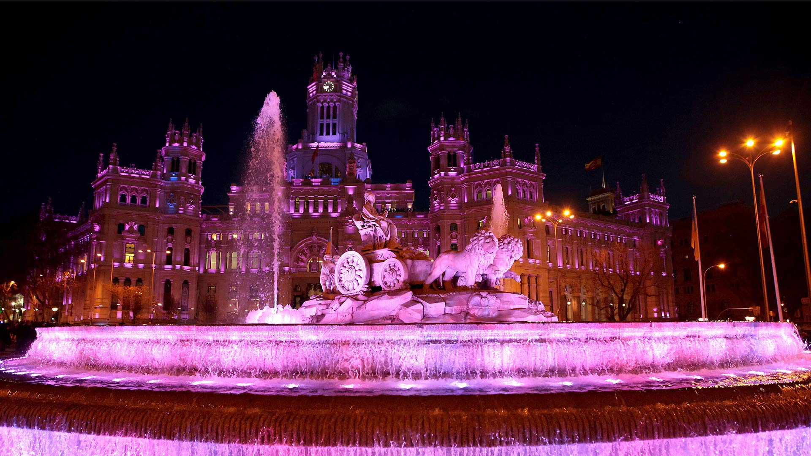
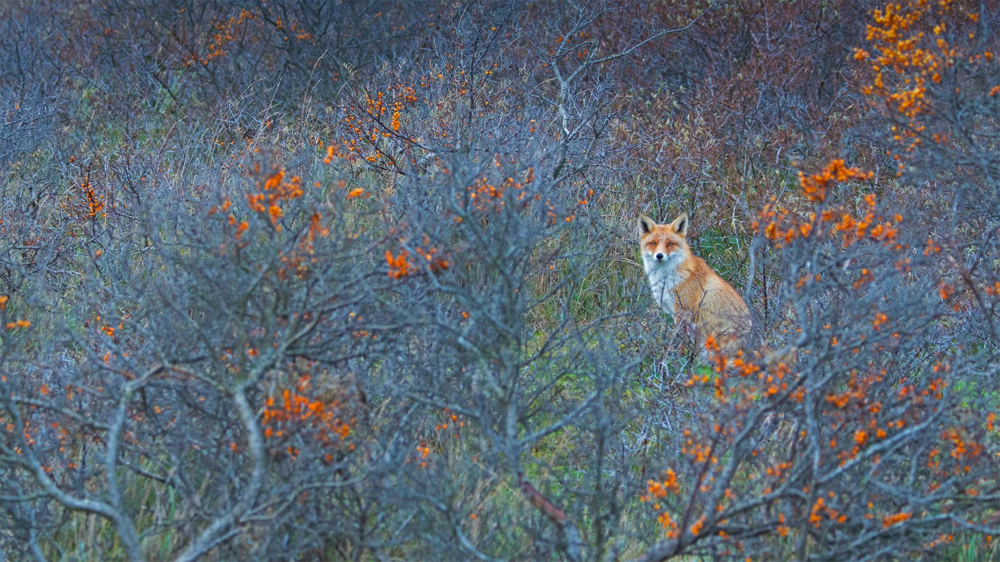
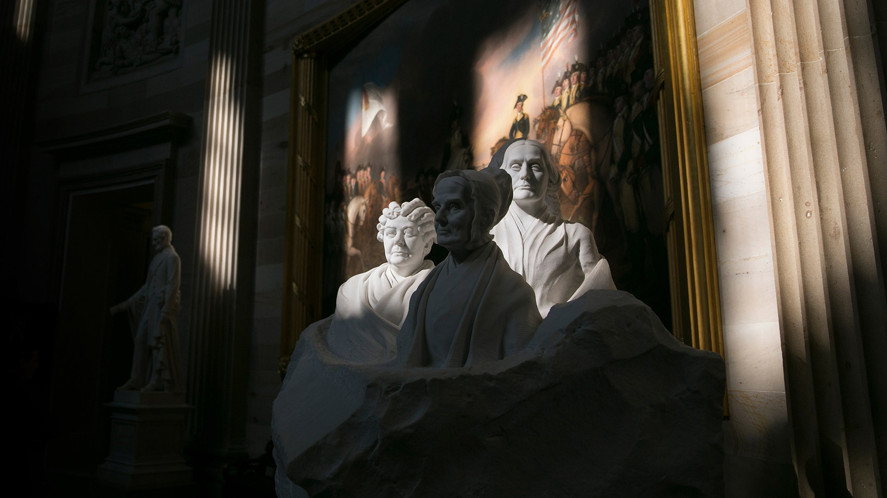

#### 20230331 Steyr River, Austria (© guenterguni/Getty Images)

#### 20230330 Peacock feathers (© Sarayut Thaneerat/Getty Images)

#### 20230329 Manatees, Crystal River, Florida (© Gregory Sweeney/Getty Images)

#### 20230328 Milky Way above the Tre Cime di Lavaredo, South Tyrol, Italy (© Juan Romero/Cavan Images)

#### 20230327 New York City skyline in fog (© Orbon Alija/Getty Images)

#### 20230326 Wildflowers in Anza-Borrego Desert State Park, California (© Ron and Patty Thomas/Getty Images)

#### 20230325 Blühender Mohn und Kornblumen in einem Rapsfeld, Penzlin (© Sandra Bartocha/Minden)

#### 20230325 Bromo Tengger Semeru National Park, East Java, Indonesia (© Bento Fotography/Getty Images)

#### 20230325 Cecil Brewer Staircase, the Heal's Building, London, England (© Yiran An/Getty Images)

#### 20230324 Blooming wild garlic, Hainich National Park, Germany (© Frank Sommariva/Getty Images)

#### 20230323 リューベック旧市街, ドイツ (© Harald Nachtmann/Getty Images)

#### 20230323 Lenticular clouds, Patagonia (© Sasha Juliard/Shutterstock)

#### 20230323 杜费里峡谷，上萨瓦省，法国 (© Jean-Philippe Delobelle/Biosphoto/Alamy)

#### 20230322 Lake Powell on the Colorado River (© Peter Schaefer/Alamy)

#### 20230320 Crocus flowers (© Raimund Linke/Getty Images)

#### 20230320 Colorful pastel chalk (© Stephen Shepherd/plainpicture)

#### 20230319 Aurora Borealis at Two Jack Lake, Alberta, Canada (© Jesús M. García/Getty Images)

#### 20230319 Erlebnisholzkugel, Steinberg am See, Bayern (© Rüdiger Hess/geo-select FotoArt)

#### 20230319 Barn owl, England (© Ondrej Prosicky/Getty Images)

#### 20230318 Gamboa Crater, Mars (© NASA/JPL-Caltech/University of Arizona)

#### 20230318 Mur peint des écrivains, Lyon, France (© Russ Bishop/Alamy Stock Photo)

#### 20230317 Ballyvooney Cove, Copper Coast Geopark, County Waterford, Ireland (© Andrea Pistolesi/Getty Images)

#### 20230316 Giant panda at Chengdu Panda Base, China (© Jim Zuckerman/Jaynes Gallery/DanitaDelimont)

#### 20230315 Agüero, Spain (© Andrea Comi/Getty Images)

#### 20230314 Hedge maze in Cyherbia Botanical Park, Cyprus (© Tpopova/Getty Images)

#### 20230313 Female lions sleeping, Serengeti National Park, Tanzania (© Cavan Images/Shutterstock)

#### 20230313 Flags of the Commonwealth of Nations (© hamzehsh12/iStock/Getty Images Plus)

#### 20230313 Atoll de Kauehi, archipel des Tuamotu, Polynésie française (© WaterFrame/Alamy Stock Photo)

#### 20230312 Lucian Blaga National Theater, Cluj-Napoca, Romania (© Thomas Mueller/Shutterstock)

#### 20230312 南唐斯国家公园的绵羊，东萨塞克斯郡，英国 (© Slawek Staszczuk/Alamy)

#### 20230312 Nahaufnahme von Gerste und Kornblumen, Nordhausen (© Mandy Tabatt/EyeEm/Getty Images)

#### 20230311 Marshland, Gloucester, Massachusetts (© Thomas H. Mitchell/Getty Images)

#### 20230311 秋元湖の朝, 福島 (© I am happy taking photographs./Getty Images)

#### 20230310 Vale of Edale, Peak District, England (© John Finney/Getty Images)

#### 20230309 Rainbow over Waimea Canyon and Waipo'o Falls, Kauai, Hawaii (© Beverley Van Praagh/Getty Images)

#### 20230308 极光展示，怀特霍斯，育空地区，加拿大 (© John Hyde/plainpicture/Design Pics)

#### 20230308 Cibeles Fountain and Madrid City Hall lit for International Women's Day, Madrid, Spain (© dpa picture alliance/Alamy)

#### 20230307 Cabins in Valley Forge National Historic Site, Pennsylvania (© Mark C. Morris/Shutterstock)

#### 20230307 Parktheater im Kurhaus Göggingen, Architekt Jean Keller, Bayern (© imageBROKER/Alamy Stock Photo)

#### 20230306 Icelandic horses standing in a field, Iceland (© Rodrigo Lourezini/Shutterstock)

#### 20230305 Aerial view of terraced rice fields, Yuanyang County, China (© AlexGcs/Getty Images)

#### 20230305 アムステルダムのウォーターライディングドゥイネン自然保護区, オランダ (© Edwin Giesbers/Minden Pictures)

#### 20230305 Cherry trees in full bloom near the Imperial Palace with Tokyo Tower in the background, Tokyo, Japan (© Jon Arnold/Danita Delimont)

#### 20230305 袋鼠妈妈和宝宝 (© Belle Ciezak/Shutterstock)

#### 20230305 Le jardin de Monet à Giverny, France (© Simon Kirwan/Alamy Stock Photo)

#### 20230304 Road to Mount Pico, Portugal (© Marco Bottigelli/Getty Images)

#### 20230303 Killer whales in the waters off Spildra, Norway (© Alex Mustard/Minden Pictures)

#### 20230303 ひな人形 (© Masayoshi Hirose/Shutterstock)

#### 20230302 Negratín Reservoir, Granada, Spain (© Andres Martinez Olmedo/Getty Images)

#### 20230301 Portrait Monument of women's suffrage pioneers, Capitol Rotunda, Washington, DC (© Andrew Harrer/Bloomberg/Getty Images)

#### 20230301 吕贝克的霍尔斯滕门，德国 (© Harald Nachtmann/Getty Images)

#### 20230301 フィヒテルベルク, ドイツ (© Jan Drahokoupil/Getty Images)

#### 20230301 Aventure dans la canopée péruvienne, réserve naturelle de Tambopata, Pérou (© Pere Rubi/Getty Images)

#### 20230301 Bridalveil Fall, Yosemite National Park, California (© Jeff Foott/Minden Pictures)

