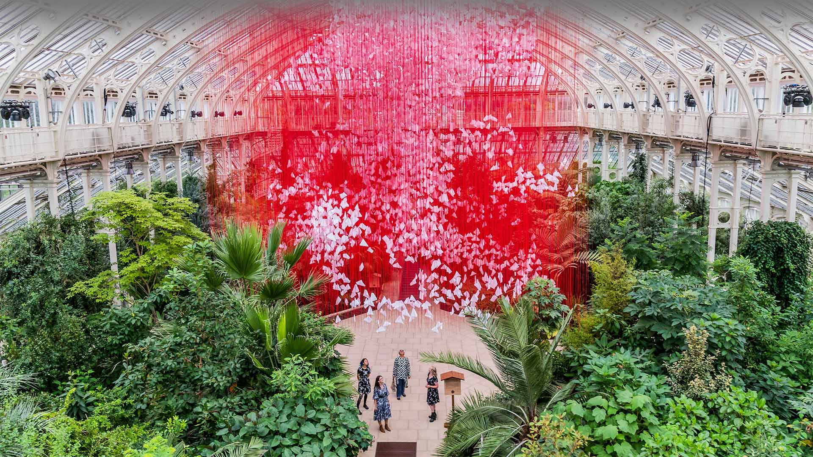
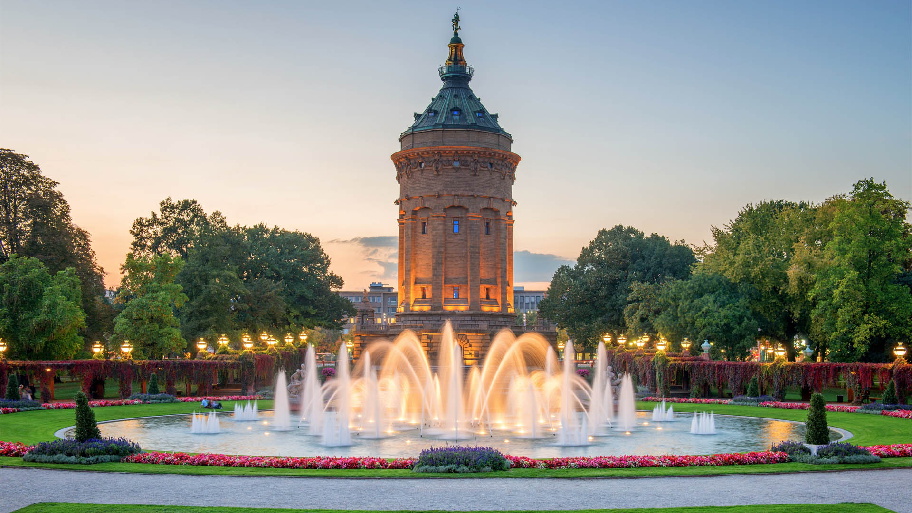
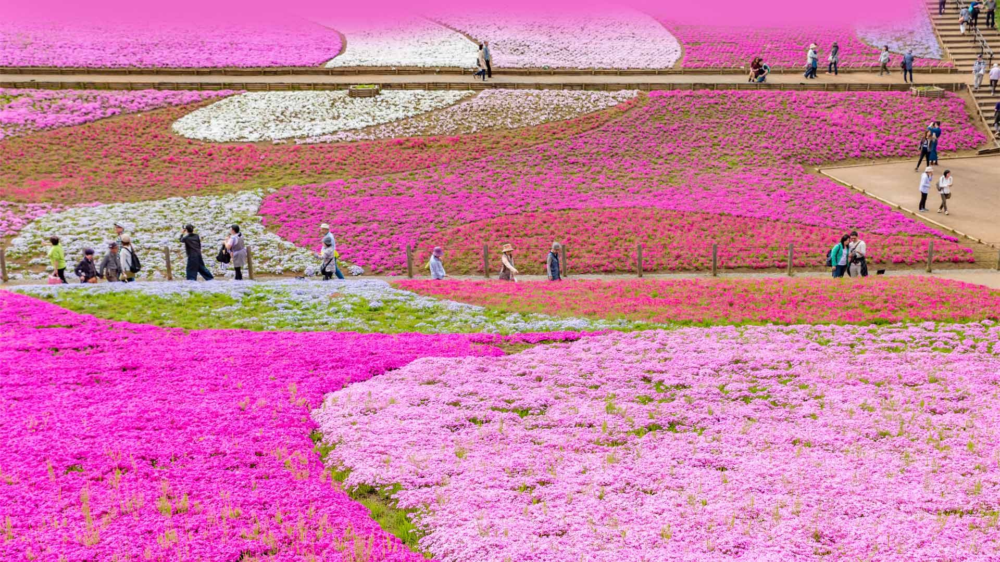
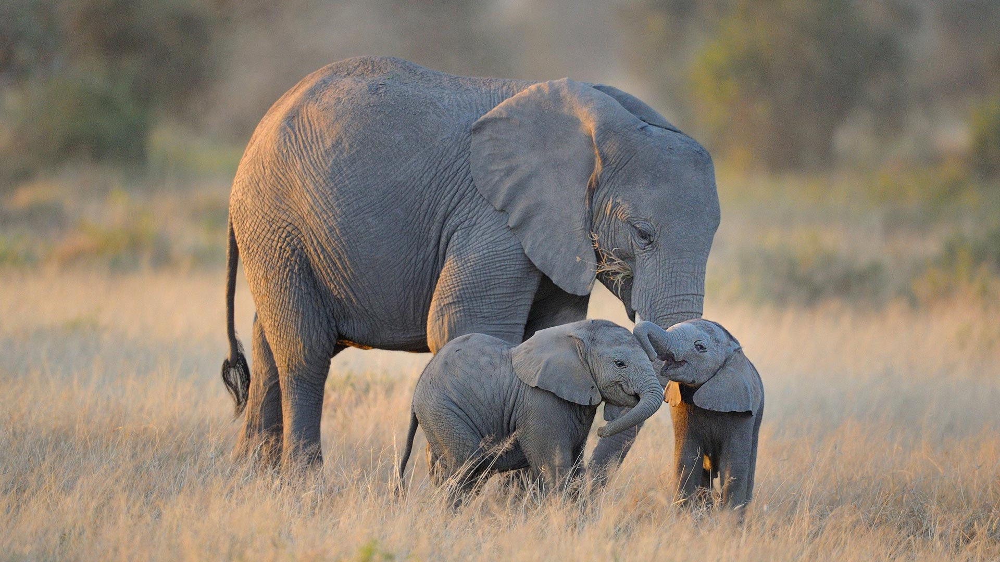
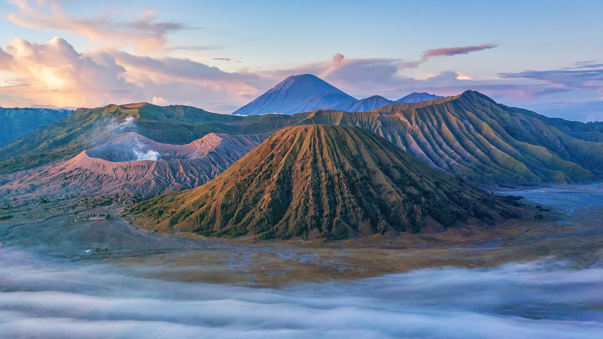

#### 20230430 塞利努斯的神庙，西西里岛，意大利 (© Antonino Bartuccio/eStock)

#### 20230430 Preservation Hall, New Orleans, Louisiana (© Cosmo Condina North America/Alamy)

#### 20230429 Milky Way over Joshua Tree National Park, California (© Schroptschop/Getty Images)

#### 20230428 Mariposa Grove of Giant Sequoias in Yosemite National Park, California (© Orbon Alija/Getty Images)

#### 20230427 South Padre Island, Texas (© Jeff R Clow/Getty Images)

#### 20230426 Cave and Basin National Historic Site, Sulphur Mountain, Banff National Park, Alberta (© Interfoto/DanitaDelimont.com)

#### 20230426 Great horned owl fledglings (© Michael Morse/Getty Images)

#### 20230425 Baumwipfelpfad Naturerbezentrum Rügen bei Prora, Rügen (© Sabine Lubenow/Huber/eStock Photo)

#### 20230425 Adélie penguins in Antarctica (© David Merron Photography/Getty Images)

#### 20230424 Wildebeests in the Maasai Mara National Reserve, Kenya (© Matt Polski/Getty Images)

#### 20230424 Old underground cellar, Bavaria, Germany (© Andreas Zerndl/Getty Images)

#### 20230423 Stuttgart Public Library, Germany (© Axel Brunst/Tandem Stills + Motion)

#### 20230423 日出时分薄雾笼罩下的薰衣草田，印度 (© Amith Nag Photography/Getty Images)

#### 20230422 Island fox in Channel Islands National Park, California (© Ian Shive/Tandem Stills + Motion)

#### 20230421 Procida, Italy (© Sean Pavone/Shutterstock)

#### 20230421 Saugues et de sa sculpture en bois de la bête du Gevaudan, Haute-Loire (© Gautier Stephane/Alamy Stock Photo)

#### 20230421 Anjuna Beach, Goa, India (© Dmitry Rukhlenko/Shutterstock)

#### 20230420 Aerial view of terraced rice fields, Yuanyang County, China (© AlexGcs/Getty Images)

#### 20230420 Juniper Springs in Ocala National Forest, Florida (© Michael Warren/Getty Images)

#### 20230420 Mossy Grotto Falls, Columbia River Gorge, Oregon (© Chase Dekker Wild-Life Images/Getty Images)

#### 20230420 南三ツ谷町の水田, 滋賀県彦根市 (© imagewerks/Getty Images)

#### 20230420 La Terre depuis la Station Spatiale Internationale (© Tim Peake/ESA/NASA via Getty Images)

#### 20230420 克雷斯特德比特山上方的月食，科罗拉多州，美国 (© Mengzhonghua Photography/Getty Images)

#### 20230419 Taiwan yuhina pair, Alishan National Scenic Area, Taiwan (© Staffan Widstrand/Minden Pictures)

#### 20230419 Hugh Coltman sur la scène du Printemps de Bourges (© Guillaume Souvant/AFP via Getty Images)

#### 20230418 Machu Picchu, Peru (© Dora Dalton/Getty Images)

#### 20230417 'One Thousand Springs' haiku art installation by Chiharu Shiota, Kew Royal Botanic Gardens, London, England (© Guy Bell/Alamy Live News)

#### 20230417 布列塔尼的小米努灯塔，法国 (© RooM the Agency/Alamy)

#### 20230416 Adelaide International Kite Festival, Australia (© Andrey Moisseyev/Alamy)

#### 20230415 Japanese cherry blossom trees in High Park, Toronto (© Oleksandra Korobova/Getty Images)

#### 20230415 从纳哈加尔城堡鸟瞰斋浦尔，印度 (© Sean3810/iStock/Getty Images Plus)

#### 20230415 'Together' sculpture by Lorenzo Quinn, Great Pyramids of Giza, Cairo, Egypt (© Sima Diab/Getty Images)

#### 20230414 Mediterranean red sea stars, Mediterranean Sea (© Hans Leijnse/Minden Pictures)

#### 20230414 ジャイアンツ・コーズウェー, イギリス 北アイルランド (© Dieter Meyrl/Getty Images)

#### 20230414 Wasserturm, Mannheim (© tichr/Getty Images)

#### 20230413 斯诺登尼亚国家公园，威尔士，英国 (© Sebastian Wasek/eStock Photo)

#### 20230413 Moss pink displays at Hitsujiyama Park, Saitama Prefecture, Japan (© Takashi Images/Shutterstock)

#### 20230412 Taiwan yuhina pair, Alishan National Scenic Area, Taiwan (© Staffan Widstrand/Minden Pictures)

#### 20230412 Earth seen from the International Space Station (© Tim Peake/ESA/NASA via Getty Images)

#### 20230411 Canada Continental Divide, Yoho National Park, Canada (© Peter Essick/Cavan Images)

#### 20230411 Tatzelwurm Holzbrücke, Essing, (© Rüdiger Hess/geo-select FotoArt)

#### 20230411 Mossy Grotto Falls, Columbia River Gorge, Oregon (© Chase Dekker Wild-Life Images/Getty Images)

#### 20230410 Aurora at Two Jack Lake, Banff National Park, Alberta, Canada (© Jesús M. García/Getty Images)

#### 20230410 Elephant family in Amboseli National Park, Kenya (© Diana Robinson/Getty Images)

#### 20230410 Colibri d'Allen perché sur la plante patte de kangourou rouge (© GypsyPictureShow/Shutterstock)

#### 20230409 Lithuanian Easter eggs (© fotomem/Getty Images)

#### 20230408 The Giant's Causeway, County Antrim, Northern Ireland (© Dieter Meyrl/Getty Images)

#### 20230408 池に咲く睡蓮 (© Masahiro Noguchi/GettyImages)

#### 20230407 Baby Eurasian beavers, Finland (© Danny Green/Minden Pictures)

#### 20230406 姫路城, 兵庫県 姫路市 (© Sean Pavone/Alamy Stock Photo)

#### 20230405 杭州西湖水墨意境般的风景，浙江省，中国 (© zhangshuang/Getty Images)

#### 20230405 Black grouse males in Kuusamo, Finland (© Markus Varesvuo/Minden Pictures)

#### 20230405 Moon rising, Tucson, Arizona (© Tim Murphy/Shutterstock)

#### 20230404 Roman bridge, Córdoba, Spain (© Jeremy Woodhouse/Getty Images)

#### 20230404 The Canadian Museum for Human Rights, Winnipeg (© Cavan Images/Alamy Stock Photo)

#### 20230403 Insel Helgoland, Schleswig-Holstein (© Iurii Buriak/Alamy Stock Photo)

#### 20230403 Pu'uhonua o Hōnaunau National Historical Park, Big Island, Hawaii (© Westend61/Getty Images)

#### 20230402 Coureurs lors du Marathon de Paris, Obélisque de la place de la Concorde, Paris (© REUTERS/Regis Duvignau)

#### 20230402 Bromo Tengger Semeru National Park, East Java, Indonesia (© Bento Fotography/Getty Images)

#### 20230402 Black grouse males in Kuusamo, Finland (© Markus Varesvuo/Minden Pictures)

#### 20230401 Phare du Petit-Minou, Plouzané, France (© RooM the Agency/Alamy Stock Photo)

#### 20230401 Javan tree frog (© kuritafsheen/Getty Images)

