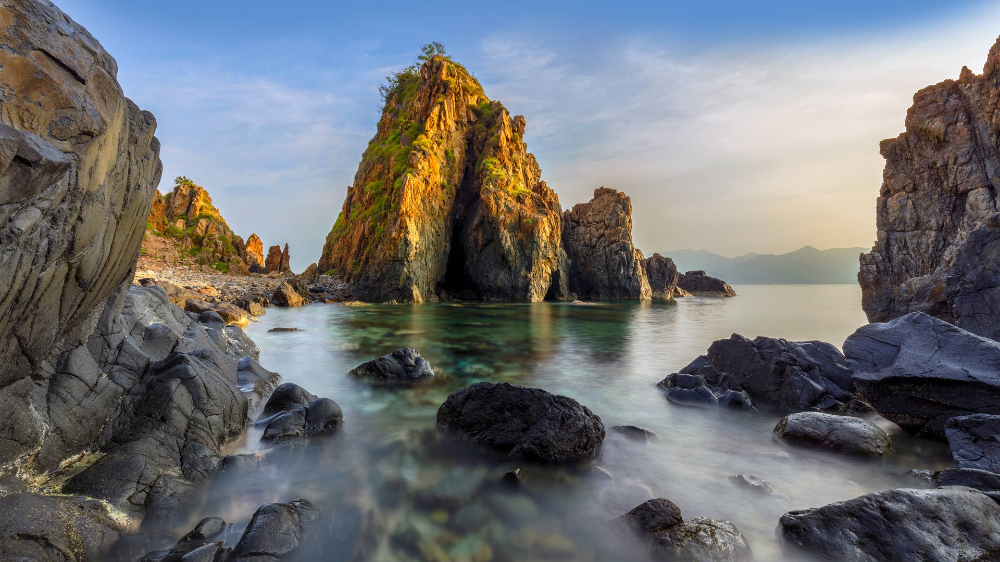
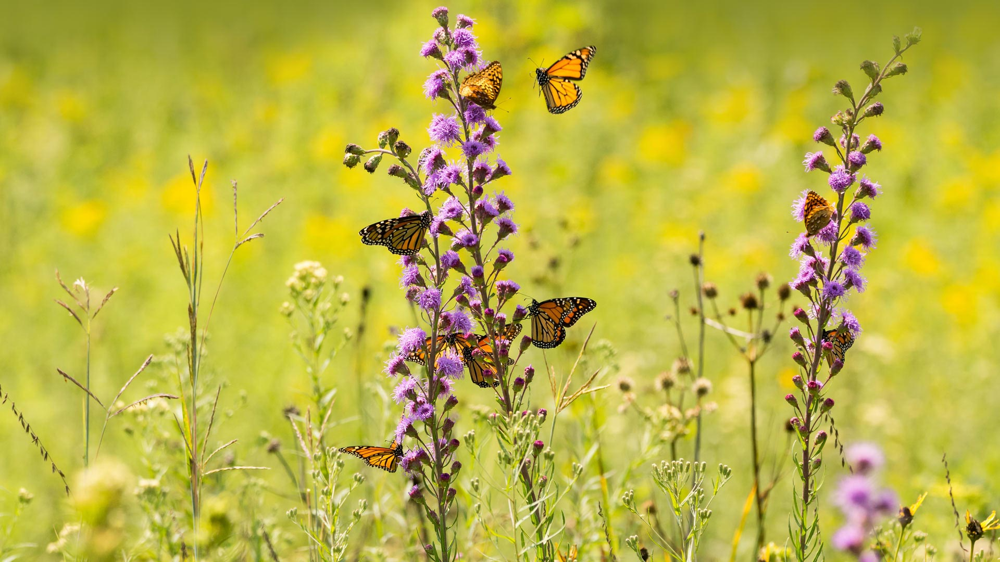
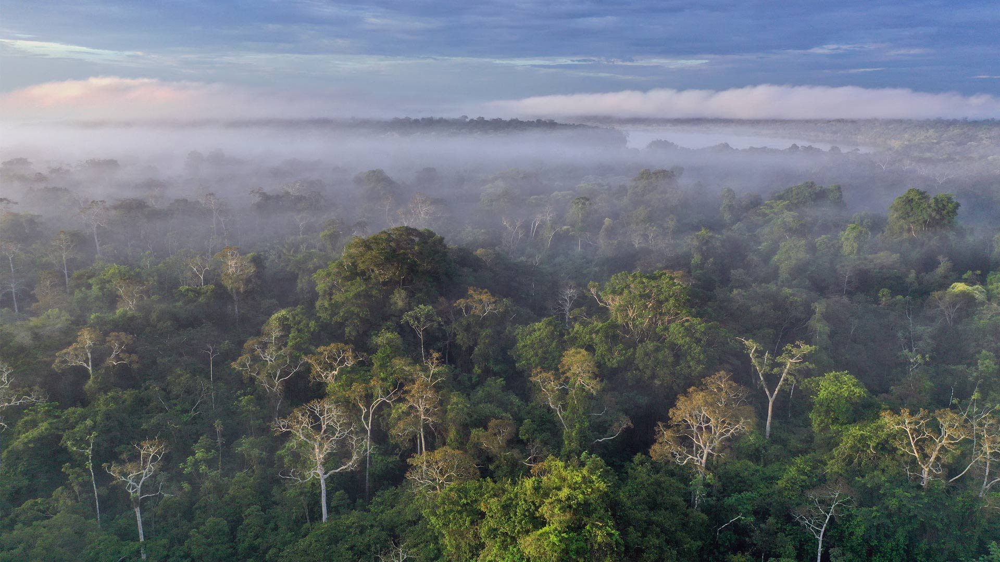
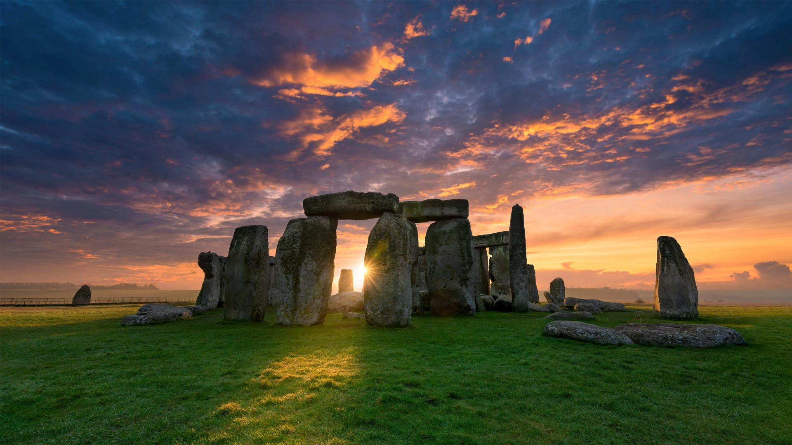
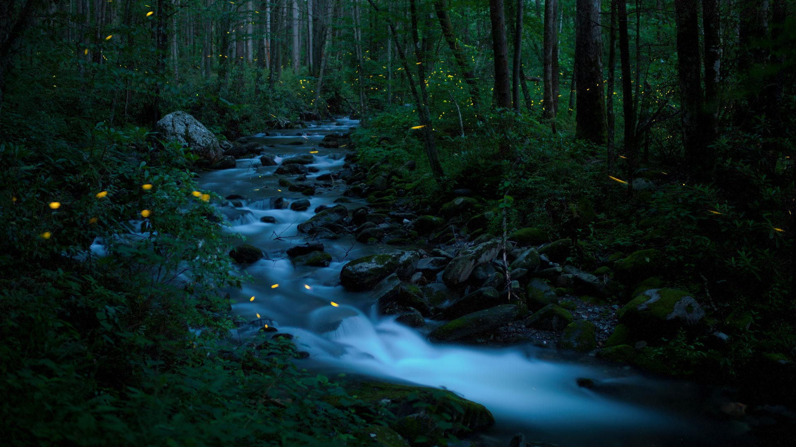
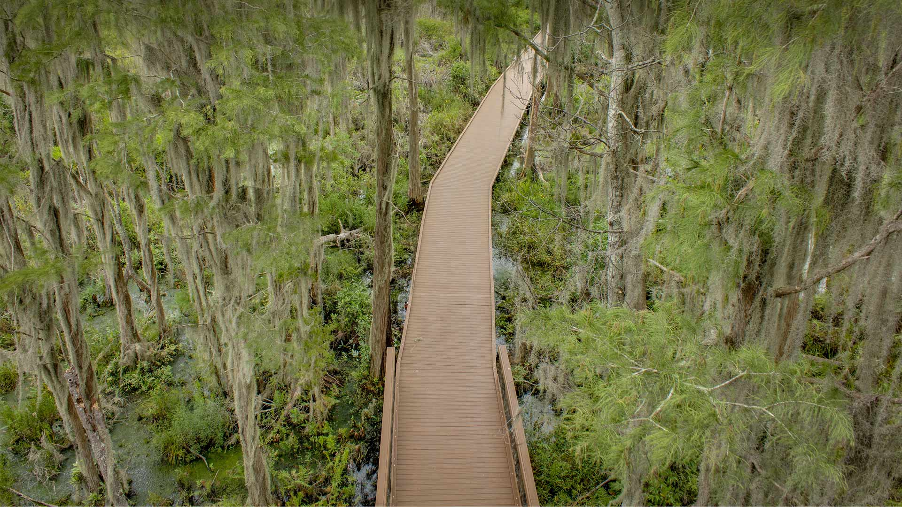
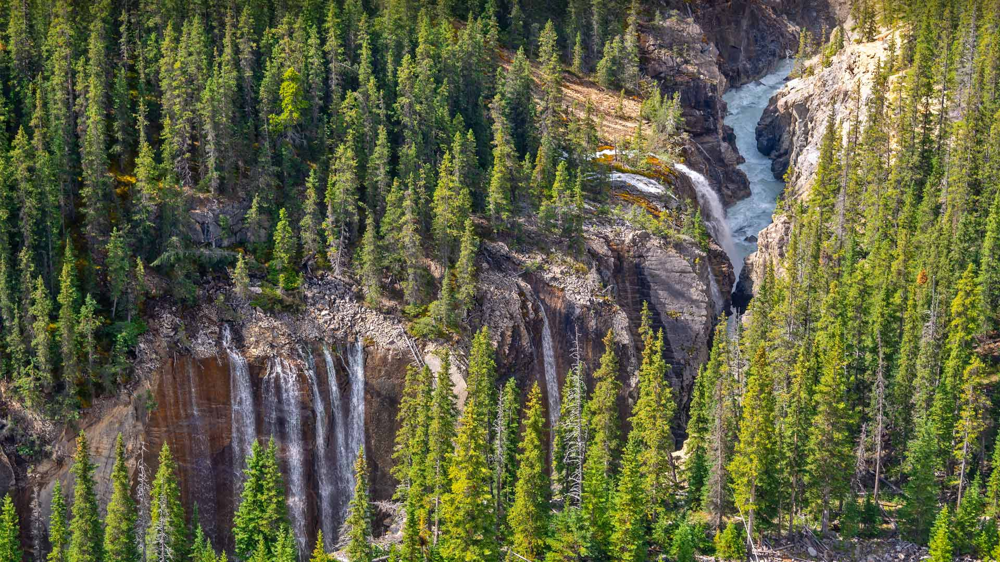
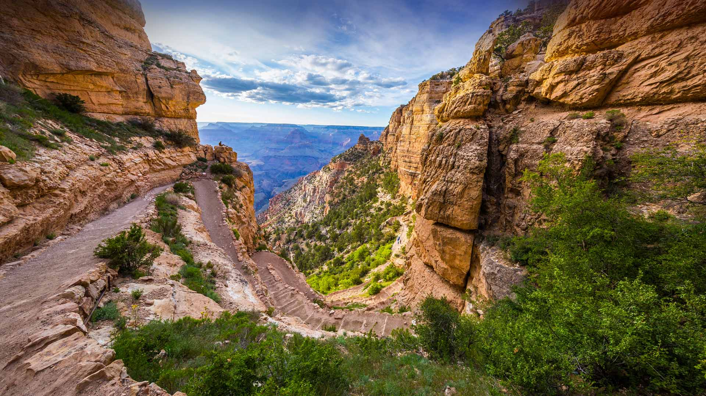

#### 20230630 Fußgängerbrücke über den See zu den Stelzenhäusern, Unteruhldingen, Baden-Württemberg (© Harald Nachtmann/Getty Images)

#### 20230630 Brown bear mother and cub, Lake Clark National Park and Preserve, Alaska (© Carlos Carreno/Getty Images)

#### 20230629 Banyak Islands, Sumatra, Indonesia (© fbxx/Getty Images)

#### 20230628 Regenbogenfahnen am Münchner Rathaus (© FooTToo/iStock/Getty Images Plus)

#### 20230628 Rainbow flags and confetti, Reykjavík, Iceland (© Arctic-Images/Getty Images)

#### 20230628 韦尔纳扎，五渔村，意大利 (© Rubin Versigny/Getty Images)

#### 20230627 Sedona, Arizona (© Jonathan Ross/Getty Images)

#### 20230626 Château de Villandry and its garden, Loire Valley, France (© VLADJ55/Shutterstock)

#### 20230625 Al-Khazneh (the Treasury), Petra, Jordan (© WitthayaP/Shutterstock)

#### 20230624 Beleuchteter Innenraum, Sony Center, Berlin (© travelstock44/Alamy Stock Photo)

#### 20230624 Nha Phu Bay, Nha Trang, Vietnam (© Thang Tat Nguyen/Getty Images)

#### 20230623 Abbaye et baie du Mont Saint-Michel, Normandie (© Mathieu Rivrin/Getty Images)

#### 20230623 Monarch butterflies feeding from wildflowers (© bookguy/Getty Images)

#### 20230622 Amazon rainforest, Peru (© Rhett Ayers Butler/Getty Images)

#### 20230622 中国传统节日端午节 (© timekeep/Shutterstock)

#### 20230621 奥入瀬渓流, 青森県 (© yspbqh14/Shutterstock)

#### 20230621 夏日盛开的荷花 (© pandemin/Getty Images)

#### 20230621 Ancient rock carvings at Petroglyph Provincial Park in Nanaimo, Canada (© Chase Clausen/Shutterstock)

#### 20230620 Bald eagle, Tongass National Forest, Alaska (© Jaynes Gallery/Shutterstock)

#### 20230619 Stonehenge, Salisbury Plain, Wiltshire, England (© Captain Skyhigh/Getty Images)

#### 20230619 City Hall lit up for Juneteenth in San Francisco, California (© yhelfman/Shutterstock)

#### 20230619 ケベック橋, カナダ ケベック州 (© Ronald Santerre/Getty Images)

#### 20230619 奔跑在诺曼底草地上的小狍，法国 (© Gerard Lacz/Minden)

#### 20230618 Common tern father with chick, Nickerson Beach, Long Island, New York (© Vicki Jauron, Babylon and Beyond Photography/Getty Images)

#### 20230618 Castelluccio, Umbria, Italy (© Stefano Termanini/Getty Images)

#### 20230617 'Paddle Out for Unity' event in San Diego, California (© Brandon Colbert Photography/Getty Images)

#### 20230616 Hawksbill sea turtle swimming near Akajima, Okinawa, Japan (© Robert Mallon/Getty Images)

#### 20230615 Synchronous fireflies, Great Smoky Mountains National Park, Tennessee (© Floris Van Bruegel/Minden Pictures)

#### 20230614 Waterfalls in Sunwapta Valley, Jasper National Park, Canada (© Delpixart/Getty Images)

#### 20230614 Cathédrale de Porto, Portugal (© Reinhard Schmid/Huber/eStock Photo)

#### 20230614 多瑙河畔的帕绍市，巴伐利亚，德国 (© Scott Wilson/Alamy)

#### 20230614 US Capitol building and US flags, Washington, DC (© Orhan Cam/Shutterstock)

#### 20230613 Trees with Spanish moss over a boardwalk in the Okefenokee Swamp, Folkston, Georgia (© Emmer Photo/Alamy)

#### 20230612 Prickly pear cactus, Big Bend National Park, Texas (© Tim Fitzharris/Minden Pictures)

#### 20230611 Goliath heron, Kruger National Park, South Africa (© Johan Swanepoel/Alamy)

#### 20230611 Tulpenblüten auf der Insel Mainau, Bodensee (© Reinhard Schmid/Huber/eStock Photo)

#### 20230611 美の山公園, 埼玉県 秩父市 (© SOURCENEXT/Alamy Stock Photo)

#### 20230610 Porto Cathedral, Portugal (© Reinhard Schmid/Huber/eStock Photo)

#### 20230610 Vue aérienne du circuit Bugatti, Le Mans (© Lou Benoist/AFP via Getty Images)

#### 20230609 Hot air balloons in Cappadocia, Türkiye (© Anton Petrus/Getty Images)

#### 20230608 Humpback whale (© Philip Thurston/Getty Images)

#### 20230607 Pueblo Bonito, Chaco Culture National Historical Park, New Mexico (© Ian Shive/Tandem Stills + Motion)

#### 20230606 森の中で輝く蛍たち (© Trevor Williams/Getty images)

#### 20230606 The chalk cliffs of Étretat, Normandy, France (© MarcelloLand/Getty Images)

#### 20230605 辛华达峡谷的瀑布，贾斯珀国家公园，加拿大 (© Delpixart/Getty Images)

#### 20230605 'Priscilla the Parrotfish' art installation at Como Park Zoo & Conservatory, St. Paul, Minnesota (© Michael Siluk/UCG/Universal Images Group via Getty Images)

#### 20230604 Biche de Virginie et son faon, Montana  (© Donald M. Jones/Minden Pictures)

#### 20230604 Black sand beach at Wai'ānapanapa State Park, Maui, Hawaii (© Matt Anderson Photography/Getty Images)

#### 20230603 South Kaibab Trail in Grand Canyon National Park, Arizona (© Roman Khomlyak/Getty Images)

#### 20230602 Gemsbok (Oryx gazella) in sand dunes, Namibia (© Sergey Gorshkov/Minden)

#### 20230601 Aerial image of the Great Barrier Reef, Australia (© AirPano LLC/Amazing Aerial Agency)

